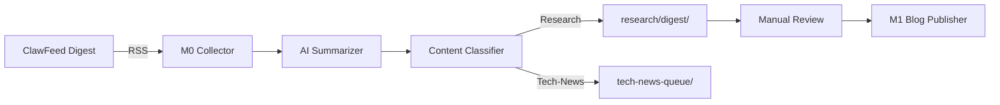

# ClawFeed 集成分析与二次开发建议

## 一、ClawFeed 核心能力总结

| 能力维度 | 功能描述 | 技术特点 |
|---------|---------|---------|
| **多源聚合** | Twitter/X、RSS、Reddit、GitHub、HackerNews | 支持OAuth + API Key双模式 |
| **AI摘要** | OpenAI/Claude生成结构化摘要 | 支持4h/日/周/月多频率 |
| **Source Packs** | 信息源配置打包分享 | JSON配置 + SQLite存储 |
| **Skill架构** | 可作为OpenClaw/Zylos Skill运行 | 模块化、可组合 |
| **反向输出** | 生成RSS/JSON Feed | `/feed/:slug.rss`端点 |
| **部署模式** | Standalone / Skill / Docker | SQLite零配置 |

---

## 二、与当前Blog项目的契合度分析

### 2.1 契合点（高价值）

```
┌─────────────────────────────────────────────────────────────┐
│                    当前Blog工作流                            │
├─────────────────────────────────────────────────────────────┤
│  research/ → 写作 → src/content/blog/ → M1 → M2 → M3       │
│     ↑                                                    │
│  信息收集（痛点：耗时、分散、缺乏AI辅助）                    │
└─────────────────────────────────────────────────────────────┘
                              ↓
┌─────────────────────────────────────────────────────────────┐
│              ClawFeed 可填补的能力缺口                       │
├─────────────────────────────────────────────────────────────┤
│  ✓ 自动化信息聚合 → 替代手动刷推/RSS                        │
│  ✓ AI摘要生成 → 快速判断内容价值                            │
│  ✓ Source Packs → 建立领域专家信息源配置                    │
│  ✓ 多频率Digest → 匹配Research/Progress-Report节奏          │
│  ✓ 反向RSS输出 → 可被现有pipeline消费                       │
└─────────────────────────────────────────────────────────────┘
```

### 2.2 架构匹配度

| 维度 | Blog项目 | ClawFeed | 匹配度 |
|-----|---------|---------|-------|
| **技术栈** | Astro + Node.js | Node.js + SQLite | ✅ 高度匹配 |
| **部署** | Cloudflare Pages | Self-hosted / Docker | ✅ 可并行部署 |
| **数据存储** | 静态文件 | SQLite | ✅ 可联动 |
| **扩展方式** | pipeline脚本 | Skill架构 | ✅ 理念一致 |

---

## 三、集成方案设计

### 方案A：独立服务 + RSS桥接（推荐初期）

```
┌─────────────────┐     RSS/JSON      ┌─────────────────┐
│   ClawFeed      │ ─────────────────→│  Blog Pipeline  │
│   (独立部署)     │                   │  (消费Digest)    │
│   :8767         │                   │                 │
└─────────────────┘                   └─────────────────┘
         │                                      │
         ↓                                      ↓
┌─────────────────┐                   ┌─────────────────┐
│  Source Packs   │                   │  research/      │
│  - AI-Trends    │                   │  - 聚合摘要     │
│  - Crypto-News  │                   │  - 引用素材     │
│  - Dev-Tools    │                   │  - 文章草稿     │
└─────────────────┘                   └─────────────────┘
```

**实现步骤：**
1. 在ClawFeed中配置关注领域的信息源（RSS优先，避免Twitter API成本）
2. 设置每日Digest生成，输出到特定RSS endpoint
3. Blog pipeline新增`clawfeed-collector`脚本，定时拉取RSS
4. 解析后的内容进入`research/digest/`目录，作为写作素材

### 方案B：Skill化集成（中期演进）

```
┌─────────────────────────────────────────────────────────────┐
│                    OpenClaw / Zylos                          │
│                     (AI Agent调度层)                          │
├─────────────────────────────────────────────────────────────┤
│  ┌─────────────┐  ┌─────────────┐  ┌─────────────────────┐ │
│  │ ClawFeed    │  │ Blog        │  │ Research Assistant  │ │
│  │ Skill       │  │ Publisher   │  │ Skill               │ │
│  │             │  │ Skill       │  │                     │ │
│  │ • 聚合信息   │  │             │  │ • 深度分析          │ │
│  │ • 生成摘要   │  │ • 创建文章   │  │ • 生成大纲          │ │
│  │ • 标注热点   │  │ • 多平台发布 │  │ • 推荐引用          │ │
│  └─────────────┘  └─────────────┘  └─────────────────────┘ │
└─────────────────────────────────────────────────────────────┘
```

**优势：**
- 统一Agent工作流，技能可复用
- 支持复杂编排（如：聚合→分析→草稿→发布）
- 与ClawFeed原生架构对齐

### 方案C：深度嵌入（长期愿景）

```
src/
├── content/
│   └── blog/                    # 现有文章
├── digest/                      # 【新增】ClawFeed集成
│   ├── config/
│   │   └── source-packs.json    # Source Packs配置
│   ├── workers/
│   │   ├── aggregator.js        # 信息聚合Worker
│   │   ├── summarizer.js        # AI摘要Worker
│   │   └── publisher.js         # 发布到blog的Worker
│   └── storage/
│       └── digest.db            # SQLite数据库
└── ...
```

---

## 四、具体二次开发路线图

### Phase 1: 基础设施（1-2周）

```bash
# 1. 部署ClawFeed实例
pipeline/
├── clawfeed/                    # 【新增】
│   ├── docker-compose.yml       # ClawFeed容器配置
│   ├── config/
│   │   ├── sources.json         # 信息源配置
│   │   └── packs/               # Source Packs
│   │       ├── ai-research.json
│   │       ├── crypto-web3.json
│   │       └── dev-tools.json
│   └── scripts/
│       ├── deploy.sh
│       └── backup.sh
```

**关键配置示例：**
```json
// pipeline/clawfeed/config/packs/ai-research.json
{
  "name": "AI Research Daily",
  "description": "AI领域核心信息源",
  "sources": [
    {"type": "rss", "url": "https://blog.openai.com/rss/", "name": "OpenAI Blog"},
    {"type": "rss", "url": "https://www.anthropic.com/rss/", "name": "Anthropic"},
    {"type": "hackernews", "filter": "AI|LLM|transformer", "name": "HN AI Topics"},
    {"type": "github", "trending": "python", "name": "GitHub Trending"}
  ],
  "digest": {
    "frequency": "daily",
    "language": "zh",
    "max_items": 20
  }
}
```

### Phase 2: Pipeline集成（2-3周）

```bash
pipeline/
├── m0/                          # 【新增】M0阶段：内容收集
│   ├── collector.js             # 主收集器
│   ├── parsers/
│   │   ├── rss-parser.js
│   │   ├── clawfeed-parser.js   # ClawFeed专用解析
│   │   └── github-parser.js
│   ├── ai/
│   │   ├── summarizer.js        # 调用LLM生成摘要
│   │   ├── classifier.js        # 内容分类（匹配blog分类）
│   │   └── curator.js           # 策展评分
│   └── output/
│       └── daily-digest.md      # 每日摘要
```

**工作流程：**


### Phase 3: 智能化增强（4-6周）

```bash
research/
├── digest/                      # AI聚合摘要
│   ├── 2026-04-10.md
│   ├── 2026-04-09.md
│   └── ...
├── sources/                     # 原始素材库
│   ├── papers/                  # 论文摘要
│   ├── repos/                   # 开源项目跟踪
│   └── threads/                 # 讨论串存档
└── curator/                     # 策展系统
    ├── ratings.json             # 内容评分
    ├── topics.json              # 主题图谱
    └── suggestions.md           # 写作建议
```

**AI策展算法：**
```javascript
// 内容评分维度
const scoringCriteria = {
  novelty: 0.3,        // 新颖性（与历史内容对比）
  relevance: 0.25,     // 与blog主题相关性
  authority: 0.2,      // 来源权威性
  engagement: 0.15,    // 社区参与度
  actionability: 0.1   // 可执行性
};

// 自动分类映射
const categoryMapping = {
  'paper-summary': 'Research',
  'tool-release': 'Tech-News',
  'experiment-log': 'Tech-Experiment',
  'progress-update': 'Progress-Report'
};
```

---

## 五、技术实现细节

### 5.1 ClawFeed API封装

```javascript
// pipeline/m0/lib/clawfeed-client.js
class ClawFeedClient {
  constructor(baseUrl, apiKey) {
    this.baseUrl = baseUrl;
    this.apiKey = apiKey;
  }

  // 获取Source Packs
  async getSourcePacks() {
    return fetch(`${this.baseUrl}/api/packs`, {
      headers: { 'Authorization': `Bearer ${this.apiKey}` }
    });
  }

  // 获取Digest
  async getDigest(packId, frequency = 'daily') {
    return fetch(
      `${this.baseUrl}/api/digests/${packId}?freq=${frequency}`,
      { headers: { 'Authorization': `Bearer ${this.apiKey}` } }
    );
  }

  // 导出为Blog可用的Markdown
  async exportToBlogFormat(digestId) {
    const digest = await this.getDigest(digestId);
    return this.transformToFrontmatter(digest);
  }

  transformToFrontmatter(digest) {
    return `---
title: '${digest.title}'
description: '${digest.summary}'
pubDate: '${digest.date}'
category: '${this.mapCategory(digest.category)}'
tags: ${JSON.stringify(digest.tags)}
sourcePack: '${digest.packId}'
clawfeedId: '${digest.id}'
---

${digest.content}

---
*本内容由ClawFeed自动生成于 ${digest.generatedAt}*
*Source Pack: [${digest.packName}](${digest.packUrl})*
`;
  }
}
```

### 5.2 定时任务配置

```yaml
# .github/workflows/daily-digest.yml
name: Daily ClawFeed Digest
on:
  schedule:
    - cron: '0 8 * * *'  # 每天8点
  workflow_dispatch:

jobs:
  collect:
    runs-on: ubuntu-latest
    steps:
      - uses: actions/checkout@v4
      
      - name: Collect from ClawFeed
        run: |
          node pipeline/m0/collector.js \
            --clawfeed-url ${{ secrets.CLAWFEED_URL }} \
            --output research/digest/
      
      - name: Generate Summary
        run: |
          node pipeline/m0/ai-summarizer.js \
            --input research/digest/ \
            --output research/daily-summary.md
      
      - name: Commit to Repo
        run: |
          git add research/digest/
          git commit -m "chore: daily digest $(date +%Y-%m-%d)"
          git push
```

### 5.3 Source Packs配置建议

针对当前Blog主题，建议配置以下Packs：

```json
{
  "packs": [
    {
      "id": "ai-research-core",
      "name": "AI研究核心源",
      "sources": [
        {"type": "rss", "url": "https://arxiv.org/rss/cs.AI", "filter": "LLM|agent|reasoning"},
        {"type": "rss", "url": "https://simonwillison.net/atom.xml"},
        {"type": "twitter", "list": "ai-researchers"},
        {"type": "github", "topics": ["llm", "agent", "rag"]}
      ]
    },
    {
      "id": "crypto-web3-daily",
      "name": "Crypto/Web3日报",
      "sources": [
        {"type": "rss", "url": "https://blockworks.co/feed"},
        {"type": "rss", "url": "https://thedefiant.io/feed"},
        {"type": "github", "trending": "rust", "topic": "blockchain"}
      ]
    },
    {
      "id": "dev-tools-spotlight",
      "name": "开发工具精选",
      "sources": [
        {"type": "hackernews", "threshold": 100},
        {"type": "github", "trending": "daily"},
        {"type": "reddit", "subreddit": "selfhosted"}
      ]
    }
  ]
}
```

---

## 六、成本与风险评估

### 6.1 成本估算

| 项目 | 成本 | 说明 |
|-----|------|-----|
| ClawFeed部署 | $0 | 自托管，无许可费 |
| AI摘要API | ~$10-30/月 | 取决于文章量和模型选择 |
| 服务器 | $5-10/月 | 轻量VPS即可 |
| **总计** | **$15-40/月** | 远低于商业方案 |

### 6.2 风险与缓解

| 风险 | 概率 | 影响 | 缓解措施 |
|-----|------|-----|---------|
| Twitter API限制 | 高 | 高 | 优先使用RSS源，Twitter作为补充 |
| AI摘要幻觉 | 中 | 中 | 保留原文链接，人工二次确认 |
| 信息过载 | 中 | 低 | 严格Source Pack筛选，设置质量阈值 |
| 维护负担 | 低 | 中 | 自动化+定期review配置 |

---

## 七、实施建议

### 推荐路径：渐进式集成

```
Week 1-2: 基础部署
  └── 部署ClawFeed → 配置1个Source Pack → 手动验证Digest质量

Week 3-4: Pipeline对接
  └── 开发M0 collector → 接入1个RSS源 → 自动生成research/digest/

Week 5-6: 智能化
  └── AI分类 → 自动标签 → 与M1联动生成草稿

Week 7+: 优化迭代
  └── 多Packs管理 → 质量评分 → 个性化推荐
```

### 快速启动命令

```bash
# 1. 部署ClawFeed
git clone https://github.com/kevinho/clawfeed.git pipeline/clawfeed
cd pipeline/clawfeed && npm install && cp .env.example .env

# 2. 配置环境变量
echo "OPENAI_API_KEY=sk-xxx" >> .env
echo "CLAWFEED_API_KEY=your-secret-key" >> .env

# 3. 启动服务
npm start

# 4. 配置Source Pack
curl -X POST http://localhost:8767/api/packs \
  -H "Authorization: Bearer your-secret-key" \
  -d @pipeline/clawfeed/config/packs/ai-research.json

# 5. 获取Digest
curl http://localhost:8767/api/digests/ai-research/daily \
  -H "Authorization: Bearer your-secret-key"
```

---

## 八、总结

ClawFeed与当前Blog项目具有**高度架构契合度**，推荐采用**"独立服务 + RSS桥接"**的渐进式集成方案：

1. **短期价值**：立即获得AI驱动的信息筛选能力，替代手动信息收集
2. **中期价值**：融入现有M1-M2-M3 pipeline，提升内容生产效率
3. **长期价值**：构建个性化的AI策展系统，形成差异化内容优势

**关键成功因素：**
- ✅ Source Pack的质量比数量更重要
- ✅ 保持AI辅助而非AI替代的人工审核机制
- ✅ 与现有workflow无缝集成，避免增加认知负担

---

*分析完成时间: 2026-04-10*
*基于ClawFeed v1.x架构*
