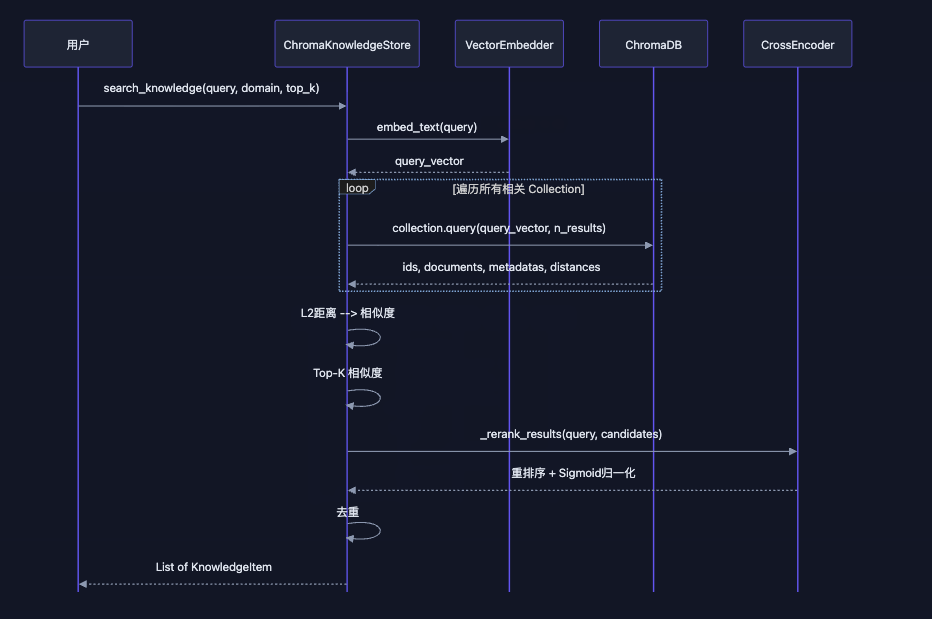
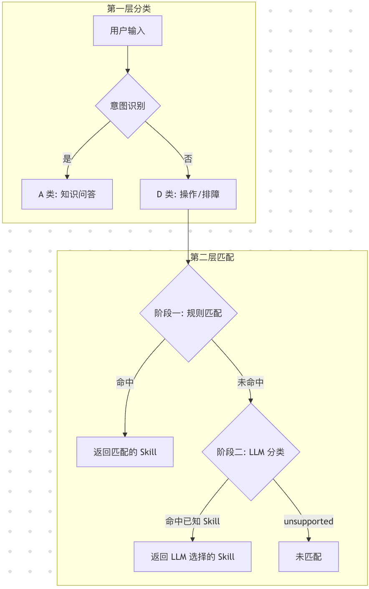
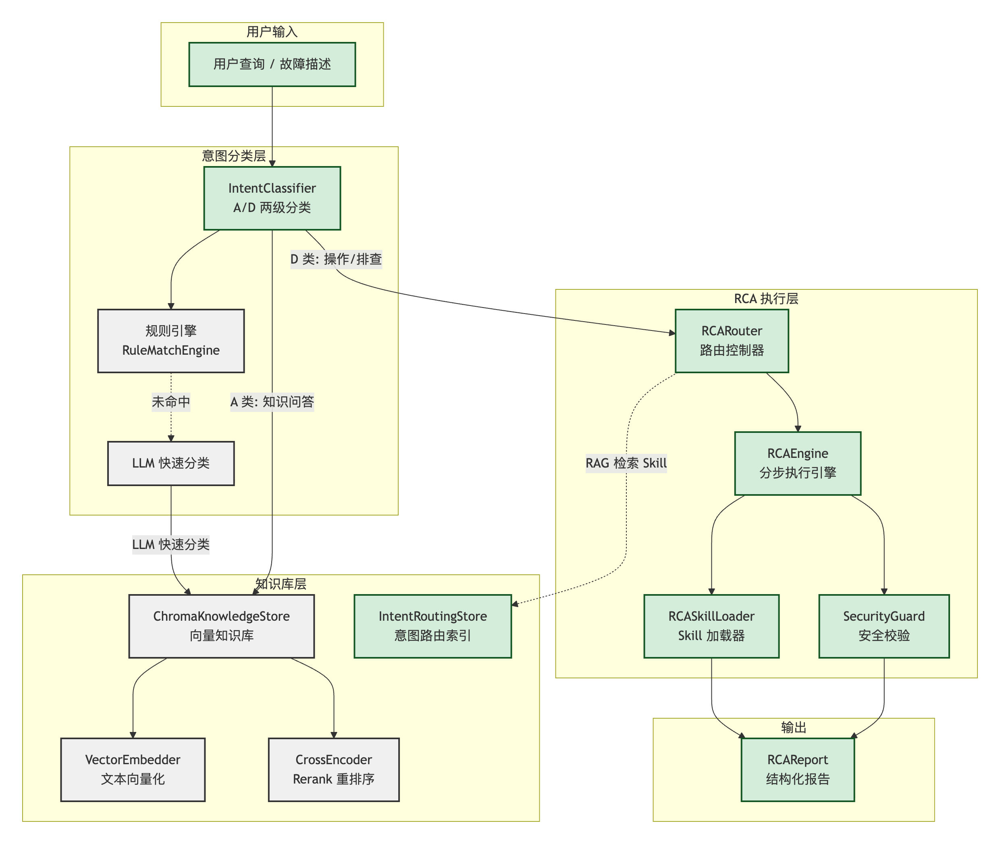
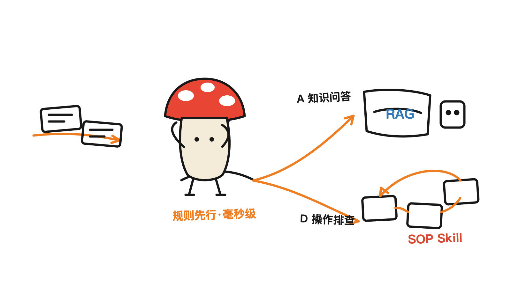
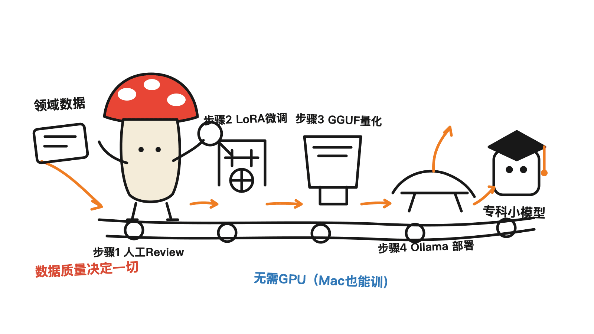

> 📌 **转载声明**：本文转载自**阿里云开发者社区**，原作者 **小伟（tiger）**，发表于 2026-04-14。
> 原文链接（请直接复制访问）：https://developer.aliyun.com/article/1726797
> 原文版权归原作者所有，本文**按原文内容转载、保持不变**，遵守原文的开放分享与署名要求。为便于阅读，原文中的架构图未一并搬运，完整图文请以原文为准。
> **文末「相关开源仓库摘要与点评」为 Mycelium 整理补充**（含我们的一些见解），与原文区分。

---

在边缘环境、No-GPU、私有化场景下，面对数据安全、资源受限的情况，如何用 **≤9B 参数的小模型**构建一个真正可用的 Agent？本文介绍 **Aether 项目**的核心设计与工程实践——从模型选型、知识库检索、意图路由、Skill 编排到 LoRA 微调的全链路方案。

> Aether — 用小模型做大事，让智能运维触手可及。

## 一、背景：为什么构建小模型 Agent？

### 1.1 业务痛点

在私有化运维场景中，我们面临四大核心痛点：

| 痛点 | 描述 |
|------|------|
| 💻 数据安全 | 金融、银行、保险等企业有明确规定，数据不能上公网 |
| 💻 No-GPU | 不是所有客户都有显卡，但我们需要服务所有客户。在有限算力下实现智能排障，是产品普及的关键 |
| 🚨 直播式排障 | 私有化场景下故障排查依赖专家远程指导（拍报错日志照片、打视频排查等），耗时以小时计，响应慢、效率低、知识难以沉淀复用 |
| 📚 文档迷宫 | 几十款云产品、每个产品至少 4 个版本的文档，真正遇上问题时无从查起 |
| 🔍 信息黑盒 | 部署架构黑盒：组件多、日志在哪儿、什么关键字、Pod 如何组成，对驻场/二线都是黑盒 |

### 1.2 技术选型动机

基于上述痛点，Aether 选择构建**小模型 Agent** 方案：

- ✅ **超低成本**：基于 ≤9B 级小模型 + RAG 知识增强，在 CPU / 低显存环境（如 32 vCPU 64G）下即可运行，无需 GPU 集群。
- ✅ **知识可控**：通过向量知识库管理领域知识，支持增量更新，推理结果可追溯、可解释。
- ✅ **Skill 编排**：将排障经验固化为结构化 Skill，Agent 自动编排执行，实现排障闭环。
- ✅ **数据私有化**：全链路本地部署，敏感数据不出域，满足企业级安全合规要求。

## 二、整体架构

> （原文此处为整体架构图，详见原文链接。）

## 三、Agent 技术栈

### 3.1 主模型选择：qwen2.5:1.5b

| 模型 | 优点 |
|------|------|
| **qwen2.5:1.5b** | 中文支持好、国产；参数规模小、部署门槛低，适合边缘与私有化；推理速度快，显著降低单轮响应耗时 |
| gemma3:4b | 多语言支持好，参数规模小、推理强的综合模型 |

### 3.2 Embedding 模型：BAAI/bge-large-zh-v1.5

中文向量表示能力强、检索一致性高，可提升召回准确率与稳定性。Embedding 与 Rerank 模型均为**本地加载，无需外部 API**。

### 3.3 向量数据库：ChromaDB

开源，文档量级在数百。

### 3.3 Rerank 模型：bge-reranker-v2-m3

中文语义相关性判断稳定，提升召回排序质量、减少无关上下文、降低主模型负担。

### 3.4 Agent 开发选型

| 方案 | 说明 |
|------|------|
| 自研 | 完全可控，但与传统 agent 做法差异大，需想清楚再做 |
| 二开 | 基于 **Nanobot（港大开源）** 二次开发；够小、够简单 ✅ |

## 四、知识库：ChromaDB + RAG + Rerank

### 4.1 设计目标

向量相似度搜索（Embedding + L2 距离）能快速召回候选，但精度有限。Rerank 通过 **CrossEncoder 交叉编码器**对初步结果二次精排，显著提升相关性。

### 4.2 检索流程

接收 Query → 标准化 → Embedding 向量化 → ChromaDB 向量检索（L2 距离转相似度）→ 返回 Top-K → CrossEncoder 重排打分 → Sigmoid 归一化 → 按阈值过滤并排序返回。



### 4.3 Rerank 核心价值

- **核心作用**：大幅降低上下文长度、降低 SLM 耗时，解决"先看哪条证据"。
- **为什么需要**：提升答案质量、降低 SLM 幻觉风险。
- **反直觉的工程权衡**：重排会增加少量时延，但在 SLM 场景下，总耗时反而**降低**。

### 4.4 Rerank 流程伪代码

```python
def _rerank_results(query, results):
    # 1. 构建 Query-Document 对
    pairs = [(query, r['document']) for r in results]
    # 2. CrossEncoder 打分（原始分数通常 -10 ~ 10）
    scores = cross_encoder.predict(pairs)
    # 3. Sigmoid 归一化到百分制 (0-100)
    scaled = [1 / (1 + exp(-s)) * 100 for s in scores]
    # 4. 阈值过滤（默认 60 分）
    filtered = [r for r, s in zip(results, scaled) if s >= threshold]
    # 5. 按重排序分数降序
    return sorted(filtered, key=lambda x: x['rerank_score'], reverse=True)
```

### 4.5 Rerank 模型选型

SLM 条件下需同时满足：开源、离线、中文，最终选择 **bge-reranker-v2-m3**。

### 4.6 配置解释

- `embedding_model`：本地 Embedding 模型路径，首次运行自动下载，后续完全离线。
- `chunk_size / chunk_overlap`：文档分块策略，500 字符分块 + 100 字符重叠是推荐基线。
- `top_k`：向量检索候选数量，Rerank 在此基础上精排。
- `batch_size`：批量向量化批大小，边缘设备建议降到 16 省内存。
- `rerank_model_path`：留空则跳过重排序。
- `rerank_threshold`：Rerank 分数阈值（0~1），低于此分数被过滤。

### 4.7 知识 Chunk 拆分调优

| 调优项 | 推荐范围 | 经验 | 风险 |
|------|------|------|------|
| chunk 大小 | 300~800 token | 先用 512 作基线，再按召回质量微调 | 过小易语义缺失，过大易主题混杂 |
| 重叠大小 | 10%~20% | 从 64 token 起步，关注跨段问答命中率 | 过低断上下文，过高引入冗余 |
| 人工 chunk border | 标题/步骤/代码块边界 | 先规则切分再模型切分，保证结构化知识完整落入单 chunk | 规则过多致 chunk 分布不均 |

> 优化说明：更小的 chunk、更少的 top_k、更高的阈值——以牺牲少量召回率换取更快响应与更低内存。

## 五、分级路由：意图分类 + 智能路由

### 5.1 设计目标

降低 LLM 处理耗时、增加推理准确性。

| 对比维度 | 传统：Agent + 大模型 | 本项目：小模型 + Agent |
|------|------|------|
| 处理路径 | 大多数请求都进大模型意图理解与决策 | 先经分级路由独立模块，规则匹配优先，复杂场景再回退 SLM |
| 典型问题 | 每次都触发长 Prompt + 长推理链，时延叠加 | 把高成本推理从主链路移到 Agent 控制，仅必要时访问 SLM |
| 耗时特征 | 整体偏秒级，高峰抖动明显 | 常见请求可达毫秒~百毫秒级，平均耗时显著下降 |

> 结论：分级路由不只是"分类逻辑"，而是独立的**性能治理模块**——"规则快速命中 + SLM 兜底回退"，把时延从秒级路径收敛为可控的低时延路径。



### 5.2 A/D 两级分类

- **A 类 — 知识问答**：纯知识性问题，交 LLM 直接回答；通过关键词模式匹配快速识别。触发词如：是什么、什么是、介绍一下、解释一下、有什么区别、原理、what is、explain。
- **D 类 — 操作/排查**：需执行具体操作，进入 Skill 流程；两阶段匹配：阶段一规则匹配（毫秒级），阶段二 LLM 分类（回退）。

### 5.3 阶段一：规则匹配

`nanobot/rca/rule_engine.py`：配置化规则 `{skill_name: [regex, ...]}`，预编译正则毫秒级响应，运行时 `add_rule / remove_rules` 动态管理。

```json
{
  "check_pod_status": ["查看.*pod", "pod.*状态"],
  "check_disk_usage": ["磁盘.*满", "disk.*full"]
}
```

### 5.4 阶段二：SLM 分类

规则未命中时回退 LLM 快速分类：把已注册 Skill 名列表构建为 Prompt，让 LLM 选最匹配的 Skill 或返回 `unsupported`，再做精确匹配校验。

> ⚠️ 关键约束：LLM 在此阶段**仅用于分类**，不参与执行、不生成步骤、不推理根因。

## 六、重新设计 Skill：从 Tool 到 SOP

### 6.1 设计理念：Tool → Atomic Skill → SOP Skill

| 对比维度 | 传统：大模型 plan + exec | 本项目：Embedding Skill + 分步骤执行 |
|------|------|------|
| 处理路径 | 注入到模型提示词 | SOP Skill = 多个 Atomic Skill |
| 典型问题 | 控制可见性/允许列表；安装越多越慢 | 让 SLM 执行 Skill 变成可能 |
| 耗时特征 | 安装越多越慢 | 取决于单步骤耗时，每步 = Atomic Skill，可控 |

> 结论：分步骤执行让 SLM 执行 Skill 成为可能。但注意：开源 Skill 格式无法通用、需转格式与自动化维护；分步骤后整体执行耗时变大，待优化。



### 6.2 Atomic Skill（原子技能）

单工具封装，最小执行单元：

```yaml
skill:
  name: get_rocketmq_pods
  version: "1.0"
  type: atomic
  description: "[内部原子技能] 直接调用 kubectl_get_pods 获取 Pod 列表。"
  input_schema: { namespace: string, component_keyword: string, exclude_keywords: string }
  output_schema: { pods: list, total: int }
  execution:
    steps:
      - id: fetch
        type: tool
        tool: kubectl_get_pods
        input:
          namespace: "{{namespace}}"
          component_keyword: "{{component_keyword}}"
          exclude_keywords: "{{exclude_keywords}}"
```

### 6.3 SOP Skill（标准操作流程）

多步骤编排，把多个 Atomic Skill 和 LLM 调用串联为完整的排障流程：

```yaml
skill:
  name: resolve_and_get_rocketmq_pods
  version: "1.0"
  type: sop
  description: |
    查询 RocketMQ 组件的 Pod 列表、进程状态、服务运行信息。
    自动将用户输入的组件简称映射为 Kubernetes 中的实际关键字。
  input_schema:
    param1: string         # 用户输入的原始文本
  output_schema:
    pods: list
    total: int
  execution:
    steps:
      - id: resolve_component
        type: llm
        input:
          param1: "{{user_input}}"
        prompt: |
          你是一个信息抽取器，只做字段提取，不做解释。
          【任务】从用户输入中提取3个字段，并输出JSON：
          - namespace
          - component_keyword
          - exclude_keywords

          【组件枚举（只能选一个）】
          broker  -> ocloud-tdmq-rocketmq5-broker
          namesrv -> ocloud-tdmq-rocketmq5-namesrv
          proxy   -> ocloud-tdmq-rocketmq5-proxy
          manager -> ocloud-tdmq-rocketmq-manager

          【规则】
          1. component_keyword 必须从上面枚举中选择一个
          2. namespace 如果没有，填 ""
          3. exclude 如果没有，填 ""
          4. 只输出 JSON，不要任何解释

          【输出格式】
          {"namespace":"","component_keyword":"","exclude_keywords":""}
        output_schema:
          component_keyword: string
          exclude_keywords: string
          namespace: string

      - id: get_rocketmq_pods
        type: skill
        skill: get_rocketmq_pods
        input:
          namespace: "{{resolve_component.namespace}}"
          component_keyword: "{{resolve_component.component_keyword}}"
          exclude_keywords: "{{resolve_component.exclude_keywords}}"
```

## 七、LoRA 微调：把领域知识训进小模型

### 步骤一：构造数据集（Alpaca / JSONL）

JSONL 格式（每行一个 JSON 对象）：

```json
{
  "instruction": "ConsumerGroup 下实例数超过 Queue 数量会怎样？",
  "input": "",
  "output": "多出的 Consumer 无法分到 Queue，处于空转状态。"
}
```

### 步骤二：人工 Review

非常重要。对数据集做质量审核、格式标准化与样本筛选，确保训练数据准确性与一致性。

### 步骤三：训练（LoRA / QLoRA）

支持在本地设备（如 MacBook Pro M4）定向训练。

**方式一：LlamaFactory（推荐）**

```bash
git clone https://github.com/hiyouga/LLaMA-Factory.git
cd LLaMA-Factory
pip install -e ".[torch,metrics]"
llamafactory-cli webui   # 可视化训练配置
```

**方式二：本地代码训练（transformers + peft）**

```bash
pip install transformers peft datasets accelerate bitsandbytes
python train_lora.py
```

本地训练参数（按实际 loss/准确率多轮调优）：

```yaml
base_model: Qwen/Qwen2.5-1.5B-Instruct
batch_size: 2
data_path: data
epochs: [3, 5]
grad_accum: [4, 8]
lora_alpha: [16, 32]
lora_dropout: [0.05, 0.1]
lora_r: [8, 16]
lr: [0.0001, 0.0002]
max_seq_len: 1024
```

> `--lora_rank 8`（小模型推荐）；`--lora_alpha 16`（通常为 rank 的 2 倍）；`--per_device_train_batch_size 4`（内存不足降到 1-2）；`--learning_rate 2e-4`（LoRA 推荐 1e-4 ~ 5e-4）。

### 步骤四 / 五 / 六：导出量化 → GGUF → Ollama

```bash
# 导出量化模型
python export_to_ollama.py

# 转 GGUF（适配 Ollama）
git clone https://github.com/ggerganov/llama.cpp.git
cd llama.cpp && pip install -r requirements.txt
python convert_hf_to_gguf.py ../output/qwen2.5-1.5b-rocketmq-merged \
  --outfile ../output/qwen2.5-1.5b-rocketmq.gguf --outtype auto

# 创建 Ollama 自定义模型（Modelfile 指定 FROM {gguf}/rocketmq-expert-q4km.gguf）
ollama create qwen2.5-rocketmq -f ../output/Modelfile
ollama run qwen2.5-rocketmq
```

## 九、总结

### 9.1 核心优势

| 优势 | 说明 |
|------|------|
| 💰 1/5 成本运行/训练 | 基于 1~9B 小模型，CPU / 低显存即可运行，知识增强替代大参数量，低成本运行、训练、迭代 |
| 🎯 更专业的领域能力 | 领域知识增强 + RCA 技能编排，结构化 Skill 确保推理可追溯、可解释、可复用 |

### 9.2 经验总结

| 经验 | 要点 |
|------|------|
| 核心：领域数据质量 | 真实有效的数据直接决定 Agent 准确性 |
| 小模型提示词优化 | 完形填空式优化 |
| 去掉业务无关系统提示词 | 移除 AGENTS.md、SOUL.md、USER.md 等无关提示词 |

### 9.3 后续方向

| 方向 | 说明 |
|------|------|
| 🔗 与主 Agent 打通 | 对接监控告警、运维中台等，形成智能运维闭环 |
| 🧠 源代码 RAG | 结合有版本的源代码，将源代码排查融入 SOP Skill |
| 💬 多轮对话 | 大模型靠长上下文保持连贯的模式在小模型上跑不通——耗时超乎想象、幻觉是常态 |
| 🧠 记忆管理 | 长短期记忆平衡；当前策略：抛弃记忆，或将记忆上移到主 Agent |

> **原文相关链接（原作者提供）：**
> Agent 源代码：https://github.com/AI-888/06-Aether
> 训练代码：https://github.com/AI-888/08-train-slm-for-rocketmq
> Skill 代码：https://github.com/AI-888/10-Aether-Skills

---

# 附：相关开源仓库摘要与点评（Mycelium 整理）

> 以下为 Mycelium 对原文文末几个开源仓库的调研摘要，并附我们的一些见解，供工程团队评估参考。**这部分不属于原文。**



## 1. 06-Aether — Agent 主体（MIT）

基于港大 **Nanobot** 二开的超轻量边缘 Agent，核心约 3500 行代码。模块包括 Agent Loop、RAG（ChromaDB + bge 系列）、Skills 框架、多渠道接入（飞书/钉钉/Telegram 等）、Provider 抽象（云端 + 本地 Ollama/vLLM）、记忆与调度。最低 4GB 内存、任意现代 CPU 即可跑（Phi-3 Mini 级）。

**点评**：它的真正价值不在"又一个 Agent 框架"，而在**把"小模型能力不足"这件事，用工程手段补回来**——RAG 补知识、Rerank 补精度、分级路由补速度、SOP Skill 补可靠执行。这是一条和"堆大模型上下文"完全相反的路径：**不靠模型聪明，靠系统设计聪明。**

## 2. 08-train-slm-for-rocketmq — 训练领域小模型

- **基座模型**：`Qwen/Qwen2.5-Coder-1.5B-Instruct`（内存紧张可选 0.5B）。
- **方法**：LoRA 微调，`auto_train.py` 支持自动超参搜索（按 `training_loss` 排序产出 `auto-train-report.json`）。
- **数据**：RocketMQ 运维领域 Q&A，**Alpaca 风格**（`instruction / input / output`），支持多 JSON 数据集自动合并、自动过滤占位样本。
- **硬件**：macOS Apple Silicon（PyTorch MPS）为主，也支持 Linux/Docker CPU；`batch_size 1-4`。

**点评**：这个仓库回答了原文最关键的一问——**"小模型不够专业怎么办？"**。答案是**用领域数据把它训成专科医生**，而不是请一个什么都会一点的全科大模型。值得注意的是它**全程不需要 GPU 集群**（Mac M4 即可），这把"领域微调"的门槛从"算力"降到了"数据质量"——而数据质量恰恰是原文反复强调的胜负手（"真实有效的数据直接决定 Agent 准确性"）。



## 3. 10-Aether-Skills — 技能库

含 `rocketmq/` 技能目录与 RocketMQ SDK 源码、`main.py`。**README 目前仅为占位标题**，技能定义（Atomic / SOP）主要见原文第六节的 YAML 范式。

**点评**：Skill 仓库目前更像"半成品"——这其实暴露了 SOP Skill 路线的真实代价：原文也坦承"开源 Skill 格式无法通用、需转格式、维护需要自动化"。**把专家经验固化成结构化 SOP，是这套方案最有壁垒、也最费人力的部分**。谁能把"写 Skill"这件事工具化/自动化，谁就能规模化复制领域 Agent。

## 4. HKUDS/Nanobot — 二开基座（MIT，港大开源）

"一个你能真正拥有的、超轻量个人 AI Agent"。设计哲学是**保持 agent 核心小而可读**，同时提供 WebUI、多渠道、工具、记忆、MCP、模型路由、自动化与部署。

**点评**：选 Nanobot 而不是 LangChain/重型框架，本身就是这套方案的态度——**在小模型场景，框架越薄越好**，因为每一层抽象都在和"毫秒级时延"作对。

## 我们的总体判断

Aether 这套实践最大的启发，是把"用不用大模型"从一道**信仰题**变回了一道**工程题**：在**私有化、无 GPU、强领域**的约束下，"小模型 + RAG + 分级路由 + SOP Skill + LoRA"这套组合拳，往往比"硬上一个大模型"更省、更稳、更可控。它不适合开放域闲聊，但对**确定性强、知识可沉淀、合规要求高**的运维/客服/工单场景，是一条被低估的务实路线。

> 📌 项目地址（请直接复制访问）：
> 原文 —— https://developer.aliyun.com/article/1726797
> 06-Aether —— https://github.com/AI-888/06-Aether
> 08-train-slm-for-rocketmq —— https://github.com/AI-888/08-train-slm-for-rocketmq
> 10-Aether-Skills —— https://github.com/AI-888/10-Aether-Skills
> Nanobot —— https://github.com/HKUDS/nanobot

---

> 原文版权归原作者 **小伟（tiger）** 与阿里云开发者社区所有，本文转载并注明出处。文末「仓库摘要与点评」部分由 **Mycelium Protocol** 整理，采用 [CC BY 4.0](https://creativecommons.org/licenses/by/4.0/deed.zh) 授权——欢迎转载引用，须注明作者与原文链接。

<!--EN-->

> 📌 **Repost notice**: This article is reposted from the **Alibaba Cloud Developer Community**, originally by **tiger (小伟)**, published 2026-04-14.
> Original (copy to visit): https://developer.aliyun.com/article/1726797
> Copyright of the original belongs to its author; reposted **faithfully and unchanged** (original diagrams not carried over — see the source). The **"Linked repositories: summary & commentary" section at the end is compiled by Mycelium** (with our own insights), distinct from the original.

Under edge / no-GPU / private-deployment constraints, with data-security and limited compute, how do you build a genuinely usable agent with a **≤9B small model**? This article presents the **Aether project** — the full pipeline from model selection, knowledge retrieval, intent routing, and skill orchestration to LoRA fine-tuning.

## 1. Background: why a small-model agent?

Private-deployment ops faces four pains: **data security** (finance/banking/insurance data can't leave the intranet), **no GPU** (not every customer has one, yet all must be served), **"livestream" troubleshooting** (expert-guided, hours per incident, hard to reuse), **document maze** (dozens of products × 4+ doc versions), and **black-box deployments**.

So Aether bets on a small-model agent: **ultra-low cost** (≤9B + RAG on CPU / low-VRAM, e.g. 32 vCPU 64G, no GPU cluster), **controllable knowledge** (vector KB, traceable/explainable), **skill orchestration** (codify troubleshooting as structured skills), **data privacy** (fully local).

## 2–3. Tech stack

- **Main model**: `qwen2.5:1.5b` (strong Chinese, tiny, fast); alt `gemma3:4b`.
- **Embedding**: `BAAI/bge-large-zh-v1.5` (local, no API).
- **Vector DB**: ChromaDB. **Rerank**: `bge-reranker-v2-m3` (local).
- **Agent base**: second development on **Nanobot (HKU open source)** — small and simple.

## 4. Knowledge base: ChromaDB + RAG + Rerank

Vector search recalls candidates fast but with limited precision; a **CrossEncoder reranker** re-scores the top-K (sigmoid-normalized, threshold-filtered). Counterintuitively, in the SLM setting reranking **lowers total latency** by cutting context length. Chunk tuning baseline: 512-token chunks, 10–20% overlap, align to title/step/code boundaries.


## 5. Tiered routing: intent classification + smart routing

Routing is a **performance-governance module**, not just classification: rule match first (ms-level, precompiled regex in `rule_engine.py`), SLM classification as fallback. **Class A** = knowledge Q&A (keyword match → RAG + LLM); **Class D** = ops/troubleshooting (→ skill flow). The LLM here **only classifies** — it does not execute, generate steps, or reason root cause.


## 6. Redesigning skills: from Tool to SOP

`Tool → Atomic Skill → SOP Skill`. An **Atomic Skill** wraps one tool (YAML with input/output schema + steps); an **SOP Skill** orchestrates multiple atomic skills + LLM calls into a full troubleshooting flow. Step-wise execution is what makes **SLMs able to run skills at all** — at the cost of more total latency and non-portable skill formats needing automation.


## 7. LoRA fine-tuning: train domain knowledge into the small model

Build an **Alpaca/JSONL** dataset (`instruction/input/output`) → **manual review** (quality is decisive) → train via **LlamaFactory** or `transformers + peft` (base `Qwen/Qwen2.5-1.5B-Instruct`, `lora_r 8`, `lora_alpha 16`, `lr 2e-4`, runnable on a MacBook Pro M4) → export & quantize → convert to **GGUF** (llama.cpp) → create an **Ollama** custom model.

## 9. Takeaways

**1/5 the cost** to run/train (small model on CPU, knowledge augmentation instead of huge params); **stronger domain skill** via structured, auditable SOP skills. Lessons: domain **data quality** is decisive; cloze-style prompt optimization; strip irrelevant system prompts. Next: connect to a main agent, source-code RAG, multi-turn (the long-context approach "doesn't work on SLMs — latency explodes, hallucination is the norm"), memory management (currently: drop memory or push it to the main agent).

> Original links (by the author): 06-Aether https://github.com/AI-888/06-Aether · train-slm https://github.com/AI-888/08-train-slm-for-rocketmq · Skills https://github.com/AI-888/10-Aether-Skills

---

# Appendix: linked repositories — summary & commentary (by Mycelium)

> Our research summary of the repos linked at the end of the original, plus our own insights. **Not part of the original.**


**1. 06-Aether (MIT)** — an ultra-light edge agent (~3,500 LOC) built on HKU's Nanobot: Agent Loop, RAG (ChromaDB + bge), skills, multi-channel, local Ollama/vLLM, runs from 4GB RAM on any CPU. *Our take*: its real value isn't "another framework" but **compensating for a small model's weakness with engineering** — RAG for knowledge, rerank for precision, routing for speed, SOP skills for reliable execution. The opposite of "stack more context": **not a smarter model, a smarter system.**

**2. 08-train-slm-for-rocketmq** — LoRA fine-tuning of `Qwen2.5-Coder-1.5B-Instruct` (0.5B option) on Alpaca-style RocketMQ Q&A, auto hyperparameter search, **no GPU cluster (Mac M4 works)**. *Our take*: it answers the key question — "what if the small model isn't expert enough?" — **train it into a specialist with domain data** rather than hire a generalist giant. It moves the barrier from *compute* to *data quality*, exactly the article's decisive factor.


**3. 10-Aether-Skills** — a `rocketmq/` skill directory + RocketMQ SDK; **README is currently just a placeholder**. *Our take*: the skill repo looks half-finished, which exposes the real cost of the SOP route — the article admits skill formats aren't portable and need automation. **Codifying expert experience into structured SOPs is the most defensible yet most labor-intensive part.** Whoever automates "writing skills" can scale domain agents.

**4. HKUDS/Nanobot (MIT)** — "an ultra-lightweight personal AI agent you can truly own," keeping the core small and readable. *Our take*: choosing Nanobot over heavy frameworks is itself the thesis — **in small-model land, thinner is better**, since every abstraction layer fights millisecond latency.

**Our overall verdict**: Aether turns "use a big model or not" from a matter of *faith* back into a matter of *engineering*. Under private + no-GPU + strong-domain constraints, "small model + RAG + tiered routing + SOP skills + LoRA" is often cheaper, steadier, and more controllable than forcing in a large model. Not for open-domain chat — but for deterministic, knowledge-accumulating, compliance-heavy ops/support, it's an underrated pragmatic path.

> 📌 Links: Original https://developer.aliyun.com/article/1726797 · 06-Aether https://github.com/AI-888/06-Aether · 08-train-slm https://github.com/AI-888/08-train-slm-for-rocketmq · 10-Aether-Skills https://github.com/AI-888/10-Aether-Skills · Nanobot https://github.com/HKUDS/nanobot

---

> Copyright of the original article belongs to **tiger (小伟)** and the Alibaba Cloud Developer Community; reposted with attribution. The "summary & commentary" section is compiled by **Mycelium Protocol** under [CC BY 4.0](https://creativecommons.org/licenses/by/4.0/).
