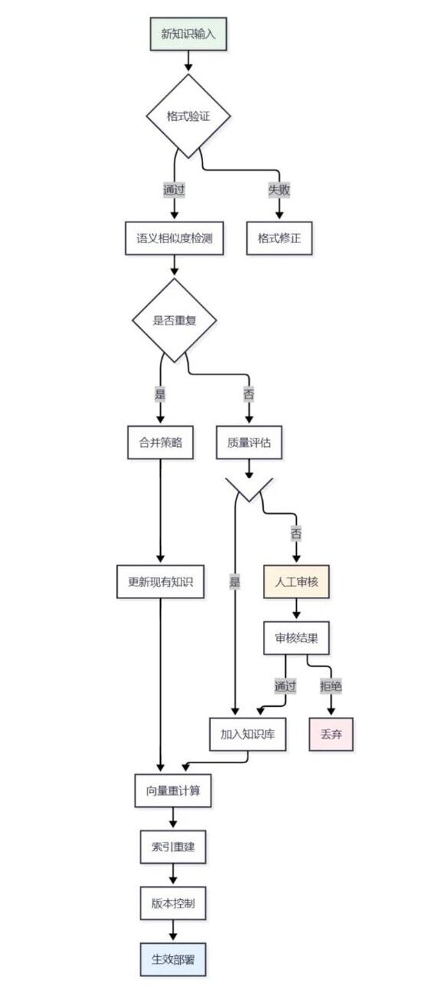
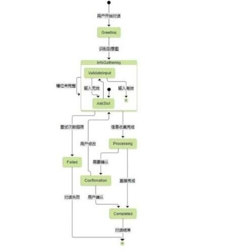

> 📌 原文：《我的Agent智能客服项目拆解（已脱敏）》，公众号「幸运时光A的点滴分享」
> 微信文章地址：https://mp.weixin.qq.com/s/3WL3YOx1e8C5xAerSfy-dw

原文正文很短，核心信息几乎全在配图里——十一张飞书文档截图，拼起来是一份"基于 Agent 的智能客服项目（已落地）"的完整设计文档：从整体架构、意图识别、对话管理、知识检索，到生产部署、性能监控、效果评估，再到一张贯穿"需求—评审—开发—上线—运营"全流程的项目管理海报。这篇读后感按三个视角来拆：**概念体系**、**逻辑链路**、以及**我自己的工程落地判断**。第三部分是我自己的推演和建议，不代表原作者的观点。

---

## 一、概念体系梳理

把十一张图拼起来看，这套系统其实是两层体系叠在一起：**技术架构层**（怎么做出一个能对话的客服）和**工程组织层**（怎么把它当一个真实项目管起来、发出去）。原文标题写"已落地"，落地感恰恰体现在它没有停留在技术架构那一层，而是把项目管理、效果评估、生产运维都补齐了。

### 1.1 技术架构层：七个子系统

**① 理解层——意图识别 + 实体抽取**
用预训练 BERT（`bert-base-chinese`）做特征提取器，接一层 Dropout + Linear 做意图分类；实体抽取走的是 BiLSTM-CRF 序列标注路线，识别订单号、产品型号、时间等结构化信息，两者在架构图里是并行执行的两条支路，而不是串行的"先分类再抽取"。

**② 对话管理层——状态机 + 上下文维护**
对话管理器被原文称为"大脑"：用状态机维护多轮对话的当前状态（`current_state`）、已填槽位（`filled_slots`）、置信度序列和完整的对话历史。可视化出来是一个标准的有限状态机：`Greeting → InfoGathering →（ValidateInput ↔ AskSlot 内部循环）→ Processing →（Confirmation 或直接完成）→ Completed`，中途还有 `Failed` 分支处理重试超限的情况。

**③ 知识与检索层——向量库 + 混合检索 + 动态更新**
知识库用 Sentence-Transformer 编码文档，FAISS 建索引（`IndexFlatIP` + L2 归一化做余弦相似度），检索策略是"向量检索 + 关键词检索"的混合召回，再做相关性排序和结果融合。更值得注意的是**知识库动态更新机制**——这是一整条独立的审核流水线：新知识输入 → 格式验证 → 语义相似度去重 → 质量评估 → （不合格）人工审核 → 向量重计算 → 索引重建 → 版本控制 → 生效部署。这条链路的存在说明原作者很清楚，知识库不是建完就完事的静态资产，而是需要持续治理的动态系统。

**④ 生成层——Prompt 组装 + 大模型生成**
组装系统指令、当前上下文、多轮历史摘要和 Top-K 知识片段，交给大模型生成回复，同时更新用户画像。这一层原文着墨不多，但从整体流程看，它是唯一"没有被结构化模块替代"的一环——前面意图、实体、状态、检索全是显式规则或小模型在做，只有最终生成交给大模型。

**⑤ 部署运维层——生产架构**
一套标准的高可用分层架构：API Gateway → 负载均衡层 → 应用服务层（多副本）→ 数据存储层（MySQL + Redis + Elasticsearch）→ 监控告警层（Prometheus + Grafana）。性能优化实践里还给了一版异步实现：Redis 做响应缓存，`asyncio.create_task` 并行跑意图识别和实体抽取，减少串行等待。

**⑥ 评估层——多维指标体系 + 自动化评估**
表 1 给出了一套五维评估指标：准确性（意图识别准确率 >90%、实体抽取 F1 >85%，各占 25%/20% 权重）、效率性（平均响应时间 <2 秒，15%）、完整性（问题解决率 >75%，20%）、用户体验（满意度评分 >4.0/5.0，20%）。配套一个 `CustomerServiceEvaluator` 类把这套指标自动化跑起来，还有一个 `PerformanceMonitor` 类做实时异常检测和分时段报告。

**⑦ 实证层——真实案例效果对比**
某电商平台客服系统改造前后：响应时间从平均 3.5 分钟降到 8 秒（提升 96.2%），问题解决率 65% → 82%，用户满意度 3.2 → 4.3，人工客服工作量下降 65%，服务从"工作时间"变成"7×24 小时"。系统优化历程时间线显示，这个项目从需求调研到模型迭代优化跨了大约 9 个月（2023.01 - 2023.09），分五个阶段推进。

### 1.2 工程组织层：一张贯穿全流程的项目管理海报

十一张图里最"跳出技术"的一张，是那张标题为"智能客服 Agent——已落地"的完整流程海报。它把整个项目框进一个组织流程里：

- **需求来源**：市场部需求、业务部反馈、用户反馈、公司战略、产品部研发五个入口，汇总到产品部，产出"需求简介"。
- **需求评审阶段**：可行性确认（不可行则给替代方案并回退存档）→ 技术产品会议讨论 → 需求立项 → 分析需求 → 技术产品审核 → 完善需求文档 → 内部评审（不通过则打回并记录原因）→ 技术部评测 → 协调准备内容（PSD 设计稿等）。
- **开发与测试阶段**：技术开发 → 技术测试（有 Bug 则回到开发）→ 拟真测试 → 内部讲解 → 内部测试确认 → 部署上线 → 测试/业务逻辑问题分支（进紧急 Bug 流程）→ 上线运营 → 运营反馈。

这张图的价值不在技术细节，而在于它证明了这套架构不是一个孤立的技术 Demo，而是嵌在一个有完整评审、测试、上线、反馈闭环的工程组织流程里的真实交付物——这也呼应了标题里"已落地"三个字的分量。

---

## 二、概念之间的逻辑链路

单看七个子系统容易觉得只是"模块堆叠"，但把箭头连起来看，会发现这套系统其实由**一条主链路 + 两条独立闭环 + 一条外层组织闭环**构成，四条线各自的更新频率完全不同——这是它工程上做得比较讲究的地方。

### 2.1 主链路：单轮请求的处理路径

```
用户输入
  → 预处理清洗（文本标准化）
  → 【意图识别 ‖ 实体抽取】并行执行
  → 对话状态管理器更新（current_state / filled_slots / confidence_scores / conversation_history）
  → 判断槽位是否完整
      ├─ 不完整 → AskSlot ↔ ValidateInput 内部澄清循环（重试次数超限则转 Failed）
      └─ 完整   → 知识检索（向量 + 关键词混合召回 → 相关性排序 → 结果融合 → Top-K）
  → Prompt 组装（系统指令 + 当前上下文 + 历史摘要 + Top-K 知识片段）
  → 大模型生成回复
  → 更新用户画像 → 返回响应
```

这条链路的关键设计是**并行 + 短路**：意图识别和实体抽取不是串行等待，而是同时发起；槽位不完整时系统会短路掉后面的知识检索和生成步骤，直接进入澄清追问，避免"信息不全也硬生成回复"的常见客服 Agent 毛病。

### 2.2 旁支闭环一：知识库更新回路（异步、低频）

这条回路和主链路完全解耦：新知识输入 → 质量把关（格式 + 去重 + 评估）→ 人工审核兜底 → 向量重建 → 版本发布。它不参与实时对话处理，是一条独立的、通常按天或按周触发的运营型流水线。**它存在的意义是让检索层保持"新鲜"，而不拖慢对话响应速度**——这是把"内容治理"和"实时服务"两种完全不同的 SLA 要求拆开来做的正确工程判断。


*知识库动态更新机制：格式验证 → 语义去重 → 质量评估 → 人工审核 → 向量重建 → 版本发布（原文配图）*

### 2.3 旁支闭环二：监控评估回路（准实时 + 定期回归）

`PerformanceMonitor` 实时采集每轮交互的响应时间、意图置信度、满意度、解决率等指标，做异常检测和实时统计；`CustomerServiceEvaluator` 则是偏离线的批量评估，跑测试集算准确率、F1、混淆矩阵。两者共同对照评估指标体系里的目标值（响应时间 <2 秒、意图准确率 >90% 等），结果反哺"系统优化历程"时间线里的"模型迭代优化"阶段——**这是唯一一条把系统运行数据重新接回研发决策的回路**，没有它，前面所有的架构设计都只是一次性交付，而不是可持续迭代的产品。


*对话状态机：Greeting → InfoGathering（内部澄清循环）→ Processing →（Confirmation 或直接完成）→ Completed，中途可转 Failed（原文配图）*

### 2.4 外层闭环：组织流程回路（项目级、月度/季度）

项目管理海报里的"运营反馈"箭头没有画到系统内部，而是回流到最外层的"需求来源"——也就是说，上线后收集到的运营数据，会作为下一轮需求评审的输入。这条回路的周期最长，但它才是让前三条技术闭环持续获得资源投入、不断迭代的根本原因：**技术架构解决"系统怎么跑"，组织流程解决"系统为什么值得继续投入"**，两者缺一不可。

四条回路叠在一起，其实是一个经典的分层控制系统：主链路是最内层、最高频的反馈环（毫秒到秒级），知识更新和监控评估是中层（小时到天级），组织流程是最外层（周到月级）。这种"频率分层"本身就是一条值得单独拿出来学的工程经验。

---

## 三、工程落地视角：如果我来接手，会怎么做

以下是我脱离原文业务场景，纯从工程实现角度给出的判断，供参考对比，不是对原方案的否定——原方案在合规、可控性要求高的客服场景下，很多选择是合理的权衡。

### 3.1 先给一个总体判断：这是一套"偏经典 NLU pipeline + 生成层接大模型"的架构

BERT 意图分类 + BiLSTM-CRF 实体抽取 + 显式状态机维护对话状态，本质上是 2020-2022 年前后成熟的经典对话系统（Task-Oriented Dialogue）范式，只是在最终回复生成这一步接上了大模型。放到 2026 年这个时间点看，这个选择**"稳"但不"新"**：

- **优点**：意图分类和实体抽取是独立的确定性模块，延迟低、可解释、好审计、好做单元测试，出了 Bug 容易定位到具体是哪个模型/哪条规则出错，这对客服这种强合规场景（涉及退款、订单、投诉）是很实在的价值。
- **代价**：需要单独训练、标注、维护 BERT 分类器和 CRF 序列标注模型，团队要有相应的模型训练/标注流水线和人力投入；而且这类小模型对新意图、新说法的泛化能力有限，每次业务扩展新品类基本都要重新标数据、重新训练。

如果团队本身没有现成的 NLU 模型训练能力和标注团队，今天完全可以用大模型的 structured output / function calling 直接替代 BERT 分类器 + CRF 抽取器这一层，用一次 LLM 调用同时吐出 `intent`、`entities`、`confidence`，省掉训练和部署成本，代价是单次调用延迟和成本比小模型高、可解释性弱一些。这是一个纯粹的工程权衡题，没有标准答案，取决于团队规模、合规要求和响应时间预算。

### 3.2 如果用 n8n 搭这套循环，节点怎么设计

n8n 的强项是可视化编排和现成的第三方集成，弱项是原生不擅长维护跨轮次的会话状态。把上面的主链路搬到 n8n 上，我会这样切节点：

1. **入口**：Webhook 节点接入各渠道（企业微信客服、网页 SDK、APP），带上 `session_id`。
2. **会话状态读取**：一个 Redis/Postgres 节点，用 `session_id` 读出当前对话状态（`current_state`、`filled_slots`、历史摘要），这一步是 n8n 里必须自己补的——n8n workflow 本身是无状态的单次执行，多轮对话的"记忆"必须外挂一个状态存储，靠 `session_id` 关联。
3. **理解层**：一个 AI Agent 节点（或 HTTP Request 节点）调用大模型，用 JSON Schema 强制输出 `intent + entities + confidence`，替代原文里训练 BERT/CRF 的部分——这一步把两个独立模型合并成一次结构化调用。
4. **状态机路由**：用 Switch 节点按 `current_state` 分支（对应 Greeting / InfoGathering / Processing / Confirmation / Completed），每个分支走不同的子流程；槽位不完整时的 AskSlot ↔ ValidateInput 循环，可以用一个 IF 节点判断 `filled_slots` 是否覆盖 `required_slots`，不满足就直接返回追问文案，短路后面所有节点。
5. **检索层**：n8n 的 Vector Store 节点接 Qdrant/pgvector，另外一个 HTTP 节点做关键词检索（比如接 Elasticsearch 或直接用支持混合检索的向量库），用 Merge 节点把两路结果按相关性打分融合。
6. **生成层**：Set/Code 节点拼装最终 Prompt（系统指令 + 会话历史摘要 + 检索到的知识片段），交给 AI Agent 节点生成回复。
7. **状态回写**：把更新后的 `current_state`、`filled_slots`、对话历史写回 Redis/Postgres，同时把这轮交互的关键指标（响应时间、置信度）写进一张单独的指标表，供后面的监控用。
8. **知识库更新回路**：单独开一条 Cron 触发的 workflow，定时拉取新知识源，走"去重检测（向量相似度阈值）→ 人工审核"环节——人工审核这一步可以直接接飞书审批或企业微信审批的 Webhook，把"人类兜底"做成 workflow 里的一个正式节点，而不是线下流程，通过就自动触发向量重建子流程。

这套设计的关键是**把"单轮处理"封装成一个可以被外部循环反复调用的子流程（sub-workflow）**，多轮对话的循环控制权交给外层的 Webhook + 会话状态存储，而不是指望 n8n workflow 本身维护循环——这是 n8n 场景下最容易被低估的一个坑。

### 3.3 如果做成 Agent，模型怎么选

把系统拆成"结构化任务"和"复杂推理任务"两类，分别配模型，而不是所有环节都用同一个大模型：

- **意图识别 / 槽位抽取（结构化输出任务）**：用便宜快速的模型走 structured output，比如 Claude Haiku 4.5 或同量级模型即可，不需要上重模型——这类任务本质是分类 + 抽取，模型能力的边际收益很快见顶，钱应该花在别处。
- **对话编排 / 复杂推理（需要跨轮次整合上下文、处理模糊意图、判断是否转人工）**：用中高档模型（比如 Claude Sonnet 5 级别）作为"决策大脑"，可以考虑用它原生的工具调用能力直接替代显式状态机的分支判断——把"转人工""查订单""检索知识库"都定义成工具，让模型自己决定下一步动作，而不是完全靠硬编码的状态转移表。
- **但关键动作必须保留硬编码守护**：退款、转账、账户变更这类高风险操作，不能完全交给模型自由决策，必须走代码里写死的二次确认流程——这是客服/金融类 Agent 和一般聊天 Agent 的本质区别：合规红线要用代码硬控制，不能只靠 Prompt 约束模型"不要做什么"。
- **Embedding 模型**：原文用的 `paraphrase-multilingual-MiniLM` 是一个通用多语言模型，中文效果并不突出；生产环境建议换成中文效果更好的开源模型（如 BGE 系列、GTE 系列）或直接用性价比高的 Embedding API。
- **路由分层的思路值得保留**：原方案"意图识别是独立轻量模块，只有生成阶段才用大模型"本身就是一种路由分层——小模型/规则做确定性强的部分，大模型只在真正需要推理和生成的地方介入，这个思路无论用不用 LLM 原生方案替代 NLU pipeline，都应该保留。

### 3.4 几个具体的工程化建议

- **不要自己重复造可观测性轮子**。原文的 `PerformanceMonitor` 类完全可以用现成的 LLM 可观测性平台（如 Langfuse、Helicone）或通用监控栈（Prometheus + Grafana + 自定义 exporter）替代，除非有非常特殊的定制需求，否则手写一个指标采集 + 异常检测类，维护成本比接现成工具高。
- **评估体系建议分成"线上实时"和"离线回归"两层**。原文表 1 的五维指标是一个好起点，但工程落地时最好拆开：响应时间、错误率、fallback 率这类可以自动化实时监控；意图准确率、实体 F1 这类需要人工标注测试集的指标，建议引入 LLM-as-judge 辅助批量评估，定期（比如每周）跑一次回归，而不是靠人工抽查。
- **知识库治理是最容易被低估的投入项**。原文那条"格式验证 → 语义去重 → 质量评估 → 人工审核"的审核链路看着繁琐，但恰恰是这套系统里最该重视的部分——很多团队会低估知识库运营（内容过期、重复、互相矛盾）所需要的持续人力投入，如果立项时没有把"知识运营 SOP"和技术架构放在同等优先级，半年后知识库质量下滑会直接拖垮整套系统的效果，而这种劣化在初期是几乎感觉不到的。
- **生产架构可以精简一步**。原文"FAISS 做向量检索 + Elasticsearch 做关键词检索"是两套独立系统并行运维，2026 年这个时间点，用支持混合检索（dense + sparse 一体）的向量数据库（比如 Milvus 2.4+、Qdrant、Weaviate 的 hybrid search 能力）可以一步到位替代这两套系统，减少一份运维复杂度和一致性同步的心智负担。
- **验收标准要挂业务指标，不要挂模型指标**。从案例数据看（响应时间降 96.2%、人工工作量降 65%），这类项目最大的 ROI 来自"把原本要等人工的部分自动化掉"，而不是"AI 比人类客服更聪明"。工程落地时建议优先把响应时间、转人工率、问题解决率这类业务 KPI 作为项目验收标准，而不是一上来就死磕"意图识别准确率要到 99%"——业务价值和模型指标之间不是线性关系，多数场景下"能又快又稳地兜底转人工"比"死磕分类准确率"性价比高得多。

---

## 小结

这份"已落地"的智能客服 Agent 设计，好的地方在于它没有停在"接个大模型就是智能客服"的水平，而是把理解、管理、检索、生成、部署、监控、评估七层都补齐了，还配了一整条把技术架构框进真实工程流程的项目管理链路。它的架构选型偏经典、偏保守，这在强合规场景下是合理的权衡，但如果今天从零开始做同类项目，我会优先考虑用大模型的结构化输出替代专门训练的 BERT/CRF 模块，把工程投入从"训练和维护小模型"转移到"知识库治理"和"可观测性"这两个原文已经证明了价值、但更容易被低估的环节上。

---

> © 2026 Author: Mycelium Protocol. 本文采用 [CC BY 4.0](https://creativecommons.org/licenses/by/4.0/deed.zh) 授权——欢迎转载和引用，须注明作者姓名及原文链接，不得去除署名后以原创发布。

<!--EN-->

> 📌 Original article: *My Agent Customer-Service Project Teardown (Desensitized)*, WeChat account "幸运时光A的点滴分享"
> WeChat article: https://mp.weixin.qq.com/s/3WL3YOx1e8C5xAerSfy-dw

The article's own text is short — nearly all the information lives in its images: eleven screenshots from a Feishu doc that, stitched together, form a complete design document for a "deployed" Agent-based customer-service project — overall architecture, intent recognition, dialogue management, knowledge retrieval, production deployment, performance monitoring, evaluation, and a poster tracing the full "requirements → review → development → launch → operations" project lifecycle. This reading response is organized around three angles: the **concept map**, the **control-flow synthesis**, and my own **engineering judgment**. The third section is my own extrapolation, not the original author's stated views.

---

## 1. Mapping the Concept System

Stitching the eleven images together reveals two layers stacked on top of each other: a **technical architecture layer** (how to build a system that can hold a conversation) and an **engineering/organizational layer** (how to manage it as a real project and actually ship it). The title says "deployed," and that sense of "deployed-ness" comes precisely from not stopping at the architecture layer — the project management, evaluation, and production-ops pieces are all filled in too.

### 1.1 Technical Architecture: Seven Subsystems

**① Understanding layer — intent recognition + entity extraction.**
A pretrained BERT (`bert-base-chinese`) as feature extractor, with a Dropout + Linear head for intent classification; entity extraction runs a BiLSTM-CRF sequence-labeling path to pull out order numbers, product models, dates, and other structured fields. In the architecture diagram these two run as parallel branches, not "classify first, then extract."

**② Dialogue management layer — state machine + context maintenance.**
The dialogue manager is called the system's "brain": a state machine tracks `current_state`, `filled_slots`, a confidence-score sequence, and the full conversation history. Visualized, it's a standard finite-state machine: `Greeting → InfoGathering →(internal ValidateInput ↔ AskSlot loop)→ Processing →(Confirmation or direct completion)→ Completed`, with a `Failed` branch for exceeding the retry limit.

**③ Knowledge & retrieval layer — vector store + hybrid retrieval + dynamic updates.**
The knowledge base is encoded with a Sentence-Transformer and indexed with FAISS (`IndexFlatIP` plus L2 normalization for cosine similarity); retrieval is a hybrid of vector and keyword search, followed by relevance ranking and result fusion. More notable is the **dynamic knowledge-base update mechanism** — an entire independent review pipeline: new knowledge in → format validation → semantic-similarity dedup → quality assessment → (if it fails) human review → vector recomputation → index rebuild → version control → deploy. Its existence shows the author clearly understood that a knowledge base isn't a static asset you build once — it's a system that needs continuous governance.

**④ Generation layer — prompt assembly + LLM generation.**
System instructions, current context, multi-turn history summary, and top-K knowledge snippets get assembled and handed to an LLM to generate the reply, along with a user-profile update. The article spends little space here, but looking at the whole flow, this is the only step *not* replaced by a structured module — intent, entities, state, and retrieval are all handled by explicit rules or small models; only final generation is delegated to the LLM.

**⑤ Deployment/ops layer — production architecture.**
A standard layered high-availability setup: API Gateway → load-balancer layer → application-service layer (multiple replicas) → data-storage layer (MySQL + Redis + Elasticsearch) → monitoring/alerting layer (Prometheus + Grafana). The performance-optimization section also gives an async implementation: Redis for response caching, `asyncio.create_task` to run intent recognition and entity extraction in parallel, cutting serial wait time.

**⑥ Evaluation layer — multi-dimensional metrics + automated evaluation.**
Table 1 lays out a five-dimension metric system: accuracy (intent-recognition accuracy >90%, entity-extraction F1 >85%, weighted 25%/20%), efficiency (average response time <2s, 15%), completeness (issue-resolution rate >75%, 20%), and user experience (satisfaction score >4.0/5.0, 20%). A `CustomerServiceEvaluator` class automates this, alongside a `PerformanceMonitor` class for real-time anomaly detection and periodic reporting.

**⑦ Evidence layer — real-world case results.**
Before/after an e-commerce platform's customer-service overhaul: average response time dropped from 3.5 minutes to 8 seconds (a 96.2% improvement), issue-resolution rate went from 65% to 82%, satisfaction from 3.2 to 4.3, human-agent workload dropped 65%, and service coverage went from business hours to 7×24. The system-optimization timeline shows the project spanning roughly 9 months (Jan–Sep 2023) across five stages.

### 1.2 The Organizational Layer: One Poster Tracing the Full Lifecycle

The most "outside of technology" of the eleven images is the poster titled "Customer-Service Agent — Deployed." It frames the entire project inside an organizational process:

- **Demand sources**: five entry points — marketing needs, business-team feedback, user feedback, company strategy, product R&D — converging on the product team, which produces a "requirement brief."
- **Requirement review stage**: feasibility check (if infeasible, produce alternatives and archive) → tech/product meeting → requirement kickoff → requirement analysis → tech/product review → finalize requirement doc → internal review (if rejected, bounce back with a logged reason) → tech-team evaluation → prep coordination (design mockups, etc.).
- **Development & testing stage**: development → tech testing (bugs send it back to dev) → simulated testing → internal walkthrough → internal test sign-off → deployment → a branch for test/business-logic issues (into an urgent-bug process) → launch → operations feedback.

The value of this image isn't the technical detail — it's proof that this architecture isn't an isolated tech demo, but a real deliverable embedded in a full engineering process with review, testing, launch, and feedback loops — which is exactly what the word "deployed" in the title is carrying.

---

## 2. How the Concepts Connect

Looking at the seven subsystems in isolation, it's easy to read this as "stacked modules." But tracing the arrows reveals the system is actually built from **one main path, two independent feedback loops, and one outer organizational loop** — and the four operate at four completely different update frequencies. That's where the engineering is genuinely thoughtful.

### 2.1 Main path: processing a single turn

```
User input
  → preprocessing / text normalization
  → 【intent recognition ‖ entity extraction】run in parallel
  → dialogue-state manager update (current_state / filled_slots / confidence_scores / conversation_history)
  → check whether slots are complete
      ├─ incomplete → internal AskSlot ↔ ValidateInput clarification loop (exceed retry limit → Failed)
      └─ complete   → knowledge retrieval (vector + keyword hybrid recall → relevance ranking → fusion → top-K)
  → prompt assembly (system instructions + current context + history summary + top-K snippets)
  → LLM generates the reply
  → update user profile → return response
```

The key design here is **parallelism + short-circuiting**: intent recognition and entity extraction fire simultaneously rather than waiting on each other; when slots are incomplete, the system short-circuits past retrieval and generation straight into a clarifying question — avoiding the common customer-service-agent failure mode of generating a reply on incomplete information.

### 2.2 Side loop one: knowledge-base update (async, low-frequency)

This loop is fully decoupled from the main path: new knowledge in → quality gate (format + dedup + assessment) → human review as a backstop → vector rebuild → version release. It doesn't participate in real-time conversation handling — it's an independent, typically daily-or-weekly operational pipeline. **Its purpose is keeping the retrieval layer fresh without slowing down conversational response times** — correctly separating "content governance" and "real-time service" into two workflows with entirely different SLAs.


*Knowledge-base dynamic update: format validation → semantic dedup → quality assessment → human review → vector rebuild → release (original diagram)*

### 2.3 Side loop two: monitoring/evaluation (near-real-time + periodic regression)

`PerformanceMonitor` collects per-turn metrics in near-real-time (response time, intent confidence, satisfaction, resolution rate) and runs anomaly detection; `CustomerServiceEvaluator` runs offline batch evaluation against test sets, computing accuracy, F1, and confusion matrices. Together they're checked against the evaluation system's target values (response time <2s, intent accuracy >90%, etc.), and the results feed the "model iteration and optimization" stage of the system-optimization timeline — **this is the only loop that routes live operational data back into R&D decisions.** Without it, everything upstream is a one-time delivery rather than a sustainably iterated product.


*Dialogue state machine: Greeting → InfoGathering (internal clarification loop) → Processing → (Confirmation or direct completion) → Completed, with a Failed branch (original diagram)*

### 2.4 The outer loop: the organizational process (project-level, monthly/quarterly)

The "operations feedback" arrow in the project-management poster doesn't loop back into the system internals — it flows back into the outermost "demand sources" box. In other words, the operational data collected post-launch becomes input for the next round of requirement review. This loop has the longest period, but it's the fundamental reason the three technical loops keep getting the resources and iteration they need: **the technical architecture solves "how the system runs"; the organizational process solves "why the system keeps deserving investment."** Neither works without the other.

Stacked together, the four loops form a classic layered control system: the main path is the innermost, highest-frequency feedback loop (milliseconds to seconds); knowledge updates and monitoring/evaluation sit in the middle (hours to days); the organizational process is the outermost (weeks to months). This "frequency layering" is, on its own, a lesson worth extracting and studying separately.

---

## 3. An Engineering Perspective: If I Were Picking This Up

What follows is my own judgment, purely from an implementation standpoint, detached from the original business context — offered for comparison, not as a critique of the original design. Many of its choices are reasonable trade-offs for a customer-service scenario with high compliance and controllability requirements.

### 3.1 Overall read: a "classic NLU pipeline + LLM-generation-layer" architecture

BERT intent classification + BiLSTM-CRF entity extraction + an explicit state machine maintaining dialogue state is, in essence, the mature task-oriented-dialogue paradigm from roughly 2020–2022, with an LLM bolted onto the final generation step. Viewed from 2026, this choice is **solid but not novel**:

- **Upside**: intent classification and entity extraction are independent, deterministic modules — low latency, interpretable, auditable, easy to unit-test. When something breaks, it's easy to pin down which model or rule is at fault, which is real value in a strongly regulated domain like customer service (refunds, orders, complaints).
- **Cost**: you need a dedicated pipeline (and headcount) to train, label, and maintain the BERT classifier and CRF tagger; these small models also generalize poorly to new intents and new phrasings, so expanding into a new product category typically means re-labeling and re-training.

If a team doesn't already have an NLU training pipeline and labeling team, today you could replace the BERT classifier + CRF extractor entirely with an LLM's structured output / function calling, emitting `intent`, `entities`, and `confidence` from a single call — trading training and deployment cost for higher per-call latency/cost and somewhat weaker interpretability. It's a pure engineering trade-off with no universal answer — it depends on team size, compliance requirements, and the latency budget.

### 3.2 Building this loop in n8n: node design

n8n's strength is visual orchestration and off-the-shelf integrations; its weakness is that it doesn't natively maintain cross-turn session state. Porting the main path above onto n8n, I'd cut the nodes like this:

1. **Entry**: a Webhook node per channel (enterprise WeChat customer service, web SDK, app), carrying a `session_id`.
2. **Session-state read**: a Redis/Postgres node that reads the current dialogue state (`current_state`, `filled_slots`, history summary) by `session_id` — this is something you must add yourself in n8n, since a workflow execution is stateless by default; multi-turn "memory" has to live in an external store, keyed by `session_id`.
3. **Understanding layer**: an AI Agent node (or HTTP Request node) calling an LLM with a JSON Schema that forces `intent + entities + confidence` output — replacing the trained BERT/CRF step with one structured call.
4. **State-machine routing**: a Switch node branching on `current_state` (Greeting / InfoGathering / Processing / Confirmation / Completed); the internal AskSlot ↔ ValidateInput loop can be an IF node checking whether `filled_slots` covers `required_slots` — if not, return the clarifying prompt directly and short-circuit everything downstream.
5. **Retrieval layer**: n8n's Vector Store node against Qdrant/pgvector, plus a separate HTTP node for keyword search (Elasticsearch, or a vector store with native hybrid search), fused with a Merge node scored by relevance.
6. **Generation layer**: a Set/Code node assembles the final prompt (system instructions + session summary + retrieved snippets), passed to an AI Agent node to generate the reply.
7. **State write-back**: write the updated `current_state`, `filled_slots`, and history back to Redis/Postgres, and log this turn's key metrics (response time, confidence) to a separate metrics table for monitoring.
8. **Knowledge-base update loop**: a separate Cron-triggered workflow pulling new knowledge sources, running dedup detection (vector-similarity threshold) and a human-review step — the review can hook directly into a Feishu or WeChat Work approval webhook, turning "human backstop" into a first-class workflow node rather than an offline process; approval auto-triggers the vector-rebuild sub-workflow.

The key move is **wrapping "single-turn processing" as a sub-workflow that can be repeatedly invoked by an outer loop**, and putting the responsibility for multi-turn control in the outer Webhook + session-state store, not expecting the n8n workflow itself to maintain the loop — this is the most commonly underestimated trap when building this kind of thing in n8n.

### 3.3 Model selection, if built as an agent

Split the system into "structured tasks" and "complex-reasoning tasks," and wire different models to each rather than routing everything through one model:

- **Intent recognition / slot extraction (structured-output tasks)**: use a cheap, fast model with structured output — something in the Claude Haiku 4.5 tier is plenty. This is classification-plus-extraction; the marginal returns from a bigger model plateau quickly, and the budget is better spent elsewhere.
- **Dialogue orchestration / complex reasoning (cross-turn context integration, ambiguous-intent handling, deciding whether to hand off to a human)**: use a mid-to-high-tier model (Claude Sonnet 5-class) as the "decision brain," and consider replacing the explicit state machine's branching logic with the model's native tool-use — define "hand off to human," "look up order," "search knowledge base" as tools, and let the model decide the next action instead of relying entirely on a hardcoded transition table.
- **But keep hardcoded guardrails on critical actions**: refunds, transfers, account changes — high-risk operations should never be left to fully autonomous model decisions; they need a hardcoded confirmation step in code. This is the essential difference between a customer-service/fintech agent and a general chat agent: compliance red lines need to be enforced in code, not just requested via prompt.
- **Embedding model**: the article's `paraphrase-multilingual-MiniLM` is a general multilingual model that isn't especially strong for Chinese; production would do better with a Chinese-tuned open model (BGE series, GTE series) or a cost-effective embedding API.
- **Keep the tiered-routing idea**: the original design — a lightweight, independent intent module, with the LLM invoked only at generation time — is itself a form of tiered routing: deterministic parts handled by small models/rules, the LLM invoked only where reasoning and generation are genuinely needed. That principle is worth keeping regardless of whether you replace the NLU pipeline with an LLM-native approach.

### 3.4 A few concrete engineering suggestions

- **Don't reinvent observability.** The `PerformanceMonitor` class can be fully replaced by an off-the-shelf LLM observability platform (Langfuse, Helicone) or a general monitoring stack (Prometheus + Grafana + a custom exporter), unless there's a genuinely unusual customization need — hand-rolling a metrics-collection-plus-anomaly-detection class costs more to maintain than adopting existing tooling.
- **Split evaluation into "real-time online" and "offline regression" layers.** Table 1's five-dimension metrics are a good starting point, but in practice it's better to separate response time, error rate, and fallback rate (automatable, real-time) from intent accuracy and entity F1 (requiring a labeled test set) — for the latter, bring in LLM-as-judge for batch evaluation and run a periodic (e.g. weekly) regression instead of relying on manual spot checks.
- **Knowledge-base governance is the most commonly underinvested piece.** The article's "format validation → semantic dedup → quality assessment → human review" chain looks cumbersome, but it's exactly the part deserving the most attention — teams routinely underestimate the ongoing labor required for knowledge-base operations (stale content, duplicates, contradictions). If "knowledge-ops SOPs" aren't given equal priority to the technical architecture from project kickoff, quality degradation six months in will quietly drag down the whole system's effectiveness — and that decay is nearly invisible early on.
- **The production architecture can be simplified by one step.** Running FAISS for vector search and Elasticsearch for keyword search as two separately-operated systems made sense a few years ago; as of 2026, a vector database with native hybrid (dense + sparse) search — Milvus 2.4+, Qdrant, or Weaviate's hybrid search — can replace both in one system, cutting a layer of ops complexity and consistency-syncing overhead.
- **Acceptance criteria should track business KPIs, not model metrics.** The case data (a 96.2% cut in response time, a 65% cut in human workload) shows the biggest ROI in this kind of project comes from automating away what used to require waiting for a human, not from the AI being "smarter" than a human agent. Prioritize response time, human-handoff rate, and issue-resolution rate as acceptance criteria over chasing "99% intent accuracy" from day one — business value and model metrics aren't linearly related, and in most scenarios a fast, reliable fallback to a human beats squeezing out the last few points of classification accuracy.

---

## Takeaway

What's good about this "deployed" customer-service agent design is that it doesn't stop at "bolt on an LLM and call it smart customer service" — it fills in all seven layers (understanding, management, retrieval, generation, deployment, monitoring, evaluation) and wraps the whole thing in a project-management chain that embeds the technical architecture in a real engineering process. Its architectural choices lean classic and conservative, which is a reasonable trade-off in a strongly regulated domain — but building an equivalent project from scratch today, I'd lean toward replacing the purpose-trained BERT/CRF modules with an LLM's structured output, and shift the freed-up engineering investment toward knowledge-base governance and observability — two areas this project already proved matter, but that are easy for other teams to underinvest in.

---

> © 2026 Author: Mycelium Protocol. Licensed under [CC BY 4.0](https://creativecommons.org/licenses/by/4.0/) — free to share and adapt with attribution. You must credit the author and link to the original; removing attribution and republishing as original is not permitted.
