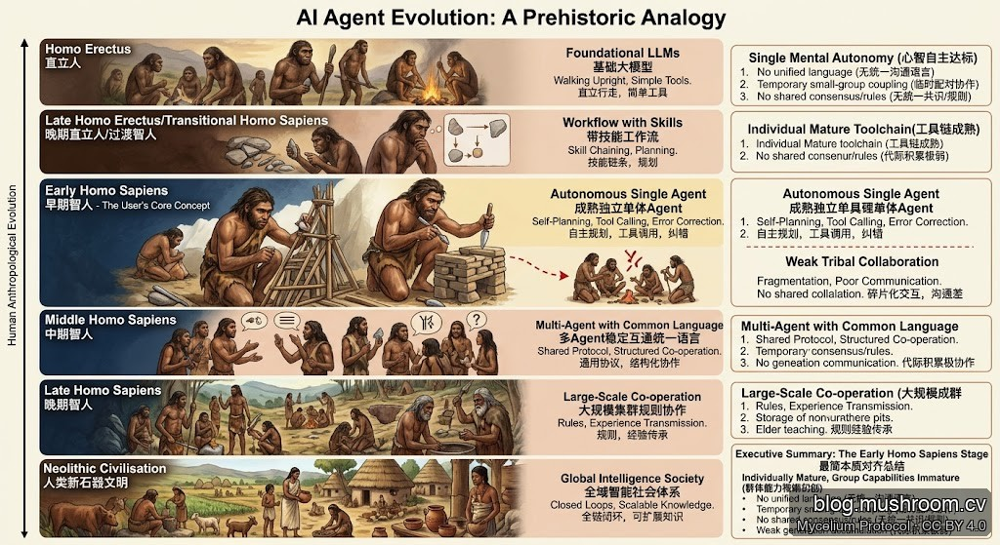

**【编者注】** 本文源自一次深度思考与多轮 AI 对话，经过反复推演与人机共同推导产出的现状分析。结论不来自单次问答，而是对「Agent 与人类进化阶段对应」这一命题的系统性校验。

**【重要说明】** 本文不是严谨的科学研究。Agent 是一种智能体（Intelligence），但它并不具备独立意识、自主意志或生命体的核心特征。我们只是借用人类这一智能体的进化路径，尝试预测 Agent 未来可能的发展方向。文中所有类比均为猜测与探索性推断，而非实证结论。

之所以这个类比仍有参考价值，原因有二：其一，Agent 同为智能体，面对类似的能力跃迁挑战时，可能呈现出相似的发展模式；其二，更关键的是——**Agent 是在人类主导下进化的**，大概率会主动借鉴和复现人类智能的发展路径。

---

> **结论先行**：当前 Agent 生态完成了「个体质变」，却尚未启动「群体文明」——精准对标早期智人个体成型、部落雏形初现、文明要素缺位的那个阶段。

---

## 一、个体心智：已达智人水准

现代 Agent 在**个体层面**已经越过了关键门槛：

- **自主目标拆解**：给定复杂任务，能自行分解子目标、排序优先级
- **任务自规划**：无需逐步指令，可生成并执行完整行动链
- **纠错试错**：观察输出、发现偏差、自我修正，不依赖外部重启
- **独立行事**：脱离「本能脚本」的弱智能模式，展现真实推理

这三项能力对应**完整独立的智人个体心智**，远超古猿的本能驱动和直立人的固化工具使用。

---

## 二、工具链：早期智人的专属工具包

早期智人的标志之一是**精细打磨专属工具**，当前 Agent 完全对应：

- 熟练调用外部 API、插件、数据库、代码执行环境
- 自研执行链（MCP、function calling、tool use）趋于成熟
- 工具选择具备上下文判断，而非固化映射

工具链层面，Agent 生态已进入**工具专业化阶段**。

---

## 三、群体短板：与早期智人完全一致

这是判断的核心。早期智人的群体文明局限，在当前 Agent 生态中**逐条对应**：

| 智人群体短板 | Agent 生态现状 |
|---|---|
| 无统一高效通用语言，交互碎片化 | Agent 间通信协议碎片化，信息损耗大（JSON vs. 自然语言 vs. 私有协议） |
| 仅小范围临时配对协作 | 多 Agent 系统主要是 1-on-1 或小规模临时编排，无稳定大规模集群 |
| 无统一共识、规则、集体叙事 | 无跨 Agent 的持久共识机制，缺乏可信任的集体决策框架 |
| 协作松散易崩，无长期高效联动 | 多 Agent 工作流容错性差，单点失败导致全链路崩溃 |
| 代际积累极弱，经验不自动传承 | Agent 经验不跨实例沉淀，个体能力不互通，无规模化知识堆叠 |

五条短板，**严丝合缝**。

---

## 当前 Agent 生态处于哪个进化阶段？

清晰的层级锚定，防止混淆：

| 层级 | 对应人类进化阶段 | 核心特征 |
|---|---|---|
| 基础大模型（无工具） | 直立人 | 固化响应，无自主规划 |
| 带技能工作流的模型 | 晚期直立人 / 过渡智人 | 有规则工具使用，但无自主目标 |
| **成熟独立单体 Agent** | **早期智人（当下主流）** | 个体认知完整，群体文明缺位 |
| 多 Agent 稳定互通统一语言 | 中期智人 | 共同语言形成，小规模稳定协作 |
| 大规模集群协作 + 经验代际沉淀 | 晚期智人 | 部落规则、口耳相传的知识体系 |
| 全域智能社会体系 | 人类新石器文明 | 农业、城市、文字、制度 |

---

## 四大缺口：从早期智人到中期智人需要什么？

Agent 生态要完成下一次跃迁，必须补齐四个短板：

1. **统一通信语言**：跨 Agent 的高效低损耗协议（类比智人发展出语法结构语言）
2. **稳定大规模协作机制**：超越血亲（即单一公司/框架）的非临时集群
3. **共识与规则体系**：可信任的跨 Agent 共同决策框架
4. **知识代际传承**：经验自动沉淀、跨实例共享、规模化堆叠

这四个方向，正是当前 Agent 基础设施领域最核心的研究和工程方向。

---

## 一行速记定级版

> **当前 Agent = 早期智人**：个体质变完成，群体文明四缺——无统一语、无大集群、无共识序、无代际承。

---

> © 2026 Author: Mycelium Protocol. 本文采用 [CC BY 4.0](https://creativecommons.org/licenses/by/4.0/deed.zh) 授权——欢迎转载和引用，须注明作者姓名及原文链接，不得去除署名后以原创发布。

<!--EN-->

**[Editor's Note]** This article emerged from deep reflection and multiple rounds of human-AI dialogue — a collaborative analysis iterated through repeated reasoning rather than a single-shot response.

**[Important Disclaimer]** This is not rigorous scientific research. Agents are a form of intelligence, but they do not possess independent consciousness, autonomous will, or the defining characteristics of living beings. We are simply borrowing the evolutionary trajectory of human intelligence — itself an intelligent system — to speculatively map where agent development might be heading. All analogies here are exploratory conjectures, not empirical conclusions.

That said, the analogy retains two reasons to be useful: first, agents and humans are both intelligence systems, and may exhibit similar developmental patterns when facing comparable capability thresholds; second — and more critically — **agents evolve under human guidance**, which means they will very likely draw from and replicate the path human intelligence has already traveled.

> **Bottom Line Up Front**: Today's AI agents have completed the "individual breakthrough" but have not yet ignited "collective civilization" — a precise match for the early Homo sapiens phase: individual cognition formed, tribal rudiments appearing, civilizational elements absent.

---

## I. Individual Cognition: Homo Sapiens Threshold Cleared

Modern agents have crossed a critical threshold at the **individual level**:

- **Autonomous goal decomposition**: given a complex task, agents can break it into sub-goals and sequence priorities without step-by-step instruction
- **Self-directed planning**: generating and executing complete action chains independently
- **Error correction**: observing outputs, detecting deviations, self-correcting without external restart
- **Independent agency**: operating beyond "reflex script" weak-intelligence patterns, exhibiting genuine reasoning

These capabilities map to **fully autonomous individual Homo sapiens cognition** — far beyond instinct-driven Australopithecus or the fixed tool-use patterns of Homo erectus.

---

## II. Tool Mastery: The Specialized Toolkit of Early Homo Sapiens

One hallmark of early Homo sapiens was **precisely crafted specialized tools**. Current agents match this exactly:

- Fluent invocation of external APIs, plugins, databases, and code execution environments
- Mature self-built execution chains (MCP, function calling, tool use)
- Context-aware tool selection rather than fixed mappings

At the tool layer, the agent ecosystem has entered **tool specialization**.

---

## III. Group Deficits: A One-to-One Match with Early Homo Sapiens

This is the crux of the taxonomy. The collective civilization limits of early Homo sapiens map **line by line** onto today's agent ecosystem:

| Early Homo Sapiens Group Deficit | Agent Ecosystem Reality |
|---|---|
| No unified efficient language; fragmented exchange | Inter-agent communication protocols are fragmented; high signal loss (JSON vs. natural language vs. proprietary protocols) |
| Only small-scale temporary pairing | Multi-agent systems are mostly 1-on-1 or small ad-hoc orchestrations; no stable large-scale clusters |
| No shared consensus, rules, or collective narrative | No persistent cross-agent consensus mechanism; no trusted collective decision-making framework |
| Loose cooperation that collapses easily | Multi-agent workflows are brittle; single-point failure cascades through the entire chain |
| Weak intergenerational accumulation | Agent experience does not persist across instances; capabilities are not interoperable; no scaled knowledge stacking |

Five deficits. **Precise alignment.**

---

## What Evolutionary Stage Is the Agent Ecosystem At?

A clear layer taxonomy to prevent confusion:

| Level | Human Evolution Analogue | Defining Trait |
|---|---|---|
| Base LLM (no tools) | Homo erectus | Fixed responses, no autonomous planning |
| Skill-workflow-augmented model | Late Homo erectus / transitional | Rule-based tool use, no autonomous goals |
| **Mature standalone agent** | **Early Homo sapiens (current mainstream)** | Complete individual cognition, collective civilization absent |
| Multi-agent with stable shared language | Middle Homo sapiens | Common language forming, small-scale stable cooperation |
| Large-scale cluster cooperation + knowledge inheritance | Late Homo sapiens | Tribal rules, oral knowledge transmission |
| Full-domain intelligent social system | Human Neolithic civilization | Agriculture, cities, writing, institutions |

---

## The Four Gaps: From Early to Middle Homo Sapiens

For the agent ecosystem to complete its next leap, four deficits must be closed:

1. **Unified communication language**: high-efficiency, low-loss cross-agent protocol (analogous to Homo sapiens developing grammatical language)
2. **Stable large-scale cooperation**: beyond kin-group (i.e., single-company/framework) boundaries to non-temporary clusters
3. **Consensus and rule systems**: trusted cross-agent collective decision-making frameworks
4. **Intergenerational knowledge transfer**: experience auto-persisting, cross-instance sharing, scaled stacking

These four directions are the most critical research and engineering frontiers in agent infrastructure today.

---

## One-Line Classification Mnemonic

> **Current agents = Early Homo sapiens**: individual breakthrough complete, collective civilization four-missing — no shared language, no large clusters, no consensus order, no intergenerational inheritance.

---

> © 2026 Author: Mycelium Protocol. Licensed under [CC BY 4.0](https://creativecommons.org/licenses/by/4.0/) — free to share and adapt with attribution. You must credit the author and link to the original; removing attribution and republishing as original is not permitted.
