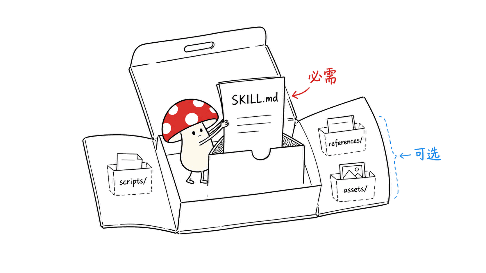
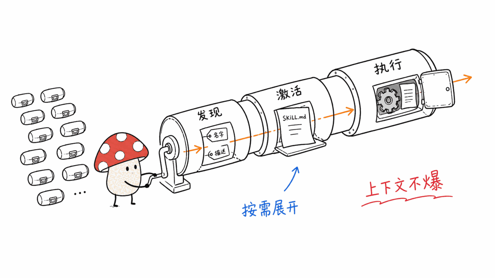
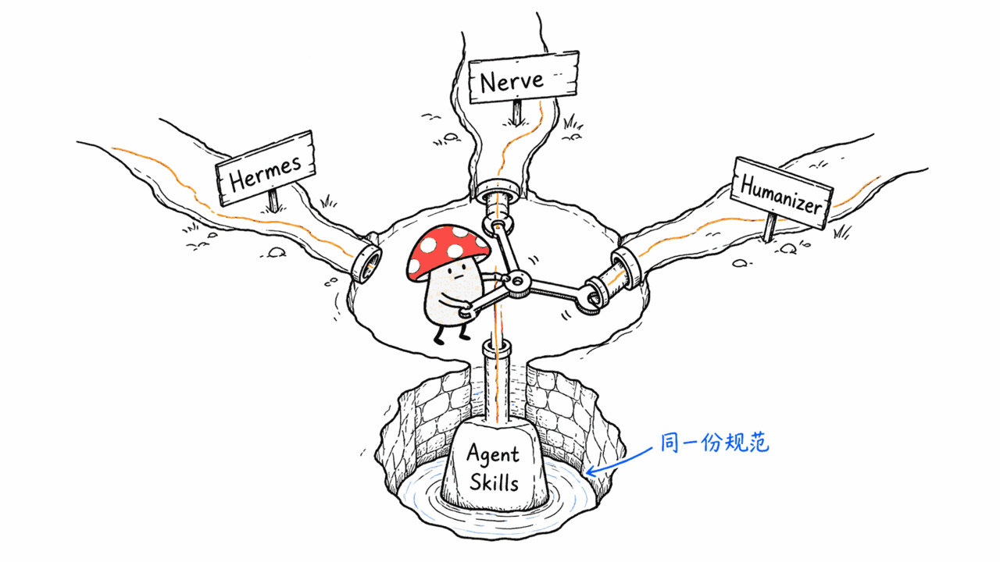
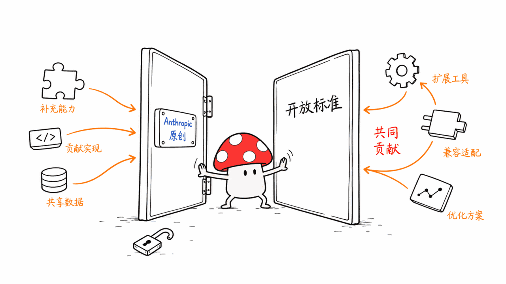

*by Mycelium Protocol*

---

项目地址：https://github.com/agentskills/agentskills
文档：https://agentskills.io
授权：代码 Apache-2.0，文档 CC-BY-4.0

---

## 一句话结论

**Agent Skills 是一份开放标准，不是某个产品**——它定义了"什么是一个可移植的 Agent 技能包"。今天连续写的几个项目里，Hermes Agent 的 skill 系统兼容这份标准，Nerve 的 skill 提炼/修订机制也是同一套设计思路，Humanizer 本身就是一个按这份标准打包的 skill。**这份规范是今天这一批文章背后真正的连接组织。** 由 Anthropic 原创并发布为开放标准，24374 star，代码 Apache-2.0、文档 CC-BY-4.0。

## 一个技能包长什么样

最简单的形式：一个文件夹，里面一个 `SKILL.md`。这个文件至少要有 `name` 和 `description` 两项元数据，加上告诉 Agent 怎么执行这个任务的指令。可以再加 `scripts/`（可执行代码）、`references/`（参考文档）、`assets/`（模板和资源）——但这些都是可选的，核心只有那一个 Markdown 文件。



```
my-skill/
├── SKILL.md          # 必需：元数据 + 指令
├── scripts/           # 可选：可执行代码
├── references/        # 可选：参考文档
├── assets/             # 可选：模板、资源
```

## 三阶段渐进式披露：为什么能同时挂一百个技能不爆上下文

这是整份规范的技术核心：

1. **发现阶段**：启动时，Agent 只加载每个技能的名字和描述——刚好够判断"这个技能什么时候可能用得上"。
2. **激活阶段**：当一个任务匹配上某个技能的描述，Agent 才把完整的 `SKILL.md` 指令读进上下文。
3. **执行阶段**：Agent 按指令执行，需要的话跑打包的代码，或者按需加载引用的文件。

**完整指令只在任务真正需要时才加载**，这意味着 Agent 手头可以挂着大量技能，但上下文占用始终很小。这个设计模式眼熟吗——今天写的 Nerve 里，skill 在系统提示词里默认只放名字和一句话描述，完整内容按需加载，就是同一套渐进式披露。这不是巧合，是同一份规范的两个不同实现。



## 谁在用

Agent Skills 得到了大量 AI 工具和 Agent 客户端的支持，官方维护了一份 Client Showcase 展示这些采用者。今天这批文章里能直接对上号的：

- **Hermes Agent** 的技能系统明确写了"compatible with the agentskills.io open standard"
- **Nerve** 的 `skill-extractor`/`skill-reviser` 定时任务机制，走的是同一套"渐进式披露 + 可移植技能包"设计
- **Humanizer** 本身就是一个纯 `SKILL.md` 文件，能装进任何支持这份标准的 Agent

一份标准能让"写一次、到处能用"成立，这几个项目就是活的证据——不需要为每个 Agent 产品单独写一份适配。



## 出身：Anthropic 原创，开放给整个生态

Agent Skills 格式最早由 Anthropic 开发，发布为开放标准之后，被越来越多的 Agent 产品采用。标准本身对整个生态开放贡献——README 里明确指向 `CONTRIBUTING.md`，欢迎外部参与共建，不是 Anthropic 单方面维护的封闭规范。



## 谁该看这个

**适合**：正在给自己的 Agent 产品设计"可扩展能力"这一层的开发者——与其自己发明一套技能格式，不如直接对齐这份已经被广泛采用的开放标准，换来的是生态里已有的技能包可以直接复用；想理解"为什么今天写的这几个项目在技能设计上这么像"的读者。

**不适合 / 需要注意**：这是规范文档仓库，不是可以直接跑起来的产品，想找具体实现去看 Hermes Agent、Nerve，或者官方的 Example Skills 仓库（`anthropics/skills`）。

---

> © 2026 Author: Mycelium Protocol. 本文采用 [CC BY 4.0](https://creativecommons.org/licenses/by/4.0/deed.zh) 授权——欢迎转载和引用，须注明作者姓名及原文链接，不得去除署名后以原创发布。

<!--EN-->

## TL;DR

**Agent Skills is an open standard, not a product** — it defines what a portable agent skill package looks like. Among the projects covered in this same batch of articles, Hermes Agent's skill system is compatible with this standard, Nerve's skill extraction/revision mechanism follows the same design thinking, and Humanizer itself is a skill packaged to this exact spec. **This standard is the actual connective tissue behind today's batch of articles.** Originally developed by Anthropic and released as an open standard, 24,374 stars, Apache 2.0 for code, CC-BY-4.0 for documentation.

## What a skill package looks like

In its simplest form: a folder containing one `SKILL.md`. That file needs at minimum `name` and `description` metadata, plus instructions telling the agent how to perform the task. You can add `scripts/` (executable code), `references/` (documentation), and `assets/` (templates and resources) — all optional. The core is that one Markdown file.


```
my-skill/
├── SKILL.md          # Required: metadata + instructions
├── scripts/           # Optional: executable code
├── references/        # Optional: documentation
├── assets/             # Optional: templates, resources
```

## Three-stage progressive disclosure: why you can load a hundred skills without blowing the context

This is the technical core of the whole spec:

1. **Discovery**: at startup, the agent loads only each skill's name and description — just enough to know when it might be relevant.
2. **Activation**: when a task matches a skill's description, the agent reads the full `SKILL.md` instructions into context.
3. **Execution**: the agent follows the instructions, optionally running bundled code or loading referenced files as needed.

**Full instructions load only when a task actually calls for them**, meaning an agent can hold a large number of skills on hand while keeping its context footprint small. Sound familiar? In Nerve, covered earlier today, only a skill's name and one-line description sit in the system prompt by default, with full content loading on demand — the exact same progressive disclosure pattern. Not a coincidence — two different implementations of the same spec.


## Who's using it

Agent Skills is supported by a large number of AI tools and agentic clients, with an official Client Showcase listing adopters. A few from this same batch of articles line up directly:

- **Hermes Agent**'s skill system explicitly states it's "compatible with the agentskills.io open standard"
- **Nerve**'s `skill-extractor`/`skill-reviser` crons follow the same "progressive disclosure plus portable skill package" design
- **Humanizer** is itself a plain `SKILL.md` file, installable into any agent that supports this standard

A standard is what makes "write once, run anywhere" hold up — these projects are living proof, with no need to write a separate adapter for every agent product.


## Origin: built by Anthropic, opened to the whole ecosystem

The Agent Skills format was originally developed by Anthropic, and once released as an open standard, has been adopted by a growing number of agent products. The standard itself is open to contribution from the broader ecosystem — the README points directly to `CONTRIBUTING.md`, welcoming outside participation rather than being a closed spec maintained unilaterally by Anthropic.


## Who should look at this

**Good fit**: developers designing the "extensible capability" layer for their own agent product — rather than inventing a proprietary skill format, aligning with this already widely-adopted open standard means existing skill packages in the ecosystem become directly reusable; readers curious why several projects covered today converge on such similar skill designs.

**Not a fit / worth noting**: this is a spec/documentation repository, not a runnable product — for concrete implementations, look at Hermes Agent, Nerve, or the official Example Skills repository (`anthropics/skills`).

---

> © 2026 Author: Mycelium Protocol. Licensed under [CC BY 4.0](https://creativecommons.org/licenses/by/4.0/) — free to share and adapt with attribution. You must credit the author and link to the original; removing attribution and republishing as original is not permitted.
