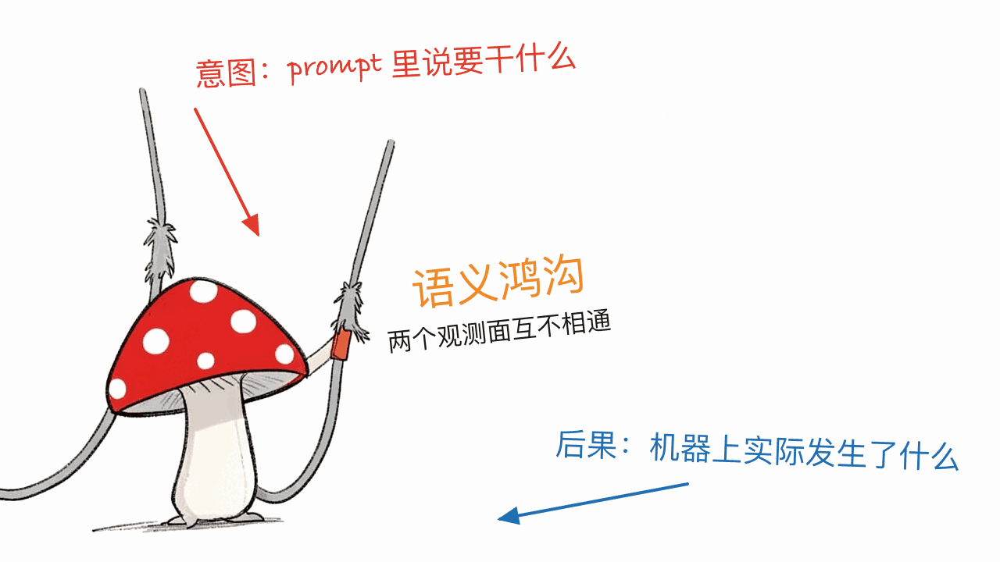
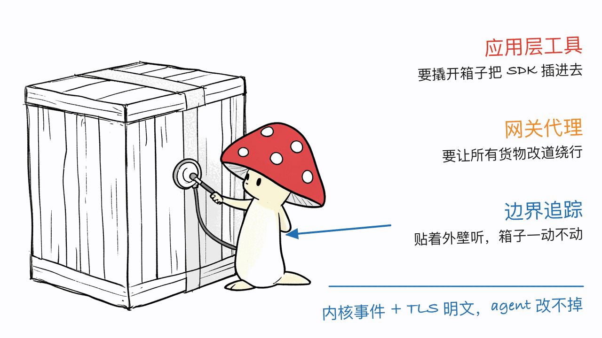

*by Mycelium Protocol*

---

项目地址：https://github.com/eunomia-bpf/agentsight
论文：AgentSight: System-Level Observability for AI Agents Using eBPF
arXiv 全文：https://arxiv.org/abs/2508.02736
ACM DOI：https://dl.acm.org/doi/10.1145/3766882.3767169
在线 Demo：https://agentsight.us
授权：MIT

---

## 一句话结论

**AgentSight 不是又一个 agent trace 平台，它是给 AI agent 配的 `top` 和 `strace`**：不进你的应用代码，而是站在系统边界上，一边在 SSL/TLS 调用处截下 LLM 的明文请求和响应（拿到"agent 想干什么"），一边用 eBPF 抓内核事件（看到"它实际干了什么"），再把这两条流按因果关系对起来。不需要装 SDK、不需要把流量绕过网关、agent 是闭源二进制也照抓。669 stars、101 forks，Rust + C，MIT，最新版 v1.0.30（8 月 25 日），今天还在提交。论文实测性能开销低于 3%。

## 它解决的是一个「语义鸿沟」问题

论文里对这个问题的定义很准：**现有工具要么只看得到 agent 的高层意图，要么只看得到底层动作，没法把两者对起来。**

- LangSmith、Langfuse、Phoenix 这类应用层工具，能给你漂亮的 trace、prompt、token 和延迟——**前提是应用代码是你的**，你能往里插 SDK 或回调。
- Helicone 这类网关/代理工具，前提是你能把 provider 流量路由到一个托管端点。
- 而 agent 自己写的日志，**agent 自己就能改、能关、能写得不全**。

于是就出现了一个尴尬的盲区：当一个 agent 跑失败了、卡住了、或者行为诡异，你分不清这是正常操作、是被 prompt injection 带偏了、还是陷进了一个烧钱的推理死循环。因为**意图**（在 prompt 里）和**后果**（在系统调用里）分别躺在两个互不相通的观测面上。



AgentSight 把这个鸿沟叫 semantic gap，它的解法叫 **boundary tracing（边界追踪）**：不在应用内部埋点，而是在两个"稳定的系统接口"上观测——SSL/TLS 库的调用点，和内核。这两个接口的好处是**不随 agent 的框架和 API 变化而变化**，所以这套方法天然是 framework-agnostic 的，agent 明天换个 SDK 也不用改观测代码。

## 和本站写过的可观测性工具怎么区分

本站发过两篇相关的，先划清边界，免得读者以为是同一类东西：

- **Retrace**（本站 7 月 4 日）：应用层的 trace 记录与回放/分叉工具，SaaS 形态，免费额度每月 1000 次 trace。它记录的是 LLM 调用和工具调用这一层。
- **Agentic Harness Engineering**（本站 8 月 9 日）：学术工作，用三层可观测性驱动 harness **自我进化**——可观测性在那里是手段，进化才是目的。
- **AgentSight**：观测的是**系统边界**。子进程执行、文件读写、网络目标、TLS 明文载荷——这些是上面两类工具结构性看不到的层。而且它的内核事件来自内核，**agent 改不掉**。

一句话：前两者回答"模型和工具调用发生了什么"，AgentSight 回答"这台机器上实际发生了什么，以及它和当时那句 prompt 有没有因果关系"。



## 技术上它怎么做到不用 SDK

三件事拼起来：

**1. 在 SSL/TLS 调用处截明文。** LLM 流量是加密的，但加密发生在应用调用 SSL 库**之后**。AgentSight 在调用点挂钩子，拿到的是还没加密的明文载荷——所以既不用当中间人代理，也不用你交出证书。

**2. 用 eBPF 抓内核事件。** 进程创建、文件打开、网络连接，全部从内核侧观测。eBPF 的性质决定了这是旁路的、应用无感的，论文测下来 CPU 开销 **低于 3%**。

**3. 把两条流做因果关联。** 这是最难也最有价值的一步：靠实时引擎跨进程边界把「这次 LLM 响应」和「随后这一串子进程和文件操作」串起来，必要时用二次 LLM 分析辅助判断。论文报告的三个实际战果就来自这一步——**检出 prompt injection 攻击、识别出烧钱的推理死循环、发现多 agent 系统里隐藏的协调瓶颈**。

配套的可视化做得相当舍得下功夫：`agentsight vis` 能把一次仓库开发过程渲染成动画回放（叫 Agent Nebula，展示 agent 怎么读、写、创建、重命名、删除文件）；还有语义火焰图，**宽度是系统影响权重**而不是传统的耗时；`agentpprof` 直接输出 pprof 格式，`go tool pprof` 就能打开，token 用量按项目、agent、session、模型分组看成本。

## 装上跑一遍

```bash
# 安装（三选一）
brew tap eunomia-bpf/tap && brew install eunomia-bpf/tap/agentsight   # 目前只支持 Linux x86-64
cargo install agentsight
# 或直接下 release 二进制：agentsight-x86_64 / agentsight-aarch64（Linux）

# 实时看：类似 top 的排行视图
agentsight top

# 录一次 Claude Code 会话（需要 root 起 eBPF 探针；被观测的 agent 仍以普通用户身份跑）
sudo agentsight record -- claude

# 看结果
agentsight report                  # 最近一次运行的摘要
agentsight report prompts --json   # 完整 LLM 请求/响应
agentsight report token --group-by dir  # token 用量按工作目录分组
agentsight report audit --json     # 进程创建、文件打开、API 调用
agentsight report serve            # 本地 Web UI，默认 127.0.0.1:7395
```

开箱支持的 agent：Claude Code、Gemini CLI、Kimi Code、Grok Build、Python 系（aider、open-interpreter）、Docker 容器里的（OpenClaw），以及任意命令 `record -- <command>`。

还能把抓到的 LLM 调用按 OpenTelemetry **GenAI 语义约定**（`gen_ai.*` span）从 OTLP/HTTP 导出——等于给任何 agent 白送一套标准 telemetry，进程内零埋点。

## 数据在哪、要不要担心

这是本站读者会先问的问题，直接说清楚：

- `record` 的会话存成当前目录下的 `agentsight-*.db`（SQLite），`monitor` 的后台周报库放 `~/.agentsight/monitor`，`top` 只显示实时会话不落盘。
- **全部在本地**，没有云端上报环节。
- 但反过来要提醒：抓下来的东西**包含 prompt、模型响应、文件路径、HTTP header、网络目标**。项目 FAQ 自己写了"treat logs and DBs as sensitive"——这些 .db 文件本身就是高敏感物，别顺手 commit 进仓库，也别随便发给别人排查问题。

## 现在就能不能重度依赖它？

能用，但**得先看你在哪个平台上**——这是最关键的一条实用信息：

| 你的系统 | 能用什么 |
|---|---|
| **Linux**（内核 4.1+，推荐 5.0+，需 sudo 或 `CAP_BPF`） | 全功能：`record` eBPF 捕获 + 全部分析命令 |
| **macOS / Windows** | 只能跑 `top`、`vis`、`report`、`bind`——**读的是 Claude/Codex/Gemini 自己的本地 session 文件，没有 eBPF 捕获** |

也就是说，**Mac 用户拿不到这套方案最核心的那部分能力**（内核事件 + TLS 明文截获），只能用 agent 原生会话文件做离线分析。想要完整体验，得在 Linux 上跑，或者扔进一台 Linux 虚拟机/服务器。

其他几个已知边界，项目 FAQ 里写得很坦白：

- **Claude Code、Node.js 全系、Bun 静态链接了自己的 SSL 库**（BoringSSL / OpenSSL），不走系统 `libssl.so`，所以默认没有钩子可挂。解法是用 `record -- <command>`（会自动发现二进制），或 attach 模式手动传 `--binary-path`。
- **Cursor 这类 IDE agent 走不通 eBPF**：Electron 应用、主要跑在 macOS/Windows、TLS 藏在剥离符号的框架二进制和 helper 进程里，而且 Cursor 的 API 流量是 protobuf 不是 JSON——就算抓成功了也解析不出 LLM 事件。这类 agent 只能走 agent-native session 那条路。
- `vis` 导出 GIF 需要本地有 Chromium 和 FFmpeg；不想装的话用 `-o output/agent-nebula.html` 出自包含的 HTML。

成熟度上倒是不用太担心：669 stars、101 forks、v1.0.30 已经迭代到位，有 CI、有 Homebrew tap、有 crates.io 上独立发布的 `agentsight-capture` 库，还有一篇经过同行评审、拿到 ACM DOI 的论文。这在本站写过的同类早期项目里算工程完成度很高的。

## 为什么这件事在今天变得重要

README 结尾那句话点得挺准：随着 AI agent 越来越自主、越来越能自我修改，**依赖 agent 自己汇报自己**的可观测性就不成立了。

这跟本站一贯关心的问题是同一个：当你把执行权交给一个非确定性的系统，你需要一条它无法篡改的观测通道。本站之前写 tnk 讲的是**隔离**——把 agent 关进独立 VM，限制它能碰什么；AgentSight 补的是另一半——**审计**：它到底碰了什么。一个管边界，一个管记录，两件事正交，合起来才是完整的答案。

而且这两件事都能在自己的机器上完成，不需要把 prompt 和代码交给任何第三方平台。

---

> © 2026 Author: Mycelium Protocol. 本文采用 [CC BY 4.0](https://creativecommons.org/licenses/by/4.0/deed.zh) 授权——欢迎转载和引用，须注明作者姓名及原文链接，不得去除署名后以原创发布。

<!--EN-->

*by Mycelium Protocol*

---

Repository: https://github.com/eunomia-bpf/agentsight
Paper: AgentSight: System-Level Observability for AI Agents Using eBPF
arXiv: https://arxiv.org/abs/2508.02736
ACM DOI: https://dl.acm.org/doi/10.1145/3766882.3767169
Live demo: https://agentsight.us
License: MIT

---

## TL;DR

**AgentSight is not another agent-trace platform — it is `top` and `strace` for AI agents.** It never enters your application code. Instead it sits at the system boundary: on one side it intercepts plaintext LLM requests and responses at SSL/TLS call sites (what the agent *intends*), on the other it watches kernel events via eBPF (what the agent *actually did*), then causally correlates the two streams. No SDK, no gateway to route through, and it works even when the agent is a closed-source binary. 669 stars, 101 forks, Rust + C, MIT, latest release v1.0.30 (Aug 25), still committing today. The paper measures under 3% performance overhead.

## The problem is a semantic gap

The paper states it precisely: **existing tools observe either an agent's high-level intent or its low-level actions, but cannot correlate the two.**

- LangSmith, Langfuse, and Phoenix give you great traces, prompts, tokens, and latency — **as long as you own the application code** and can wire in an SDK or callbacks.
- Gateway/proxy tools like Helicone require that you can route provider traffic through a managed endpoint.
- And logs the agent writes itself are logs the agent **can modify, disable, or leave incomplete**.

That leaves an awkward blind spot: when a run fails, stalls, or behaves strangely, you cannot tell a benign operation from a prompt-injection attack from an expensive reasoning loop — because the **intent** (in the prompts) and the **consequences** (in the syscalls) live on two observation planes that never meet.


AgentSight calls that gap the semantic gap, and its answer is **boundary tracing**: don't instrument the application, observe at two *stable system interfaces* — the SSL/TLS library call site, and the kernel. Both are stable across framework and API churn, which makes the whole approach framework-agnostic: the agent can swap SDKs tomorrow and the instrumentation still holds.

## How it differs from the observability tools we've covered

Two prior posts on this blog are adjacent, so let's draw the lines first:

- **Retrace** (this blog, Jul 4): application-level trace recording with replay and forking, SaaS-shaped, 1,000 free traces/month. It records the LLM-call and tool-call layer.
- **Agentic Harness Engineering** (this blog, Aug 9): academic work that uses three-layer observability to drive **harness self-evolution** — there observability is the means, evolution is the end.
- **AgentSight**: observes the **system boundary**. Subprocess execution, file reads and writes, network destinations, plaintext TLS payloads — the layer the other two structurally cannot see. And its kernel events come from the kernel, so **the agent cannot alter them**.

In one line: the first two answer "what model and tool calls happened"; AgentSight answers "what actually happened on this machine, and whether it was caused by that particular prompt."


## How it works without an SDK

Three pieces:

**1. Plaintext capture at SSL/TLS call sites.** LLM traffic is encrypted — but encryption happens *after* the application calls into the SSL library. AgentSight hooks that call site and reads the payload before encryption, so it needs neither a MITM proxy nor your certificates.

**2. Kernel events via eBPF.** Process creation, file opens, network connections — all observed kernel-side. eBPF makes this out-of-band and invisible to the application; the paper measures CPU overhead at **under 3%**.

**3. Causal correlation across the two streams.** This is the hard and valuable part: a real-time engine links "this LLM response" to "the burst of subprocesses and file operations that followed" across process boundaries, with secondary LLM analysis where needed. The paper's three concrete results all come from this step — it **detects prompt injection attacks, identifies resource-wasting reasoning loops, and reveals hidden coordination bottlenecks in multi-agent systems**.

The visualization work is unusually generous: `agentsight vis` renders a development session as an animated replay (Agent Nebula — showing how agents read, write, create, rename, and delete files across a repository); there are semantic flamegraphs where **width is system-effect weight** rather than the usual wall time; and `agentpprof` emits standard pprof, so `go tool pprof` opens it directly and you can slice token usage by project, agent, session, and model.

## Installing and running it

```bash
# Install (pick one)
brew tap eunomia-bpf/tap && brew install eunomia-bpf/tap/agentsight   # Linux x86-64 only today
cargo install agentsight
# or grab a release binary: agentsight-x86_64 / agentsight-aarch64 (Linux)

# Live ranked view, top-style
agentsight top

# Record a Claude Code session (root needed for eBPF probes;
# the observed agent still runs as your normal user)
sudo agentsight record -- claude

# Inspect
agentsight report                  # summary of the latest run
agentsight report prompts --json   # full LLM request/response
agentsight report token --group-by dir  # token usage by working directory
agentsight report audit --json     # process spawns, file opens, API calls
agentsight report serve            # local web UI, 127.0.0.1:7395
```

Agents supported out of the box: Claude Code, Gemini CLI, Kimi Code, Grok Build, the Python family (aider, open-interpreter), containerized agents (OpenClaw via Docker), and any command through `record -- <command>`.

It can also export captured LLM calls as OpenTelemetry **GenAI** (`gen_ai.*`) spans over OTLP/HTTP — standards-compliant telemetry for any agent, with zero in-process instrumentation.

## Where the data goes

The question readers here ask first, answered plainly:

- `record` sessions land in `agentsight-*.db` (SQLite) in the current directory; `monitor` keeps its weekly background DBs in `~/.agentsight/monitor`; `top` shows live sessions only and writes nothing.
- **Everything stays local** — there is no cloud reporting step.
- The flip side: what gets captured **includes prompts, model responses, file paths, HTTP headers, and network targets**. The project's own FAQ says to "treat logs and DBs as sensitive." Don't casually commit those .db files, and don't hand one to someone else for debugging help.

## Can you rely on it today?

Yes — but **it depends heavily on your platform**, and this is the single most important practical detail:

| Your OS | What you get |
|---|---|
| **Linux** (kernel 4.1+, 5.0+ recommended, sudo or `CAP_BPF`) | Everything: `record` eBPF capture plus all analysis commands |
| **macOS / Windows** | Only `top`, `vis`, `report`, `bind` — **reading Claude/Codex/Gemini's own local session files; no eBPF capture** |

In other words, **Mac users do not get the core of what makes this approach special** (kernel events plus TLS plaintext interception); they get offline analysis over agent-native session files. For the full experience you need Linux, or a Linux VM/server.

Other known boundaries, stated candidly in the project FAQ:

- **Claude Code, all of Node.js, and Bun statically link their own SSL library** (BoringSSL / OpenSSL) instead of using the system `libssl.so`, so by default there is nothing for the sniffer to hook. The fix is `record -- <command>` (which auto-discovers the binary) or passing `--binary-path` in attach mode.
- **IDE agents like Cursor cannot be traced via eBPF**: they are Electron apps running mostly on macOS/Windows, their TLS sits inside a stripped framework binary and a helper process, and Cursor's API traffic is protobuf rather than JSON — so even a successful capture yields no LLM events. Those agents go through the agent-native session path instead.
- `vis` needs local Chromium and FFmpeg to export GIF; use `-o output/agent-nebula.html` for a self-contained artifact with no such dependencies.

Maturity is not a concern here: 669 stars, 101 forks, already at v1.0.30, with CI, a Homebrew tap, a separately published `agentsight-capture` crate on crates.io, and a peer-reviewed paper with an ACM DOI. Among the early-stage projects covered on this blog, that is unusually complete engineering.

## Why this matters now

The line closing the README lands well: as AI agents become more autonomous and capable of self-modification, observability that **relies on the agent reporting on itself** stops being valid.

This is the same concern that runs through this blog: once you hand execution authority to a non-deterministic system, you need an observation channel it cannot tamper with. Our earlier post on tnk was about **isolation** — putting the agent in its own VM and limiting what it can touch. AgentSight supplies the other half: **audit** — what it actually touched. One governs the boundary, the other keeps the record; the two are orthogonal, and only together do they form a complete answer.

And both can be done on your own machine, without handing your prompts or your code to any third-party platform.

---

> © 2026 Author: Mycelium Protocol. Licensed under [CC BY 4.0](https://creativecommons.org/licenses/by/4.0/) — free to share and adapt with attribution. You must credit the author and link to the original; removing attribution and republishing as original is not permitted.
