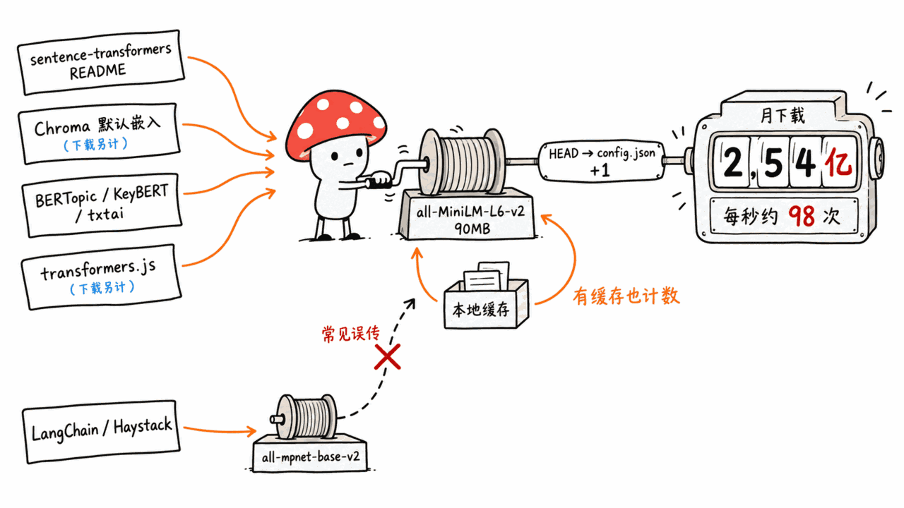
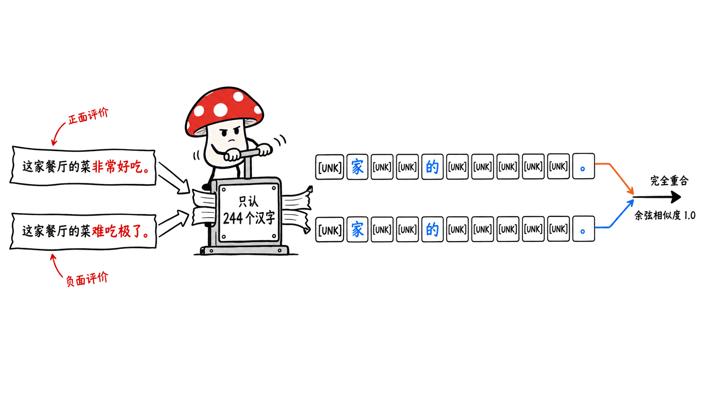
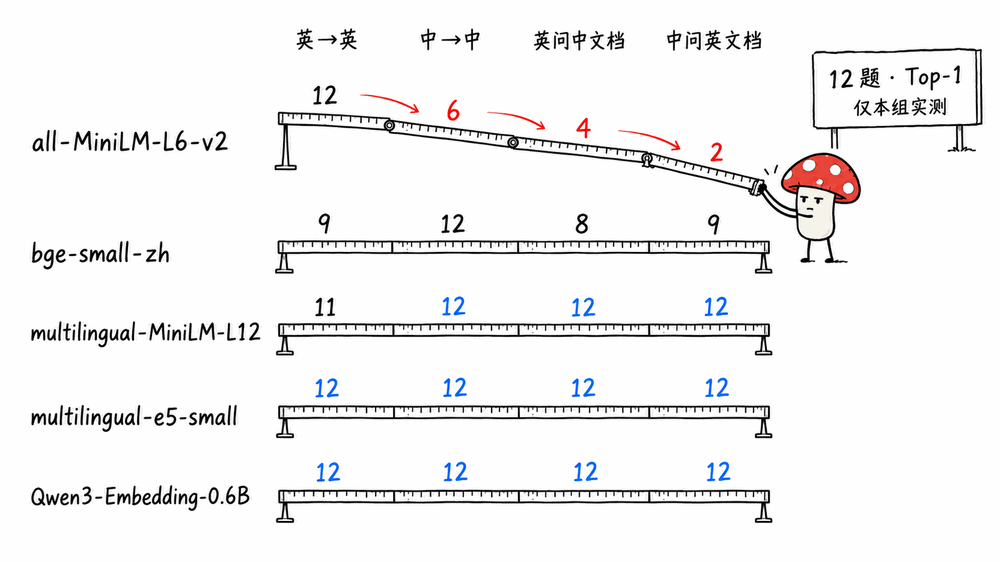
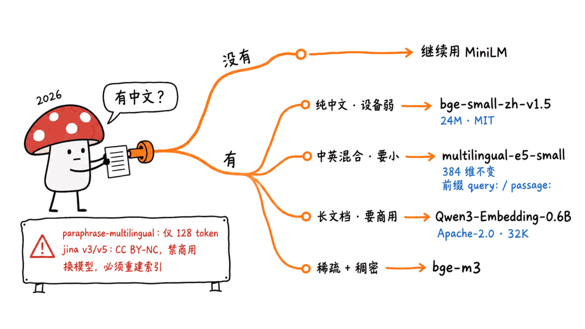

> 📌 一手资料
> 模型卡：https://huggingface.co/sentence-transformers/all-MiniLM-L6-v2
> 模型 API（下载量、参数量、提交记录）：https://huggingface.co/api/models/sentence-transformers/all-MiniLM-L6-v2
> 协议：Apache-2.0 ｜ 首次提交：2021-08-30 ｜ 最近提交：2026-06-01（只改了元数据）｜ 数据抓取：2026-09-11

---

**BLUF**：all-MiniLM-L6-v2 不是新模型。它是 2021 年 8 月 Hugging Face 社区周的作品，6 层、384 维、**22,713,216 个参数**，权重文件 90.9MB。但它到今天仍是 Hugging Face 全站下载量第一的模型：**近 30 天 2.54 亿次，累计 38.3 亿次**，是第二名的 2.9 倍。原因不在于它有多强，而在于它是太多工具的**默认值**：Chroma 不指定嵌入函数时用的就是它，sentence-transformers 的 README、BERTopic、KeyBERT、txtai、transformers.js 也都默认它（LangChain 不是，常见说法有误）。再加上 Hugging Face 把每一次对 `config.json` 的 GET 和 HEAD 请求都算作下载，而本地已有缓存时加载模型照样会发 HEAD 请求，所以这个数字更接近「被加载了多少次」。它的硬限制也很明确：**英文训练、只看前 256 个 token、词表里只有 244 个汉字**。我们在 Mac mini 上用 12 组中英文问答实测，它英文检索 12 题全对，**中文只对 6 题，跨语言检索只对 2-4 题**；「这家餐厅的菜非常好吃」和「这家餐厅的菜难吃极了」被编码成完全相同的 token 序列，**余弦相似度 1.0**。同样 2400 万参数的 bge-small-zh-v1.5 中文 12 题全对。我们的判断是：纯英文、短文本、要在 CPU 上跑的场景，它仍然够用；只要你的数据里有中文，就不该让它以默认值的身份混进你的系统。

## 它到底是个什么模型？

先把基本事实摆出来，全部取自 Hugging Face 模型 API 和模型卡：

| 项目 | 数值 |
|---|---|
| 首次提交 | 2021-08-30（API 里的 createdAt 是 2022-03-02，那是 HF 仓库迁移的时间，不是发布时间） |
| 最近提交 | 2026-06-01，只加了 `base_model` 元数据；31 次提交里没有一次重新训练 |
| 架构 | BERT，6 层，隐藏维度 384，12 个注意力头，基座 nreimers/MiniLM-L6-H384-uncased |
| 参数量 | 22,713,216（safetensors 统计，F32） |
| 输出 | 384 维，均值池化后 L2 归一化 |
| 最大输入 | 256 个 word piece，超出部分直接截断；训练时序列长度只有 128 |
| 词表 | 30,522 个，uncased 英文 WordPiece |
| 训练数据 | 11.7 亿句对，其中 Reddit 评论（2015-2018）7.26 亿对，占 62% |
| 协议 | Apache-2.0 |
| 文件 | model.safetensors 90.9MB；官方另附 ONNX、OpenVINO 版本，ARM64 int8 量化 ONNX 只有 23.0MB |

模型卡的 Background 一节写得很清楚：这是 2021 年 Hugging Face「JAX/Flax 社区周」里一个叫「用 10 亿句对训练史上最好的句向量模型」的项目产物，用对比学习在 TPU v3-8 上训了 10 万步，batch size 1024。

sentence-transformers 官方文档对它的定位是：all-mpnet-base-v2 质量最好，all-MiniLM-L6-v2「快 5 倍，质量仍然不错」。换句话说，它从一开始就是**速度优先的折中款**，不是旗舰。

## 为什么五年后还是下载第一？



2026-09-11 我们按下载量排序拉取了 Hugging Face 模型列表，前几名是这样的：

| 排名 | 模型 | 近 30 天下载 |
|---|---|---:|
| 1 | sentence-transformers/all-MiniLM-L6-v2 | 254,035,929 |
| 2 | cross-encoder/ms-marco-MiniLM-L6-v2 | 87,585,258 |
| 3 | BAAI/bge-small-en-v1.5 | 64,607,097 |
| 6 | sentence-transformers/paraphrase-multilingual-MiniLM-L12-v2 | 46,383,496 |
| 7 | BAAI/bge-m3 | 37,793,325 |
| 9 | sentence-transformers/all-mpnet-base-v2 | 24,088,055 |
| 13 | Qwen/Qwen3-0.6B | 20,685,071 |

2.54 亿次 / 30 天，平均**每秒约 98 次**。前 15 名里有 7 个是嵌入或重排模型，这说明 Hugging Face 的下载榜首先是一张「基础设施依赖榜」，而不是「热门模型榜」。我们找到四个原因。

### 原因一：它是太多工具的默认值

我们逐个去翻了源码，结论如下（2026-09-11 各仓库主分支）：

| 工具 | 默认嵌入模型 | 出处 |
|---|---|---|
| **Chroma**（29.3k star） | **all-MiniLM-L6-v2**（ONNX 版） | `chromadb/api/types.py` 的 `DefaultEmbeddingFunction` 直接委托给 `ONNXMiniLM_L6_V2`；JS 客户端默认 `Xenova/all-MiniLM-L6-v2` |
| **sentence-transformers** README | **all-MiniLM-L6-v2** | 快速上手的第一段代码就是 `SentenceTransformer("sentence-transformers/all-MiniLM-L6-v2")` |
| **BERTopic** | **all-MiniLM-L6-v2**（英文）；非英文用 paraphrase-multilingual-MiniLM-L12-v2 | `bertopic/backend/_utils.py` |
| **KeyBERT** | **all-MiniLM-L6-v2** | `keybert/_model.py`，`model="all-MiniLM-L6-v2"` |
| **txtai** | **all-MiniLM-L6-v2** | 官方配置文档：`Embeddings()` 不传参时用它 |
| **transformers.js** | **all-MiniLM-L6-v2**（onnx-community 转换版） | `feature-extraction` 管线的默认模型 |
| LangChain `HuggingFaceEmbeddings` | all-mpnet-base-v2 | `langchain_huggingface` 源码，**不是** MiniLM |
| Haystack `SentenceTransformersTextEmbedder` | all-mpnet-base-v2 | 官方文档 |
| LlamaIndex HF 嵌入 | BAAI/bge-small-en | `DEFAULT_HUGGINGFACE_EMBEDDING_MODEL` |
| Qdrant FastEmbed | BAAI/bge-small-en-v1.5 | `TextEmbedding` 构造函数默认值 |

网上常说「LangChain、LlamaIndex、Haystack 都默认 MiniLM」，这在今天的源码里不成立。LangChain 只有一个已废弃的 `HuggingFaceInferenceAPIEmbeddings` 类默认它。但教程和 starter 模板里大量复制粘贴的仍是 MiniLM，这比框架默认值影响更大。

一个反直觉的细节：**Chroma 的默认用法根本不算进这 2.54 亿**。它的 Python 客户端从自己的 S3 桶（chroma-onnx-models.s3.amazonaws.com）下载 ONNX 包，不走 Hugging Face。transformers.js 用户的下载则计在 Xenova 和 onnx-community 的转换仓库名下（Xenova/all-MiniLM-L6-v2 近 30 天 274 万次）。所以真实使用面比这个数字还要大。

### 原因二：Hugging Face 的「下载」其实是「请求」

Hugging Face 官方文档写明：没有专门配置的库，下载计数看的是 `config.json`，**对它的每一次 HTTP 请求，包括 GET 和 HEAD，都算一次下载**，不按用户去重。sentence-transformers 没有在 huggingface.js 的库配置里覆盖这个规则。

我们在本机验证了这件事：用 huggingface_hub 1.31.0 连续两次调用 `hf_hub_download` 取这个模型的 `config.json`，开启 `HF_DEBUG=1` 看请求日志。第二次文件已经在本地缓存里了，**它仍然向 `.../resolve/main/config.json` 发了一次 HEAD 请求**，用来检查有没有新版本；只有设置 `HF_HUB_OFFLINE=1` 后才一个请求都不发。

也就是说，每一次 CI 流水线、每一个没有挂缓存的容器冷启动、每一个 Serverless 函数实例、甚至每一次在联网机器上重新加载模型，都会给它加一次下载。一个被写进无数测试和部署脚本的 90MB 默认模型，在这种计数方式下天然会排第一。

### 原因三：小、快、协议干净

22.7M 参数、90.9MB、Apache-2.0，不需要 GPU，不需要登录，不需要接受任何条款。在我们这台 Mac mini（M4）上，它用 CPU 每秒能编码约 1171 句英文短句。对一个原型来说，这几乎是零成本的决定。

### 原因四：对英文短文本，它确实不差

我们的 12 道英文检索题，它 12 道全对（下面有完整数据）。在英文 FAQ 匹配、短句去重、聚类这类任务上，它交出的结果大多数时候「够用」。**够用 + 零成本 + 默认值**，这三件事加在一起就是 38.3 亿次累计下载。

## 它的硬限制在哪里？

### 256 token 截断：前一篇已经实测过

本站在《mcp-rag-server 拆解》一文里已经测过这一点：一个 2554 token 的中文 chunk 和它自己的前 254 个 token 编码出来余弦相似度是 1.0，**256 token 之后的内容对检索完全不可见**；该文测的中文 chunk 里有 34.3% 的 token 是 [UNK]。细节见：https://blog.mushroom.cv/blog/mcp-rag-server-local-rag-claude-code-blueprint/

还要补一句：模型卡写明它**训练时序列长度只有 128**，256 是推理时的截断上限。所以哪怕在英文上，超过 128 token 的那一段也不在它最擅长的范围里。

### 词表里只有 244 个汉字

这次我们直接去数了它的 `vocab.txt`：30,522 个词条里，单个汉字（U+4E00 到 U+9FFF）只有 **244 个**。我们写的 12 段中文文档共 440 个汉字，其中 **345 个（78.4%）不在词表里**，比如「猫」「密」「码」「房」「租」「睡」「饭」。

分词结果很直观：

```
怎么重置我的密码？    → [UNK] [UNK] [UNK] [UNK] 我 的 [UNK] [UNK] ？
猫一天该喂几顿？      → [UNK] 一 天 [UNK] [UNK] [UNK] [UNK] ？
租房合同到期房东不退押金 → [UNK] [UNK] 合 同 [UNK] [UNK] [UNK] [UNK] 不 [UNK] [UNK] 金
How do I reset my password? → how do i reset my password ?
```

按 token 算，这 12 段中文文档有 **70.9%** 被编成 [UNK]。这比 mcp-rag-server 那篇测到的 34.3% 更高，因为那篇的 chunk 里混着大量英文术语和数字，而这里是纯中文口语。



### 「好吃」和「难吃」是同一个向量

最能说明问题的一组：

```
这家餐厅的菜非常好吃。 → [UNK] 家 [UNK] [UNK] 的 [UNK] [UNK] [UNK] [UNK] [UNK] 。
这家餐厅的菜难吃极了。 → [UNK] 家 [UNK] [UNK] 的 [UNK] [UNK] [UNK] [UNK] [UNK] 。
余弦相似度：0.99999976
```

两句话意思相反，分词后却是**完全相同的 11 个 token**，模型根本没机会区分它们。我们又换了一组「这部电影非常精彩」和「这部电影无聊透顶」，结果一样：token 序列相同，余弦相似度 1.0。

这不是「中文效果差一点」，而是**信息在进入模型之前就已经丢了**。模型再怎么训练都救不回来，只能换模型。

## 实测：同一组题，五个模型

**环境**：Mac mini（Apple M4，10 核，16GB），macOS 26.6.2；Python 3.12 venv；torch 2.14.0、sentence-transformers 6.0.1、transformers 5.17.0。模型从 Hugging Face 下载后校验了 SHA-256。

**题目**：我们写了 12 个日常话题（重置密码、退货、喂猫、电脑开不了机、失眠、日本签证、股息税、煮饭、疫苗反应、学游泳、充电慢、押金），每个话题一段中文文档、一段对应的英文文档、一条中文提问、一条英文提问。提问是改写过的，尽量不照抄文档里的关键词。每条提问在 12 段文档里找最相关的一段，看第一名是不是正确答案。按各模型官方要求加前缀：multilingual-e5 用 `query: ` / `passage: `，bge-small-zh 查询加官方指令，Qwen3-Embedding 查询用 `prompt_name="query"`。

**结果（12 题中 Top-1 答对几题）**：

| 模型 | 参数量 | 维度 | 最长输入 | 英→英 | 中→中 | 英问→中文档 | 中问→英文档 |
|---|---:|---:|---:|:---:|:---:|:---:|:---:|
| **all-MiniLM-L6-v2** | 22.7M | 384 | 256 | **12** | **6** | **4** | **2** |
| bge-small-zh-v1.5 | 24.0M | 512 | 512 | 9 | 12 | 8 | 9 |
| paraphrase-multilingual-MiniLM-L12-v2 | 117.7M | 384 | **128** | 11 | 12 | 12 | 12 |
| multilingual-e5-small | 117.7M | 384 | 512 | 12 | 12 | 12 | 12 |
| Qwen3-Embedding-0.6B | 595.8M | 1024 | 32,768 | 12 | 12 | 12 | 12 |



12 道题太简单，区分不出后三个模型的高下，这不是一个排行榜。它能说明的只有一件事：**all-MiniLM-L6-v2 在中文上的失败不是「稍差」，而是在一个其他模型全对的简单测试上只对一半**。它答对的 6 道里，一部分靠词表里侥幸存在的字（比如签证题里的「日」「本」、押金题里的「合」「同」「金」）；还有一道「忘了登录密码怎么办？」分词后是 9 个 [UNK] 加一个问号，它也「答对」了，这只能算碰巧。

**再看一组句对相似度**，更能看出问题出在哪：

| 句对 | MiniLM-L6 | bge-small-zh | multi-MiniLM-L12 | me5-small | Qwen3-0.6B |
|---|---:|---:|---:|---:|---:|
| 英文同义（重置密码 / 忘了登录凭证） | 0.652 | 0.574 | 0.650 | 0.844 | 0.639 |
| 英文无关（重置密码 / 猫在窗台睡觉） | 0.137 | 0.503 | 0.041 | 0.679 | 0.190 |
| 中文同义（我怎么重置密码 / 我忘记了登录密码） | 0.811 | 0.623 | 0.754 | 0.904 | 0.644 |
| **中文无关**（我怎么重置密码 / 猫在窗台上睡觉） | **0.604** | 0.206 | 0.000 | 0.786 | 0.192 |
| **中文反义**（菜非常好吃 / 菜难吃极了） | **1.000** | 0.829 | 0.637 | 0.936 | 0.774 |
| **跨语言同义**（英文 / 中文「重置密码」） | **0.046** | 0.471 | 0.920 | 0.875 | 0.790 |
| 跨语言无关 | 0.102 | 0.226 | 0.061 | 0.722 | 0.183 |

读这张表要注意三点：

1. **MiniLM 给任意两句中文都打高分**。「重置密码」和「猫在睡觉」得 0.604，几乎和英文同义句的 0.652 一样高。12 段中文文档两两之间的平均相似度是 0.526，正确答案的平均分只有 0.614，两者只差 0.088；英文这个差距是 0.648。如果你用英文数据调了一个 0.6 的相似度阈值，拿到中文上会把大量无关内容当成命中。
2. **MiniLM 的跨语言能力是零**。英文和中文的「重置密码」相似度 0.046，比英文和一句无关中文的 0.102 还低。
3. **multilingual-e5 的分数整体偏高是正常的**。它的模型卡 FAQ 解释过：训练用了 0.01 的低温度，余弦相似度会集中在 0.7 到 1.0 之间，只看相对顺序、不看绝对值。换成它之后，原来按绝对值写的阈值必须重调。

**速度（512 句英文短句，batch 32）**：

| 模型 | CPU（句/秒） | MPS（句/秒） |
|---|---:|---:|
| all-MiniLM-L6-v2 | 1171 | 224 |
| bge-small-zh-v1.5 | 707 | 184 |
| paraphrase-multilingual-MiniLM-L12-v2 | 612 | 1189 |
| multilingual-e5-small | 613 | 1215 |
| Qwen3-Embedding-0.6B | 4.9 | 73.5 |

一个意外发现：**对 2000 多万参数的小模型，Apple GPU（MPS）反而比 CPU 慢 5 倍**，调度开销比计算本身还大；到 1 亿参数级别，MPS 就快一倍。Qwen3-Embedding-0.6B 在 CPU 上只有约 5 句/秒（PyTorch 默认只用了 4 个线程，我们没有调优），在 Mac 上一定要走 MPS。

## 2026 年该换成什么？



下表的参数量、协议、上下文长度来自各模型的 Hugging Face API 和模型卡（2026-09-11），「实测」一列是我们本机跑过的：

| 模型 | 参数量 | 维度 | 最长输入 | 协议 | 实测 | 适合 |
|---|---:|---:|---:|---|:---:|---|
| BAAI/bge-small-zh-v1.5 | 24.0M | 512 | 512 | MIT | ✅ | 纯中文、要和 MiniLM 一样小一样快 |
| intfloat/multilingual-e5-small | 117.7M | 384 | 512 | MIT | ✅ | 中英混合、跨语言，维度和 MiniLM 相同 |
| paraphrase-multilingual-MiniLM-L12-v2 | 117.7M | 384 | **128** | Apache-2.0 | ✅ | 短句相似度、聚类；**不适合长段落检索** |
| Qwen/Qwen3-Embedding-0.6B | 595.8M | 1024（可降到 32） | 32K | Apache-2.0 | ✅ | 中英文长文档检索，要质量也要商用自由 |
| BAAI/bge-m3 | 约 5.7 亿（fp32 权重 2.27GB） | 1024 | 8192 | MIT | ❌ | 多语言长文档，稠密+稀疏+多向量三合一 |
| google/embeddinggemma-300m | 302.9M | — | — | Gemma 条款，需在 HF 上申请 | ❌ | 端侧多语言，接受 Gemma 条款 |
| jinaai/jina-embeddings-v5-text-nano / small | 212M / 596M | 768 / — | 8192 | **CC BY-NC 4.0** | ❌ | 只能非商用，商用要找 Jina 买授权 |
| Qwen/Qwen3-Embedding-4B / 8B | 4.0B / 7.6B | 2560 / 4096 | 32K | Apache-2.0 | ❌ | 有 GPU、要最高质量 |

我们的建议按场景分：

- **数据是纯中文、机器很弱（树莓派、老笔记本、浏览器端）**：换 bge-small-zh-v1.5。参数量几乎和 MiniLM 一样，中文 12 题全对，CPU 上每秒 700 句。代价是英文变弱（我们的英文题只对 9 道）。
- **中英混合、要跨语言检索，但还想保持小体积**：multilingual-e5-small。维度同样是 384，向量库的存储开销不变。记得加 `query: ` / `passage: ` 前缀，并重调阈值。
- **正经做 RAG、文档有长有短、需要商用**：Qwen3-Embedding-0.6B。Apache-2.0，32K 上下文，按 Qwen 模型卡自报的数据，它在 MTEB 多语言榜平均分 64.33、C-MTEB 中文榜 66.33，高于同表里的 BGE-M3（多语言 59.56）。在 16GB 的 Mac 上用 MPS 每秒 70 多句，给个人知识库建索引完全够用。
- **想要稀疏 + 稠密混合检索，或者已经在用 Cloudflare Workers AI**：bge-m3。本站自己的站内搜索用的就是 Workers AI 上的 `@cf/baai/bge-m3`，见《给静态博客装一套「关键词 + 语义」混合搜索》：https://blog.mushroom.cv/blog/hybrid-search-pagefind-vectorize-workers-ai-guide/ 。本机版我们这次没有测，它的 fp32 权重有 2.27GB。
- **别被 paraphrase-multilingual-MiniLM-L12-v2 的名字骗了**。它是 BERTopic 的非英文默认值，看起来像 MiniLM 的「多语言平替」，但它的 `max_seq_length` 是 **128**，按我们测的中文分词密度（约 0.72 token/字）推算，超过约 175 个汉字的内容就被截掉了。做短句聚类没问题，做段落检索会重演 MiniLM 的截断问题。
- **jina-embeddings 系列的许可证要看清楚**。v3、v5 的权重都是 CC BY-NC 4.0，禁止商用；v4 的模型卡写明实际适用 Qwen Research License。

## 换模型时容易踩的坑

1. **维度变了，索引必须重建**。MiniLM 是 384 维，换成 bge-small-zh 是 512、Qwen3 是 1024。Chroma 这类向量库在集合第一次写入时就固定了维度，只能删掉重建。
2. **前缀和指令不加，效果打折**。e5 系列要求每条输入以 `query: ` 或 `passage: ` 开头，非英文也一样；Qwen3-Embedding 查询端要加指令，模型卡说不加通常掉 1%-5%，并建议指令用英文写。
3. **分数分布不同，阈值要重调**。同一对句子，MiniLM 给 0.652，e5 给 0.844，Qwen3 给 0.639。任何写死的相似度阈值都要在新模型上重新标定。
4. **中文切块要按字符或句子**。按空格切词的切块器会把一整段中文当成一个词，这一点在 mcp-rag-server 那篇里已经实测过。
5. **Chroma 用户先确认自己是不是在用默认值**。创建集合时没传 `embedding_function`，你的中文数据就是用 MiniLM 编码的。
6. **生产环境设 `HF_HUB_OFFLINE=1`**。模型下载好之后，这个变量能让每次加载不再向 Hugging Face 发请求，启动更快，也不依赖外网。

## 我们的判断

all-MiniLM-L6-v2 是一个好模型，它的问题是**太好用了**。90MB、无需 GPU、无需登录、Apache-2.0，这些优点让它变成了无数工具和教程里「不用想」的那个默认值。而默认值最危险的地方在于：它不会报错。中文数据塞进去，照样返回 384 维向量，照样返回 0.6 以上的相似度，一切看起来都在正常工作，直到有人发现搜「好吃」会搜出「难吃」。

所以我们的建议不是「永远别用它」，而是：

- 纯英文、短文本、原型或 CPU 边缘设备：继续用，它仍然是这个体量下最省心的选择。
- 数据里有中文：**在写第一行代码时就显式指定嵌入模型**，别让默认值替你做决定。
- 已经上线的系统：抽 20 条真实中文查询，看看 Top-1 对不对。我们这次 12 道简单题它只对 6 道，你的数据大概率不会更乐观。

它每秒 98 次的下载量，与其说是在证明它有多好，不如说是在提醒我们：**一个 2021 年的默认值，至今还在替很多人的 2026 年系统做决定。**

## 常见问题

**Q：all-MiniLM-L6-v2 能处理中文吗？**
A：基本不能。它的词表只有 244 个汉字，我们测的 12 段中文文档里 70.9% 的 token 被编成 [UNK]，12 道中文检索题只对 6 道，意思相反的两句中文余弦相似度为 1.0。

**Q：它的下载量为什么这么高？**
A：两个原因叠加。一是它是 Chroma、sentence-transformers 文档、BERTopic、KeyBERT、txtai、transformers.js 的默认模型；二是 Hugging Face 把每次对 `config.json` 的 GET/HEAD 请求都算作下载，本地有缓存时加载模型仍会发 HEAD 请求，CI 和容器冷启动会反复计数。

**Q：LangChain 默认用的是 all-MiniLM-L6-v2 吗？**
A：不是。LangChain 的 `HuggingFaceEmbeddings` 默认是 sentence-transformers/all-mpnet-base-v2，Haystack 同样如此；LlamaIndex 默认 BAAI/bge-small-en，Qdrant FastEmbed 默认 BAAI/bge-small-en-v1.5。Chroma 才是真正默认 MiniLM 的主流向量库。

**Q：中文场景最省事的替换是什么？**
A：纯中文、要小要快，换 bge-small-zh-v1.5（24M 参数，MIT）；中英混合，换 multilingual-e5-small（118M，MIT，同样 384 维）；要长文档和商用自由，换 Qwen3-Embedding-0.6B（Apache-2.0，32K 上下文）。

**Q：换模型后旧向量还能用吗？**
A：不能。不同模型的向量空间不通用，维度也可能不同，必须用新模型把全部文档重新编码、重建索引。

## 一手源

- all-MiniLM-L6-v2 模型卡：https://huggingface.co/sentence-transformers/all-MiniLM-L6-v2
- Hugging Face 下载计数规则：https://huggingface.co/docs/hub/models-download-stats
- Hugging Face 库下载计数配置（model-libraries.ts）：https://github.com/huggingface/huggingface.js/blob/main/packages/tasks/src/model-libraries.ts
- sentence-transformers 预训练模型说明：https://www.sbert.net/docs/sentence_transformer/pretrained_models.html
- Chroma 默认嵌入函数源码：https://github.com/chroma-core/chroma/blob/main/chromadb/utils/embedding_functions/onnx_mini_lm_l6_v2.py
- BERTopic 默认模型选择：https://github.com/MaartenGr/BERTopic/blob/master/bertopic/backend/_utils.py
- KeyBERT：https://github.com/MaartenGr/KeyBERT
- txtai 嵌入配置文档：https://neuml.github.io/txtai/embeddings/configuration/
- transformers.js 管线默认模型：https://github.com/huggingface/transformers.js
- LangChain HuggingFaceEmbeddings 源码：https://github.com/langchain-ai/langchain/tree/master/libs/partners/huggingface
- BAAI/bge-small-zh-v1.5：https://huggingface.co/BAAI/bge-small-zh-v1.5
- intfloat/multilingual-e5-small：https://huggingface.co/intfloat/multilingual-e5-small
- Qwen/Qwen3-Embedding-0.6B：https://huggingface.co/Qwen/Qwen3-Embedding-0.6B
- BAAI/bge-m3：https://huggingface.co/BAAI/bge-m3
- jinaai/jina-embeddings-v5-text-nano：https://huggingface.co/jinaai/jina-embeddings-v5-text-nano

---

> © 2026 Author: Mycelium Protocol. 本文采用 [CC BY 4.0](https://creativecommons.org/licenses/by/4.0/deed.zh) 授权——欢迎转载和引用，须注明作者姓名及原文链接，不得去除署名后以原创发布。

<!--EN-->

> 📌 Primary sources
> Model card: https://huggingface.co/sentence-transformers/all-MiniLM-L6-v2
> Model API (downloads, parameter count, commit history): https://huggingface.co/api/models/sentence-transformers/all-MiniLM-L6-v2
> License: Apache-2.0 | First commit: 2021-08-30 | Latest commit: 2026-06-01 (metadata only) | Data fetched: 2026-09-11

---

**BLUF**: all-MiniLM-L6-v2 is not a new model. It came out of Hugging Face's community week in August 2021: 6 layers, 384 dimensions, **22,713,216 parameters**, a 90.9 MB weight file. Yet today it is still the most-downloaded model on Hugging Face: **254 million downloads in the last 30 days and 3.83 billion all-time**, 2.9 times the runner-up. The reason is not that it is especially strong. It is the **default** in too many tools. Chroma uses it when you don't specify an embedding function, and so do the sentence-transformers README, BERTopic, KeyBERT, txtai and transformers.js (LangChain does not, despite what you often read). On top of that, Hugging Face counts every GET and HEAD request to `config.json` as a download, and loading a model that is already cached still sends a HEAD request, so the number is closer to "how many times it was loaded." Its hard limits are just as clear: **trained on English, reads only the first 256 tokens, and has 244 Chinese characters in its vocabulary**. We ran 12 Chinese/English question-answer pairs on a Mac mini. It got all 12 English retrieval questions right, **but only 6 Chinese ones, and 2-4 in the cross-lingual directions**. "The food at this restaurant is delicious" and "the food at this restaurant is awful" in Chinese tokenize to exactly the same sequence, **cosine similarity 1.0**. bge-small-zh-v1.5, at the same 24 million parameters, got all 12 Chinese questions right. Our view: for English-only, short-text, CPU-bound work it is still good enough. If your data contains any Chinese, don't let it slip into your system as a default.

## What exactly is this model?

The basic facts, all taken from the Hugging Face model API and model card:

| Item | Value |
|---|---|
| First commit | 2021-08-30 (the API's createdAt of 2022-03-02 is a Hub migration date, not the release date) |
| Latest commit | 2026-06-01, which only added `base_model` metadata; none of the 31 commits retrained it |
| Architecture | BERT, 6 layers, hidden size 384, 12 attention heads, based on nreimers/MiniLM-L6-H384-uncased |
| Parameters | 22,713,216 (safetensors count, F32) |
| Output | 384 dims, mean pooling then L2 normalization |
| Max input | 256 word pieces, truncated beyond that; training used a sequence length of just 128 |
| Vocabulary | 30,522 entries, uncased English WordPiece |
| Training data | 1.17 billion sentence pairs, of which 726 million (62%) are Reddit comments from 2015-2018 |
| License | Apache-2.0 |
| Files | model.safetensors is 90.9 MB; ONNX and OpenVINO versions ship alongside, and the ARM64 int8 ONNX is only 23.0 MB |

The model card's Background section says it plainly: this came out of a 2021 Hugging Face "Community week using JAX/Flax" project called "Train the Best Sentence Embedding Model Ever with 1B Training Pairs." It was trained with a contrastive objective for 100k steps on a TPU v3-8, batch size 1024.

The official sentence-transformers docs position it this way: all-mpnet-base-v2 gives the best quality, while all-MiniLM-L6-v2 "is 5 times faster and still offers good quality." It was always the **speed-first compromise**, not the flagship.

## Why is it still #1 five years later?


On 2026-09-11 we pulled the Hugging Face model list sorted by downloads:

| Rank | Model | Downloads, last 30 days |
|---|---|---:|
| 1 | sentence-transformers/all-MiniLM-L6-v2 | 254,035,929 |
| 2 | cross-encoder/ms-marco-MiniLM-L6-v2 | 87,585,258 |
| 3 | BAAI/bge-small-en-v1.5 | 64,607,097 |
| 6 | sentence-transformers/paraphrase-multilingual-MiniLM-L12-v2 | 46,383,496 |
| 7 | BAAI/bge-m3 | 37,793,325 |
| 9 | sentence-transformers/all-mpnet-base-v2 | 24,088,055 |
| 13 | Qwen/Qwen3-0.6B | 20,685,071 |

254 million in 30 days is **about 98 per second** on average. Seven of the top 15 are embedding or reranking models, which tells you the Hugging Face download chart is first of all an infrastructure-dependency chart, not a popularity chart. We found four reasons.

### Reason 1: it is the default in too many tools

We went through the source of each project (main branches, 2026-09-11):

| Tool | Default embedding model | Where |
|---|---|---|
| **Chroma** (29.3k stars) | **all-MiniLM-L6-v2** (ONNX) | `DefaultEmbeddingFunction` in `chromadb/api/types.py` delegates straight to `ONNXMiniLM_L6_V2`; the JS client defaults to `Xenova/all-MiniLM-L6-v2` |
| **sentence-transformers** README | **all-MiniLM-L6-v2** | The first quickstart snippet is `SentenceTransformer("sentence-transformers/all-MiniLM-L6-v2")` |
| **BERTopic** | **all-MiniLM-L6-v2** (English); paraphrase-multilingual-MiniLM-L12-v2 otherwise | `bertopic/backend/_utils.py` |
| **KeyBERT** | **all-MiniLM-L6-v2** | `keybert/_model.py`, `model="all-MiniLM-L6-v2"` |
| **txtai** | **all-MiniLM-L6-v2** | Official configuration docs: used when `Embeddings()` gets no arguments |
| **transformers.js** | **all-MiniLM-L6-v2** (onnx-community conversion) | Default model for the `feature-extraction` pipeline |
| LangChain `HuggingFaceEmbeddings` | all-mpnet-base-v2 | `langchain_huggingface` source; **not** MiniLM |
| Haystack `SentenceTransformersTextEmbedder` | all-mpnet-base-v2 | Official docs |
| LlamaIndex HF embeddings | BAAI/bge-small-en | `DEFAULT_HUGGINGFACE_EMBEDDING_MODEL` |
| Qdrant FastEmbed | BAAI/bge-small-en-v1.5 | `TextEmbedding` constructor default |

You often read that "LangChain, LlamaIndex and Haystack all default to MiniLM." In today's source code, that isn't true. In LangChain only one deprecated class, `HuggingFaceInferenceAPIEmbeddings`, defaults to it. But tutorials and starter templates still copy-paste MiniLM everywhere, and that matters more than any framework default.

One counterintuitive detail: **Chroma's default usage doesn't count toward the 254 million at all**. Its Python client downloads an ONNX bundle from Chroma's own S3 bucket (chroma-onnx-models.s3.amazonaws.com), not from Hugging Face. transformers.js downloads are credited to the Xenova and onnx-community conversion repos (Xenova/all-MiniLM-L6-v2 had 2.74 million in the last 30 days). Actual usage is larger than the headline number.

### Reason 2: a Hugging Face "download" is really a request

Hugging Face's docs say that for libraries without a custom rule, downloads are counted on `config.json`, and **every HTTP request to it, GET or HEAD, counts as one download**, with no per-user deduplication. sentence-transformers does not override this rule in the huggingface.js library config.

We checked this locally. With huggingface_hub 1.31.0 we called `hf_hub_download` for this model's `config.json` twice in a row with `HF_DEBUG=1` to log requests. The second time the file was already in the local cache, and **it still sent a HEAD request to `.../resolve/main/config.json`** to check for a newer version. Only with `HF_HUB_OFFLINE=1` did it send nothing.

So every CI run, every container cold start without a mounted cache, every serverless instance, even every reload on a networked machine adds a download. A 90 MB default model baked into countless test suites and deploy scripts is bound to come out on top under this kind of counting.

### Reason 3: small, fast, clean license

22.7M parameters, 90.9 MB, Apache-2.0. No GPU, no login, no terms to accept. On our Mac mini (M4) it encodes about 1,171 short English sentences per second on the CPU. For a prototype, choosing it costs nothing.

### Reason 4: on short English text, it really is decent

It got all 12 of our English retrieval questions right (full data below). For English FAQ matching, short-sentence deduplication and clustering, its results are "good enough" most of the time. **Good enough + free + default**: put those three together and you get 3.83 billion cumulative downloads.

## Where are its hard limits?

### 256-token truncation: we already measured this

We tested this in our mcp-rag-server teardown. A 2,554-token Chinese chunk and its own first 254 tokens encoded to cosine similarity 1.0: **everything after token 256 is invisible to search**. In that post's Chinese chunk, 34.3% of tokens came out as [UNK]. Details: https://blog.mushroom.cv/blog/mcp-rag-server-local-rag-claude-code-blueprint/

One more point: the model card states that **training used a sequence length of only 128**. 256 is the inference cutoff. Even in English, anything past 128 tokens is outside what it was trained on.

### Only 244 Chinese characters in the vocabulary

This time we counted its `vocab.txt` directly. Of 30,522 entries, only **244** are single Chinese characters (U+4E00 to U+9FFF). Our 12 Chinese documents contain 440 Chinese characters, and **345 of them (78.4%) are not in the vocabulary**, including the characters for "cat," "password," "house," "rent," "sleep" and "rice."

The tokenizer output makes it obvious:

```
怎么重置我的密码？ ("How do I reset my password?")
  → [UNK] [UNK] [UNK] [UNK] 我 的 [UNK] [UNK] ？
猫一天该喂几顿？ ("How many meals a day for a cat?")
  → [UNK] 一 天 [UNK] [UNK] [UNK] [UNK] ？
租房合同到期房东不退押金 ("Lease ended, landlord won't return deposit")
  → [UNK] [UNK] 合 同 [UNK] [UNK] [UNK] [UNK] 不 [UNK] [UNK] 金
How do I reset my password? → how do i reset my password ?
```

Counted by tokens, **70.9%** of these 12 Chinese documents encode as [UNK]. That is higher than the 34.3% in the mcp-rag-server post, because those chunks mixed in a lot of English terms and numbers, while these are plain conversational Chinese.


### "Delicious" and "awful" are the same vector

The most telling pair:

```
这家餐厅的菜非常好吃。 ("The food at this restaurant is delicious.")
  → [UNK] 家 [UNK] [UNK] 的 [UNK] [UNK] [UNK] [UNK] [UNK] 。
这家餐厅的菜难吃极了。 ("The food at this restaurant is awful.")
  → [UNK] 家 [UNK] [UNK] 的 [UNK] [UNK] [UNK] [UNK] [UNK] 。
Cosine similarity: 0.99999976
```

Two sentences with opposite meanings become **the same 11 tokens**. The model never gets a chance to tell them apart. We tried another pair, "this movie is brilliant" and "this movie is dull as dishwater" in Chinese: same token sequence, cosine similarity 1.0.

This isn't "slightly worse at Chinese." **The information is gone before it reaches the model.** No amount of training can recover it. The only fix is a different model.

## Hands-on: the same questions, five models

**Environment**: Mac mini (Apple M4, 10 cores, 16 GB), macOS 26.6.2; Python 3.12 venv; torch 2.14.0, sentence-transformers 6.0.1, transformers 5.17.0. Model files were SHA-256 checked after download from Hugging Face.

**The questions**: we wrote 12 everyday topics (password reset, returns, feeding a cat, a laptop that won't boot, insomnia, a Japan visa, dividend tax, cooking rice, vaccine side effects, swimming lessons, slow charging, a rental deposit). Each topic has a Chinese document, a matching English document, a Chinese question and an English question. The questions are paraphrased and avoid copying the documents' keywords where possible. Each question searches all 12 documents, and we check whether the top hit is the right one. Prefixes follow each model's official instructions: `query: ` / `passage: ` for multilingual-e5, the official query instruction for bge-small-zh, and `prompt_name="query"` for Qwen3-Embedding.

**Results (Top-1 correct out of 12)**:

| Model | Params | Dims | Max input | EN→EN | ZH→ZH | EN query→ZH doc | ZH query→EN doc |
|---|---:|---:|---:|:---:|:---:|:---:|:---:|
| **all-MiniLM-L6-v2** | 22.7M | 384 | 256 | **12** | **6** | **4** | **2** |
| bge-small-zh-v1.5 | 24.0M | 512 | 512 | 9 | 12 | 8 | 9 |
| paraphrase-multilingual-MiniLM-L12-v2 | 117.7M | 384 | **128** | 11 | 12 | 12 | 12 |
| multilingual-e5-small | 117.7M | 384 | 512 | 12 | 12 | 12 | 12 |
| Qwen3-Embedding-0.6B | 595.8M | 1024 | 32,768 | 12 | 12 | 12 | 12 |


Twelve questions is too easy to separate the last three models, so this is not a leaderboard. It shows one thing: **all-MiniLM-L6-v2's failure on Chinese isn't "a bit worse." It gets half right on a simple test that every other model aces.** Some of the 6 it gets right ride on characters that happen to be in its vocabulary (日 and 本 for "Japan" in the visa question; 合, 同 and 金 for "contract" and "money" in the deposit question). One more, "忘了登录密码怎么办？" ("forgot my login password, what now?"), tokenizes to nine [UNK]s and a question mark, and it still "got it right." That can only be luck.

**A set of sentence-pair similarities** shows more clearly where it breaks:

| Pair | MiniLM-L6 | bge-small-zh | multi-MiniLM-L12 | me5-small | Qwen3-0.6B |
|---|---:|---:|---:|---:|---:|
| English paraphrase (reset password / forgot login credentials) | 0.652 | 0.574 | 0.650 | 0.844 | 0.639 |
| English unrelated (reset password / cat sleeping on the windowsill) | 0.137 | 0.503 | 0.041 | 0.679 | 0.190 |
| Chinese paraphrase (how do I reset my password / I forgot my login password) | 0.811 | 0.623 | 0.754 | 0.904 | 0.644 |
| **Chinese unrelated** (how do I reset my password / the cat sleeps on the windowsill) | **0.604** | 0.206 | 0.000 | 0.786 | 0.192 |
| **Chinese opposites** (food is delicious / food is awful) | **1.000** | 0.829 | 0.637 | 0.936 | 0.774 |
| **Cross-lingual paraphrase** (English / Chinese "reset my password") | **0.046** | 0.471 | 0.920 | 0.875 | 0.790 |
| Cross-lingual unrelated | 0.102 | 0.226 | 0.061 | 0.722 | 0.183 |

Three things to note when reading this table:

1. **MiniLM gives any two Chinese sentences a high score.** "Reset my password" and "the cat is sleeping" score 0.604, almost as high as the English paraphrase at 0.652. Across our 12 Chinese documents, the average similarity between unrelated pairs is 0.526, while the correct answers average only 0.614, a gap of 0.088; in English that gap is 0.648. If you tuned a 0.6 threshold on English data, it would treat large amounts of unrelated Chinese as matches.
2. **MiniLM has zero cross-lingual ability.** English and Chinese "reset my password" score 0.046, lower than English against an unrelated Chinese sentence (0.102).
3. **multilingual-e5's uniformly high scores are expected.** Its model card FAQ explains that training used a low temperature of 0.01, so cosine similarities cluster between 0.7 and 1.0; only the relative order matters, not the absolute values. If you switch to it, any threshold written against absolute values has to be retuned.

**Speed (512 short English sentences, batch 32)**:

| Model | CPU (sent/s) | MPS (sent/s) |
|---|---:|---:|
| all-MiniLM-L6-v2 | 1171 | 224 |
| bge-small-zh-v1.5 | 707 | 184 |
| paraphrase-multilingual-MiniLM-L12-v2 | 612 | 1189 |
| multilingual-e5-small | 613 | 1215 |
| Qwen3-Embedding-0.6B | 4.9 | 73.5 |

A surprise: **for 20-million-parameter models, the Apple GPU (MPS) is 5x slower than the CPU**, because dispatch overhead outweighs the compute. At 100 million parameters, MPS is twice as fast. Qwen3-Embedding-0.6B manages only about 5 sentences per second on the CPU (PyTorch used just 4 threads by default and we didn't tune it), so on a Mac, always use MPS for it.

## What should you switch to in 2026?


Parameter counts, licenses and context lengths below come from each model's Hugging Face API and model card (2026-09-11). The "Tested" column marks the ones we ran locally:

| Model | Params | Dims | Max input | License | Tested | Best for |
|---|---:|---:|---:|---|:---:|---|
| BAAI/bge-small-zh-v1.5 | 24.0M | 512 | 512 | MIT | ✅ | Chinese only, as small and fast as MiniLM |
| intfloat/multilingual-e5-small | 117.7M | 384 | 512 | MIT | ✅ | Mixed Chinese/English, cross-lingual, same dims as MiniLM |
| paraphrase-multilingual-MiniLM-L12-v2 | 117.7M | 384 | **128** | Apache-2.0 | ✅ | Short-sentence similarity, clustering; **not for paragraph retrieval** |
| Qwen/Qwen3-Embedding-0.6B | 595.8M | 1024 (down to 32) | 32K | Apache-2.0 | ✅ | Long Chinese/English document retrieval, quality plus commercial freedom |
| BAAI/bge-m3 | ~570M (fp32 weights 2.27 GB) | 1024 | 8192 | MIT | ❌ | Multilingual long documents; dense + sparse + multi-vector in one |
| google/embeddinggemma-300m | 302.9M | — | — | Gemma terms, access request on HF | ❌ | On-device multilingual, if you accept the Gemma terms |
| jinaai/jina-embeddings-v5-text-nano / small | 212M / 596M | 768 / — | 8192 | **CC BY-NC 4.0** | ❌ | Non-commercial only; commercial use needs a license from Jina |
| Qwen/Qwen3-Embedding-4B / 8B | 4.0B / 7.6B | 2560 / 4096 | 32K | Apache-2.0 | ❌ | You have a GPU and want top quality |

Our recommendations by scenario:

- **Chinese-only data on weak hardware (Raspberry Pi, an old laptop, in the browser)**: switch to bge-small-zh-v1.5. Almost the same parameter count as MiniLM, 12 of 12 on our Chinese questions, 700 sentences per second on CPU. The trade-off is weaker English (9 of 12 on our English questions).
- **Mixed Chinese and English, cross-lingual search, still small**: multilingual-e5-small. It is also 384-dimensional, so vector storage costs don't change. Remember the `query: ` / `passage: ` prefixes, and retune thresholds.
- **Serious RAG, documents of all lengths, commercial use**: Qwen3-Embedding-0.6B. Apache-2.0, 32K context. By the Qwen model card's own figures, it averages 64.33 on MTEB multilingual and 66.33 on C-MTEB (Chinese), above BGE-M3 in the same table (59.56 multilingual). On a 16 GB Mac with MPS it does 70-plus sentences per second, plenty for indexing a personal knowledge base.
- **Hybrid sparse + dense retrieval, or you already use Cloudflare Workers AI**: bge-m3. This blog's own site search runs on `@cf/baai/bge-m3` on Workers AI; see "Building Hybrid Search for a Static Blog": https://blog.mushroom.cv/blog/hybrid-search-pagefind-vectorize-workers-ai-guide/ . We did not test the local version this time; its fp32 weights are 2.27 GB.
- **Don't be fooled by the name paraphrase-multilingual-MiniLM-L12-v2.** It is BERTopic's non-English default and looks like MiniLM's "multilingual drop-in," but its `max_seq_length` is **128**. At the Chinese token density we measured (about 0.72 tokens per character), anything past roughly 175 Chinese characters is cut off. Fine for clustering short sentences; for paragraph retrieval it repeats MiniLM's truncation problem.
- **Read the jina-embeddings licenses.** v3 and v5 weights are CC BY-NC 4.0, no commercial use; the v4 model card says the Qwen Research License actually applies.

## Pitfalls when switching models

1. **Dimensions change, so the index must be rebuilt.** MiniLM is 384-dimensional; bge-small-zh is 512 and Qwen3 is 1024. Vector stores like Chroma fix a collection's dimension on first write, so you have to delete and rebuild.
2. **Skip the prefixes and instructions and you lose quality.** The e5 family requires every input to start with `query: ` or `passage: `, including non-English text. Qwen3-Embedding wants an instruction on the query side; its model card says leaving it out typically costs 1%-5%, and recommends writing the instruction in English.
3. **Score distributions differ, so thresholds need retuning.** For the same pair, MiniLM gives 0.652, e5 gives 0.844 and Qwen3 gives 0.639. Any hard-coded similarity threshold must be recalibrated on the new model.
4. **Chunk Chinese by characters or sentences.** A whitespace-based chunker treats a whole Chinese paragraph as a single word; we measured this in the mcp-rag-server post.
5. **Chroma users: check whether you're on the default.** If you created a collection without passing `embedding_function`, your Chinese data was encoded with MiniLM.
6. **Set `HF_HUB_OFFLINE=1` in production.** Once the model is downloaded, this stops every load from calling Hugging Face, so startup is faster and doesn't depend on outside network access.

## Our take

all-MiniLM-L6-v2 is a good model. Its problem is that it's **too convenient**. 90 MB, no GPU, no login, Apache-2.0: those strengths made it the "don't think about it" default in countless tools and tutorials. The dangerous thing about a default is that it never throws an error. Feed it Chinese and it still returns a 384-dimensional vector and still returns similarities above 0.6. Everything looks like it's working until someone notices that searching for "delicious" finds "awful."

So our advice isn't "never use it." It's this:

- English only, short text, prototypes or CPU edge devices: keep using it. It is still the least hassle at this size.
- Any Chinese in your data: **name your embedding model explicitly in the first line of code**. Don't let a default decide for you.
- Systems already in production: take 20 real Chinese queries and check whether the top hit is right. On our 12 easy questions it got 6; your data probably won't look better.

Ninety-eight downloads a second doesn't prove how good it is. It's a reminder that **a 2021 default is still making decisions for a lot of 2026 systems.**

## FAQ

**Q: Can all-MiniLM-L6-v2 handle Chinese?**
A: Essentially no. Its vocabulary has only 244 Chinese characters. In our 12 Chinese documents, 70.9% of tokens encoded as [UNK]; it got 6 of 12 Chinese retrieval questions right; and two Chinese sentences with opposite meanings scored cosine similarity 1.0.

**Q: Why are its download numbers so high?**
A: Two things stack up. It is the default model in Chroma, the sentence-transformers docs, BERTopic, KeyBERT, txtai and transformers.js. And Hugging Face counts every GET/HEAD request to `config.json` as a download; loading a cached model still sends a HEAD request, so CI runs and container cold starts count again and again.

**Q: Does LangChain default to all-MiniLM-L6-v2?**
A: No. LangChain's `HuggingFaceEmbeddings` defaults to sentence-transformers/all-mpnet-base-v2, as does Haystack. LlamaIndex defaults to BAAI/bge-small-en, and Qdrant FastEmbed to BAAI/bge-small-en-v1.5. Chroma is the mainstream vector store that really does default to MiniLM.

**Q: What's the easiest replacement for Chinese?**
A: Chinese only, small and fast: bge-small-zh-v1.5 (24M params, MIT). Mixed Chinese and English: multilingual-e5-small (118M, MIT, also 384 dims). Long documents and commercial freedom: Qwen3-Embedding-0.6B (Apache-2.0, 32K context).

**Q: Can I keep my old vectors after switching?**
A: No. Vector spaces from different models aren't interchangeable, and the dimensions may differ. You have to re-encode every document with the new model and rebuild the index.

## Primary sources

- all-MiniLM-L6-v2 model card: https://huggingface.co/sentence-transformers/all-MiniLM-L6-v2
- Hugging Face download counting rules: https://huggingface.co/docs/hub/models-download-stats
- Hugging Face library download-count config (model-libraries.ts): https://github.com/huggingface/huggingface.js/blob/main/packages/tasks/src/model-libraries.ts
- sentence-transformers pretrained models: https://www.sbert.net/docs/sentence_transformer/pretrained_models.html
- Chroma default embedding function source: https://github.com/chroma-core/chroma/blob/main/chromadb/utils/embedding_functions/onnx_mini_lm_l6_v2.py
- BERTopic default model selection: https://github.com/MaartenGr/BERTopic/blob/master/bertopic/backend/_utils.py
- KeyBERT: https://github.com/MaartenGr/KeyBERT
- txtai embeddings configuration docs: https://neuml.github.io/txtai/embeddings/configuration/
- transformers.js pipeline defaults: https://github.com/huggingface/transformers.js
- LangChain HuggingFaceEmbeddings source: https://github.com/langchain-ai/langchain/tree/master/libs/partners/huggingface
- BAAI/bge-small-zh-v1.5: https://huggingface.co/BAAI/bge-small-zh-v1.5
- intfloat/multilingual-e5-small: https://huggingface.co/intfloat/multilingual-e5-small
- Qwen/Qwen3-Embedding-0.6B: https://huggingface.co/Qwen/Qwen3-Embedding-0.6B
- BAAI/bge-m3: https://huggingface.co/BAAI/bge-m3
- jinaai/jina-embeddings-v5-text-nano: https://huggingface.co/jinaai/jina-embeddings-v5-text-nano

---

> © 2026 Author: Mycelium Protocol. Licensed under [CC BY 4.0](https://creativecommons.org/licenses/by/4.0/) — free to share and adapt with attribution. You must credit the author and link to the original; removing attribution and republishing as original is not permitted.
