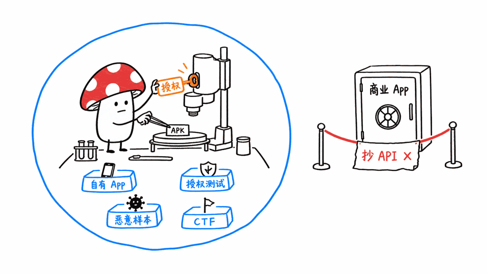
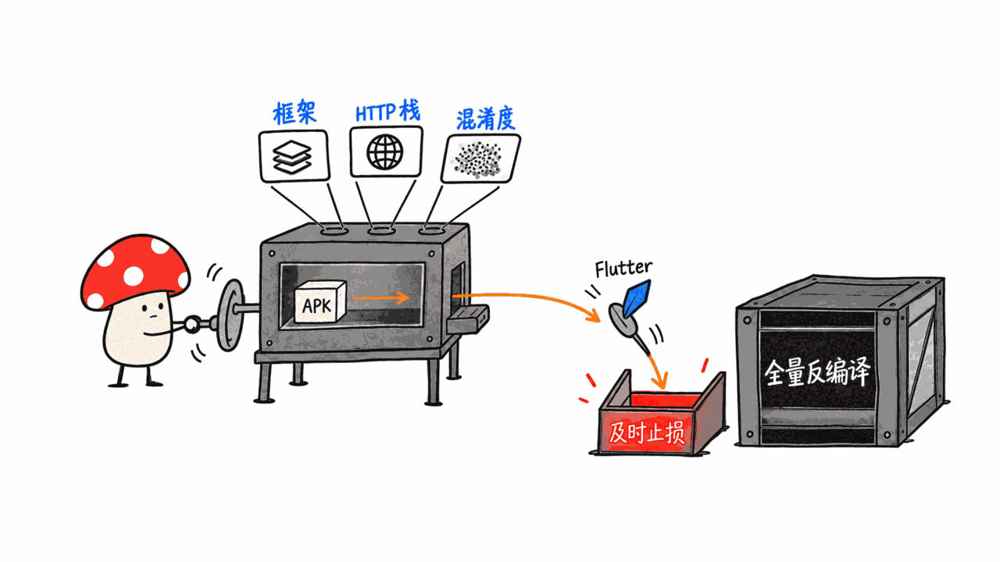
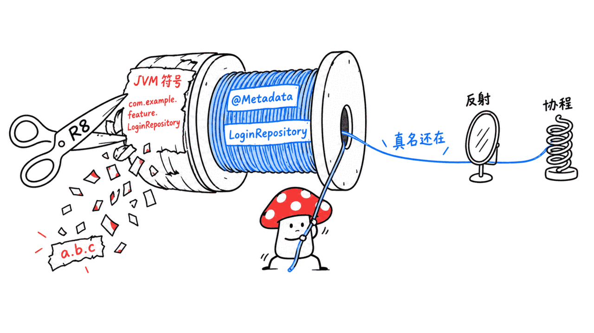
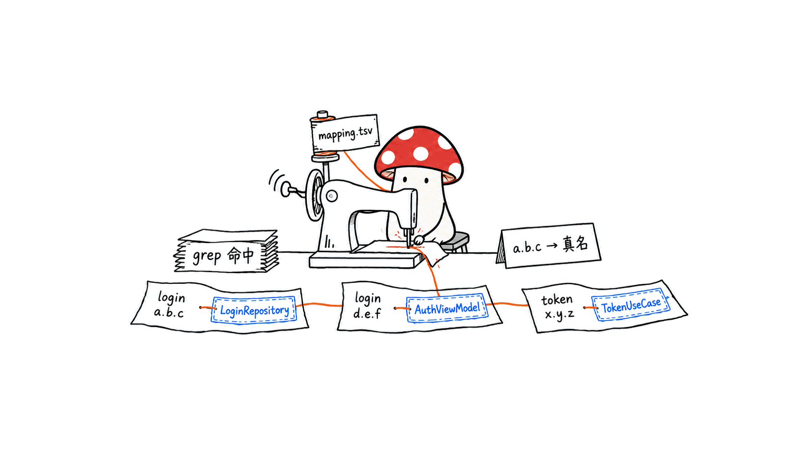

有一个反直觉的事实：**R8 混淆再狠，也删不掉 Kotlin 的类名字符串。**

原因不是它做不到，是它不能。Kotlin 的运行时——反射、协程——需要原始的全限定类名才能工作。所以 R8 把 JVM 符号重命名成 `a.b.c` 的同时，必须把真名原样留在 `@Metadata` 和 `@DebugMetadata` 注解里。

SimoneAvogadro/android-reverse-engineering-skill 就是抓着这条缝隙做的：把那些注解挖出来，重建一张「混淆名 → 真名」的映射表。README 说，对一个典型应用，**能恢复大约 100% 的 `*Repository` / `*ViewModel` / `*UseCase` / `*Impl` 类**——也就是你真正想读的那些。

GitHub：https://github.com/SimoneAvogadro/android-reverse-engineering-skill
协议：Apache-2.0｜语言：Shell｜Stars：7744｜Forks：876｜创建：2026-02-02｜最近提交：2026-09-08

本站在 8 月的《GitHub 趋势月报》里用一句话带过它，当时把它归进"细分任务"那一类的例子。今天单独展开，是因为它的技术手法值得说清楚——**它不是又一个反编译器的壳，它做的是反编译器不做的那一层。**



## 先说清楚法律边界

这是一个双用途工具，README 自己把边界写得很清楚，我原样转述：

本插件**严格用于合法用途**，包括但不限于：

- 安全研究与获得授权的渗透测试
- 适用法律允许的互操作性分析（例如欧盟指令 2009/24/EC、美国 DMCA §1201(f)）
- 恶意软件分析与事件响应
- 教育用途与 CTF 竞赛

**使用者自行承担全部责任**，需确保用法符合所有适用的法律、法规和服务条款。对你不拥有、也未获授权分析的软件做未授权逆向，可能违反你所在司法辖区的知识产权法和计算机欺诈法规。

这段话不是免责套话，是这类工具的使用前提。**分析你自己发布的 App、分析你被授权测试的目标、做恶意样本分析、打 CTF——这些是它的用途；拆别人的商业 App 抄 API，不是。**

## 它比"跑一遍 jadx"多做了什么？

反编译本身不难，`jadx` 一条命令就能把 APK 变成一堆 Java 源码。真正费时间的是之后：**在几万个 `a.b.c` 类里，找到那几个真正发 HTTP 请求的地方。**

这个 skill 把整条路做成了六个阶段（Phase 0–5），核心是四件事：



**1. Phase 0：先按指纹分诊，再决定要不要花时间反编译。**

```bash
bash .../scripts/fingerprint.sh app.apk
```

几秒钟输出：框架是什么（Flutter / React Native / Cordova / Xamarin / 原生 Kotlin）、HTTP 栈是什么、混淆到什么程度、有没有 native 库、用了哪些值得注意的 SDK。

这一步的价值在于**及时止损**。如果指纹显示这是个 Flutter 应用，那 Java 层反编译出来基本没用（逻辑在 Dart AOT 产物里），你省下的是接下来半小时。

**2. 反编译支持四种输入、两个引擎、可对比。**

APK、XAPK（自动解出里面每个 APK 分别反编译）、JAR、AAR 都支持。引擎默认 jadx，也可以用 Fernflower / Vineflower，还能两个都跑然后对比输出：

```bash
bash .../scripts/decompile.sh app.apk                            # jadx 默认
bash .../scripts/decompile.sh --engine fernflower library.jar    # Fernflower
bash .../scripts/decompile.sh --engine both --deobf app.apk      # 两个都跑并对比
```

复杂 Java 代码上 Fernflower/Vineflower 的输出通常更干净，但在 APK/DEX 上用 Fernflower 需要先过 dex2jar。



**3. Kotlin 名字恢复——这是全篇最值得学的一招。**

现代 Android 应用基本都是 Kotlin/KMP，都过 R8。反编译出来满屏 `a.b.c`，人是读不下去的。

R8 的处境是这样的：它可以重命名 JVM 符号，但 **Kotlin metadata 字符串它不能动**——动了，Kotlin 反射和协程在运行时就找不到原始全限定名，应用会崩。所以这些字符串必然完整保留在产物里。

skill 做的事就是把它们挖出来，建映射表：

```bash
# 1. 从反编译出的源码里建映射
bash .../scripts/recover-kotlin-names.sh output/sources/ output/names/
#    → output/names/mapping.tsv, mapping.json, by_package/

# 2. 查询：解析混淆名、按真名搜、或者带着恢复出的类名去 grep 源码
bash .../scripts/lookup-name.sh output/names/ LoginRepository
bash .../scripts/lookup-name.sh output/names/ -o a.b.c
bash .../scripts/lookup-name.sh output/names/ --grep 'login' output/sources/
```



第三条命令尤其实用：**grep 的每一处命中，都带着它所属类的真实名字标注出来**。这等于把"在混淆代码里定位"变回了"在正常代码里定位"。

**4. API 提取覆盖了新老两代栈。**

经典的 Retrofit / OkHttp / Volley 之外，还覆盖了现代 Kotlin/KMP 栈——**Ktor 客户端、Apollo（GraphQL）、Koin 依赖注入**，以及认证头、token 和 HMAC 请求签名方案：

```bash
bash .../scripts/find-api-calls.sh output/sources/            # 默认全栈扫描
bash .../scripts/find-api-calls.sh output/sources/ --ktor     # Ktor
bash .../scripts/find-api-calls.sh output/sources/ --apollo   # Apollo / GraphQL
bash .../scripts/find-api-calls.sh output/sources/ --paths    # R8 内联后仍存活的引号路径字面量
```

最后那个 `--paths` 也是个巧思：R8 会把常量内联掉，但**被内联的字符串字面量本身还在**。按引号路径去捞，是一条不依赖类结构的兜底路径。

除此之外还有调用流追踪——从 Activity / Fragment 穿过 ViewModel 和 repository，一路追到 HTTP 调用那一行。

## 怎么装、怎么用？

**前置依赖**：Java JDK 17+，以及 jadx（CLI）。可选但推荐：Vineflower 或 Fernflower（复杂 Java 代码输出更好）、dex2jar（要在 APK/DEX 上用 Fernflower 就需要）。

**安装**（Claude Code 里直接跑）：

```text
/plugin marketplace add SimoneAvogadro/android-reverse-engineering-skill
/plugin install android-reverse-engineering@android-reverse-engineering-skill
```

装完永久可用，之后所有会话都在。

**用法**有三种。斜杠命令：

```text
/decompile path/to/app.apk
```

自然语言触发——skill 对这类说法会激活："Decompile this APK"、"Reverse engineer this Android app"、"Extract API endpoints from this app"、"Follow the call flow from LoginActivity"、"Analyze this AAR library"。

或者绕开 Claude，把脚本当独立工具用（上面所有 `bash .../scripts/*.sh` 都可以直接跑）。**这一点值得夸：skill 不是把能力锁死在 agent 里，底层就是一堆能单独执行的 shell 脚本。** 依赖检查和自动安装也有：

```bash
bash .../scripts/check-deps.sh
bash .../scripts/install-dep.sh jadx        # 自动识别操作系统和包管理器
bash .../scripts/install-dep.sh vineflower
```

Windows / PowerShell 有一套平行的 `*.ps1` 脚本，README 标注为**实验性**，是社区贡献且仍在稳定化中。

## 这个项目的社区形态值得注意

7744 stars、876 forks，但真正有意思的是致谢名单里的分工——这个 skill 的关键能力几乎都是外部贡献者做的：

- Phase 0 指纹分诊、R8 抗性的 Kotlin 名字恢复、Ktor / Apollo / Koin / HMAC 提取模式 —— @tajchert
- 原生 Windows / PowerShell 支持、split/bundled APK 检测 —— @philjn
- 迁移到维护中的 dex2jar fork —— @txhno
- 反编译部分成功的处理、Fernflower 超时保护、中间产物目录 —— @muqiao215
- 中文本地化（SKILL.md 的发现关键词）—— @kevinaimonster

**一个 Claude Code skill 能长出这种协作密度，本身是个信号。** skill 的格式（一个 SKILL.md + 一堆 references + 一堆脚本）让外人贡献的门槛比贡献一个框架低得多——你不需要理解整个 agent 的运行时，只要往 scripts/ 里加一个能独立跑的 shell 脚本、往 references/ 里加一份文档就行。

顺带一提最后那条：**中文本地化改的是 SKILL.md 里的"发现关键词"**。这是 skill 生态里一个很实际的细节——skill 能不能被触发，取决于用户说的话跟 SKILL.md 里的描述能不能对上，所以本地化不是翻译文档，是翻译触发词。

## 边界

- **它不解决 Flutter / React Native / Xamarin 的逻辑。** Phase 0 能识别出来，但识别出来的结论往往是"这条路走不通"。它的主战场是原生 Kotlin/Java 应用。
- **Kotlin 名字恢复依赖 metadata 存在。** 纯 Java 应用没有 Kotlin metadata，这一招用不上；理论上也存在专门剥离 metadata 的构建配置（代价是放弃 Kotlin 反射）。
- **PowerShell 那套是实验性的。** README 明确说仍在稳定化，出问题要去主仓库报 issue，不要去贡献者的上游 fork。
- **需要 JDK 17+ 和 jadx。** 按本站"个人可及"的判据这不算违背——装两个命令行工具不等于需要运维团队——但它确实不是开箱即用。
- **它输出的是线索，不是结论。** 提取出的端点、URL、认证头需要人去验证哪些是活的、哪些是死代码。README 里那份 `third_party_hosts.txt` denylist（用来区分第一方和第三方域名）就是这个问题的部分答案。

## 我为什么觉得它值得单独写

本站的选题第一性原则是"我自己要不要用"。这个 skill 我确实会用，但用途可能跟大多数人想的不一样：

**我最想用它的场景是审自己的东西。** 一个我自己发布的 Android 应用，混淆之后到底还漏了什么——硬编码的 URL、忘了拿掉的测试端点、被内联但字符串还在的路径、认证头的构造逻辑——这些用这个 skill 扫一遍最快。

**第二个场景是恶意样本分析。** Phase 0 指纹 + API 提取的组合，正好回答"这个 APK 往哪儿发数据"这个最要紧的问题。

至于"拆别人的 App 抄 API"——那是 README 免责声明里明确划出去的那一侧，本站不在那边。

---

> © 2026 Author: Mycelium Protocol. 本文采用 [CC BY 4.0](https://creativecommons.org/licenses/by/4.0/deed.zh) 授权——欢迎转载和引用，须注明作者姓名及原文链接，不得去除署名后以原创发布。

<!--EN-->

Here is a counterintuitive fact: **no matter how hard R8 obfuscates, it cannot delete Kotlin's class-name strings.**

Not because it is incapable, but because it is not allowed to. The Kotlin runtime — reflection, coroutines — needs the original fully-qualified class names to function. So while R8 renames JVM symbols to `a.b.c`, it must leave the real names intact inside `@Metadata` and `@DebugMetadata` annotations.

SimoneAvogadro/android-reverse-engineering-skill works precisely that seam: mine those annotations and rebuild an obfuscated-to-real class-name map. The README claims that on a typical app it **recovers roughly 100% of the `*Repository` / `*ViewModel` / `*UseCase` / `*Impl` classes** — exactly the ones you actually want to read.

GitHub: https://github.com/SimoneAvogadro/android-reverse-engineering-skill
License: Apache-2.0 | Language: Shell | Stars: 7744 | Forks: 876 | Created: 2026-02-02 | Last push: 2026-09-08

This site mentioned it in one line in August's *GitHub Trending Monthly*, filed under "narrow, high-value tasks." It gets its own piece today because the technique deserves a proper explanation — **this is not another wrapper around a decompiler; it does the layer decompilers skip.**


## First, the legal boundary

This is a dual-use tool, and the README states its boundary clearly. Quoting it:

The plugin is provided strictly for **lawful purposes**, including but not limited to:

- Security research and authorized penetration testing
- Interoperability analysis permitted under applicable law (e.g. EU Directive 2009/24/EC, US DMCA §1201(f))
- Malware analysis and incident response
- Educational use and CTF competitions

**You are solely responsible** for ensuring your use complies with all applicable laws, regulations and terms of service. Unauthorized reverse engineering of software you do not own or lack permission to analyze may violate intellectual property law and computer fraud statutes in your jurisdiction.

That paragraph is not boilerplate; it is the precondition for using this class of tool. **Analyzing an app you shipped, a target you are authorized to test, a malware sample, or a CTF binary — those are its uses. Tearing apart someone's commercial app to copy its API is not.**

## What does it do beyond "run jadx"?

Decompiling is not the hard part; one `jadx` command turns an APK into a pile of Java. The time sink comes after: **finding, among tens of thousands of `a.b.c` classes, the handful that actually make HTTP requests.**

The skill turns that whole path into six phases (Phase 0–5), around four core capabilities:


**1. Phase 0: triage by fingerprint before spending time on a decompile.**

```bash
bash .../scripts/fingerprint.sh app.apk
```

In seconds it reports: which framework (Flutter / React Native / Cordova / Xamarin / native Kotlin), which HTTP stack, the obfuscation level, native libraries, and notable SDKs.

The value here is **cutting losses early**. If the fingerprint says Flutter, decompiling the Java layer is largely pointless (the logic lives in Dart AOT output) — you just saved the next half hour.

**2. Decompilation covers four inputs, two engines, side by side.**

APK, XAPK (auto-extracts and decompiles each inner APK), JAR and AAR are all supported. jadx is the default engine; Fernflower / Vineflower are alternatives, and you can run both and compare:

```bash
bash .../scripts/decompile.sh app.apk                            # jadx, default
bash .../scripts/decompile.sh --engine fernflower library.jar    # Fernflower
bash .../scripts/decompile.sh --engine both --deobf app.apk      # both, compared
```

Fernflower/Vineflower usually produce cleaner output on complex Java, but using Fernflower on APK/DEX requires dex2jar first.


**3. Kotlin name recovery — the one trick most worth learning here.**

Modern Android apps are essentially all Kotlin/KMP, and essentially all go through R8. Decompiled output is a wall of `a.b.c` that no human reads.

R8 is in a bind: it can rename JVM symbols, but **it cannot touch the Kotlin metadata strings** — if it did, Kotlin reflection and coroutines could not resolve the original fully-qualified names at runtime and the app would break. So those strings are necessarily preserved intact in the shipped artifact.

The skill mines them and builds a map:

```bash
# 1. Build the mapping from the decompiled sources
bash .../scripts/recover-kotlin-names.sh output/sources/ output/names/
#    → output/names/mapping.tsv, mapping.json, by_package/

# 2. Query it: resolve an obfuscated name, search by real name, or grep the
#    sources with each hit annotated with its recovered class name
bash .../scripts/lookup-name.sh output/names/ LoginRepository
bash .../scripts/lookup-name.sh output/names/ -o a.b.c
bash .../scripts/lookup-name.sh output/names/ --grep 'login' output/sources/
```


That third command is especially practical: **every grep hit comes annotated with the real name of the class it belongs to.** It converts "navigating obfuscated code" back into "navigating normal code."

**4. API extraction covers both the old and new stacks.**

Beyond the classic Retrofit / OkHttp / Volley, it covers modern Kotlin/KMP stacks — **the Ktor client, Apollo (GraphQL), and Koin dependency injection** — plus auth headers, tokens and HMAC request-signing schemes:

```bash
bash .../scripts/find-api-calls.sh output/sources/            # full scan, default
bash .../scripts/find-api-calls.sh output/sources/ --ktor     # Ktor
bash .../scripts/find-api-calls.sh output/sources/ --apollo   # Apollo / GraphQL
bash .../scripts/find-api-calls.sh output/sources/ --paths    # quoted path literals surviving R8 inlining
```

That last `--paths` flag is another neat idea: R8 inlines constants, but **the inlined string literals themselves remain**. Sweeping for quoted paths is a fallback that does not depend on class structure surviving at all.

There is also call-flow tracing — from Activities/Fragments through ViewModels and repositories down to the line that makes the HTTP call.

## Installing and using it

**Prerequisites**: Java JDK 17+ and jadx (CLI). Optional but recommended: Vineflower or Fernflower (better output on complex Java), and dex2jar (needed to run Fernflower against APK/DEX).

**Install** (run inside Claude Code):

```text
/plugin marketplace add SimoneAvogadro/android-reverse-engineering-skill
/plugin install android-reverse-engineering@android-reverse-engineering-skill
```

It then stays available permanently across sessions.

**Three ways to use it.** The slash command:

```text
/decompile path/to/app.apk
```

Natural language — the skill activates on phrases like "Decompile this APK", "Reverse engineer this Android app", "Extract API endpoints from this app", "Follow the call flow from LoginActivity", "Analyze this AAR library".

Or bypass Claude entirely and use the scripts standalone (every `bash .../scripts/*.sh` above runs on its own). **That deserves credit: the skill does not lock its capability inside the agent — underneath it is a set of independently executable shell scripts.** Dependency checking and installation are included:

```bash
bash .../scripts/check-deps.sh
bash .../scripts/install-dep.sh jadx        # auto-detects OS and package manager
bash .../scripts/install-dep.sh vineflower
```

A parallel set of `*.ps1` scripts covers Windows / PowerShell; the README marks these **experimental** — a community contribution still being stabilized.

## The shape of this project's community is worth noting

7744 stars and 876 forks, but the interesting part is the division of labor in the acknowledgments — nearly every key capability came from outside contributors:

- Phase 0 fingerprinting, R8-resistant Kotlin name recovery, and Ktor / Apollo / Koin / HMAC extraction patterns — @tajchert
- Native Windows / PowerShell support and split/bundled APK detection — @philjn
- Migration to the maintained dex2jar fork — @txhno
- Partial-success decompile handling, a Fernflower timeout safeguard, an intermediate-artifact directory — @muqiao215
- Chinese localization of SKILL.md's discovery keywords — @kevinaimonster

**A Claude Code skill growing that density of collaboration is itself a signal.** The skill format — one SKILL.md, a set of references, a set of scripts — makes outside contribution far cheaper than contributing to a framework: you do not need to understand an agent runtime, only to add a standalone shell script under `scripts/` and a document under `references/`.

A note on that last entry: **the Chinese localization changed the "discovery keywords" in SKILL.md.** That is a very practical detail of the skill ecosystem — whether a skill fires depends on whether what the user says matches its description, so localization is not translating documentation, it is translating trigger phrases.

## Boundaries

- **It does not crack Flutter / React Native / Xamarin logic.** Phase 0 identifies them, but the identification usually amounts to "this road is closed." Its home turf is native Kotlin/Java apps.
- **Kotlin name recovery depends on metadata being present.** Pure Java apps have no Kotlin metadata; a build configuration that deliberately strips metadata (at the cost of giving up Kotlin reflection) would also defeat it.
- **The PowerShell set is experimental.** The README says it is still stabilizing and asks that issues go to the main repo, not the contributors' upstream forks.
- **It needs JDK 17+ and jadx.** By this site's "reachable by one person" criterion that is not a violation — installing two CLI tools is not the same as needing an ops team — but it is not zero-setup either.
- **It produces leads, not conclusions.** The extracted endpoints, URLs and auth headers still need a human to sort live code from dead. The `third_party_hosts.txt` denylist (for first-party vs third-party bucketing) is a partial answer to that problem.

## Why I think it deserves its own piece

This site's first principle for topic selection is "would I use this myself?" I would — though probably not the way most people assume.

**The use I want most is auditing my own work.** For an Android app I shipped, what actually leaks through the obfuscation — hardcoded URLs, a test endpoint someone forgot to remove, inlined constants whose strings still sit in the binary, the construction logic of an auth header — this skill is the fastest way to sweep for all of it.

**The second use is malware sample analysis.** Phase 0 fingerprinting plus API extraction answers the question that matters most: where does this APK send data?

As for "tear apart someone else's app and copy the API" — that is the side of the line the README's disclaimer explicitly draws out, and this site is not on it.

---

> © 2026 Author: Mycelium Protocol. Licensed under [CC BY 4.0](https://creativecommons.org/licenses/by/4.0/) — free to share and adapt with attribution. You must credit the author and link to the original; removing attribution and republishing as original is not permitted.
