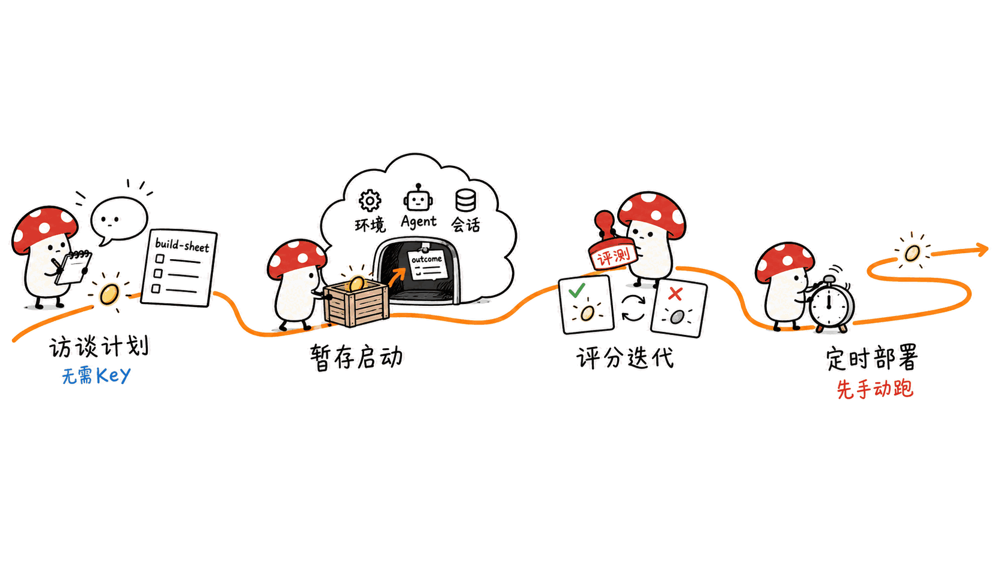
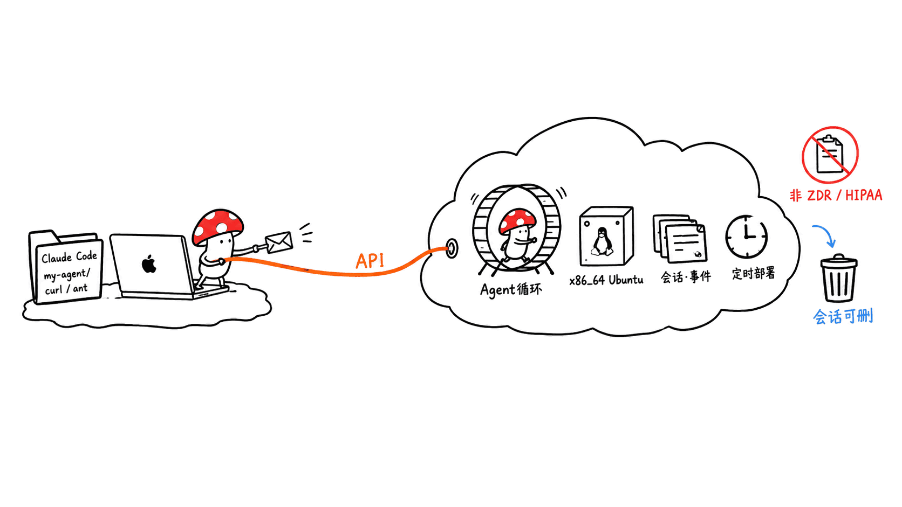
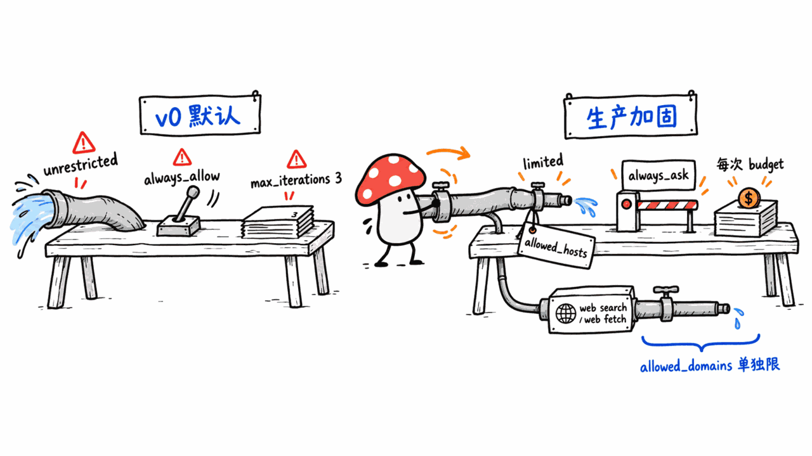
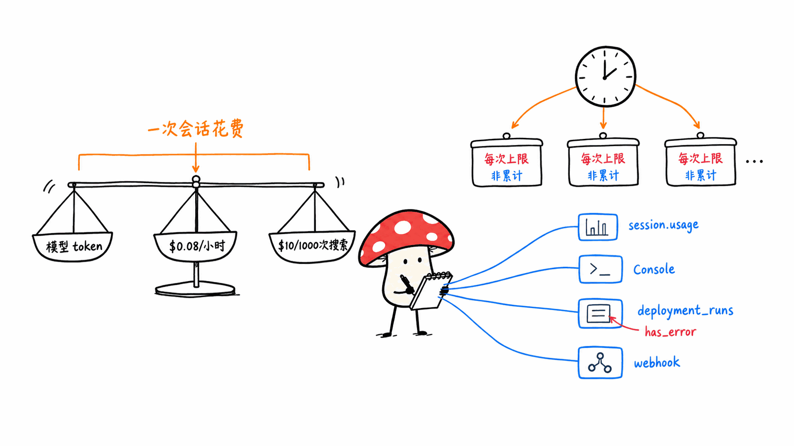

> 📌 开源仓库：anthropics/launch-your-agent
> GitHub：https://github.com/anthropics/launch-your-agent
> 协议：Apache-2.0 ｜ 形态：Claude Code Skill + 参考文档 ｜ Stars：1,007 ｜ Forks：199 ｜ 创建：2026-06-16 ｜ 最近提交：2026-09-23（共 7 次提交，1 位作者）

---

**BLUF**：launch-your-agent 是 Anthropic 官方组织下的一个**教学型 Claude Code Skill**，不是项目模板，也不是命令行工具。你在仓库目录里运行 `claude`，输入 `/launch-your-agent`，它会先访谈你想做什么，再生成一个 `my-agent/` 文件夹（配置、评分标准、启动脚本、评测脚手架），然后用 curl 在**你自己的 Anthropic 账号**里创建 Agent、环境、会话，最后视情况挂上定时部署。仓库里没有任何可以直接跑的示例 Agent 代码，全部 18 个文件、2,309 行都是 Skill 指令、API 速查和参考文档。我们在 Mac 上验证到的部分：Skill 能被 Claude Code 识别并给出开场白，官方 `ant` CLI 有原生 Apple Silicon 版本并能运行；**没验证的部分**：完整的创建、运行、评分流程，因为那需要真实 API Key，会在账号里建资源并计费，我们没有用。判断：它适合想第一次把 Agent 挂上 Anthropic 托管环境的人当脚手架；但它的默认配置是「联网不限制、工具全放行、没有金额上限」，要上生产还得自己补一轮加固，而且整套东西跑在 Anthropic 云端，对追求本地优先的人来说是另一条路。

这篇文章回答四件事：这个仓库到底是什么、它教了把 Agent 上线的哪几个环节、Mac 上能验证到哪一步、以及它的默认值该怎么改。

## 它到底是模板、教程、CLI 还是示例？

先按名字猜容易猜错，所以我们把仓库里的全部指令和说明文件读了一遍（共 18 个文件、2,309 行，含 LICENSE 与示例 HTML/CSS/JSON）。结论如下：

| 你可能以为 | 实际情况 | 依据 |
|---|---|---|
| 项目模板（GitHub template repo） | 不是 | GitHub API 返回 `is_template: false` |
| CLI 或可安装的包 | 不是 | 没有 `package.json`、`pyproject.toml` 或可执行入口 |
| 可运行的示例 Agent | 不是 | 仓库里唯一的代码类文件是 `ui/` 下的示例 HTML 页面和 JSON 样例 |
| 教程文档 | 部分是 | `cma-primitives.md`（250 行）、`interview.md`、`cma-api.md` 是参考资料 |
| **Claude Code Skill** | **是，核心** | `.claude/skills/launch-your-agent/SKILL.md`（137 行）和 `.claude/skills/wrap-up/SKILL.md`（37 行） |

GitHub 把主语言标成 HTML，是因为 `ui/` 下有一个示例概览页，不代表这是个前端项目。README 自己的定位很直白：「Reference implementation. Not maintained and not accepting contributions」（参考实现，不维护，不接受贡献），并且说明「because it explains each step, it's more token-intensive than a purpose-built agent would be」（因为它会解释每一步，比专用 Agent 更费 token）。

仓库目录结构：

- `.claude/skills/launch-your-agent/`：主 Skill，含 `references/` 下的访谈映射、已验证的 API 调用形状、示例库、Mock 连接器、概览页模板
- `.claude/skills/wrap-up/`：收尾 Skill，`/wrap-up` 刷新概览页、列出你现在拥有的所有原语、建议下一步
- `cma-primitives.md`：Claude Managed Agents（下称 CMA）原语与限制清单
- `ui/`：示例概览页和构建单样例
- `CLAUDE.md`：项目内部的设计决策笔记（标题还叫 `cma-test`，是作者自己的测试项目笔记）

## 它教了哪些上线环节？

Skill 把流程分成四个阶段，每个阶段对应 CMA 的一组真实原语：

1. **访谈生成计划**（不需要 Key）：问你要做什么、怎么算做完、需要读什么、输出到哪、什么时候跑、不能做什么、要不要记忆、给谁用。答案落到 `build-sheet.json`，再投影成 `agent.json`、`environment.json`、`outcome.md`、`evals/` 和一份 `NEXT-DIRECTIONS.md`（v1/v2 计划）。
2. **暂存并启动**：先离线校验所有 JSON，再让你提供 API Key，然后依次创建环境、Agent、会话，并发送一个 `user.define_outcome` 事件（任务 + 评分标准 + 最多 3 轮迭代）。
3. **评分与迭代**：读评分器的裁决，对照你的已知正确答案，一次只改一处，再跑留出的评测用例。
4. **让它自己跑**：如果任务确实周期性重复，就创建**定时部署**（cron + 时区 + 初始事件），先手动触发一次再信任 cron。

对照你关心的几个环节：

| 环节 | 它怎么教 | 我们对照官方文档的核实 |
|---|---|---|
| **沙箱** | 默认云端环境，`networking: unrestricted`；限制联网放到 v1 加固清单 | 官方文档：云沙箱是 Anthropic 托管的隔离 Linux 容器，Ubuntu 24.04、x86_64、最多 8GB 内存和 10GB 磁盘；API 创建的环境默认 `unrestricted`，文档同时写明生产环境应使用 `limited` |
| **权限** | 默认整套工具 `always_allow`；`bash` 或 MCP 写操作建议 `always_ask` | 官方文档：agent 工具集默认 `always_allow`，MCP 工具集默认 `always_ask`；另有 `auto`，由服务端逐次判定，但不等于人工审批 |
| **凭据** | Vault（`mcp_oauth`、`static_bearer`、`environment_variable`）；Key 只进 `.env`，不进对话 | 环境变量类凭据只在出站时替换，Agent 看不到明文值（来自仓库对文档的转述，官方博客 2026-06-09 的公告也介绍了环境变量型 Vault） |
| **监控** | 概览页是静态描述页，实时观测交给 Console；轮询 `outcome_evaluations[]` | 官方文档：事件流含 `span.*` 事件和每次空闲前的 `session.usage`；部署有 `deployment_runs` 记录，可用 `has_error=true` 过滤；另有 webhook |
| **托管与调度** | 原生定时部署：`POST /v1/deployments`，cron + IANA 时区 | 官方文档：5 字段 POSIX cron、分钟粒度、实际触发有最多 15% 间隔（5 秒到 9 分钟）的抖动，每个组织最多 1,000 个部署；夏令时按墙上时间匹配，建议避开凌晨 1 到 3 点 |
| **成本** | 只默认 `max_iterations: 3`，SKILL.md 明确写「no spend-limit step」 | 官方文档：会话预算是另一个机制，按公开标价计费的硬上限，且只能在创建会话时设置 |

## 它有一处很有价值的设计：评分标准先行

这个 Skill 最有意思的不是「帮你调 API」，而是它把 Outcome（定义完成标准的评分标准）和评测放在核心位置：

- 评分标准写 3 到 6 条可二元判定的检查项，放在启动事件里而不是系统提示词里，所以改评分标准不需要给 Agent 升版本
- 评分器运行在**独立的上下文窗口**，和 Agent 自己的判断隔离（仓库转述官方文档）
- 有历史真实案例就拿一个当输入，其余留作回归测试；没有的话，把第一次验证过的输出存成 `evals/case-01/`
- 任何 Agent 版本升级前，先重跑评测再发布到部署

这套「先定义完成，再评分，再放行」的顺序，比很多只教你怎么调用 API 的入门材料要成熟。

## 我们在 Mac 上实际验证了什么？

这台是 Apple Silicon 的 Mac mini。我们把仓库浅克隆到临时目录（HEAD 为 `d5d0ffb`，2026-09-23 合并的 PR #5），做了下面这些**不需要 API Key** 的验证：

| 验证 | 结果 |
|---|---|
| 文件完整性 | 全部说明与指令类 Markdown 读完；`ui/` 与 `references/` 里的示例 HTML、CSS 逐字节一致；示例 `build-sheet.json` 能被 Python 正常解析 |
| Skill 能否加载 | 在克隆目录运行 `claude -p "/launch-your-agent"`，Claude Code 2.1.280 识别了这个 Skill 并给出开场白：一张三行示例表（数据分析、运维响应、定时巡检）加一个开放问题；没有在磁盘上创建 `my-agent/`，因为访谈还没开始 |
| `ant` CLI | 从官方 `anthropics/anthropic-cli` 的 v1.35.0 发布页下载 `ant_1.35.0_macos_arm64.zip`，SHA-256 与发布的校验文件一致，`ant --version` 输出 `ant version 1.35.0`；不带 Key 执行 `ant beta:agents list` 得到 401 |
| API 端点 | 不带 Key 直接 POST `https://api.anthropic.com/v1/agents`，返回 401 `authentication_error`，说明端点在线，我们没有更多验证 |

**没有验证的**：从创建 Agent 到评分、再到定时部署的完整流程。原因有两个：这一步必须使用真实的 Anthropic API Key，会在账号里创建 Agent、环境、会话并计费；我们也不该在没有授权的情况下替你的账号做这件事。所以本文关于运行结果、评分器行为、单次成本的说法，全部来自官方文档和仓库文件，**不是我们的实测**。

另外一个诚实的提示：仓库的 `cma-api.md` 文件头自己写着，2026-09-21 那次刷新新增的调用形状「come from the docs and have not been run yet」（来自文档，还没有被实际运行过）。也就是说，最近两天的更新连作者自己也还没跑过。

## Mac 用户要知道：Agent 不在你的 Mac 上跑

这是最容易被忽略的一点。你的 Mac 只负责三件事：运行 Claude Code、存放 `my-agent/` 文件夹、发 curl 或 `ant` 命令。真正的 Agent 循环和沙箱都在 Anthropic 云端：

- 会话运行在 Anthropic 托管的 x86_64 Ubuntu 容器里，跟你的 Mac 是 Apple Silicon 还是 Intel 无关
- 会话关闭电脑也继续跑；定时部署更是不依赖你的机器开机
- 官方文档明确：CMA 是有状态设计，**不符合零数据保留（ZDR）和 HIPAA BAA 的适用范围**，会话历史、沙箱状态和输出都存在服务端，你可以随时删除会话和自己上传的文件
- 如果你有合规或数据驻留需求，文档提供自托管沙箱；这个 Skill 把它放在「以后再说」的清单里，不在默认流程里

所以它跟本站常写的「本地优先」路线是**互补而不是替代**：需要 24 小时无人值守、又不想自己维护 Mac mini 上的调度和沙箱时，托管方案省事；要数据不出本机，就别走这条路。

## 默认配置离生产还差什么？

这是我们对它最大的保留意见。按 Skill 的默认流程，你得到的 v0 Agent 是这样的：

- 联网：`unrestricted`（官方称「full outbound network access, except for a general safety blocklist」）
- 工具：整套 `agent_toolset_20260401` 全部 `always_allow`，包括 `bash`
- 花费上限：只有评分器的 `max_iterations: 3`。这是**质量迭代次数**，不是金额上限
- 加固（限制联网、`always_ask`、只读记忆）：在访谈问题 Q6 里被明确归为「hardening, not v0」，写进 `NEXT-DIRECTIONS.md`

作为「先跑通」的起点，这个取舍可以理解；仓库还强调 v0 默认只起草不发送，写操作要放到后面加 `always_ask` 闸门。但如果你打算挂**定时部署**，就得留意两件事：

1. 定时部署每次触发都会重放同一组 `initial_events`。官方文档说明部署的 `budget` 会复制到**每一次运行**，是单次运行上限，不是累计上限，所以一个 `"2000"`（20 美元）的上限可能每次都花到接近 20 美元
2. 仓库的 `cma-api.md` 里提到了会话预算，但 `SKILL.md` 的主流程没有把它设为默认步骤

我们的建议是：**在 Skill 生成的 `deployment.json` 里手动加上 `budget`，并把 `networking` 改成 `limited` 加 `allowed_hosts`，同时用 `allowed_domains` 限制 `web_search` 和 `web_fetch`**（官方文档强调网络设置不管这两个工具，它们跑在 Anthropic 服务器上，要单独限制）。

## 上线成本怎么算？

官方文档给出了计费口径（会话预算页面）：按公开标价计的会话「list cost」包括模型 token、网络搜索（每 1,000 次 10 美元）和会话运行时间（每小时 0.08 美元）。空闲不计运行时费。仓库 README 写「Runs cost cents」（一次运行几美分），这个说法我们**没有实测**，不同任务的 token 量差异很大，请自己跑一次后看 `usage.list_cost`。

两点提醒：

- 每次会话不是只有一个钱包：Claude Code 里的访谈本身消耗你订阅或 API 的额度，CMA 的运行则计到你创建的 Anthropic API 账号，这是两笔账
- Skill 用的评分器迭代最多 3 轮（上限 20 轮），每多一轮就多一轮 token

## 它有几个值得注意的取舍

- **手写 curl 加 `IDS.env`，没有用声明式工具**：官方 `ant` CLI 的 `ant apply` 可以从文件声明式创建和更新 Agent、环境、部署，还带 `--dry-run` 和 `claude-lock.json` 锁文件；这个 Skill 的主流程没有使用它（`cma-primitives.md` 只提了一句）。教学上让你看到底层调用是优点，长期维护上声明式更合适
- **概览页是「描述页」**：`agent-overview.html` 由 Claude 手动编辑更新，仓库自己也写「describe-only」，实时观测仍靠 Console。仓库里有一个由另一位用户提交、至今未合并的 PR #3，想加一个可配置的运行查看器，未合并
- **API 处于 beta**：官方文档标注 `managed-agents-2026-04-01` beta 头；文档说「Behaviors may be refined between releases」，Skill 里的调用形状随时可能变，仓库自己也说以在线文档为准
- **维护状态有点矛盾**：README 说「Not maintained」，但最近两次提交是 9 月 22 日和 23 日的内容刷新，此前一次是 7 月 7 日。可以理解为「不接受贡献，偶尔跟着文档同步」
- **没有找到官方公告**：我们搜了 Anthropic 博客和文档，没有找到专门介绍这个仓库的官方文章；能找到的介绍页都是第三方站点。这不能证明不存在，只说明我们没查到。仓库本身在 `anthropics` 组织下，协议头是 `Copyright 2026 Anthropic PBC`

## 适合谁，不适合谁？

**适合**：

- 想第一次把 Agent 部署到 Anthropic 托管环境，又不想一开始就啃 API 文档的技术型创业者
- 想学「先定评分标准、再迭代、再定时运行」这套方法论的人：这部分是仓库最值钱的
- 想拿它的 `cma-primitives.md` 当 CMA 原语速查表的人（记得以在线文档为准）

**不适合**：

- 要数据完全留在本机、或有 ZDR/HIPAA 要求的场景
- 想要一个拉下来就能跑的示例 Agent：这里没有，示例得去 `anthropics/claude-cookbooks` 的 `managed_agents/` 目录里找
- 想直接照着默认配置上生产：需要先做前面说的加固

## 给 Mac 用户的具体建议

1. 先用一个**专用 Workspace 和专用 API Key**，别把生产 Key 交给访谈流程；Console 只显示当前选中的 Workspace，找不到 Agent 时先检查这个
2. 克隆到独立目录再运行 `claude`，生成的 `my-agent/` 文件夹默认在 `.gitignore` 里，但别把转录文本导出进去
3. 装 `ant`：可以用仓库 `cma-api.md` 里提到的 Homebrew 源（`brew install anthropics/tap/ant`），或像我们一样直接下 Apple Silicon 发布包并核对校验和（我们只验证了发布包这条路，没有验证 Homebrew）
4. 第一次先只跑到「评分与迭代」，看一次 `usage.list_cost` 再决定要不要挂定时部署
5. 上定时部署前，手动补 `budget`、`limited` 联网和 `always_ask`，并用 `POST /v1/deployments/:id/run` 手动跑一次
6. 如果只是想做本地小助手，不必上 CMA：本站前面写过的本地方案更合适

## 常见问题

**Q：launch-your-agent 是官方项目吗？**
A：它在 `anthropics` 组织下，文件头是 `Copyright 2026 Anthropic PBC`、Apache-2.0，属于官方仓库。但 README 明确它是「参考实现」，不维护、不接受贡献，我们没有找到专门的官方公告。

**Q：需要付费吗？**
A：Skill 本身免费（Apache-2.0）。运行 CMA 的 Agent 要用你自己的 Anthropic API 账号，按官方文档，费用包括模型 token、每小时 0.08 美元的会话运行时间和每 1,000 次 10 美元的网络搜索。

**Q：能在本地 Mac 上跑 Agent 吗？**
A：这个 Skill 生成的是云端托管 Agent，沙箱在 Anthropic 的 x86_64 Ubuntu 容器里。CMA 另有自托管沙箱选项，但不在这个 Skill 的默认流程里。

**Q：它和 claude-cookbooks 里的 managed_agents 有什么区别？**
A：cookbook 是可运行的 Python 笔记本，一个例子讲一个原语；launch-your-agent 是访谈式 Skill，按你的需求生成配置并替你调用 API。仓库自己的示例库也引用了 cookbook。

**Q：会不会把我的账号搞乱？**
A：它会在你的账号里创建真实的 Agent、环境和会话，全部保留在 Console，会话结束后还在；SKILL.md 要求先检查 `my-agent/` 是否已存在，不覆盖。收尾时用 `/wrap-up` 做归档整理。

## 一手源

- 仓库：https://github.com/anthropics/launch-your-agent
- README：https://github.com/anthropics/launch-your-agent/blob/main/README.md
- 主 Skill：https://github.com/anthropics/launch-your-agent/blob/main/.claude/skills/launch-your-agent/SKILL.md
- CMA 官方概览：https://platform.claude.com/docs/en/managed-agents/overview
- 定时部署文档：https://platform.claude.com/docs/en/managed-agents/scheduled-deployments
- 权限策略文档：https://platform.claude.com/docs/en/managed-agents/permission-policies
- 环境与联网文档：https://platform.claude.com/docs/en/managed-agents/environments
- 云沙箱规格：https://platform.claude.com/docs/en/managed-agents/cloud-sandboxes-reference
- 会话预算文档：https://platform.claude.com/docs/en/managed-agents/budgets
- 官方公告（定时部署与 Vault，2026-06-09）：https://claude.com/blog/whats-new-in-claude-managed-agents
- 官方 ant CLI：https://github.com/anthropics/anthropic-cli
- 官方 cookbook：https://github.com/anthropics/claude-cookbooks/tree/main/managed_agents

---

> © 2026 Author: Mycelium Protocol. 本文采用 [CC BY 4.0](https://creativecommons.org/licenses/by/4.0/deed.zh) 授权——欢迎转载和引用，须注明作者姓名及原文链接，不得去除署名后以原创发布。

<!--EN-->

> 📌 Repository: anthropics/launch-your-agent
> GitHub: https://github.com/anthropics/launch-your-agent
> License: Apache-2.0 | Form: Claude Code skills + reference docs | Stars: 1,007 | Forks: 199 | Created: 2026-06-16 | Last commit: 2026-09-23 (7 commits, 1 author)

---

**BLUF**: launch-your-agent is an **instructional Claude Code skill** under Anthropic's official GitHub organization. It is not a project template and not a CLI. You run `claude` inside the repo folder and type `/launch-your-agent`; it interviews you about what you want to build, generates a `my-agent/` folder (configs, a grading rubric, launch scripts, an eval scaffold), then uses curl to create an agent, environment and session in **your own Anthropic account**, and, if the task recurs, attaches a scheduled deployment. There is no runnable sample agent in the repo: all 18 files and 2,309 lines are skill instructions, API cheat sheets and reference docs. What we verified on a Mac: Claude Code recognizes the skill and produces its opening message, and the official `ant` CLI has a native Apple Silicon build that runs. What we did **not** verify: the full create, run and grade flow, because it needs a real API key, creates resources in an account and bills it, and we did not use one. Our verdict: a good scaffold for someone putting an agent on Anthropic's hosted runtime for the first time, but its defaults are unrestricted networking, all tools allowed and no dollar cap, so you need your own hardening pass before production, and everything runs in Anthropic's cloud, which is a different path from local-first.

This post answers four questions: what the repo actually is, which deployment steps it teaches, how far we could verify it on a Mac, and how to change its defaults.

## Is it a template, a tutorial, a CLI or an example?

Guessing from the name is unreliable, so we read all the instruction and doc files (18 files and 2,309 lines in total, counting the LICENSE and the example HTML/CSS/JSON). The result:

| What you might assume | Reality | Evidence |
|---|---|---|
| A project template (GitHub template repo) | No | The GitHub API returns `is_template: false` |
| A CLI or installable package | No | No `package.json`, `pyproject.toml` or executable entry point |
| A runnable sample agent | No | The only code-like files are the example HTML page and JSON sample under `ui/` |
| Tutorial docs | Partly | `cma-primitives.md` (250 lines), `interview.md` and `cma-api.md` are reference material |
| **A Claude Code skill** | **Yes, the core** | `.claude/skills/launch-your-agent/SKILL.md` (137 lines) and `.claude/skills/wrap-up/SKILL.md` (37 lines) |

GitHub labels the main language HTML only because `ui/` holds an example overview page; it is not a front-end project. The README positions itself bluntly: "Reference implementation. Not maintained and not accepting contributions", and adds that "because it explains each step, it's more token-intensive than a purpose-built agent would be."

Repository layout:

- `.claude/skills/launch-your-agent/`: the main skill, with `references/` holding the interview-to-primitive mapping, verified API call shapes, an examples bank, mock-connector patterns and the overview page template
- `.claude/skills/wrap-up/`: the closing skill; `/wrap-up` refreshes the overview page, lists every primitive you now own and suggests next steps
- `cma-primitives.md`: an inventory of Claude Managed Agents (CMA) primitives and limits
- `ui/`: an example overview page and a sample build sheet
- `CLAUDE.md`: the author's internal design-decision notes (still titled `cma-test`, i.e. notes from the author's own test project)

## Which deployment steps does it teach?

The skill runs in four phases, each tied to real CMA primitives:

1. **Interview into a plan** (no key needed): it asks what you want to build, what "done" looks like, what it must read, where output lands, when it runs, what it must never do, whether it needs memory and who uses it. Answers land in `build-sheet.json` and are projected into `agent.json`, `environment.json`, `outcome.md`, `evals/` and a `NEXT-DIRECTIONS.md` (the v1/v2 plan).
2. **Stage and launch**: validate every JSON payload offline, ask for your API key, then create the environment, the agent and a session, and send a `user.define_outcome` event (task plus rubric plus at most 3 iterations).
3. **Grade and iterate**: read the grader's verdict, compare against your known-good answer, change one thing at a time, then run held-back eval cases.
4. **Make it run without you**: if the task genuinely repeats, create a **scheduled deployment** (cron plus timezone plus initial events), and trigger one manual run before trusting the cron.

Mapped to the deployment concerns you likely care about:

| Concern | How the skill teaches it | What we checked against the official docs |
|---|---|---|
| **Sandbox** | Default cloud environment with `networking: unrestricted`; restricting networking is deferred to a v1 hardening list | Official docs: the cloud sandbox is an isolated Linux container on Anthropic infrastructure, Ubuntu 24.04, x86_64, up to 8 GB memory and 10 GB disk; API-created environments default to `unrestricted`, and the docs also say production should use `limited` |
| **Permissions** | Whole toolset `always_allow` by default; `always_ask` suggested for `bash` or MCP write actions | Official docs: the agent toolset defaults to `always_allow`, MCP toolsets default to `always_ask`; there is also `auto`, where the server judges each call, which is not a human approval |
| **Credentials** | Vaults (`mcp_oauth`, `static_bearer`, `environment_variable`); the key goes in `.env`, never in chat | Environment-variable credentials are substituted only at egress, so the agent never sees the value (as summarized in the repo's docs; Anthropic's 2026-06-09 announcement also covers environment-variable vaults) |
| **Monitoring** | The overview page is a static description; live observability is left to the Console; polls `outcome_evaluations[]` | Official docs: the event stream carries `span.*` events and a `session.usage` snapshot before every idle; deployments have `deployment_runs` records filterable with `has_error=true`; webhooks exist |
| **Hosting and scheduling** | Native scheduled deployments: `POST /v1/deployments`, cron plus IANA timezone | Official docs: 5-field POSIX cron, minute granularity, firing jitter of up to 15% of the interval (5 seconds to 9 minutes), 1,000 deployments per organization; DST uses wall-clock matching, so avoid 1-3 AM local |
| **Cost** | Only `max_iterations: 3` by default; SKILL.md explicitly says "no spend-limit step" | Official docs: a session budget is a separate mechanism, a hard cap priced at public list rates that can only be set at session creation |

## One genuinely good design choice: the rubric comes first

The most interesting part of this skill is not "helping you call the API". It is that it puts the Outcome (the rubric defining done) and evals at the center:

- The rubric has 3 to 6 binary-checkable criteria and lives in the kickoff event, not the system prompt, so sharpening it needs no new agent version
- The grader runs in a **separate context window**, isolated from the agent's own judgment (as summarized from the official docs in the repo)
- If you have real past cases, one becomes the input and the rest are held back as regression tests; if not, the first verified output is saved as `evals/case-01/`
- Before promoting any new agent version to a deployment, re-run the evals

That "define done, grade, then release" order is more mature than most intro material that only shows how to call an API.

## What did we actually verify on a Mac?

This is an Apple Silicon Mac mini. We shallow-cloned the repo to a scratch directory (HEAD `d5d0ffb`, the PR #5 merge of 2026-09-23) and ran these checks that **need no API key**:

| Check | Result |
|---|---|
| File integrity | Read all instruction and doc Markdown files; the example HTML and CSS under `ui/` and `references/` are byte-identical; the sample `build-sheet.json` parses in Python |
| Does the skill load? | Running `claude -p "/launch-your-agent"` in the clone, Claude Code 2.1.280 recognized the skill and produced its opening: a three-row example table (data analyst, ops responder, recurring scan) and one open question; it did not create `my-agent/` because the interview had not started |
| `ant` CLI | Downloaded `ant_1.35.0_macos_arm64.zip` from the official `anthropics/anthropic-cli` v1.35.0 release; its SHA-256 matched the published checksum file; `ant --version` printed `ant version 1.35.0`; `ant beta:agents list` without a key returned 401 |
| API endpoint | A keyless POST to `https://api.anthropic.com/v1/agents` returned 401 `authentication_error`, so the endpoint is live; we checked nothing further |

**What we did not verify**: the full flow from creating the agent through grading to a scheduled deployment. Two reasons: it needs a real Anthropic API key, creates an agent, environment and sessions in an account, and bills it; and we should not do that to your account without authorization. So every statement in this post about run results, grader behavior and per-run cost comes from the official docs and the repo's files, **not from our own tests**.

One more honest note: the repo's own `cma-api.md` header says the call shapes added in the 2026-09-21 refresh "come from the docs and have not been run yet". So even the author has not yet run the last two days of updates.

## What Mac users should know: the agent does not run on your Mac

This is the easiest point to miss. Your Mac does three things: runs Claude Code, holds the `my-agent/` folder, and issues curl or `ant` commands. The actual agent loop and sandbox live in Anthropic's cloud:

- Sessions run in Anthropic-hosted x86_64 Ubuntu containers, regardless of whether your Mac is Apple Silicon or Intel
- A session keeps running if you close your laptop, and a scheduled deployment does not depend on your machine being on
- The official docs are explicit that CMA is stateful by design and **not eligible for Zero Data Retention or HIPAA BAA coverage**; session history, sandbox state and outputs are stored server-side, and you can delete sessions and your own uploaded files at any time
- If you have compliance or data-residency needs, the docs offer self-hosted sandboxes; this skill lists that under "later", not in the default flow

So it is **complementary, not a replacement**, for the local-first route this site usually writes about: when you want 24/7 unattended runs without maintaining scheduling and sandboxing on a Mac mini yourself, the hosted route saves effort; when data must not leave your machine, skip it.

## What separates the defaults from production?

This is our biggest reservation. Following the skill's default flow, your v0 agent looks like this:

- Networking: `unrestricted` (the docs: "full outbound network access, except for a general safety blocklist")
- Tools: the whole `agent_toolset_20260401` on `always_allow`, including `bash`
- Spend limit: only the grader's `max_iterations: 3`. That bounds **quality iterations**, not dollars
- Hardening (limited networking, `always_ask`, read-only memory): explicitly classed in interview question Q6 as "hardening, not v0" and written to `NEXT-DIRECTIONS.md`

As a "get it working first" starting point the trade-off is understandable; the repo also stresses that v0 drafts only and defers write actions behind an `always_ask` gate. But if you plan to attach a **scheduled deployment**, watch two things:

1. A scheduled deployment replays the same `initial_events` on every trigger. The official docs say a deployment's `budget` is copied onto **each run**, a per-run cap and not a cumulative one, so a `"2000"` cap ($20) can be spent close to in full on every run
2. The repo's `cma-api.md` mentions session budgets, but the main flow in `SKILL.md` does not make them a default step

Our advice: **edit the generated `deployment.json` to add a `budget`, switch `networking` to `limited` with `allowed_hosts`, and restrict `web_search` and `web_fetch` with `allowed_domains`** (the docs stress that network settings do not govern those two tools, which run on Anthropic's servers and need their own restriction).

## How do you estimate running cost?

The official docs give the billing basis (session budgets page): the session's list cost at public list prices covers model tokens, web searches ($10 per 1,000) and session running time ($0.08 per hour). Idle time carries no runtime charge. The repo README says "Runs cost cents"; we did **not** measure this, and token volume varies widely by task, so run once yourself and read `usage.list_cost`.

Two reminders:

- There are two wallets: the interview inside Claude Code consumes your subscription or API quota, while the CMA runs bill to the Anthropic API account you create
- The grader iterates up to 3 times by default (maximum 20), and each extra round costs more tokens

## A few trade-offs worth noting

- **Hand-written curl plus `IDS.env`, not a declarative tool**: the official `ant` CLI's `ant apply` can declaratively create and update agents, environments and deployments from files, with `--dry-run` and a `claude-lock.json` lockfile; the skill's main flow does not use it (`cma-primitives.md` mentions the CLI only in passing). Showing the underlying calls is good for teaching; for long-term maintenance, declarative fits better
- **The overview page is descriptive**: `agent-overview.html` is edited by Claude by hand, and the repo itself says "describe-only"; live observability stays in the Console. There is an open pull request (#3, from another user) proposing a configurable run viewer, not merged
- **The API is in beta**: the docs mark the `managed-agents-2026-04-01` beta header and say "Behaviors may be refined between releases"; the call shapes in the skill can change, and the repo itself says the live docs win
- **Maintenance status is a bit contradictory**: the README says "Not maintained", yet the latest two commits are content refreshes on September 22 and 23, after one on July 7. Read it as "no contributions accepted, occasionally synced to the docs"
- **We found no official announcement**: we searched Anthropic's blog and docs and found no article dedicated to this repo; every introduction we found was on third-party sites. That does not prove none exists, only that we did not find one. The repo itself sits under the `anthropics` organization with a `Copyright 2026 Anthropic PBC` header

## Who is it for, and who should skip it?

**Good fit**:

- Technical founders putting an agent on Anthropic's hosted runtime for the first time, who do not want to start by reading API docs
- Anyone who wants to learn the "define the rubric, iterate, then schedule" method; this is the most valuable part of the repo
- Anyone who wants `cma-primitives.md` as a CMA primitives cheat sheet (remember the live docs win)

**Poor fit**:

- Scenarios where data must stay on your machine, or that need ZDR or HIPAA
- Anyone who wants a sample agent that runs straight after cloning: there is none here; look in the `managed_agents/` folder of `anthropics/claude-cookbooks`
- Anyone who wants to take the defaults straight to production: harden first, as above

## Concrete advice for Mac users

1. Use a **dedicated workspace and API key**; do not hand a production key to the interview flow. The Console shows only the currently selected workspace, so check that first if you cannot find your agent
2. Clone into its own directory before running `claude`; the generated `my-agent/` folder is in `.gitignore`, but never export transcripts into it
3. Install `ant`: use the Homebrew source that the repo's `cma-api.md` mentions (`brew install anthropics/tap/ant`), or, as we did, download the Apple Silicon release and verify the checksum (we verified only the release-zip route, not Homebrew)
4. On the first pass, stop at "grade and iterate" and read `usage.list_cost` once before deciding to attach a scheduled deployment
5. Before scheduling, add a `budget`, `limited` networking and `always_ask` by hand, then trigger one manual run with `POST /v1/deployments/:id/run`
6. If all you want is a small local assistant, you do not need CMA: the local approaches this site has written about fit better

## FAQ

**Q: Is launch-your-agent an official Anthropic project?**
A: It sits under the `anthropics` organization with a `Copyright 2026 Anthropic PBC` header and Apache-2.0, so it is an official repository. But the README calls it a "reference implementation", unmaintained and closed to contributions, and we found no dedicated official announcement.

**Q: Does it cost money?**
A: The skill is free (Apache-2.0). Running a CMA agent uses your own Anthropic API account; per the official docs, costs include model tokens, $0.08 per hour of session runtime and $10 per 1,000 web searches.

**Q: Can the agent run locally on my Mac?**
A: This skill builds a cloud-hosted agent whose sandbox is an x86_64 Ubuntu container in Anthropic's cloud. CMA also has a self-hosted sandbox option, but it is not in the skill's default flow.

**Q: How is it different from the managed_agents cookbook?**
A: The cookbook is runnable Python notebooks, one primitive per example; launch-your-agent is an interview-style skill that generates configs for your use case and makes the API calls for you. The repo's own examples bank cites the cookbook.

**Q: Will it make a mess of my account?**
A: It creates real agents, environments and sessions in your account, and they stay in the Console afterward. SKILL.md requires checking whether `my-agent/` already exists and never overwriting it. `/wrap-up` handles archiving and tidy-up at the end.

## Primary sources

- Repository: https://github.com/anthropics/launch-your-agent
- README: https://github.com/anthropics/launch-your-agent/blob/main/README.md
- Main skill: https://github.com/anthropics/launch-your-agent/blob/main/.claude/skills/launch-your-agent/SKILL.md
- CMA overview (official): https://platform.claude.com/docs/en/managed-agents/overview
- Scheduled deployments docs: https://platform.claude.com/docs/en/managed-agents/scheduled-deployments
- Permission policies docs: https://platform.claude.com/docs/en/managed-agents/permission-policies
- Environments and networking docs: https://platform.claude.com/docs/en/managed-agents/environments
- Cloud sandbox specifications: https://platform.claude.com/docs/en/managed-agents/cloud-sandboxes-reference
- Session budgets docs: https://platform.claude.com/docs/en/managed-agents/budgets
- Official announcement (scheduled deployments and vaults, 2026-06-09): https://claude.com/blog/whats-new-in-claude-managed-agents
- Official ant CLI: https://github.com/anthropics/anthropic-cli
- Official cookbook: https://github.com/anthropics/claude-cookbooks/tree/main/managed_agents

---

> © 2026 Author: Mycelium Protocol. Licensed under [CC BY 4.0](https://creativecommons.org/licenses/by/4.0/) — free to share and adapt with attribution. You must credit the author and link to the original; removing attribution and republishing as original is not permitted.
