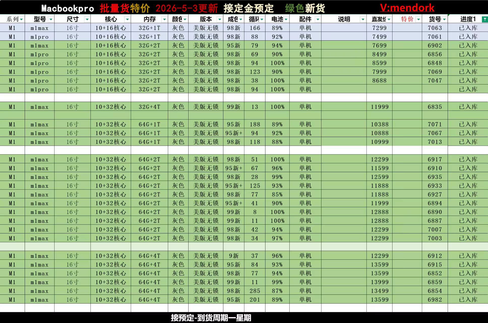

> **关于 AuraAI**：AuraAI 是 Mycelium Protocol 生态的 AI 能力层，为 Sin90（个人 OS）、iDoris（社区 AI）等产品提供底层智能支撑。本文记录当前阶段的三条工作线及优先级。

**结论先行（BLUF）**：Agent24-Desktop 是核心，正在用模块化架构（可插拔 CapabilityModule + 分层记忆 + Nostr 通信）构建跨平台个人 AI 助手框架；小模型实验结论是 64GB Mac 够用、128GB 更稳——个人工作室级选 M1 Ultra 128GB；AgentSpeaker 低优先级，基础设施已就绪，等待业务需求驱动。

---

## 一、Agent24-Desktop：核心框架，积极推进

### 定位

**Agent24-Desktop 是框架，不是应用。**

它做的是：把"个人 AI 助手"这件事的通用基础设施做好——跨平台分发、后台 daemon、能力模块标准化接口、AI 适配层、分层记忆、跨 agent 通信。

具体应用（博客发布助手、小红书助手、微信桥接等）从这个框架 fork，搭载自己的能力模块运行。

### 架构设计

```
Electron Shell（macOS / Windows 跨平台）
    │
    └── Core Loop（永远在线的本地 agent 主循环）
            ├── AI Layer（iDoris 主 / Claude / OpenAI / 本地 LLaVA 备）
            ├── Memory Layer（短期 SQLite / 长期 ATIF 归档 / 跨设备 Nostr 同步）
            ├── Capability Modules（可插拔）
            │       ▣ blog 发布
            │       ▣ 小红书发布
            │       ▣ 微信桥接
            │       ▣ 图像处理（Vision LLM）
            │       ▣ Claude Code skills
            │       ▣ 用户自定义模块
            ├── MCP Bridge（接入 Agent24 / 任意 MCP）
            └── Agent-Speaker Bridge（Nostr，跨 agent 通信）
```

### 核心设计原则

1. **框架核心只做演进**：Electron 壳、IPC、模块加载机制、AI 适配层、记忆层、通信层不掺杂业务逻辑
2. **能力即模块**：所有业务场景抽象为 `CapabilityModule`，按需加载/卸载，框架不依赖任何具体模块
3. **AI 解耦**：业务层不感知底层用的是哪个 AI——换模型不需要改业务代码
4. **后台 daemon + 任务自动分解**：桌面启动即运行后台 agent，用户交互后自动拆解任务、调度执行、跨 agent 协调

### 参考实现

从 [MushroomDAO/Xiaoheishu](https://github.com/MushroomDAO/Xiaoheishu) 的 `desktop/` 子目录提取通用框架部分——它提供了成熟的 Electron + Vite + React + node-llama-cpp 架构基础。场景特化部分已抽象为可插拔模块。

### 当前状态

框架架构设计完成，Roadmap 分 M1-M5 里程碑推进中。这是 AuraAI 当前最高优先级的工程工作。

---

## 二、小模型实验：64GB vs 128GB Mac 本地 AI 选型结论

这部分来自实际跑模型的测试数据，给出明确的硬件选型建议。

### 核心结论

- **64GB 统一内存**（M1/M2/M3 Max 或 Ultra）：能跑绝大多数最新模型（文生图、图生图、图生视频、视频剪辑、摘要），高清长视频会吃力、慢
- **128GB**（M1/M2/M3 Ultra）：全部流畅、多开、批量、高清全稳，适合个人视频工作室

### 2026.5 主流模型 Mac 实测

**文生图 / 图生图**

| 模型 | 来源 | 64GB | 128GB |
|------|------|------|-------|
| Flux.1-dev / Schnell | Black Forest Labs | 流畅 1024×1024、批量、多LoRA | 无压力 |
| SDXL 1.0 / SD 3 | Stability AI | 完全无压力 | 无压力 |
| Wan-Video 文生图分支 | 阿里 | 轻松 | 轻松 |

**图生视频 / 文生视频**

| 模型 | 64GB | 128GB |
|------|------|-------|
| Wan 2.7 Video 14B（阿里）| 量化版可跑 5–10秒 720P，偏慢 | 流畅、1080P、更长片段 |
| LongCat-Video（美团 2026.4）| 能跑但吃内存、容易爆 | 稳定、可后台跑 |
| Stable Video Diffusion XT | 流畅 4–8秒 576–720p | 流畅 |
| AnimateDiff 3.0 | 很轻松 | 轻松 |

**视频理解 / 摘要**

| 模型 | 64GB | 128GB |
|------|------|-------|
| Video-LLaMA 2 | 完全够 | 够 |
| LongCinema / MoviePy+AI | 够用 | 多开更稳 |

### 64GB 的边界

**能做的** ✅
- 文生图/图生图全部流畅
- 短片段图生视频（5秒内）、720p
- 视频摘要/理解
- 个人工作室单任务场景

**瓶颈** ⚠️
- 长视频（>10秒）、1080p、批量生成
- 同时开：模型 + FCP/PR + 大语言模型
- 容易触发 Swap（硬盘当内存），速度暴跌、伤 SSD

### 推荐配置

**方案 A：64GB（性价比，够用）**
- 机型：Mac Studio M1 Max/M2 Max 64GB，或 MacBook Pro M2/M3 Max 64GB
- 推荐组合：Flux Schnell（文生图）+ SVD XT + Wan 2.7 1.3B（短片生视频）+ Video-LLaMA 2（摘要）+ FCP + ComfyUI
- 适合：短视频、个人接单、预算有限、不同时跑多个大模型

**方案 B：128GB（一步到位，工作室级）**
- 机型：Mac Studio M1 Ultra/M2 Ultra 128GB
- 全栈：Flux.1-dev + SDXL（批量文生图）+ Wan 2.7 14B + LongCat-Video（长片高清）+ Video-LLaMA 2 + Qwen 32B + ComfyUI + FCP 全开
- 适合：长期个人工作室、长视频/1080p/批量交付、3年内不换机

### 当前市场行情（2026.5.3 更新）



*图：MacBook Pro 批量货报价（美版无锁），M1 Max 64G+2T 约 ¥11,888–¥12,888，M1 Max 64G+1T 约 ¥10,388–¥10,999。数据来源：V:mendork 渠道 2026.5.3 更新。*

### Jason 的选择

**M1 Max 64GB MacBook Pro**（当下，性价比足够）+ **等待 M5 Mac Mini**（官宣已推迟数月，等正式发布）。

逻辑：MacBook 覆盖日常工作和移动场景，M5 Mac Mini 作为未来的本地工作站补充——等官方正式发布，不追首发溢价。

---

## 三、AgentSpeaker：低优先级，基础设施就绪

### 是什么

AgentSpeaker 是 AuraAI 的 agent 通信基础设施，基于 Nostr 协议：

- **agent-speaker-relay**：部署在服务器的 strfry Docker relay，提供 NIP-01 标准 WebSocket 端点
- **agent-speaker**：Go 实现的 CLI 工具，基于 [fiatjaf/nak](https://github.com/fiatjaf/nak) 扩展，支持 NIP-44 端对端加密，为 agent 之间的高效通信提供压缩（zstd）+ 加密 + 去中心化协议

### 设计目标

> Making agent discover, communicate and cooperate in high efficiency with a compress, encrypted and decentralized protocol.

让 agent 之间能互相发现、通信、协作——不依赖中心化服务器，用 Nostr 网络作为传输层。

### 当前状态：低优先级维护

relay 基础设施已部署运行，CLI 工具的核心模块（`agent.go` + zstd 压缩）已完成。

**低优先级的原因**：需求端还没到位。Agent24-Desktop 的 Core Loop 和跨 agent 协调功能完成之前，AgentSpeaker 的实际使用场景有限。当 Agent24 推进到 M3+ 里程碑（跨 agent 通信阶段），AgentSpeaker 自然会被激活。

---

## 三条线的优先级关系

```
Agent24-Desktop（P0，积极推进）
    ↓ 框架成熟后，应用方 fork 使用
小模型实验（P1，持续更新）
    ↓ 为 Agent24 本地 AI 能力选型提供依据
AgentSpeaker（P2，低优先级维护）
    ↓ 等 Agent24 跨 agent 协作阶段激活
```

Agent24 是主线。小模型实验为 Agent24 的本地 AI 能力层提供选型依据。AgentSpeaker 是 Agent24 跨 agent 通信的底层协议，等上层需求驱动。

---

## 常见问题

**Q: Agent24-Desktop 什么时候可以用？**  
A: 框架设计已完成，M1 里程碑（基础 Electron 框架 + 模块加载）目标近期完成。面向开发者的可用版本预计在 M2 里程碑后。面向普通用户的稳定版跟随整体 AuraAI roadmap。

**Q: 64GB Mac 值不值得买来跑本地 AI？**  
A: 值。绝大多数文生图、短片视频生成、视频摘要场景够用，如果不同时跑多个大模型不会遇到明显瓶颈。唯一需要注意的是长视频（>10 秒）和 1080p 批量生成——这些场景 64GB 会慢，如果是主要工作场景建议直接上 128GB。

**Q: AgentSpeaker 和 Nostr 的关系是什么？**  
A: AgentSpeaker 把 Nostr 协议用作 agent 通信的传输层。Nostr 本来是为去中心化社交媒体设计的，但它的 WebSocket + 事件模型非常适合 agent 之间的异步消息传递。AgentSpeaker 在此基础上加了压缩（zstd）和端对端加密（NIP-44），适配 agent 通信场景。

---

> © 2026 Author: Mycelium Protocol. 本文采用 [CC BY 4.0](https://creativecommons.org/licenses/by/4.0/deed.zh) 授权——欢迎转载和引用，须注明作者姓名及原文链接，不得去除署名后以原创发布。

<!--EN-->

> **About AuraAI**: AuraAI is the AI capability layer of the Mycelium Protocol ecosystem, powering Sin90 (personal OS), iDoris (community AI), and related products. This post documents the current three workstreams and their priorities.

**BLUF**: Agent24-Desktop is the core track — building a cross-platform personal AI assistant framework with pluggable CapabilityModules, layered memory, and Nostr-based agent communication. The small model experiments conclude: 64GB Mac is sufficient, 128GB is more stable — M1 Ultra 128GB for studio-grade work. AgentSpeaker is low-priority; infrastructure is ready, waiting for upstream demand.

---

## Track 1: Agent24-Desktop — Core Framework, Active Development

### Positioning

**Agent24-Desktop is a framework, not an application.**

It handles the universal infrastructure for "personal AI assistant": cross-platform distribution, background daemon, standardized capability module interfaces, AI adapter layer, layered memory, and cross-agent communication.

Specific applications (blog publisher, Xiaohongshu assistant, WeChat bridge, etc.) fork this framework and add their own capability modules.

### Architecture

```
Electron Shell (macOS / Windows)
    │
    └── Core Loop (always-on local agent main loop)
            ├── AI Layer (iDoris primary / Claude / OpenAI / Local LLaVA fallback)
            ├── Memory Layer (SQLite short-term / ATIF long-term / Nostr cross-device sync)
            ├── Capability Modules (pluggable)
            │       ▣ Blog publishing
            │       ▣ Xiaohongshu publishing
            │       ▣ WeChat bridge
            │       ▣ Image processing (Vision LLM)
            │       ▣ Claude Code skills
            │       ▣ User-defined modules
            ├── MCP Bridge (Agent24 / any MCP)
            └── Agent-Speaker Bridge (Nostr, cross-agent communication)
```

### Core Design Principles

1. **Framework core evolves only**: Electron shell, IPC, module loading, AI adapter, memory layer, communication layer — no business logic
2. **Capability as module**: All use cases abstracted into `CapabilityModule`, loaded/unloaded on demand
3. **AI decoupled**: Business layer doesn't know which AI is running underneath — switching models requires no business code changes
4. **Background daemon + auto task decomposition**: Desktop launches a background agent that automatically decomposes user requests, schedules execution, and coordinates across agents

### Current Status

Framework architecture complete. Roadmap progressing through M1–M5 milestones. Highest priority engineering work in AuraAI.

---

## Track 2: Small Model Experiments — 64GB vs 128GB Mac Conclusions

**Core conclusions:**
- **64GB unified memory** (M1/M2/M3 Max or Ultra): runs most current models (text-to-image, image-to-image, image-to-video, video editing, summarization); struggles with high-res long video
- **128GB** (M1/M2/M3 Ultra): all models smooth, multi-instance, batch, high-res all stable — personal video studio grade

### 2026.5 Model Performance on Mac

**Image generation**: Flux.1-dev, SDXL, Wan — all run fine on 64GB. No issues.

**Video generation**: Wan 2.7 14B on 64GB runs at quantized quality, 5–10s 720P, slow. LongCat-Video (Meituan, April 2026, native 5-min 720P support) can crash on 64GB; stable on 128GB.

**Video understanding/summarization**: Video-LLaMA 2 — fine on 64GB.

### 64GB Ceiling

Works well for: all image gen, short video clips (under 5s), 720P, single-task personal studio use.

Bottlenecks at: long video (>10s), 1080P, batch generation, running models + FCP/Premiere + LLM simultaneously. Swap kicks in → speed crashes + SSD wear.

### Hardware Recommendations

**Option A: 64GB (value pick)** — Mac Studio M1/M2 Max 64GB or MacBook Pro M2/M3 Max 64GB. Sufficient for short-form content, solo freelance work, budget-conscious starts.

**Option B: 128GB (studio-grade)** — Mac Studio M1/M2 Ultra 128GB. Handles everything: Wan 2.7 14B, LongCat-Video long clips, 1080P, all models running simultaneously. Three-year machine.

### Jason's Choice

**M1 Max 64GB MacBook Pro** (current, good value) + **waiting for M5 Mac Mini** (officially announced but delayed several months — waiting for release rather than paying early-adopter premium).

---

## Track 3: AgentSpeaker — Low Priority, Infrastructure Ready

### What It Is

AgentSpeaker is AuraAI's agent communication infrastructure, Nostr-based:

- **agent-speaker-relay**: strfry Docker relay providing NIP-01 standard WebSocket endpoints
- **agent-speaker**: Go CLI tool built on [fiatjaf/nak](https://github.com/fiatjaf/nak), extended with NIP-44 E2E encryption and zstd compression for efficient agent-to-agent messaging

### Design Goal

> Making agents discover, communicate and cooperate in high efficiency with a compressed, encrypted and decentralized protocol.

Agents finding each other, messaging, and collaborating — without centralized servers, using Nostr as the transport layer.

### Current Status: Low Priority

Relay infrastructure deployed and running. CLI core modules complete. Low priority because the demand side isn't there yet: until Agent24-Desktop's Core Loop and cross-agent coordination features are built, AgentSpeaker's use cases are limited. It activates naturally when Agent24 reaches M3+ milestones.

---

## Priority Relationship

```
Agent24-Desktop (P0 — active development)
    ↓ applications fork from this once framework matures
Small Model Experiments (P1 — ongoing updates)
    ↓ informs hardware choices for Agent24's local AI layer
AgentSpeaker (P2 — low-priority maintenance)
    ↓ activates when Agent24 cross-agent coordination stage arrives
```

---

## FAQ

**Q: When will Agent24-Desktop be usable?**  
A: Framework design is complete. M1 milestone (basic Electron framework + module loading) targets near-term completion. Developer-accessible version expected after M2 milestone. End-user stable version follows the overall AuraAI roadmap.

**Q: Is a 64GB Mac worth buying for local AI?**  
A: Yes. The vast majority of image gen, short video, and summarization use cases work fine. The only caveat: long video (>10s) and 1080P batch generation are slow on 64GB. If those are your primary use cases, go straight to 128GB.

**Q: What's the relationship between AgentSpeaker and Nostr?**  
A: AgentSpeaker uses Nostr as the transport layer for agent communication. Nostr was designed for decentralized social media, but its WebSocket + event model maps well to async agent messaging. AgentSpeaker adds zstd compression and NIP-44 E2E encryption on top, tuned for agent communication patterns.

---

> © 2026 Author: Mycelium Protocol. Licensed under [CC BY 4.0](https://creativecommons.org/licenses/by/4.0/) — free to share and adapt with attribution. You must credit the author and link to the original; removing attribution and republishing as original is not permitted.
