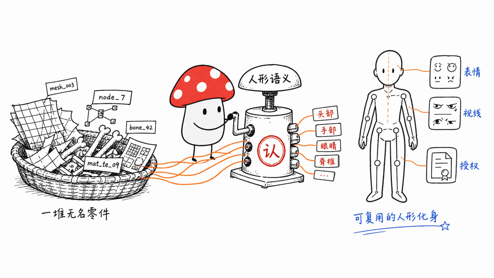
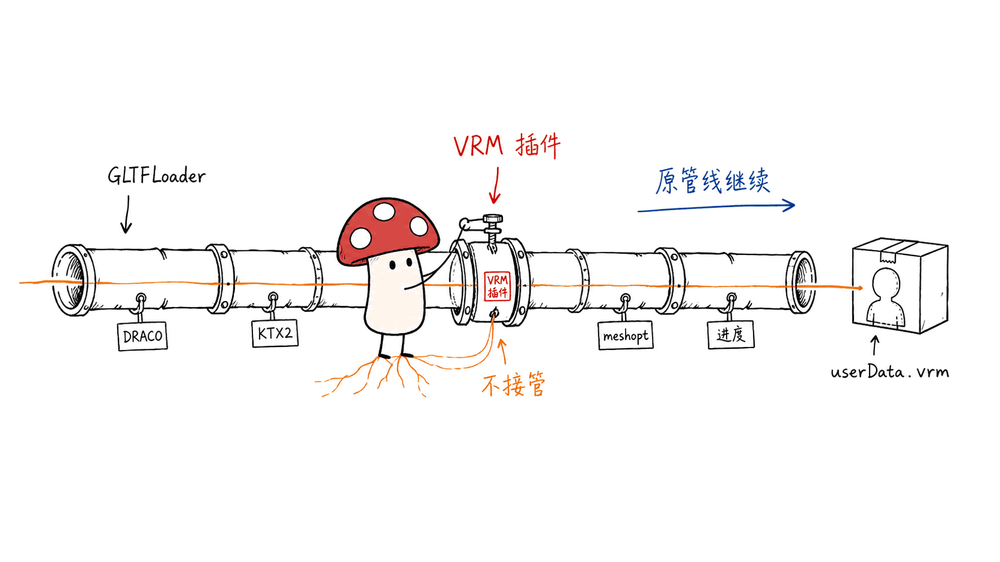
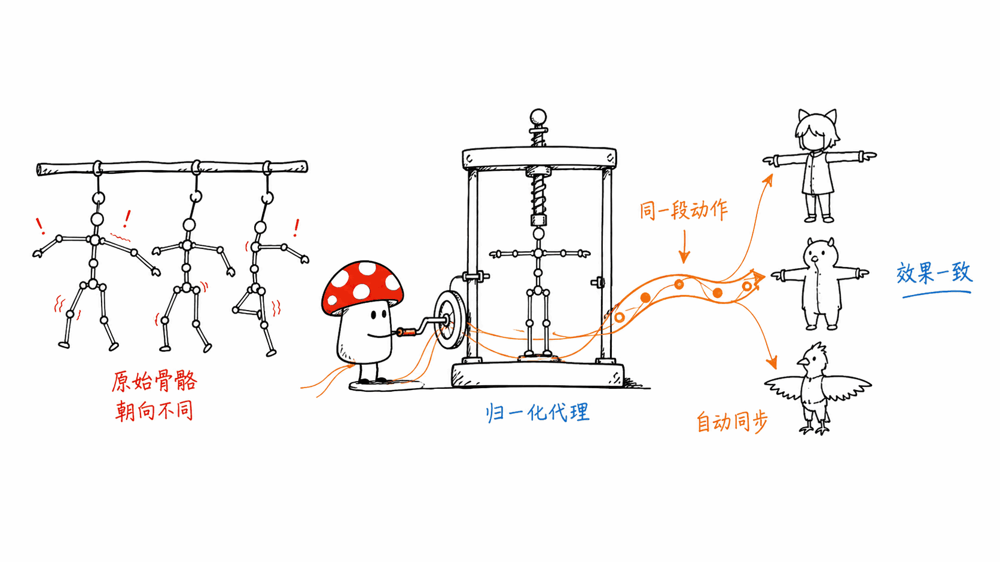
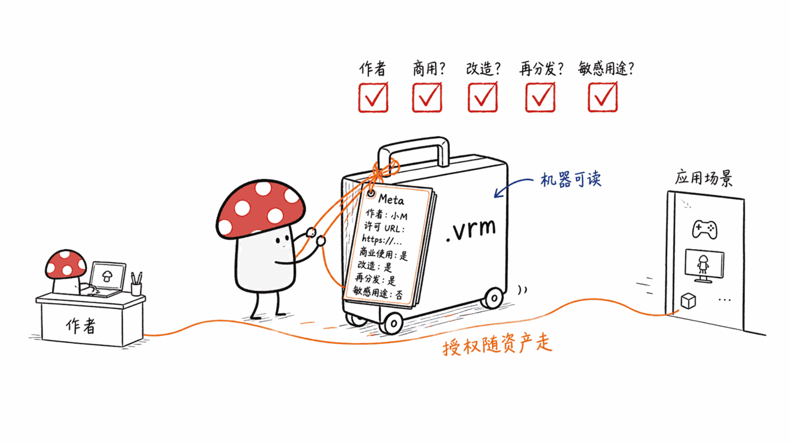

*by Mycelium Protocol*

---

项目地址：https://github.com/pixiv/three-vrm
VRM 规范官网：https://vrm.dev/
在线示例：https://pixiv.github.io/three-vrm/packages/three-vrm/examples
授权：MIT

---

## 一句话结论

**three-vrm 是 pixiv 开源的一座桥：它把 VRM 人形化身格式接进 three.js，让「在网页里放一个能眨眼、能转头、头发会飘的 3D 虚拟人」从一个月的工程量变成三十行代码。** 截至 2026 年 8 月 14 日，仓库 2103 star、184 fork、39 个开放 issue，dev 分支累计 2890 次提交；npm 上 `@pixiv/three-vrm` 最新版本 v3.5.5（2026-07-09 发布），过去一周下载 79,477 次、过去一月 310,591 次。自 2019 年 9 月首个包发布至今共 126 个版本。MIT 授权，商用无负担。

如果你要做的是 VTuber 工具、Web 端捏脸、虚拟展厅、AI 数字人前端、或者任何「网页上要站着一个人」的项目，这是目前 Web 生态里最成熟的那条路。

---

## 为什么 glTF 不够，非要有 VRM？

先厘清一个容易混的前提。

glTF 2.0 是 3D 资产的通用交换格式，它能完整描述几何、材质、贴图、骨骼、蒙皮、动画曲线。但 glTF 有意保持"通用"——它描述的是**一堆网格和一堆变换节点**，不描述"这是个人"。

结果就是：同一个人形模型，A 工具导出的骨骼叫 `Bip01_L_UpperArm`，B 工具叫 `mixamorig:LeftArm`，C 工具直接叫 `骨骼_034`。每个骨骼的静止朝向也各不相同。你想把 A 的动作套到 B 的模型上，得手写一份骨骼映射表 + 一堆旋转补偿。表情同理：一个模型的"笑"是 morph target #12，另一个是三个 morph target 的加权组合，还有的是切贴图。

**VRM 就是在 glTF 之上补了这一层「人形语义」。** 它是一组 glTF 扩展（`VRMC_vrm`、`VRMC_springBone`、`VRMC_node_constraint`、`VRMC_materials_mtoon` 等），由 VRM Consortium 维护规范。VRM 文件本质上就是一个合法的 `.glb`，任何 glTF 加载器都能读出它的网格；但装上 VRM 解析层之后，你额外拿到六样东西：

| VRM 补的语义 | 解决的问题 |
|---|---|
| **Humanoid** 标准人形骨骼 | 55 个具名骨骼槽位，动作可跨模型复用 |
| **Expressions** 表情 | `happy` / `angry` / `aa` / `blink` 等预设名，屏蔽底层实现差异 |
| **LookAt** 视线 | 眼球/头部朝向目标点，眼神能跟人 |
| **FirstPerson** 第一人称 | 标注哪些网格在第一人称视角要剔除（不然你会看到自己的鼻子内壁） |
| **SpringBone** 弹簧骨骼 | 头发、裙摆、饰品的次级动力学，不用做物理引擎 |
| **MToon** 卡通材质 | 二次元赛璐璐着色的标准化实现 |
| **Meta** 元数据 | **机器可读的授权声明**：允许商用吗？允许改造吗？允许暴力/性表现吗？ |



最后那条 Meta 值得单独说，后面展开。

---

## three-vrm 的架构：一个插件，十六个包

three-vrm 是个 monorepo，`packages/` 下有 16 个包，分两类。

**8 个运行时包：**

| 包 | 职责 |
|---|---|
| `@pixiv/three-vrm` | 总入口，聚合下面所有能力 |
| `@pixiv/three-vrm-core` | 核心规范：Humanoid / Expressions / LookAt / FirstPerson / Meta |
| `@pixiv/three-vrm-springbone` | 弹簧骨骼物理与碰撞体 |
| `@pixiv/three-vrm-node-constraint` | 节点约束（旋转/瞄准/滚转） |
| `@pixiv/three-vrm-materials-mtoon` | MToon 卡通材质 |
| `@pixiv/three-vrm-materials-hdr-emissive-multiplier` | HDR 自发光倍率扩展 |
| `@pixiv/three-vrm-materials-v0compat` | VRM 0.0 材质兼容层 |
| `@pixiv/three-vrm-animation` | VRMA 动画格式加载与播放 |

**8 个纯类型包**（`@pixiv/types-vrm-0.0`、`types-vrmc-vrm-1.0`、`types-vrmc-springbone-extended-collider-1.0` 等），只提供 TypeScript 类型定义，零运行时开销。你要自己读 glTF JSON 里的扩展字段时才需要装。

这个拆分的实际意义：**如果你只要静态展示一个 VRM 模型，不需要头发飘动，可以只装 `three-vrm-core`**，包体积能砍掉一大截。反过来，`@pixiv/three-vrm` 的依赖里六个子包版本严格锁死在同一个 `3.5.5`，混装不同版本会出问题。

### 关键设计：它不是加载器，是加载器插件

这是 v1.0 之后最重要的架构决策。旧版的 `VRM.from()` 和 `VRMImporter` 全部移除，现在的用法是往 three.js 官方的 `GLTFLoader` 上注册一个插件：

```js
import * as THREE from 'three';
import { GLTFLoader } from 'three/addons/loaders/GLTFLoader.js';
import { VRMLoaderPlugin, VRMUtils } from '@pixiv/three-vrm';

const loader = new GLTFLoader();

// 一行注册，GLTFLoader 就懂 VRM 了
loader.register((parser) => new VRMLoaderPlugin(parser));

loader.load('/models/avatar.vrm', (gltf) => {
  const vrm = gltf.userData.vrm;   // VRM 实例挂在 userData 上

  VRMUtils.rotateVRM0(vrm);        // VRM0.0 模型背对镜头，这里转正
  scene.add(vrm.scene);
});
```

为什么这个决策重要？因为它意味着 three-vrm **不接管资源管线**。GLTFLoader 的 DRACO 压缩、KTX2 纹理、meshopt 解码、`LoadingManager` 进度、跨域配置——所有这些你原本的配置全部继续生效，three-vrm 只是在解析阶段插一脚。同一个 loader 实例还能同时注册 VRM 和 VRMA 两个插件，一个加载器读两种文件。



对比之下，很多"XX 格式加载器"是自己 fork 一份 GLTFLoader 改的，一旦 three.js 升级就断档。three-vrm 这条路，peer 依赖只要求 `three >= 0.137`，跨了近 50 个 three.js 版本仍然可用。

### 渲染循环里必须调 update

VRM 的动态部分（表情插值、视线跟随、弹簧骨骼、MToon 的 UV 动画）都靠 `vrm.update(delta)` 驱动：

```js
const clock = new THREE.Clock();

function animate() {
  requestAnimationFrame(animate);
  const delta = clock.getDelta();

  if (vrm) vrm.update(delta);   // 忘了这行，模型就是根木头

  renderer.render(scene, camera);
}
```

读一下 `VRMCore.update()` 的源码就知道它按顺序做了什么：先 `humanoid.update()` 把归一化骨骼同步回原始骨骼，再 `lookAt.update()`，再 `expressionManager.update()`。顺序是有讲究的——表情要在骨骼确定之后算。

---

## 六个能力模块，逐个拆

### 1. Humanoid：归一化骨骼是整个格式的地基

这是 VRM 1.0 相对 0.0 最大的一处升级，也是 three-vrm 里最容易被忽略的设计。

问题是这样的：不同建模师做的模型，骨骼静止姿态的朝向不一样。有人的左上臂在 rest pose 下是沿 X 轴，有人是有 15° 的偏转。你直接把一段动画数据的四元数灌进去，模型就扭曲了。

VRM 1.0 允许模型保留自己的原始骨骼朝向（"non-normalized"），同时 three-vrm 提供一套**归一化代理骨骼**：每根归一化骨骼在 rest pose 下的朝向严格是单位四元数 `[0,0,0;1]`。

```js
// 原始骨骼——模型自己的朝向，做精细控制时用
const rawHead = vrm.humanoid.getRawBoneNode('head');

// 归一化骨骼——朝向统一，灌动画数据时用
const normHead = vrm.humanoid.getNormalizedBoneNode('head');
normHead.rotation.y = 0.5;   // 对任何 VRM 模型效果一致
```

归一化骨骼是原始骨骼的**代理对象**，你对它的改动会在 `vrm.update()` 时自动同步回原始骨骼。如果你的动画系统自己管这层同步，把 `vrm.humanoid.autoUpdateHumanBones` 设成 `false` 关掉即可。

一句话总结价值：**因为有这层归一化，一段动作数据可以套在任何 VRM 模型上，不需要重定向（retargeting）。** 这是 VRM 相对裸 glTF 最实在的收益。



### 2. Expressions：从 BlendShapeProxy 改名而来

VRM 0.0 里叫 `blendShapeProxy`，1.0 改名 `expressionManager`。API 也简化了，预设名从枚举变成普通字符串：

```js
vrm.expressionManager.setValue('happy', 1.0);   // 😄
vrm.expressionManager.setValue('aa', 0.7);      // 张嘴，做口型同步用
vrm.expressionManager.setValue('blink', 1.0);   // 眨眼
```

一个 expression 底下可以绑定多个 morph target、材质颜色变化、UV 偏移（切贴图的表情），调用方完全不用知道模型是怎么实现的——这正是标准化的意义。

### 3. LookAt：眼神跟随

```js
const lookAtTarget = new THREE.Object3D();
camera.add(lookAtTarget);          // 挂在相机上，眼睛就一直看着用户
vrm.lookAt.target = lookAtTarget;
```

VRM 1.0 把 0.0 时代的 `firstPersonBoneOffset` 挪到了 `vrm.lookAt.offsetFromHeadBone`，用来微调视线起点相对头骨的偏移。

### 4. FirstPerson：第一人称剔除

VR 场景专用。模型的头发、睫毛、脸部网格在第一人称视角下会糊住整个视野，VRM 用 `firstPersonFlag` 标注每个网格该不该在第一人称层渲染，three-vrm 把它翻译成 three.js 的 layer 机制。VRM 1.0 移除了独立的 FirstPersonBone，直接用 Humanoid 的 head 骨骼。

### 5. SpringBone：头发和裙摆

`@pixiv/three-vrm-springbone` 实现了一套轻量次级动力学。碰撞体支持三种形状：球体（Sphere）、胶囊体（Capsule）、平面（Plane）。平面碰撞体来自 `VRMC_springBone_extended_collider` 扩展，专门解决裙摆穿模。

这不是通用物理引擎——它只处理骨骼链的惯性摆动，不做碰撞响应，也不做布料求解。但对于虚拟形象这个场景，性价比极高：不用引入 ammo.js/rapier，几百字节的参数就把"活人感"做出来了。

模型带缩放时弹簧骨骼行为会异常，官方专门写了一份 `guides/spring-bones-on-scaled-models.md` 说明，遇到再查。

### 6. NodeConstraint：节点约束

`VRMC_node_constraint` 提供旋转约束、瞄准约束、滚转约束。典型用法是「twist bone」——上臂旋转时，让前臂中段跟随一部分旋转量，避免蒙皮出现麻花状扭曲。这类细节以前得在 DCC 工具里烘焙，现在写进格式里，运行时算。

---

## MToon 与 WebGPU：v3 的重头戏

MToon 是 VRM 生态的标志性卡通着色器，做赛璐璐风格的明暗二分、边缘光（rim light）、描边（outline）、以及 matcap 叠加。VRM 1.0 的 MToon 相对 0.0 几乎是重写，官方的原话是「就当它是个完全不同的材质」。

**v3 起 three-vrm 提供了 WebGPURenderer 兼容路径**，方式是把材质类型换成基于 three.js NodeMaterial 系统的 `MToonNodeMaterial`：

```js
import { MToonMaterialLoaderPlugin, VRMLoaderPlugin } from '@pixiv/three-vrm';
import { MToonNodeMaterial } from '@pixiv/three-vrm/nodes';

loader.register((parser) => {
  const mtoonMaterialPlugin = new MToonMaterialLoaderPlugin(parser, {
    materialType: MToonNodeMaterial,   // 换成 WebGPU 兼容实现
  });

  return new VRMLoaderPlugin(parser, { mtoonMaterialPlugin });
});
```

两个必须知道的约束：

1. **`MToonNodeMaterial` 只支持 three.js r167 及以上。**
2. 官方明确警告：three.js 的 NodeMaterial 系统仍在开发中，**这部分的向后兼容性会比 three-vrm 其他部分更频繁地被打破**。

翻译成人话：如果你的项目要长期稳定运行，现在还是走 WebGL 路径（默认的 `MToonMaterial`）；WebGPU 路径适合新项目和愿意跟版本的团队。这个判断在 2026 年 8 月依然成立。

---

## VRMA：动作也标准化了

`@pixiv/three-vrm-animation` 处理 VRM Animation（`.vrma`）格式——一种同样基于 glTF 的人形动作交换格式。它的价值和 Humanoid 归一化骨骼是一套逻辑：**动作文件不绑定具体模型**。

用法上最漂亮的一点是，VRM 和 VRMA 共用同一个 `GLTFLoader`：

```js
import { createVRMAnimationClip, VRMAnimationLoaderPlugin, VRMLookAtQuaternionProxy } from '@pixiv/three-vrm-animation';

const loader = new GLTFLoader();
loader.register((parser) => new VRMLoaderPlugin(parser));
loader.register((parser) => new VRMAnimationLoaderPlugin(parser));   // 同一个 loader 读两种格式

const gltfVrm = await loader.loadAsync('./models/avatar.vrm');
const vrm = gltfVrm.userData.vrm;

// 播放视线动画需要这个代理
const lookAtProxy = new VRMLookAtQuaternionProxy(vrm.lookAt);
lookAtProxy.name = 'lookAtQuaternionProxy';
vrm.scene.add(lookAtProxy);

const gltfVrma = await loader.loadAsync('./models/motion.vrma');
const vrmAnimation = gltfVrma.userData.vrmAnimations[0];

// 把 VRMA 编译成 three.js 标准 AnimationClip
const clip = createVRMAnimationClip(vrmAnimation, vrm);
const mixer = new THREE.AnimationMixer(vrm.scene);
mixer.clipAction(clip).play();
```

产出是标准的 `THREE.AnimationClip`，意味着 three.js 的 `AnimationMixer` 全套能力——交叉淡入淡出、权重混合、时间缩放——直接可用，不需要学新 API。

---

## 性能：官方示例里那几行不是装饰

翻 three-vrm 的示例代码，会发现加载完模型后总有这么几行，注释写着 "calling these functions greatly improves the performance"：

```js
VRMUtils.removeUnnecessaryVertices(vrm.scene);   // 删掉索引未引用的顶点
VRMUtils.removeUnnecessaryJoints(vrm.scene);     // 精简蒙皮骨骼列表
VRMUtils.combineSkeletons(vrm.scene);            // 合并骨架
VRMUtils.combineMorphs(vrm);                     // 按表情合并 morph target
```

值得单独讲两个：

**`combineSkeletons`** —— three.js 每帧要为每个 skeleton 计算一遍骨骼矩阵。一个 VRM 模型常常有五六个 SkinnedMesh（身体、头发、衣服、眼睛……），各带一份骨架，矩阵计算就重复了五六遍。合并成一份，这部分开销直接除以 N。

**`combineMorphs`** —— 这条是**移动端的保命符**。WebGL 对单个网格的 morph target 数量有硬限制（受纹理单元和 attribute 数量约束），移动 GPU 上限更低。一个精细模型的脸可能有 50+ 个 blend shape，直接超限崩溃。`combineMorphs` 按 VRM expression 把多个 morph target 预合并成一个，把数量压到限额内。官方注释写得很直白：「prevents crashes caused by the limitation of the number of morph targets, especially on mobile devices」。

卸载模型时记得：

```js
VRMUtils.deepDispose(vrm.scene);   // vrm.dispose 已在 v1.0 移除
```

three.js 的 GPU 资源不走 GC，忘了这行就是显存泄漏。做换装、换模型的应用尤其要注意。

---

## VRM 0.0 → 1.0：六个真实坑位

生态里 VRM 0.0 的模型存量依然巨大，做兼容是常态。官方 `guides/migration-guide-1.0.md` 里的坑，挑影响最大的六个：

| # | 坑 | 处理 |
|---|---|---|
| 1 | **模型朝向反了**：VRM 1.0 正面从 Z- 改成 Z+ | 无脑调 `VRMUtils.rotateVRM0(vrm)`，它自己判断版本，对 1.0 模型是空操作 |
| 2 | `VRM.from()` / `VRMImporter` 已删除 | 改用 `VRMLoaderPlugin` 注册 |
| 3 | `blendShapeProxy` → `expressionManager` | 同时改枚举为字符串 |
| 4 | `meta` 结构重构 | 用 `vrm.meta.metaVersion === '0'` 分支判断，`VRM0Meta` / `VRM1Meta` 两套结构 |
| 5 | `vrm.materials` 现在**只含 MToon 材质** | 要拿全部材质用 `gltf.parser.getDependencies('material')` |
| 6 | MToon 阴影表现变了 | 想要旧观感，设 `MToonMaterial.v0CompatShade = true` |

另外两条容易踩：`VRMSchema` 和 `GLTFSchema` 都已移除，前者换成 `@pixiv/types-vrm-0.0` / `@pixiv/types-vrmc-vrm-1.0` 类型包，后者官方建议直接用 `@gltf-transform/core` 的类型。还有 `VRMUtils.extractThumbnailBlob` 因为 1.0 把 `meta.texture` 改成了 `meta.thumbnailImage`（图片而非纹理）而被移除，暂时没有替代品。

调试的话，给 `VRMLoaderPlugin` 传一个 `helperRoot`，humanoid、lookAt、springBone、constraint 四类辅助线框就会显示出来：

```js
const helperRoot = new THREE.Group();
helperRoot.renderOrder = 10000;
scene.add(helperRoot);

loader.register((parser) => new VRMLoaderPlugin(parser, { helperRoot }));
```

---

## 被低估的那一块：meta 里的授权声明

技术之外，VRM 有一个设计我们认为值得单独指出：**它把授权条款写进了文件本身，并且是机器可读的。**

`vrm.meta` 里除了作者、版本、缩略图，还有一组明确的许可字段：允许谁使用这个化身？允许商用吗？允许改造和再分发吗？允许用于暴力、性、政治宗教内容吗？允许做换脸/表演捕捉吗？

```js
// 加载后先看一眼授权，这是义务不是可选项
console.log(vrm.meta.metaVersion);
console.log(vrm.meta);   // VRM1Meta: name / authors / licenseUrl / avatarPermission / commercialUsage ...
```



three-vrm 在源码注释里明确提示：「You might want to refer these license fields before use your VRMs.」

这件事的分量在于：一个虚拟形象往往是创作者投入几十上百小时的作品，也是一个人在数字世界的身体。**把授权意图随资产一起走、而不是留在某个平台的服务条款里，是创作者保有数字主权的前提。** 这和我们在 Mycelium Protocol 里反复讲的东西是同一件事——数据、身份、创作收益要归属创作者本人，而不是被平台单方面定义。

VRM 的做法当然不是完整答案：字段是声明性的，格式本身不做强制执行，链上溯源和分账更是另一层问题。但**先有一个开放格式把意图带上，后面的层才有东西可以对接。** 这个次序是对的。

---

## 什么时候该用它，什么时候不该

**适合：**

- VTuber 相关的 Web 工具（形象预览、表情调试、动作试穿）
- AI 数字人 / 语音助手的前端形象层——`setValue('aa', x)` 接口天然适合口型同步
- 虚拟展厅、社交空间、轻量元宇宙场景
- 需要「用户上传自己的化身」的应用——VRM 是目前用户侧存量最大的人形化身格式
- 电商试衣、教育角色、游戏角色预览

**不适合 / 需要额外补齐：**

- **没有 IK。** 要脚踩地面、手抓物体，得自己接 IK 求解器
- **没有口型同步（lipsync）逻辑。** 只给了表情接口，音频到音素的分析要自己做
- **没有相机控制。** OrbitControls 得自己加
- **不是通用物理引擎。** SpringBone 只处理骨骼链摆动
- **WebGPU 路径有兼容性风险**（见上文 NodeMaterial 部分）
- **VRM 是人形专用格式。** 四足角色、机械体、非人形态用不上 Humanoid 这套语义

技术底线要求：`three >= 0.137`，WebGPU 路径需要 `three >= r167`。

---

## 一个观察

three-vrm 这个项目最值得学的，其实不是它的着色器或者物理实现，而是**它选择了「做插件」而不是「做框架」**。

它没有发明自己的场景图、没有包装 three.js 的 API、没有要求你按它的方式组织代码。它只是往 `GLTFLoader` 上挂了一个 `register()`，把 VRM 语义解析出来放进 `gltf.userData`，剩下的还给你。这个克制换来的是：three.js 从 r137 一路升到 r180+，three-vrm 基本没断过档；用户原有的资源管线、加载策略、渲染管线全部不受影响。

126 个版本、2890 次提交、六年半持续维护——一个由商业公司（pixiv）开源、但按公共基础设施的标准在维护的库。这在开源世界不算多见。

对做数字公共物品的人来说，这是个很有参考价值的样本：**你的项目要成为生态里的一块标准件，前提是别试图当整个生态。**

---

> © 2026 Author: Mycelium Protocol. 本文采用 [CC BY 4.0](https://creativecommons.org/licenses/by/4.0/deed.zh) 授权——欢迎转载和引用，须注明作者姓名及原文链接，不得去除署名后以原创发布。

<!--EN-->

## TL;DR

**three-vrm is a bridge open-sourced by pixiv: it plugs the VRM humanoid avatar format into three.js, turning "put a 3D character on a web page that blinks, turns its head, and has hair that sways" from a month of engineering into about thirty lines of code.** As of August 14, 2026: 2,103 stars, 184 forks, 39 open issues, 2,890 commits on the dev branch. On npm, `@pixiv/three-vrm` is at v3.5.5 (released 2026-07-09) with 79,477 downloads in the past week and 310,591 in the past month. 126 versions published since September 2019. MIT licensed.

If you're building VTuber tooling, a web avatar editor, a virtual showroom, an AI digital-human frontend, or anything that needs a person standing on a web page, this is the most mature path in the web ecosystem today.

---

## Why isn't glTF enough?

glTF 2.0 fully describes geometry, materials, textures, skeletons, skinning, and animation curves. But glTF deliberately stays generic — it describes **a pile of meshes and transform nodes**, not "this is a person."

The consequence: the same humanoid model exports with bones named `Bip01_L_UpperArm` from tool A, `mixamorig:LeftArm` from tool B, and `bone_034` from tool C. Rest-pose orientations differ per bone. To retarget A's motion onto B's model, you hand-write a bone mapping table plus rotation compensation. Expressions are worse: "smile" is morph target #12 on one model, a weighted blend of three targets on another, and a texture swap on a third.

**VRM adds that humanoid semantic layer on top of glTF.** It's a set of glTF extensions (`VRMC_vrm`, `VRMC_springBone`, `VRMC_node_constraint`, `VRMC_materials_mtoon`, and more) maintained by the VRM Consortium. A VRM file is a valid `.glb` — any glTF loader reads its meshes — but with a VRM parsing layer you additionally get:

| What VRM adds | Problem it solves |
|---|---|
| **Humanoid** standard bones | 55 named bone slots; motion is reusable across models |
| **Expressions** | Preset names like `happy` / `angry` / `aa` / `blink`, hiding implementation differences |
| **LookAt** | Eye and head direction toward a target — the gaze can follow you |
| **FirstPerson** | Marks which meshes to cull in first-person view |
| **SpringBone** | Secondary dynamics for hair, skirts, accessories — no physics engine needed |
| **MToon** | Standardized cel-shading for anime-style rendering |
| **Meta** | **Machine-readable license terms**: commercial use? modification? violent or sexual depiction? |


That last one deserves its own section — see below.

---

## Architecture: one plugin, sixteen packages

three-vrm is a monorepo with 16 packages under `packages/`, in two groups.

**Eight runtime packages:**

| Package | Role |
|---|---|
| `@pixiv/three-vrm` | Umbrella entry, aggregates everything below |
| `@pixiv/three-vrm-core` | Core spec: Humanoid / Expressions / LookAt / FirstPerson / Meta |
| `@pixiv/three-vrm-springbone` | Spring bone physics and colliders |
| `@pixiv/three-vrm-node-constraint` | Node constraints (rotation / aim / roll) |
| `@pixiv/three-vrm-materials-mtoon` | MToon toon shader |
| `@pixiv/three-vrm-materials-hdr-emissive-multiplier` | HDR emissive multiplier extension |
| `@pixiv/three-vrm-materials-v0compat` | VRM 0.0 material compatibility |
| `@pixiv/three-vrm-animation` | VRMA animation format |

**Eight type-only packages** (`@pixiv/types-vrm-0.0`, `types-vrmc-vrm-1.0`, `types-vrmc-springbone-extended-collider-1.0`, …) providing TypeScript definitions with zero runtime cost.

The practical upshot: **if you only need static display, install just `three-vrm-core`** and cut a large chunk of bundle size. Conversely, `@pixiv/three-vrm` pins its six sub-packages to the exact same version (`3.5.5`) — mixing versions breaks things.

### The key design: it's a loader plugin, not a loader

This is the most important architectural decision after v1.0. The old `VRM.from()` and `VRMImporter` are gone. You now register a plugin onto three.js's own `GLTFLoader`:

```js
import * as THREE from 'three';
import { GLTFLoader } from 'three/addons/loaders/GLTFLoader.js';
import { VRMLoaderPlugin, VRMUtils } from '@pixiv/three-vrm';

const loader = new GLTFLoader();

// One line, and GLTFLoader understands VRM
loader.register((parser) => new VRMLoaderPlugin(parser));

loader.load('/models/avatar.vrm', (gltf) => {
  const vrm = gltf.userData.vrm;

  VRMUtils.rotateVRM0(vrm);   // VRM0.0 models face away from camera; fix that
  scene.add(vrm.scene);
});
```

Why does this matter? Because three-vrm **doesn't take over your asset pipeline**. DRACO compression, KTX2 textures, meshopt decoding, `LoadingManager` progress, CORS config — everything you already configured on GLTFLoader keeps working. three-vrm only hooks the parse stage. The same loader instance can register both the VRM and VRMA plugins and read both file types.


Compare that to the many "format loaders" that are forked copies of GLTFLoader — they break the moment three.js ships a new version. three-vrm's peer dependency is just `three >= 0.137`, spanning nearly 50 three.js releases.

### You must call update in the render loop

```js
const clock = new THREE.Clock();

function animate() {
  requestAnimationFrame(animate);
  const delta = clock.getDelta();

  if (vrm) vrm.update(delta);   // forget this and the model is a statue

  renderer.render(scene, camera);
}
```

Reading `VRMCore.update()` shows the ordering: `humanoid.update()` first (syncing normalized bones back to raw bones), then `lookAt.update()`, then `expressionManager.update()`. The order matters — expressions are computed after the skeleton settles.

---

## The six capability modules

### 1. Humanoid: normalized bones are the foundation

Different modelers ship different rest-pose orientations. One artist's left upper arm sits along X; another's is 15° off. Push the same quaternion animation data into both and one of them deforms.

VRM 1.0 lets models keep their original ("non-normalized") bone orientations, while three-vrm provides **normalized proxy bones** whose rest-pose orientation is exactly the identity quaternion `[0,0,0;1]`.

```js
// Raw bones — the model's own orientation, for fine-grained control
const rawHead = vrm.humanoid.getRawBoneNode('head');

// Normalized bones — uniform orientation, for driving animation data
const normHead = vrm.humanoid.getNormalizedBoneNode('head');
normHead.rotation.y = 0.5;   // behaves identically on any VRM model
```

Normalized bones are **proxy objects**; edits sync back to raw bones on `vrm.update()`. Set `vrm.humanoid.autoUpdateHumanBones = false` if your animation system handles that itself.

The value in one sentence: **because of this normalization layer, one motion clip plays on any VRM model with no retargeting.** That is VRM's most concrete win over raw glTF.


### 2. Expressions (formerly BlendShapeProxy)

```js
vrm.expressionManager.setValue('happy', 1.0);   // 😄
vrm.expressionManager.setValue('aa', 0.7);      // mouth open — for lipsync
vrm.expressionManager.setValue('blink', 1.0);
```

A single expression can bind multiple morph targets, material color changes, and UV offsets (texture-swap expressions). The caller never needs to know which — that's the whole point of standardization.

### 3. LookAt

```js
const lookAtTarget = new THREE.Object3D();
camera.add(lookAtTarget);          // parent it to the camera: the eyes follow the user
vrm.lookAt.target = lookAtTarget;
```

VRM 1.0 moved the old `firstPersonBoneOffset` to `vrm.lookAt.offsetFromHeadBone`.

### 4. FirstPerson

For VR. Hair, eyelashes, and face meshes would fill the entire first-person view, so VRM tags each mesh with a `firstPersonFlag` and three-vrm translates that into three.js layers. VRM 1.0 removed the separate FirstPersonBone in favor of the Humanoid head bone.

### 5. SpringBone

Lightweight secondary dynamics. Colliders come in three shapes: sphere, capsule, and plane. The plane collider comes from the `VRMC_springBone_extended_collider` extension and exists mainly to stop skirts from clipping through legs.

This is not a general physics engine — it handles inertial sway on bone chains, nothing more. But for avatars the cost/benefit is excellent: no ammo.js or rapier, a few hundred bytes of parameters, and the character reads as alive.

Spring bones misbehave on scaled models; the repo ships a dedicated `guides/spring-bones-on-scaled-models.md`.

### 6. NodeConstraint

`VRMC_node_constraint` provides rotation, aim, and roll constraints. The canonical use is a twist bone: when the upper arm rotates, the mid-forearm follows partially so the skin doesn't candy-wrap. This used to be baked in a DCC tool; now it lives in the format and runs at runtime.

---

## MToon and WebGPU: the headline of v3

MToon is VRM's signature toon shader — binary light/shade split, rim light, outline, matcap. VRM 1.0's MToon is essentially a rewrite; the official guidance is to "think like the VRM1.0 MToon is basically a totally different material."

**Since v3, three-vrm ships WebGPURenderer compatibility** by swapping in `MToonNodeMaterial`, built on three.js's NodeMaterial system:

```js
import { MToonMaterialLoaderPlugin, VRMLoaderPlugin } from '@pixiv/three-vrm';
import { MToonNodeMaterial } from '@pixiv/three-vrm/nodes';

loader.register((parser) => {
  const mtoonMaterialPlugin = new MToonMaterialLoaderPlugin(parser, {
    materialType: MToonNodeMaterial,
  });

  return new VRMLoaderPlugin(parser, { mtoonMaterialPlugin });
});
```

Two constraints you must know:

1. **`MToonNodeMaterial` requires three.js r167 or later.**
2. The maintainers explicitly warn that three.js's NodeMaterial system is still under development and **this part will break compatibility with older three.js versions more often than the rest of three-vrm**.

In plain terms: for long-lived production, stay on the WebGL path (the default `MToonMaterial`). The WebGPU path suits new projects and teams willing to track versions. That judgment still holds as of August 2026.

---

## VRMA: motion gets standardized too

`@pixiv/three-vrm-animation` handles VRM Animation (`.vrma`), a glTF-based humanoid motion interchange format. Same logic as normalized bones: **motion files aren't bound to a specific model.**

The elegant part is that VRM and VRMA share one `GLTFLoader`:

```js
import { createVRMAnimationClip, VRMAnimationLoaderPlugin, VRMLookAtQuaternionProxy } from '@pixiv/three-vrm-animation';

const loader = new GLTFLoader();
loader.register((parser) => new VRMLoaderPlugin(parser));
loader.register((parser) => new VRMAnimationLoaderPlugin(parser));   // one loader, two formats

const gltfVrm = await loader.loadAsync('./models/avatar.vrm');
const vrm = gltfVrm.userData.vrm;

// Required to play look-at animation
const lookAtProxy = new VRMLookAtQuaternionProxy(vrm.lookAt);
lookAtProxy.name = 'lookAtQuaternionProxy';
vrm.scene.add(lookAtProxy);

const gltfVrma = await loader.loadAsync('./models/motion.vrma');
const vrmAnimation = gltfVrma.userData.vrmAnimations[0];

// Compile VRMA into a standard three.js AnimationClip
const clip = createVRMAnimationClip(vrmAnimation, vrm);
const mixer = new THREE.AnimationMixer(vrm.scene);
mixer.clipAction(clip).play();
```

The output is a plain `THREE.AnimationClip`, so the full `AnimationMixer` toolkit — crossfading, weight blending, time scaling — works with no new API to learn.

---

## Performance: those lines in the examples aren't decoration

Every official example has these right after loading, commented "calling these functions greatly improves the performance":

```js
VRMUtils.removeUnnecessaryVertices(vrm.scene);
VRMUtils.removeUnnecessaryJoints(vrm.scene);
VRMUtils.combineSkeletons(vrm.scene);
VRMUtils.combineMorphs(vrm);
```

Two worth explaining:

**`combineSkeletons`** — three.js computes bone matrices per skeleton per frame. A VRM model often has five or six SkinnedMeshes (body, hair, clothes, eyes…), each with its own skeleton, so that work repeats five or six times. Merging them divides that cost by N.

**`combineMorphs`** — this is the mobile lifesaver. WebGL caps the number of morph targets per mesh, and mobile GPUs cap it lower. A detailed face can carry 50+ blend shapes and blow past the limit. `combineMorphs` pre-merges morph targets per VRM expression to fit under the cap. The source comment is blunt: "prevents crashes caused by the limitation of the number of morph targets, especially on mobile devices."

When unloading:

```js
VRMUtils.deepDispose(vrm.scene);   // vrm.dispose was removed in v1.0
```

three.js GPU resources aren't garbage collected. Skip this and you leak VRAM — critical for apps that swap outfits or models.

---

## VRM 0.0 → 1.0: six real traps

VRM 0.0 models are still everywhere, so compatibility is the norm. The six highest-impact items from `guides/migration-guide-1.0.md`:

| # | Trap | Fix |
|---|---|---|
| 1 | **Model faces backward**: VRM 1.0 flipped forward from Z- to Z+ | Always call `VRMUtils.rotateVRM0(vrm)`; it version-checks and no-ops on 1.0 |
| 2 | `VRM.from()` / `VRMImporter` removed | Use `VRMLoaderPlugin` |
| 3 | `blendShapeProxy` → `expressionManager` | Enums became plain strings too |
| 4 | `meta` restructured | Branch on `vrm.meta.metaVersion === '0'`; `VRM0Meta` vs `VRM1Meta` |
| 5 | `vrm.materials` now holds **only MToon materials** | Use `gltf.parser.getDependencies('material')` for all materials |
| 6 | MToon shading behavior changed | Set `MToonMaterial.v0CompatShade = true` for the old look |

Two more: `VRMSchema` and `GLTFSchema` are gone — use the `@pixiv/types-vrm-0.0` / `@pixiv/types-vrmc-vrm-1.0` packages and `@gltf-transform/core` types respectively. And `VRMUtils.extractThumbnailBlob` was removed because 1.0 changed `meta.texture` into `meta.thumbnailImage` (an image, not a texture); no replacement yet.

For debugging, pass a `helperRoot` to `VRMLoaderPlugin` to visualize humanoid, lookAt, springBone, and constraint helpers:

```js
const helperRoot = new THREE.Group();
helperRoot.renderOrder = 10000;
scene.add(helperRoot);

loader.register((parser) => new VRMLoaderPlugin(parser, { helperRoot }));
```

---

## The underrated part: license terms inside the file

Beyond the technology, one VRM design decision deserves separate mention: **it writes license terms into the file itself, machine-readably.**

`vrm.meta` carries not just author, version, and thumbnail, but explicit permission fields: who may use this avatar? Commercial use allowed? Modification and redistribution? Violent, sexual, or political/religious depiction? Performance capture?

```js
// Check the license before you use a VRM — an obligation, not an option
console.log(vrm.meta.metaVersion);
console.log(vrm.meta);   // VRM1Meta: name / authors / licenseUrl / avatarPermission / commercialUsage ...
```


The source comment says it directly: "You might want to refer these license fields before use your VRMs."

Why this matters: an avatar is often tens or hundreds of hours of a creator's work, and it is a person's body in digital space. **Carrying the license intent with the asset, rather than leaving it in some platform's terms of service, is a precondition for creators retaining digital sovereignty.** That is the same thing we keep arguing for in Mycelium Protocol — data, identity, and creative revenue should belong to the creator, not be defined unilaterally by a platform.

VRM's approach isn't a complete answer: the fields are declarative, the format enforces nothing, and on-chain provenance or revenue splitting is a separate layer entirely. But **getting an open format to carry the intent first is what gives later layers something to connect to.** The ordering is right.

---

## When to use it, when not to

**Good fit:**

- VTuber web tooling (avatar preview, expression debugging, motion try-on)
- AI digital humans / voice assistants — `setValue('aa', x)` is a natural lipsync interface
- Virtual showrooms, social spaces, lightweight metaverse scenes
- Apps where users upload their own avatar — VRM has the largest installed base of user-owned humanoid avatars
- E-commerce try-on, educational characters, game character previews

**Not a fit / needs supplementing:**

- **No IK.** Foot planting and hand grabbing require your own solver
- **No lipsync logic.** You get the expression interface; audio-to-phoneme analysis is on you
- **No camera controls.** Bring your own OrbitControls
- **Not a general physics engine.** SpringBone only does bone-chain sway
- **The WebGPU path carries compatibility risk** (see the NodeMaterial section)
- **VRM is humanoid-only.** Quadrupeds, mechs, and non-humanoid forms can't use the Humanoid semantics

Baseline requirement: `three >= 0.137`; the WebGPU path needs `three >= r167`.

---

## One observation

The most instructive thing about three-vrm isn't its shaders or its physics — it's that **it chose to be a plugin rather than a framework.**

It invents no scene graph, wraps none of three.js's API, and imposes no structure on your code. It just hangs a `register()` off `GLTFLoader`, parses VRM semantics into `gltf.userData`, and hands the rest back to you. That restraint is what let it survive three.js going from r137 to r180+ without breaking, while every user's existing asset pipeline, loading strategy, and render pipeline kept working.

126 versions, 2,890 commits, six and a half years of continuous maintenance — a library open-sourced by a commercial company (pixiv) but maintained to public-infrastructure standards. That's not common.

For anyone building digital public goods, it's a useful sample: **to become a standard part in an ecosystem, the prerequisite is not trying to be the whole ecosystem.**

---

> © 2026 Author: Mycelium Protocol. Licensed under [CC BY 4.0](https://creativecommons.org/licenses/by/4.0/) — free to share and adapt with attribution. You must credit the author and link to the original; removing attribution and republishing as original is not permitted.
