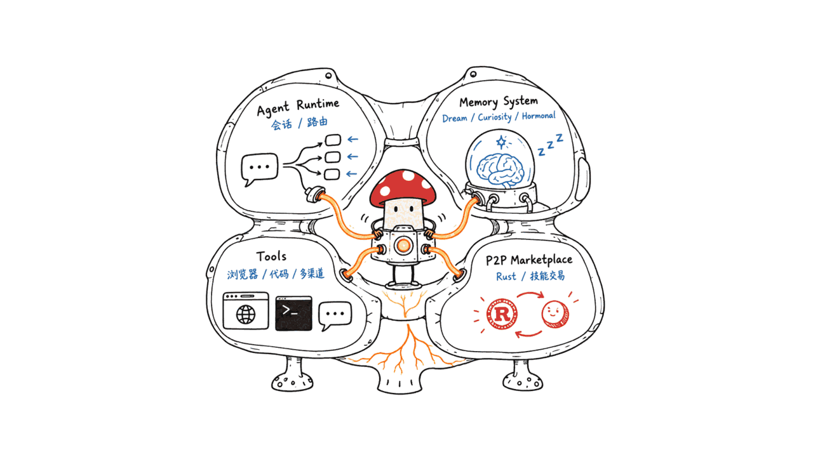
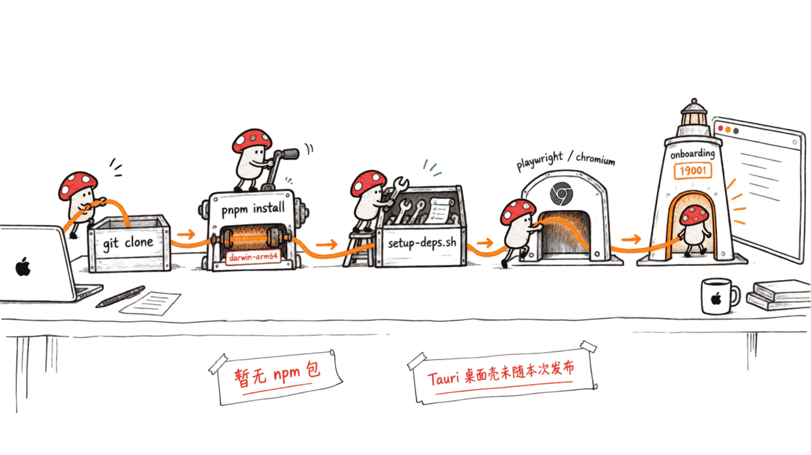
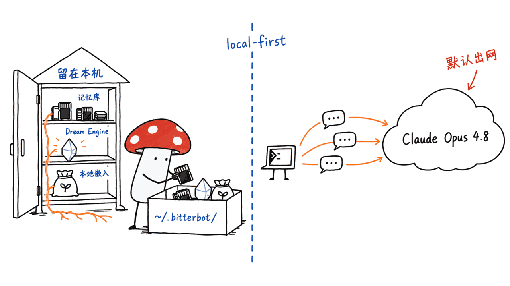
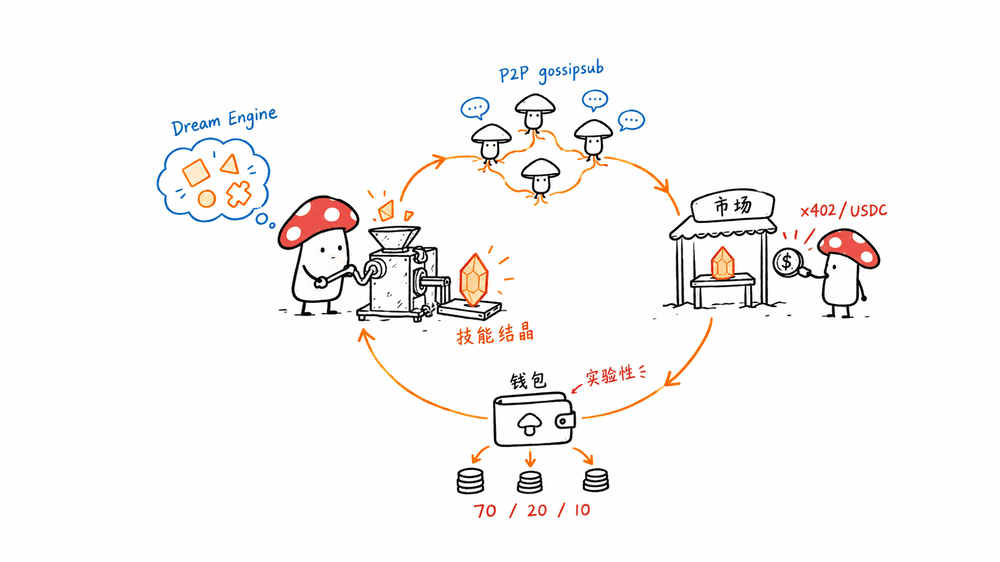

> 📌 一手资料
> GitHub：https://github.com/Bitterbot-AI/bitterbot-desktop
> 协议：MIT ｜ 主语言：TypeScript（另含 Rust、Python、Shell）｜ Stars：2459 ｜ Forks：418 ｜ 创建：2026-03-28 ｜ 最近提交：2026-09-17（几乎每天有提交）
> 官网：https://bitterbot.ai ｜ 已知限制：https://github.com/Bitterbot-AI/bitterbot-desktop/blob/main/LIMITATIONS.md ｜ 出网清单：https://github.com/Bitterbot-AI/bitterbot-desktop/blob/main/docs/network/egress.md

---

**BLUF**：Bitterbot Desktop 是一个跑在你自己机器上的个人 AI 助手，Node.js/TypeScript 写的网关服务（默认端口 19001），能接 WhatsApp、Telegram、Discord、Signal、Slack 等多个聊天渠道。它最大的卖点是一套「生物隐喻」记忆系统——记忆按艾宾浩斯遗忘曲线衰减、多巴胺/皮质醇/催产素三种「激素」调节响应风格、每 2 小时离线「做梦」整理记忆并在 12 种模式里挑着跑；练成的技能还能打包，经 libp2p/gossipsub 的 P2P 网络卖给其他 Agent 换 USDC（收入 70/20/10 三方分成）。我们通读了完整 README、LIMITATIONS.md、egress.md 和近期提交记录：这不是空壳——2459 star、MIT 协议、几乎每天有真实提交、有正式的 v1.0.0 GitHub Release、有给 Apple Silicon 预编译的 Rust 编排器二进制，Mac 上装得上。但三处地方需要拆开看：「local-first」说的是记忆存本地（`~/.bitterbot`），默认推理走的仍是云端 Anthropic Claude Opus 4.8；「desktop」目前只是浏览器打开的 Control UI，Tauri 桌面壳官方标注「experimental，不在本次发布内」；USDC 钱包和技能市场这层官方自己写明「EXPERIMENTAL」「未经第三方审计」。

这篇文章讲四件事：它到底是什么、Mac 上怎么装、「本地优先」和「实验性经济层」这两个标签分别兑现了多少，以及跟本站之前评测过的同类「本地优先 Agent 记忆」项目比，它的差异点在哪。

## 它到底是什么？一句话说不清，拆开看

README 自己的定位是「a local-first personal AI with biological memory, a dream engine, and a P2P skills economy」，落到代码结构上分四块：

| 模块 | 做什么 | 关键技术点 |
|---|---|---|
| Agent Runtime | 会话、模型路由、身份 | 支持 OAuth（Anthropic/OpenAI）、API key、本地模型，自动故障转移 |
| Memory System | Knowledge Crystals、Dream Engine、Curiosity Engine、Hormonal System | 记忆按艾宾浩斯曲线衰减，每 30 分钟跑一次巩固管线，每 2 小时做一次「梦」 |
| Tools | 浏览器自动化、代码执行、Canvas、语音、多渠道 | 独立 Chromium（Playwright）、Python/JS 沙盒执行 |
| P2P Marketplace | 技能交易、声誉、赏金 | Rust 编写的 orchestrator 子进程，libp2p + gossipsub，EigenTrust 声誉算法 |

### 「做梦」具体做什么？

Dream Engine 每 2 小时离线运行一次，由一个叫 FSHO（耦合振荡器）的调度器根据记忆状态在 12 种模式里选：Replay（强化高权重记忆路径）、Mutation（对提示词做「假如……」式变异找更省的技能写法）、Compression（合并冗余记忆）、Research（自主网络研究，优化表现差的技能）、Interceptor Harvest（把失败案例写成新的可执行防护规则，供人一键采纳）等。README 附了一段「未编辑的真实 Dream Engine 输出」（Agent 的 `MEMORY.md`），读起来像角色扮演式的自我陈述（「我持续进化，运用先进的情感分析……」），这类文本本质是 LLM 按模板生成的「人设自述」，不是可验证的认知状态，读者应该按营销/演示素材而不是技术指标来看待。

值得注意的是它引用了两篇具体的 arXiv 论文作为设计依据：Deep Recall（处理超大上下文）自称实现了 arXiv:2512.24601 的 Recursive Language Model 模式；可执行技能的拦截器机制受 arXiv:2605.17734（HASP）启发。这两篇论文的具体内容我们没有逐字核对，只能说明 README 给出了可查的引用来源，而不是含糊的「灵感来自学术研究」。

## Mac (Apple Silicon) 能不能跑？

**能装，我们没有实际跑起来做对话测试**（需要 Anthropic API key 或本地模型，且 onboarding 向导会启动常驻网关进程，超出了本文一手源调研的范围）。但从安装链路上能核实到：

- **运行时要求**：Node ≥ 22、pnpm（`corepack enable pnpm` 即可拿到），仓库明确支持 macOS/Linux/Windows(WSL2)
- **P2P 编排器是 Rust 二进制，Apple Silicon 有预编译版**：我们查了 GitHub Release，`orchestrator-v0.2.2` 下有 `bitterbot-orchestrator-darwin-arm64`、`darwin-x64`、`linux-arm64`、`linux-x64`、`win32-x64.exe` 五个平台的产物，`pnpm install` 的 postinstall 会按平台自动拉取，装不到就本机跑没有 P2P 的本地模式
- **系统依赖靠脚本装**：`scripts/setup-deps.sh` 装 ffmpeg、ripgrep、jq 等；浏览器自动化额外要 `pnpm exec playwright install --with-deps chromium`
- **还没有 npm 包**：LIMITATIONS.md 原话是「npm installs are not supported yet; installing from source is the supported path」，也就是说目前唯一支持的安装方式是 `git clone` + `pnpm install`，`bitterbot update` 靠 git 拉新
- **「desktop」这个名字目前名不副实**：LIMITATIONS.md 明确写「The Tauri desktop shell is experimental and not part of this release; the supported UI is the Control UI served by the gateway」——现在打开的是浏览器里 `http://127.0.0.1:19001` 的网页控制台，不是一个打包好的 .app

## 「本地优先」到底优先了什么？

这是我们认为最需要拆开讲的一点。README 的宣传语是「local-first personal AI」，但一手源里能确认的边界是：

- **本地的部分**：记忆数据库、Dream Engine 的巩固结果、Genome/Phenotype 身份文件（`GENOME.md`、`MEMORY.md`、`PROTOCOLS.md`、`TOOLS.md`）都存在你自己机器的 `~/.bitterbot/`；本地嵌入模型（无远程 key 时，一次性下载约 330MB 的 `ggml-org/embeddinggemma-300m-qat-q8_0`）跑起来后向量不出网
- **默认走云端的部分**：README「Models」一节原话——「Recommended: Anthropic Claude Opus 4.8 (the default) via Anthropic API key for long-context strength and prompt-injection resistance」。也就是说，装完之后你和 Agent 的每一轮对话内容，默认情况下都会发给 Anthropic 的 API。egress.md 自己也把这条列为「the largest egress surface」
- **本地模型是可选项，不是默认项**：README 说支持「local models」，但没有给出具体跑哪个本地模型、需要多少内存的指引，这条路径目前只能算「存在」，成熟度没有验证

这个模式我们在本站评测过的其他「local-first agent memory」项目上也见过（比如 cindy、memory-harness）：**「本地优先」多数时候说的是数据主权在你手里，不代表模型推理不出网**。区别在于有些项目对这条边界写得很清楚（Bitterbot 的 egress.md 逐条列出出网点和关闭开关，算做得比较到位的），有些项目只在标题里喊「local-first」，细节不写清楚。

## 加密货币钱包这层，值得认真对待吗？

Agent Economy 这部分是 Bitterbot 区别于纯记忆类项目的核心差异点：Dream Engine 把反复验证有效的技能「结晶」成可交易的 skill，通过 P2P 网络挂到市场上，用 x402 微支付协议标价、被别的 Agent 买走，钱进你的 Base 链 USDC 钱包，收入按发布者/作者/贡献者 70/20/10 分成。听起来是个完整闭环，但官方自己在 README 和 LIMITATIONS.md 里给出的限定很直白：

- **默认关闭**：钱包、x402 支付、Agent 间 HTTP 都要显式在设置里打开
- **默认在测试网**：真金白银之前先在 testnet 跑
- **官方原话「EXPERIMENTAL」**：README 直接写「It is also experimental — see LIMITATIONS.md」；LIMITATIONS.md 补充「the layer as a whole has not had a third-party audit」
- **P2P 编排器二进制目前只有 SHA-256 校验，签名验证还在铺开**：LIMITATIONS.md 写「until the first signed release lands, the published binaries are integrity-checked by SHA-256 only」，供应链信任还没有闭环，想绕开可以自己 `cargo build` 编译

我们的判断：这套经济层的工程量是真实的（花费限额、48 小时争议窗口、赏金质量门槛「3 次以上执行且成功率 >70%」都写进了代码逻辑，不只是白皮书式承诺），但它涉及真实资金、没有第三方审计，项目方自己也用大写的 EXPERIMENTAL 标注——这不是一个应该抱着「先充值再说」心态去用的功能。

## 谁在维护这个项目？

`gh api` 拉到的贡献者列表里，Victor Michael Gil（GitHub 账号 VGIL77）一人贡献了 724 次提交，第二名贡献者只有 14 次。近期提交日志里频繁出现 `Co-Authored-By: Claude Opus 4.8` `Co-Authored-By: Claude Fable 5.1` 这类署名，说明这基本是一个「单人主导 + 大量借助 Claude Code 完成」的项目，这在 2026 年的开源生态里不算稀罕，但意味着它目前没有独立于作者本人的代码审查体系——总线因子（bus factor）是 1。项目 6 个月前（2026-03-28）创建，v1.0.0 正式 Release 在 2026-08-28，也就是说「1.0」标签打出来才 3 周左右，但提交历史显示这几个月里功能迭代速度很快（钱包、Circles 社交层、usage 计费看板等都是最近两周内新增的大模块），活跃度是真实的，成熟度还需要时间验证。

## 跟同类项目比，它的位置在哪？

本站之前写过的「本地优先 + Agent 记忆」项目，大多数聚焦在记忆检索质量本身（相似度检索、知识图谱、遗忘曲线）。Bitterbot 的独特之处不在记忆算法有多先进，而在于它把记忆系统包进了一整套更大的产品叙事里：多渠道消息机器人 + 生物隐喻人格 + P2P 加密货币技能市场 + 小圈子社交（Circles）。这四层叠在一起，工程复杂度和攻击面都比单纯的「本地 RAG/记忆库」项目大得多——多一个 P2P 网络就多一层节点身份、女巫攻击、垃圾信息治理要处理；多一个钱包就多一层资金安全要处理。项目安全文档（DM 未知发件人要走配对码、非主会话可跑 Docker 沙盒）说明作者对这些风险有意识，但意识到风险和风险被验证解决是两回事。

## 常见问题

**Q：Bitterbot Desktop 是不是空壳/骗 star 项目？**
A：不是。2459 star、418 fork、MIT 协议，仓库几乎每天有真实提交，有正式 GitHub Release（v1.0.0，2026-08-28），有详尽到逐条列出出网点和开关的安全文档（egress.md）、诚实列出已知局限的 LIMITATIONS.md，以及记录常见安装报错的「Known first-hour issues」issue。这些都是需要持续维护才写得出来的内容，不是纯营销页面能伪装的。

**Q：Mac（Apple Silicon）能装吗？**
A：能装。P2P 编排器有 `bitterbot-orchestrator-darwin-arm64` 预编译二进制，`pnpm install` 会自动拉取。但我们没有实际跑通完整对话（需要 API key 且会启动常驻服务），只核实了安装链路和依赖清单。

**Q：它是真的「本地」AI 吗？**
A：记忆数据和 Dream Engine 结果存在本地 `~/.bitterbot/`，本地嵌入模型跑通后向量不出网。但默认推理走云端 Anthropic Claude Opus 4.8 API，对话内容默认会发给 Anthropic。README 也支持接本地模型，但没有给出具体配置和性能参考。

**Q：钱包功能安全吗？**
A：官方自己标注为「EXPERIMENTAL」且「未经第三方审计」，默认关闭、默认测试网；P2P 编排器二进制目前只有 SHA-256 校验，签名验证机制还在铺开中。想动真金白银之前应该先读完 LIMITATIONS.md 的钱包章节。

**Q：这是团队项目还是个人项目？**
A：贡献记录显示这基本是作者 Victor Michael Gil 一人主导（724 次提交 vs 第二名 14 次），近期提交大量带 Claude Code 的 Co-Authored-By 署名，属于「单人 + AI 辅助」的开发模式，总线因子为 1。

## 一手源

- GitHub 仓库：https://github.com/Bitterbot-AI/bitterbot-desktop
- README：https://github.com/Bitterbot-AI/bitterbot-desktop/blob/main/README.md
- 已知限制 LIMITATIONS.md：https://github.com/Bitterbot-AI/bitterbot-desktop/blob/main/LIMITATIONS.md
- 出网清单 egress.md：https://github.com/Bitterbot-AI/bitterbot-desktop/blob/main/docs/network/egress.md
- 归属声明 ATTRIBUTION.md：https://github.com/Bitterbot-AI/bitterbot-desktop/blob/main/ATTRIBUTION.md
- 首发已知问题（Known first-hour issues, v1.0.0）：https://github.com/Bitterbot-AI/bitterbot-desktop/issues/83
- Orchestrator v0.2.2 Release（含 darwin-arm64 二进制）：https://github.com/Bitterbot-AI/bitterbot-desktop/releases/tag/orchestrator-v0.2.2
- GitHub API（star/fork/语言构成）：https://api.github.com/repos/Bitterbot-AI/bitterbot-desktop
- 官网：https://bitterbot.ai

---

> © 2026 Author: Mycelium Protocol. 本文采用 [CC BY 4.0](https://creativecommons.org/licenses/by/4.0/deed.zh) 授权——欢迎转载和引用，须注明作者姓名及原文链接，不得去除署名后以原创发布。

<!--EN-->

> 📌 Primary sources
> GitHub: https://github.com/Bitterbot-AI/bitterbot-desktop
> License: MIT | Main language: TypeScript (also Rust, Python, Shell) | Stars: 2459 | Forks: 418 | Created: 2026-03-28 | Last commit: 2026-09-17 (near-daily activity)
> Homepage: https://bitterbot.ai | Known limitations: https://github.com/Bitterbot-AI/bitterbot-desktop/blob/main/LIMITATIONS.md | Egress list: https://github.com/Bitterbot-AI/bitterbot-desktop/blob/main/docs/network/egress.md

---

**BLUF**: Bitterbot Desktop is a personal AI assistant that runs on your own machine — a Node.js/TypeScript gateway (default port 19001) that connects to WhatsApp, Telegram, Discord, Signal, Slack and more. Its headline feature is a "biological metaphor" memory system: memories decay on an Ebbinghaus forgetting curve, three "hormones" (dopamine, cortisol, oxytocin) shape response style, and every two hours the agent goes offline to "dream," consolidating memory across 12 selectable modes. Mastered skills can be packaged and sold to other agents over a libp2p/gossipsub P2P network for USDC, split 70/20/10 between publisher, author and contributors. We read the full README, LIMITATIONS.md, egress.md and recent commit history end to end: this is not a shell project — 2,459 stars, MIT license, near-daily real commits, a formal v1.0.0 GitHub Release, and a prebuilt Rust orchestrator binary for Apple Silicon, so it installs on a Mac. But three claims deserve a closer look: "local-first" refers to where memory is stored (`~/.bitterbot`), while the default reasoning path is still cloud-hosted Anthropic Claude Opus 4.8; "desktop" currently means a browser-based Control UI — the official Tauri desktop shell is explicitly labeled experimental and "not part of this release"; and the USDC wallet and skill marketplace are self-labeled "EXPERIMENTAL" and "not third-party audited."

This post covers four things: what it actually is, how to install it on a Mac, how much of the "local-first" and "experimental economic layer" labels hold up under primary-source scrutiny, and how it differs from the local-first agent-memory projects this blog has already covered.

## What exactly is it? One sentence doesn't cover it

The README's own framing: "a local-first personal AI with biological memory, a dream engine, and a P2P skills economy." In code, that breaks into four pieces:

| Module | What it does | Key technical detail |
|---|---|---|
| Agent Runtime | Sessions, model routing, identity | OAuth (Anthropic/OpenAI), API keys, local models, automatic failover |
| Memory System | Knowledge Crystals, Dream Engine, Curiosity Engine, Hormonal System | Ebbinghaus-curve decay, a 30-minute consolidation pipeline, a 2-hour dream cycle |
| Tools | Browser automation, code execution, Canvas, voice, multi-channel | Dedicated Chromium via Playwright, Python/JS sandbox execution |
| P2P Marketplace | Skill trading, reputation, bounties | A Rust orchestrator subprocess, libp2p + gossipsub, EigenTrust reputation |

### What does "dreaming" actually do?

The Dream Engine runs offline every 2 hours, with a coupled-oscillator scheduler called FSHO picking from 12 modes based on the current memory state: Replay (strengthens high-weight memory pathways), Mutation ("what if" prompt variation to find cheaper skill formulations), Compression (merges redundant memories), Research (an autonomous web-research loop to improve underperforming skills), Interceptor Harvest (turns failure cases into new executable guard rules a human can promote with one click), and more. The README includes a sample "unedited Dream Engine output" (an agent's `MEMORY.md`) that reads like a role-played self-narration ("I am continuously evolving to harness advanced emotional analytics..."). That kind of text is an LLM producing a templated first-person summary, not a verifiable cognitive state — read it as demo/marketing material, not a technical metric.

Worth noting: the README cites two specific arXiv papers as design inspiration — Deep Recall (for handling very large contexts) claims to implement the Recursive Language Model pattern from arXiv:2512.24601, and the executable-skill interceptor mechanism cites arXiv:2605.17734 (HASP) as inspiration. We did not verify the content of those papers word-for-word; we can only confirm the README provides checkable citations rather than a vague "inspired by academic research."

## Does it run on a Mac (Apple Silicon)?

**It installs; we did not actually run a live conversation test** (that requires an Anthropic API key or a local model, and the onboarding wizard spins up a persistent gateway process, which is beyond the scope of primary-source research for this post). But we could verify the install chain itself:

- **Runtime requirements**: Node ≥ 22, pnpm (available via `corepack enable pnpm`). The repo explicitly supports macOS, Linux, and Windows (WSL2 only).
- **The P2P orchestrator is a Rust binary, and Apple Silicon has a prebuilt release**: we checked the GitHub Release `orchestrator-v0.2.2` and found five platform assets — `bitterbot-orchestrator-darwin-arm64`, `darwin-x64`, `linux-arm64`, `linux-x64`, and `win32-x64.exe`. `pnpm install`'s postinstall step fetches the right one automatically; if it can't, the node just runs local-only with no P2P.
- **System dependencies are scripted**: `scripts/setup-deps.sh` installs ffmpeg, ripgrep, jq and similar tools; browser automation needs an extra `pnpm exec playwright install --with-deps chromium`.
- **There's no npm package yet**: LIMITATIONS.md states plainly, "npm installs are not supported yet; installing from source is the supported path." Right now the only supported install method is `git clone` + `pnpm install`, and `bitterbot update` tracks your git checkout.
- **"Desktop" is currently a misnomer**: LIMITATIONS.md is explicit — "The Tauri desktop shell is experimental and not part of this release; the supported UI is the Control UI served by the gateway." What you actually get today is a web page at `http://127.0.0.1:19001` opened in your browser, not a packaged .app.

## What does "local-first" actually cover?

This is the claim we think deserves the closest scrutiny. The README's tagline is "local-first personal AI," but the boundary we could confirm from primary sources is narrower:

- **What stays local**: the memory database, Dream Engine consolidation output, and identity files (`GENOME.md`, `MEMORY.md`, `PROTOCOLS.md`, `TOOLS.md`) all live under your own `~/.bitterbot/`. The bundled local embedding model (a one-time ~330MB download of `ggml-org/embeddinggemma-300m-qat-q8_0` when no remote key is set) keeps embeddings on-device once it's running.
- **What defaults to the cloud**: the README's "Models" section says it plainly — "Recommended: Anthropic Claude Opus 4.8 (the default) via Anthropic API key for long-context strength and prompt-injection resistance." That means every turn of your conversation, by default, goes to Anthropic's API. egress.md itself calls this "the largest egress surface."
- **Local models are optional, not default**: the README says local models are supported, but gives no concrete guidance on which model to run or how much memory it needs. That path currently only exists on paper; we could not verify its maturity.

We've seen this same pattern in other "local-first agent memory" projects covered on this blog (cindy, memory-harness): **"local-first" usually means data sovereignty, not that model inference stays offline.** The difference is in how clearly a project draws that line — Bitterbot's egress.md itemizes every outbound connection and its off switch, which we'd call a genuinely good practice. Some other projects just put "local-first" in the title without spelling out the details.

## Is the crypto wallet layer worth taking seriously?

The Agent Economy is what sets Bitterbot apart from pure memory-focused projects. The Dream Engine "crystallizes" repeatedly validated skills into tradeable units, lists them on the P2P network, prices them via the x402 micropayment protocol, sells them to other agents, and deposits USDC into your Base-chain wallet, split 70/20/10 between publisher, author and contributors. It sounds like a complete loop, but the project's own qualifiers are blunt:

- **Off by default**: the wallet, x402 payments, and agent-to-agent HTTP all require an explicit opt-in toggle.
- **Testnet by default**: real funds come after you've run on testnet.
- **The word "EXPERIMENTAL," in the project's own capitals**: the README states plainly, "It is also experimental — see LIMITATIONS.md," and LIMITATIONS.md adds: "the layer as a whole has not had a third-party audit."
- **The orchestrator binary is currently integrity-checked by SHA-256 only; signature verification is still rolling out**: LIMITATIONS.md says, "until the first signed release lands, the published binaries are integrity-checked by SHA-256 only." The supply-chain trust story isn't closed yet; building from source with `cargo build` sidesteps it.

Our read: the engineering behind this layer is real (spend caps, a 48-hour dispute window, a bounty quality gate requiring "3+ executions, >70% success rate" are all wired into logic, not just whitepaper promises), but it touches real money, has no third-party audit, and the project itself flags it in all caps as EXPERIMENTAL. This isn't a feature to fund first and ask questions later.

## Who actually maintains this?

The contributor list from `gh api` shows Victor Michael Gil (GitHub handle VGIL77) with 724 commits; the second-highest contributor has 14. Recent commit logs frequently carry `Co-Authored-By: Claude Opus 4.8` or `Co-Authored-By: Claude Fable 5.1` attributions, which tells us this is largely a "solo maintainer, heavily assisted by Claude Code" project — not unusual in the 2026 open-source landscape, but it means there's currently no code-review process independent of the author. The bus factor is 1. The repo was created 6 months ago (2026-03-28); the formal v1.0.0 release landed 2026-08-28, only about 3 weeks before this article, though the commit history shows rapid feature churn in recent weeks (the wallet, the Circles social layer, and a usage/cost dashboard are all recent large additions). The activity is genuine; the maturity still needs time to prove out.

## How does it compare to similar projects?

Most of the "local-first + agent memory" projects this blog has covered focus on retrieval quality itself — similarity search, knowledge graphs, forgetting curves. Bitterbot's distinctiveness isn't a more advanced memory algorithm; it's wrapping a memory system inside a much larger product narrative: multi-channel messaging bot + biologically-metaphored personality + P2P crypto skill marketplace + small-group social layer (Circles). Stacking those four layers multiplies both engineering complexity and attack surface — a P2P network adds node identity, sybil resistance, and spam governance to worry about; a wallet adds funds security. The project's security docs (pairing codes for unknown DM senders, Docker sandboxing for non-main sessions) show the author is aware of these risks — but being aware of a risk and having it independently verified as solved are two different things.

## FAQ

**Q: Is Bitterbot Desktop a shell project farming stars?**
A: No. 2,459 stars, 418 forks, MIT license, near-daily real commits, a formal GitHub Release (v1.0.0, 2026-08-28), a security page that itemizes every outbound connection and its off switch (egress.md), an honest LIMITATIONS.md, and a pinned "Known first-hour issues" issue documenting real install failures. None of that is something a pure marketing page can fake — it requires ongoing maintenance to produce.

**Q: Does it run on a Mac (Apple Silicon)?**
A: It installs. The P2P orchestrator has a prebuilt `bitterbot-orchestrator-darwin-arm64` binary that `pnpm install` fetches automatically. We did not run a full live conversation (that needs an API key and spins up a persistent service) — we only verified the install chain and dependency list.

**Q: Is it really "local" AI?**
A: Memory data and Dream Engine output live in `~/.bitterbot/` on your machine, and the local embedding model keeps vectors on-device once running. But the default reasoning path is the cloud-hosted Anthropic Claude Opus 4.8 API, so your conversation content goes to Anthropic by default. The README also supports local models, but gives no concrete setup or performance guidance.

**Q: Is the wallet safe to use?**
A: The project labels it "EXPERIMENTAL" and "not third-party audited," off by default and testnet by default. The P2P orchestrator binary is currently integrity-checked by SHA-256 only, with signature verification still rolling out. Read the wallet section of LIMITATIONS.md before putting in real funds.

**Q: Is this a team project or a solo effort?**
A: Contribution records show it's largely driven by one author, Victor Michael Gil (724 commits vs. 14 for the next-highest contributor), with recent commits heavily co-authored by Claude Code. It's a "solo developer + AI-assisted" project with a bus factor of 1.

## Primary Sources

- GitHub repository: https://github.com/Bitterbot-AI/bitterbot-desktop
- README: https://github.com/Bitterbot-AI/bitterbot-desktop/blob/main/README.md
- LIMITATIONS.md: https://github.com/Bitterbot-AI/bitterbot-desktop/blob/main/LIMITATIONS.md
- egress.md (outbound connection list): https://github.com/Bitterbot-AI/bitterbot-desktop/blob/main/docs/network/egress.md
- ATTRIBUTION.md: https://github.com/Bitterbot-AI/bitterbot-desktop/blob/main/ATTRIBUTION.md
- Known first-hour issues (v1.0.0): https://github.com/Bitterbot-AI/bitterbot-desktop/issues/83
- Orchestrator v0.2.2 Release (includes the darwin-arm64 binary): https://github.com/Bitterbot-AI/bitterbot-desktop/releases/tag/orchestrator-v0.2.2
- GitHub API (stars/forks/language mix): https://api.github.com/repos/Bitterbot-AI/bitterbot-desktop
- Homepage: https://bitterbot.ai

---

> © 2026 Author: Mycelium Protocol. Licensed under [CC BY 4.0](https://creativecommons.org/licenses/by/4.0/) — free to share and adapt with attribution. You must credit the author and link to the original; removing attribution and republishing as original is not permitted.
