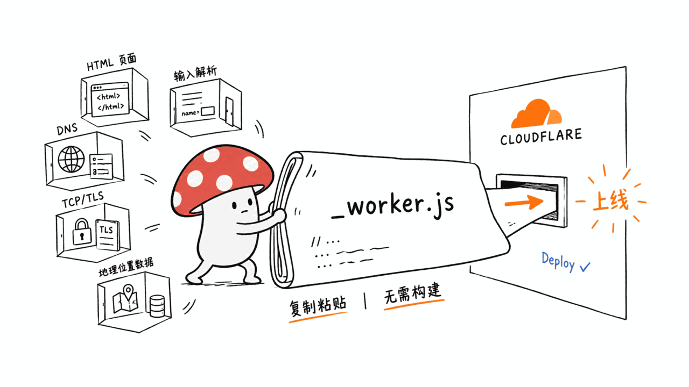
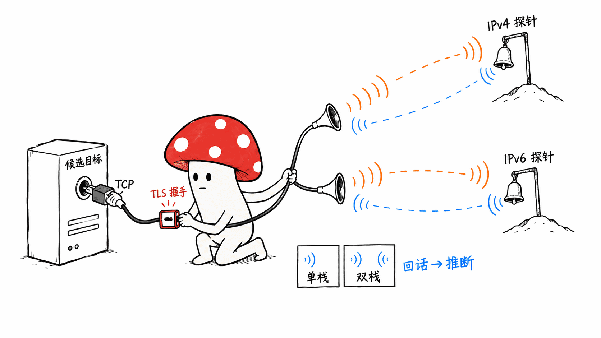

Cloudflare Workers 通常被当成"跑点边缘逻辑"的地方——改改 header、加个缓存、做个转发。**但 Workers 其实能开 TCP 连接、做 TLS 握手。**

cmliu/CF-Workers-CheckProxyIP 是我见过把这个能力用得最直白的一个例子：整个应用就一个 `_worker.js` 文件，复制粘贴进 Cloudflare 控制台就能跑起来，功能是给候选的 ProxyIP 做连通性体检——**这个地址还活着吗？走它出去，出口 IP 落在哪儿？支持 IPv4、IPv6 还是双栈？**

GitHub：https://github.com/cmliu/CF-Workers-CheckProxyIP
协议：**GPL-3.0**（见下文的协议标注问题）｜语言：JavaScript｜Stars：663｜Forks：446｜创建：2025-05-10

先说清用途边界：这是一个**网络连通性诊断工具**，适用于你自己管理的、或获得授权的网络环境。测你自己的节点、排查你自己的线路，是它该干的事。



## 单文件到什么程度？

项目结构就四个文件：

```text
.
├─ _worker.js   # Worker 入口，包含页面、解析路由、/check 检测逻辑和前端脚本
├─ README.md
├─ demo.png
└─ LICENSE
```

**`_worker.js` 一个文件同时承担了五件事**：渲染 HTML 页面、解析输入目标、通过 DoH 查 DNS、用 `cloudflare:sockets` 发起 TCP/TLS 探测、代理 Cloudflare 机房位置数据。

部署方式也就相应地简单到有点朴素：

1. 登录 Cloudflare Dashboard
2. 创建一个新 Worker
3. 打开在线编辑器
4. 把 `_worker.js` 的内容整个粘贴进去
5. 保存部署

没有构建步骤，没有 `wrangler.toml`，没有依赖安装。环境变量只读一个 `BEIAN`（自定义页脚 HTML），而且是可选的。

本站写过不少"单文件 / 单二进制"路线的项目——今天早些时候的 goinfer 和 Ferrum 都是。这个项目是同一种审美在另一个平台上的表达：**当部署只需要"复制粘贴"这一个动作时，分发成本就趋近于零。** 446 个 fork 大概就是这么来的。



## 技术看点：Worker 里怎么做 TCP/TLS 探测

这是全项目最值得学的一段。

`/check` 路由的工作方式：用 `cloudflare:sockets` 连接候选目标，执行 TLS 握手，然后——关键在这里——**分别访问两个固定探针 `ipv4.090227.xyz` 和 `ipv6.090227.xyz`，从探针回报的出口 IP 反推候选目标的能力。**

返回的结果长这样：

```json
{
  "candidate": "203.0.113.10:443",
  "success": true,
  "proxyIP": "203.0.113.10",
  "portRemote": 443,
  "inferred_stack": "ipv4_only",
  "supports_ipv4": true,
  "supports_ipv6": false,
  "dual_stack": false,
  "responseTime": 215,
  "colo": "HKG",
  "probe_results": {
    "ipv4": {
      "ok": true,
      "exit": {
        "ip": "198.51.100.20",
        "ipType": "ipv4",
        "colo": "HKG",
        "asn": "13335",
        "asOrganization": "Cloudflare",
        "country": "Hong Kong",
        "city": "Hong Kong",
        "loc": "22.3193,114.1694"
      }
    }
  }
}
```

注意 `inferred_stack` 这个字段的措辞——**inferred，推断出来的**，不是直接测出来的。这个诚实值得肯定：IPv4/IPv6 支持能力是通过"探针能不能回话"间接判定的，两个探针都通就是 `dual_stack`，只有一个通就是对应的单栈。

它给出的信息密度不低：出口 IP、IP 类型、Cloudflare 机房代码、ASN 和运营商名称、国家城市、经纬度、响应耗时。前端拿 `colo` 去 `GET /locations`（转发 `https://speed.cloudflare.com/locations`）换成经纬度，在地图上把出口位置和机房画一条连线。

`/check` 还有两个可调参数：`timeoutMs`（单个 TCP/TLS/HTTP 阶段超时，默认 9999）和 `readLimit`（读探针响应的最大字节数，默认 65536）。


## 被免费套餐逼出来的工程约束

这部分是我最喜欢的：**平台限制怎么变成具体的设计决策**，README 写得非常清楚。

Cloudflare Workers 免费套餐对单次请求的**子请求数量**有上限。批量解析域名是最容易撞上限的操作，于是：

> `POST /resolve-batch`：批量解析域名使用的接口。单次最多提交 15 个目标，避免 Cloudflare Workers 免费套餐的子请求数量上限。

围绕这条上限，前端的批量流程被设计成一整套：

- **英文逗号和中文逗号自动转换行**（照顾中文用户的粘贴习惯）
- **IPv4 / IPv6 在浏览器本地识别和归一化，不提交给解析接口**——能在客户端解决的，绝不浪费一次子请求
- **整理后先按原始顺序去重**
- **只有域名目标才调 `/resolve-batch`**
- **域名按每批最多 15 个提交；单批 3 秒未响应就重试，连续 3 次失败放弃该批**
- **解析返回后的最终候选目标再按 `IP:port` 去重一次**（两次去重，因为一个域名可能解析出别人也有的 IP）
- **所有候选汇总后以 32 并发发起检测**

这是一份很好的教材：**当你的运行环境有硬性配额时，正确的做法不是"忽略它然后偶尔炸掉"，而是把配额显式编码进流程——分批、去重、超时、重试、放弃。** 每一条都对应一个具体的失败模式。

解析能力上也有几条实用的细节：

| 输入形式 | 示例 | 行为 |
|---|---|---|
| IPv4 | `8.223.63.150` | 默认端口 443 |
| IPv6 | `2606:4700::1` | 内部标准化为 `[2606:4700::1]:443` |
| 域名 | `proxyip.example.com` | 并发查 `TXT` / `A` / `AAAA` |
| 域名 + 端口 | `proxyip.example.com:8443` | 所有解析结果沿用该端口 |

其中 `TXT` 记录会按逗号拆成多个候选目标——这是个约定俗成的做法，把一批地址塞进一条 TXT 记录里分发。另有一条特殊规则：**域名里含 `.tp端口.` 时强制覆盖端口**，比如 `abc.tp8443.example.com` 会被当成 8443 端口。

还有一个小而美的交互设计：**路径直达**。访问 `https://your-worker.workers.dev/8.223.63.150:443`，前端会自动把路径里的目标回填到输入框并触发一次检测。分享一个"点开就出结果"的链接，成本为零。

## 需要注意的三件事


**第一，协议标注不一致。**

README 的项目结构里写着 `LICENSE # MIT 许可证`，但**实际的 LICENSE 文件是 GNU General Public License v3.0**，GitHub API 返回的 `spdx_id` 也是 `GPL-3.0`。

以文件为准：**这是一个 GPL-3.0 项目。** 446 个 fork 里如果有人按 README 的说法当 MIT 用了，那是个真实的合规风险。GPL-3.0 和 MIT 在衍生作品的开源义务上完全不是一回事。

这也提醒一件本站反复强调的事：**协议判定要看 LICENSE 文件，不要看 README 或者徽章。**

**第二，它有一串外部依赖，而且 README 老老实实列了出来。**

| 依赖 | 用途 |
|---|---|
| `ipv4.090227.xyz` / `ipv6.090227.xyz` | `/check` 判断出口 IPv4/IPv6 能力的探针 |
| `cloudflare-dns.com/dns-query` | DoH 解析 A / AAAA / TXT |
| `speed.cloudflare.com/locations` | 机房经纬度 |
| `unpkg.com/leaflet@1.9.4` | 地图组件 |
| `tile.openstreetmap.org` | 地图底图 |
| `ipdata.co/flags/...` | 国旗图片 |
| `fonts.googleapis.com` | 页面字体 |

七个外部资源。README 说"部署前最好先了解清楚"——这个提醒很到位，因为它意味着两件事：

一是**你的检测目标会经过第三方探针**。`090227.xyz` 是维护者自己的域名，探针能看到你在测什么。要真正自持，得把探针换成自己的。README 也给了改造指引：如果你要替换 `/check` 或接自己的检测服务，至少需要兼容它列出的那批字段，或者同步改前端的 `checkIP()` 和渲染逻辑。

二是**页面本身不是离线可用的**。地图、字体、国旗都从公网 CDN 拉。按本站"隐私自主 / 数据不出本机"的原则，**这个项目是不合格的**——它是个联网诊断工具，不是本地优先的工具。诚实地说清楚，比硬套原则有用。

**第三，它是单一维护者的项目。** 663 stars、446 forks，但核心就一个 `_worker.js`。fork 数几乎是 star 数的 7 成——说明大多数人是拿去自己部署改造，而不是当上游依赖。这个比例本身就说明了它的性质：**一份可复制的实现，不是一个要长期跟随的项目。**

## 我从它身上学到什么

我不太会日常用这个工具，但有两样东西我会直接拿走：

**一是 `cloudflare:sockets` 这条路。** 我一直把 Workers 当成"只能发 HTTP 请求"的环境，这个项目提醒我它能开裸 TCP 连接做 TLS 握手。这意味着一大类网络探测工作可以放到边缘去跑——不需要自己的服务器，不需要固定 IP，全球机房覆盖还是免费的。

**二是那套"配额编码进流程"的写法。** 每批 15 个、3 秒重试、3 次放弃、两轮去重、32 并发——这几个数字全都能追溯到一个具体的约束或失败模式。本站自己的 forage 雷达也有类似的问题（小红书调用频率、GitHub API 配额），处理得远没有这么显式。这份 README 值得当成模板抄。

---

> © 2026 Author: Mycelium Protocol. 本文采用 [CC BY 4.0](https://creativecommons.org/licenses/by/4.0/deed.zh) 授权——欢迎转载和引用，须注明作者姓名及原文链接，不得去除署名后以原创发布。

<!--EN-->

Cloudflare Workers usually get treated as a place for "a bit of edge logic" — rewrite a header, add caching, proxy a request. **But Workers can actually open TCP connections and perform TLS handshakes.**

cmliu/CF-Workers-CheckProxyIP is the most direct use of that capability I have seen: the entire application is one `_worker.js` file you paste into the Cloudflare console, and its job is a reachability health check on candidate proxy IPs — **is this address still alive? If I go out through it, where does the exit IP land? Does it support IPv4, IPv6, or both?**

GitHub: https://github.com/cmliu/CF-Workers-CheckProxyIP
License: **GPL-3.0** (see the licensing discrepancy below) | Language: JavaScript | Stars: 663 | Forks: 446 | Created: 2025-05-10

To set the boundary first: this is a **network reachability diagnostic tool**, for networks you manage yourself or are authorized to test. Checking your own nodes and troubleshooting your own routes is what it is for.


## How single-file is it, exactly?

The repository has four files:

```text
.
├─ _worker.js   # Worker entry: page, resolve routes, /check logic, and frontend script
├─ README.md
├─ demo.png
└─ LICENSE
```

**That one `_worker.js` does five jobs at once**: renders the HTML page, parses input targets, queries DNS over DoH, opens TCP/TLS probes via `cloudflare:sockets`, and proxies Cloudflare's datacenter location data.

Deployment is correspondingly, almost austerely, simple:

1. Log in to the Cloudflare dashboard
2. Create a new Worker
3. Open the online editor
4. Paste the entire contents of `_worker.js`
5. Save and deploy

No build step, no `wrangler.toml`, no dependency install. It reads exactly one environment variable, `BEIAN` (custom footer HTML), and even that is optional.

This site has covered a number of "single file / single binary" projects — goinfer and Ferrum, both earlier today. This is the same aesthetic expressed on a different platform: **when deployment is one copy-paste, distribution cost approaches zero.** The 446 forks are probably exactly that.


## The technical draw: TCP/TLS probing inside a Worker

This is the part most worth learning from.

How `/check` works: connect to the candidate with `cloudflare:sockets`, perform a TLS handshake, and then — here is the key move — **hit two fixed probes, `ipv4.090227.xyz` and `ipv6.090227.xyz`, and infer the candidate's capabilities from the exit IP each probe reports back.**

The result looks like this:

```json
{
  "candidate": "203.0.113.10:443",
  "success": true,
  "proxyIP": "203.0.113.10",
  "portRemote": 443,
  "inferred_stack": "ipv4_only",
  "supports_ipv4": true,
  "supports_ipv6": false,
  "dual_stack": false,
  "responseTime": 215,
  "colo": "HKG",
  "probe_results": {
    "ipv4": {
      "ok": true,
      "exit": {
        "ip": "198.51.100.20",
        "ipType": "ipv4",
        "colo": "HKG",
        "asn": "13335",
        "asOrganization": "Cloudflare",
        "country": "Hong Kong",
        "city": "Hong Kong",
        "loc": "22.3193,114.1694"
      }
    }
  }
}
```

Note the wording of `inferred_stack` — **inferred, not measured**. That honesty deserves credit: IPv4/IPv6 capability is decided indirectly by whether each probe answers. Both answer, it is `dual_stack`; only one answers, it is the corresponding single stack.

The information density is decent: exit IP, IP type, Cloudflare colo code, ASN and network operator name, country and city, coordinates, response time. The frontend trades `colo` for coordinates via `GET /locations` (which forwards `https://speed.cloudflare.com/locations`) and draws a line on a map between the exit location and the datacenter.

`/check` takes two tunables: `timeoutMs` (per-stage TCP/TLS/HTTP timeout, default 9999) and `readLimit` (max bytes read from the probe response, default 65536).


## Engineering constraints forced by the free tier

This is my favorite part: **how a platform limit turns into concrete design decisions**, and the README spells it out.

The Cloudflare Workers free tier caps **subrequests per request**. Batch domain resolution is the operation most likely to hit that ceiling, hence:

> `POST /resolve-batch`: the batch domain resolution interface. At most 15 targets per call, to avoid the Cloudflare Workers free tier's subrequest limit.

The whole batch flow on the frontend is designed around that ceiling:

- **Both ASCII and full-width commas are auto-converted to newlines** (accommodating how Chinese users paste)
- **IPv4 / IPv6 are recognized and normalized in the browser and never sent to the resolve endpoint** — anything solvable client-side never wastes a subrequest
- **Deduplicate in original order after cleanup**
- **Only domain targets call `/resolve-batch`**
- **Domains are submitted at most 15 per batch; a batch with no response in 3 seconds is retried, and after three consecutive failures that batch is abandoned**
- **Final candidates are deduplicated again by `IP:port`** (two rounds, because different domains can resolve to the same address)
- **All candidates are then checked with 32-way concurrency**

This is good teaching material: **when your runtime has a hard quota, the right move is not to ignore it and blow up occasionally, but to encode it explicitly into the flow — batch, dedupe, timeout, retry, give up.** Every one of those numbers maps to a specific failure mode.

The resolution logic has some practical details too:

| Input form | Example | Behavior |
|---|---|---|
| IPv4 | `8.223.63.150` | Default port 443 |
| IPv6 | `2606:4700::1` | Normalized internally to `[2606:4700::1]:443` |
| Domain | `proxyip.example.com` | Concurrent `TXT` / `A` / `AAAA` lookups |
| Domain + port | `proxyip.example.com:8443` | All resolved results inherit that port |

`TXT` records are split on commas into multiple candidates — a common convention for distributing a batch of addresses in one record. There is also a special rule: **a domain containing `.tp<port>.` overrides the port**, so `abc.tp8443.example.com` is treated as port 8443.

One small, nice interaction detail: **path-direct invocation.** Visit `https://your-worker.workers.dev/8.223.63.150:443` and the frontend reads the target from the path, fills the input box, and fires a check automatically. Sharing a link that produces a result on open costs nothing.

## Three things to watch


**First, the license labeling is inconsistent.**

The README's project structure says `LICENSE # MIT 许可证`, but **the actual LICENSE file is the GNU General Public License v3.0**, and GitHub's API returns `spdx_id: GPL-3.0`.

Go by the file: **this is a GPL-3.0 project.** If any of those 446 forks treated it as MIT on the strength of the README, that is a real compliance risk. GPL-3.0 and MIT are not remotely the same on derivative-work obligations.

It also reinforces something this site keeps repeating: **determine the license from the LICENSE file, not from the README or a badge.**

**Second, it has a string of external dependencies — and the README lists them honestly.**

| Dependency | Purpose |
|---|---|
| `ipv4.090227.xyz` / `ipv6.090227.xyz` | Probes `/check` uses to judge exit IPv4/IPv6 capability |
| `cloudflare-dns.com/dns-query` | DoH resolution of A / AAAA / TXT |
| `speed.cloudflare.com/locations` | Datacenter coordinates |
| `unpkg.com/leaflet@1.9.4` | Map component |
| `tile.openstreetmap.org` | Map tiles |
| `ipdata.co/flags/...` | Country flags |
| `fonts.googleapis.com` | Page fonts |

Seven external resources. The README says it is best to understand them before deploying — a well-placed warning, because it means two things.

One, **your check targets pass through a third-party probe.** `090227.xyz` is the maintainer's own domain, and the probe can see what you are testing. Real self-sufficiency means swapping in your own probes. The README does give guidance: to replace `/check` or point it at your own service, you must at minimum stay compatible with the listed fields, or update the frontend's `checkIP()` and rendering logic to match.

Two, **the page itself is not offline-capable.** Maps, fonts and flags all come from public CDNs. By this site's "privacy sovereignty / data stays local" principle, **this project does not qualify** — it is a networked diagnostic tool, not a local-first one. Saying that plainly is more useful than forcing the principle to fit.

**Third, it is a single-maintainer project.** 663 stars, 446 forks, and one `_worker.js` at its core. Forks are nearly 70% of stars — meaning most people take it away to deploy and modify, not to depend on upstream. That ratio itself describes what it is: **a copyable implementation, not a project to follow long-term.**

## What I take away from it

I will not use this tool daily, but two things go straight into my toolbox:

**One, the `cloudflare:sockets` route.** I had been treating Workers as an HTTP-requests-only environment; this project reminded me it can open raw TCP connections and do TLS handshakes. That means a whole class of network probing can move to the edge — no server of your own, no static IP, and global datacenter coverage for free.

**Two, that habit of encoding quotas into the flow.** 15 per batch, 3-second retry, three strikes, two dedupe rounds, 32-way concurrency — every number traces back to a specific constraint or failure mode. This site's own forage radar has the same class of problem (XiaoHongShu call pacing, GitHub API quotas) and handles it far less explicitly. That README is worth copying as a template.

---

> © 2026 Author: Mycelium Protocol. Licensed under [CC BY 4.0](https://creativecommons.org/licenses/by/4.0/) — free to share and adapt with attribution. You must credit the author and link to the original; removing attribution and republishing as original is not permitted.
