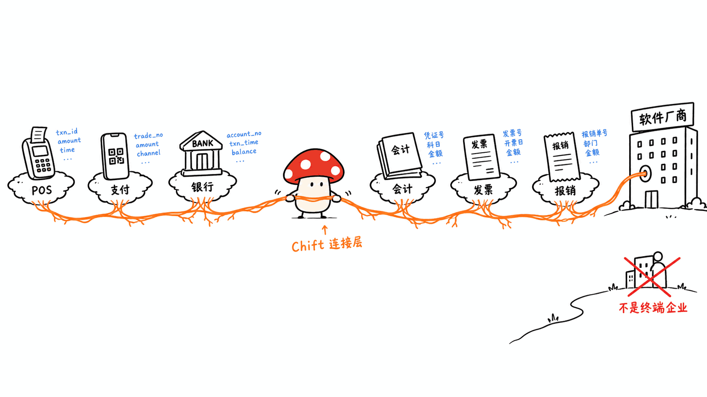
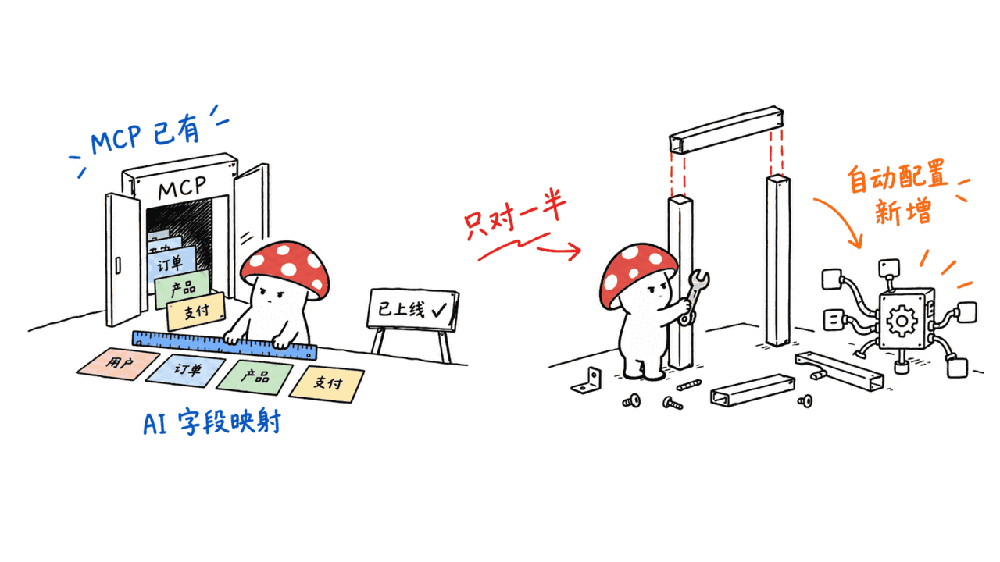
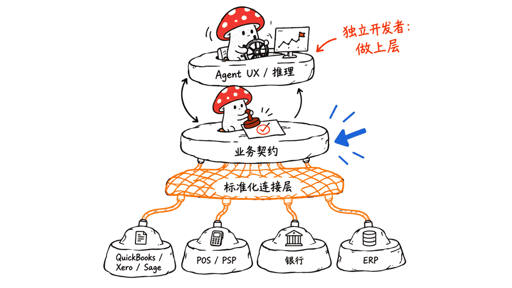
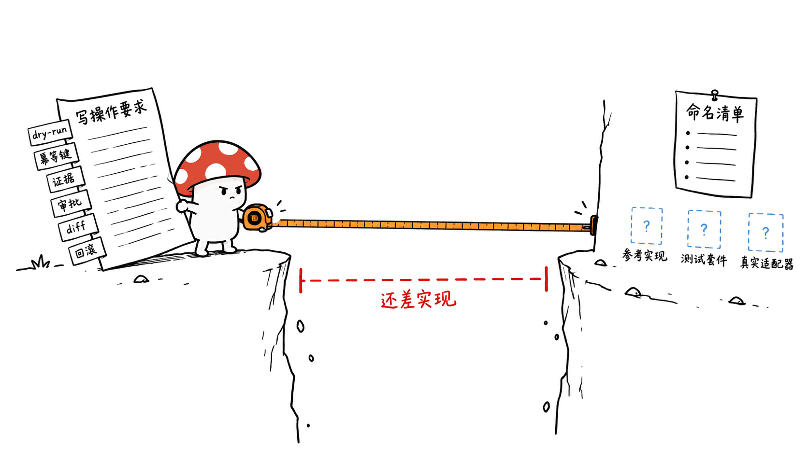

> 📌 一手资料
> Chift 用例页（支付同步）：https://www.chift.eu/use-cases/synchronize-payments
> Chift 产品页（Payments Sync）：https://www.chift.eu/sync/payment-to-accounting
> Chift 官网首页（Agent 产品线）：https://www.chift.eu/
> FinTech Global 报道（2026-09-14）：https://fintech.global/2026/09/14/chift-lands-e10-5m-to-connect-europes-fragmented-finance/
> tech.eu 报道（2026-09-14）：https://tech.eu/2026/09/14/chift-raises-eur105m-series-a-to-scale-financial-connectivity-across-europe
> Crowdfund Insider 报道（2026-09-14）：https://www.crowdfundinsider.com/2026/09/310124-brussels-fintech-chift-closes-e10-5m-round-to-develop-financial-connectivity-layer-for-ai-applications/

---

**BLUF**：欧洲金融数据连接公司 Chift 在 2026 年 9 月 14 日宣布完成由 BlackFin Capital Partners 领投、Entourage、Shapers、Seeder Fund、Wallonie Entreprendre 跟投的 1050 万欧元 A 轮融资。它做的事很朴素：一个统一 API，把会计、发票、POS、电商、支付、物业管理等系统连起来，让下游软件不用自己对接每一个财务系统。我们逐条打开三条一手源核实后发现两件事：第一，「连了多少系统」这个数字在不同一手源之间**互相打架**（Chift 官网自称 150+ 连接器，FinTech Global 说是 120+ 系统 + 150+ 家软件商用，tech.eu 说覆盖 27 个欧洲国家，FinTech Global 和 Crowdfund Insider 又都说是 13 个 / 十几个国家）；第二，日报卡片里说的「计划中的 agentic 层」并不是从零开始——Chift 官网已经上线了 MCP 服务器和 AI 字段自动映射，这轮融资真正要投的是**自动配置集成**这一步，而不是从零做一个能操作财务数据的 AI。这条新闻本身没有一个可核实的开源候选仓库，日报里的 `sme-finance-connector-contract` 是作者自己的产品构想，不是真实项目——所以本文按行业/产品观察类来写，重点谈这轮融资说明了什么、给独立开发者和中小 SaaS 团队什么启发，以及这类「标准化财务连接契约」的构想离真正能用还差多远。

## Chift 到底做什么，谁在为它买单？

Chift 成立于比利时布鲁塞尔，官网首页把自己定位成「**agentic infrastructure for financial connectivity**」（金融连接的智能体基础设施）。它不是直接卖给中小企业的记账软件，而是卖给**软件厂商**：会计 SaaS、发票工具、SaaS 报销系统这些厂商，接入 Chift 一个 API，就能替自己的客户同步 Stripe、PayPal、Xero、QuickBooks、Sage、Zettle、SumUp、Shopify 等一长串系统的数据，不用自己维护几十条对接。官网列出的客户案例包括 Revolut、Qonto、Agicap、Pennylane、Sage、Mollie——这些本身也是知名金融/会计 SaaS，说明 Chift 卖的是「连接层」这门生意，客户是同行业里更上游或平级的软件公司，不是最终的中小企业用户。

这个商业模式很关键：**Chift 赚的是"每个软件厂商付一次接入费，覆盖它自己的全部终端客户"这份钱**，而不是"每个中小企业单独付费"。这跟日报卡片里"作者构想的开源连接契约"完全是两种经济模型——一个是集成商 SaaS，一个是免费的协议/契约标准。

## 融资数字：谁说的、说了什么、哪里对不上？

我们把「连了多少系统」「覆盖多少企业」「覆盖多少国家」这三个数字，按信息来源逐条列出来，而不是笼统地写"据报道"：

| 数字 | 来源 | 原文措辞 |
|---|---|---|
| 150+ 连接器 | Chift 官网首页/用例页（一手，公司自称） | "One connection is all it takes to access 150+ financial tools" |
| 120+ 金融系统 | FinTech Global 报道 | "links software providers to more than 120 financial systems spanning the continent" |
| 150+ 家软件商 | FinTech Global 报道 | "More than 150 software businesses currently build on the platform" |
| 50,000+ 家企业 | FinTech Global 报道 | "giving over 50,000 companies across 13 countries access to connected financial data" |
| 13 个国家 | FinTech Global 报道 | 同上 |
| 27 个欧洲国家 | tech.eu 报道 | 覆盖"27 European countries"（表述为覆盖范围，未细分是市场存在还是实际客户分布） |
| 十余个欧洲国家 | Crowdfund Insider 报道 | "over ten European countries" |
| 120+ 金融产品，六大类别 | Crowdfund Insider 报道 | "more than 120 financial products across six categories" |

**核实结论**：三家媒体（FinTech Global、tech.eu、Crowdfund Insider）报道口径彼此不完全一致，尤其是国家覆盖数从「13」到「十余个」再到「27」，跨度不小；我们没有找到任何一家媒体注明这些数字来自 Chift 的新闻稿原文还是记者自己整理，**Chift 官网本身也没有公开列出覆盖国家数**。所以这里最诚实的写法是：这些数字**据多家科技媒体报道**，但媒体之间互相不一致，官方一手源只确认了"150+ 连接器"这一个数字。这不是说融资是假的（BlackFin Capital 领投、1050 万欧元 A 轮这两点三家媒体口径一致），而是"连接了多少系统/国家"这类营销性数字，本来就该打个问号。

## 日报说的"计划中的 agentic 层"，其实已经上线了一半

日报卡片原话是："公司也计划推出一个 agentic 层，能自动配置集成并允许 AI 系统安全地操作财务数据。" 我们打开 Chift 官网核实后发现，这句话只对了一半：

- **已经上线的**：官网首页专门有一个产品线叫「**Chift for Agent**」，明确写着"A suite of solutions to bring context to your Agents and AI products"；已经有 **MCP 服务器**把全部连接器暴露给 Claude、Cursor 这类 Agent 客户端；tech.eu 的报道也证实了这一点——"added a Model Context Protocol server so agents can pull and push data across its network"；官网还提到"AI mapping matches fields for you"（AI 自动做字段映射）和一个叫 Chifty 的集成助手。
- **融资要新建的**：tech.eu 报道明确说，这轮钱是用来"进一步开发 AI 能力"和"开发能自我配置、减少人工设置的集成"（develop integrations that can configure themselves and reduce manual setup）。也就是说，**"让 AI 安全操作数据"这半句已经有产品在跑，"自动配置集成"这半句才是真正要投的新东西**。

这个区分很重要：如果只看日报卡片，会觉得 Chift 是"打算做"一个 AI 层，容易高估这轮融资的技术新鲜度；核实一手源后，更准确的描述是"一家已经有 Agent 产品线两年多的连接器公司，融资扩大自动配置能力"。

## 为什么"连接器层"这件事对 AI 财务产品更重要？

日报卡片里的企业痛点描述是站得住的：一个典型中小企业的资金流转经过 POS → 支付处理商 → 银行 → 会计软件 → 发票系统 → 报销系统，每一环都有自己的字段命名、税务/会计语义、认证方式、webhook、对账规则，还叠加国家差异。一个坐在这套碎片化系统之上的 AI 记账/财务 Agent，如果拿到的是脏数据、写不回去、对账对不上，那它的"智能"发挥不出来——这不是模型能力问题，是数据管道问题。

由此可以推出一个分层猜想：Agent UX/推理 → 业务能力契约 → 标准化财务连接层 → QuickBooks/Xero/Sage/POS/PSP/银行/ERP 等具体系统。对一个 SME AI 财务产品的创业者来说，自己重新造每一个连接器的成本极高（Chift 花了几年才做到 150+ 连接器），一个更现实的策略是：**定义一个中性的业务契约，尽量复用现成的连接器提供商**，把精力放在 Agent 的推理和业务逻辑上。这跟这几年"别自己造轮子、租用基础设施"的判断是一致的，Chift 的存在和它现在能拿到 1050 万欧元融资本身，就是这个判断成立的一个证据——市场愿意为"连接层"这门生意单独付费，说明它确实是一个独立的价值层，而不是随便一个 Agent 项目的附属功能。

## 日报里"可开源组件"是作者自己的构想，离真正能用还差多远？

日报卡片里提出的 `sme-finance-connector-contract`——标准化财务对象（Customer/Supplier/Invoice/Payment/Expense/JournalEntry/Tax/Account/BankTransaction/ReconciliationMatch）和标准操作（invoice.list/create_draft、payment.match、reconciliation.preview/commit），每个写操作要求 dry-run、幂等键、来源证据、审批要求、before/after diff、回滚——**这是日报作者自己的产品构想，我们没有找到任何名字类似的真实开源仓库**，需要明确这一点，不能当成已存在的项目来写。

拿这个构想去对照 Chift 已经落地的产品，能看出几层差距：

1. **数据模型统一容易，写操作安全难**。Chift 现有产品的重点看起来是"同步"（sync）和"匹配"（match），也就是读多写少的场景（比如支付同步进会计系统）；构想里要求的 dry-run、幂等键、审批工作流、diff/回滚，这些是给"AI 可以自主发起写操作"的场景设计的安全机制，比单纯的数据同步复杂得多，我们没有在 Chift 公开资料里看到它已经做到这个粒度。
2. **协议 vs 产品，两种完全不同的生意**。Chift 是收费的集成商 SaaS，靠向软件厂商收接入费盈利；构想里的"标准化连接契约"更像是一个中立协议（类似 OpenAPI 之于 REST），如果真的做成开源标准，需要拉拢多方连接器厂商共同遵守，这比自己关起门做一个产品难得多——历史上类似的"统一记账协议"尝试（比如各类开放银行 API 标准）大多进展缓慢，本身就是这件事难度的旁证。
3. **离真正能用还差一整套实现**。目前只是一份对象和操作的命名清单，还没有参考实现、没有测试套件、没有任何真实连接器接了这套契约。要从"构想"走到"能用"，至少需要：一个跑起来的 reference server、至少两三个真实系统的适配器、一套可重复的 dry-run/回滚测试用例——这些工作量不比再造一个 Agent 小。

**局限和没法确认的点**：我们没有找到任何独立开发者已经在实践这类"标准化财务写操作契约"的公开项目（如果读者知道类似项目，欢迎指正）；Chift 的连接器和字段映射的具体实现细节（比如它的 AI mapping 准确率、失败率）官网没有公开数据，我们也没有办法在不注册账号的情况下验证。

## 对独立开发者和中小 SaaS 团队意味着什么？

- **如果你在做 SME 财务/记账类 AI 产品**：先假设"连接层"是外包出去的能力，不要一上来就自己写几十个系统的适配器。Chift、以及国内类似定位的服务商，本质上是在帮你把"接入成本"变成"订阅费用"，值不值得，取决于你自己造的边际成本相对订阅费是不是更贵。
- **中国市场的空白和难度**：中国中小企业的财务软件生态和欧洲差别很大——用友、金蝶等主流财务软件本身就相对封闭，加上支付宝、微信支付、银行对公账户体系、税务系统（金税四期）各自的接口规范和合规要求，跟 Chift 覆盖的"欧洲开放银行 + SaaS 生态"环境完全是两套体系。这意味着即便"连接器比再造一个财务 Agent 更有价值"这个判断在国内同样成立，照搬 Chift 的打法也走不通，本地化需要重新梳理一遍国内财务软件和支付清算的对接规范，工作量未必比欧洲小。
- **不要把"构想"读成"现状"**：daily-crawler 类的选题卡片是灵感来源，不是一手事实，这次的 `sme-finance-connector-contract` 就是一个典型例子——它是一个值得关注的方向，但目前只存在于一段文字描述里。

## 常见问题

**Q：Chift 这轮融资金额和投资方是否可信？**
A：可信。FinTech Global、tech.eu、Crowdfund Insider 三家独立报道口径一致：1050 万欧元 A 轮，BlackFin Capital Partners 领投，Entourage、Shapers、Seeder Fund、Wallonie Entreprendre 跟投，日期都是 2026-09-14。这部分是三个一手源交叉确认的。

**Q：Chift 到底连了多少个系统、覆盖多少国家？**
A：这个具体数字在不同来源之间不一致。Chift 官网自称"150+ 连接器"；FinTech Global 报道说"120+ 金融系统"和"150+ 家软件商"，并说覆盖"13 个国家的 50,000+ 家企业"；tech.eu 说覆盖"27 个欧洲国家"；Crowdfund Insider 说"十余个欧洲国家"。三家媒体互相不吻合，我们没能找到统一口径，建议把这些数字当作"多家媒体报道的量级参考"，不要当成精确统计。

**Q：日报里说的"AI 系统安全操作财务数据"的 agentic 层，是新东西吗？**
A：不完全是。Chift 官网已经有「Chift for Agent」产品线，含 MCP 服务器（暴露连接器给 Claude、Cursor 等 Agent 客户端）和 AI 字段自动映射，这些已经上线。tech.eu 的报道确认这轮融资真正要新建的是"能自我配置、减少人工设置"的集成能力，而不是从零做一个 AI 操作财务数据的功能。

**Q：`sme-finance-connector-contract` 这个开源项目在哪里能找到？**
A：找不到，因为它不存在。这是 daily-crawler 选题作者自己提出的产品构想（标准化财务对象和操作，写操作要求 dry-run/幂等键/审批/diff/回滚），不是任何真实仓库的名字。本文把它当作一个值得讨论的方向来分析，而不是当作已有项目介绍。

**Q：这类连接器公司在中国有对应的机会吗？**
A：从"金融数据碎片化是 AI 落地真实瓶颈"这个判断本身来看，逻辑在哪儿都成立；但欧洲的开放银行环境和国内用友/金蝶/支付宝/微信支付/金税系统各自封闭的接口生态差别很大，照搬 Chift 的连接器打法在国内需要重新适配一整套合规和接口规范，不是简单复制。

## 一手源

- Chift 用例页（支付同步）：https://www.chift.eu/use-cases/synchronize-payments
- Chift 产品页（Payments Sync）：https://www.chift.eu/sync/payment-to-accounting
- Chift 官网首页（Agent 产品线、MCP 服务器）：https://www.chift.eu/
- FinTech Global，2026-09-14：https://fintech.global/2026/09/14/chift-lands-e10-5m-to-connect-europes-fragmented-finance/
- tech.eu，2026-09-14：https://tech.eu/2026/09/14/chift-raises-eur105m-series-a-to-scale-financial-connectivity-across-europe
- Crowdfund Insider，2026-09-14：https://www.crowdfundinsider.com/2026/09/310124-brussels-fintech-chift-closes-e10-5m-round-to-develop-financial-connectivity-layer-for-ai-applications/

---

> © 2026 Author: Mycelium Protocol. 本文采用 [CC BY 4.0](https://creativecommons.org/licenses/by/4.0/deed.zh) 授权——欢迎转载和引用，须注明作者姓名及原文链接，不得去除署名后以原创发布。

<!--EN-->

> 📌 Primary sources
> Chift use case (payment sync): https://www.chift.eu/use-cases/synchronize-payments
> Chift product page (Payments Sync): https://www.chift.eu/sync/payment-to-accounting
> Chift homepage (Agent product line): https://www.chift.eu/
> FinTech Global, 2026-09-14: https://fintech.global/2026/09/14/chift-lands-e10-5m-to-connect-europes-fragmented-finance/
> tech.eu, 2026-09-14: https://tech.eu/2026/09/14/chift-raises-eur105m-series-a-to-scale-financial-connectivity-across-europe
> Crowdfund Insider, 2026-09-14: https://www.crowdfundinsider.com/2026/09/310124-brussels-fintech-chift-closes-e10-5m-round-to-develop-financial-connectivity-layer-for-ai-applications/

---

**BLUF**: European financial-connectivity company Chift announced on September 14, 2026 that it closed a €10.5M Series A led by BlackFin Capital Partners, with Entourage, Shapers, Seeder Fund and Wallonie Entreprendre participating. What it does is simple in principle: a unified API that connects accounting, invoicing, POS, ecommerce, payment and property-management systems, so downstream software doesn't need to integrate every financial system on its own. After opening all three primary sources ourselves, we found two things worth flagging. First, "how many systems it connects" **conflicts across primary sources** — Chift's own site claims "150+ connectors," FinTech Global reports "120+ financial systems" plus "150+ software businesses," tech.eu says coverage spans "27 European countries," while FinTech Global and Crowdfund Insider both cite roughly 13 to a dozen-plus countries. Second, the "planned agentic layer" from the daily brief card isn't starting from zero — Chift's site already ships an MCP server and AI-driven field mapping; what this round actually funds is **self-configuring integration**, not building an AI-that-touches-financial-data layer from scratch. This story has no verifiable open-source repository candidate; the `sme-finance-connector-contract` in the brief is the daily-brief author's own product concept, not a real project — so this piece is written as an industry/product observation. It focuses on what this funding round actually tells us, what it means for solo developers and small SaaS teams, and how far that "standardized connector contract" idea is from something usable.

## What Does Chift Actually Do, and Who Pays for It?

Chift was founded in Brussels, Belgium. Its homepage positions itself as "**the agentic infrastructure for financial connectivity**." It doesn't sell directly to SMEs doing their own bookkeeping — it sells to **software vendors**: accounting SaaS, invoicing tools, expense-management platforms. Those vendors integrate Chift's single API and can then sync data for their own customers across a long list of systems — Stripe, PayPal, Xero, QuickBooks, Sage, Zettle, SumUp, Shopify and more — without maintaining dozens of integrations themselves. Its customer list includes Revolut, Qonto, Agicap, Pennylane, Sage and Mollie — themselves well-known fintech/accounting SaaS companies, which tells you Chift's customers sit upstream or alongside it in the same industry, not end-user SMEs.

This business model matters: **Chift monetizes by having each software vendor pay once for integration access that covers all of that vendor's own end customers**, rather than charging each SME directly. That's a fundamentally different economic model from the "open-source connector contract" concept in the daily brief — one is an integrator SaaS business, the other is a free protocol/standard.

## The Funding Numbers: Who Said What, and Where Do They Disagree?

We laid out "how many systems," "how many companies," and "how many countries" source by source, rather than lumping them under a vague "reportedly":

| Figure | Source | Exact wording |
|---|---|---|
| 150+ connectors | Chift's own site/use-case page (primary, company claim) | "One connection is all it takes to access 150+ financial tools" |
| 120+ financial systems | FinTech Global | "links software providers to more than 120 financial systems spanning the continent" |
| 150+ software businesses | FinTech Global | "More than 150 software businesses currently build on the platform" |
| 50,000+ companies | FinTech Global | "giving over 50,000 companies across 13 countries access to connected financial data" |
| 13 countries | FinTech Global | same sentence as above |
| 27 European countries | tech.eu | coverage described as "27 European countries" (unclear whether this means market presence or actual customer distribution) |
| Over ten European countries | Crowdfund Insider | "over ten European countries" |
| 120+ financial products, six categories | Crowdfund Insider | "more than 120 financial products across six categories" |

**Verification conclusion**: the three outlets (FinTech Global, tech.eu, Crowdfund Insider) don't fully agree with each other, especially on country coverage, which ranges from "13" to "over ten" to "27." None of them cites whether these numbers come verbatim from a Chift press release or were compiled independently by the reporter, and **Chift's own site does not publicly list a country-coverage figure**. The honest way to write this is: these figures are **reported by multiple tech outlets**, but the outlets disagree among themselves, and the only figure confirmed by the primary company source is "150+ connectors." This doesn't mean the funding round is fake — all three outlets agree on the €10.5M Series A amount and BlackFin Capital's lead — but marketing-style figures like "how many systems/countries" deserve a question mark.

## The Brief's "Planned Agentic Layer" Is Already Half-Shipped

The brief card said: "The company also plans an agentic layer that can automatically configure integrations and allow AI systems to act safely on financial data." Checking Chift's own site, that statement is only half right:

- **Already shipped**: Chift's homepage has a product line called "**Chift for Agent**," described as "A suite of solutions to bring context to your Agents and AI products." It already has an **MCP server** exposing every connector to agent clients like Claude and Cursor — tech.eu's report confirms this too, saying Chift "added a Model Context Protocol server so agents can pull and push data across its network." The site also mentions "AI mapping matches fields for you" and an integration assistant called Chifty.
- **What the funding actually builds**: tech.eu's report explicitly says the round funds "further development of AI capability" and "developing integrations that can configure themselves and reduce manual setup." In other words, **the "letting AI safely act on financial data" half is already a shipping product; "self-configuring integration" is the genuinely new thing this round funds**.

That distinction matters: reading only the brief card, you'd think Chift is "planning" an AI layer, which overstates how technically new this round is. After checking the primary sources, the more accurate description is: a connector company that has had an agent product line for a couple of years is raising money to expand its self-configuration capability.

## Why Might the Connector Layer Matter More Than Another Finance Agent?

The enterprise pain point in the brief holds up: a typical SME's money flow runs POS → payment processor → bank → accounting software → invoicing → expense system, and every hop has its own field names, tax/accounting semantics, authentication, webhooks, and reconciliation rules, stacked on top of country-specific quirks. An AI bookkeeping or finance agent sitting above that fragmentation, if it's fed dirty data, can't write back reliably, or can't reconcile — its "intelligence" never gets a chance to matter. That's not a model-capability problem; it's a data-pipeline problem.

That suggests a layering: Agent UX/reasoning → business capability contract → normalized financial connector layer → QuickBooks/Xero/Sage/POS/PSP/bank/ERP and so on. For an SME AI finance founder, rebuilding every connector yourself is expensive — Chift took years to reach 150+ connectors — so a more realistic strategy is to **define a neutral business contract and lean on existing connector providers wherever possible**, spending your own effort on the agent's reasoning and business logic instead. That lines up with the broader "don't reinvent infrastructure, rent it" pattern of the past few years, and Chift's existence — and the fact that it can raise €10.5M right now — is itself evidence that this judgment holds: the market is willing to pay separately for "the connector layer," which means it really is an independent value layer, not just a feature bolted onto some agent project.

## How Far Is the Brief's "Open-Source Component" From Something Usable?

The brief proposes `sme-finance-connector-contract` — standardized financial objects (Customer/Supplier/Invoice/Payment/Expense/JournalEntry/Tax/Account/BankTransaction/ReconciliationMatch) and standardized operations (invoice.list/create_draft, payment.match, reconciliation.preview/commit), where every write operation should support dry-run, idempotency keys, source evidence, approval requirements, before/after diffs, and rollback. **This is the daily-brief author's own product concept — we found no real open-source repository under this or a similar name**, and that needs to be stated plainly rather than treated as an existing project.

Comparing this concept against what Chift has actually shipped surfaces several gaps:

1. **A unified data model is easy; safe write operations are hard.** Chift's shipped products appear focused on "sync" and "match" — read-heavy scenarios like syncing payments into accounting. The dry-run, idempotency, approval workflow, and diff/rollback the concept calls for are safety mechanisms designed for "an AI autonomously initiating write operations," which is a much harder problem than data synchronization; we found no public evidence Chift has built to that level of granularity.
2. **A protocol and a product are two different businesses.** Chift is a paid integrator SaaS that earns access fees from software vendors. The concept's "standardized connector contract" reads more like a neutral protocol (something like OpenAPI is to REST). Turning that into a real open standard requires getting multiple connector vendors to adopt it together, which is much harder than building a closed product — historically, similar attempts at unified accounting/open-banking standards have mostly moved slowly, which itself is evidence of how hard this is.
3. **It's still far from usable.** Right now it's a naming list of objects and operations — no reference implementation, no test suite, and no real connector actually implementing this contract. Getting from "concept" to "usable" needs at minimum: a working reference server, adapters for two or three real systems, and a repeatable dry-run/rollback test suite. That's not meaningfully less work than building another agent from scratch.

**Limitations and open questions**: we found no public project where an independent developer is actually building this kind of "standardized financial write-operation contract" (if readers know of one, we'd welcome a correction). Chift's connector and field-mapping implementation details — for example, the accuracy or failure rate of its AI mapping — aren't published on its site, and we couldn't verify them without creating an account.

## What Does This Mean for Solo Developers and Small SaaS Teams?

- **If you're building an SME finance/bookkeeping AI product**: assume the connector layer is something to outsource rather than something to build first. Chift, and similarly positioned providers elsewhere, are essentially converting "integration cost" into "subscription cost." Whether that's worth it depends on whether your own marginal cost of building it beats the subscription fee.
- **The gap and difficulty in the China market**: the SME financial-software ecosystem in China differs sharply from Europe's. Mainstream financial software like Yonyou and Kingdee is relatively closed, and Alipay, WeChat Pay, corporate bank accounts, and the tax system (Golden Tax Phase IV) each carry their own interface specs and compliance requirements — a completely different environment from the "European open-banking plus SaaS ecosystem" that Chift covers. That means even if "connectors beat another finance agent" holds true domestically too, copying Chift's exact playbook won't work; localization requires re-mapping the entire domestic financial-software and payment-clearing integration landscape, and the workload may not be any smaller than in Europe.
- **Don't mistake a "concept" for "current reality"**: daily-crawler-style brief cards are inspiration sources, not primary facts. The `sme-finance-connector-contract` here is a textbook example — it's a direction worth watching, but right now it exists only as a paragraph of description.

## FAQ

**Q: Is the funding amount and investor list for Chift's round credible?**
A: Yes. FinTech Global, tech.eu, and Crowdfund Insider — three independent reports — agree: a €10.5M Series A led by BlackFin Capital Partners, with Entourage, Shapers, Seeder Fund and Wallonie Entreprendre participating, all dated 2026-09-14. This part is cross-confirmed by three primary sources.

**Q: How many systems does Chift actually connect, and how many countries does it cover?**
A: The specific figures disagree across sources. Chift's own site claims "150+ connectors." FinTech Global reports "120+ financial systems" and "150+ software businesses," covering "50,000+ companies across 13 countries." tech.eu says coverage spans "27 European countries." Crowdfund Insider says "over ten European countries." The three outlets don't match, and we couldn't find a single authoritative figure — treat these as order-of-magnitude reporting, not precise statistics.

**Q: Is the "AI systems safely acting on financial data" agentic layer from the brief something new?**
A: Not entirely. Chift's site already has a "Chift for Agent" product line, including an MCP server (exposing connectors to agent clients like Claude and Cursor) and AI-driven field mapping — both already shipping. tech.eu's report confirms this funding round's genuinely new target is "self-configuring integration that reduces manual setup," not building an AI-that-acts-on-financial-data feature from scratch.

**Q: Where can I find the `sme-finance-connector-contract` open-source project?**
A: You can't, because it doesn't exist. It's the daily-brief author's own product concept — standardized financial objects and operations, with write operations requiring dry-run/idempotency/approval/diff/rollback — not the name of any real repository. This post treats it as a direction worth discussing, not an existing project to review.

**Q: Is there an equivalent opportunity for connector companies in China?**
A: The underlying judgment — that financial data fragmentation is a real bottleneck for AI adoption — holds regardless of geography. But the interface ecosystem of Europe's open banking differs sharply from China's, where Yonyou, Kingdee, Alipay, WeChat Pay and the Golden Tax system are each their own closed environment. Copying Chift's connector playbook in China would require rebuilding an entire compliance and interface layer from scratch, not simple replication.

## Primary Sources

- Chift use case (payment sync): https://www.chift.eu/use-cases/synchronize-payments
- Chift product page (Payments Sync): https://www.chift.eu/sync/payment-to-accounting
- Chift homepage (Agent product line, MCP server): https://www.chift.eu/
- FinTech Global, 2026-09-14: https://fintech.global/2026/09/14/chift-lands-e10-5m-to-connect-europes-fragmented-finance/
- tech.eu, 2026-09-14: https://tech.eu/2026/09/14/chift-raises-eur105m-series-a-to-scale-financial-connectivity-across-europe
- Crowdfund Insider, 2026-09-14: https://www.crowdfundinsider.com/2026/09/310124-brussels-fintech-chift-closes-e10-5m-round-to-develop-financial-connectivity-layer-for-ai-applications/

---

> © 2026 Author: Mycelium Protocol. Licensed under [CC BY 4.0](https://creativecommons.org/licenses/by/4.0/) — free to share and adapt with attribution. You must credit the author and link to the original; removing attribution and republishing as original is not permitted.
