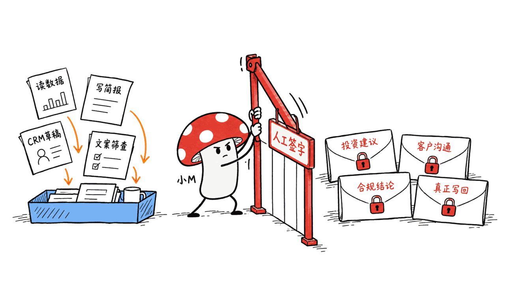
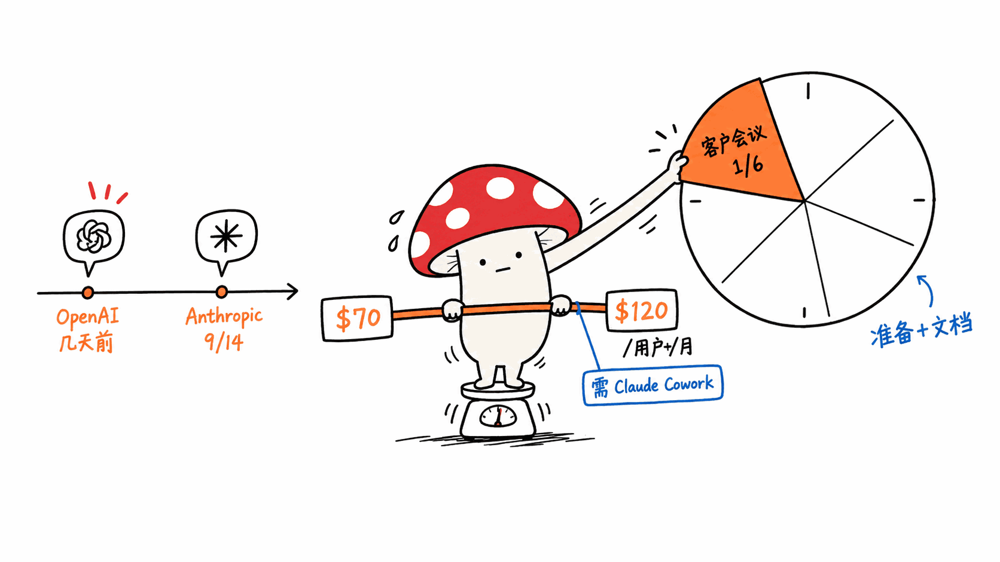
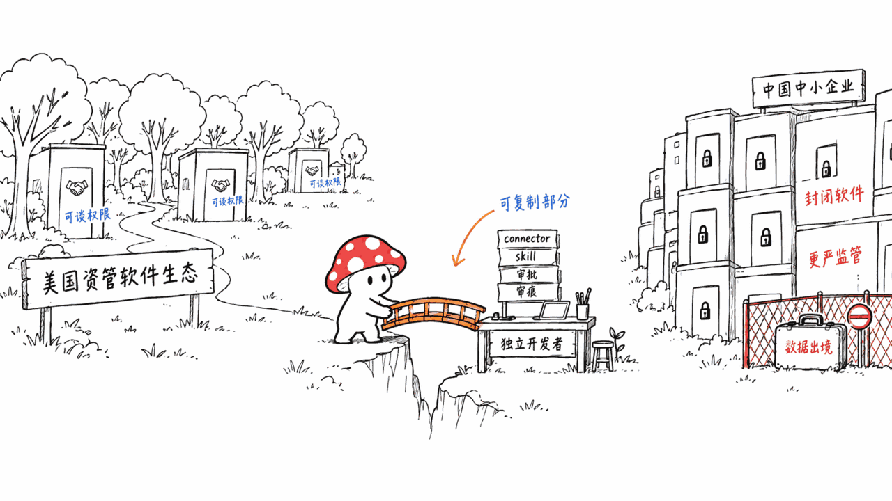

**BLUF**：2026 年 9 月 14 日，Anthropic 发布 **Claude for Financial Advisors**，把约 **18 个连接器**（Addepar、BlackRock、Charles Schwab、Envestnet、iCapital、Orion、SS&C Black Diamond、Wealthbox、Wealth.com、Vanguard、Zocks 等新增，加上此前已有的 Microsoft 365、Salesforce、DocuSign、Box、FactSet、S&P Global、Morningstar）和 **8 个工作流技能**（顾问入职、另类投资简报、合规与 AI 政策、遗产与税务简报、组合再平衡审查、会后纪要与跟进、会前准备、意向客户初筛）打包成一个产品，定价约 **70-120 美元/用户/月**，需要搭配 Claude Cowork 使用。它没有训练金融专用模型，用的还是通用 Claude；真正的产品化工作在于**把"人工审批"和"审计留痕"做成了流程的一部分**——投资建议、客户沟通、合规判断仍必须顾问审阅批准，CRM 更新等管理性动作先"暂存"等待批准，Enterprise 版附带支持留痕的审计日志。日报里提到的"可开源组件 vertical-agent-pack-spec"是作者自己的产品构想，我们查证 GitHub 上确实**不存在**这个仓库，属于虚构的候选项目，本文按行业观察类处理，不拆解任何真实代码。

> 📌 一手资料（均已逐条打开核实）
> Anthropic 官方公告：https://claude.com/blog/claude-for-financial-advisors
> Addepar 官方博客：https://addepar.com/blog/bringing-addepar-portfolio-intelligence-to-claude
> 相关报道（Reuters 原文无法直接抓取，以下为可访问的转载/同源报道）：
> https://www.wealthmanagement.com/artificial-intelligence/anthropic-launches-claude-for-financial-advisors
> https://kelo.com/2026/09/14/anthropic-targets-financial-advisers-with-new-claude-tool/

---

## 发布了什么？先把官方说法核实一遍

Anthropic 官方博客（claude.com/blog）写得很明确：这不是一个新的垂直 SaaS 产品，而是一套**连接现有软件的连接器 + 面向具体工作流的技能**。官方原文列出的连接器包括新增的 Addepar、BlackRock、Charles Schwab、Envestnet、iCapital、Orion、SS&C Black Diamond、Wealthbox、Wealth.com、Vanguard、Zocks，再加上此前 Claude 企业版已支持的 Microsoft 365、Salesforce、DocuSign、Box、FactSet、S&P Global、Morningstar，合计约 18 个。8 个技能对应顾问工作日里最耗时的几类任务：顾问入职、另类投资简报、合规与 AI 政策、遗产与税务简报、组合再平衡审查、会后纪要与跟进、会前准备、意向客户初筛。

官方原话是这样写人工审批的："Investment recommendations, client communications, compliance determinations, and other regulated activities remain subject to human review and approval."（投资建议、客户沟通、合规判断和其他受监管的活动仍需接受人工审查和批准）。Claude 的角色被限定为"prepares briefs, summaries, and drafts analyses for advisor review, and stages administrative actions like CRM updates or draft client communications for the advisor's review and approval"（准备简报、摘要和分析草稿供顾问审阅，并把 CRM 更新、客户沟通草稿这类管理性动作暂存，等顾问审阅批准）。合规技能会"screens client-facing language against the SEC Marketing Rule to flag potential issues"（对照 SEC 营销规则筛查面向客户的文案，标记潜在问题）；Enterprise 版包含"audit logs that support recordkeeping"（支持记录留存的审计日志）。产品今天起可通过 Claude Cowork 插件使用，9 月底前申请新许可证的机构能拿到一次性用量额度。

这条信息本身是可以核实的，日报卡片的转述基本准确，只是把具体的连接器名单和技能清单省略了——补全这些细节之后，"打包而不是重新造一个垂直 SaaS"这个判断才立得住。

## "Governed Connector" 到底管的是什么？看 Addepar 这一份怎么说

日报卡片用了"Governed Connector"这个词，但没解释"governed"具体指什么。我们打开了 Addepar 自己发的博客（不是二手转述），里面把这层"治理"讲得很具体，用的是 **Addepar MCP**（Model Context Protocol）连接器：

- 用户在 Addepar 里原有的权限和公司数据边界，会**原样延续到 Claude 能调用的工具上**——原文强调"用户的现有权限和公司背景被延续到我们公开的工具"，不是 Claude 拿到一把万能钥匙。
- 初期开放的技能范围刻意收窄成分析和检索：**投资组合表现、表现归因、总投资组合敞口、私募基金现金流分析**四类，Addepar 明确写"初始体验刻意聚焦于分析和信息检索，不执行交易或改变投资组合数据"。
- 更复杂的数据场景走的是 ADX（Addepar 自己的数据交换层），而不是把裸数据全量塞给 Claude。

换句话说，"Governed Connector"不是一句营销话术，它在 Addepar 这一端有三条具体约束：**权限继承、只读、范围限定在四个技能**。这和日报总结的模式图（现有软件 → Governed Connector → 行业上下文/数据 → 工作流技能 → 草稿/建议动作 → 必要时人工批准 → 写回+审计证据）能对上号，只是"写回"这一步在 Addepar 这条集成里目前还没打开——第一版只做分析，不做写操作。

## 审批和审计具体卡在哪一步？

把三条一手源拼起来看，能画出一条比较清楚的分界线：

**Claude 可以自主完成**：读取投资组合数据、生成会前简报、总结会议纪要、起草 CRM 更新内容、起草客户沟通文案、按 SEC 营销规则筛查文案措辞。

**必须顾问确认才能生效**：任何投资建议、任何真正发给客户的沟通、任何合规层面的判断结论、任何真正写回 CRM 或投资组合系统的动作。Addepar 这边连"分析读取之外的动作"目前都还没开放，也就是说现在能自动化的部分，全部停留在"准备材料"这一层，没有一个连接器允许 Claude 直接下单或改数据。

这和 Wealth Management 的报道里 Ritholtz Wealth Management CEO Josh Brown 的表态是一致的——他强调的诉求是"不想让持证理财规划师(CFP)每周花几个小时在 CRM 更新这种琐事上"，把省下来的时间留给客户真正看重的直接沟通，而不是让 AI 替代顾问的判断。审批环节留下的不是"AI 说了算"，而是"AI 把活儿干到审阅这一步，人来签字"。

## 定价、竞争背景和几个容易被忽略的数字

因为 Reuters 原文页面无法直接抓取，这部分数字来自能打开的同源报道（Wealth Management、KELO/AP 转载），交叉核对后一致：

- **定价**：Anthropic 的 Peter Nolan 给出的区间是每用户每月 70-120 美元，需要先有 Claude Cowork，插件本身免费；9 月底前申请新许可证有一次性用量额度。
- **定位表态**：Nolan 的原话把 Anthropic 定位成"交响乐指挥"——"Our goal is to drive utilization in the advisor stack today...think of us as a symphony conductor"（目标是提升顾问现有工具栈的利用率，把我们当成交响乐指挥），也就是明确不打算替换 Schwab、BlackRock、Addepar 这些现有软件，而是接进去。
- **一个被反复引用的痛点数字**：报道援引 Anthropic 引用的研究称，顾问只有**约六分之一**的工作时间花在真正的客户会面上，其余时间都耗在会前准备和会后文档上——这是整个产品叙事的出发点。
- **竞争背景**：这次发布是在 OpenAI 几天前刚推出面向投行分析师和股票研究员的 ChatGPT 金融行业版本之后跟进的，说明"给专业软件套一层连接器+技能"这条路子，两家头部 AI 公司几乎是同期在做。

这几点合在一起说明：这不是一次孤立的产品实验，而是巨头们正在同时验证同一套打包逻辑，价格也不是"每用户几美元"的轻量订阅，而是对标企业软件的每用户三位数月费。

## 日报里"可开源的 vertical-agent-pack-spec"构想站得住脚吗？

这条日报把"打包行业工作流成可安装 agent 能力的清单格式"作为构想抛出来，manifest 里设想含 connectors/skills/permissions/human_review/evidence/metrics 几个字段。我们在 GitHub 上搜索确认，**`vertical-agent-pack-spec` 这个仓库不存在**，日报作者自己也标注了这是构想，不是真实项目，因此本文不把它当作既成开源项目来拆解。

作为一个构想本身，它抓住了 Claude for Financial Advisors 真正验证的东西：manifest 里 `human_review` 和 `evidence` 这两个字段，恰好对应 Anthropic 官方强调的"人工审批"和"审计日志"。但这个构想要落地有一个绕不开的协调问题——Addepar、BlackRock、Schwab 这些连接器背后是各家单独去谈的权限模型和 API，不是靠一份通用 manifest 格式就能统一的。一个开源 manifest 规范可以规定"应该有哪些字段"，但**没法替企业软件厂商开放数据接口和权限模型这件事本身**，这是它目前只能停留在构想阶段的现实原因，不是格式设计好不好的问题。

## 对中国中小企业和独立开发者意味着什么？

**能借鉴的是产品设计思路，不是具体连接器清单**：这次发布最值得抄的判断是——垂直 AI 的护城河不在"训不训练行业专用模型"（Anthropic 用的还是通用 Claude），而在"谁能把审批和审计做成产品的默认设置"。给客户经理、会计、律师这类强监管职业做 Agent 工具时，先把"哪些动作可以自动、哪些必须人签字、每一步留什么证据"想清楚，比追求模型能自主完成多少步骤更重要，这条思路和技术栈、和所在国家无关。

**能直接照抄的连接器和定价打法，中国基本用不上**：这套模式高度依赖美国资管软件生态已经足够开放、且愿意配合谈判权限模型（Addepar 专门为此发了一整篇博客）。中国的对应软件（各类财务/CRM/资管系统）普遍没有对标的开放 API 或 MCP 协议，中小机构自建的系统更是如此；此外金融、医疗这类行业在国内本身就有更严格的数据出境和模型使用限制，直接把客户数据接给海外 LLM API 在合规上大概率行不通，本地化部署和国产模型是绕不开的前提，这和 Anthropic 这次的美国监管语境（SEC 营销规则）不是一回事。

**独立开发者能复制的规模有限**：个人开发者没法像 Anthropic 一样去跟 BlackRock、Schwab 谈连接器合作，但可以在没有巨头把持的细分垂直软件里，用同一套"connector（哪怕只是读一个 API）+ skill（针对具体工作流）+ 人工审批暂存 + 操作留痕"的轻量结构，给某个小众 SaaS 或本地工具做一个插件级的产品。规模做不到 Anthropic 这种量级，但产品设计的原则——"默认只准备草稿，关键动作等人确认，全程留痕"——同样适用，而且成本几乎为零，不需要额外训练模型。

## 局限在哪里？

Anthropic 这次发布本身也暴露了几个局限，我们的判断是：

1. **模型能力不是护城河，连接器关系才是**：既然用的是通用 Claude，OpenAI 几天内就跟进了类似打法，说明这套"打包"本身没有技术壁垒，谁先把 Addepar、Schwab 这些关键软件的合作关系谈下来，谁占先手，竞争会很快落到"谁的连接器名单更全"而不是"谁的模型更强"。
2. **目前只验证了"读"，没验证"写"**：至少从 Addepar 这条集成看，第一版明确不做交易执行、不改投资组合数据，"写回"这一环节的审批+审计机制到底好不好用，现在还没有真实案例可看，只能算是产品叙事，不是已经跑通的能力。
3. **审批流程本身会不会成为新瓶颈**：把动作暂存等人审批，短期内确实比"AI 直接执行"更安全，但如果顾问审阅草稿的速度跟不上生成的速度，"省下来的时间"会打折扣，这一点报道里没有给出数据，我们持保留态度。

## 常见问题

**Q：Claude for Financial Advisors 训练了金融专用大模型吗？**
A：没有，官方公告没有提到任何针对金融领域的专门预训练或微调，产品是通用 Claude 加连接器和工作流技能的组合。

**Q：Claude 能不能直接帮顾问下单或改投资组合？**
A：目前不能。Addepar 这条集成明确写初始版本只做分析和信息检索，不执行交易、不改动组合数据；官方公告也把投资建议、合规判断列为必须人工审批的事项。

**Q：这套模式和"训练一个行业专用大模型"比，哪个更划算？**
A：从这次发布看，Anthropic 选择了前者——复用通用模型、把工程投入放在连接器和审批流程上。这也回应了日报提出的"vertical-agent-pack"构想：护城河不在模型训练，而在谁能拿到软件厂商的开放权限和数据接口。

**Q：`vertical-agent-pack-spec` 是真实存在的开源项目吗？**
A：不是。这是日报作者对"通用 manifest 格式"的产品构想，我们核实 GitHub 上没有这个仓库，本文按行业观察处理，不作为项目拆解。

**Q：中国的中小企业能直接套用这套打包方式吗？**
A：直接套用连接器清单和定价打法不现实，因为国内对应软件生态开放度不够，且金融等强监管行业的数据出境和模型使用限制比美国更严。但"connector+skill+审批+审计"这个产品设计思路是通用的，值得国内做垂直 Agent 的团队参考。

## 一手源

- Anthropic 官方公告：https://claude.com/blog/claude-for-financial-advisors
- Addepar 官方博客：https://addepar.com/blog/bringing-addepar-portfolio-intelligence-to-claude
- Wealth Management 报道（含定价、Nolan/Josh Brown 表态）：https://www.wealthmanagement.com/artificial-intelligence/anthropic-launches-claude-for-financial-advisors
- KELO/AP 转载报道：https://kelo.com/2026/09/14/anthropic-targets-financial-advisers-with-new-claude-tool/
- Charles Schwab 官方新闻稿：https://pressroom.aboutschwab.com/press-releases/press-release/2026/Charles-Schwab-and-Anthropic-to-Bring-Claude-to-Independent-Registered-Investment-Advisors/default.aspx

---

> © 2026 Author: Mycelium Protocol. 本文采用 [CC BY 4.0](https://creativecommons.org/licenses/by/4.0/deed.zh) 授权——欢迎转载和引用，须注明作者姓名及原文链接，不得去除署名后以原创发布。

<!--EN-->

**BLUF**: On September 14, 2026, Anthropic launched **Claude for Financial Advisors**, bundling roughly **18 connectors** (new ones including Addepar, BlackRock, Charles Schwab, Envestnet, iCapital, Orion, SS&C Black Diamond, Wealthbox, Wealth.com, Vanguard, Zocks, plus pre-existing Microsoft 365, Salesforce, DocuSign, Box, FactSet, S&P Global, Morningstar) and **8 workflow skills** (advisor onboarding, alternative investments brief, compliance and AI policy, estate and tax brief, portfolio rebalance review, post-meeting notes and follow-up, pre-meeting prep, prospect intake) into one product, priced around **$70-120 per user per month** on top of Claude Cowork. It does not train a finance-specific model — it runs on general-purpose Claude. The real product work went into **making human approval and audit trails part of the workflow**: investment recommendations, client communications, and compliance determinations still require advisor review and approval; administrative actions like CRM updates are staged pending approval; Enterprise plans ship with audit logs for recordkeeping. The daily brief's "open-source component, `vertical-agent-pack-spec`" is the brief author's own product concept — we confirmed on GitHub that **this repository does not exist**, so this post treats the story as an industry observation rather than a repo teardown.

> 📌 Primary sources (all opened and verified)
> Anthropic's official announcement: https://claude.com/blog/claude-for-financial-advisors
> Addepar's official blog: https://addepar.com/blog/bringing-addepar-portfolio-intelligence-to-claude
> Related coverage (Reuters itself could not be fetched directly; the following syndicated/co-sourced reports were accessible):
> https://www.wealthmanagement.com/artificial-intelligence/anthropic-launches-claude-for-financial-advisors
> https://kelo.com/2026/09/14/anthropic-targets-financial-advisers-with-new-claude-tool/

---

## What Was Actually Launched? Checking the Official Claims

Anthropic's own blog is explicit: this isn't a new vertical SaaS product, it's a set of connectors to existing software plus workflow-specific skills. The official text lists new connectors including Addepar, BlackRock, Charles Schwab, Envestnet, iCapital, Orion, SS&C Black Diamond, Wealthbox, Wealth.com, Vanguard and Zocks, on top of connectors Claude's enterprise offering already had — Microsoft 365, Salesforce, DocuSign, Box, FactSet, S&P Global and Morningstar — roughly 18 in total. The 8 skills map to the tasks that eat up an advisor's week: advisor onboarding, alternative investments brief, compliance and AI policy, estate and tax brief, portfolio rebalance review, post-meeting notes and follow-up, pre-meeting prep, and prospect intake.

The official language on human approval reads: "Investment recommendations, client communications, compliance determinations, and other regulated activities remain subject to human review and approval." Claude's role is scoped to "prepares briefs, summaries, and drafts analyses for advisor review, and stages administrative actions like CRM updates or draft client communications for the advisor's review and approval." The compliance skill "screens client-facing language against the SEC Marketing Rule to flag potential issues," and Enterprise plans include "audit logs that support recordkeeping." The product is available today through the Claude Cowork plugin, and firms that request a new license before the end of September 2026 get a one-time usage credit.

This part of the story checks out and matches what the daily brief summarized, except the brief left out the actual connector and skill lists — filling those in is what makes "bundling instead of building a new vertical SaaS" a defensible claim rather than a slogan.

## What Does "Governed Connector" Actually Govern? Addepar's Own Account

The daily brief used the phrase "Governed Connector" without explaining what "governed" means in practice. We opened Addepar's own blog post (a primary source, not a paraphrase), where the governance layer is described concretely, built on **Addepar MCP** (a Model Context Protocol connector):

- A user's existing permissions and company data boundaries in Addepar **carry through unchanged to the tools Claude can call** — the post states plainly that "the user's existing permissions and firm context carry through to our exposed tools," not that Claude gets a master key.
- The initial skill scope is deliberately narrow — analysis and retrieval only, across four areas: **portfolio performance, performance attribution, total portfolio exposure, and private fund cash flow analysis**. Addepar states explicitly that "the initial experience is deliberately focused on analysis and information retrieval" and that it "does not execute trades or change portfolio data."
- More complex data scenarios route through ADX (Addepar's own data exchange layer) rather than dumping raw data into Claude wholesale.

In other words, "Governed Connector" isn't marketing copy — on Addepar's side it comes with three concrete constraints: **permission inheritance, read-only access, and a scope limited to four skills**. This lines up with the pattern the daily brief summarized (existing software → governed connector → industry context/data → workflow skill → draft/proposed action → human approval when needed → write-back + audit evidence) — except the "write-back" step isn't turned on yet in this integration. Version one is analysis-only.

## Exactly Where Does Approval and Audit Kick In?

Cross-referencing all three primary sources draws a fairly clean line:

**Claude can complete on its own**: reading portfolio data, drafting pre-meeting briefs, summarizing meeting notes, drafting CRM update text, drafting client communication copy, and screening that copy against the SEC Marketing Rule.

**Requires advisor confirmation to take effect**: any investment recommendation, anything actually sent to a client, any compliance determination, and any action that actually writes back to a CRM or portfolio system. On the Addepar side, nothing beyond read-only analysis is exposed yet at all — meaning everything currently automated stops at "preparing material," with no connector letting Claude place a trade or alter data directly.

This matches Ritholtz Wealth Management CEO Josh Brown's comments in the Wealth Management report — his stated priority is that he "doesn't want CFPs spending hours every week laboring over CRM updates," and would rather that time go toward direct client engagement clients actually value, not toward letting AI replace an advisor's judgment. What the approval step preserves isn't "the AI decides" — it's "the AI does the prep work up to the review point, and a human signs off."

## Pricing, Competitive Context, and a Few Numbers Worth Not Skipping

Because the Reuters original couldn't be fetched directly, these figures come from accessible syndicated/co-sourced reports (Wealth Management, the KELO/AP wire), cross-checked and consistent:

- **Pricing**: Anthropic's Peter Nolan gave a range of $70-120 per user per month, on top of Claude Cowork, with the plugin itself free. Firms requesting a license before end of September 2026 get a one-time usage credit.
- **Positioning**: Nolan's own words position Anthropic as a "symphony conductor" — "Our goal is to drive utilization in the advisor stack today...think of us as a symphony conductor" — explicitly not trying to replace Schwab, BlackRock or Addepar, but to plug into them.
- **A frequently cited pain-point number**: reporting cites research Anthropic references, saying advisors spend only about **one-sixth** of their working time in actual client meetings, with the rest consumed by pre-meeting prep and post-meeting documentation — this is the starting premise for the whole product narrative.
- **Competitive backdrop**: the launch follows OpenAI's introduction, just days earlier, of a version of ChatGPT aimed at investment bankers and equity researchers — meaning "wrap existing professional software in connectors plus skills" is a playbook two leading AI labs are pursuing at nearly the same time.

Taken together, this isn't an isolated product experiment — two major AI companies are validating the same packaging logic simultaneously, and the price point isn't a lightweight per-seat subscription; it's a three-digit monthly fee per user, priced like enterprise software.

## Does the Daily Brief's "Open-Sourceable vertical-agent-pack-spec" Hold Up?

The brief floated an idea — packaging industry workflows into an installable agent-capability manifest format, with fields envisioned for connectors/skills/permissions/human_review/evidence/metrics. We searched GitHub and confirmed that **the repository `vertical-agent-pack-spec` does not exist**. The brief's author labeled it as a concept, not a real project, so this post does not treat it as an existing open-source project to tear down.

As a concept, though, it does capture something real about what Claude for Financial Advisors validates: the manifest's `human_review` and `evidence` fields map almost exactly onto what Anthropic's official language emphasizes — human approval and audit logs. But turning the concept into something real runs into a coordination problem that doesn't go away: the connectors behind Addepar, BlackRock and Schwab each require separately negotiated permission models and APIs with each vendor. An open manifest spec can define which fields *should* exist, but it **cannot substitute for software vendors actually opening their data interfaces and permission models** — that's the real reason this stays a concept for now, not a shortcoming in the format's design.

## What Does This Mean for SMEs and Solo Developers in China?

**What's worth borrowing is the product-design thinking, not the connector list**: the most useful takeaway from this launch is that a vertical AI product's moat isn't whether you trained an industry-specific model (Anthropic didn't — it's running general-purpose Claude); it's whether you make approval and audit the default setting of the product. When building agent tools for heavily regulated roles — account managers, accountants, lawyers — deciding upfront which actions can run automatically, which require a human signature, and what evidence gets kept at each step matters more than pushing the model to complete more steps autonomously on its own. That logic is independent of tech stack or country.

**What can't be directly copied is the connector list and the pricing playbook**: this model leans heavily on a US wealth-management software ecosystem that's already open enough, and willing enough, to negotiate permission models (Addepar wrote an entire blog post about doing exactly that). Comparable Chinese software — financial/CRM/portfolio systems used by SMEs — generally has no equivalent open API or MCP-style protocol, and in-house systems at small firms are even less likely to. On top of that, regulated industries like finance and healthcare in China already face tighter restrictions on cross-border data transfer and model usage; feeding client data directly to an overseas LLM API is unlikely to clear compliance review, making local deployment and domestic models a precondition this launch's US regulatory context (the SEC Marketing Rule) simply doesn't share.

**What a solo developer can replicate is limited in scale**: an individual developer can't negotiate connector partnerships with BlackRock or Schwab the way Anthropic did. But within a niche vertical software ecosystem not dominated by giants, the same lightweight structure — a connector (even just reading one API), a skill scoped to a specific workflow, staged actions pending human approval, and a record of every action — can become a plugin-level product for some underserved SaaS or local tool. It won't reach Anthropic's scale, but the design principle — draft by default, human confirmation for anything consequential, a trail for everything — applies just as well, and costs close to nothing, since it needs no additional model training.

## Where Are the Limits?

This launch also exposes a few limits worth naming plainly:

1. **The moat isn't model capability — it's connector relationships**: since this runs on general-purpose Claude, and OpenAI followed with a similar approach within days, the "packaging" itself has no technical barrier. Whoever locks in partnerships with key software like Addepar and Schwab first gets the head start; competition quickly becomes about "whose connector list is more complete," not "whose model is stronger."
2. **Only "read" is validated so far, not "write"**: at least on the Addepar integration, version one explicitly does not execute trades or change portfolio data. Whether the approval-plus-audit mechanism for the "write-back" step actually works well in practice has no real case study yet — it's a product narrative, not a proven capability.
3. **The approval step could itself become a new bottleneck**: staging actions for human approval is certainly safer, in the short run, than letting AI act directly. But if the pace at which advisors review drafts can't keep up with the pace at which Claude generates them, the promised time savings shrink. None of the reporting we found gives numbers on this, so we remain cautious here.

## FAQ

**Q: Did Anthropic train a finance-specific model for Claude for Financial Advisors?**
A: No. The official announcement mentions no domain-specific pretraining or fine-tuning. The product combines general-purpose Claude with connectors and workflow skills.

**Q: Can Claude place trades or modify a portfolio directly?**
A: Not currently. The Addepar integration explicitly states the initial version only does analysis and retrieval, not trade execution or portfolio data changes; the official announcement also lists investment recommendations and compliance determinations as requiring human approval.

**Q: Is this approach more cost-effective than training an industry-specific model?**
A: Based on this launch, Anthropic chose the former — reusing a general model and putting the engineering investment into connectors and approval workflows. This also answers the daily brief's "vertical-agent-pack" concept: the moat isn't model training, it's who secures open permissions and data access from software vendors.

**Q: Is `vertical-agent-pack-spec` a real open-source project?**
A: No. It's the daily brief author's own concept for a generic manifest format. We confirmed no such GitHub repository exists, so this post treats it as an industry observation rather than a project teardown.

**Q: Can Chinese SMEs directly adopt this bundling approach?**
A: Directly copying the connector list and pricing playbook isn't realistic — the domestic software ecosystem generally isn't as open, and regulated industries like finance face tighter cross-border data and model-usage restrictions than the US. But the "connector + skill + approval + audit" product-design thinking is universal and worth studying for any team building vertical agents in China.

## Primary Sources

- Anthropic's official announcement: https://claude.com/blog/claude-for-financial-advisors
- Addepar's official blog: https://addepar.com/blog/bringing-addepar-portfolio-intelligence-to-claude
- Wealth Management report (pricing, Nolan/Josh Brown quotes): https://www.wealthmanagement.com/artificial-intelligence/anthropic-launches-claude-for-financial-advisors
- KELO/AP syndicated report: https://kelo.com/2026/09/14/anthropic-targets-financial-advisers-with-new-claude-tool/
- Charles Schwab official press release: https://pressroom.aboutschwab.com/press-releases/press-release/2026/Charles-Schwab-and-Anthropic-to-Bring-Claude-to-Independent-Registered-Investment-Advisors/default.aspx

---

> © 2026 Author: Mycelium Protocol. Licensed under [CC BY 4.0](https://creativecommons.org/licenses/by/4.0/) — free to share and adapt with attribution. You must credit the author and link to the original; removing attribution and republishing as original is not permitted.
