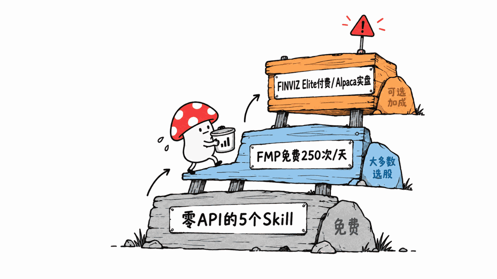
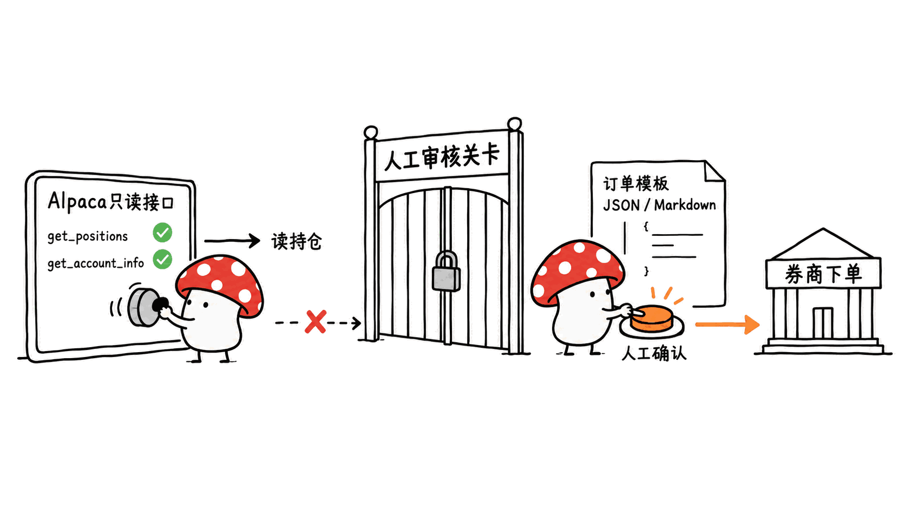
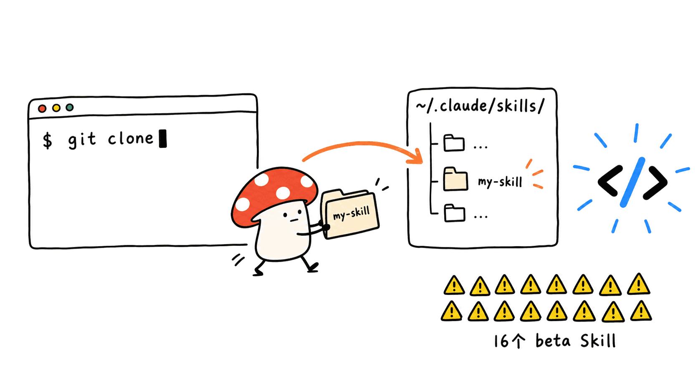

**BLUF**：`tradermonty/claude-trading-skills` 是一套跑在 Claude Code / Claude 网页版上的交易工作流 Skill 包，**2833 星、647 fork、MIT 协议**，仓库创建于 2025 年 10 月，本文核实时（2026-09-15）代码仍在每天提交。它把「选股—仓位计算—交易—复盘」拆成 **74 个独立 Skill**，分市场环境、核心仓位、波段机会、交易计划、交易记忆、策略研究六大领域，用 `skills-index.yaml` 统一登记依赖和状态。作者反复声明：这不是信号服务、不自动下单、不构成投资建议，Alpaca 只用来读持仓，下单模板需要人工在券商端确认。免费门槛不低——五个技能可以完全不用任何付费数据 API 跑起来，但选股类 Skill 大多要 Financial Modeling Prep（FMP）的免费 Key。风险主要不在「骗星」，而在 74 个 Skill 里有 16 个还是 beta 状态，以及一个会读取你本机 Claude Code 会话日志来挖掘新 Skill 想法的自动化流水线，用之前要弄清楚它读到了什么。

> 📌 一手资料
> 仓库：https://github.com/tradermonty/claude-trading-skills
> 技能索引：https://github.com/tradermonty/claude-trading-skills/blob/main/skills-index.yaml
> 文档站：https://tradermonty.github.io/claude-trading-skills/
> FAQ：https://github.com/tradermonty/claude-trading-skills/blob/main/docs/en/faq.md
> 伴生 Agent 包：https://github.com/tradermonty/hermes-trading-research-agent-work-package

---

## 为什么关注这个项目？

Claude Skills 上线之后，「用 Skill 包装一套专业工作流」成了一个明显的方向：把某个领域老手的检查清单、计算公式、复盘习惯，变成 Claude Code 能直接调用的可执行流程。`claude-trading-skills` 是这个方向里少见地把「交易」这个高风险领域也做进去的项目——而且做得比较克制：README 第一句就是「这不是把买卖决策外包给 AI」，作者 tradermonty 自称是先给自己用（"first for self, open for others"），后来才开源。

这类项目最容易踩的坑是两头：要么用回测收益率暗示"跟着做能赚钱"，要么打着"辅助工具"旗号实际接了实盘下单接口。我们花时间通读了完整 README、`skills-index.yaml`、FAQ 和两个具体 Skill 的源码，核实它到底落在哪一边。

## 这套东西到底是什么：74 个 Skill，六大领域

仓库的 `skills/` 目录下实际有 **74 个技能文件夹**，`skills-index.yaml` 是官方声明的"唯一权威索引"——如果 README 和索引打架，以索引为准，这个自我纠错声明本身就说明作者在认真维护一致性。GitHub API 统计显示其中 **58 个标记为 production，16 个是 beta**。六大领域大致是：

- **市场环境（Market Regime）**：市场宽度、上升趋势参与度、跟随日（Follow-Through Day）检测、宏观机制切换,大多靠免费公开 CSV 或 `yfinance`
- **核心仓位（Core Portfolio）**：股息股筛选、Alpaca 持仓分析、再平衡建议
- **波段机会（Swing Opportunity）**：VCP 形态筛选（Minervini 方法论）、CANSLIM 筛选、FinViz 筛选器
- **交易计划（Trade Planning）**：仓位计算器、纪律检查关卡（pre-trade-discipline-gate）、回撤熔断器
- **交易记忆（Trade Memory）**：交易日志、盘后复盘、周度绩效摘要
- **策略研究（Strategy Research）**：回测框架、"edge"策略生成与评审的多 Skill 流水线

值得一提的是"元工具"那一层：`data-quality-checker` 专门核对文档里的数字有没有单位或日期错误，`dual-axis-skill-reviewer` 用确定性打分 + 可选 LLM 深度评审给每个 Skill 打质量分。这种给 Skill 本身建质检流程的做法，在我们看过的开源 Skill 包里不算常见。

## 要不要花钱：三档 API 门槛

README 给出一个明确的「零付费 API」起步路径，五个 Skill 可以直接跑：`market-breadth-analyzer`、`uptrend-analyzer`（靠作者自己维护的公开 GitHub CSV）、`position-sizer`（纯计算）、`trader-memory-core`（本地 YAML 记账）、`signal-postmortem`（复盘框架）。但作者也提醒："没有 API"不等于"不需要外部数据"——这些 Skill 仍然要你自己喂公开 CSV、图表截图或本地文件。

再往上一档是 **FMP（Financial Modeling Prep）**，免费层每天 250 次请求，绝大多数选股类 Skill（CANSLIM、VCP、股息筛选、财报日历）都要它。真正要花钱的是两个：**FINVIZ Elite**（月费 39.5 美元或年费 299.5 美元，给股息筛选器加速预筛）是可选项；**Alpaca** 交易 API 免费提供纸面交易（paper trading）账户，`portfolio-manager` 这一个 Skill 要求必须接 Alpaca 才能跑。

## 会不会帮你自动下单？

这是我们核实的重点。答案是：**不会，而且作者在 FAQ 里专门用一整条否定它**——"Will a skill trade automatically or send broker orders? No."，并补充一句"即便某个 Skill 从 Alpaca 读取了持仓数据，也需要人工审查结果，并单独在券商端确认和执行任何交易"。

我们读了两个具体涉及 Alpaca 的 Skill 源码来验证这句话是否只是口号：

- `portfolio-manager` 的 SKILL.md 明确写着它调用的 MCP 工具是 `get_account_info`、`get_positions`、`get_portfolio_history`——全是只读接口；REST 回退方案的连接检测脚本也标注"不会创建报告文件，也不会下单"。
- `breakout-trade-planner` 生成的是"Alpaca API 兼容的订单模板"（JSON/Markdown 报告），但 SKILL.md 原话强调："这些模板是规划产物，不是券商授权（planning artifacts, not broker permission）"，如果计划可能触发当日多次交易或用到保证金，要求用户自行确认券商侧的日内交易限制——文中还引用了一个具体监管变化：FINRA 已从 2026-06-04 起用日内保证金标准取代旧的日交易者规则和 2.5 万美元最低权益要求，过渡期到 2027-10-20。这个细节说得很具体，说明作者确实在跟踪监管条款，而不是泛泛写「注意风险」。

真正需要用户自己留心的风险点，不在代码逻辑里，而在**账号权限配置**上：Alpaca 的 API Key 默认对纸面账户和实盘账户分别签发，`portfolio-manager` 读持仓这一步理论上不需要下单权限，但如果你直接把实盘 Key（而非 paper Key）配进 MCP 服务器，任何后续脚本改动或者你自己手滑追加的下单逻辑，权限上都是放行的。FAQ 第 9 条也提醒：密钥放环境变量或密钥管理器，别粘进 prompt、别提交进 Git，测试阶段优先用纸面凭据。这条建议是对的，但责任被明确甩给了用户自己做隔离，仓库本身不会替你强制限权。

## 坑在哪：beta 状态、伴生包、会读你会话日志的流水线

三个需要留意的地方：

1. **16 个 Skill 还是 beta**，包括 `manifoldbt-backtester`（Rust 回测引擎）、`mt5-robot-tester`（批量测 MetaTrader 5 EA）、几个 Stockbee 风格的筛选器和风控 gate。beta 状态本身不是问题，但如果你是照着"波段机会"这条推荐路径走，`vcp-screener` 是 production，配套的 `drawdown-circuit-breaker`（回撤熔断）和 `pre-trade-discipline-gate`（纪律关卡）却都是 beta——这两个恰恰是控制风险的那一环，用之前建议自己读一遍脚本逻辑，不要只看输出结果就当作可靠的风控保险丝。
2. **伴生的 Hermes Agent 包**把这些 Skill 封装成了 `/pre-market-routine`、`/after-close-review`、`/weekly-portfolio-review` 这类斜杠命令。README 特意强调它"不下单、不提供信号服务、不跑隐藏的定时任务"，但斜杠命令这种交互形式很容易让新手产生"一键自动化"的错觉，实际执行链路里每一步依然要人工按回车、看输出、做决定。
3. **仓库带一套"技能自我改进"流水线**：`skill-idea-miner` 会挖掘 Claude Code 的会话日志来生成新 Skill 的候选想法，作者也说明这是维护者向的工作流，不是给普通交易者用的日常步骤。如果你的会话日志里混着真实持仓、账户余额之类的敏感信息，接入这条流水线前要想清楚日志会被读到什么程度、存到哪里。

我们没有找到任何"回测收益率"或"历史胜率"的宣传数字——这本身是好事，说明作者没有用不可验证的收益承诺来吸引用户；但也意味着这些筛选器、评分模型的实际有效性，你只能自己拿历史数据跑一遍去验证，仓库不会替你背书。

## Mac 用户怎么装、适合什么水平

Claude Code 安装方式很直接，和这个仓库自己的约定一致：克隆整个仓库，把想用的 Skill 文件夹（比如 `backtest-expert`）复制到 `~/.claude/skills/`（全局）或项目内的 `.claude/skills/`；Claude Code 会自动检测已有 Skill 目录的变化，只有你是"新建"了顶层 skills 目录才需要重启会话。Claude 网页版走的是另一条路：从 `skill-packages/` 下载打包好的 `.skill` 文件，在设置里开启"代码执行和文件创建"，上传到 Customize > Skills。

适合谁：作者在 FAQ 里给的画像是"时间有限的个人投资者"——以长期持仓、ETF、股息股为核心，偶尔做纪律化波段交易的"卫星仓位"。它明确说自己不是为全自动交易、信号外包或短线剥头皮设计的。如果你连"什么是止损"都还没搞清楚，直接从 `vcp-screener` 或 `canslim-screener` 这类进阶筛选器下手会很吃力；更合理的路径是先跑零 API 的五个 Skill（市场宽度、趋势参与度、仓位计算、交易日志、复盘框架），熟悉了工作流再决定要不要接 FMP 或 Alpaca。

## 常见问题

### 这套 Skill 会替我下单吗？

不会。作者在 FAQ 里明确回答"不会"，`portfolio-manager` 只读 Alpaca 账户和持仓数据，`breakout-trade-planner` 只生成订单模板供人工在券商端手动确认执行，代码里没有下单接口调用。

### 免费能用到什么程度？

五个 Skill（市场宽度、趋势分析、仓位计算、交易记忆、复盘）完全不需要付费数据 API。往上一档大多数选股类 Skill 需要 FMP 免费层（每天 250 次请求）；FINVIZ Elite（月费 39.5 美元）和 Alpaca 实盘权限是可选加成，Alpaca 本身有免费的纸面交易账户可以先测。

### 里面的回测/胜率数据能信吗？

仓库本身没有对外宣传具体的回测收益率或历史胜率数字，这点比很多"量化选股"项目克制。但这也意味着每个 Skill 的筛选逻辑是否真的有效，需要你自己拿历史数据跑一遍验证，不能默认"开源代码=经过验证的策略"。

### 开源代码能直接拿去实盘用吗？

不建议。这是一套研究、筛选、记账和风控辅助工具，作者反复强调不构成投资建议。交易和投资有本金损失风险，历史回测、筛选结果和 AI 生成的分析都不保证未来收益，本文介绍的开源代码与工具仅供学习参考，不构成任何投资建议，实盘操作及其后果由使用者自行承担。

---

## 一手源

- 仓库主页：https://github.com/tradermonty/claude-trading-skills
- README（完整）：https://github.com/tradermonty/claude-trading-skills/blob/main/README.md
- 技能索引 skills-index.yaml：https://github.com/tradermonty/claude-trading-skills/blob/main/skills-index.yaml
- FAQ：https://github.com/tradermonty/claude-trading-skills/blob/main/docs/en/faq.md
- portfolio-manager SKILL.md：https://github.com/tradermonty/claude-trading-skills/blob/main/skills/portfolio-manager/SKILL.md
- breakout-trade-planner SKILL.md：https://github.com/tradermonty/claude-trading-skills/blob/main/skills/breakout-trade-planner/SKILL.md
- 文档站：https://tradermonty.github.io/claude-trading-skills/
- 伴生 Agent 包 Hermes：https://github.com/tradermonty/hermes-trading-research-agent-work-package
- GitHub API 元数据（star/fork/license/提交时间，核实于 2026-09-15）：https://api.github.com/repos/tradermonty/claude-trading-skills

---

> © 2026 Author: Mycelium Protocol. 本文采用 [CC BY 4.0](https://creativecommons.org/licenses/by/4.0/deed.zh) 授权——欢迎转载和引用，须注明作者姓名及原文链接，不得去除署名后以原创发布。

<!--EN-->

**BLUF**: `tradermonty/claude-trading-skills` is a trading-workflow skill suite for Claude Code / Claude web — **2,833 stars, 647 forks, MIT license**, created October 2025, and at the time of this review (2026-09-15) still receiving commits daily. It breaks "screen — size — plan — journal" into **74 standalone skills** across six areas (market regime, core portfolio, swing opportunity, trade planning, trade memory, strategy research), tracked centrally in `skills-index.yaml`. The author states repeatedly: this is not a signal service, it does not place orders automatically, and it is not investment advice. Alpaca is used only to read holdings; order templates require manual confirmation at the broker. The free tier is real but limited — five skills run with zero paid data API, but most screeners need a free Financial Modeling Prep (FMP) key. The real risk isn't "fake stars" — it's that 16 of the 74 skills are still beta, and there's a self-improvement pipeline that mines your local Claude Code session logs to generate new skill ideas, which you should understand before enabling.

> 📌 Primary sources
> Repository: https://github.com/tradermonty/claude-trading-skills
> Skills index: https://github.com/tradermonty/claude-trading-skills/blob/main/skills-index.yaml
> Docs site: https://tradermonty.github.io/claude-trading-skills/
> FAQ: https://github.com/tradermonty/claude-trading-skills/blob/main/docs/en/faq.md
> Companion agent package: https://github.com/tradermonty/hermes-trading-research-agent-work-package

---

## Why look at this project?

Since Claude Skills launched, "package a domain expert's workflow into a callable Skill" has become an obvious direction — turning someone's checklists, formulas, and review habits into something Claude Code can execute directly. `claude-trading-skills` is one of the rarer examples that takes on a genuinely high-stakes domain — trading — and does so with restraint: the README's first line is that this doesn't outsource buy/sell decisions to AI, and the author, tradermonty, describes it as "first for self, open for others" — built for personal use first, then open-sourced.

Projects like this usually fail in one of two directions: hyping backtest returns to imply "follow this and profit," or calling itself an "assistant" while actually wiring up live order execution. We read the full README, `skills-index.yaml`, the FAQ, and the source of two specific skills to check which side this one actually falls on.

## What it actually is: 74 skills, six areas

The `skills/` directory contains **74 skill folders**. `skills-index.yaml` is declared the "canonical source" — if the README or docs disagree with the index, the index wins, which itself signals the author is actively maintaining consistency. GitHub's API shows **58 skills marked production, 16 beta**. The six areas roughly are:

- **Market Regime**: breadth, uptrend participation, Follow-Through Day detection, macro regime shifts — mostly free public CSVs or `yfinance`
- **Core Portfolio**: dividend screeners, Alpaca-based holdings analysis, rebalancing suggestions
- **Swing Opportunity**: VCP pattern screening (Minervini methodology), CANSLIM screening, FinViz screener
- **Trade Planning**: position sizer, pre-trade discipline gate, drawdown circuit breaker
- **Trade Memory**: trade journaling, post-trade review, weekly performance digest
- **Strategy Research**: backtesting frameworks, a multi-skill pipeline for generating and reviewing "edge" strategies

Worth noting is the "meta-tooling" layer: `data-quality-checker` checks documents for unit or date mismatches; `dual-axis-skill-reviewer` scores every skill's quality using deterministic checks plus optional LLM review. Building a QA pipeline for the skills themselves is not something we've commonly seen in other open-source skill packs.

## What it costs: three tiers of API access

The README lays out a clear zero-paid-API starting path with five runnable skills: `market-breadth-analyzer` and `uptrend-analyzer` (backed by the author's own public GitHub CSVs), `position-sizer` (pure calculation), `trader-memory-core` (local YAML journaling), and `signal-postmortem` (review framework). The author is careful to add: "no API" doesn't mean "no external data" — you still need to supply public CSVs, chart screenshots, or local files.

The next tier is **FMP (Financial Modeling Prep)**, free tier at 250 requests/day, required by most screening skills (CANSLIM, VCP, dividend screeners, earnings calendar). Two things genuinely cost money: **FINVIZ Elite** ($39.50/month or $299.50/year, speeds up dividend-screener pre-filtering) is optional; **Alpaca**'s trading API offers a free paper-trading account, and `portfolio-manager` is the one skill that requires an Alpaca connection to run.

## Will it place orders for you?

This was the core thing we verified. The answer is **no — and the author dedicates an entire FAQ entry to denying it**: "Will a skill trade automatically or send broker orders? No," adding that "even when a skill reads portfolio data from Alpaca, a human must review the output and separately confirm and execute any trade with the broker."

We read the source of the two skills that actually touch Alpaca to check whether that's just a slogan:

- `portfolio-manager`'s SKILL.md explicitly lists the MCP tools it calls: `get_account_info`, `get_positions`, `get_portfolio_history` — all read-only. Its REST fallback connection-check script is also annotated: "does not create a report file or place orders."
- `breakout-trade-planner` produces "Alpaca API-compatible order templates" (JSON/Markdown reports), but its SKILL.md states plainly: "these templates are planning artifacts, not broker permission." If a plan could trigger same-day round trips or use margin, it tells users to confirm their broker's intraday controls themselves — and cites a specific regulatory detail: FINRA replaced the old pattern-day-trader day-count and $25,000 minimum-equity rule with intraday margin standards effective 2026-06-04, with broker phase-in allowed through 2027-10-20. That level of specificity suggests the author is actually tracking the regulation, not just writing a generic risk disclaimer.

The risk that actually needs a user's attention isn't in the code logic — it's **API key scoping**. Alpaca issues separate keys for paper and live accounts; reading positions in `portfolio-manager` doesn't in principle need order-placement permission, but if you wire a live (not paper) key into the MCP server, any later script change — or your own accidental addition of order logic — would have permission to act on it. FAQ #9 warns to keep credentials in environment variables or a secrets manager, never paste them into prompts or commit them, and prefer paper credentials while testing. That advice is correct, but it explicitly puts the isolation responsibility on the user — the repository itself does not enforce narrower permissions for you.

## Where the rough edges are: beta status, the companion package, and a pipeline that reads your session logs

Three things worth flagging:

1. **16 of 74 skills are still beta**, including `manifoldbt-backtester` (a Rust backtest engine), `mt5-robot-tester` (batch-testing MetaTrader 5 EAs), and several Stockbee-style screeners and risk gates. Beta status isn't inherently a problem, but if you follow the recommended "swing opportunity" path, `vcp-screener` is production while its companions `drawdown-circuit-breaker` and `pre-trade-discipline-gate` — the exact two skills meant to enforce risk control — are both beta. Read the script logic yourself before trusting them as a reliable risk fuse.
2. The **companion Hermes agent package** wraps these skills into slash commands like `/pre-market-routine`, `/after-close-review`, and `/weekly-portfolio-review`. Its README insists it "does not place orders, provide a signal service, or run hidden scheduled jobs," but slash commands as an interaction style can easily give beginners the impression of "one-click automation," even though every step in the execution chain still requires a human to press enter, read the output, and decide.
3. The repo also ships a **"skill self-improvement" pipeline**: `skill-idea-miner` mines Claude Code session logs to generate candidate skill ideas. The author notes this is a maintainer-facing workflow, not a step for everyday traders. If your session logs contain real holdings, account balances, or other sensitive data, think through what this pipeline will read and where it gets stored before enabling it.

We did not find any advertised backtest returns or historical win rates anywhere in the repository — which is itself a good sign, since it means the author isn't using unverifiable profit claims to attract users. But it also means the actual effectiveness of these screeners and scoring models is something you have to validate yourself against historical data; the repository does not vouch for it.

## Setting it up on a Mac, and who it's for

Installing into Claude Code is straightforward and matches this repo's own convention: clone the repository, then copy the skill folder you want (e.g. `backtest-expert`) into `~/.claude/skills/` (global) or `.claude/skills/` inside a project; Claude Code detects changes to an existing skills directory automatically, and only needs a restart if you just created the top-level skills directory. The Claude web app path is different: download a packaged `.skill` file from `skill-packages/`, enable "Code execution and file creation" in settings, and upload it under Customize > Skills.

Who it's for: the author's FAQ describes "time-constrained individual investors" whose core is long-term holdings, ETFs, and dividend stocks, with disciplined swing trading as an occasional satellite strategy. It explicitly says it is not designed for fully automated trading, signal outsourcing, or short-term scalping. If you don't yet know what a stop-loss is, jumping straight into advanced screeners like `vcp-screener` or `canslim-screener` will be rough going; a more sensible path is to run the five zero-API skills first (breadth, trend participation, position sizing, journaling, review), get comfortable with the workflow, and only then decide whether to connect FMP or Alpaca.

## FAQ

### Will this place orders for me?

No. The author's FAQ explicitly answers "no." `portfolio-manager` only reads Alpaca account and position data, and `breakout-trade-planner` only generates order templates for a human to confirm and execute manually at the broker — there is no order-placement API call in the code.

### How much can I use for free?

Five skills (market breadth, trend analysis, position sizing, trade memory, post-trade review) need zero paid data API. Beyond that, most screening skills need FMP's free tier (250 requests/day). FINVIZ Elite ($39.50/month) and live Alpaca access are optional add-ons; Alpaca itself offers a free paper-trading account you can test with first.

### Can I trust the backtest/win-rate numbers?

The repository does not publicize specific backtest returns or historical win rates anywhere — more restrained than many "quant screening" projects. But that also means whether each skill's screening logic actually works is something you need to validate yourself against historical data; you cannot assume "open source" equals "validated strategy."

### Can I use this code directly on a live account?

We would not recommend it as-is. This is a research, screening, journaling, and risk-review aid, and the author repeatedly states it is not investment advice. Trading and investing carry the risk of losing principal; backtests, screening results, and AI-generated analysis do not guarantee future returns. The open-source code and tools covered in this article are for learning purposes only, do not constitute investment advice, and any live trading and its consequences are the user's own responsibility.

---

## Primary Sources

- Repository: https://github.com/tradermonty/claude-trading-skills
- Full README: https://github.com/tradermonty/claude-trading-skills/blob/main/README.md
- skills-index.yaml: https://github.com/tradermonty/claude-trading-skills/blob/main/skills-index.yaml
- FAQ: https://github.com/tradermonty/claude-trading-skills/blob/main/docs/en/faq.md
- portfolio-manager SKILL.md: https://github.com/tradermonty/claude-trading-skills/blob/main/skills/portfolio-manager/SKILL.md
- breakout-trade-planner SKILL.md: https://github.com/tradermonty/claude-trading-skills/blob/main/skills/breakout-trade-planner/SKILL.md
- Docs site: https://tradermonty.github.io/claude-trading-skills/
- Companion agent package Hermes: https://github.com/tradermonty/hermes-trading-research-agent-work-package
- GitHub API metadata (stars/forks/license/commit times, verified 2026-09-15): https://api.github.com/repos/tradermonty/claude-trading-skills

---

> © 2026 Author: Mycelium Protocol. Licensed under [CC BY 4.0](https://creativecommons.org/licenses/by/4.0/) — free to share and adapt with attribution. You must credit the author and link to the original; removing attribution and republishing as original is not permitted.
