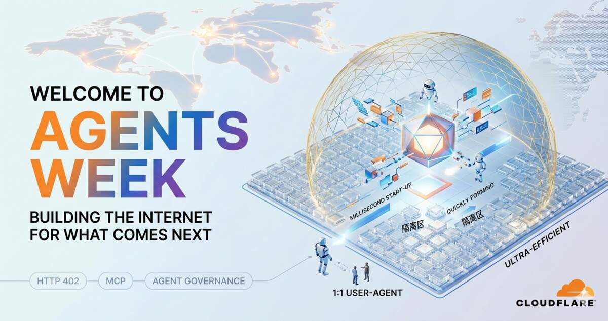

> **编者案**：AI 智能体的普及将带来算力需求的指数级增长——这不是假设，而是效率提升必然伴随的计算量暴涨。面对这一趋势，增量算力的供给呈现出两种截然不同的路径。
>
> **第一条路径**是传统的中心化云计算。以 Cloudflare 为代表的技术厂商正在从底层重构基础设施：从笨重的容器转向毫秒级启动的 V8 Isolates，为每个智能体提供轻量、隔离、安全的执行环境。这种方案适合需要全球化部署、弹性扩展的企业级应用。
>
> **第二条路径**则是去中心化的社区计算。正如 Mycelium 协议所倡导的，在地社区可以通过固定成本投入购置算力设备，以 24 小时运行的本地服务器为社区成员提供 AI 服务。对用户而言，这意味着透明的代码、可见的设备、确定性的隐私保护，以及——最关键的——局域网级别的千兆网速。视频渲染、大文件处理等任务不再需要往返云端，在"社区端"即可完成。不同社区可以依据自身需求设计差异化的服务模式和治理机制，形成真正属于在地居民的数字公共物品。
>
> 这两条路径并非对立，而是互补。未来的智能体生态，既需要 Cloudflare 这样的全球基础设施，也需要星罗棋布的社区计算节点。本文聚焦前者，带您深入理解 Cloudflare 为智能体时代构建的技术蓝图。

---

这篇文章是 Cloudflare 发布的 **"智能体周（Agents Week）"** 开篇致辞，主要探讨了互联网和云计算底层架构在迎接 AI 智能体（Agents）时代时所面临的挑战，以及 Cloudflare 为此构建的下一代基础设施。

> **Cloudflare 认为传统容器架构无法支撑智能体的海量扩展：为每个智能体分配一个完整容器成本过高，而基于 V8 Isolates 的 Cloudflare Workers 可毫秒级启动、极少内存占用，在相同硬件上运行海量短生命周期智能体在经济上可行。**
>
> **AI 智能体遵循"一对一"逻辑（一用户/一智能体/一任务），与传统"一对多"应用架构根本不同；Gartner 预测到 2026 年，五分之一的组织将使用 AI 消除至少一半的管理层级。**
>
> **Cloudflare 正联合发起 x402 基金会，复兴 HTTP 402 支付状态码，让智能体能够原生、合规地为其消费的资源付费——解决 AI 不看广告时内容创作者如何在智能体时代获得公平报酬的问题。**

以下是这篇文章的核心要点概述：

## 1. 从"一对多"应用到"一对一"智能体的范式转变

过去的互联网和云架构（如容器、微服务等）是为智能手机时代设计的，核心逻辑是"一对多"：一个应用服务成千上万的用户，通过复制应用来应对规模增长。然而，AI 智能体是"一对一"的（一个用户、一个智能体、一项任务）。每个智能体都需要一个独特的、由大语言模型（LLM）动态主导的独立执行环境。

## 2. 传统容器架构无法支撑智能体的海量扩展

如果未来数以亿计的用户每人同时运行多个智能体，现有的计算资源将面临数量级的巨大缺口。为每个智能体分配一个完整的传统容器（Container）成本过于高昂，且效率低下。

## 3. Isolates（隔离区）技术是智能体的理想基建

为了解决规模和成本问题，Cloudflare 认为基于 V8 Isolates 架构的计算模型（如 Cloudflare Workers）是完美的解决方案。相比于笨重、昂贵的容器，Isolates 可以在毫秒级启动、占用极少内存，并在任务完成后立刻销毁。这使得在相同硬件上运行海量、短生命周期的智能体在经济上成为可能。

## 4. 仍处于"无马马车"的过渡期

目前行业仍处于用旧基建硬套新技术的过渡阶段（例如让智能体使用无头浏览器去"看"专门为人类设计的网页，而不是直接使用协议交互）。Cloudflare 表示，他们将"双管齐下"：一方面继续支持并优化传统的容器沙盒（因为编程类智能体确实需要完整的文件系统和工具），另一方面大力构建为智能体量身定制的全新基础设施。

## 5. 将安全机制"内建"而非"外挂"

智能体将代办越来越多敏感的个人和企业任务（如读写代码、处理财务等）。传统的安全拦截手段已不适用。Cloudflare 正在整合其开发者平台与零信任（Zero Trust）平台，将身份验证、权限控制和防数据泄漏等安全机制直接内建于智能体的运行环境中。

## 6. 重塑互联网的经济与治理模型

传统的互联网经济依赖于"人类的注意力"（如看广告、点击弹窗等），但智能体不看广告。为了保证内容创作者和服务提供商在智能体时代依然能获得公平的报酬，Cloudflare 正在构建新的治理和支付工具（例如联合发起了 x402 基金会，复兴 HTTP 402 支付状态码），让智能体可以原生、合规地为其消费的资源付费。

## 7. 推动行业开放标准

智能体时代的到来需要全行业的协作。Cloudflare 正在积极参与和支持各项开放标准的制定，例如 Anthropic 推出的 MCP（模型上下文协议），致力于让智能体的身份认证、授权、支付和工具调用标准化。

---

**原文链接**：https://blog.cloudflare.com/welcome-to-agents-week/
