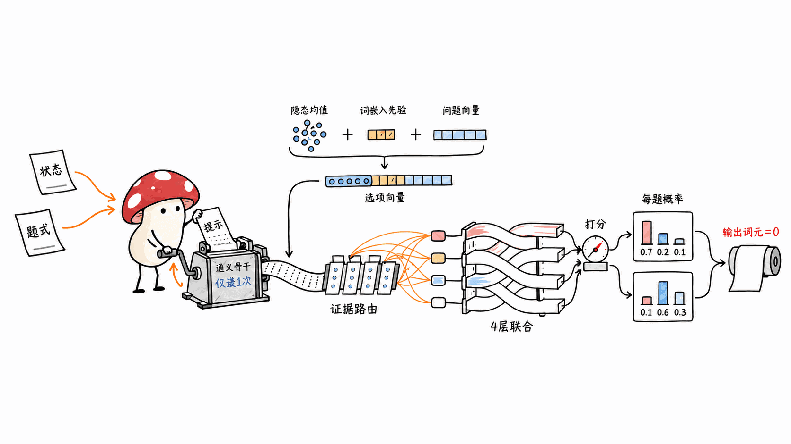
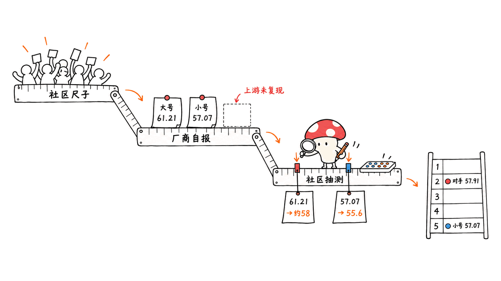
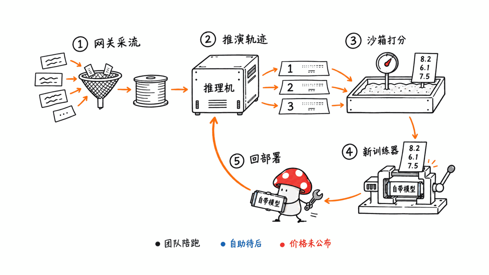
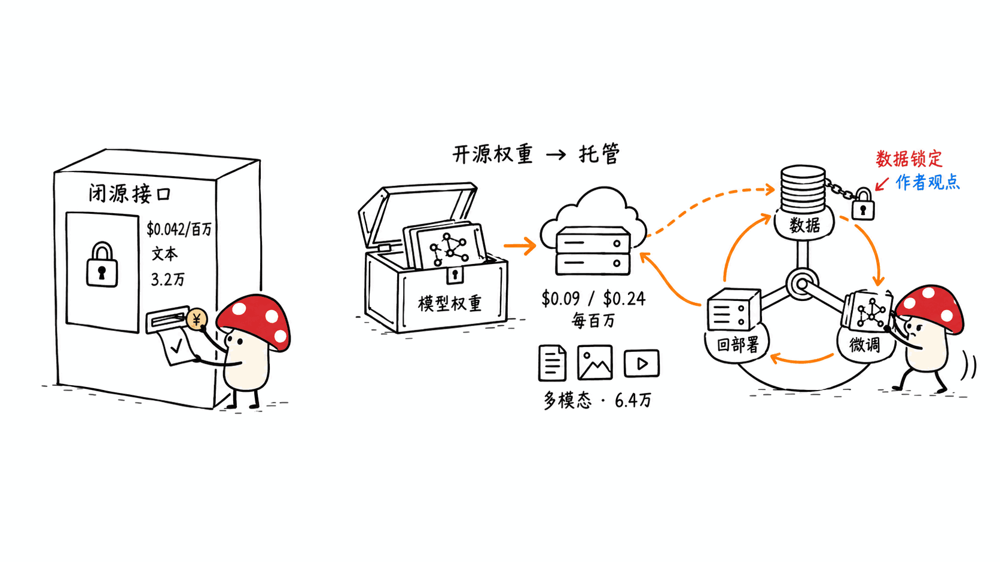

**BLUF**：Cloudflare 在 2026 年 10 月 1 日发布并开源了两款决策模型 **Clef**（Qwen3.8-27B 底座，safetensors 统计 273.6 亿参数）和 **Clef-flash**（Qwen3.5-9B 底座，94.1 亿参数），许可证都是 **Apache-2.0**。它们和 TypeSafe 的 Jev 一样不写字：读一段状态（文本、JSON、图片或视频）加一组类型化问题，**一次前向**给每个问题的每个选项出概率，输出 token 数恒为 0，并且自带一个 `systemone()` 函数直接吃 Jev 的 `/v1/systemone` 请求体。这是本站跟踪的 Jev 决策模型系列里，**第一个由大厂同时给出开放权重、托管 API 和 RL 微调服务的组合**。但有三件事要先说清楚：一，Cloudflare 宣传的「Decision Index 第一」是**它自己跑的**，社区榜单的上游维护者没有复现，社区在 Mac 上用 MLX 抽样复测，Clef 只有 57-58 分（官方 61.21），Flash 是 55.6（官方 57.07）；二，Workers AI 上的托管价是 **Flash $0.09、Clef $0.24 每百万输入 token**，分别是 Jev（$0.042）的 2.1 倍和 5.7 倍，它没在打价格战；三，所谓「RL 微调平台」眼下是 **FDE（前线部署工程师）陪跑服务**，自助平台是「之后」的事，没有公开价格。对 Mac 用户：16GB 机器用社区的 MLX 4-bit 版（6.21GB）能跑 Flash，**别用 GGUF**——那些包不带联合 schema 头，载进去只是一个会胡说的 Qwen。

> 📌 一手资料
> Cloudflare 官方博客：https://blog.cloudflare.com/clef-decision-models
> Clef-flash 模型卡：https://huggingface.co/Cloudflare/clef-flash
> Clef 模型卡：https://huggingface.co/Cloudflare/clef
> Workers AI 文档：https://developers.cloudflare.com/workers-ai/models/clef-flash/
> Cloudflare 的榜单页：https://clef-evals.workers-ai-mle.workers.dev
> 上游社区榜单：https://huggingface.co/spaces/multimodalart/jev-decision-index

---

## 为什么 Mycelium Protocol 要看这个模型？

TypeSafe AI 在 9 月 15 日发布闭源的 Jev 之后，本站陆续拆了一整串「开源复刻 Jev」的项目：读 logit 的 SemIf、块因果掩码的 Kev、读 logprobs 的 Bespoke Nimble、0.6B 的 AgentJev、Prefill-Only 的 LLM2Jev、基于 Reranker 的 KaLM-Jev、本地运行时 Ollaya。它们有一个共同点：**都是个人或小团队做的**，没有托管服务，也没人帮你按业务数据微调。

Clef 是第一个打破这个格局的。一家年营收以十亿美元计的基础设施公司，把权重用 Apache-2.0 放出来，同时在自家边缘 GPU 上托管，再配一个 RL 微调服务。这改变的不只是「哪个模型分最高」，而是**决策模型这门生意怎么做**。所以这篇要回答四个问题：它到底是什么；它的跑分该打几折；它怎么收钱；Mac 用户能不能用。

说明：本文数字取自 HuggingFace API、模型卡、`joint_schema_model.py` 源码、Cloudflare 官方博客、Workers AI 文档和榜单页的原始数据（`/data/leaderboard.json`），标「推算」「作者观点」的除外。**我们没有在本机实测 Clef**：本机是 16GB 内存的 M4 Mac mini，官方 bf16 权重 19.08GB 装不下，社区 MLX 4-bit 版也超过了我们给单次下载定的 5GB 上限。文中所有 Mac 上的速度数字都来自社区转换者的模型卡，不是我们测的。

## Clef 和 Clef-flash 到底是什么？

HF API 和模型卡给出的基本事实（2026-10-02 抓取）：

| | Clef | Clef-flash |
|---|---|---|
| 底座 | Qwen/Qwen3.8-27B | Qwen/Qwen3.5-9B |
| 参数（safetensors 元数据，BF16） | 27,356,728,560 | 9,409,813,744 |
| 仓库总体积 | 54.99 GB | 19.08 GB |
| 联合 schema 头文件 | 256.1 MB | 243.5 MB |
| 视觉编码器 | 有（27 层） | 有（27 层） |
| 骨干结构 | 64 层，每 4 层 1 层全注意力，其余线性注意力 | 32 层，同样 3:1 混合 |
| 许可证 | Apache-2.0（底座同为 Apache-2.0） | Apache-2.0 |
| HF 仓库创建 | 2026-09-30 21:15 UTC | 2026-09-30 21:15 UTC |
| HF likes / 下载（抓取时） | 376 / 18 | 125 / 18 |

日期核实：Cloudflare 博客署名日期是 **2026 年 10 月 1 日**，作者 Michelle Chen、Alex Reneau、Kevin Flansburg，属于 Birthday Week 系列；HF 仓库是 9 月 30 日 UTC 晚上建的（北京时间 10 月 1 日凌晨），10 月 1 日 15:23 UTC 最后更新。

线索里说「Flash 是 Qwen3.5-9B」——属实。大号 Clef 的参数量是 **27B**，不是有些转述里说的更大或更小。

几个容易被忽略的细节：

- **它是多模态的**。博客把这一点列为和 Jev 的第一个区别：「Jev 目前只做文本分类」。图片和视频帧通过 Qwen 自带的视觉塔进入同一次前向。
- **上下文**：博客说 64k（对比 Jev 的 32k），Workers AI 文档写 65,536 token。但开源代码里 `encode_record` 的 `max_length` **默认是 16,384**，超出会截断状态文本；本地要用长上下文得自己改参数，并承担相应的内存开销。
- **模型卡里唯一的测试环境**是「torch 2.11、transformers 5.10.2、单张 H200」。

## 它怎么做到「不生成文字」？

我们把 `joint_schema_model.py`（23KB，两个模型共用同一份，diff 完全一致）从头读了一遍。流程是：

1. **拼 prompt**：系统提示固定为「读完整个状态和 schema，联合决定每个字段，每个答案必须是该字段允许的选项之一」。然后是 `STATE:` 加状态文本（非字符串一律 `json.dumps` 并排序键），再是 `SCHEMA FIELDS:`，逐个列出问题 ID、类型、指令和每个选项的 `{"option_id", "description"}`。最后以一个空的 `<think></think>` 和 `JOINT SCHEMA DECISIONS:` 收尾——**关掉了 Qwen 的思考模式**。
2. **只做一次 prefill**：骨干跑一遍，`use_cache=False`，取最后一层隐状态。不解码任何 token。
3. **联合 schema 头**（`JointSchemaHead`，配置 width 1024、2 层证据路由、4 层 Transformer 解码层、16 头）：
   - 每个选项的向量 = 该选项 token 段的隐状态均值 + 该选项 token 的**词嵌入均值**（博客所说的 lexical prior）+ 所属问题的向量；
   - **证据路由**：选项向量对整段输入做交叉注意力，去原文里找支持自己的证据；
   - **跨字段联合**：每个问题汇总自己的选项后，再过 4 层解码层，问题之间互相看、也回看原文——所以叫「联合决定」，第一个问题的答案会影响第二个；
   - **打分**：先验分（选项词嵌入和问题向量的余弦）+ 门控后的联合分（余弦 + MLP 残差），每个选项一个 logit。
4. **每个问题内部 softmax**，就是概率。`systemone()` 再把它包装成 Jev 的响应格式：`choice` 给选中项、置信度和全部概率；`score` 给**期望分**（概率加权平均）；`noul` 给「真」的概率；`usage.output_tokens` 写死为 0。

博客对训练的描述：冻结底座，**联合训练路由头和 rank-256 的 LoRA**；损失是带标签平滑的交叉熵加 Brier 损失（为了校准）；数据是内部合成数据，打乱字段顺序、prompt 和 schema 结构；第二阶段用他们称为 **RLCD（Reinforcement Learning for Calibrated Decisions）** 的 RL 目标，给相邻档位部分分、奖励整条记录全对、加参考模型惩罚防分布漂移。发布的权重已经把 LoRA 合并进骨干。

一个值得留意的地方：RLCD 这个缩写在 TypeSafe 发布 Jev 时就被用来描述 Jev 的训练方式（见本站 Jev 文章），社区榜单上也有好几个名字带 RLCD 的模型。Cloudflare 博客说的是「we also developed RLCD」，没有说明和 TypeSafe 的 RLCD 是否同一方法、有无引用关系。我们无法确认，读者别把二者当成同一个东西。

## 跑分该打几折？

Cloudflare 博客说「Clef 目前是 Jev Decision Index 上的第一名」。这句话要拆三层看。

### 第一层：尺子是社区的，成绩是自己跑的

Decision Index 本身**不是** Cloudflare 编的。它是 HuggingFace 上 multimodalart 等人维护的社区榜单（Decision Index 0.2.1，44 个基准，分 5 个领域：知识推理 25.85%、语言理解 25.85%、检索分类 20.02%、工具自动化 18.28%、艺术与人类品味 10%；每项分数先按随机猜测水平做机会校正，金标基准权重 1.2）。

但 Clef 的成绩是 **Cloudflare 用这套基准自己跑的**。Cloudflare 自己的榜单页把它标成「Self-reported」，方法说明原文是：这些条目「由模型作者在同一基准上运行，**未被上游维护者复现**」，延迟「在作者自己的服务栈上测得，不是上游参考硬件（1 × NVIDIA RTX PRO 6000），**不可直接比较**」。我们核对了上游 Space 的 `index.json`（2026-09-28 生成，70 个模型），里面**没有 Clef**。

Cloudflare 能把这些写清楚是加分项，但媒体转述时「榜首」两个字后面的这些限定词往往会丢。

### 第二层：总分领先多少、领先在哪

Cloudflare 榜单页数据（`leaderboard.json`）的前五名：

| 排名 | 模型 | Decision Index | 来源 |
|---|---|---:|---|
| 1 | Clef | 61.21 | Cloudflare 自报 |
| 2 | Jev | 57.91 | 社区测（闭源 API） |
| 3 | Surogate Rune 26B-A4B v3 | 57.44 | 社区测 |
| 4 | Decider chat · Gemma-4-31B | 57.33 | 社区测 |
| 5 | **Clef-flash** | **57.07** | Cloudflare 自报 |

所以准确的说法是：**大号 Clef 自报比 Jev 高 3.3 分；Flash 自报排第 5，略低于 Jev**。线索里「Flash 领先」的印象，主要来自单项表格里加粗的那些数字。

按领域拆开，Clef 对 Jev 的优势集中在三块：检索分类 0.625 对 0.554、工具自动化 0.812 对 0.751、艺术品味 0.478 对 0.377；知识推理（0.512 对 0.514）和语言理解（0.612 对 0.620）基本持平或略输。Flash 的工具自动化最高（0.820），但语言理解只有 0.526，比 Jev 低近 10 个点。

### 第三层：单项高分要放在上下文里看

博客正文挑出来展示的是 10 个基准，**都是对决策场景重要、Clef 表现较好的**；完整的 43 项表在模型卡里。像 **BFCL 98.76**（Flash，函数调用 case 精确匹配）这种数字：同一行 Jev 是 95.75、Kev 9B 是 94.51，说明这个基准在顶部已经接近饱和，拉开的差距只有两三个点。

模型卡完整表里，Flash 有几处明显短板，博客正文表没放：

- **CLINC150+OOS**（含「超出范围」意图检测）：Flash 66.8，Clef 97.4，Jev 89.3——Flash 不擅长识别「这个请求不属于任何选项」
- **RAGTruth**（幻觉检测 F1）：Flash 35.6，Clef 79.4，Jev 76.5——如果你想用它判「这段回答有没有编造」，Flash 不合格
- **GPQA Diamond**：Flash 51.0 / Clef 48.0 / Jev 78.3；**BBH**：68.9 / 73.7 / 92.9；**MMLU-Pro**：65.3 / 65.9 / 82.7——难推理题上两款 Clef 都明显落后 Jev

另外两处值得注意的方法细节：

- Cloudflare 自报的两个条目都**缺了 2 个基准**（`missing: [40, 45]`），社区复现者指出是 HLE 和 iSarcasmEval，按榜单规则记 0 分——这其实压低了 Clef 的总分，算是对 Cloudflare 有利的反例。
- 榜单上社区测过的模型都有 ECE 和 Brier 校准指标（Jev 的 ECE 0.074），**Clef 两个条目的校准指标是空的**。博客说训练专门用了 Brier 损失来改善校准，但没给出可比的校准数字。

### 延迟对比不公平

博客说 Clef 中位延迟 209.3ms、Flash 38.8ms，Jev 524.1ms。但 Cloudflare 榜单数据里 Jev 那一行自带注释：「托管 API，从我们实验室发起的网络往返……与卡上单进程数字不可比」。也就是说，**Clef 的数字是自家服务栈上测的，Jev 的数字含公网往返**。Flash 的 38.8ms 本身可信度不低（9B 模型 prefill-only 合理），但「比 Jev 快 13 倍」不是同条件比较。

### 第三方复现：比官方低 1.5-4 分

目前能找到的独立复测来自社区 MLX 转换（mlx-community 的模型卡），用 Decision Index 0.2.1 官方工具包，按领域分层抽 2,000 条，HLE 和 iSarcasmEval 同样记 0：

| | 官方自报（全量） | MLX bf16 / 8-bit 抽样 | MLX 4-bit 抽样 | M5 Max 中位延迟（4-bit） |
|---|---:|---:|---:|---:|
| Clef-flash | 57.07 | 55.63（bf16） | 54.65 | 311 ms |
| Clef | 61.21 | 57.96（8-bit） | 57.02 | 1.03 s |

转换者自己的解释是抽样噪声（每个基准约 40 条，单项 ±10 分以上）和评测框架差异，而不是量化损失。这是一个抽样复测，不是全量复现，但它提示：**Clef 对 Jev 的 3.3 分领先，在独立环境下可能缩到 0 附近**。

## 托管怎么收费？比 Jev 便宜吗？

| | Clef-flash | Clef | Jev |
|---|---:|---:|---:|
| 每百万输入 token | **$0.09** | **$0.24** | $0.042 |
| 输出 token | 无（恒为 0） | 无 | 免费 |
| 上下文 | 65,536 | 65,536 | 32k（据 Cloudflare 博客） |
| 图片/视频输入 | 支持 | 支持 | 不支持（据 Cloudflare 博客） |
| 开放权重 | Apache-2.0 | Apache-2.0 | 闭源 |

Clef 的价格取自 Workers AI 定价页（2026-10-01 更新）：Flash 每百万输入 token 折合 8,182 neurons，Clef 折合 21,818 neurons，neuron 单价 $0.011/千个。Jev 的价格取自 TypeSafe 官网「$42 per billion input tokens」。

所以按 token 单价，**Clef-flash 是 Jev 的 2.1 倍，Clef 是 5.7 倍**。Cloudflare 没有在单价上压 Jev。

Workers AI 有每天 10,000 neurons 的免费额度。推算下来，Flash 每天大约能免费处理 **122 万输入 token**，Clef 约 **46 万**。按一个典型工单分类请求 500-1,000 token 估，Flash 一天能免费跑一千多次决策，个人项目试用够了。

博客还写了一句企业会在意的承诺：Cloudflare「不读取、不存储、不用你的请求和响应训练」，除非你主动用微调服务。

## 「RL 微调平台」到底是什么？

线索说 Cloudflare 推出了付费 RL 微调平台。读完博客原文，现状是：

- **现在能用的**：找 Cloudflare 的 **FDE 团队陪你做微调**（hands-on partner），面向「已经是这些产品客户」的设计合作伙伴。
- **以后才有的**：「从陪跑经验里学习，再做一个自助平台」，让客户自己采数据、微调、重新部署。
- **价格**：博客、Workers AI 文档和定价页里都**没有找到微调服务的价格**。

博客列出的平台拼图倒很清楚，全是 Cloudflare 已有产品：

1. **AI Gateway**——你的 AI 流量过网关，自动沉淀成请求数据集
2. **Workers AI**——用基础版 Clef 生成 rollout
3. **Containers**——RL 沙箱，给 agent 动作打分和回放
4. **Trainer**（新）——更新微调版 Clef 的权重
5. **Workers AI + BYO Model**——把微调后的模型重新部署回 Workers AI（博客提到这部分来自收购 Replicate 后的 Cog 工作）

内部用例：Trust & Safety 提交审核、支持工单分诊、Bot 产品里判断爬虫好坏。对外展示的用例是威胁情报团队用 Clef + Browser Run 给域名分类，从抓取、渲染到分类共 2.2 秒，对比他们最快的通用 LLM gpt-oss-120b 用了 4.7 秒、而且只返回了两个类别。

## 这门生意怎么算？

以下是**作者观点**，基于上面能核实的事实推演，不是 Cloudflare 的表态。

**一手源能证实的**：权重 Apache-2.0 开源；托管按 token 收费，且单价高于 Jev；微调先做 FDE 服务，后做自助；微调链路的每一环（Gateway、Containers、Trainer、BYO Model）都在 Cloudflare 平台上。

**我们的推断**：

- **模型本身不是卖点，数据飞轮才是**。开源权重让开发者零成本试、给 Clef 背书；托管价比 Jev 贵，说明 Cloudflare 没打算靠单次推理赚差价。真正的锁定点在微调链路：AI Gateway 把你的流量变成数据集，Trainer 在它的 GPU 上训，训出来的模型部署回 Workers AI。一旦你用业务数据做过一次 RL 微调，迁移成本就落在数据管道上，而不是模型上。
- **和 TypeSafe 的路线正面相反**。TypeSafe 拿了 4,000 万美元种子轮，Jev 闭源、走 API、早期需要排队申请；Cloudflare 把同一品类的模型直接开源，并且 API 完全兼容——任何 Jev 用户改一个 base URL 就能换。这相当于把「决策模型」从 TypeSafe 的护城河变成了 Cloudflare 平台的引流品。
- **差异化不在价格，在模态和部署形态**：图片/视频输入、64k 上下文、可本地私有化部署（Apache-2.0）、边缘 GPU 的网络延迟。这些都是 Jev 当前没有的。
- **风险**：自报成绩一旦被上游榜单复现后缩水，「比 Jev 更强」的叙事就站不住，剩下的卖点就是「开源 + 便宜的本地部署」——而那正是本站系列里一堆社区项目已经在做的事。

## 放进本站 Jev 系列里比较

社区 Decision Index 分数取自 Cloudflare 榜单页同步的上游数据（2026-09-28 快照）；Clef 两项为自报。

| 项目 | 类型 | 底座 / 体量 | Decision Index | 本站结论摘要 |
|---|---|---|---:|---|
| **Clef** | 大厂开源 + 托管 | Qwen3.8-27B | 61.21（自报） | 本文 |
| **Clef-flash** | 大厂开源 + 托管 | Qwen3.5-9B | 57.07（自报） | 本文 |
| Jev | 闭源 API | 未披露 | 57.91 | TypeSafe，$0.042/M 输入 |
| Bespoke Nimble 9B v2 | 开源权重 | Qwen3.5-9B LoRA | 39.57 | 读 logprobs，配方全公开 |
| Kev 9B / 4B | 开源权重 | Qwen LoRA | 38.48 / 34.64 | 块因果掩码，上限 8192 token |
| SemIf | 开源引擎 | 多种 | 25.94 | 读 logit，跨 CUDA/MLX/WebGPU |
| Laya（Ollaya 默认模型） | 开源小模型 | 4.2 亿参数 | 6.04 | 极快（5.8ms）但质量低 |
| AgentJev-0.6B / LLM2Jev / KaLM-Jev | 开源 | — | 未上榜 | 各有侧重，见对应文章 |

同样是 Qwen3.5-9B 底座，Clef-flash（57.07 自报）和 Nimble v2（39.57 社区测）差了 17 分以上。即便按 MLX 抽样复测的 55.6 算，差距依然很大——这主要是**专门的联合 schema 头 + 大规模合成数据 + RL** 和「LoRA 后读 logprobs」两种路线的差别，也反映了大厂在数据和算力上的投入差距。

相关文章：

- Jev 本体：https://blog.mushroom.cv/blog/typesafe-ai-jev-system-one-model-rlcd-decision-ai-enterprise/
- SemIf：https://blog.mushroom.cv/blog/semif-semantic-if-local-jev-decision-engine/
- Kev：https://blog.mushroom.cv/blog/kev-jaredpalmer-local-decision-model-jev-open-source-qwen-lora/
- Bespoke Nimble：https://blog.mushroom.cv/blog/bespoke-nimble-9b-open-decision-model-logprob-jev-rival/
- AgentJev：https://blog.mushroom.cv/blog/agentjev-0-6b-system-one-decision-model-qwen3/
- LLM2Jev：https://blog.mushroom.cv/blog/llm2jev-local-jev-api-prefill-only-binary-inference/
- KaLM-Jev：https://blog.mushroom.cv/blog/kalm-jev-local-judgment-engine-hardware-deploy/
- Ollaya：https://blog.mushroom.cv/blog/ollaya-local-decision-model-runtime-laya-jev-teardown/
- Jev 生态核查：https://blog.mushroom.cv/blog/jev-awesome-list-gold-rush-fact-check/

## Mac 能跑吗？要多大内存？

### 代码层面：不依赖 CUDA 专有 kernel

`joint_schema_model.py` 是纯 PyTorch：`load_release_model(path, device="cuda")` 的 `device` 参数可以改成 `"mps"` 或 `"cpu"`，头部全是标准的 `LayerNorm`、`MultiheadAttention`、`TransformerDecoderLayer`，没有自定义 CUDA 算子。

唯一要留意的是骨干。Qwen3.5 系列四分之三的层是线性注意力（Gated DeltaNet）。我们查了 transformers 主分支的 `modeling_qwen3_5.py`：快速路径会尝试从 Hub 加载 `fla` 和 `causal_conv1d` 的 kernel，**加载不到时有纯 PyTorch 的回退实现**（`torch_chunk_gated_delta_rule` 等）。所以理论上在 Apple Silicon 的 MPS 上能跑，只是会慢；官方只在 H200 上测过，**MPS 路径没有官方验证**。另外需要 transformers 5.x（模型卡测试版本是 5.10.2）。

### 内存：按机器挑版本

| 你的 Mac | 推荐版本 | 体积 | 说明 |
|---|---|---:|---|
| 16GB | mlx-community/clef-flash-4bit | 6.21 GB | 视觉塔保留 bf16，支持图片视频 |
| 16GB（只要文本） | TrevorJS/clef-flash-mlx-4bit | 5.3 GB | 去掉了视觉塔 |
| 32GB | mlx-community/clef-flash-8bit | 10.69 GB | 或官方 bf16 PyTorch + MPS（19GB 权重，余量偏紧） |
| 32GB（要大号） | mlx-community/clef-4bit | 16.33 GB | 社区抽样 57.02 分，M5 Max 上约 1 秒一次 |
| 64GB | mlx-community/clef-8bit | 29.78 GB | |
| 96-128GB | 官方 Clef bf16 | 54.99 GB | 加上激活和 16k 上下文 |

体积都是 HF tree API 返回的真实字节数。MLX 版本的做法是骨干量化、联合 schema 头（bf16）原样拷贝，配一个 `clef_mlx.py` 跑头部，不需要装 torch。我们粗读了 mlx-community 的 `clef_mlx.py`（551 行），只引入 mlx、numpy、huggingface_hub 和 mlx_vlm/mlx_lm，没有网络请求或 shell 调用。

### 最大的坑：GGUF 不是 Clef

HF 上已经有 bartowski、prithivMLmods 等人做的 Clef-flash GGUF（bartowski 一个仓库就有 25 个量化档、合计 140GB）。我们看了文件列表：**里面没有 `joint_head.safetensors`**。mlx-community 的模型卡说得很直接：Clef「不是聊天模型」，用 `mlx_vlm.generate`、`mlx_lm.generate` 或 LM Studio 载入只会得到骨干，「输出毫无意义的文字」。llama.cpp / Ollama 载入 GGUF 同理——你拿到的是一个被改过的 Qwen，不是决策模型。

### 速度预期

社区转换者在 **M5 Max（128GB）** 上测得：Flash 4-bit 中位 311ms，Clef 4-bit 1.03 秒。Cloudflare 托管的 Flash 自报中位 38.8ms。本地跑能拿到的是**隐私和零边际成本**，不是速度。16GB 的 M4 这种机器，预计会比 M5 Max 慢不少（我们没测，只是推断）。

## 什么情况该用它，什么情况别用？

- **适合**：工单分诊、路由、意图分类、函数/工具选择这类「工具自动化」和「检索分类」场景，这是 Clef 自报分数最强的两块；需要看图判断的场景（收据是否清晰、截图里是否有报错）——这是目前同类里少见的能力；数据不能出内网、需要本地部署的场景。
- **别用 Flash 做**：幻觉检测（RAGTruth 35.6）、超出范围意图识别（CLINC150+OOS 66.8）、难推理题判断（GPQA 51.0）。这些要么换大号 Clef，要么换 Jev，要么别交给决策模型。
- **本地最大长度**：默认 16,384 token，超出部分的状态会被直接截掉，不会报错（只有 schema 本身超长才报错）。长文档要么自己调 `max_length`，要么先摘要。

## 常见问题

**Clef 真的比 Jev 强吗？**
大号 Clef 在 Cloudflare 自己跑的 Decision Index 上是 61.21，Jev 是 57.91。但这是自报成绩，上游社区榜单没有复现；社区 MLX 抽样复测 Clef 8-bit 是 57.96，和 Jev 基本持平。Flash 自报 57.07，略低于 Jev。目前能说的是「同一档次」，不能说「明显更强」。

**能直接替换 Jev 吗？**
API 层面可以。开源代码里的 `systemone()` 接受 Jev `/v1/systemone` 的请求体并返回同格式响应；Workers AI 的调用示例也是同样的 `state` + `questions` 结构，三种题型 `noul` / `choice` / `score` 都支持。但质量分布不同（难推理题落后，工具类领先），替换前请用你自己的业务样本对比。

**托管比 Jev 便宜吗？**
不便宜。按每百万输入 token，Flash $0.09、Clef $0.24，Jev $0.042。Workers AI 每天有 10,000 neurons 免费额度，折合 Flash 约 122 万输入 token。

**RL 微调要多少钱？**
没有公开价格。目前是 FDE 团队一对一陪跑，面向已有产品客户的设计合作伙伴；自助平台尚未上线。

**16GB Mac 能跑吗？**
能跑 Flash 的 MLX 4-bit 版（6.21GB 含视觉塔，或 5.3GB 纯文本版）。官方 bf16 的 19GB 装不下。别用 GGUF，那些包缺联合 schema 头。

**能商用吗？**
权重是 Apache-2.0，底座 Qwen3.5-9B 和 Qwen3.8-27B 在 HF 上也标为 Apache-2.0，可以商用、可以改、可以再分发，保留许可证和声明即可。

## 一手源

- Cloudflare 官方博客：https://blog.cloudflare.com/clef-decision-models
- Clef-flash 模型卡：https://huggingface.co/Cloudflare/clef-flash
- Clef 模型卡：https://huggingface.co/Cloudflare/clef
- 源码：https://huggingface.co/Cloudflare/clef-flash/blob/main/joint_schema_model.py
- Workers AI · clef-flash：https://developers.cloudflare.com/workers-ai/models/clef-flash/
- Workers AI · clef：https://developers.cloudflare.com/workers-ai/models/clef/
- Workers AI 定价：https://developers.cloudflare.com/workers-ai/platform/pricing/
- Cloudflare 榜单页：https://clef-evals.workers-ai-mle.workers.dev
- 上游社区榜单 Decision Index：https://huggingface.co/spaces/multimodalart/jev-decision-index
- 社区 MLX 转换（含抽样复测）：https://huggingface.co/mlx-community/clef-flash-4bit
- 社区 MLX 转换（大号）：https://huggingface.co/mlx-community/clef-4bit
- TypeSafe 官网（Jev 价格）：https://typesafe.ai

> **开源仅供学习**：本文所涉模型和代码均来自公开仓库，分析仅供技术研究与学习交流；跑分数字除标注外均为发布方自报，请以你自己的业务数据复测为准。

---

> © 2026 Author: Mycelium Protocol. 本文采用 [CC BY 4.0](https://creativecommons.org/licenses/by/4.0/deed.zh) 授权——欢迎转载和引用，须注明作者姓名及原文链接，不得去除署名后以原创发布。

<!--EN-->

**BLUF**: On October 1, 2026, Cloudflare released and open-sourced two decision models, **Clef** (Qwen3.8-27B base, 27.36B parameters per the safetensors metadata) and **Clef-flash** (Qwen3.5-9B base, 9.41B parameters), both under **Apache-2.0**. Like TypeSafe's Jev, they do not write text: they read a state (text, JSON, images or video) plus a set of typed questions and, in **one forward pass**, return a probability for every option of every question. Output token count is always 0, and the release ships a `systemone()` function that takes a Jev `/v1/systemone` request body directly. In our running series on Jev-style decision models, this is **the first time a large company has shipped open weights, a hosted API and an RL fine-tuning service together**. Three things need saying up front. First, the "#1 on the Decision Index" claim is **Cloudflare's own run**; the upstream community board has not reproduced it, and a community MLX sample re-run on a Mac puts Clef at 57-58 (official: 61.21) and Flash at 55.6 (official: 57.07). Second, Workers AI hosting costs **$0.09 (Flash) and $0.24 (Clef) per million input tokens**, 2.1x and 5.7x Jev's $0.042, so this is not a price war. Third, the "RL fine-tuning platform" is today a **hands-on service from Cloudflare's FDE (forward-deployed engineering) team**; the self-serve platform comes "later" and has no published price. For Mac users: a 16GB machine can run Flash through the community MLX 4-bit build (6.21GB). **Do not use the GGUF files.** They lack the joint schema head, so what you load is a Qwen that produces nonsense.

> 📌 Primary sources
> Cloudflare blog: https://blog.cloudflare.com/clef-decision-models
> Clef-flash model card: https://huggingface.co/Cloudflare/clef-flash
> Clef model card: https://huggingface.co/Cloudflare/clef
> Workers AI docs: https://developers.cloudflare.com/workers-ai/models/clef-flash/
> Cloudflare's leaderboard page: https://clef-evals.workers-ai-mle.workers.dev
> Upstream community board: https://huggingface.co/spaces/multimodalart/jev-decision-index

---

## Why Is Mycelium Protocol Looking at This?

After TypeSafe AI launched the closed Jev on September 15, we covered a run of "open Jev clones": SemIf reads logits, Kev uses block-causal masking, Bespoke Nimble reads logprobs, AgentJev is a 0.6B model, LLM2Jev does prefill-only inference, KaLM-Jev is built on a reranker, and Ollaya is a local runtime. All of them came from **individuals or small teams**. None had hosting, and none offered to fine-tune on your business data.

Clef changes that. An infrastructure company with revenue in the billions has released weights under Apache-2.0, hosts them on its own edge GPUs, and adds an RL fine-tuning service. That affects more than who tops the leaderboard. It changes **how the decision-model business works**. This post answers four questions: what Clef is, how far to discount its scores, how Cloudflare makes money on it, and whether Mac users can run it.

Note: the numbers here come from the HuggingFace API, the model cards, the `joint_schema_model.py` source, Cloudflare's blog, the Workers AI docs and the raw data behind the leaderboard page (`/data/leaderboard.json`), except where marked "estimate" or "author's view". **We did not run Clef locally.** Our machine is a 16GB M4 Mac mini: the official 19.08GB bf16 weights don't fit, and even the community MLX 4-bit build is over our 5GB per-download limit. Every Mac speed figure below comes from community converters' model cards, not from us.

## What Exactly Are Clef and Clef-flash?

Basic facts from the HF API and model cards (fetched 2026-10-02):

| | Clef | Clef-flash |
|---|---|---|
| Base | Qwen/Qwen3.8-27B | Qwen/Qwen3.5-9B |
| Parameters (safetensors metadata, BF16) | 27,356,728,560 | 9,409,813,744 |
| Total repo size | 54.99 GB | 19.08 GB |
| Joint schema head file | 256.1 MB | 243.5 MB |
| Vision encoder | Yes (27 layers) | Yes (27 layers) |
| Backbone | 64 layers, 1 full-attention layer per 4, the rest linear attention | 32 layers, same 3:1 mix |
| License | Apache-2.0 (base also Apache-2.0) | Apache-2.0 |
| HF repo created | 2026-09-30 21:15 UTC | 2026-09-30 21:15 UTC |
| HF likes / downloads (at fetch time) | 376 / 18 | 125 / 18 |

On dates: the Cloudflare post is dated **October 1, 2026**, by Michelle Chen, Alex Reneau and Kevin Flansburg, as part of Birthday Week. The HF repos were created late on September 30 UTC (early October 1 in Beijing) and last updated October 1 at 15:23 UTC.

The tip that "Flash is Qwen3.5-9B" is correct. The large Clef is **27B**, not larger or smaller as some retellings suggest.

Some details that are easy to miss:

- **It is multimodal.** The blog lists this as the first difference from Jev: "Jev only does text classification today." Images and video frames go through Qwen's own vision tower in the same forward pass.
- **Context.** The blog says 64k (vs. Jev's 32k), and the Workers AI docs say 65,536 tokens. But in the open-source code, `encode_record` **defaults `max_length` to 16,384** and truncates the state beyond that. For long context locally, you have to raise the parameter yourself and pay for the extra memory.
- **The only tested setup in the model card** is torch 2.11, transformers 5.10.2 and a single H200.

## How Does It Avoid Generating Text?

We read `joint_schema_model.py` end to end. It is 23KB, and both models ship the identical file (the diff is empty). The flow:

1. **Build the prompt.** The system prompt is fixed: read the whole state and schema, decide every field jointly, and make each answer one of that field's allowed options. Then comes `STATE:` with the state text (non-strings are `json.dumps`-ed with sorted keys), then `SCHEMA FIELDS:`, listing each question's ID, type, instructions and a `{"option_id", "description"}` per option. It ends with an empty `<think></think>` and `JOINT SCHEMA DECISIONS:`, which **switches off Qwen's thinking mode**.
2. **One prefill only.** The backbone runs once with `use_cache=False`, and the head takes the last hidden states. No token is decoded.
3. **The joint schema head** (`JointSchemaHead`: width 1024, 2 evidence-routing layers, 4 Transformer decoder layers, 16 heads):
   - Each option vector is the mean hidden state of that option's tokens, plus the **mean word embedding** of those tokens (the "lexical prior" in the blog), plus its question's vector.
   - **Evidence routing**: option vectors cross-attend over the full input to find supporting evidence.
   - **Cross-field joint decoding**: each question summarizes its options, then 4 decoder layers let questions attend to each other and back to the input. That is the "joint" part: the answer to question 1 can affect question 2.
   - **Scoring**: a prior score (cosine between option embedding and question vector) plus a gated joint score (cosine plus an MLP residual), giving one logit per option.
4. **Softmax within each question** gives the probabilities. `systemone()` wraps them in Jev's response format. `choice` returns the pick, its confidence and all probabilities. `score` returns the **expected score** (the probability-weighted mean). `noul` returns the probability of true. `usage.output_tokens` is hard-coded to 0.

The blog describes training this way: the base is frozen, and the **routing head is trained jointly with rank-256 LoRA adapters**. The loss is label-smoothed cross-entropy plus a Brier loss for calibration. The data is internal and synthetic, with field order, prompts and schema structure shuffled. A second stage uses an RL objective they call **RLCD (Reinforcement Learning for Calibrated Decisions)**: partial credit for adjacent ordinal levels, a reward for fully correct records, and a reference penalty against distribution drift. The released weights have the LoRA merged into the backbone.

One thing to watch: the acronym RLCD was already used when TypeSafe launched Jev, to describe how Jev was trained (see our Jev article), and several community-board models have RLCD in their names. Cloudflare's post says "we also developed RLCD" and does not say whether it is the same method as TypeSafe's or cite it. We can't confirm either way, so don't treat them as the same thing.

## How Much Should You Discount the Scores?

Cloudflare's post says "Clef is currently the leader when evaluated against the Jev Decision Index." That claim needs to be unpacked in three layers.

### Layer one: the benchmark is the community's; the run is Cloudflare's

The Decision Index itself is **not** Cloudflare's invention. It is a community board on HuggingFace maintained by multimodalart and contributors. Version 0.2.1 has 44 benchmarks in 5 areas: Knowledge & Reasoning 25.85%, Language Understanding 25.85%, Retrieval & Classification 20.02%, Tools & Automation 18.28%, and Arts & Human Taste 10%. Each benchmark is chance-corrected, and gold benchmarks get weight 1.2.

But Clef's scores are **Cloudflare running that suite itself**. Cloudflare's own leaderboard page labels them "Self-reported". Its methodology text says these entries "were run by the model's authors on the same benchmark suite and **have not been reproduced by the upstream maintainers**", and that their latency "was measured on the authors' own serving stack, not the upstream reference hardware (1 x NVIDIA RTX PRO 6000), and is **not directly comparable**." We checked the upstream Space's `index.json` (generated 2026-09-28, 70 models). **Clef is not in it.**

Cloudflare deserves credit for disclosing this. But retellings that say "tops the leaderboard" tend to drop the caveats.

### Layer two: how big is the lead, and where does it come from?

Top five from the data behind Cloudflare's leaderboard page (`leaderboard.json`):

| Rank | Model | Decision Index | Source |
|---|---|---:|---|
| 1 | Clef | 61.21 | Self-reported by Cloudflare |
| 2 | Jev | 57.91 | Community-run (closed API) |
| 3 | Surogate Rune 26B-A4B v3 | 57.44 | Community-run |
| 4 | Decider chat · Gemma-4-31B | 57.33 | Community-run |
| 5 | **Clef-flash** | **57.07** | Self-reported by Cloudflare |

So the accurate statement is: **the large Clef self-reports 3.3 points above Jev; Flash self-reports fifth, slightly below Jev.** The impression that "Flash leads" comes mostly from the bolded cells in the per-benchmark table.

By area, Clef's lead over Jev comes from three places: Retrieval & Classification 0.625 vs 0.554, Tools & Automation 0.812 vs 0.751, and Arts & Human Taste 0.478 vs 0.377. In Knowledge & Reasoning (0.512 vs 0.514) and Language Understanding (0.612 vs 0.620) it is roughly level or slightly behind. Flash has the highest Tools score (0.820), but its Language score is only 0.526, nearly 10 points below Jev.

### Layer three: read the standout numbers in context

The blog body shows 10 benchmarks, **all of them relevant to decisions and strong for Clef**. The full 43-row table is in the model card. Take **BFCL 98.76** (Flash, function-calling case exact match): on the same row Jev scores 95.75 and Kev 9B 94.51. The benchmark is close to saturated at the top, so the gap is only two or three points.

The full table also shows clear weak spots for Flash that the blog body leaves out:

- **CLINC150+OOS** (includes out-of-scope intent detection): Flash 66.8, Clef 97.4, Jev 89.3. Flash is bad at recognizing "this request matches none of the options".
- **RAGTruth** (hallucination detection F1): Flash 35.6, Clef 79.4, Jev 76.5. If you want to ask whether an answer was made up, Flash is not good enough.
- **GPQA Diamond**: Flash 51.0 / Clef 48.0 / Jev 78.3. **BBH**: 68.9 / 73.7 / 92.9. **MMLU-Pro**: 65.3 / 65.9 / 82.7. On hard reasoning, both Clef models trail Jev clearly.

Two more methodology details:

- Both self-reported entries are **missing 2 benchmarks** (`missing: [40, 45]`). Community reproducers identify them as HLE and iSarcasmEval, which the board's rule scores as 0. That actually lowers Clef's total, so it cuts against Cloudflare.
- Every community-run model on the board has ECE and Brier calibration metrics (Jev's ECE is 0.074). **Both Clef entries leave calibration blank.** The blog says training used a Brier loss specifically for calibration, but it gives no comparable calibration number.

### The latency comparison isn't apples to apples

The blog gives median latencies of 209.3ms for Clef, 38.8ms for Flash and 524.1ms for Jev. But in Cloudflare's own leaderboard data, the Jev row carries a note: "Hosted API, network round-trip from our lab... Not comparable to the on-card single-process figures." In other words, **Clef was timed on Cloudflare's own serving stack, and Jev's figure includes a public-internet round trip.** Flash's 38.8ms is plausible on its own terms (prefill-only on a 9B model is fast), but "13x faster than Jev" is not a like-for-like comparison.

### Third-party reproduction: 1.5 to 4 points lower

The only independent re-test we found comes from the community MLX conversions (the mlx-community model cards). They used the official Decision Index 0.2.1 kit, took a stratified 2,000-row sample, and also scored HLE and iSarcasmEval as 0:

| | Official (full suite, self-reported) | MLX bf16 / 8-bit sample | MLX 4-bit sample | M5 Max median latency (4-bit) |
|---|---:|---:|---:|---:|
| Clef-flash | 57.07 | 55.63 (bf16) | 54.65 | 311 ms |
| Clef | 61.21 | 57.96 (8-bit) | 57.02 | 1.03 s |

The converter puts the gap down to sampling noise (about 40 rows per benchmark, so ±10+ points per benchmark) and harness differences, not quantization. It is a sample, not a full reproduction. But it suggests that **Clef's 3.3-point lead over Jev could shrink to roughly zero in an independent setup.**

## What Does Hosting Cost? Is It Cheaper Than Jev?

| | Clef-flash | Clef | Jev |
|---|---:|---:|---:|
| Per million input tokens | **$0.09** | **$0.24** | $0.042 |
| Output tokens | None (always 0) | None | Free |
| Context | 65,536 | 65,536 | 32k (per Cloudflare's blog) |
| Image/video input | Yes | Yes | No (per Cloudflare's blog) |
| Open weights | Apache-2.0 | Apache-2.0 | Closed |

Clef prices come from the Workers AI pricing page (updated 2026-10-01): Flash costs 8,182 neurons per million input tokens and Clef 21,818, at $0.011 per thousand neurons. Jev's price comes from TypeSafe's site: "$42 per billion input tokens".

Per token, **Clef-flash costs 2.1x Jev and Clef costs 5.7x.** Cloudflare is not undercutting Jev on unit price.

Workers AI includes 10,000 free neurons a day. By our estimate, that covers about **1.22 million input tokens a day for Flash** and about **0.46 million for Clef**. At 500 to 1,000 tokens per typical ticket-classification request, Flash gives you over a thousand free decisions a day, which is plenty for a side project.

The blog also makes a promise enterprises will care about: Cloudflare does "not read, store, or train on your requests or responses" unless you opt into the fine-tuning product.

## What Is the "RL Fine-Tuning Platform", Really?

The tip said Cloudflare launched a paid RL fine-tuning platform. Here is what the blog actually says:

- **Available now**: Cloudflare's **FDE team fine-tunes with you as a hands-on partner**, aimed at design partners who are "already customers of these products".
- **Coming later**: they will "learn from our hands-on experiences to build a self-serve platform" for capturing data, fine-tuning and redeploying.
- **Price**: we found **no price for the fine-tuning service** in the blog, the Workers AI docs or the pricing page.

The platform pieces are spelled out, and all of them are existing Cloudflare products:

1. **AI Gateway**: route your AI traffic through it and it builds a request dataset automatically
2. **Workers AI**: generate rollouts against the base Clef
3. **Containers**: the RL sandbox for scoring and replaying agent actions
4. **Trainer** (new): updates the fine-tuned Clef's weights
5. **Workers AI + BYO Model**: redeploy the fine-tuned model on Workers AI (the blog ties this to Cog work following the Replicate acquisition)

Internal use cases include Trust & Safety review, support-ticket triage, and good-bot/bad-bot calls in Bot products. The public example is the Threat Intelligence team classifying domains with Clef plus Browser Run. Fetching, rendering and classifying took 2.2 seconds. Their fastest general LLM, gpt-oss-120b, took 4.7 seconds and returned only two categories.

## How Does the Business Math Work?

What follows is the **author's view**, reasoned from the verifiable facts above. It is not Cloudflare's stated position.

**What the primary sources confirm**: weights are open under Apache-2.0; hosting is billed per token at a higher unit price than Jev; fine-tuning starts as an FDE service and goes self-serve later; and every step of the fine-tuning pipeline (Gateway, Containers, Trainer, BYO Model) runs on Cloudflare.

**Our inference**:

- **The model isn't the product; the data flywheel is.** Open weights let developers try it for free and give Clef credibility. Pricing above Jev suggests Cloudflare isn't trying to win on per-call margin. The real lock-in is the fine-tuning pipeline: AI Gateway turns your traffic into a dataset, Trainer trains on Cloudflare GPUs, and the result is deployed back to Workers AI. After one RL fine-tune on your business data, the switching cost sits in your data pipeline, not in the model.
- **It is the opposite of TypeSafe's strategy.** TypeSafe raised a $40M seed; Jev is closed, API-only and waitlisted early on. Cloudflare open-sourced a model in the same category with a fully compatible API, so any Jev user can switch by changing a base URL. That turns "decision model" from TypeSafe's moat into a traffic driver for Cloudflare's platform.
- **The differentiation is not price but modality and deployment**: image/video input, 64k context, private on-prem deployment (Apache-2.0), and edge-GPU network latency. Jev offers none of these today.
- **The risk**: if the upstream board reproduces the self-reported numbers and they shrink, the "stronger than Jev" story falls apart. What's left is "open source and cheap to run locally", which is exactly what a crowd of community projects in our series already do.

## Where It Sits in Our Jev Series

Community Decision Index scores are taken from the upstream data that Cloudflare's leaderboard page mirrors (2026-09-28 snapshot). Both Clef entries are self-reported.

| Project | Type | Base / size | Decision Index | Our summary |
|---|---|---|---:|---|
| **Clef** | Big-company open + hosted | Qwen3.8-27B | 61.21 (self-reported) | This post |
| **Clef-flash** | Big-company open + hosted | Qwen3.5-9B | 57.07 (self-reported) | This post |
| Jev | Closed API | Undisclosed | 57.91 | TypeSafe, $0.042/M input |
| Bespoke Nimble 9B v2 | Open weights | Qwen3.5-9B LoRA | 39.57 | Reads logprobs, full recipe public |
| Kev 9B / 4B | Open weights | Qwen LoRA | 38.48 / 34.64 | Block-causal masking, 8192-token cap |
| SemIf | Open engine | Various | 25.94 | Reads logits, CUDA/MLX/WebGPU |
| Laya (Ollaya's default) | Small open model | 0.42B | 6.04 | Very fast (5.8ms), low quality |
| AgentJev-0.6B / LLM2Jev / KaLM-Jev | Open | — | Not on board | See the individual posts |

On the same Qwen3.5-9B base, Clef-flash (57.07 self-reported) and Nimble v2 (39.57 community-run) are more than 17 points apart. The gap is still large using the MLX sample's 55.6. Mostly that is the difference between **a dedicated joint schema head plus large-scale synthetic data plus RL** and "LoRA, then read logprobs". It also reflects how much more data and compute a large company can put in.

Related posts:

- Jev itself: https://blog.mushroom.cv/blog/typesafe-ai-jev-system-one-model-rlcd-decision-ai-enterprise/
- SemIf: https://blog.mushroom.cv/blog/semif-semantic-if-local-jev-decision-engine/
- Kev: https://blog.mushroom.cv/blog/kev-jaredpalmer-local-decision-model-jev-open-source-qwen-lora/
- Bespoke Nimble: https://blog.mushroom.cv/blog/bespoke-nimble-9b-open-decision-model-logprob-jev-rival/
- AgentJev: https://blog.mushroom.cv/blog/agentjev-0-6b-system-one-decision-model-qwen3/
- LLM2Jev: https://blog.mushroom.cv/blog/llm2jev-local-jev-api-prefill-only-binary-inference/
- KaLM-Jev: https://blog.mushroom.cv/blog/kalm-jev-local-judgment-engine-hardware-deploy/
- Ollaya: https://blog.mushroom.cv/blog/ollaya-local-decision-model-runtime-laya-jev-teardown/
- Jev ecosystem fact check: https://blog.mushroom.cv/blog/jev-awesome-list-gold-rush-fact-check/

## Can a Mac Run It, and How Much Memory Does It Need?

### In the code: no CUDA-only kernels

`joint_schema_model.py` is plain PyTorch. In `load_release_model(path, device="cuda")` the `device` argument can be `"mps"` or `"cpu"`. The head uses only standard `LayerNorm`, `MultiheadAttention` and `TransformerDecoderLayer` modules, with no custom CUDA ops.

The backbone is the one thing to check. Three quarters of the layers in Qwen3.5 models are linear attention (Gated DeltaNet). We read `modeling_qwen3_5.py` on transformers main: the fast path tries to load `fla` and `causal_conv1d` kernels from the Hub, and **when it can't, it falls back to pure-PyTorch implementations** (`torch_chunk_gated_delta_rule` and friends). So in principle it runs on Apple Silicon via MPS, just slowly. Cloudflare only tested on an H200, and **the MPS path is not officially validated**. You also need transformers 5.x (the model card tested 5.10.2).

### Memory: pick a build for your machine

| Your Mac | Recommended build | Size | Notes |
|---|---|---:|---|
| 16GB | mlx-community/clef-flash-4bit | 6.21 GB | Vision tower kept in bf16; images and video work |
| 16GB (text only) | TrevorJS/clef-flash-mlx-4bit | 5.3 GB | Vision tower removed |
| 32GB | mlx-community/clef-flash-8bit | 10.69 GB | Or official bf16 PyTorch on MPS (19GB of weights, tight) |
| 32GB (want the big one) | mlx-community/clef-4bit | 16.33 GB | Community sample: 57.02; about 1 s per call on M5 Max |
| 64GB | mlx-community/clef-8bit | 29.78 GB | |
| 96-128GB | Official Clef bf16 | 54.99 GB | Plus activations and 16k context |

All sizes are actual byte counts from the HF tree API. The MLX builds quantize the backbone, copy the bf16 joint schema head unchanged, and ship a `clef_mlx.py` that runs the head without torch. We skimmed mlx-community's `clef_mlx.py` (551 lines): it imports only mlx, numpy, huggingface_hub and mlx_vlm/mlx_lm, with no network calls or shell execution.

### The biggest trap: a GGUF is not Clef

HF already has Clef-flash GGUFs from bartowski, prithivMLmods and others; bartowski's repo alone has 25 quant levels totalling 140GB. We checked the file lists: **there is no `joint_head.safetensors`**. The mlx-community card says it plainly: Clef "is not a chat model", and loading it with `mlx_vlm.generate`, `mlx_lm.generate` or LM Studio gives you only the backbone, which will "produce meaningless text". The same goes for loading a GGUF in llama.cpp or Ollama. What you get is a modified Qwen, not a decision model.

### What speed to expect

The community converter measured on an **M5 Max (128GB)**: Flash 4-bit median 311ms, Clef 4-bit 1.03 s. Cloudflare's hosted Flash self-reports a 38.8ms median. Running locally buys you **privacy and zero marginal cost**, not speed. A 16GB M4 like ours should be noticeably slower than an M5 Max (an inference on our part; we did not test it).

## When Should You Use It, and When Not?

- **Good fit**: ticket triage, routing, intent classification and function/tool selection, i.e. the Tools & Automation and Retrieval & Classification areas where Clef's self-reported scores are strongest. Also image-based checks (is the receipt legible, does the screenshot show an error), which few models in this category can do. Also any case where data can't leave your network and you need on-prem deployment.
- **Don't use Flash for**: hallucination detection (RAGTruth 35.6), out-of-scope intent detection (CLINC150+OOS 66.8) or hard-reasoning judgments (GPQA 51.0). Use the large Clef or Jev instead, or don't hand these to a decision model at all.
- **Local length limit**: the default is 16,384 tokens. State beyond that is silently truncated; only an oversized schema raises an error. For long documents, raise `max_length` yourself or summarize first.

## FAQ

**Is Clef really stronger than Jev?**
On the Decision Index as run by Cloudflare, the large Clef scores 61.21 and Jev 57.91. That is self-reported and not reproduced by the upstream community board. A community MLX sample re-run puts Clef 8-bit at 57.96, roughly level with Jev. Flash self-reports 57.07, slightly below Jev. The fair summary is "same tier", not "clearly stronger".

**Can it replace Jev directly?**
At the API level, yes. The open-source `systemone()` accepts a Jev `/v1/systemone` request body and returns a response in the same format. The Workers AI example uses the same `state` + `questions` structure and supports all three question types: `noul`, `choice` and `score`. But quality is distributed differently (behind on hard reasoning, ahead on tools), so compare on your own business samples before switching.

**Is hosting cheaper than Jev?**
No. Per million input tokens, Flash is $0.09 and Clef $0.24; Jev is $0.042. Workers AI includes 10,000 free neurons a day, about 1.22 million input tokens for Flash.

**What does RL fine-tuning cost?**
No price has been published. Today it is a one-on-one engagement with the FDE team for design partners who already use Cloudflare's products. The self-serve platform has not launched.

**Can a 16GB Mac run it?**
It can run Flash in the MLX 4-bit build (6.21GB with the vision tower, or 5.3GB text-only). The official 19GB bf16 weights won't fit. Avoid GGUFs, which lack the joint schema head.

**Can I use it commercially?**
The weights are Apache-2.0, and the bases (Qwen3.5-9B and Qwen3.8-27B) are also tagged Apache-2.0 on HF. You can use, modify and redistribute commercially as long as you keep the license and notices.

## Primary Sources

- Cloudflare blog: https://blog.cloudflare.com/clef-decision-models
- Clef-flash model card: https://huggingface.co/Cloudflare/clef-flash
- Clef model card: https://huggingface.co/Cloudflare/clef
- Source code: https://huggingface.co/Cloudflare/clef-flash/blob/main/joint_schema_model.py
- Workers AI · clef-flash: https://developers.cloudflare.com/workers-ai/models/clef-flash/
- Workers AI · clef: https://developers.cloudflare.com/workers-ai/models/clef/
- Workers AI pricing: https://developers.cloudflare.com/workers-ai/platform/pricing/
- Cloudflare leaderboard page: https://clef-evals.workers-ai-mle.workers.dev
- Upstream community Decision Index: https://huggingface.co/spaces/multimodalart/jev-decision-index
- Community MLX conversion (with sample re-test): https://huggingface.co/mlx-community/clef-flash-4bit
- Community MLX conversion (large model): https://huggingface.co/mlx-community/clef-4bit
- TypeSafe site (Jev pricing): https://typesafe.ai

> **Open source, for learning only**: the models and code discussed here come from public repositories, and this analysis is for technical research and learning. Unless marked otherwise, benchmark figures are self-reported by the publisher; re-test on your own business data.

---

> © 2026 Author: Mycelium Protocol. Licensed under [CC BY 4.0](https://creativecommons.org/licenses/by/4.0/) — free to share and adapt with attribution. You must credit the author and link to the original; removing attribution and republishing as original is not permitted.
