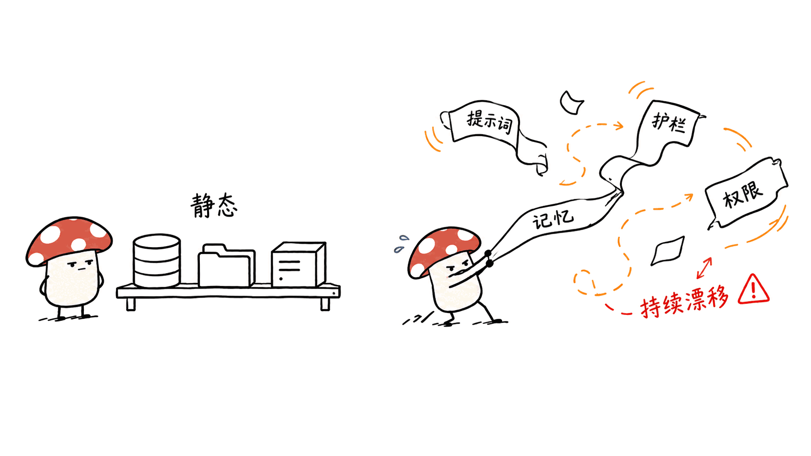
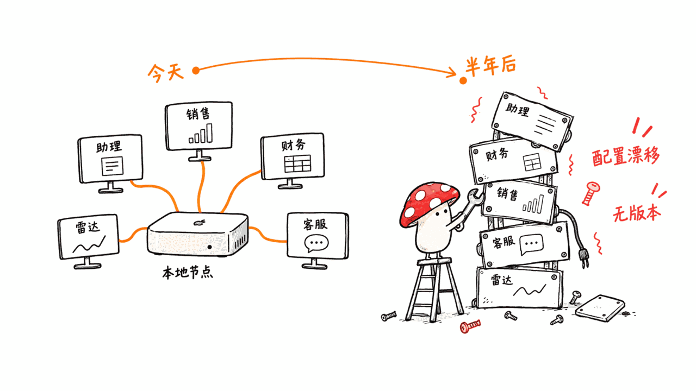
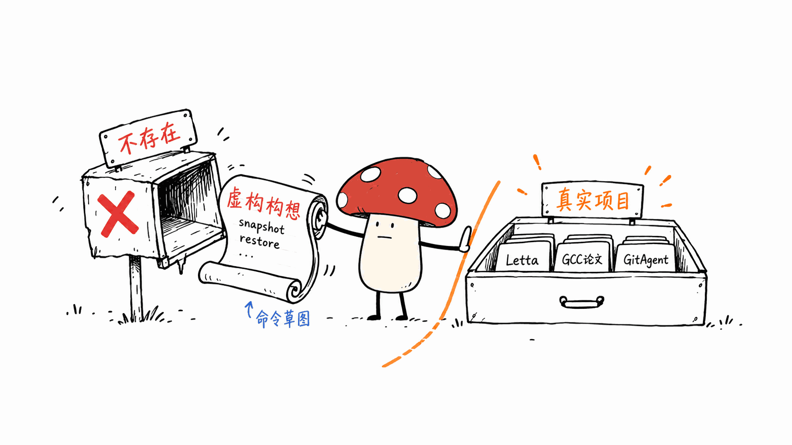
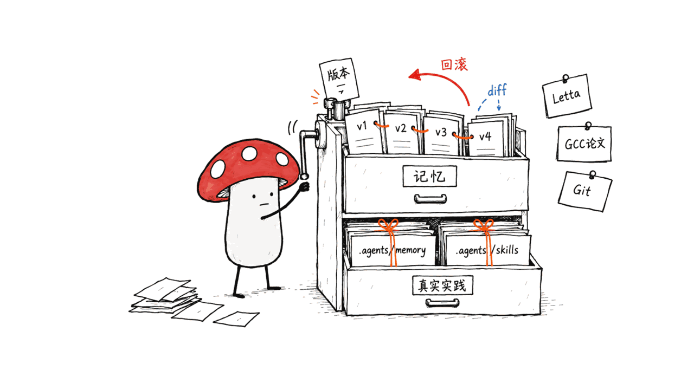

> 📌 一手源：Cohesity 官方新闻稿 + 产品说明博客（均发布于 2026-09-16）
> 状态核实：**未 GA**，目前仅限部分客户、仅支持 AWS Bedrock，年底才正式发布

---

**BLUF**：2026-09-16，企业数据管理厂商 Cohesity 发布 **Agent Resilience**，第一次把"备份恢复 AI Agent 本身的运行状态"当成一个独立产品能力来做——不是备份 Agent 用的数据库或文件，而是备份 Agent 的**记忆、系统提示词/人设、护栏规则、凭据权限、工作流上下文**这些决定它"是不是还是那个 Agent"的东西。我们核实了 Cohesity 官方新闻稿和产品说明博客两篇一手源：**目前只支持 Amazon Bedrock AgentCore/Bedrock Agents，微软和谷歌平台确实在路线图上但还没做**；更关键的是，**它还不是正式产品**，只对"部分客户"开放，GA 计划在 2026 年底，定价未公开。这条信号本身是真的，但传播中容易被简化成"Cohesity 已经能备份任意 Agent 了"——不是。本文另外核实了一个常被搭售的说法：某些二手报道把这类能力和"给 Agent 装 Git 版本控制"类比，我们找到了这个类比背后确实存在的开源实践（Letta 的 Context Repositories、Git Context Controller 论文），但那是另一批项目在做的事，跟 Cohesity 无关。

这条选题来自我们的 daily-crawler 构想日报（S2 条目），日报里提到的 `agent-state-bundle`、`agent-state snapshot/diff/verify/restore` 命令是日报作者自己设想的产品方向，**不存在这样一个开源项目**，本文会明确标出这一点。

## Cohesity 到底发布了什么？



先把该问的问题过一遍：什么时候？谁说的？覆盖到哪？是不是能用？

| 问题 | 核实结果 |
|---|---|
| 发布时间 | 2026-09-16，官方新闻稿明确写了这个日期 |
| 现在支持什么 | Amazon Bedrock AgentCore、Amazon Bedrock Agents |
| 路线图上有什么 | 微软、谷歌的 Agent 平台（官方博客未给出时间表） |
| 是否 GA | **不是**。目前"对部分客户开放"，GA 目标是 2026 年底 |
| 保护对象 | Agent 记忆（对话历史/学到的上下文）、配置（系统提示词、人设）、护栏规则、工具/服务的凭据与权限、工作流与运行时上下文、Agent 连接的数据库和文件系统、Agent 之间的依赖拓扑 |
| 技术路径 | 三步：自动发现并把关联资源映射成"Application Group" → 对 Agent 的核心行为组件做持续保护 → 支持从已知可信的历史时间点做时间点恢复 |
| 定价 | 未公开，要联系 Cohesity 客户经理 |
| 客户证言 | Cognizant 的 Srikanth Kuntamukkala 给了一段使用场景证言，但没有正式合作公告 |

这些细节两篇一手源互相印证：新闻稿偏营销语言（"discover, protect, and recover the infrastructure behind enterprise AI agents"），产品博客给出了稍具体的技术描述（发现依赖拓扑 → 持续保护核心行为组件 → 时间点恢复），但都没有给出恢复延迟、快照频率、加密方式、跨区域复制这些运维会关心的硬指标——这是一次产品发布公告，不是技术白皮书。

## 为什么"恢复 Agent 本身"是个新问题？

传统企业灾备的对象是数据库、文件、虚拟机、应用配置——这些东西的"正确状态"相对静态，恢复到某个快照，业务逻辑不会变。

Agent 不一样。一个跑了几个月的 Agent，它的"人格"分散在好几个会漂移的地方：

```text
系统提示词/人设   —— 可能被一次不小心的编辑改写
记忆/上下文        —— 可能被污染的输入长期累积错误认知
工具权限/凭据      —— 可能因为一次误操作被过度授权或失效
工作流/技能版本    —— 可能因为依赖升级而行为突变
```

只恢复底层的应用或数据库，恢复出来的还是同一套代码，但**可能不是同一个"可信的 Agent"**——这正是 Cohesity 产品博客用的措辞：把 Agent 恢复到"已知可信的历史状态"（known-good recovery point），而不只是恢复基础设施。这个问题定义本身是站得住的，不管做出来的产品是否成熟。

## 跟本地部署的 AI 员工有什么关系？



Cohesity 这次做的是企业级、云端 Agent 平台（先是 AWS Bedrock）的备份恢复，跟小微企业自己在 Mac mini 上跑的本地 AI 员工，目前离得还很远——它甚至还没覆盖 Azure/GCP，更不用说本地部署。但这个问题定义本身对本地场景一样成立，而且更早就会碰到：

一个本地 AI 节点常见配置是：老板助理 + 财务对账 Agent + 销售跟进 Agent + 客服 Agent + 定时雷达任务 + 本地文档/公司记忆 + 一堆 Skill 和 MCP 连接器。半年之后，如果没人专门管这套配置的版本，想把它完整复原到"上周还工作正常"的那个状态，靠记忆是靠不住的。

这恰好是本仓库自己在做的事，可以当一个真实的小规模案例：Skill 定义（`.agents/skills/`）随代码库一起提交进 git；记忆（`.agents/memory/`）是另一个私有仓库的 clone，靠专门脚本同步；配置（`config/users/`）也是普通文本文件、随 git 走。换句话说，**"把 Agent 的可运行状态当成可版本化的文本"这条路径，不需要等企业级产品，现在用 git 就能自己搭**——只是这套东西目前没有一个统一的、覆盖"快照/对比/校验/回滚"全流程的成熟工具，各家都是自己拼。

## 日报里的 `agent-state-bundle` 是什么？——一个构想，不是现成工具



需要明确说一句：我们的 daily-crawler 构想日报在这条信号下面，提出了一个假想的开源项目——`agent-state-bundle` + `agent-recovery-check`，配了一套设想中的命令行：

```text
agent-state snapshot
agent-state diff snapshot-A snapshot-B
agent-state verify snapshot-A
agent-state restore snapshot-A --dry-run
```

**这是日报作者对"这个方向可以怎么做"的产品构想，不对应任何真实存在的开源仓库。** 我们没有找到任何叫这个名字、做这件事的项目。日报本身的定位就是"构想线索"，不是一手信息源，这点在我们的写稿规范里是明确要求核实和标注的，这里照做。

## 现在真正存在的、可以类比的开源实践



放下这个虚构命令行，市面上确实已经有人在做"把 Agent 状态当版本化数据"这件事，只是切入点和 Cohesity 的"企业灾备"不同，更偏"AI 编程/知识管理 Agent 的记忆版本控制"：

- **Letta 的 Context Repositories**：把 Agent 的上下文管理重做成基于 git 的版本化机制，每次记忆变更都会自动生成一条带说明的提交记录，本质是给记忆加 diff/回滚能力。
- **Git Context Controller（论文，arXiv 2508.00031）**：把 Agent 记忆组织成一个版本化文件系统，让 Agent 能管理长期目标、跨会话恢复推理状态、协调多轨迹问题求解。
- **GitAgent** 一类项目：把身份、记忆、规则、Skill 都存成 git 仓库里的纯文本文件，天然带分支、PR、协作能力。

这些项目解决的是"记忆"这一层，跟 Cohesity 想覆盖的"记忆 + 权限 + 依赖拓扑 + 云端基础设施"这个更完整的企业级范围相比，是子集而不是替代品。但对个人和小团队来说，**这个子集已经够用**：本文开头提到的本仓库自己的 `.agents/memory` + `.agents/skills` 双仓库结构，走的正是同一条思路，成本几乎是零。

## 本地 AI 节点现在该做点什么？

不需要等 Cohesity 覆盖到本地部署，几件事现在就能做：

1. **把 Skill/配置纳入版本控制**——它们本来就是文本文件，直接进 git，天然获得 diff 和回滚。
2. **给"记忆"单独建一条备份路径**——如果记忆存在向量库、SQLite 或本地文件里，至少要有定期快照，哪怕只是简单的目录级复制（对照 mcp-rag-server 那类项目，我们之前也提到过"备份就是复制这个目录"是最低成本的做法）。
3. **权限和凭据单独审计**——不要跟记忆/配置混在一个备份包里，凭据本身不应该被明文快照，只快照"引用"，这点 Cohesity 的产品说明里也强调了（"credential references, not plaintext secrets"这个原则值得直接照抄）。
4. **定期跑一次"恢复演练"**——不是备份完就完事，而是真的从快照恢复一次，跑一遍验收测试，确认恢复出来的 Agent 行为符合预期。

## 常见问题

**Q：Cohesity Agent Resilience 现在能买吗？**
A：不能直接买。官方口径是"面向部分客户开放"，GA 计划在 2026 年底，定价要联系客户经理。

**Q：它支持哪些平台？**
A：目前只有 Amazon Bedrock AgentCore 和 Bedrock Agents。微软和谷歌平台在路线图上，但官方两篇一手源都没有给出具体时间表。

**Q：`agent-state-bundle`、`agent-state snapshot/diff/verify/restore` 这些是真实存在的开源工具吗？**
A：不是。这是我们内部 daily-crawler 构想日报作者自己设想的产品方向和命令行接口，我们没有找到对应的真实仓库，本文只把它作为"设想"引用，不作为已有工具介绍。

**Q：本地部署的 AI Agent 现在有类似的现成方案吗？**
A：没有一个统一的、覆盖 Cohesity 那种全流程（发现拓扑 + 持续保护 + 时间点恢复）的成熟开源项目。比较接近的是"把 Agent 记忆做成 git 仓库"这条思路，代表项目有 Letta 的 Context Repositories 和 Git Context Controller 论文里描述的方案，但它们只覆盖记忆这一层，不覆盖权限和基础设施依赖。

**Q：为什么恢复底层应用/数据库不等于恢复了一个"可信的 Agent"？**
A：因为 Agent 的"人格"分散在系统提示词、记忆、工具权限、工作流版本等多处，这些会独立漂移。只恢复代码或数据库，跑起来的可能还是同一段程序，但行为已经不是当初校验通过的那个版本。

## 一手源

- Cohesity 官方新闻稿（2026-09-16）：https://www.cohesity.com/newsroom/press/cohesity-introduces-agent-resilience-to-protect-ai-agent-infrastructure/
- Cohesity 产品/工程说明博客（2026-09-16）：https://www.cohesity.com/blogs/cohesity-agent-resilience/
- Letta Context Repositories：https://www.letta.com/blog/context-repositories/
- Git Context Controller 论文：https://arxiv.org/html/2508.00031v2

---

> © 2026 Author: Mycelium Protocol. 本文采用 [CC BY 4.0](https://creativecommons.org/licenses/by/4.0/deed.zh) 授权——欢迎转载和引用，须注明作者姓名及原文链接，不得去除署名后以原创发布。

<!--EN-->

> 📌 Primary sources: Cohesity's official press release and product blog (both published 2026-09-16)
> Verified status: **not yet GA**, limited to select customers, AWS Bedrock only for now

---

**BLUF**: On 2026-09-16, enterprise data-management vendor Cohesity launched **Agent Resilience**, the first product to treat "backing up and restoring the AI agent itself" as a distinct capability — not backing up the database or files an agent happens to use, but backing up the agent's **memory, system prompt/persona, guardrails, credentials and permissions, and workflow context**: the things that determine whether it is still "the same agent." We verified both Cohesity's press release and its product blog: **today it only supports Amazon Bedrock AgentCore/Bedrock Agents, and Microsoft and Google are genuinely on the roadmap but not yet built**. More importantly, **this is not yet a shipped product** — it is available to "select customers," GA is targeted for late 2026, and pricing is undisclosed. The underlying signal is real, but it is easy to flatten into "Cohesity can already back up any agent." It cannot. We also checked a related claim sometimes bundled into this story — that this is like "giving agents Git version control." We found the open-source practice behind that analogy is real (Letta's Context Repositories, the Git Context Controller paper), but it belongs to a different set of projects entirely unrelated to Cohesity.

This topic came from our daily-crawler idea brief (item S2). The brief's `agent-state-bundle` project name and `agent-state snapshot/diff/verify/restore` commands are the brief author's own speculative product design — **no such open-source project exists** — and this post flags that explicitly.

## What did Cohesity actually ship?


The basic questions first: when, who said it, what's covered, is it usable?

| Question | Verified answer |
|---|---|
| Announcement date | 2026-09-16, stated explicitly in the official press release |
| Supported today | Amazon Bedrock AgentCore, Amazon Bedrock Agents |
| On the roadmap | Microsoft and Google agent platforms (no timeline given in the official blog) |
| GA status | **Not GA.** Currently "available to select customers," GA targeted for end of 2026 |
| What gets protected | Agent memory (conversation history / learned context), configuration (system prompts, personas), guardrails, credentials and permissions for tools/services, workflow and runtime context, connected databases and file systems, and agent-to-agent dependency topology |
| Technical approach | Three parts: automatic discovery and dependency mapping into "Application Groups" → continuous protection of core behavioral components → point-in-time recovery to a known-good historical state |
| Pricing | Undisclosed — contact a Cohesity account team |
| Customer testimonial | Cognizant's Srikanth Kuntamukkala gave a usage-scenario quote; no formal partnership was announced |

The two primary sources corroborate each other: the press release leans marketing ("discover, protect, and recover the infrastructure behind enterprise AI agents"), while the product blog gives a slightly more concrete technical description (discover dependency topology → continuously protect core behavioral components → point-in-time recovery). Neither discloses the operational numbers people would actually want — recovery latency, snapshot frequency, encryption method, cross-region replication. This is a launch announcement, not a technical whitepaper.

## Why is "restoring the agent itself" a new problem?

Traditional enterprise disaster recovery targets databases, files, VMs and application configs — things whose "correct state" is relatively static. Restore a snapshot, and the business logic doesn't change.

Agents are different. An agent that has been running for months has its "personality" spread across several places that can independently drift:

```text
System prompt / persona   — can be silently rewritten by a careless edit
Memory / context           — can accumulate wrong beliefs from poisoned inputs over time
Tool permissions / creds   — can become over-provisioned or broken by a single mistake
Workflow / skill versions  — can change behavior after a dependency upgrade
```

Restoring only the underlying application or database gets you back the same code, but **possibly not the same "trusted agent"** — which is exactly Cohesity's own phrasing on its product blog: restoring an agent to a "known-good" historical state, not merely restoring infrastructure. That problem framing holds up on its own merits, regardless of how mature the resulting product is.

## What does this mean for a local-deployed AI worker?


Cohesity's launch targets enterprise, cloud-hosted agent platforms (starting with AWS Bedrock). It is still far from a small business running its own AI worker on a Mac mini — it doesn't even cover Azure/GCP yet, let alone local deployments. But the underlying problem applies equally to local setups, and local operators will hit it sooner:

A typical local AI node might run an owner-assistant agent, a finance-reconciliation agent, a sales follow-up agent, a customer-service agent, a scheduled radar job, local company documents/memory, and a pile of skills and MCP connectors. Six months later, without deliberate version management, rebuilding that exact working configuration from memory alone is unreliable.

This is, in fact, what this very repository already does, and it's a real small-scale case worth citing: skill definitions (`.agents/skills/`) are committed into the codebase's git history; memory (`.agents/memory/`) is a clone of a separate private repository, synced by a dedicated script; configuration (`config/users/`) is plain text files that travel with git too. In other words, **treating an agent's runnable state as versionable text doesn't require an enterprise product — you can build it yourself with git today.** What's missing is a unified, mature tool covering the full snapshot/diff/verify/restore lifecycle; right now everyone assembles their own.

## What is `agent-state-bundle` in the brief? A concept, not a real tool


Worth stating plainly: our internal daily-crawler idea brief, under this signal, proposed a hypothetical open-source project — `agent-state-bundle` plus `agent-recovery-check` — with an imagined command-line interface:

```text
agent-state snapshot
agent-state diff snapshot-A snapshot-B
agent-state verify snapshot-A
agent-state restore snapshot-A --dry-run
```

**This is the brief author's own product concept for how this direction could be built — it does not correspond to any real, existing open-source repository.** We found no project with this name doing this work. The brief itself is explicitly a lead, not a primary source, and our editorial standard requires flagging that distinction, which this post does.

## What real, comparable open-source work already exists


Setting the imagined CLI aside, people are already treating "agent state as versioned data" — just from a different angle than Cohesity's enterprise-disaster-recovery framing, closer to memory version control for coding/knowledge agents:

- **Letta's Context Repositories**: rebuilds agent context management around git-based versioning, where every memory change automatically produces an informative commit — effectively diff/rollback for memory.
- **Git Context Controller** (paper, arXiv 2508.00031): organizes agent memory as a versioned file system, letting an agent manage long-term goals, recover reasoning state across sessions, and coordinate multi-trajectory problem solving.
- **GitAgent**-style projects: store identity, memory, rules and skills as plain files in a git repository, gaining branching, PRs and collaboration for free.

These projects cover the memory layer, which is a subset of — not a replacement for — the fuller enterprise scope Cohesity is going after (memory + permissions + dependency topology + cloud infrastructure). But for individuals and small teams, **that subset is already enough**: the dual-repository structure this blog's own repo uses for `.agents/memory` and `.agents/skills`, mentioned above, follows exactly this pattern at essentially zero cost.

## What can a local AI node do right now?

You don't need to wait for Cohesity to reach local deployments. A few things are practical today:

1. **Put skills/configuration under version control** — they're already plain text files; commit them to git and get diff and rollback for free.
2. **Give memory its own backup path** — if memory lives in a vector store, SQLite or local files, at minimum snapshot it periodically, even if that's just directory-level copies (as we noted in a previous teardown of an mcp-rag-server-style project: "to back up, copy that directory" is the lowest-cost approach).
3. **Audit credentials and permissions separately** — don't bundle them with memory/config snapshots, and never snapshot secrets in plaintext, only references to them — a principle Cohesity's own product blog emphasizes ("credential references, not plaintext secrets") and is worth copying directly.
4. **Run a periodic restore drill** — backing up isn't the finish line; actually restore from a snapshot and rerun acceptance tests to confirm the restored agent behaves as expected.

## FAQ

**Q: Can I buy Cohesity Agent Resilience today?**
A: Not directly. The official position is "available to select customers," with GA targeted for late 2026; pricing requires contacting an account team.

**Q: Which platforms does it support?**
A: Only Amazon Bedrock AgentCore and Bedrock Agents today. Microsoft and Google platforms are on the roadmap, but neither primary source gives a timeline.

**Q: Are `agent-state-bundle` and the `agent-state snapshot/diff/verify/restore` commands real open-source tools?**
A: No. These are our internal daily-crawler brief author's own speculative product direction and CLI design. We found no corresponding real repository, and this post cites it only as a proposal, not as an existing tool.

**Q: Is there an equivalent ready-made solution for local-deployed AI agents?**
A: Not a unified, mature open-source project covering Cohesity's full scope (topology discovery + continuous protection + point-in-time recovery). The closest analog is treating agent memory as a git repository, exemplified by Letta's Context Repositories and the design described in the Git Context Controller paper — but those cover only the memory layer, not permissions or infrastructure dependencies.

**Q: Why doesn't restoring the underlying app/database restore a "trusted agent"?**
A: Because an agent's "personality" is spread across the system prompt, memory, tool permissions and workflow version, all of which can drift independently. Restoring only the code or database may bring back the same program, but its behavior may no longer match the version that was last verified.

## Primary sources

- Cohesity official press release (2026-09-16): https://www.cohesity.com/newsroom/press/cohesity-introduces-agent-resilience-to-protect-ai-agent-infrastructure/
- Cohesity product/engineering blog (2026-09-16): https://www.cohesity.com/blogs/cohesity-agent-resilience/
- Letta Context Repositories: https://www.letta.com/blog/context-repositories/
- Git Context Controller paper: https://arxiv.org/html/2508.00031v2

---

> © 2026 Author: Mycelium Protocol. Licensed under [CC BY 4.0](https://creativecommons.org/licenses/by/4.0/) — free to share and adapt with attribution. You must credit the author and link to the original; removing attribution and republishing as original is not permitted.
