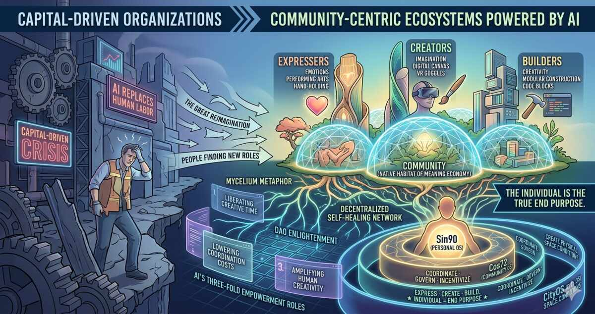

## 全景逻辑图

---

## 摘要

当AI系统性地替代传统雇佣劳动，以资本增殖为目标的公司组织正在失去其作为人类社会基础单元的合理性。本文论证：**松散社区（Loose Communities）与极致个体（Extreme Individuals）** 将取代公司成为未来最重要的组织形态。

> **实证支撑：Chen 等人（2024，Harvard Business School Working Paper No. 25-039）对美国职位空缺的大规模分析显示，自动化暴露度最高的四分之一岗位中，AI 相关技能需求每季度下降 24%；Dominski 与 Lee（2025，arXiv:2507.08244）证实 AI 暴露度越高的岗位就业率下降越显著。**
>
> **Sharma 等人（2024，arXiv:2410.13095）对 100 个 DAO 的大规模实证分析发现：草根参与与更高去中心化程度正相关；Ma 等人（2024）分析 9 条区块链 16,427 个 DAO 的 122,307 项提案，发现超过 60% 的提案在描述与实现代码之间缺乏一致性。**
>
> **Bellemare-Pepin 等人（2026，Scientific Reports，arXiv:2405.13012）大规模实验证实：在创意写作等发散性任务中，较有创造力的人类群体仍显著超越最先进的 LLM，存在 AI 无法突破的创造力天花板。**社区以共同的意义而非共同的利润为凝聚力，以探索代替攫取，以AI作为赋能基础设施，为个体的想象力、创造力与情感表达构建新的土壤。本文结合DAO治理、平台合作主义、去中心化组织理论及社会韧性研究，分析社区作为意义经济天然栖居地的理论基础与实践路径。

**关键词：** 松散社区、极致个体、AI赋能、去中心化组织、意义经济、DAO、平台合作主义

---

## 一、公司的危机：资本驱动组织的结构性危机

公司作为一种组织形态，其核心逻辑是**将个体嵌入资本增殖的流程中**。员工出卖劳动时间，换取工资和社会位置；公司获取劳动力，完成产品闭环，实现利润最大化。这种交易在工业时代是合理的——生产过程需要大量协调的人类劳动，科层制（bureaucracy）是管理这种复杂性的有效手段。

然而，AI正在瓦解这一逻辑的根基。

当AI能够独立完成从策划到执行的全流程——写代码、做分析、管客户、处理文书——公司雇佣人类的经济理性急剧下降。Chen等人（2024）对美国职位空缺数据的大规模分析显示，自动化暴露度最高的四分之一岗位中，AI相关技能需求每季度下降24%（Harvard Business School Working Paper No. 25-039）。Dominski与Lee（2025）进一步证实，AI暴露度越高的岗位，就业率下降越显著，体力劳动岗位反而表现出更强的韧性（arXiv:2507.08244）。

**公司不再需要那么多人。** 但问题远不止于此。

资本驱动的组织——公司、基金、增殖机器——将经济扩张本身视为唯一目标。个体服务于机器：独立思考、想象力与情感表达在这里是负担，不是资产。个人不是目的，增长才是。当公司连这种"负担"都不再需要承担时——当它用AI彻底取代了人类员工——公司就从"异化人类"的机器变成了"不需要人类"的机器。

**这不是公司的进化，而是公司对人类社会功能的终结。**

---

## 二、人类不会消失：三种涌现身份

在岗位AI化的时代，人并没有消失——他们在寻找新的角色。我们观察到意义经济中涌现出三种身份：

- **表达者（Expressers）**——拥有真实情感的个体的基本诉求。当工作不再定义身份，情感表达成为存在感的首要来源。
- **创作者（Creators）**——丰富想象力的个体的创作冲动。Bellemare-Pepin等人（2026）的大规模实验证实，在创意写作等发散性任务中，较有创造力的人类群体仍显著超越最先进的LLM，存在AI无法突破的创造力天花板（Scientific Reports, arXiv:2405.13012）。
- **建设者（Builders）**——创造力作为多巴胺来源的角色定位。构建本身——无论是代码、社区还是艺术品——成为一种内在奖励。

Zhang等人（2025）的多维度评估指出，人类凭借直觉、情感和经验进行的启发式加工，以及创造力中固有的"意义建构"能力，是AI无法复制的本质特征（PsyCh Journal, Vol. 14(6), 831-840）。这三种身份的共同点是：它们都根植于人类不可替代的内核——**想象力、创造力与情感**。

但个体不能在真空中繁荣——他们需要土壤。

---

## 三、社区：意义经济的天然栖居地

### 3.1 为什么是社区而非公司

社区与公司的本质区别不在于规模或技术，而在于**目的论**：

| 维度 | 公司 | 社区 |
|------|------|------|
| 核心目标 | 资本增殖 | 意义共建 |
| 个体角色 | 手段（可替换零件） | 目的（不可替代的内心世界） |
| 凝聚力 | 利润/薪酬 | 共同的意义与价值观 |
| 对待创造力 | 标准化压制 | 基础设施支持 |
| 组织结构 | 科层制/金字塔 | 松散耦合/网络状 |

Eisenhardt等人（2025）在*Academy of Management Annals*基于178篇实证文章的综述中，识别出四种组织范式转变——多事业部制、有机型、**社区型**和平台型。其中，社区型组织直接挑战了官僚制的两个核心假设：一是"效率需要层级控制"，二是"个体必须服从组织目标"。

Lee与Young-Hyman（2026）在*Administrative Science Quarterly*中的研究进一步揭示了一个关键机制：民主型组织在面对中心化压力时，通过"**民主偏离**"（democratic deviations）维持去中心化承诺——这意味着社区型组织具有内在的**抗层级回归**能力。

### 3.2 松散社区的生物学隐喻：菌丝网络

自然界中，真菌的菌丝网络（mycelium）在数十亿年间维系着整个生态系统。菌丝网络不是中心化的树状结构，而是**去中心化的、自修复的、以渗透而非控制为逻辑的网络**。

这为社区组织提供了深刻的隐喻和设计原则：

- **Park（循环协议）**——对应数字公共物品。真菌分解有机物为环境提供养分，社区中的知识、工具和创作成果也应成为共享的公共物品，而非被资本圈占的私有资产。
- **Spores（传输协议）**——对应可持续协作。菌丝网络传递养分连接万物，社区中的协作不应是科层制的命令传达，而是基于信任和意义的自发流动。
- **OpenNest（孵化协议）**——对应指数增长。孢子大规模传播，让网络指数增长，社区通过孵化个体项目实现整体繁荣。

这与资本意志的"抽取式增长"截然不同——它是一种**"渗透式繁荣"**。

---

## 四、去中心化治理：DAO的启示与局限

去中心化自治组织（DAO）是社区组织形态在区块链领域的早期实验，为我们提供了重要的实证参考。

Sharma等人（2024）对100个DAO的大规模实证分析发现了几个关键规律：**草根参与与更高的去中心化程度正相关**，投票权力方差越低（Gini系数越小），组织的去中心化程度越高（arXiv:2410.13095）。这意味着真正的社区治理需要权力的广泛分散，而非少数鲸鱼的寡头控制。

Li与Chen（2024）创造性地将DAO视为**数字公地（digital commons）**，改编了Ostrom的八项公地治理原则——这位诺贝尔经济学奖得主关于公共资源自治的理论——为DAO提出了新的治理框架（Journal of Business Venturing Insights）。这一视角对意义经济至关重要：社区中的知识、创作、工具不是私有财产，而是数字公地，需要公地治理的智慧。

然而，DAO也暴露了严重的问题。Ma等人（2024）分析了9条区块链上的16,427个DAO和122,307项提案，发现**超过60%的提案在描述与实现代码之间缺乏一致性**，揭示了去中心化治理中的透明度危机（arXiv:2403.11758）。

**启示：** 社区组织不能简单照搬DAO的链上治理模式。意义经济中的社区需要在去中心化与治理效能之间找到平衡——既保持松散耦合的灵活性，又确保基本的协调和透明。

---

## 五、平台合作主义：从剥削到共建的替代路径

在意义经济的组织形态谱系中，平台合作主义（Platform Cooperativism）提供了另一种重要的参照。

Ghirlanda与Kirov（2024）通过利益相关者理论框架对平台合作主义进行了首次系统文献综述，将平台合作社定义为"通过网站、移动应用或协议销售商品/服务，承诺**民主治理和共享所有权**的企业"（Annals of Public and Cooperative Economics, Vol. 95(4), 1197-1221）。

Christiaens（2025）从共和主义自由（非支配）理论出发，借鉴G.D.H. Cole的行会社会主义思想，论证工人所有的合作平台是零工经济中增强工人自主权的最有前途的途径。他同时回应了三种常见批评：消费者成本过高、资本主义竞争压力和隐性层级——并论证这些问题可以通过设计解决，而非放弃合作制本身（European Journal of Political Theory, Vol. 24(2), 176-199）。

**意义经济中的社区不是无序的聚合，而是有治理架构的有机体。** 平台合作主义证明了：在资本逻辑之外，民主治理、共享所有权和个体自主权可以共存。

---

## 六、AI赋能：社区的基础设施革命

AI不仅是摧毁旧组织形态的力量，也是构建新形态的基础设施。在意义经济的社区中，AI扮演三重角色：

### 6.1 解放个体的创造性时间

Spencer（2024）在*AI & SOCIETY*中提出了"减轻工作"（lightening of work）的概念——AI可以缩短人类在无意义劳动上的时间，释放创造性空间（Vol. 40(3), 1237-1247）。在社区语境中，这意味着AI可以处理协调、管理、记录等事务性工作，让个体将全部精力投入表达、创作和建设。

### 6.2 降低社区运营的协调成本

传统组织需要大量中间管理层来协调信息流和决策流。AI可以作为社区的"数字菌丝"，自动匹配需求与供给，促进知识流动，降低协调摩擦。这直接支持了松散耦合的组织结构——不需要科层制来维持秩序。

### 6.3 为个体提供个性化的创造工具

AI作为创作的协助者而非替代者。Zhang等人（2025）指出，AI正从被动工具演变为主动共创者，但人类的直觉、情感和意义建构能力仍不可替代。AI最理想的角色是**放大人类创造力**，而非取代它——为表达者提供更强大的表达工具，为创作者提供更快速的原型能力，为建设者提供更高效的构建平台。

---

## 七、社会韧性：社区作为自愈机制

面对AI带来的社会冲击，社区不仅是新的组织形态，更是社会韧性的核心载体。

Grosse与Sundberg（2025）将数字韧性定义为"在数字系统遭受干扰或干扰数字系统时维持社会功能的能力"，并从技术、组织和治理三个视角提出了系统性的研究议程（Journal of Risk Research）。Kirby（2025）的概念性研究进一步指出，**参与**是加强社区韧性的关键促进因素——个体的主动参与（而非被动雇佣）直接增强了社区在个体、社会、治理和经济四个维度上的韧性（Social Sciences, 2025）。

这与意义经济的核心逻辑高度一致：当个体从"耗材"转变为"参与者"，当组织从"增殖机器"转变为"意义共同体"，社会获得了一种新的自我修复能力。

---

## 八、三层架构：个体、社区、城市

意义经济的组织形态不是扁平的，而是具有层次性的：

- **个体层（Sin90 — 个人操作系统）：** 为"极致个体"赋能，保护其作为表达者、创作者和建设者的独立性。AI在此层面作为个人创造力的放大器。
- **社区层（Cos72 — 社区操作系统）：** 替代传统科层制公司，提供协调、治理和激励的基础设施。AI在此层面作为社区的数字菌丝网络。
- **城市层（CityOS — 未来城市操作系统）：** 为承载社区的物理空间提供条件。城市为社区创造土壤，社区为个体创造环境。

**每一层都在为它之下的那层服务。** 城市为社区创造条件，社区为个体创造土壤，而**个体——才是真正的目的**。

这是与资本逻辑的根本倒置。在资本体系中，个体服务于公司，公司服务于资本，资本的增殖是唯一目的。在意义经济中，所有的基础设施——无论是技术的还是社会的——都是为了让个体能够充分发挥其想象力、创造力与情感。

---

## 九、结论与展望

公司作为人类社会的核心组织形态，其历史使命正在AI时代走向终结。这不是公司会消失，而是公司将退化为纯粹的AI驱动的生产单元——不需要人类参与的增殖机器。

与此同时，人类正在从大组织流向社区，从被动雇佣走向自主探索。**松散社区与极致个体**将成为未来最重要的组织形态——而非公司。

社区是意义经济天然的栖居地。不同于资本驱动的组织不允许个体有任何独立思考，社区以探索代替攫取，以共同的意义而非共同的利润凝聚，把每一个个体的内心世界——他的想象力、创造力与情感——视为值得为之构建基础设施的东西。

AI在这个过程中扮演双重角色：它既是摧毁旧世界的力量，也是构建新世界的工具。关键不在于AI本身，而在于**谁掌握AI、为什么目的、以什么组织形态**来使用它。

未来的挑战在于：如何在社区形态的早期实验中（DAO、平台合作社、数字游民社区），提炼出可规模化的治理原则和技术架构；如何确保意义经济不被资本逻辑重新俘获；如何在"生存性经济"与"意义经济"之间实现平滑的过渡。

这些问题没有现成的答案。但方向已经清晰：**当人本身成为目的而非产品时，一切都需要被重新设计。**

---

## 参考文献

1. Chen, W.X., Srinivasan, S. & Zakerinia, S. (2024). "Displacement or Complementarity? The Labor Market Impact of Generative AI." Harvard Business School Working Paper No. 25-039.
2. Dominski, J. & Lee, Y.S. (2025). "Advancing AI Capabilities and Evolving Labor Outcomes." arXiv:2507.08244.
3. Eisenhardt, K.M. et al. (2025). "Decentralization in Organizations: A Revolution or a Mirage?" *Academy of Management Annals*.
4. Lee, M.Y. & Young-Hyman, T. (2026). "Democratic Deviations: How Organizations Sustain Decentralization Commitments." *Administrative Science Quarterly*.
5. Sharma, T. et al. (2024). "Future of Algorithmic Organization: Large-Scale Analysis of DAOs." arXiv:2410.13095.
6. Li, S. & Chen, Y. (2024). "Governing Decentralized Autonomous Organizations as Digital Commons." *Journal of Business Venturing Insights*.
7. Ma, J. et al. (2024). "Demystifying the DAO Governance Process." arXiv:2403.11758.
8. Ghirlanda, P. & Kirov, V. (2024). "An Alternative Organizational Model for a More Democratic and Equitable Digital Economy." *Annals of Public and Cooperative Economics*, 95(4), 1197-1221.
9. Christiaens, T. (2025). "Platform Cooperativism and Freedom as Non-Domination in the Gig Economy." *European Journal of Political Theory*, 24(2), 176-199.
10. Spencer, D.A. (2024). "AI, automation and the lightening of work." *AI & SOCIETY*, 40(3), 1237-1247.
11. Bellemare-Pepin, A. et al. (2026). "Divergent Creativity in Humans and Large Language Models." *Scientific Reports* (Nature). arXiv:2405.13012.
12. Zhang, C. et al. (2025). "Artificial Intelligence Reshapes Creativity: A Multidimensional Evaluation." *PsyCh Journal*, 14(6), 831-840.
13. Grosse, C. & Sundberg, L. (2025). "Generative AI and Digital Resilience: A Research Agenda." *Journal of Risk Research*.
14. Kirby, N. (2025). "Strengthening Community Resilience through Participation." *Social Sciences*.
15. Santoni de Sio, F. (2024). "Artificial Intelligence and the Future of Work: Mapping the Ethical Issues." *The Journal of Ethics*, 28, 407-427.
16. Nayebi, A. (2025). "An AI Capability Threshold for Rent-Funded Universal Basic Income." arXiv:2505.18687.
