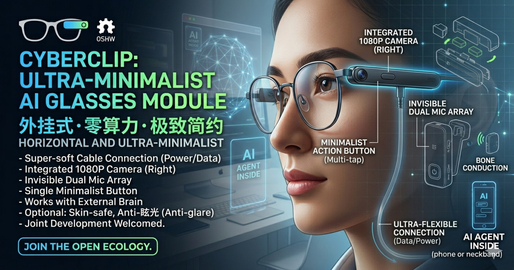

> **状态**：Idea 阶段 · **日期**：2026-04-27 · **组织**：Mycelium Protocol / Aura AI  
> **本文性质**：开放讨论，欢迎质疑、参与、共建。这不是产品发布，是一个想法的公开记录。

## 一句话定义

**CyberClip（眼镜蛇）** = 外挂到任意眼镜/帽子/头带的 AI 传感器模块。靠一根 Cable 连手机供电+传数据，手机是大脑，眼镜只是眼睛和耳朵。

---

## § 1 · Idea 背景

现有 AI 眼镜（Ray-Ban Meta、Frame、OpenGlass）有一个共同矛盾：要塞入电池+芯片+天线，导致重量、发热、续航三角难以同时优化。更深层的矛盾是：**大多数人已经有一副自己喜欢的眼镜框，凭什么为了 AI 换掉它？**

CyberClip 的答案是：**不换。直接夹上去。**

把所有算力、网络、AI 模型卸载到已经在你口袋里的手机（或颈挂计算盒），眼镜模块只做最简单的事：采集、按键、传输。

---

## § 2 · 调研精华：开源 AI 眼镜生态现状（2024-2026）

_以下调研来自 Gemini Deep Research，提取核心信息如下：_

### 2.1 主要开源方案对比

| 方案 | 硬件核心 | 连接方式 | 优势 | 局限 |
|------|----------|----------|------|------|
| **Brilliant Labs Frame** | FPGA + Micro OLED | 蓝牙 BLE | 最接近眼镜形态，SDK 完整（Lua/Python/Flutter） | 价格高，闭合生态 |
| **BasedHardware OpenGlass** | ESP32-S3 | 蓝牙 BLE | ~$25 DIY，代码全开源 | 蓝牙带宽限制，传视频不可行 |
| **LilyGO T-Glass** | ESP32-S3 + 棱镜显示 | WiFi/BLE | Arduino/MicroPython 支持，现货 | 有显示屏 → 功耗/重量增加 |
| **Mentra OpenSourceSmartGlasses** | 软件框架 | 依赖硬件 | 统一 OS 接口，技能插件化 | 需要配套硬件 |

### 2.2 深圳 ODM 半成品供应链

- **歌尔股份 (Goertek)**：高通 AR 平台参考设计，提供镜框模组+底层 SDK，适合企业级合作
- **深圳金卫尔 (GoldenWeald)**：Smart AI Glasses PCBA，支持定制，对中小项目友好
- **Seeed Studio XIAO 系列**：散件模组，适合自定义 PCB，开发者友好度高

### 2.3 核心技术洞察

OpenGlass vs CyberClip 的关键差异：OpenGlass 用蓝牙传数据，带宽上限约 2Mbps，传 1080P 视频流基本不可行。CyberClip 用 USB OTG（UVC/UAC 协议），即插即用（免驱动），带宽轻松支持 1080P 实时流，彻底解决了蓝牙方案的瓶颈。

---

## § 3 · 方案初稿（CyberClip v0.1 设计规格）

### 3.1 创始人原始设定（完整记录）

以下是从想法出发时的完整设计约束，一字不改地记录在这里：

1. 适配已有眼镜（不换框）
2. 默认无电池——靠直连 Cable 连接外置电源或直连手机（同时供电+数据，省去 WiFi/蓝牙互联的时间和麻烦）
3. 支持选装小电池（如 300mAh）
4. 默认配置：双侧麦克风、左侧闪光灯、右侧摄像头
5. 无语音唤醒功能，无音乐播放功能
6. 全靠一个键：单击开机、双击拍照、三击录像
7. AI 功能全靠 Cable 直连手机获取服务；没有连接时，就是一个纯拍照/录像的外置眼镜模块
8. 连接后自动：获得拍照图片和视频 → 手机监听语音指令，例如"剪辑刚才的视频，按某思路，发小红书"
9. 可选骨传导模块，挂载到眼镜，通过独立开关控制，用于每日新闻语音播报

**终极目标**：让普通人可以挂载模块，让自己的眼镜变 AI，自由指定后台模型和 Skill，构造开源生态。（事实上也可以外挂到帽子、头带、头盔等等。）

### 3.2 硬件架构设计

#### 主控芯片选型

推荐 **Realtek RTS5822**（或同类 USB 视频控制器），而非 ESP32-S3。理由：不需要做 WiFi/蓝牙，直接将 Sensor 和 Mic 压成 USB 数据流输出，更简单、更省电。

#### 核心模块布局（"积木式"磁吸/卡扣）

```
左侧镜腿                    右侧镜腿
┌─────────────────────────────────────┐
│  [麦克风L] [闪光灯] ──── [摄像头] [麦克风R] │
│  [Type-C 接口]  ←FPC柔性排线→              │
│  [物理按键]                               │
└─────────────────────────────────────┘
              ↓ USB OTG
           手机 / 颈挂计算盒
```

- **右侧**：800万像素摄像头（Sony IMX219 级别）+ 麦克风
- **左侧**：麦克风 + 物理按键（单/双/三击）+ Type-C 接口
- **中间**：极细柔性排线（FPC）沿镜架上方走线
- **连接**：超软硅胶 Type-C to Type-C 线；推荐配合"颈挂计算盒"而非直插裤兜手机（解决拖拽感）

#### 扩展坞（Pogo Pin 磁吸接口）

- **外挂电池包**：磁吸 150~300mAh 模块
- **骨传导包**：磁吸震子模块 + 独立物理拨动开关

#### 预估成本

| 组件 | 参考成本 |
|------|----------|
| USB 视频控制器 IC | ¥15-25 |
| 800万像素摄像头模组 | ¥20-35 |
| 双麦克风 MEMS | ¥8-12 |
| PCB + 柔性排线 FPC | ¥15-20 |
| 外壳（3D 打印） | ¥10-15 |
| Type-C 接口 + 按键 + LED | ¥5-8 |
| **合计 BOM** | **¥73-115** |

### 3.3 软件交互架构（Phone as the Brain）

眼镜本身是"智障"的，一切 AI 赋予都在手机端开源 App 完成。

#### 脱机模式（仅接充电宝或挂小电池）

主控芯片运行极简逻辑。按键触发写卡指令（需内置 TF 卡槽），完成纯粹的"行车记录仪"功能。

#### 联机模式（连入手机）

```
眼镜模块 (UVC + UAC)
      │ USB OTG
      ▼
手机 App（开源）
  ├─ 自动挂载检测 → 启动后台服务
  ├─ 数据同步：自动提取 TF 卡新增媒体
  ├─ 音频流处理：眼镜麦克风 → 手机 NPU → 语音指令识别
  └─ Skill 路由网关
       ├─ 内容剪辑 Skill（调用本地模型）
       ├─ 发布 Skill（小红书、微信等）
       └─ 自定义 Skill（JSON 插件格式）
```

**Skill 生态设计**：手机 App 支持 JSON 格式 Workflow 导入。高阶玩家配置好"拍照+识别+语音播报"逻辑，打包 JSON 分享到社区，普通人一键导入即可获得同样的 AI 技能。

### 3.4 工程障碍与应对

| 障碍 | 严重程度 | 应对思路 |
|------|----------|----------|
| Cable 拖拽感（头部高频转动） | ★★★★ 核心痛点 | 推荐颈挂计算盒，而非直插裤兜；超软硅胶线材改善手感 |
| 麦克风音质（手机麦克风在口袋里） | ★★★ | 眼镜麦克风通过 UAC 协议作为 USB 音频输入，直接绕过手机麦克风 |
| iOS 封闭性（MFi 限制） | ★★★ | 初期专攻 Android / 鸿蒙，iOS 作长期目标 |
| 闪光灯眩光（镜片内折射） | ★★ | 改为低亮度红外补光或纯状态指示灯 |
| 电池重量配重失衡（300mAh ≈ 6-8g） | ★★ | 使用磁吸模块化设计；左右各挂一半 |

### 3.5 开源生态路径（两层）

**硬件图纸层（OSHW DPG）**
- 开源 3D 打印 STL 文件（适配不同镜架的卡扣、帽子夹、头带固定器）
- PCB 原理图 + BOM 表公开
- 淘宝代工厂可直接接单打样，成本透明

**手机端工作流（Software DPG）**
- 开源 Android App，支持 JSON Workflow 导入
- 开发者社区分享技能包（Skill Pack）
- 对接 Mycelium Protocol——积分激励贡献者，技能包质量靠社区投票

---

## § 4 · 与 Mycelium Protocol 的关系

CyberClip 的硬件本体是 OSHW（开源硬件），任何人都可以自由制造、改进、销售。Mycelium Protocol 层在其上提供：

- **贡献激励**：开发者提交 Skill Pack、上传 STL 改进版，通过积分系统获得社区认可
- **质量过滤**：社区投票决定哪些 Skill Pack 进入官方推荐列表
- **数字公共物品（DPG）承诺**：核心代码永久开源，不会因为商业化而封闭

---

## § 5 · 现在需要什么

这是 Idea 阶段。以下几件事我还没有答案，希望社区一起来思考：

1. **颈挂计算盒**是否有比手机更合适的形态？（树莓派 Zero？RISC-V 小板？）
2. **Realtek RTS5822** vs **Allwinner V831**（带 NPU）——是否值得在眼镜端加一点点本地推理能力？
3. **镜架适配**——卡扣 vs 磁吸，哪种对非标准镜架更友好？
4. iOS 路径：有没有人做过 **UVC over USB-C on non-jailbroken iPhone** 的尝试？
5. **骨传导模块**的具体震子选型，有没有体积 ≤ 1cm³ 的推荐？

如果你有想法、有资源、有原型经验，欢迎直接通过博客联系或在社区讨论。

---

## § 6 · 预览图

下图由 Gemini 生成，是对 CyberClip 外观方向的概念展示：



_注：这是 AI 生成的概念图，不代表最终硬件形态。_

---

> 这个想法是否值得做？你有什么看法？[加入讨论 →](https://mushroom.cv)

<!--EN-->

> **Status**: Idea Stage · **Date**: 2026-04-27 · **Organization**: Mycelium Protocol / Aura AI  
> **Nature of post**: Open discussion. This is not a product launch — it's a public record of an idea inviting critique, participation, and co-building.

## One-Line Definition

**CyberClip** = A clip-on AI sensor module for any existing glasses / hat / headband. A single USB cable connects to your phone for power + data. The phone is the brain. The glasses are just eyes and ears.

---

## § 1 · Background: Why Does This Exist?

Current AI glasses (Ray-Ban Meta, Frame, OpenGlass) share a common contradiction: to embed battery + chip + antenna, you must compromise on weight, heat, or battery life. The deeper issue: **most people already own a pair of glasses they love. Why should they replace them for AI?**

CyberClip's answer: **Don't replace. Just clip on.**

Offload all compute, network, and AI models to the phone already in your pocket (or a neck-worn compute dongle). The glasses module does only the simplest things: capture, button, transmit.

---

## § 2 · Research Highlights: Open-Source AI Glasses Ecosystem (2024–2026)

_Research via Gemini Deep Research. Key findings extracted below:_

### 2.1 Open-Source Platform Comparison

| Project | Core Hardware | Connectivity | Strengths | Limitations |
|---------|--------------|--------------|-----------|-------------|
| **Brilliant Labs Frame** | FPGA + Micro OLED | Bluetooth BLE | Closest to normal glasses; full SDK (Lua/Python/Flutter) | Expensive, partially closed |
| **BasedHardware OpenGlass** | ESP32-S3 | Bluetooth BLE | ~$25 DIY, fully open source | Bluetooth bandwidth too low for video |
| **LilyGO T-Glass** | ESP32-S3 + prism display | WiFi/BLE | Arduino/MicroPython, in stock | Display adds weight/power |
| **Mentra OpenSourceSmartGlasses** | Software framework | Hardware-dependent | Unified OS API, skill plugins | Needs matching hardware |

### 2.2 Shenzhen ODM Supply Chain

- **Goertek**: Qualcomm AR platform reference design; suitable for enterprise-level partnerships
- **GoldenWeald (金卫尔)**: Smart AI Glasses PCBA; supports customization; accessible to smaller projects
- **Seeed Studio XIAO series**: Component modules for custom PCB; high developer-friendliness

### 2.3 Key Technical Insight

OpenGlass uses Bluetooth (~2Mbps max), which makes real-time 1080P video streaming infeasible. CyberClip uses USB OTG with **UVC (USB Video Class) + UAC (USB Audio Class)** — universally driver-free on Android, and easily capable of 1080P streaming. This single architectural decision eliminates the bandwidth bottleneck that constrains all Bluetooth-based open glasses projects.

---

## § 3 · Draft Specification (CyberClip v0.1)

### 3.1 Original Design Constraints (Verbatim)

1. Must fit existing glasses (no frame replacement)
2. Default: no battery — powered via Cable direct to phone (simultaneous power + data, eliminates WiFi/Bluetooth pairing friction)
3. Optional: clip-on small battery (e.g. 300mAh)
4. Default hardware: dual microphones (both sides), flash LED (left), 1080P camera (right)
5. No voice wake word, no music playback
6. Single-button interaction: 1-click = power on; 2-click = take photo; 3-click = record video
7. AI features require Cable connection to phone; without connection it's a pure capture peripheral
8. When connected: auto-sync photos/videos + phone processes audio from glasses mics for voice commands (e.g. "Edit the clip I just shot, summarize it, post to Xiaohongshu")
9. Optional bone conduction module (clip-on, with dedicated physical toggle switch) for daily news audio broadcast

**Ultimate goal**: Build an open-source ecosystem where ordinary people can clip on a module, turn their existing glasses AI, and freely specify backend models and Skills. (Works on hats, headbands, helmets too.)

### 3.2 Hardware Architecture

#### Controller Selection

Recommend **Realtek RTS5822** (or equivalent USB video controller) rather than ESP32-S3. Rationale: no need for WiFi/Bluetooth; directly compresses sensor + mic into a USB data stream. Simpler, lower power.

#### Module Layout ("Lego-style" magnetic/clip attachment)

```
Left temple                         Right temple
┌──────────────────────────────────────────┐
│ [Mic-L] [LED Flash] ─FPC─ [Camera] [Mic-R] │
│ [Type-C port]                              │
│ [Action Button]                            │
└──────────────────────────────────────────┘
                  │ USB OTG
                  ▼
         Phone / Neck Compute Dongle
```

- **Right**: 8MP camera (Sony IMX219-class) + microphone
- **Left**: Microphone + action button (1/2/3-click) + Type-C port
- **Center**: Ultra-thin FPC flexible ribbon cable routed along the top frame
- **Cable**: Ultra-soft silicone Type-C to Type-C; pair with a neck compute dongle rather than plugging directly into a pocket phone (to reduce cable drag)

#### Expansion Pogo Pin (Magnetic Attachment)

- **Battery pack**: Magnetic 150–300mAh module
- **Bone conduction pack**: Magnetic vibration module + dedicated physical toggle switch

#### Estimated BOM Cost

| Component | Estimated Cost |
|-----------|---------------|
| USB video controller IC | ¥15–25 |
| 8MP camera module | ¥20–35 |
| Dual MEMS microphones | ¥8–12 |
| PCB + FPC ribbon cable | ¥15–20 |
| 3D-printed housing | ¥10–15 |
| Type-C + button + LED | ¥5–8 |
| **Total BOM** | **¥73–115** |

### 3.3 Software Architecture (Phone as the Brain)

The glasses module is "dumb." All AI capability lives in an open-source phone app.

#### Offline Mode (Battery pack or power bank only)

Minimal firmware logic: button triggers write-to-TF-card. Pure "action camera" / dashcam mode.

#### Online Mode (Cable-connected to phone)

```
Glasses Module (UVC + UAC)
      │ USB OTG
      ▼
Phone App (open source)
  ├─ Auto-mount detection → start background service
  ├─ Media sync: auto-pull new files from TF card
  ├─ Audio stream: glasses mics → phone NPU → voice command recognition
  └─ Skill Router Gateway
       ├─ Clip & Edit Skill (local model)
       ├─ Publish Skill (Xiaohongshu, WeChat, etc.)
       └─ Custom Skill (JSON plugin format)
```

**Skill Ecosystem Design**: The app supports JSON-format Workflow import. Power users configure a skill ("capture → identify → voice broadcast"), export as JSON, share to the community. Beginners import and immediately get the same AI capability on their glasses.

### 3.4 Engineering Obstacles

| Obstacle | Severity | Mitigation |
|----------|----------|------------|
| Cable drag (head moves constantly) | ★★★★ Core issue | Neck compute dongle; ultra-soft silicone cable; route cable along collar |
| Mic audio quality (phone in pocket) | ★★★ | Glasses mics act as UAC USB audio input; phone mic bypassed entirely |
| iOS ecosystem (MFi restrictions) | ★★★ | Initial focus on Android/HarmonyOS; iOS as long-term target |
| Flash LED glare (refraction inside lenses) | ★★ | Replace with low-intensity IR fill light or pure status LED |
| Battery weight imbalance (300mAh ≈ 6–8g) | ★★ | Magnetic modular design; split weight across both temples |

### 3.5 Open-Source Ecosystem Layers

**Hardware Layer (OSHW DPG)**
- Open-source 3D-printable STL files (clips for different frame types, hat clips, headband mounts)
- PCB schematics + BOM published openly
- Taobao/JLCPCB manufacturers can directly produce from files; cost is transparent

**Software Layer (Software DPG)**
- Open-source Android app with JSON Workflow import
- Developer community shares Skill Packs
- Integrates with Mycelium Protocol: token incentives for contributors, community voting for skill quality

---

## § 4 · Relationship to Mycelium Protocol

CyberClip hardware is OSHW — anyone can freely manufacture, modify, and sell it. The Mycelium Protocol layer adds:

- **Contribution incentives**: Developers who submit Skill Packs or improved STL files earn community recognition via the points system
- **Quality filtering**: Community votes determine which Skill Packs enter the official recommended list
- **Digital Public Goods (DPG) commitment**: Core code stays open-source permanently, no lock-in if commercialized

---

## § 5 · Open Questions (Help Wanted)

This is idea stage. Here are the things I don't have answers for yet — community input welcome:

1. **Neck compute dongle** — better form factor than a phone? (Raspberry Pi Zero? RISC-V board?)
2. **Realtek RTS5822 vs Allwinner V831** (has onboard NPU) — is any local inference on the glasses worth the complexity?
3. **Frame attachment** — snap-clip vs magnetic vs adhesive: which is most universal for non-standard frames?
4. **iOS path**: Has anyone successfully used UVC over USB-C on non-jailbroken iPhone at the app level?
5. **Bone conduction module**: Any recommendation for a vibration transducer ≤ 1cm³?

If you have ideas, resources, or prototype experience, feel free to reach out or join the discussion.

---

## § 6 · Preview Image

The image below was generated by Gemini as a conceptual visualization of the CyberClip direction:


_Note: AI-generated concept art. Does not represent final hardware._

---

> Think this is worth building? What's your take? [Join the discussion →](https://mushroom.cv)
