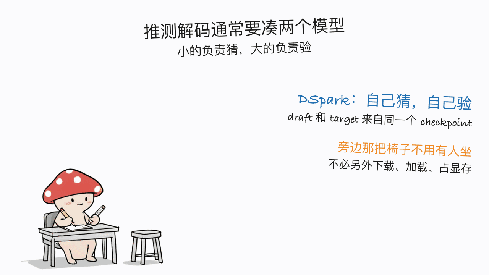

*by Mycelium Protocol*

---

模型地址：https://huggingface.co/deepseek-ai/DeepSeek-V4-Flash-Vision-Exp
vLLM 部署配方：https://recipes.vllm.ai/deepseek-ai/DeepSeek-V4-Flash-Vision-Exp
SGLang 手册：https://docs.sglang.io/cookbook/autoregressive/DeepSeek/DeepSeek-V4
授权：MIT

---

## 一句话结论

**这是 DeepSeek-V4 家族的第一个多模态模型，重点不在"它能看图了"，而在"看图这件事没有以牺牲别的能力为代价"。** 它在 DeepSeek-V4-Flash 架构上加了视觉模块并继续训练，结果是：多模态 agent 能力大幅提升的同时，**七项文本 agent 基准里六项不降反升**。8 月 31 日上线，五天 18.4 万下载、651 likes，MIT 协议。

先把最重要的实用信息说在前面：**这个模型个人跑不了**。官方给的部署示例是单节点 **4 张 GB300**。本站读者如果是冲着"在自己 Mac 上跑起来"来的，这篇不是那个。

## 和本站已发的 V4 Flash 三篇怎么区分

本站写过三篇 DeepSeek-V4 Flash 相关的：本地推理指南、antirez 的 Mac Metal 实践、Mac Studio 上的 DwarfStar 部署。**那三篇讲的全是纯文本版**。

这一篇是**视觉分支**，而且带 `Exp`（experimental）后缀——是 DeepSeek 自己标注的实验性质。它和纯文本版的关系是：同一个 Flash 架构，加上视觉编码器和对齐器（aligner），再继续训练。

## 那张表，以及怎么读它

官方给的对比是三方：Vision-Exp、上一代纯文本的 Flash-0731、以及 Opus-4.8。

**文本 agent 能力**（加了视觉之后有没有变笨）：

| 基准 | Vision-Exp | Flash-0731 | Opus-4.8 |
|---|---:|---:|---:|
| Terminal Bench 2.1 | 83.9 | 82.7 | 85.0 |
| NL2Repo | 57.7 | 54.2 | 69.7 |
| Cybergym | **75.3** | **76.7** | 78.3 |
| DeepSWE | **59.3** | 54.4 | 58.0 |
| Toolathlon-Verified | 75.9 | 70.3 | 76.2 |
| DSBench-Hard | 63.6 | 59.6 | 71.7 |
| AutomationBench（公开集） | 25.7 | 25.1 | 27.2 |

**七项里六项提升**，唯一退步的是 Cybergym（76.7 → 75.3，跌 1.4 分）。这条结果比多模态那半张表更值得注意：往一个文本模型上加视觉塔，通常要付出文本能力的代价，这次基本没付。

而 DeepSWE 一项 **59.3 超过了 Opus-4.8 的 58.0**。


**多模态 agent 能力**：

| 基准 | Vision-Exp | Flash-0731 | Opus-4.8 |
|---|---:|---:|---:|
| ApexBench (Pass@1) | 36.5 | 26.2† | 39.4 |
| Agents' Last Exam | **27.3** | 25.2† | 25.7 |
| Chartography | 64.3 | — | 65.0 |
| ZeroBench (Pass@5) | **35.0** | — | 34.0 |

† 号是官方自己标的：Flash-0731 在这两项上**直接忽略输入里的多模态元素**——也就是说那两个数字是"闭着眼睛答题"的成绩，拿来当基线看看提升幅度可以，但不是公平对比。**这个标注本身值得表扬**，很多厂商会把这种数字直接列上去不作说明。

Agents' Last Exam（27.3 vs 25.7）和 ZeroBench（35.0 vs 34.0）两项超过 Opus-4.8，ApexBench 和 Chartography 仍落后。

**评测口径**也写清楚了：DeepSeek 系模型用 DeepSeek Harness 的 minimal 模式作为 agent 框架，`max` 推理档，`temperature = 1.0, top_p = 0.95`。这一条很重要——agent 基准的分数对 harness 高度敏感，不说明 harness 的分数没法横向比。本站写 Agentic Harness Engineering 那篇讲过同一件事：同一个模型换个 harness，Terminal-Bench 分数能差好几个点。

## 仓库里给了什么

这不是一个"只丢权重"的发布。仓库里有：

```text
encoding/     # OpenAI 风格 messages → 模型 prompt，不依赖 PyTorch
inference/    # 权重转换 + 最小可用推理实现
  examples/   # 等价的 TXT 和 JSON 两种视觉 prompt 示例
config.json / generation_config.json / tokenizer.json ...
```

参考实现覆盖了**视觉编码器和对齐器、DFlash 注意力、MoE、Hyper-Connections 和 DSpark 前向路径**。

有两个设计细节透着工程自觉：

1. `encoding/` 和 `inference/` **故意分开**——prompt 格式化不依赖 PyTorch，推理侧才通过显式 Python path 导入编码模块。想接自己的推理栈的人，可以只拿编码这一半。
2. tokenizer 存成普通文件而**不用符号链接**，这样仓库能直接传上 HuggingFace，不依赖本地文件系统的 symlink 行为。

还有一处让人放心的：`inference/examples/` 下的 TXT 和 JSON 两个示例，官方说明它们**编码出完全相同的 prompt 和 token ID**。这等于给了你一个自检工具——接入时先跑这两个例子对一下 token ID，就能确认自己的编码实现没写错。

## DSpark：draft 和 target 用同一份权重

推测解码（speculative decoding）常规做法是配一个小的草稿模型去猜，大模型来验。DSpark 的不同之处在于，SGLang 的说明写得很直白：

> 启用 DSpark 用 `--speculative-algorithm DSPARK`，**不要另外设置 `--speculative-draft-model-path`**，因为 target 和 draft 权重来自同一个 checkpoint。

也就是说不用再单独下载、加载、显存驻留一个草稿模型。vLLM 那边的配置能看到更多参数：

```
--speculative-config '{
  "method":"dspark",
  "num_speculative_tokens":3,
  "draft_sample_method":"probabilistic",
  "enable_adaptive_verification":true
}'
```

一次猜 3 个 token，概率式采样草稿，还有自适应验证。



## 部署（以及为什么这条对个人不适用）

vLLM，单节点 4×GB300：

```bash
docker run --gpus all \
  vllm/vllm-openai:deepseekv4-flash-vision deepseek-ai/DeepSeek-V4-Flash-Vision-Exp \
  --kv-cache-dtype fp8 \
  --block-size 256 \
  --tensor-parallel-size 4 \
  --tool-call-parser deepseek_v4 \
  --enable-auto-tool-choice \
  --reasoning-parser deepseek_v4 \
  --speculative-config '{"method":"dspark","num_speculative_tokens":3,...}'
```

SGLang（B200 上跑 fp4 低延迟配置）：

```bash
sglang serve \
  --model-path deepseek-ai/DeepSeek-V4-Flash-Vision-Exp \
  --tp 4 \
  --speculative-algorithm DSPARK \
  --mem-fraction-static 0.85 \
  --host 0.0.0.0 --port 30000
```

`--tensor-parallel-size 4` 和 `--tp 4` 说明了一切：**这是四卡起步的数据中心级模型**。仓库里权重标了 fp8/8-bit，但那是为 GB300/B200 这种卡准备的精度，不是让你在 32GB 的 Mac 上塞进去的。

## 那本站为什么还要写它

三个理由：

**一、MIT 权重开放，社区量化会跟上。** 本站写过的三篇 V4 Flash 本地部署实践，走的都是同一条路径：官方发大模型 → 社区出 GGUF/MLX 量化 → 消费级硬件能跑。纯文本版已经走完这条路，视觉版大概率会重复一遍。现在了解它的架构和评测，是为那一天做准备。

**二、"加视觉不掉文本"这个结果本身有信息量。** 多模态模型的常见妥协是文本能力回退，用户被迫在两个版本之间选。这次七项里六项上升，说明这条妥协不是必然的——对后面所有想做多模态的团队都是个参考点。

**三、DSpark 的同 checkpoint 双用是个可迁移的思路。** 不必额外维护一个草稿模型，这对显存和部署复杂度都是实打实的减法，跟模型大小无关。

## 一点判断

它带 `Exp` 后缀，DeepSeek 自己没把它当成生产就绪的东西，我们也别当。真正值得记住的是那张文本 agent 表——**六升一降**，以及那个 † 号标注：Flash-0731 在多模态项上是闭着眼睛答的，官方主动说明了，而不是让读者以为那是公平对比。

一个厂商愿意在自己的宣传表格里标注"这个基线数字不可比"，比多几分基准成绩更能说明它对待数据的态度。本站最近写 ZINC 时也遇到同样的事——把不完整的结果留在页面上而不是删掉。这两件事是同一种品质。

---

> © 2026 Author: Mycelium Protocol. 本文采用 [CC BY 4.0](https://creativecommons.org/licenses/by/4.0/deed.zh) 授权——欢迎转载和引用，须注明作者姓名及原文链接，不得去除署名后以原创发布。

<!--EN-->

*by Mycelium Protocol*

---

Model: https://huggingface.co/deepseek-ai/DeepSeek-V4-Flash-Vision-Exp
vLLM recipe: https://recipes.vllm.ai/deepseek-ai/DeepSeek-V4-Flash-Vision-Exp
SGLang cookbook: https://docs.sglang.io/cookbook/autoregressive/DeepSeek/DeepSeek-V4
License: MIT

---

## TL;DR

**This is the first multimodal model in the DeepSeek-V4 family, and the story isn't "it can see images" — it's that seeing images cost almost nothing elsewhere.** Vision modules were added to the DeepSeek-V4-Flash architecture with continued training, and the result is a substantial gain in multimodal agent ability while **six of seven text agent benchmarks go up rather than down**. Published Aug 31; 184k downloads and 651 likes in five days; MIT.

The practical caveat up front: **you cannot run this yourself.** The official deployment example is a single node with **four GB300s**. If you came looking for something to run on your Mac, this isn't it.

## How it differs from the three V4 Flash posts we've published

We've covered DeepSeek-V4 Flash three times: a local inference guide, antirez's Mac Metal work, and a DwarfStar deployment on a Mac Studio. **All three were about the text-only model.**

This is the **vision branch**, and it carries an `Exp` (experimental) suffix that DeepSeek applied itself. Its relationship to the text version: same Flash architecture, plus a vision encoder and aligner, plus continued training.

## The table, and how to read it

The official comparison is three-way: Vision-Exp, the previous text-only Flash-0731, and Opus-4.8.

**Text agent capabilities** (did adding vision make it worse?):

| Benchmark | Vision-Exp | Flash-0731 | Opus-4.8 |
|---|---:|---:|---:|
| Terminal Bench 2.1 | 83.9 | 82.7 | 85.0 |
| NL2Repo | 57.7 | 54.2 | 69.7 |
| Cybergym | **75.3** | **76.7** | 78.3 |
| DeepSWE | **59.3** | 54.4 | 58.0 |
| Toolathlon-Verified | 75.9 | 70.3 | 76.2 |
| DSBench-Hard | 63.6 | 59.6 | 71.7 |
| AutomationBench (public) | 25.7 | 25.1 | 27.2 |

**Six of seven improved**, with Cybergym the lone regression (76.7 → 75.3, down 1.4). That row matters more than the multimodal half of the table: bolting a vision tower onto a text model usually costs you text ability, and here it essentially didn't.

DeepSWE also lands at **59.3, above Opus-4.8's 58.0**.


**Multimodal agent capabilities**:

| Benchmark | Vision-Exp | Flash-0731 | Opus-4.8 |
|---|---:|---:|---:|
| ApexBench (Pass@1) | 36.5 | 26.2† | 39.4 |
| Agents' Last Exam | **27.3** | 25.2† | 25.7 |
| Chartography | 64.3 | — | 65.0 |
| ZeroBench (Pass@5) | **35.0** | — | 34.0 |

The † is the vendor's own footnote: on those two, Flash-0731 **ignores the multimodal elements in the input** — meaning those numbers are "answered with its eyes shut." Useful as a floor for measuring the gain, not a fair comparison. **That footnote deserves credit**; plenty of vendors would have listed the numbers without explanation.

Agents' Last Exam (27.3 vs 25.7) and ZeroBench (35.0 vs 34.0) beat Opus-4.8; ApexBench and Chartography still trail.

**The evaluation setup** is stated too: DeepSeek models are evaluated with DeepSeek Harness in minimal mode as the agent framework, at `max` reasoning effort, `temperature = 1.0, top_p = 0.95`. That matters — agent benchmark scores are highly sensitive to the harness, and a score without a named harness can't be compared across labs. Our Agentic Harness Engineering post made the same point: swap the harness on an unchanged model and Terminal-Bench moves by several points.

## What's actually in the repo

This is not a weights-only drop. The repo ships:

```text
encoding/     # OpenAI-style messages -> model prompt; no PyTorch dependency
inference/    # weight conversion + a minimal working inference implementation
  examples/   # equivalent TXT and JSON vision prompts
config.json / generation_config.json / tokenizer.json ...
```

The reference implementation covers the **vision encoder and aligner, DFlash attention, MoE, Hyper-Connections, and the DSpark forward path**.

Two design details show engineering self-awareness:

1. `encoding/` and `inference/` are **deliberately separate** — prompt formatting doesn't depend on PyTorch; inference imports the sibling encoding module through an explicit Python path. Anyone wiring this into their own stack can take just the encoding half.
2. Tokenizer files are regular files rather than **symlinks**, so the repo uploads to Hugging Face without depending on local filesystem symlink behavior.

One more reassuring touch: the TXT and JSON examples under `inference/examples/` are documented to encode to **identical prompts and token IDs**. That's a built-in self-check — run both when integrating and compare token IDs to confirm your encoding implementation is right.

## DSpark: draft and target share one set of weights

Speculative decoding normally pairs a small draft model that guesses with the large model that verifies. DSpark's difference is stated bluntly in the SGLang docs:

> Enable DSpark with `--speculative-algorithm DSPARK` and **do not set a separate `--speculative-draft-model-path`**, as the target and draft weights come from the same checkpoint.

No separate draft model to download, load, or keep resident in VRAM. The vLLM config exposes more of the mechanism:

```
--speculative-config '{
  "method":"dspark",
  "num_speculative_tokens":3,
  "draft_sample_method":"probabilistic",
  "enable_adaptive_verification":true
}'
```

Three speculative tokens per step, probabilistic draft sampling, and adaptive verification.


## Deployment (and why it doesn't apply to you)

vLLM on a single 4×GB300 node:

```bash
docker run --gpus all \
  vllm/vllm-openai:deepseekv4-flash-vision deepseek-ai/DeepSeek-V4-Flash-Vision-Exp \
  --kv-cache-dtype fp8 \
  --block-size 256 \
  --tensor-parallel-size 4 \
  --tool-call-parser deepseek_v4 \
  --enable-auto-tool-choice \
  --reasoning-parser deepseek_v4 \
  --speculative-config '{"method":"dspark","num_speculative_tokens":3,...}'
```

SGLang (low-latency fp4 on B200):

```bash
sglang serve \
  --model-path deepseek-ai/DeepSeek-V4-Flash-Vision-Exp \
  --tp 4 \
  --speculative-algorithm DSPARK \
  --mem-fraction-static 0.85 \
  --host 0.0.0.0 --port 30000
```

`--tensor-parallel-size 4` and `--tp 4` say it all: **this is a four-GPU datacenter model.** The weights are tagged fp8/8-bit, but that precision targets GB300/B200-class hardware — it is not a path to squeezing this onto a 32GB Mac.

## So why cover it here

Three reasons:

**One: MIT weights mean community quantization will follow.** All three of our prior V4 Flash local-deployment posts followed the same arc — vendor ships the large model, the community produces GGUF/MLX quants, consumer hardware catches up. The text version already completed that arc; the vision version will most likely repeat it. Understanding the architecture and the evals now is preparation for that day.

**Two: "vision added, text preserved" is itself informative.** The usual compromise in multimodal models is a text-ability regression that forces users to choose between two versions. Six of seven going up says that compromise isn't inevitable — a useful reference point for every team building multimodal next.

**Three: DSpark's same-checkpoint dual use is a transferable idea.** Not maintaining a separate draft model is real subtraction from both VRAM and deployment complexity, independent of model size.

## A closing judgment

It carries an `Exp` suffix; DeepSeek doesn't treat it as production-ready and neither should we. What's worth retaining is that text agent table — **six up, one down** — and that † footnote: Flash-0731 answered the multimodal items with its eyes shut, and the vendor said so rather than letting readers assume a fair fight.

A vendor willing to annotate "this baseline number isn't comparable" inside its own marketing table tells you more about how it handles data than a few extra benchmark points would. We ran into the same quality recently with ZINC — leaving incomplete results visible instead of deleting them. Same virtue.

---

> © 2026 Author: Mycelium Protocol. Licensed under [CC BY 4.0](https://creativecommons.org/licenses/by/4.0/) — free to share and adapt with attribution. You must credit the author and link to the original; removing attribution and republishing as original is not permitted.
