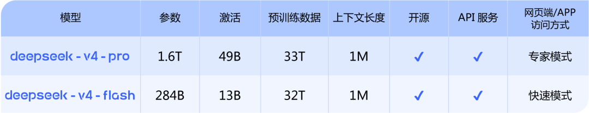
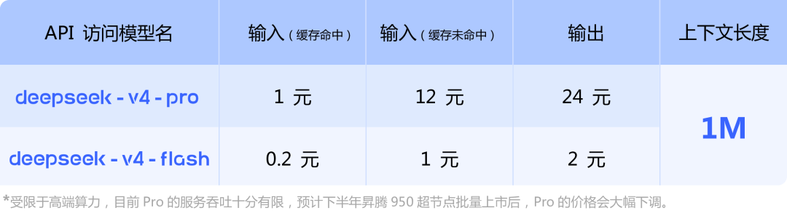
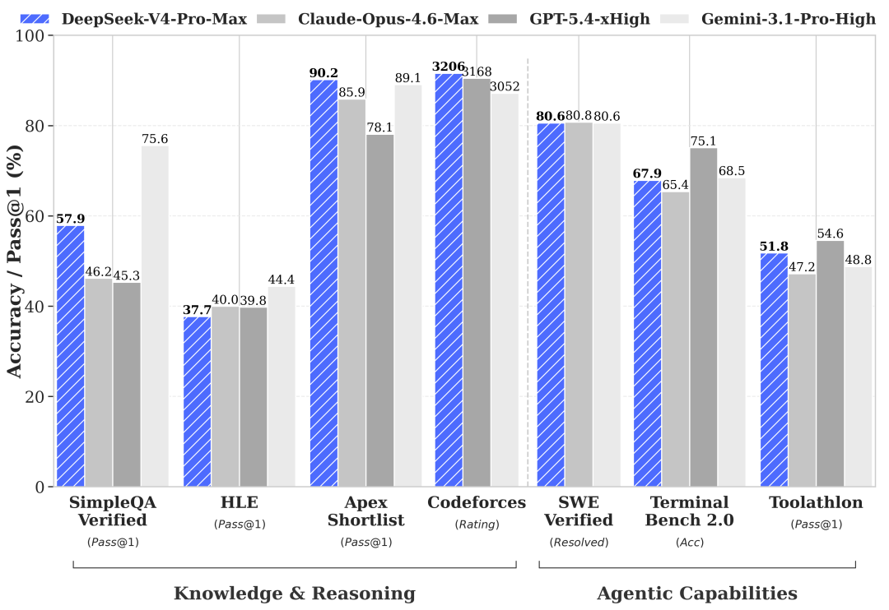
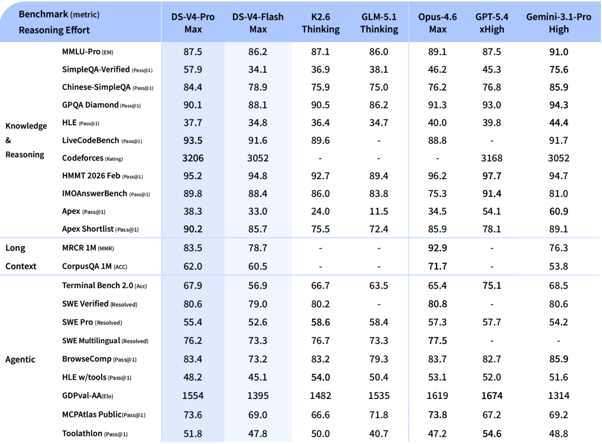

2026年4月24日，DeepSeek 正式发布 **V4 预览版**，副标题直接给出定位：「迈入百万上下文普惠时代」。这不是一次常规的性能迭代——它同时动了两件事：**能力天花板** 和 **价格地板**。

---

## 一、DeepSeek V4 核心参数

### 模型规格

| 模型 | 参数量 | 激活参数 | 预训练数据 | 上下文 | 访问方式 |
|------|--------|---------|----------|--------|---------|
| **deepseek-v4-pro** | 1.6T | 49B | 33T | **1M** | 专家模式 |
| **deepseek-v4-flash** | 284B | 13B | 32T | **1M** | 快速模式 |

两款模型均开源、均提供 API，均支持 1M token 的超长上下文。

### 官方定价

| 模型 | 输入（缓存命中） | 输入（缓存未命中） | 输出 | 上下文 |
|------|--------------|----------------|------|------|
| **V4-Pro** | ¥1/M | ¥12/M | ¥24/M | 1M |
| **V4-Flash** | ¥0.2/M | ¥1/M | **¥2/M** | 1M |

> *官方注：受限于高端算力，目前 Pro 服务吞吐十分有限，预计下半年昇腾 950 超节点批量上市后，Pro 的价格会大幅下调。*

### Benchmark 表现

在 Agentic 能力（SWE-bench 80.6%）、代码竞赛（Codeforces Rating 3206）和知识推理（Apex Shortlist 90.2%）三大核心赛道上，V4-Pro 与 Claude-Opus-4.6、GPT-5.4 处于同一量级竞争。

---

## 二、对 Vibe Coding 市场的价格冲击：五条判断

### 判断 1：API 成本地板被彻底打穿

V4-Flash 输出价格 **¥2/M ≈ $0.28/M token**，对比 2026年4月当前主流模型：

| 模型 | 输出价格 | 倍数对比 |
|------|---------|---------|
| DeepSeek V4-Flash | $0.28/M | 1× |
| DeepSeek V4-Pro | ~$3.4/M | 12× |
| GPT-5（初版，2025.08） | $5/M | **18×** |
| Claude Haiku 4.5 | $5/M | **18×** |
| Claude Sonnet 4.6 | $15/M | **54×** |
| GPT-5.4 | $15/M | **54×** |
| Gemini 3.1 Pro | $12/M | **43×** |
| Claude Opus 4.7 | $25/M | **89×** |
| GPT-5.5（2026.04.23） | $30/M | **107×** |
| GPT-5.5 Pro | $180/M | **643×** |

对于以 API 计费为底层逻辑的 Vibe Coding 工具（如 Cursor API 模式、自建工作流），这直接把成本打到地板价。GPT-5.5 发布仅隔一天，V4-Flash 就把它的输出成本打出 107 倍差距。

### 判断 2：1M 上下文 = Vibe Coding 的「全项目编程」成为现实

过去 Cursor、Copilot 的上下文窗口限制（通常 128K–200K），使得用户必须手动选择"喂给 AI 哪些文件"。V4 的 1M 上下文意味着：

- 中型项目（10–50 万行代码）**整体塞入一次对话**
- AI 可以真正理解跨文件依赖、全局架构
- Vibe Coding 从「文件级对话」升级为「项目级协作」

这是能力维度的结构性变化，不只是价格。

### 判断 3：订阅制产品面临价值重估压力

目前主流 Vibe Coding 工具订阅价（2026年4月）：

| 工具 | 基础档 | 高阶档 | 旗舰档 |
|------|--------|--------|--------|
| **Claude Code** | Pro $20/月 | Max $100/月（5×） | Max $200/月（20×） |
| **Cursor** | Pro $20/月 | Pro+ $60/月 | Ultra $200/月 |
| **OpenAI Codex** | 含于 ChatGPT Plus $20/月 | — | ChatGPT Pro $200/月 |
| **Windsurf** | Pro $15/月 | Pro Ultimate $60/月 | Max $200/月 |
| **GitHub Copilot** | Individual $10/月 | Business $19/用户/月 | Enterprise $39/用户/月 |

当底层 API 成本降低 50–100×，这些产品的**「溢价空间」**来自哪里？用户会更清楚地意识到自己在为什么付费——IDE 集成体验、工作流管理、多模型切换、团队协作功能。

**价格内卷将从 API 层蔓延至订阅层**，无差异化功能的平庸工具将首先被淘汰。

### 判断 4：中国市场 Vibe Coding 工具加速崛起

对国内开发者而言，V4-Pro 输入 ¥12/M、输出 ¥24/M 已是极具竞争力的"国产顶级模型"价格。MarsCode（字节）、通义灵码（阿里）、文心快码（百度）将获得更低成本的底层模型供给，**国产 Vibe Coding 工具的性价比窗口在下半年 Pro 降价后将进一步打开**。

### 判断 5：Pro 价格的"第二波冲击"还没来

官方明确：**下半年昇腾 950 超节点批量上市后，Pro 价格大幅下调**。

这意味着当前仍是过渡期。真正的价格震荡可能在 2026 Q3–Q4，当 V4-Pro（1.6T 参数、49B 激活、1M 上下文）以接近 Flash 的价格开放时，整个 AI 编程工具栈的定价逻辑将被彻底重写。

---

## 三、结论

DeepSeek V4 的发布不是一场普通的模型升级，而是一次**价格武器化**的战略动作。

对 Vibe Coding 市场而言：
- **短期**：API 计费类工具成本直接下压，Flash 成为新的「够用」基准
- **中期**：订阅制工具面临价值重估，差异化能力成为存活关键
- **长期**：Pro 降价落地后，整个赛道的竞争焦点将从「模型能力」转向「工作流体验」

面对硅基智能的价格战，能活下来的 Vibe Coding 产品，一定不只是在卖 token。

---

**官方链接**
- 发布公告：[api-docs.deepseek.com/zh-cn/news/news260424](https://api-docs.deepseek.com/zh-cn/news/news260424)
- 模型权重（Hugging Face）：[huggingface.co/collections/deepseek-ai/deepseek-v4](https://huggingface.co/collections/deepseek-ai/deepseek-v4)
- 模型权重（ModelScope）：[modelscope.cn/collections/deepseek-ai/DeepSeek-V4](https://modelscope.cn/collections/deepseek-ai/DeepSeek-V4)
