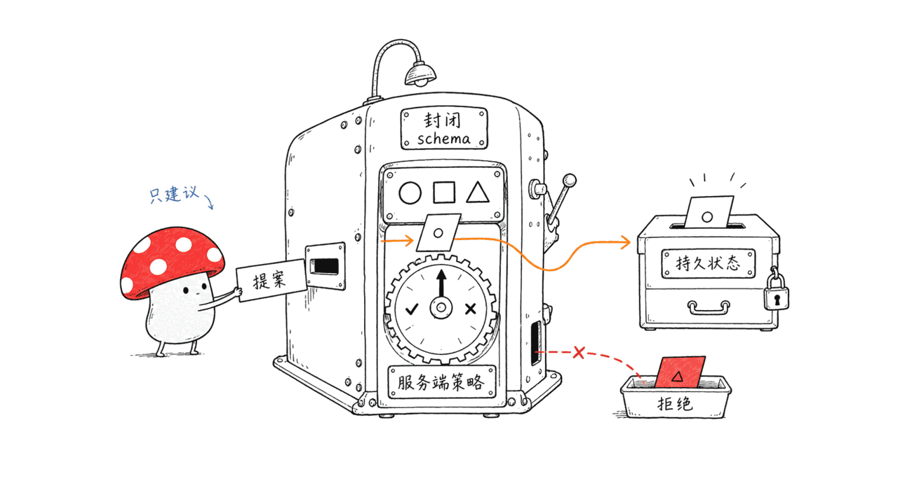
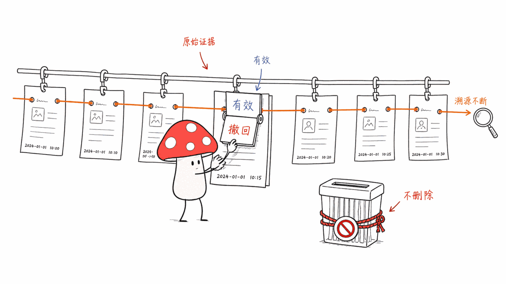
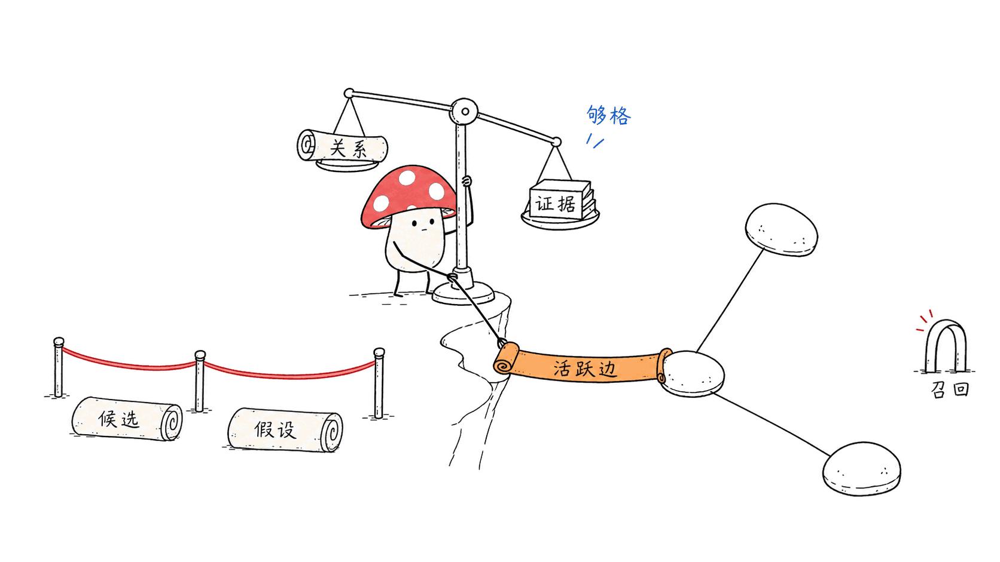
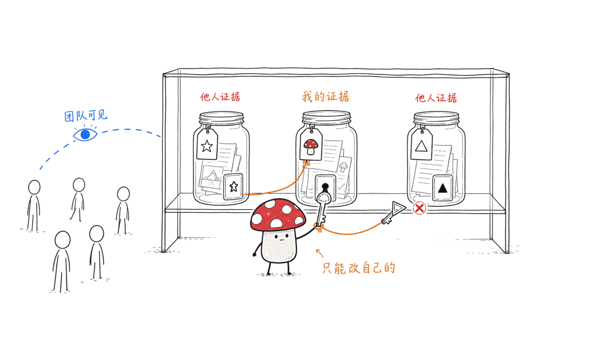

*by Mycelium Protocol*

---

项目地址：https://github.com/markhuangai/dense-mem
配套研究预印本：《Governed Enterprise AI Memory Beyond RAG: From Vector Retrieval to Permissioned Knowledge Graphs》https://zenodo.org/records/21403316
授权：Apache-2.0

---

## 一句话结论

**Dense-Mem 是一个自托管的 MCP 记忆服务，核心理念叫「受治理的 AI 记忆」（governed AI memory）。** 跟本站前几篇写过的 Agent 记忆系统（Hermes 的 FTS5+摘要、Nerve 的热记忆+语义深记忆）都不一样，Dense-Mem 解决的不是"怎么存怎么搜"，而是**"模型说的话，凭什么能变成一条永久记录"**这个更难的问题。Go 1.26 写的，Apache-2.0，36 star，8 月 17 日仍在更新，背后配了一篇正式的研究预印本。

## 模型写入的只是「提案」，不是「事实」

这是整个项目最核心的一句话："**Provider output is a proposal. Closed-schema validation and deterministic server policy decide durable state.**"（供应商/模型的输出只是一份提案，能不能变成持久状态，由封闭 schema 校验和确定性的服务端策略决定。）

大部分"AI 记忆"工具的默认行为是：模型觉得这句话值得记，就写进去了。Dense-Mem 中间插了一道闸——**LLM 只有建议权，没有直接写入权**。这道闸把"模型幻觉一个不存在的事实"和"模型记录了一个真实发生的事"这两种情况分开处理。

## 证据只增不删，生命周期变更不抹历史

"证据精确、持久、只增不删。生命周期动作改变的是**有效状态**，不会删除溯源或轨迹血统。" 换句话说：一条记忆被标记为"过期"或"已撤回"，底层的原始证据和它曾经存在过的完整记录依然留着，你随时能审计"这条记忆是什么时候、因为什么被判定失效的"。这跟很多记忆系统"过时就删掉"的做法正相反——**Dense-Mem 假设审计能力比存储空间更重要。**

## 关系要「够格」才能上图

Entity（实体）和带类型的 Value（值）是语义节点，但 **Relationship（关系）只有在它的证据支持"合格"（eligible）时，才会成为图里一条活跃的边**。默认召回会主动排除"候选"和"假设"——只有当一个关系的支持路径在请求的时间点上合格，才会把对应证据返回给你。

这意味着 Dense-Mem 的召回结果里不会混进"模型觉得可能是这样但没确认"的东西——这类未决内容有自己的分层，不会悄悄冒充成事实回到对话里。

## 权限模型：团队可见 ≠ 你能改

认证体系把一个不可变的行动者解析成"团队 + 身份 + 成员资格 + 永久所有者别名 + 可选凭据"。团队可见性和所有者的修改权限是分开的两件事——**一个作者只能修改自己的证据或自己拥有的语义记录**，即使别的团队成员能看到这条记录。SSO 浏览器会话用的是所选成员资格的永久所有者别名，本身没有直接凭据；API Key 请求携带的凭据，它的稳定 ID 本身就是永久所有者别名。团队、身份、成员资格、凭据这几个字段，客户端都不能自己选或替换——这条线卡得很死。

## 部署：60秒起步，PostgreSQL 是唯一权威

Docker Compose 一把梭，配好 `POSTGRES_PASSWORD`、`CONTROL_PORTAL_TOKEN`、`AI_API_KEY` 三个密钥就能起服务。**PostgreSQL + pgvector 是知识、生命周期、溯源、搜索、授权、审计的唯一持久权威；Redis 只做协调**，单节点部署甚至可以用进程内协调代替 Redis。

有个细节值得一提：项目之前用过 Neo4j，现在的版本会拒绝任何 `NEO4J_*` 配置——**Neo4j 现在只是历史数据迁移的输入源，不是运行时的备选方案**。如果你手上还有老的 Neo4j 语料，得先用 v2.1.2 跑一遍引导迁移，再升级到不带这些变量的新版本。

外部自动化的唯一合法入口是 `/mcp` 这个 MCP 协议端点；浏览器路由是给人用的一等界面，不是另一套可以绕过 MCP 的公开自动化 API——这条边界也写得很清楚。

## 谁该看这个

**适合**：企业场景下需要"AI 记住的东西必须可审计、可追溯、可撤销但不能销毁证据"的团队；已经在用 MCP 生态、想要一个治理级别更高的记忆后端而不是简单的向量库的人。

**不适合 / 需要注意**：这套东西的复杂度是为企业级治理需求准备的，如果你只是想要一个个人用的轻量记忆插件，Hermes Agent 或 Nerve 那种"热记忆+语义搜索"的简单模型可能更合适——Dense-Mem 的权限模型和证据生命周期对个人场景是过度设计。

---

> © 2026 Author: Mycelium Protocol. 本文采用 [CC BY 4.0](https://creativecommons.org/licenses/by/4.0/deed.zh) 授权——欢迎转载和引用，须注明作者姓名及原文链接，不得去除署名后以原创发布。

<!--EN-->

## TL;DR

**Dense-Mem is a self-hosted MCP memory server built around the idea of "governed AI memory."** Unlike the agent memory systems covered on this blog recently — Hermes's FTS5-plus-summarization or Nerve's hot-memory-plus-semantic-search — Dense-Mem doesn't solve "how to store and search." It solves the harder problem: **what gives the model's output the right to become a permanent record.** Written in Go 1.26, Apache-2.0, 36 stars, still updating as of August 17, backed by a formal research preprint.

## What the model writes is a proposal, not a fact

The project's central line: "**Provider output is a proposal. Closed-schema validation and deterministic server policy decide durable state.**"

Most "AI memory" tools default to: if the model thinks something is worth remembering, it just gets written. Dense-Mem inserts a gate in between — **the LLM only has the right to propose, not to write directly.** That gate separates "the model hallucinated a fact that doesn't exist" from "the model recorded something that actually happened."

## Evidence only accumulates, lifecycle changes don't erase history

"Evidence is exact, durable, and append-only. A lifecycle action changes its effective state without deleting provenance or trace lineage." In other words: marking a memory as "expired" or "retracted" doesn't delete the underlying original evidence or the full record that it once existed — you can always audit exactly when and why a memory was judged invalid. This is the opposite of the common "delete when stale" approach. **Dense-Mem assumes auditability matters more than storage space.**

## Relationships have to "qualify" before they get on the graph

Entities and typed Values are semantic nodes, but **Relationships only become active edges in the graph once their evidence support is eligible.** Default recall actively excludes "candidates" and "hypotheses" — evidence is only returned when its relationship's support path is eligible at the requested point in time.

That means Dense-Mem's recall results never quietly mix in "the model thinks this might be true but hasn't confirmed it" — unconfirmed content lives in its own tier and never sneaks back into a conversation disguised as fact.

## The permission model: team visibility ≠ your right to edit

The auth system resolves one immutable actor as "team + identity + membership + permanent owner alias + optional credential." Team visibility and owner mutation authority are kept strictly separate — **an author can only change their own evidence or the semantic records they own**, even if other team members can see that record. An SSO browser session uses the selected membership's permanent owner alias and carries no direct credential; an API-key request carries a credential whose stable ID is itself the permanent owner alias. None of these fields — team, identity, membership, credential — can be chosen or swapped by the client. That line is drawn hard.

## Deployment: 60 seconds to start, PostgreSQL as the sole authority

One Docker Compose command, three secrets to fill in (`POSTGRES_PASSWORD`, `CONTROL_PORTAL_TOKEN`, `AI_API_KEY`), and the service is up. **PostgreSQL with pgvector is the sole durable authority for knowledge, lifecycle, provenance, search, authorization, and audit; Redis is coordination only** — single-node deployments can even substitute process-local coordination for Redis.

One detail worth noting: the project previously used Neo4j, and current releases reject any `NEO4J_*` configuration — **Neo4j is now purely a migration input, not a runtime fallback.** If you're carrying an old Neo4j corpus, you first run the guided migration on v2.1.2, then upgrade to a version without those variables set.

The only legitimate entry point for external automation is the `/mcp` protocol endpoint; browser routes are a first-party human interface, not a separate public API that bypasses MCP — another boundary drawn clearly.

## Who should look at this

**Good fit**: enterprise teams that need "what the AI remembers must be auditable, traceable, and revocable without ever destroying the evidence"; anyone already in the MCP ecosystem who wants a memory backend with real governance instead of a plain vector store.

**Not a fit / worth noting**: this complexity is built for enterprise-grade governance needs — if you just want a lightweight personal memory plugin, the simpler "hot memory plus semantic search" model in Hermes Agent or Nerve is probably a better fit. Dense-Mem's permission model and evidence lifecycle are overkill for personal use.

---

> © 2026 Author: Mycelium Protocol. Licensed under [CC BY 4.0](https://creativecommons.org/licenses/by/4.0/) — free to share and adapt with attribution. You must credit the author and link to the original; removing attribution and republishing as original is not permitted.
