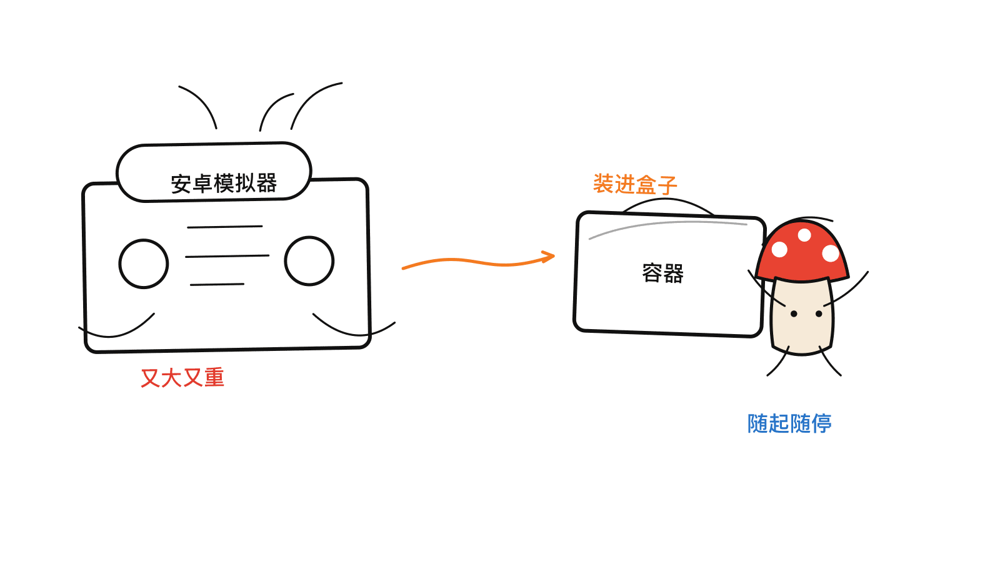
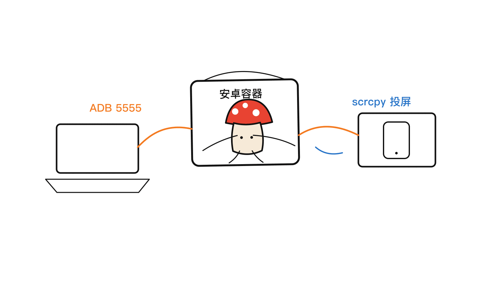
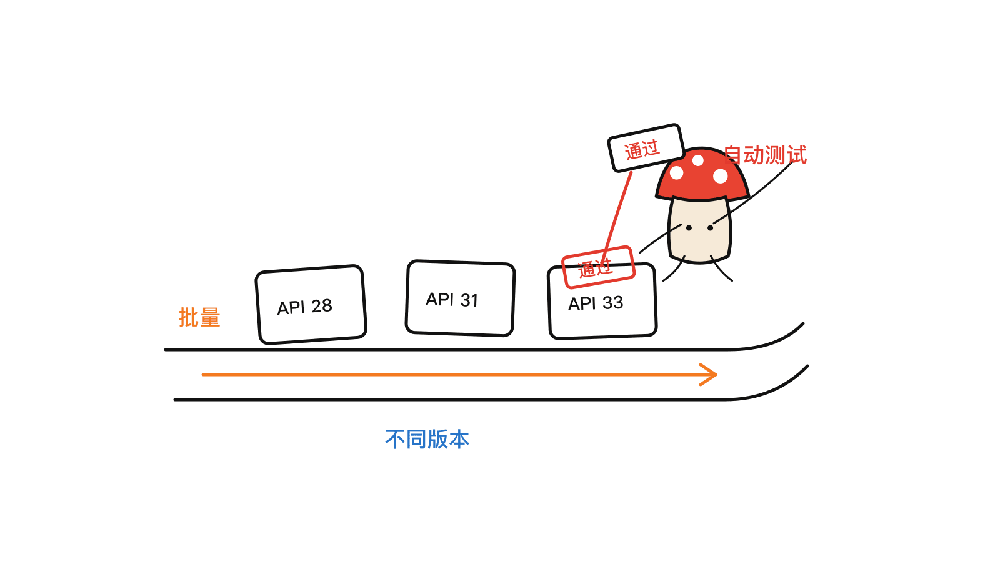
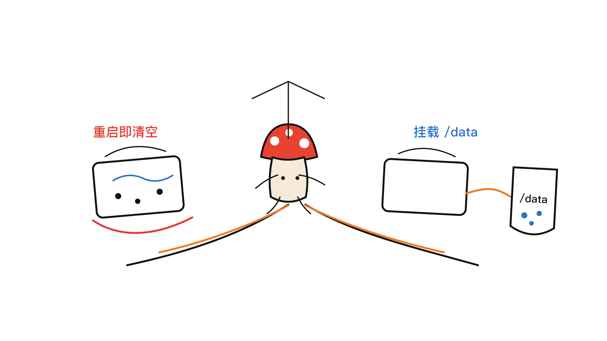

> 2026-06-23 · 工具观察 · 入门指南

**BLUF**：[HQarroum/docker-android](https://github.com/HQarroum/docker-android)（6.3k★，MIT 开源）把**安卓模拟器打包成一个容器里的服务**。它基于精简的 Alpine 系统，支持 **KVM/GPU 硬件加速**，可自定义 **Android API 版本**和**镜像类型（含 Google Play 商店）**，**无头后台运行**、内置 **ADB 5555 端口转发**，并能配合 **scrcpy** 远程投屏操控。容器重启默认**清空数据**，也支持挂载 `/data` 做**持久化**，还提供 **docker-compose 一键编排**。一句话：它最适合 **CI 自动化 UI 测试 / 批量兼容性流水线**——不用在每台机器上装一套笨重的 Android Studio。

---

## 一、它解决什么问题？

做安卓开发或测试的人都懂：**本地跑模拟器又重又慢**。Android Studio + AVD 一套装下来好几个 G，开一个模拟器吃掉大半内存，想在服务器上批量跑自动化测试更是麻烦——服务器通常没有图形界面。

docker-android 的思路很直接：**把模拟器塞进一个容器里，当成一个网络服务来用**。你不需要图形界面，容器在后台无头运行，外面通过 ADB 连进去操作；要跑测试就起容器，跑完就销毁，干净利落。



---

## 二、它能做什么？（核心特性）

- **轻量**：基于 Alpine 打包，体积可控（不含 SDK 的精简变体压缩后仅约 138 MB）。
- **硬件加速**：需要宿主机支持 **KVM**（CPU 虚拟化）；GPU 加速走 CUDA 变体。
- **可自定义**：构建时用 `API_LEVEL` 选 Android 版本、`IMG_TYPE` 选镜像类型（普通 `google_apis` 或带商店的 `google_apis_playstore`）、`ARCHITECTURE` 选架构。
- **无头 + 远程**：后台运行，内置 ADB 端口转发（默认 `5555`），可用 **scrcpy** 远程看屏幕、点操作。
- **数据策略**：默认重启即清空（适合干净测试）；挂载 `/data` 可持久化保存 AVD。
- **一键编排**：`docker-compose` 提供基础 / 带 GPU / 带商店等多种服务变体。

---

## 三、怎么跑起来？（最快路径）

最简单的方式是用官方 `docker-compose`：

```bash
docker compose up android-emulator              # 基础版
docker compose up android-emulator-cuda         # 带 GPU 加速
docker compose up android-emulator-cuda-store   # GPU + Google Play 商店
```

或者直接 `docker run`（关键是挂载 `/dev/kvm` 并暴露 5555 端口）：

```bash
docker run -it --rm --device /dev/kvm -p 5555:5555 android-emulator
```

也可以直接从 Docker Hub 拉预构建镜像（按 API 版本打标签）：

```bash
docker pull halimqarroum/docker-android:api-33
```

> ⚠️ 前提：宿主机内核要支持 **KVM**（Linux 物理机或开启嵌套虚拟化的云主机）。这也是为什么它主要面向 Linux CI 环境，而不是图形桌面。

---

## 四、怎么连接和操控？

容器跑起来后，宿主机用 ADB 连进去：

```bash
adb connect 127.0.0.1:5555
```

连上之后，它就是一台普通的安卓设备——`adb install`、`adb shell`、跑 UI 测试都照常。想**实时看屏幕**，本地装个 [scrcpy](https://github.com/Genymobile/scrcpy)，连上 ADB 后直接运行：

```bash
scrcpy
```

就能把容器里模拟器的画面投到本地操控（默认是 Pixel 预设，1080x1920）。



---

## 五、CI 自动化测试：它真正的主场

这才是 docker-android 的价值所在。在 CI 流水线里，你可以：

- **批量起多个容器**，每个跑**不同的 Android API 版本**（28 / 31 / 33…），并行做**兼容性测试**。
- 每次测试用**全新的干净环境**（重启清空，不留脏数据），结果可复现。
- 通过 NFS 挂载共享 SDK，做**分布式测试农场**。

几个常用的运行期环境变量（按需调）：

| 变量 | 默认 | 作用 |
|------|------|------|
| `MEMORY` | `8192` | 模拟器内存（MB） |
| `CORES` | `4` | CPU 核数 |
| `SKIP_AUTH` | `true` | 跳过 ADB 鉴权（CI 内网方便） |
| `DISABLE_ANIMATION` | `false` | 关动画（测试更稳更快） |
| `EXTRA_FLAGS` | `-no-metrics -no-audio -partition-size=8192` | 追加模拟器参数 |



---

## 六、数据：清空还是保留？

默认行为是**容器重启就清空**模拟器数据——这对 CI 是好事（每次干净）。但如果你想**保留 AVD 状态**（比如装好了一堆 App、配置好了环境），挂载 `/data` 即可：

```bash
docker run -it --rm --device /dev/kvm -p 5555:5555 \
  -v ~/android_avd:/data android-emulator
```

构建时还能用 `INSTALL_ANDROID_SDK=0` 跳过内置 SDK，改成挂载外部 SDK 目录，进一步减小镜像、便于多容器共享：

```bash
docker build -t android-emulator --build-arg INSTALL_ANDROID_SDK=0 .
docker run -it --rm --device /dev/kvm -p 5555:5555 \
  -v /shared/android/sdk:/opt/android/ android-emulator
```



---

## 七、适合谁 / 不适合谁

**适合**：

- CI/CD 里做安卓 **UI 自动化测试**、**多版本兼容性回归**的团队。
- 想在 Linux 服务器上**无头跑模拟器**、不想装图形桌面的人。
- 需要**可复现、用完即弃**测试环境的场景。

**注意 / 局限**：

- **必须有 KVM**：纯靠软件模拟会非常慢，Mac/Windows 桌面直接用体验不佳（更适合 Linux 物理机 / 支持嵌套虚拟化的云主机）。
- 镜像带 SDK 的版本体积不小（API 33 压缩后约 2 GB 级别），按需选版本。
- 它是**测试 / 自动化工具**，不是给终端用户日常用的安卓桌面。

---

## 结语

docker-android 把「安卓模拟器」从一个笨重的本地应用，变成了一个**可编排、可批量、用完即弃的容器服务**。对需要在 CI 里跑安卓测试的团队，它把最烦的环境问题（装 SDK、配模拟器、没图形界面）一次性解决掉——`docker compose up` 一条命令，ADB 连上就能测。

> 📌 项目地址（请直接复制访问）：
> GitHub —— https://github.com/HQarroum/docker-android
> Docker Hub —— https://hub.docker.com/r/halimqarroum/docker-android

---

> © 2026 Author: Mycelium Protocol. 本文采用 [CC BY 4.0](https://creativecommons.org/licenses/by/4.0/deed.zh) 授权——欢迎转载和引用，须注明作者姓名及原文链接，不得去除署名后以原创发布。

<!--EN-->

> 2026-06-23 · Tool Notes · Beginner Guide

**BLUF**: [HQarroum/docker-android](https://github.com/HQarroum/docker-android) (6.3k★, MIT) packages **the Android emulator as a service inside a container**. Built on a minimal Alpine base, it supports **KVM/GPU acceleration**, customizable **Android API level** and **image type (including Google Play Store)**, **headless** operation, built-in **ADB port 5555 forwarding**, and **scrcpy** remote screen control. Containers **wipe data on restart** by default, or mount `/data` for **persistence**, with **docker-compose** one-command orchestration. In short: it's built for **CI automated UI testing and batch compatibility pipelines** — no bulky Android Studio on every machine.

---

## 1. The problem it solves

Anyone doing Android dev or testing knows local emulators are **heavy and slow**. Running automated tests at scale on a server is worse — servers usually have no GUI. docker-android's approach: **put the emulator in a container and treat it as a network service.** No GUI needed; it runs headless, you drive it over ADB; spin up a container to test, destroy it when done.


---

## 2. What it does (key features)

- **Lightweight**: Alpine-based; the SDK-less variant is ~138 MB compressed.
- **Hardware acceleration**: needs host **KVM** (CPU virtualization); GPU via the CUDA variant.
- **Customizable**: build args `API_LEVEL` (Android version), `IMG_TYPE` (`google_apis` or `google_apis_playstore`), `ARCHITECTURE`.
- **Headless + remote**: built-in ADB forwarding (default `5555`), screen control via **scrcpy**.
- **Data strategy**: ephemeral by default (clean tests); mount `/data` to persist the AVD.
- **Orchestration**: `docker-compose` with base / GPU / Play Store variants.

---

## 3. Getting it running (fastest path)

Via the official `docker-compose`:

```bash
docker compose up android-emulator              # base
docker compose up android-emulator-cuda         # GPU acceleration
docker compose up android-emulator-cuda-store   # GPU + Google Play Store
```

Or plain `docker run` (mount `/dev/kvm`, expose 5555):

```bash
docker run -it --rm --device /dev/kvm -p 5555:5555 android-emulator
```

Or pull a pre-built image from Docker Hub (tagged by API level):

```bash
docker pull halimqarroum/docker-android:api-33
```

> ⚠️ Requirement: the host kernel must support **KVM** (a Linux machine or a cloud VM with nested virtualization). That's why it targets Linux CI, not graphical desktops.

---

## 4. Connect and control

Once running, connect ADB from the host:

```bash
adb connect 127.0.0.1:5555
```

From there it's a normal Android device — `adb install`, `adb shell`, UI tests all work. To **see the screen live**, install [scrcpy](https://github.com/Genymobile/scrcpy) locally, connect ADB, then run:

```bash
scrcpy
```

This mirrors the container's emulator (Pixel preset, 1080x1920 by default) to your machine for control.


---

## 5. CI automation: its real home

This is where docker-android shines. In a pipeline you can:

- **Spin up many containers**, each running a **different Android API level** (28 / 31 / 33…) for parallel **compatibility testing**.
- Use a **fresh clean environment** each run (wiped on restart) for reproducibility.
- Share an SDK over NFS for a **distributed test farm**.

Handy runtime env vars:

| Variable | Default | Purpose |
|------|------|------|
| `MEMORY` | `8192` | Emulator RAM (MB) |
| `CORES` | `4` | CPU cores |
| `SKIP_AUTH` | `true` | Skip ADB auth (convenient on CI networks) |
| `DISABLE_ANIMATION` | `false` | Disable animations (steadier, faster tests) |
| `EXTRA_FLAGS` | `-no-metrics -no-audio -partition-size=8192` | Extra emulator args |


---

## 6. Data: wipe or keep?

Default behavior **wipes emulator data on restart** — good for CI (clean every time). To **keep AVD state** (installed apps, configured env), mount `/data`:

```bash
docker run -it --rm --device /dev/kvm -p 5555:5555 \
  -v ~/android_avd:/data android-emulator
```

At build time, `INSTALL_ANDROID_SDK=0` skips the bundled SDK so you can mount an external one — smaller image, shareable across containers:

```bash
docker build -t android-emulator --build-arg INSTALL_ANDROID_SDK=0 .
docker run -it --rm --device /dev/kvm -p 5555:5555 \
  -v /shared/android/sdk:/opt/android/ android-emulator
```


---

## 7. Who it's for / not for

**For**: teams doing Android **UI automation** and **multi-version compatibility** in CI/CD; people who want **headless emulators** on Linux servers without a desktop; scenarios needing **reproducible, disposable** test environments.

**Limits**: **KVM is required** (pure software emulation is painfully slow, so Mac/Windows desktops are a poor fit — prefer Linux machines or nested-virtualization cloud VMs); SDK-bundled images are large (API 33 ~2 GB compressed); it's a **testing/automation tool**, not a daily-driver Android desktop.

---

## Closing

docker-android turns the Android emulator from a bulky local app into an **orchestratable, batchable, disposable container service**. For teams running Android tests in CI, it solves the most annoying part — SDK setup, emulator config, no GUI — in one shot: `docker compose up`, connect ADB, and test.

> 📌 Project (copy to visit):
> GitHub — https://github.com/HQarroum/docker-android
> Docker Hub — https://hub.docker.com/r/halimqarroum/docker-android

---

> © 2026 Author: Mycelium Protocol. Licensed under [CC BY 4.0](https://creativecommons.org/licenses/by/4.0/) — free to share and adapt with attribution. You must credit the author and link to the original; removing attribution and republishing as original is not permitted.
