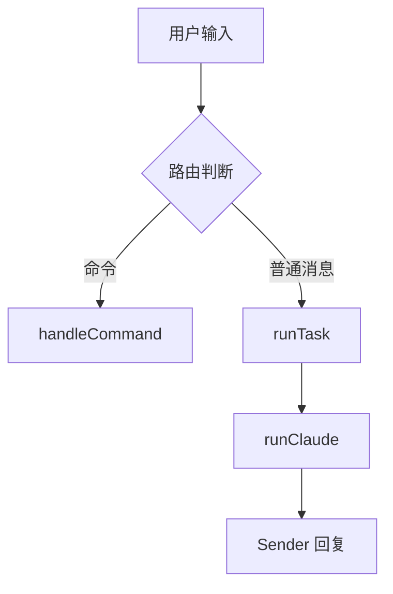

*by Mycelium Protocol*

---

GitHub：plait-board/drawnix  
官网：drawnix.com  
许可证：MIT  
语言：TypeScript  
Stars：14,580 · Forks：1,254  
最新版本：v0.4.0（2026-04-19）  
底层框架：Plait（PingCode 自研）

---

## 一、是什么

Drawnix 是 PingCode（worktile）开源的一体化白板工具，涵盖思维导图、流程图、自由画等主要场景，部署一个 Docker 容器就能用，也可以直接访问 drawnix.com。

名字来源：**Draw**（绘画）+ **Phoenix**（凤凰）。"Draw Beyond, Rise Above."

---

## 二、功能全景

| 类别 | 功能 |
|------|------|
| **核心画图** | 思维导图、流程图、自由画（画笔）、图形 |
| **橡皮擦** | 含绘制擦除视觉效果 |
| **无限画布** | 缩放、滚动 |
| **文字** | 富文本（Slate 框架）、字体大小调节 |
| **图片** | 插入图片 |
| **导入** | Markdown → 思维导图，mermaid → 流程图 |
| **导出** | PNG、SVG（v0.4.0 新增）、JSON（.drawnix）、复制到剪贴板 |
| **编辑操作** | 撤销/重做/复制/粘贴/复制元素/删除 |
| **箭头** | 自定义箭头类型、描边样式 |
| **主题** | 明暗主题模式 + 主题颜色保存 |
| **激光笔** | 演示用（v0.4.0 新增）|
| **自动保存** | 浏览器缓存 |
| **移动端** | 触摸操作、触摸设备文本编辑 |
| **多语言** | 中文、英文、俄语、阿拉伯语、越南语 |

---

## 三、快速上手

**Docker（最快路径）**：

```bash
docker pull pubuzhixing/drawnix:latest
docker run -p 3000:3000 pubuzhixing/drawnix:latest
```

**本地开发**：

```bash
git clone https://github.com/plait-board/drawnix
cd drawnix
npm install
npm run start
```

**直接用**：drawnix.com（无需注册，浏览器缓存自动保存）

---

## 四、两个特色输入

### Markdown → 思维导图

粘贴一段 Markdown 列表结构，直接生成思维导图节点树。把会议纪要、大纲、文档结构快速变成可视化图。

### mermaid → 流程图

粘贴 mermaid 语法，自动渲染为流程图。从已有文档或 LLM 输出直接导入，不需要手动拖拽连线。



---

## 五、技术架构

```
drawnix/
├── apps/web          # drawnix.com 前端
├── packages/
│   ├── drawnix       # 白板应用核心
│   ├── react-board   # React 视图层
│   └── react-text    # 文本渲染模块
```

**底层：Plait 画图框架**

Plait 是 PingCode 为自家知识库产品（PingCode Wiki）开发的开源画图框架，支持 Angular 和 React 两种 UI 框架。Drawnix 是在 Plait 上搭建的产品层。

**插件架构**

Drawnix 的核心设计是插件机制——每种画图能力（思维导图、流程图、自由画、橡皮擦、激光笔）都是独立插件，可以按需组合。这样的架构让它能在不同 UI 框架下复用同一套绘图逻辑，也让社区贡献变得更清晰（每个 PR 通常只动一个插件）。

**富文本：Slate**

节点内文本基于 Slate 框架渲染，支持内联格式、字体大小等富文本能力。

---

## 六、v0.4.0 更新（2026-04-19）

这个版本集中打磨了导出和演示场景：

- **SVG 导出**（+复制到剪贴板 SVG/PNG）——矢量格式，嵌进文档或进一步编辑都无损
- **激光笔**——演示时临时高亮，不在画布上留痕
- **文本字体大小**——节点文字大小可调
- **自由画预设**——颜色和粗细有预设选项，不用每次手动调
- **More Options 下拉菜单**——复制/删除快捷键集中在一个菜单
- **越南语翻译**——社区贡献的第 5 种语言
- **触摸设备文本编辑**——移动端可以直接编辑节点文字

---

## 七、与同类工具比

| 工具 | 定位 | 思维导图 | mermaid 导入 | Docker |
|------|------|----------|-------------|--------|
| **Drawnix** | 一体化白板 | ✅ 完整 | ✅ | ✅ |
| Excalidraw | 手绘风白板 | 有限 | 需插件 | ✅ |
| draw.io | 专业流程图 | ✅ | ✅ | ✅ |
| tldraw | 白板框架 | — | — | — |

Drawnix 的插件架构让它在「思维导图 + 流程图 + 自由画」三件事同时做的场景里比较有竞争力。Excalidraw 更侧重手绘审美，draw.io 更侧重专业流程图，Drawnix 定位在两者之间偏向知识工作。

---

## 八、背景

Drawnix 由 PingCode（原 Worktile）开源，公司在研发 PingCode Wiki 的过程中积累了 Plait 框架，并将其开源。Drawnix 是这套框架的对外产品形态，目前正在向「Dawn（破晓）」版本高频迭代——这个版本名字本身也是凤凰意象的延续。

14K stars，1254 forks，HelloGitHub 推荐，Trendshift 趋势榜上榜，社区贡献者来自多个国家（俄罗斯/越南/阿拉伯世界的语言包均由社区提交）。

---

*Mycelium Protocol — 追踪 AI 系统的底层演化*

---

> **关于 Mycelium**
>
> 菌丝协议。持续追踪 AI 工具、系统和实验的内容节点。

---

<!--EN-->

## Drawnix: Open-Source All-in-One Whiteboard — Mind Map + Flowchart + Freehand, Plugin Architecture, 14K Stars

*by Mycelium Protocol*

---

GitHub: plait-board/drawnix  
Site: drawnix.com  
License: MIT  
Language: TypeScript  
Stars: 14,580 · Forks: 1,254  
Latest: v0.4.0 (2026-04-19)  
Core framework: Plait (PingCode in-house)

---

### What It Is

Drawnix is PingCode (Worktile)'s open-source all-in-one whiteboard covering mind maps, flowcharts, and freehand drawing. One Docker container, or directly at drawnix.com — no sign-up required, auto-saved to browser cache.

Name: **Draw** + **Phoenix**. "Draw Beyond, Rise Above."

---

### Features

| Category | What's there |
|----------|-------------|
| **Core drawing** | Mind maps, flowcharts, freehand, shapes |
| **Eraser** | With visual erase effect |
| **Infinite canvas** | Pan + zoom |
| **Text** | Rich text (Slate), adjustable font size |
| **Images** | Inline image insertion |
| **Import** | Markdown → mind map, Mermaid → flowchart |
| **Export** | PNG, SVG (v0.4.0), JSON (.drawnix), clipboard copy |
| **Editing** | Undo/redo/copy/paste/duplicate/delete |
| **Arrows** | Custom arrow types, stroke styles |
| **Themes** | Light/dark + persistent theme colors |
| **Laser pointer** | Presentation mode, no canvas marks (v0.4.0) |
| **Auto-save** | Browser cache |
| **Mobile** | Touch support including text editing |
| **i18n** | Chinese, English, Russian, Arabic, Vietnamese |

---

### Quickstart

**Docker:**

```bash
docker pull pubuzhixing/drawnix:latest
docker run -p 3000:3000 pubuzhixing/drawnix:latest
```

**Local dev:**

```bash
git clone https://github.com/plait-board/drawnix
cd drawnix
npm install
npm run start
```

---

### Two Standout Inputs

**Markdown → Mind Map**: paste a markdown list and get a mind-map node tree — useful for turning meeting notes, outlines, or LLM outputs into diagrams without manual dragging.

**Mermaid → Flowchart**: paste mermaid syntax, get a rendered flowchart. Useful when existing documentation or LLM outputs already use mermaid.

---

### Architecture

```
drawnix/
├── apps/web          # drawnix.com frontend
├── packages/
│   ├── drawnix       # whiteboard app core
│   ├── react-board   # React view layer
│   └── react-text    # text rendering
```

**Core: Plait drawing framework** — PingCode's in-house open-source drawing framework, developed during the PingCode Wiki product, supporting both Angular and React UI layers. Drawnix is the product layer above it.

**Plugin architecture** — each capability (mind map, flowchart, freehand, eraser, laser pointer) is an independent plugin, composable and independently contributed. This keeps PRs focused and lets the same drawing logic run under different UI frameworks.

**Rich text: Slate** — node text uses the Slate rich-text framework, enabling inline formatting and font size control.

---

### v0.4.0 Highlights (2026-04-19)

This release focused on export and presentation:

- **SVG export** + clipboard copy (SVG and PNG) — lossless format, embeddable in docs
- **Laser pointer** — highlights during presentations without leaving marks
- **Text font size** control on nodes
- **Freehand presets** — color and thickness presets for drawing tools
- **More Options dropdown** — duplicate/delete shortcuts centralized
- **Vietnamese i18n** — community-contributed 5th language
- **Touch device text editing** — direct text input on mobile

---

### vs. Similar Tools

| Tool | Angle | Mind map | Mermaid import | Docker |
|------|-------|----------|---------------|--------|
| **Drawnix** | All-in-one whiteboard | ✅ Full | ✅ | ✅ |
| Excalidraw | Sketchy whiteboard | Limited | Plugin | ✅ |
| draw.io | Professional diagrams | ✅ | ✅ | ✅ |
| tldraw | Whiteboard framework | — | — | — |

Drawnix occupies the space between "sketchy creativity tool" (Excalidraw) and "professional flowchart editor" (draw.io), landing closest to knowledge-work whiteboarding that needs mind maps as a first-class feature.

---

### Background

Drawnix is backed by PingCode, which built the Plait framework internally for their wiki product before open-sourcing it. Drawnix is the standalone product form of that framework. The team is actively iterating toward a "Dawn (破晓)" release — continuing the phoenix metaphor.

14K stars, 1,254 forks, HelloGitHub featured, Trendshift trending. Community contributors have added Russian, Arabic, and Vietnamese language packs.

---

*Mycelium Protocol — tracking the deep evolution of AI systems*

© 2026 Mycelium Protocol. All rights reserved.
