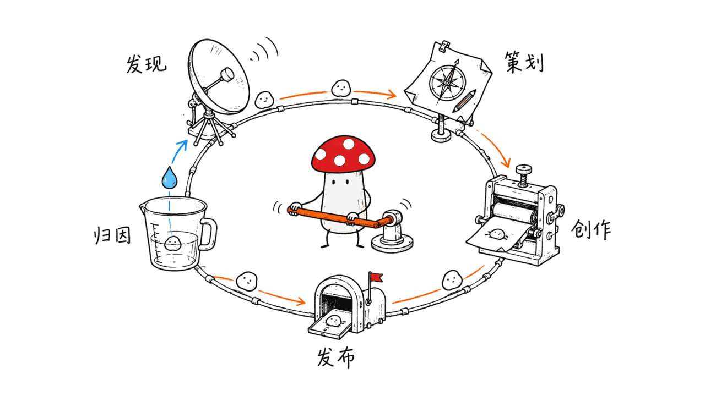
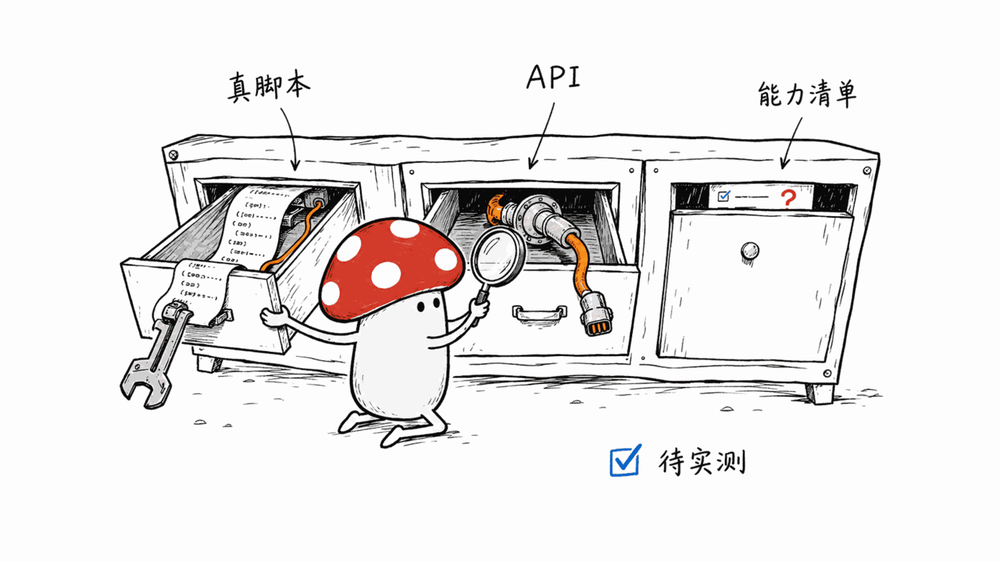
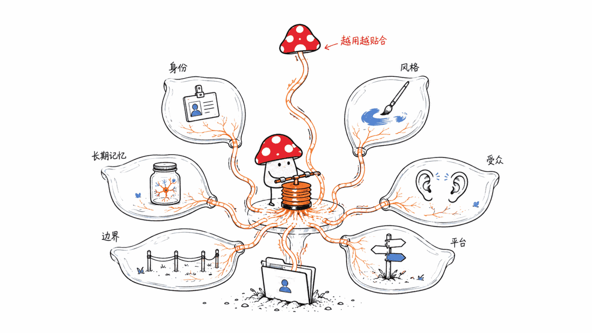
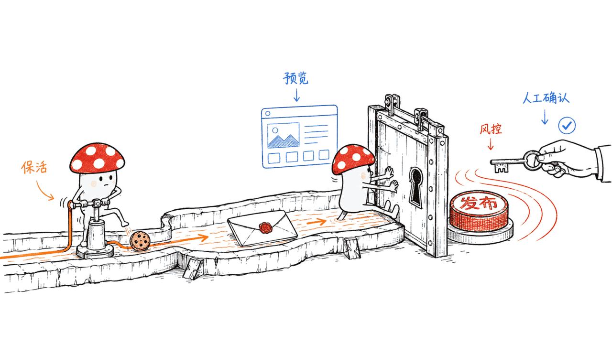

项目地址：https://github.com/ZJU-REAL/Easel
许可：Apache-2.0 ｜ 语言：Python ｜ 创建于 2026-08-28，本文写作时不到一周，187 star，0 open issue

## BLUF

Easel 是浙江大学 REAL Lab 与北京大学 OpenDCAI Lab 联合做的开源社媒内容工作台：一个基于 OpenClaw Agent 的系统，把账号画像、112 个可执行 Skill 和真实媒体工具接在一起，走"发现→策划→创作→发布→归因"五层闭环，直接支持小红书、抖音、快手、知乎、B站、微信视频号六个平台的登录与发布。README 自己给这个项目的定位是"把研究成果带进真实社媒创作场景的一次实践"——出身是学术团队，目标却是给普通创作者干活。

本站自己的发布链路是 M2（微信公众号，Node.js）+ M3（小红书，Python + Docker 化的 Go MCP），两条独立管线各管一个平台。Easel 想做的是同一个 Agent 贯穿六个平台、五个环节，是完全不同的架构取舍——这也是这篇文章最想讲清楚的地方。

## 五层工作流，112 个 Skill 怎么分布

| 层级 | Skill 数量 | 作用 |
|---|---:|---|
| 基础能力 | 6 | 素材管理、批处理、账号查询、画像构建/管理、模板库 |
| 发现层 | 9 | 热点、行业资讯、竞品分析、内容缺口、RSS 聚合、UGC 发现 |
| 策划层 | 16 | 定位、受众画像、选题矩阵、内容日历、Hook 生成、选题打分 |
| 创作层 | 50 | 文字/图片/音频/视频/复合内容的实际制作 |
| 发布层 | 20 | 平台适配、质量门禁、排期、六平台发布 |
| 归因层 | 11 | 播放/互动/评论数据、复盘、ROI，回写账号画像 |

创作层独占 50 个（接近一半），说明这个项目把主要精力砸在"真的把内容做出来"这一步，而不是停在"发现热点、给建议"的浅层。



## 112 个 Skill 是清单还是真脚本？挑几个看细节

这类项目最容易注水的地方就是"Skill 数量"——列一百个 prompt 模板也能报"112 个 Skill"。Easel 的能力地图（`docs/skill-function-mapping.md`）里每条都写清楚了具体实现方式，不是空话，举几个例子：

- `image-editing`：明确写"基于 `image_ops.py` 确定性处理"——尺寸/裁剪/水印/圆角/拼图都是代码跑出来的，不依赖模型生成
- `chart-visualization`：通过 curl 调 AntV API 生成图表，25+ 图表类型，产出静态图片 URL
- `ai-video-gen`：可插拔 provider（通义万相 Wan / 火山 Seedance / 快手可灵 / OpenAI 兼容），异步提交→轮询→下载的标准流程
- `auto-short-video`：一句话主题到成品短视频，把"文案→配图/AI视频→配音→字幕→BGM→合成"串成一条流水线，是把创作层零件编排起来的复合 Skill，不是单点功能
- `audio-mix`：BGM 自动循环补足并支持"闪避"（人声说话时自动压低背景音乐），这种细节说明确实有人真做过短视频后期，不是纸面描述

这份能力地图本身可信度不错，但**这属于读文档能验证的程度**——本文没有实际跑一遍这些 Skill，具体生成质量如何，还是要靠自己装一遍才知道。



## 账号画像：六维持久化，profiles/ 目录

每个账号一个 `profiles/<name>/` 目录，包含身份、风格、受众、平台、偏好与边界、长期记忆六个维度：

```bash
cp -r profiles/_template "profiles/MyCreatorProfile"
```

也可以在 Web 工作台里创建和编辑。这个设计思路和本站 forage 雷达自己的 `preferences.yml` 反馈闭环是同一件事的两种实现——都是"让系统记住你的判断，而不是每次从零开始"。区别在于 Easel 把这套记忆绑定到"账号"，forage 绑定到"选题偏好"，服务的对象不一样，但"越用越懂你"这个设计目标是一致的。



## 怎么跑起来

```bash
git clone git@github.com:ZJU-REAL/Easel.git
cd Easel
cp .env.example .env    # 最少只需填 ANTHROPIC_API_KEY
bash setup.sh
easel web                # http://localhost:7860
# 或者：easel chat        # 终端多轮对话
```

要图片/音视频/浏览器发布能力，再装一层可选依赖：

```bash
pip install -e ".[media]"
playwright install chromium   # 系统还需要装 FFmpeg
```

最低配置只要一个 LLM key（`ANTHROPIC_API_KEY` + `CLAUDE_MODEL`），聊天、策划、纯文字创作都能跑；视频/音乐/云端语音这些能力需要额外配对应 provider 的 key，缺了不影响基础功能可用，只是那部分能力关闭。本地媒体处理工具（图片增强、批处理这类）不需要任何模型 key。环境要求是 Linux 或 macOS + Python 3.10+ + Node.js 22.19+，README 没提供原生 Windows 支持。

## 对小红书自动化的态度，和本站的做法对照着看

README 原话说得很直白："小红书平台可能检测自动化操作，存在验证、限流或账号风控风险；建议使用预览与发布前检查，并由用户确认后手动发布，其他平台正常。"——一个开源项目自己在文档里承认"这个平台我们不建议你全自动"，这个坦诚程度值得一提，很多同类项目会把这句话藏起来或者干脆不提。

本站自己的应对方式是另一条路：不追求全自动发布，而是每天定时从真实 Chrome Profile 里刷新 cookie（`scripts/refresh-xhs-cookie.sh`），保活登录态但发布动作仍然走人工确认。两者本质上是同一个判断——"小红书这类强风控平台，自动化的边界应该划在'保活/预览'而不是'无人值守发布'"——只是 Easel 把这句话写进了 README 里当默认行为，本站把它写进了脚本注释里当运维经验。这大概也是为什么 Easel 明确推荐"用 Web 前端而不是纯 CLI"：多一层人工预览环节，恰好卡在风控风险最大的那一步之前。



## 缺口，说清楚

- **两周新，学术团队背景**：REAL Lab / OpenDCAI Lab 出身，README 自己定性为"研究走向真实生活的一次实践"，不是商业公司的长期产品承诺，仓库贡献者目前列出 4 人，长期维护节奏还看不出来。
- **本站没有一手实测**：本文所有信息来自 README（中英双语）和 `docs/skill-function-mapping.md`，没有实际跑一遍 `easel web`、没有真的接六个平台账号测发布链路，112 个 Skill 的产出质量高低完全没有验证——这是一篇"读文档能验证多深就写多深"的文章，不是部署实录。
- **不是纯本地可跑**：核心对话和文字创作只需要一个 LLM key，但完整的"发现→策划→创作→发布→归因"体验依赖多个外部 provider（视频/音乐/语音生成服务、六个社媒平台账号），不满足"零外部依赖"这条线，本质上是一个编排层而不是一个自包含的本地模型。

## FAQ

**这和本站自己的发布流水线（M2 微信 + M3 小红书）是竞争关系吗？**
不是同一个量级的对比。M2/M3 是两条为特定平台深度定制的窄管线；Easel 是一个 Agent 贯穿六平台的通用工作台，覆盖面更广但每个平台的深度定制程度未知。更准确的说法是：Easel 提供了一个"这类问题域别人怎么设计"的参照系，不是要不要替换掉现有管线的问题。

**112 个 Skill 是不是名不副实？**
从公开的能力地图看，至少举例的几个（`image-editing`、`chart-visualization`、`ai-video-gen`、`audio-mix`）都对应具体的脚本或 API 调用方式，不是纯 prompt 堆砌，可信度不错——但这只是文档层面的验证，实际生成质量需要自己跑一遍才能确认。

**小红书自动发布安全吗？**
项目自己的建议是不要全自动——用预览和发布前检查，最后一步由人确认再手动发布。其余五个平台 README 标注"正常"（没有同等风控提示），但具体风控严格程度会随平台策略变化，建议第一次使用都按预览流程走一遍。

---

> © 2026 Author: Mycelium Protocol. 本文采用 [CC BY 4.0](https://creativecommons.org/licenses/by/4.0/deed.zh) 授权——欢迎转载和引用，须注明作者姓名及原文链接，不得去除署名后以原创发布。

<!--EN-->

Project: https://github.com/ZJU-REAL/Easel
License: Apache-2.0 | Language: Python | Created 2026-08-28, under a week old at time of writing, 187 stars, 0 open issues

## BLUF

Easel is an open-source social-media content workbench built jointly by Zhejiang University's REAL Lab and Peking University's OpenDCAI Lab: a system built on an OpenClaw Agent that wires together account profiles, 112 executable Skills, and real media tools, running a five-layer loop — Discover, Plan, Produce, Publish, Attribute — with direct login-and-publish support for Xiaohongshu, Douyin, Kuaishou, Zhihu, Bilibili, and WeChat Channels. The README's own framing: "research applied to real social media workflows" — an academic-lab origin aimed at doing real work for ordinary creators.

This site's own publishing pipeline is two separate tracks — M2 (WeChat Official Account, Node.js) and M3 (Xiaohongshu, Python plus a Dockerized Go MCP service) — each purpose-built for one platform. Easel's bet is a single agent spanning six platforms and five stages — a fundamentally different architectural trade-off, and the most interesting thing to unpack here.

## Five layers, 112 Skills, how they're distributed

| Layer | Skill Count | What It Does |
|---|---:|---|
| Foundation | 6 | Asset management, batch processing, account queries, profile builder/manager, template library |
| Discover | 9 | Trends, industry news, competitor analysis, content-gap analysis, RSS aggregation, UGC discovery |
| Plan | 16 | Positioning, audience profiles, topic matrices, content calendars, hook generation, topic scoring |
| Produce | 50 | Actual production of text, image, audio, video, and composite content |
| Publish | 20 | Platform adaptation, quality gates, scheduling, six-platform publishing |
| Attribute | 11 | View/engagement/comment data, postmortems, ROI, feeding back into the account profile |

Produce alone accounts for nearly half the total, which tells you where the project put its weight: actually making the content, not stopping at "here's a trending topic, good luck."


## Is 112 Skills a real number or a padded list? A few concrete examples

This is exactly the kind of claim that's easy to inflate — listing a hundred prompt templates also gets you to "112 Skills." Easel's capability map (`docs/skill-function-mapping.md`) documents a concrete implementation approach for each entry, not vague description. A few examples:

- `image-editing`: explicitly "deterministic processing based on `image_ops.py`" — resize/crop/watermark/rounding/collage are code, not model generation
- `chart-visualization`: calls the AntV API via curl, 25+ chart types, outputs a static image URL
- `ai-video-gen`: pluggable providers (Alibaba's Wan, ByteDance's Seedance, Kuaishou's Kling, OpenAI-compatible), a standard async submit-poll-download flow
- `auto-short-video`: one-sentence topic to a finished short video, chaining copy → images/AI-video → voiceover → subtitles → BGM → composition — a composite Skill that orchestrates production-layer pieces, not a single function
- `audio-mix`: BGM auto-loops to fill gaps and "ducks" (auto-lowering background music while narration speaks) — the kind of detail that suggests someone actually did short-video post-production, not just described it

The capability map itself reads credibly, but **this is only as far as reading documentation can verify** — this article did not actually run these Skills; real output quality still needs a hands-on install to confirm.


## Account profiles: six persistent dimensions under profiles/

Each account gets a `profiles/<name>/` directory covering six dimensions: identity, style, audience, platforms, preferences and boundaries, and long-term memory:

```bash
cp -r profiles/_template "profiles/MyCreatorProfile"
```

Profiles can also be created and edited from the Web workspace. This design mirrors something this site's own forage radar already does with its `preferences.yml` feedback loop — both are the same idea implemented twice: let the system remember your judgment instead of starting from zero every time. The difference is what the memory attaches to — Easel binds it to an "account," forage binds it to "topic preference" — but the underlying goal, a system that gets better the more you use it, is the same.


## Getting it running

```bash
git clone git@github.com:ZJU-REAL/Easel.git
cd Easel
cp .env.example .env    # minimum: fill in ANTHROPIC_API_KEY
bash setup.sh
easel web                # http://localhost:7860
# or: easel chat          # multi-turn terminal conversation
```

For image, audio/video, or browser-publishing capabilities, add an optional dependency layer:

```bash
pip install -e ".[media]"
playwright install chromium   # FFmpeg also required on the system
```

The minimum configuration is one LLM key (`ANTHROPIC_API_KEY` + `CLAUDE_MODEL`) — chat, planning, and pure-text creation all work with just that. Video, music, and cloud voice each need their own provider key; missing them just disables that slice of capability rather than blocking everything else. Local media-processing tools (image enhancement, batch processing) need no model key at all. Requirements are Linux or macOS, Python 3.10+, Node.js 22.19+ — the README doesn't mention native Windows support.

## Its stance on Xiaohongshu automation, next to this site's own approach

The README is unusually blunt: "Xiaohongshu may detect automated actions, risking verification challenges, reach restrictions, or account penalties. Use preview and preflight checks, and prefer human-confirmed publishing." — an open-source project admitting in its own docs "we don't recommend fully automating this one platform" is worth noting; plenty of comparable projects bury that line or skip it entirely.

This site's own answer takes a different shape: instead of chasing full automation, a script refreshes the login cookie daily from a real Chrome profile (`scripts/refresh-xhs-cookie.sh`), keeping the session alive while the actual publish action still goes through human confirmation. Both are really the same judgment call — on a heavily risk-controlled platform like Xiaohongshu, automation should stop at "keep-alive / preview," not extend to "unattended publish" — Easel just wrote that call into its README as default behavior, while this site wrote it into a script comment as operational know-how. That's probably also why Easel explicitly recommends the Web frontend over the bare CLI: it adds one more human-preview checkpoint right before the highest-risk step.


## The gaps, stated plainly

- **Two weeks old, academic-lab origin**: built by REAL Lab / OpenDCAI Lab, framed by its own README as "research applied to real life" rather than a company's committed long-term product — 4 contributors currently listed, long-term maintenance cadence is not yet knowable.
- **No independent verification from this site**: everything here comes from the bilingual README and `docs/skill-function-mapping.md`; no hands-on run of `easel web`, no actual six-platform publish test, and the real output quality across 112 Skills is entirely unverified. This is a "as deep as documentation review can go" article, not a deployment writeup.
- **Not fully local**: core chat and text creation need only one LLM key, but the complete Discover-to-Attribute experience depends on multiple external providers (video/music/voice generation services, six platform accounts) — it doesn't clear the "zero external dependency" bar; it's fundamentally an orchestration layer, not a self-contained local model.

## FAQ

**Does this compete with this site's own publishing pipeline (M2 WeChat + M3 Xiaohongshu)?**
Not an apples-to-apples comparison. M2/M3 are two narrow pipelines deeply customized for one platform each; Easel is a general-purpose workbench with one agent spanning six platforms, broader in reach but with unknown per-platform depth. The more accurate framing: Easel is a useful reference for "how would someone else architect this problem," not a question of replacing an existing pipeline.

**Is "112 Skills" an inflated number?**
Based on the public capability map, the examples checked (`image-editing`, `chart-visualization`, `ai-video-gen`, `audio-mix`) each map to a concrete script or API call, not pure prompt-stacking — reasonably credible. But that's only documentation-level verification; actual output quality needs a hands-on run to confirm.

**Is automated Xiaohongshu publishing safe?**
The project's own recommendation is no — use preview and preflight checks, with a human confirming the final publish. The other five platforms are marked "normal" in the README (no equivalent risk-control warning), but actual platform enforcement can shift over time, so running the preview flow on a first attempt is worth doing regardless of platform.

---

> © 2026 Author: Mycelium Protocol. Licensed under [CC BY 4.0](https://creativecommons.org/licenses/by/4.0/) — free to share and adapt with attribution. You must credit the author and link to the original; removing attribution and republishing as original is not permitted.
