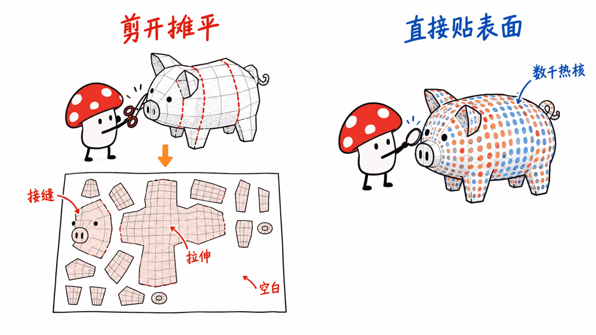
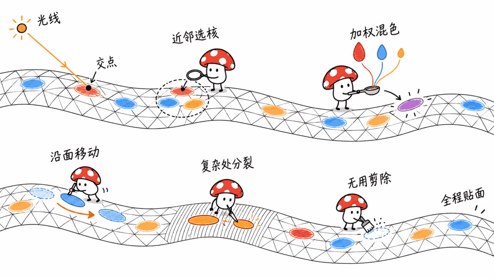
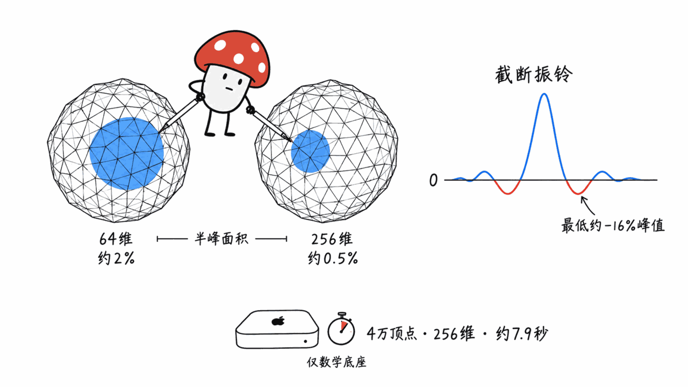

**BLUF**：ECCV 2026（9 月 8–12 日，瑞典马尔默）的最佳论文是帝国理工学院的《Heat Kernel Textures: the Geodesic Gaussians That Do Not Splat》（HKTex）。它借了 3D 高斯泼溅「用一堆高斯表示外观」的思路，但把高斯换成**贴在网格表面、沿测地线扩散的各向异性热核**，从而彻底不需要 UV 展开：在 313 个 Objaverse 模型的纹理拟合里，约 4.8k 个热核平均只占 **96.6KB**，LPIPS 0.013，比 InstantNGP、Intrinsic Neural Fields、ImageGS 都好。代码是 MIT 协议，但**只支持 Linux + NVIDIA CUDA 12.9**，渲染一帧要 0.8–1.2 秒，只做了 albedo，离进游戏引擎还远。两篇荣誉提名是 Meta 的 LSRM 和石溪大学的 Poppy。时间检验奖（Koenderink Prize）颁给三篇 ECCV 2016 论文，其中「李飞飞获奖」那篇是 Justin Johnson 一作的**感知损失**，你每天用的 LPIPS 指标和 Stable Diffusion 的 VAE 训练都是它的后代。

> 📌 一手资料
> 官方奖项页：https://eccv.ecva.net/virtual/2026/awards_detail
> HKTex 论文：https://arxiv.org/abs/2609.07557
> HKTex 代码：https://github.com/circle-group/hktex
> 线索来源：小红书 @机器之心 现场报道（含颁奖幻灯片照片）

---

## 这届 ECCV 有多大？

以下数字来自开幕式幻灯片（@机器之心 现场拍摄）：

- **有效投稿 10,473 篇**，作者超过 37,000 人
- **接收 2,834 篇，接收率 27.1%**，涉及 13,000 多位作者
- **163 篇 oral（1.6%）**：28 篇长 oral，135 篇短 oral
- 185 篇因违反政策被直接拒稿，3,243 篇在不同阶段被作者撤稿

同一场开幕式上的「作者国家分布」饼图显示亚洲作者占比约三分之二。照片分辨率有限，精确比例以官方公布为准。

最佳论文奖从 **10 篇候选**里选出。按我们自己的归类，这 10 篇里有 9 篇和 3D 几何、配准、位姿或物理测量（偏振、波前）直接相关，只有一篇讲视频 VAE。三篇获奖论文全部落在「3D + 物理」这一侧。

## 最佳论文 HKTex 解决的是什么问题？

几乎所有 3D 模型的颜色都存在一张 **UV 贴图**里：先把三维表面「剪开摊平」成二维图，再在图上存像素。这个办法用了几十年，毛病也几十年没变：

- **接缝**：剪开的地方颜色容易断，接缝处还要复制顶点
- **变形和分辨率不均**：摊平必然拉伸，有的区域像素密、有的稀
- **浪费空间**：UV 图上有大片空白，照样占显存和存储
- **人工成本**：好的 UV 展开至今是 3D 美术的专门手艺，AI 生成的 3D 模型也常常卡在「UV 乱、烘焙糊」这一步

HKTex 的做法是**干脆不要 UV**。颜色直接存在网格表面上几千个「彩色斑点」里，每个斑点是一个热核。

## 为什么叫「不泼溅的测地高斯」？

先说热核。在一块平板上的某一点滴一滴热，经过时间 t，热量的分布正好是一个高斯。换到弯曲的表面上，热只能沿着表面走，于是分布会自动顺着表面弯曲、按测地距离衰减，这就是「测地高斯」。数学上它由表面的 Laplace–Beltrami 算子（LBO）的特征分解给出：

h_t(p, p*) = Σ_k exp(−t·λ_k) · φ_k(p) · φ_k(p*)

HKTex 在这上面做了几件关键的事（出自论文正文）：

1. **各向异性**：给 LBO 加一个剪切矩阵，方向 θ ∈ [0, π]，各向异性强度 η ∈ [1, 200]，让热沿某个方向扩散得更快，斑点就从圆变成椭圆，能表达条纹和边缘
2. **不为每个斑点单独算特征分解**：每个网格预先算 **7 个角度 × 7 个各向异性 = 49 组** 256 维 ALBO 特征分解，外加一组 64 维的各向同性 LBO；任意 (θ, η) 用双线性插值得到，插值前用匈牙利算法 + Procrustes 对齐特征向量的顺序和符号
3. **压振铃**：截断的谱展开会有 Gibbs 振铃（负值波纹），论文乘了一个按双调和距离衰减的权重来压
4. **锐边**：每个热核再过一道带阈值 τ 和锐度 ς 的 sigmoid 过滤，得到不透明度 α

每个热核的参数是：表面位置（三角形编号 + 重心坐标）、θ、η、τ、ς、RGB 颜色。

「不泼溅」指的是渲染方式。3DGS 把高斯投影到屏幕上一层层叠（splat）；HKTex 走的是光线追踪：**光线先打到网格上，再在交点处查询附近的一小撮热核，按 α 加权平均出颜色**。附近热核的查找用谱嵌入上的 KNN（FAISS GPU 实现）。因为颜色是在表面上算的，它能直接接进基于物理的可微渲染器（论文用的是 Mitsuba 3）。

训练时，热核的位置、方向、形状、尺度、颜色都是可学的，但**位置被严格限制在网格表面**：梯度先投影到切平面，再用指数映射沿测地线移动（Riemannian SGD + 动量）。它也有和 3DGS 一样的自适应密度控制：纹理复杂的地方克隆或沿主轴分裂热核，命中次数少、贡献弱的热核被剪掉。

所以它有两种用法：把现成的 UV 纹理「压」成 HKTex；或者直接从多视角照片做逆渲染，反推出表面纹理，全程不需要先生成 UV。

## 实验数字说明了什么，没说明什么？

**UV 纹理拟合**（313 个 Objaverse 模型，论文表 1，均值 ± 标准差）：

| 方法 | PSNR | LPIPS (×10⁻²) | SSIM (×10⁻²) | 存储 (KB) |
|---|---:|---:|---:|---:|
| **HKTex（约 4.8k 个热核）** | 44.8 ± 5.8 | **1.3 ± 1.6** | **98.9 ± 1.5** | 96.6 ± 12.2 |
| 低分辨率 GT UV | 48.4 ± 15.2 | 2.3 ± 4.2 | 98.2 ± 3.4 | 115.8 ± 103.2 |
| 高分辨率顶点色 | 45.3 ± 5.7 | 1.1 ± 1.7 | 98.8 ± 2.1 | 179.6 ± 89.5 |
| InstantNGP | 41.3 ± 7.4 | 3.2 ± 3.5 | 97.5 ± 3.1 | 473.2 ± 714.9 |
| Intrinsic Neural Fields | 42.5 ± 6.8 | 2.7 ± 3.4 | 98.0 ± 2.7 | 928.2 ± 1,439.8 |
| ImageGS | 44.6 ± 14.6 | 2.9 ± 5.4 | 97.3 ± 5.6 | 115.4 ± 93.9 |

**多视角逆渲染**（162 个模型，论文表 2）：HKTex（约 3.8k 个热核）PSNR 37.61、LPIPS 0.021、平均 **78.73KB**，三项都好于高分辨率顶点色（37.16 / 0.031 / 81.06KB）和改造过的 NVDiffRec（36.40 / 0.034 / 516.12KB）。

我们读表后的三点判断：

- **LPIPS 和 SSIM 是它最硬的地方**，PSNR 并不占优：低分辨率 UV 的 PSNR 均值更高（48.4），只是方差极大。HKTex 的优势是「稳」，存储标准差只有 12KB，别的方法动辄上百
- **存储优势要看跟谁比**：它比低分辨率 UV 只小约 17%，比神经纹理小 5–10 倍。@机器之心 报道说论文附录称它比原始 GT UV 纹理小约一个数量级，这一条我们在正文里没有找到对应数字，未能独立核实
- **渲染慢**：纹理拟合每次渲染 784.7 ± 474.3 毫秒，多视角场景每帧 1.2 秒，是顶点色（0.58 秒）的两倍左右。这是离线光线追踪的耗时，不是游戏引擎里的毫秒级光栅化

## 我们在 Mac 上验证了什么？

HKTex 官方代码要 Linux + NVIDIA（CUDA 12.9、faiss-gpu），本机是 Apple M4 16GB 的 Mac mini，跑不了完整流程。但它的数学底座，也就是 LBO 特征分解和截断谱热核，可以用纯 CPU 复现。我们用 robust_laplacian + SciPy 在两个「凹凸球」网格上测了各向同性版本（论文的各向异性版本还多一个剪切矩阵，稀疏结构相同）：

| 网格顶点数 | 特征向量数 K | 特征分解耗时 | 半峰以上面积（最集中的热核） | 最大负振铃 |
|---:|---:|---:|---:|---:|
| 10,242 | 64 | 0.22 秒 | 约 2.0% 表面 | −15.8% 峰值 |
| 10,242 | 256 | 1.69 秒 | 约 0.5% 表面 | −13.2% 峰值 |
| 40,962 | 64 | 1.31 秒 | 约 2.0% 表面 | −15.8% 峰值 |
| 40,962 | 256 | 7.87 秒 | 约 0.5% 表面 | −13.3% 峰值 |

这组小实验给了论文没写的三件事：

1. **预计算不便宜，但也不吓人**。论文没报预计算时间。按我们的数字推算，一个 4 万顶点的网格要做 49 组 256 维分解，单进程 CPU 大约 6–7 分钟（推算，未计入各向异性和对齐的额外开销）。这是**每个网格一次**的离线成本，网格一改就得重算
2. **截断决定了最小斑点**。t 取得再小，K=64 时最集中的热核也要覆盖约 2% 的表面，K=256 时约 0.5%。这就是为什么论文要用 256 维，并额外加 sigmoid 锐化：光靠谱展开画不出细线
3. **振铃是真问题**。热核截断后会出现最多 −16% 峰值的负值波纹，论文里的双调和距离加权正是冲着它去的

测试脚本和原始输出都在本地，没有下载任何模型。

## 对从业者和本地 AI 开发者意味着什么？

我们的独立判断：**HKTex 近期最现实的位置，是「优化时的纹理表示」，而不是「交付格式」。**

理由有三个落地障碍：

- **生态全是 UV**：glTF、USD、各家游戏引擎、GPU 的纹理采样硬件都假设有 UV。HKTex 每次着色都要查 KNN、算谱基，没法直接用硬件纹理单元
- **只做了 albedo**：论文自己在展望里写了，粗糙度、高光等空间变化的 BSDF 参数留作未来工作。现代 PBR 资产要的是一整套贴图
- **对网格有要求**：评测只用了单连通、流形、不超过 6 万顶点的网格，多组件、非流形、内部结构复杂的模型都被排除了

但它的思路很适合接在「AI 生成 3D」的流水线后面。今天 LSRM、TRELLIS.2 这类前馈重建或生成模型输出网格以后，最麻烦的一步往往是 UV 展开和烘焙。HKTex 证明了可以在表面上直接做可微优化、先拿到干净的外观，最后需要交付时再烘焙成任何格式的贴图，这时 UV 只是导出格式，不再是优化的约束。我们写过的 TRELLIS.2 用的是另一条路（O-Voxel 原生 PBR）：https://blog.mushroom.cv/blog/microsoft-trellis2-native-3d-generation-o-voxel-pbr/

还有一个论文没测、但理论上很诱人的点：LBO 在等距变形下不变，所以热核纹理原则上会自然跟着角色的弯曲变形走。是否真能用于蒙皮动画，需要等后续工作验证。

仓库情况（GitHub API，2026-09-11）：circle-group/hktex，**MIT 协议**，76 star、1 fork，2026-09-09 公开，提交历史可追到 2026 年 5 月（原名 heatsplats）。依赖的测地线库 DiGeo 是同组开源的 BSD-3-Clause。代码提供纹理拟合、多视角、神经纹理和顶点色基线以及消融实验的完整配置，复现门槛主要在 NVIDIA GPU。论文正式版收录在 Springer ECCV 论文集第 306–323 页。

## 两篇荣誉提名讲了什么？

**LSRM（Meta Reality Labs Research）**：前馈式 3D 物体重建和逆渲染。作者判断，前馈方法比逐场景优化差，主要差在 token 预算。LSRM 把 DeepSeek 提出的原生稀疏注意力（NSA）搬到 3D 重建，配合由粗到细的稀疏残差、基于显式几何距离的 2D–3D 路由、多卡 All-gather-KV 序列并行，处理的物体 token 是此前最佳方法的 20 倍、图像 token 超过 2 倍。官方摘要称新视角合成 PSNR 提升超过 2.4dB、LPIPS 降低超过 40%。评审词是「very high quality and great engineering」。注意：**权重是 CC-BY-NC-4.0，HF 上需人工审批**；README 写的是在 H200 上测试、推理需要不到 40GB 显存，还依赖需要申请的 DINOv3 权重。它是研究资产，不是本地工具。

**Poppy（纽约州立大学石溪分校）**：单目法线估计在反光、无纹理、暗部表面上经常失败。Poppy 不重训任何网络，而是在测试时用一张偏振照片当物理监督：主干冻结，优化每像素的输入偏移和法线偏移，通过可微的菲涅尔渲染层把法线换算成偏振预测，再和实拍偏振比对。在 7 个基准、3 类主干（扩散、流、前馈）上，平均角误差在合成数据上降 23–26%，真实数据上降 6–16%。代码在 GitHub 公开（irnkim/poppy），截至发稿仓库没有声明许可证。前提是你得有偏振相机。

两篇恰好代表两种路线：LSRM 是「把 LLM 那套扩上下文的工程搬进 3D」，Poppy 和 HKTex 是「用物理和几何先验换数据和算力」。评审把最高奖给了后者。

## 时间检验奖：李飞飞团队获奖的是哪篇？

Koenderink Prize 每年颁给十年前发表在 ECCV、经受住时间检验的论文。今年由程序委员会主席评选（Richard Hartley 提供技术支持），共三篇，全部来自 ECCV 2016。截至 2026-09-11，官方奖项网页还只列了最佳论文和荣誉提名，**以下三篇的信息来自颁奖现场幻灯片（@机器之心 拍摄）**，论文本身我们逐一核对了 arXiv。

**1. Perceptual Losses for Real-Time Style Transfer and Super-Resolution**（Justin Johnson、Alexandre Alahi、Li Fei-Fei，arXiv 1603.08155）

获奖词：「提出了基于预训练神经网络特征的感知损失，这一做法如今如此普遍，以至于人们几乎忘了它的源头。」

论文的核心很简单：训练一个前馈网络做图像变换，但损失不再逐像素比较，而是比较预训练网络（VGG）提取的高层特征。风格迁移因此从 Gatys 等人的逐图优化变成一次前向，论文摘要称效果相近、速度快三个数量级；超分辨率换上感知损失以后，结果在视觉上明显更好。

需要说明的是，这篇论文的一作是 Justin Johnson（当时是斯坦福博士生，李飞飞是导师、末位作者）。「李飞飞获奖」的标题说法不算错，但会让人忽略一作。有意思的是，Johnson 后来和李飞飞一起创办了做 3D 世界模型的 World Labs。

它为什么经得起十年？因为它的后代到处都是：2018 年的 **LPIPS** 把「深度特征距离」做成了感知相似度指标；潜空间扩散（Stable Diffusion 的前身 LDM）论文写明其自编码器用感知损失加 patch 对抗损失训练。换句话说，你本地跑的 SD 系模型，VAE 的训练目标里就有这篇论文的影子。更巧的是，**今年的最佳论文 HKTex 和提名论文 LSRM 都把 LPIPS 当核心指标**：十年前的损失函数，成了十年后评判最佳论文的尺子。

**2. SSD: Single Shot MultiBox Detector**（Wei Liu、Dragomir Anguelov、Dumitru Erhan、Christian Szegedy、Scott Reed、Cheng-Yang Fu、Alexander C. Berg，arXiv 1512.02325）

获奖词：「与 R-CNN 和 YOLO 系列一道，把目标检测带进了深度学习时代。」单阶段、多尺度特征图上直接回归框和类别。Semantic Scholar 记录它被引 36,029 次（2026-09-11 查询）。

**3. Learning without Forgetting**（Zhizhong Li、Derek Hoiem，arXiv 1606.09282）

获奖词：「开创了持续学习的理念，这至今仍是开放挑战，也是视觉 AI 研究的活跃分支。」它只用新任务数据，通过让新模型在旧任务上的输出保持接近旧模型（知识蒸馏式约束）来避免灾难性遗忘。今天大家给大模型做 LoRA 微调时担心的「学了新的、忘了旧的」，就是同一个问题。

## 其他奖项

据 @机器之心 报道，ECVA 博士论文奖每年两项，每人 2,500 欧元；ECVA 青年研究员奖每年一项，奖金 5,000 欧元，均在下一届 ECCV 上颁发。具体获奖人我们没有拿到一手名单，本文不列。

## 常见问题

**Q：HKTex 能替代 UV 贴图吗？**
A：短期不能。它在质量和存储上有优势，但只做了 albedo，渲染是离线光线追踪（每帧约 1 秒），且所有主流格式和引擎都依赖 UV。更现实的用法是在逆渲染或 AI 3D 重建里当优化表示，交付时再烘焙。

**Q：HKTex 和 3D 高斯泼溅是什么关系？**
A：思路相似：都用大量可学习的「斑点」表示外观，也都有密度控制。区别是 3DGS 的高斯飘在三维空间里、投影到屏幕上叠加；HKTex 的热核被锁在网格表面上，沿测地线扩散，渲染时在光线与网格的交点处求值，不做 splatting。

**Q：代码能在 Mac 上跑吗？**
A：官方环境要求 Linux + NVIDIA GPU（CUDA 12.9、faiss-gpu）。我们在 Mac 上只复现了它的数学底座（LBO 特征分解和截断热核），4 万顶点网格上 256 维分解约 7.9 秒，但完整训练和渲染流程没有跑。

**Q：「李飞飞获时间检验奖」准确吗？**
A：获奖论文是《Perceptual Losses for Real-Time Style Transfer and Super-Resolution》，作者 Justin Johnson、Alexandre Alahi、李飞飞，李飞飞是末位作者。奖项授予全体作者。

**Q：LSRM 能本地部署吗？**
A：代码和权重都公开，但权重是 CC-BY-NC-4.0（不可商用），HF 需人工审批，官方在 H200 上测试、推理需要不到 40GB 显存，还依赖需申请的 DINOv3 权重。消费级 Mac 基本不现实。

## 一手资料

- ECCV 2026 奖项页：https://eccv.ecva.net/virtual/2026/awards_detail
- HKTex 会议页：https://eccv.ecva.net/virtual/2026/poster/3652
- HKTex 论文（arXiv）：https://arxiv.org/abs/2609.07557
- HKTex 项目页：https://circle-group.github.io/research/HeatKernelTextures/
- HKTex 代码：https://github.com/circle-group/hktex
- DiGeo（测地线优化库）：https://github.com/circle-group/DiGeo
- LSRM 论文：https://arxiv.org/abs/2604.05182
- LSRM 代码：https://github.com/facebookresearch/Large-Sparse-Reconstruction-Model
- LSRM 权重：https://huggingface.co/facebook/Large-Sparse-Reconstruction-Model
- Poppy 论文：https://arxiv.org/abs/2603.27891
- Poppy 项目页：https://irnkim.github.io/poppy/
- 感知损失论文：https://arxiv.org/abs/1603.08155
- SSD 论文：https://arxiv.org/abs/1512.02325
- Learning without Forgetting 论文：https://arxiv.org/abs/1606.09282
- 线索来源：小红书 @机器之心《ECCV最佳论文出炉，李飞飞获时间检验奖！》（含开幕式与颁奖幻灯片照片）

---

> © 2026 Author: Mycelium Protocol. 本文采用 [CC BY 4.0](https://creativecommons.org/licenses/by/4.0/deed.zh) 授权——欢迎转载和引用，须注明作者姓名及原文链接，不得去除署名后以原创发布。

<!--EN-->

**BLUF**: The Best Paper at ECCV 2026 (September 8–12, Malmö, Sweden) goes to Imperial College London's "Heat Kernel Textures: the Geodesic Gaussians That Do Not Splat" (HKTex). It borrows 3D Gaussian Splatting's idea of representing appearance with many small primitives, but swaps the Gaussians for **anisotropic heat kernels that live on the mesh surface and spread along geodesics**, which removes UV unwrapping entirely. Across 313 Objaverse meshes, about 4.8k kernels take **96.6KB** on average with an LPIPS of 0.013, better than InstantNGP, Intrinsic Neural Fields and ImageGS. The code is MIT-licensed but **Linux + NVIDIA CUDA 12.9 only**, a frame takes 0.8–1.2 seconds to render, and only albedo is modeled, so it's a long way from a game engine. The two honourable mentions are Meta's LSRM and Stony Brook's Poppy. The Koenderink test-of-time prize goes to three ECCV 2016 papers. The one billed as "Li Fei-Fei wins" is Justin Johnson's first-author paper on **perceptual losses**, the ancestor of the LPIPS metric you use every day and of the loss used to train Stable Diffusion's VAE.

> 📌 Primary sources
> Official awards page: https://eccv.ecva.net/virtual/2026/awards_detail
> HKTex paper: https://arxiv.org/abs/2609.07557
> HKTex code: https://github.com/circle-group/hktex
> Lead: on-site coverage by @机器之心 (Synced) on XiaoHongShu, including photos of the award slides

---

## How Big Was This ECCV?

These numbers come from the opening-session slides, as photographed on site by @机器之心:

- **10,473 valid submissions** from more than 37,000 authors
- **2,834 accepted, a 27.1% acceptance rate**, with more than 13,000 unique authors
- **163 orals (1.6%)**: 28 long orals and 135 short orals
- 185 desk-rejected for policy violations, and 3,243 withdrawn by authors at various stages

An "authors by country" pie chart from the same session shows roughly two-thirds of authors in Asia. The photo's resolution is limited, so treat the exact split as pending official numbers.

The Best Paper was chosen from **10 award candidates**. By our own classification, 9 of the 10 deal directly with 3D geometry, registration, pose, or physical measurement (polarization, wavefronts), and only one is about video VAEs. All three winners sit on the "3D + physics" side.

## What Problem Does HKTex Solve?

Almost every 3D model stores its color in a **UV map**: you cut the 3D surface open, flatten it into a 2D image, and store pixels on that image. The approach is decades old, and so are its problems:

- **Seams**: color breaks where the surface was cut, and vertices get duplicated along the cut
- **Distortion and uneven resolution**: flattening always stretches, so some regions get dense pixels and others sparse ones
- **Wasted space**: large empty areas in the UV image still cost VRAM and storage
- **Labor**: good UV unwrapping is still a specialist 3D-art skill, and AI-generated 3D models often stall at the "messy UVs, blurry bake" step

HKTex **drops UVs altogether**. Color lives in a few thousand "colored spots" placed directly on the mesh surface, and each spot is a heat kernel.

## Why "Geodesic Gaussians That Do Not Splat"?

Start with the heat kernel. Put a drop of heat on a flat plate, wait time t, and the heat distribution is exactly a Gaussian. On a curved surface, heat can only travel along the surface, so the distribution bends with the surface and falls off with geodesic distance: a "geodesic Gaussian." Mathematically it comes from the eigendecomposition of the surface's Laplace–Beltrami operator (LBO):

h_t(p, p*) = Σ_k exp(−t·λ_k) · φ_k(p) · φ_k(p*)

HKTex adds several key pieces on top (all from the paper):

1. **Anisotropy**: a shear matrix is added to the LBO, with direction θ ∈ [0, π] and anisotropy η ∈ [1, 200], so heat spreads faster in one direction. Spots become ellipses and can express stripes and edges.
2. **No per-kernel eigendecomposition**: for each mesh, the method precomputes **7 angles × 7 anisotropies = 49** ALBO eigendecompositions of 256 dimensions, plus one 64-dimensional isotropic LBO. Any (θ, η) is obtained by bilinear interpolation, after the eigenvectors' order and signs are aligned with the Hungarian algorithm and Procrustes.
3. **Ringing suppression**: truncating the spectral expansion causes Gibbs ringing (negative ripples), which the paper damps with a weight that decays with biharmonic distance.
4. **Sharp edges**: each kernel also passes through a sigmoid filter with a threshold τ and sharpness ς to produce its opacity α.

Each kernel's parameters are: surface position (triangle index + barycentric coordinates), θ, η, τ, ς, and an RGB color.

"Do not splat" refers to rendering. 3DGS projects Gaussians onto the screen and composites them (splatting). HKTex ray traces instead: **a ray first hits the mesh, then the renderer queries a small set of nearby kernels at the hit point and takes an α-weighted average of their colors**. Nearby kernels are found with KNN in a spectral embedding (FAISS on GPU). Because color is computed on the surface, it plugs straight into a physically based differentiable renderer (the paper uses Mitsuba 3).

During training, each kernel's position, orientation, shape, scale and color are all learnable, but **positions are constrained to the mesh surface**: gradients are projected onto the tangent plane, and kernels move along geodesics via the exponential map (Riemannian SGD with momentum). It also has 3DGS-style adaptive density control: kernels are cloned or split along their principal axis where texture is complex, and kernels with few hits or weak contribution are pruned.

That gives two uses: compress an existing UV texture into HKTex, or run inverse rendering directly from multi-view photos to recover surface texture, with no UV generated at any point.

## What Do the Numbers Show, and What Don't They?

**UV texture fitting** (313 Objaverse meshes, paper Table 1, mean ± std):

| Method | PSNR | LPIPS (×10⁻²) | SSIM (×10⁻²) | Storage (KB) |
|---|---:|---:|---:|---:|
| **HKTex (~4.8k kernels)** | 44.8 ± 5.8 | **1.3 ± 1.6** | **98.9 ± 1.5** | 96.6 ± 12.2 |
| Low-res GT UV | 48.4 ± 15.2 | 2.3 ± 4.2 | 98.2 ± 3.4 | 115.8 ± 103.2 |
| High-res vertex colors | 45.3 ± 5.7 | 1.1 ± 1.7 | 98.8 ± 2.1 | 179.6 ± 89.5 |
| InstantNGP | 41.3 ± 7.4 | 3.2 ± 3.5 | 97.5 ± 3.1 | 473.2 ± 714.9 |
| Intrinsic Neural Fields | 42.5 ± 6.8 | 2.7 ± 3.4 | 98.0 ± 2.7 | 928.2 ± 1,439.8 |
| ImageGS | 44.6 ± 14.6 | 2.9 ± 5.4 | 97.3 ± 5.6 | 115.4 ± 93.9 |

**Multi-view inverse rendering** (162 meshes, paper Table 2): HKTex (~3.8k kernels) scores PSNR 37.61, LPIPS 0.021, and **78.73KB** on average, beating high-res vertex colors (37.16 / 0.031 / 81.06KB) and an adapted NVDiffRec (36.40 / 0.034 / 516.12KB) on all three.

Three takeaways from reading the tables:

- **LPIPS and SSIM are its strongest results; PSNR is not.** Low-res UV has a higher mean PSNR (48.4), just with huge variance. HKTex's edge is consistency: its storage standard deviation is 12KB, while other methods swing by hundreds.
- **The storage advantage depends on the baseline.** It's only about 17% smaller than a low-res UV map, and 5–10× smaller than neural textures. @机器之心 reports that the paper's appendix claims roughly an order-of-magnitude reduction versus the original GT UV textures. We couldn't find a matching number in the main text and haven't verified that claim.
- **Rendering is slow.** Texture fitting takes 784.7 ± 474.3 ms per render, and the multi-view setting takes 1.2 seconds per frame, about twice the vertex-color baseline (0.58 s). These are offline ray-tracing times, not millisecond rasterization in a game engine.

## What Did We Verify on a Mac?

The official HKTex code needs Linux + NVIDIA (CUDA 12.9, faiss-gpu). Our machine is a 16GB Apple M4 Mac mini, so the full pipeline won't run. The math underneath, though, meaning the LBO eigendecomposition and the truncated spectral heat kernel, runs fine on CPU. We tested the isotropic version on two "bumpy sphere" meshes with robust_laplacian + SciPy (the paper's anisotropic version adds a shear matrix but has the same sparsity):

| Mesh vertices | Eigenvectors K | Eigendecomposition time | Area above half-peak (most concentrated kernel) | Largest negative ringing |
|---:|---:|---:|---:|---:|
| 10,242 | 64 | 0.22 s | ~2.0% of surface | −15.8% of peak |
| 10,242 | 256 | 1.69 s | ~0.5% of surface | −13.2% of peak |
| 40,962 | 64 | 1.31 s | ~2.0% of surface | −15.8% of peak |
| 40,962 | 256 | 7.87 s | ~0.5% of surface | −13.3% of peak |

This small experiment fills in three things the paper doesn't state:

1. **Precomputation isn't free, but it isn't scary either.** The paper doesn't report precomputation time. Extrapolating from our numbers, 49 eigendecompositions of 256 dimensions on a 40k-vertex mesh would take roughly 6–7 minutes on a single CPU process (an estimate that leaves out the extra cost of anisotropy and alignment). It's a **once-per-mesh** offline cost, and any mesh edit means recomputing it.
2. **Truncation sets the smallest spot.** However small you make t, the most concentrated kernel still covers about 2% of the surface at K=64 and about 0.5% at K=256. That's why the paper uses 256 dimensions and adds sigmoid sharpening: spectral expansion alone can't draw fine lines.
3. **Ringing is real.** A truncated heat kernel shows negative ripples down to −16% of its peak, which is exactly what the paper's biharmonic-distance weighting targets.

The test script and raw output are local, and nothing was downloaded beyond small Python packages.

## What Does This Mean for Practitioners and Local AI Developers?

Our own take: **in the near term, HKTex's most realistic role is as an optimization-time texture representation, not a delivery format.**

Three adoption hurdles:

- **The ecosystem is built on UVs.** glTF, USD, every game engine, and the GPU's texture-sampling hardware all assume UVs. HKTex needs a KNN query and spectral basis evaluation per shading point, so it can't use hardware texture units directly.
- **Albedo only.** The paper's own outlook leaves spatially varying BSDF parameters such as roughness and specular to future work. Modern PBR assets need a full set of maps.
- **Mesh requirements.** The evaluation only uses single-component, manifold meshes with at most 60,000 vertices; meshes with multiple components, non-manifold geometry or complex internal structure were excluded.

The idea does fit well after an "AI-generated 3D" pipeline, though. Once feed-forward reconstruction or generation models like LSRM or TRELLIS.2 output a mesh, the most painful step is often UV unwrapping and baking. HKTex shows you can run differentiable optimization directly on the surface, get clean appearance first, and bake to whatever texture format you need only at delivery time. UVs then become an export format rather than a constraint on optimization. The TRELLIS.2 model we covered takes a different route (native PBR on O-Voxels): https://blog.mushroom.cv/blog/microsoft-trellis2-native-3d-generation-o-voxel-pbr/

One more point the paper doesn't test but that's tempting in theory: the LBO is invariant under isometric deformation, so a heat-kernel texture should in principle follow a character as it bends. Whether that holds up for skinned animation needs follow-up work.

Repository status (GitHub API, 2026-09-11): circle-group/hktex, **MIT license**, 76 stars, 1 fork, made public on 2026-09-09, with commit history going back to May 2026 (under the earlier name heatsplats). Its geodesic library DiGeo is open-sourced by the same group under BSD-3-Clause. The repo ships full configs for texture fitting, multi-view, the neural-texture and vertex-color baselines, and ablations. The main barrier to reproduction is needing an NVIDIA GPU. The camera-ready paper appears in the Springer ECCV proceedings, pages 306–323.

## What Are the Two Honourable Mentions About?

**LSRM (Meta Reality Labs Research)**: feed-forward 3D object reconstruction and inverse rendering. The authors argue that feed-forward methods trail per-scene optimization mainly because of token budget. LSRM brings native sparse attention (NSA, introduced by DeepSeek) to 3D reconstruction, with coarse-to-fine sparse residuals, 2D–3D routing by explicit geometric distance, and multi-GPU All-gather-KV sequence parallelism. It handles 20× more object tokens and more than 2× more image tokens than the prior state of the art. The official abstract reports more than 2.4dB higher PSNR and more than 40% lower LPIPS on novel-view synthesis. The citation reads "very high quality and great engineering." Note that **the weights are CC-BY-NC-4.0 and gated with manual approval on HF**; the README says it was tested on H200s and needs under 40GB of GPU memory for inference, and it also depends on gated DINOv3 weights. It's a research asset, not a local tool.

**Poppy (Stony Brook University)**: monocular normal estimators often fail on reflective, textureless and dark surfaces. Poppy retrains nothing. At test time it uses a single polarization capture as physical supervision: the backbone stays frozen, per-pixel offsets to the input and to the output normals are optimized, and a differentiable Fresnel rendering layer converts normals into predicted polarization for comparison with the real capture. Across 7 benchmarks and 3 backbone families (diffusion, flow, feed-forward), mean angular error drops 23–26% on synthetic data and 6–16% on real data. The code is public on GitHub (irnkim/poppy); as of writing, the repo declares no license. You also need a polarization camera.

The two neatly represent two approaches: LSRM brings LLM-style context-window scaling into 3D, while Poppy and HKTex trade data and compute for physical and geometric priors. The jury gave the top prize to the latter.

## Test of Time: Which Li Fei-Fei Paper Won?

The Koenderink Prize goes each year to an ECCV paper from ten years earlier that has stood the test of time. This year's winners were selected by the Program Chairs (with technical support from Richard Hartley): three papers, all from ECCV 2016. As of 2026-09-11, the official awards web page lists only the Best Paper and honourable mentions, so **the three winners below come from the award-ceremony slides (photographed by @机器之心)**. We checked each paper itself on arXiv.

**1. Perceptual Losses for Real-Time Style Transfer and Super-Resolution** (Justin Johnson, Alexandre Alahi, Li Fei-Fei; arXiv 1603.08155)

Citation: "For introducing perceptual loss functions based on pretrained neural features – a practice now so common that its origins are barely remembered."

The core idea is simple: train a feed-forward network for image transformation, but compare high-level features from a pretrained network (VGG) instead of individual pixels. Style transfer goes from Gatys et al.'s per-image optimization to a single forward pass, with similar quality and, per the abstract, three orders of magnitude faster. For super-resolution, switching to a perceptual loss gives visibly better results.

Worth noting: the first author is Justin Johnson (then a Stanford PhD student; Li Fei-Fei was his advisor and the last author). The "Li Fei-Fei wins" headline isn't wrong, but it overlooks the first author. Johnson later co-founded World Labs, the 3D world-model company, with Li Fei-Fei.

Why has it held up for ten years? Because its descendants are everywhere. In 2018, **LPIPS** turned deep-feature distance into a perceptual similarity metric. The latent diffusion paper (LDM, the precursor of Stable Diffusion) states that its autoencoder was trained with a perceptual loss plus a patch-based adversarial loss. In other words, the training objective of the VAE in the SD-family models you run locally carries this paper's fingerprint. Even better, **this year's Best Paper (HKTex) and honourable mention LSRM both use LPIPS as a headline metric**: a loss function from ten years ago became the yardstick for judging this year's best work.

**2. SSD: Single Shot MultiBox Detector** (Wei Liu, Dragomir Anguelov, Dumitru Erhan, Christian Szegedy, Scott Reed, Cheng-Yang Fu, Alexander C. Berg; arXiv 1512.02325)

Citation: "For bringing object detection to the deep learning age, together with the R-CNN and YOLO model families." It's a single-stage detector that regresses boxes and classes directly from multi-scale feature maps. Semantic Scholar lists 36,029 citations (queried 2026-09-11).

**3. Learning without Forgetting** (Zhizhong Li, Derek Hoiem; arXiv 1606.09282)

Citation: "For pioneering the idea of continual learning – still an open challenge and an active branch of visual AI research." Using only new-task data, it avoids catastrophic forgetting by keeping the new model's outputs on old tasks close to the old model's (a distillation-style constraint). The worry that a LoRA fine-tune of a large model "learns the new and forgets the old" is the same problem.

## Other Awards

According to @机器之心, the ECVA PhD Award goes to two people each year at €2,500 each, and the ECVA Young Researcher Award goes to one person each year with €5,000, both presented at the following ECCV. We don't have a primary-source list of this year's recipients, so we don't name them here.

## FAQ

**Q: Can HKTex replace UV maps?**
A: Not in the near term. It wins on quality and storage, but it only models albedo, renders via offline ray tracing (about a second per frame), and every mainstream format and engine depends on UVs. The realistic use is as an optimization representation in inverse rendering or AI 3D reconstruction, baked out at delivery.

**Q: How does HKTex relate to 3D Gaussian Splatting?**
A: The idea is similar: many learnable "spots" represent appearance, with density control. The difference is that 3DGS Gaussians float in 3D space and are projected and composited on screen, while HKTex kernels are locked to the mesh surface, spread along geodesics, and are evaluated where rays hit the mesh, with no splatting.

**Q: Does the code run on a Mac?**
A: The official environment requires Linux + an NVIDIA GPU (CUDA 12.9, faiss-gpu). On a Mac we only reproduced the math underneath (LBO eigendecomposition and truncated heat kernels): a 256-dimensional decomposition on a 40k-vertex mesh took about 7.9 seconds. We did not run the full training and rendering pipeline.

**Q: Is "Li Fei-Fei wins the test-of-time award" accurate?**
A: The winning paper is "Perceptual Losses for Real-Time Style Transfer and Super-Resolution" by Justin Johnson, Alexandre Alahi and Li Fei-Fei, with Li Fei-Fei as the last author. The prize goes to all authors.

**Q: Can I deploy LSRM locally?**
A: The code and weights are public, but the weights are CC-BY-NC-4.0 (no commercial use) and gated with manual approval on HF. It was tested on H200s, needs under 40GB of GPU memory for inference, and depends on gated DINOv3 weights. On a consumer Mac it's essentially out of reach.

## Primary Sources

- ECCV 2026 awards page: https://eccv.ecva.net/virtual/2026/awards_detail
- HKTex conference page: https://eccv.ecva.net/virtual/2026/poster/3652
- HKTex paper (arXiv): https://arxiv.org/abs/2609.07557
- HKTex project page: https://circle-group.github.io/research/HeatKernelTextures/
- HKTex code: https://github.com/circle-group/hktex
- DiGeo (geodesic optimization library): https://github.com/circle-group/DiGeo
- LSRM paper: https://arxiv.org/abs/2604.05182
- LSRM code: https://github.com/facebookresearch/Large-Sparse-Reconstruction-Model
- LSRM weights: https://huggingface.co/facebook/Large-Sparse-Reconstruction-Model
- Poppy paper: https://arxiv.org/abs/2603.27891
- Poppy project page: https://irnkim.github.io/poppy/
- Perceptual Losses paper: https://arxiv.org/abs/1603.08155
- SSD paper: https://arxiv.org/abs/1512.02325
- Learning without Forgetting paper: https://arxiv.org/abs/1606.09282
- Lead: @机器之心 on XiaoHongShu, "ECCV最佳论文出炉，李飞飞获时间检验奖！" (with photos of the opening and award slides)

---

> © 2026 Author: Mycelium Protocol. Licensed under [CC BY 4.0](https://creativecommons.org/licenses/by/4.0/) — free to share and adapt with attribution. You must credit the author and link to the original; removing attribution and republishing as original is not permitted.
