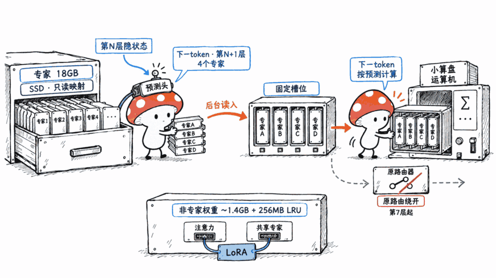
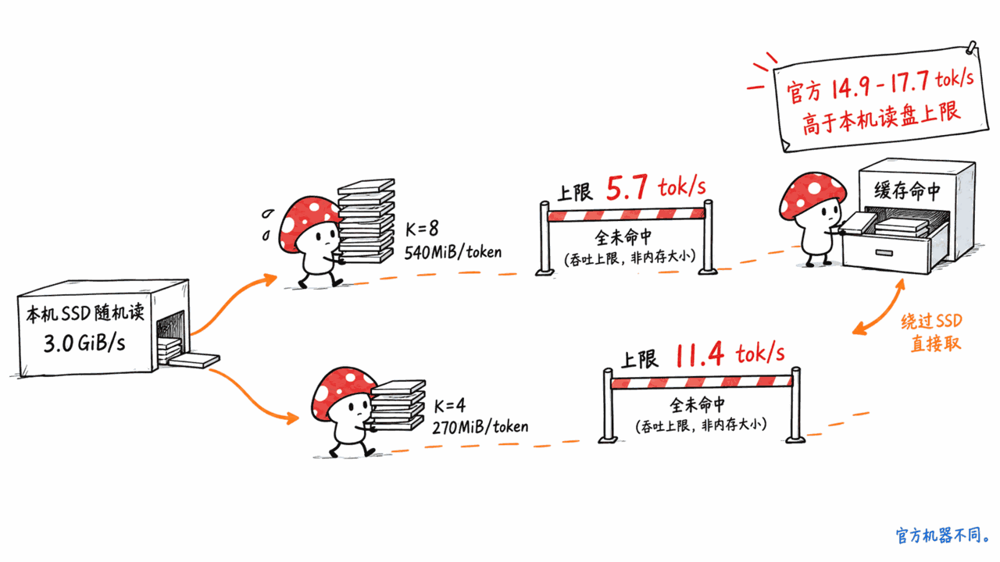
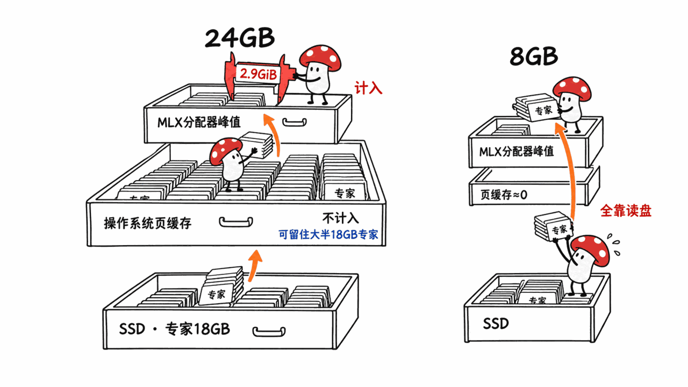

**BLUF**：Edge0-35B-A3B-preview 不是新训练的模型，而是 **Qwen3.5-35B-A3B 的 4-bit MLX 量化版，加两个外挂适配器，配一个新的推理框架 edge0**。18GB 的专家权重留在 SSD 上，每个 token 只把用到的专家读进内存，所以官方写「峰值内存 2.9GiB、M4 Pro 24GB 上 14.9–17.7 tok/s、质量只比 fp16 低 3.9 分」。拆开代码后有三件事模型卡没写清楚：一、**每个 token 激活的专家从原版的 8 个砍到 4 个**，读盘量减半；二、decode 时第 7 层以后的专家选择**直接用上一个 token 的预测结果，原路由器不再参与**，所以才需要 LoRA 把质量补回来；三、「3GB」是 MLX 分配器的峰值，**不含操作系统页缓存**，而官方测速机器有 24GB 内存，18GB 的专家大部分能留在缓存里。我们在 16GB 的 M4 Mac mini 上测了 SSD 随机读：专家全部未命中时，K=4 的读盘上限约 **11.4 tok/s**，K=8 只有 5.7 tok/s。结论是：**16GB 的 Mac 值得试**，因为原版 4-bit（约 20GB）根本装不下；**32GB 以上直接跑原版 MLX 4-bit** 更合适；8GB 不建议。许可证方面，模型卡和 GitHub 都写的是 Apache-2.0，和基座一致，但适配器的训练代码和训练数据都没有公开。

> 📌 一手资料
> 模型：https://huggingface.co/Edge0/Edge0-35B-A3B-preview
> 推理框架：https://github.com/Edge0-AI/Edge0
> 基座：https://huggingface.co/Qwen/Qwen3.5-35B-A3B
> 协议：Apache-2.0 ｜ HF 创建：2026-09-08 ｜ 下载 1,596、320 likes ｜ GitHub 1,400 stars、113 forks（2026-09-12 抓取）

---

## 为什么要看这个模型？

35B 总参、每 token 约 3B 激活的 MoE，是今年本地大模型最常见的规格。本站前几天写的《Nex-N2.5-mini》用的就是同一个基座，当时我们按量化体积推算的结论是：**4-bit 要 32GB 起步，16GB 基本别想**（https://blog.mushroom.cv/blog/nex-n2-5-mini-agentic-moe-mac-local-memory-guide/）。

Edge0 直接挑战这个结论：它说同一个 35B 模型，3GB 内存就能跑，而且速度可以交互。如果成立，16GB 甚至 8GB 的 Mac 都能用上 35B 级别的模型。所以这篇文章只回答一个问题：**这个「3GB」是怎么来的，放到你的 Mac 上还剩多少。**

说明：权重文件约 19.5GB，按任务规范我们没有下载完整权重，**没有在本机跑这个模型**。文中的实测只有一项：本机 SSD 按专家大小随机读的吞吐。其他数字来自 HF API、模型卡、config.json、safetensors 文件头、GitHub 源码和 issue，推算的地方都会写明。

## Edge0-35B-A3B 到底是什么？

从 HF API 和 config.json 能核实的事实：

- **基座**：Qwen3.5-35B-A3B。config 的 `model_type` 是 `qwen3_5_moe`，40 层、256 个路由专家加 1 个共享专家、hidden 2048，结构和 Qwen 官方完全一致。模型卡把基座写成 `Qwen/Qwen3.5-MoE-35B-A3B`，这个 ID 在 HF 上不存在（API 返回 401），正确的是 `Qwen/Qwen3.5-35B-A3B`，所以 HF 页面上看不到它和基座的谱系链接
- **权重**：4 个分片合计 **19.51GB**（18.17GiB），4-bit affine、group 64，路由门控和共享专家门控是 8-bit。GitHub README 写「~23GB」，比实际大
- **去掉了什么**：提交记录里有一条「strip vision tower」。和 mlx-community 的 4-bit 版（20.39GB，含视觉塔）对比张量清单，Edge0 **少了全部视觉塔权重，其余 1,756 个张量名一一对应**。config 里还留着 `vision_config` 和图像预处理文件，但实际只能做纯文本。MTP 层也没有权重
- **两个适配器**：`lora_edge0_35b.safetensors`（42MB，r=16，alpha=32）和 `prerouter_edge0_35b.safetensors`（138MB，33 个预测头）。文件头元数据显示它们来自内部的「v7 round9」训练轮次
- **团队**：GitHub 组织 Edge0-AI 创建于 2026-07-29，简介「Intelligence on device」，地址写美国。HF 上同一个组织还发布了 Audio8 TTS 和 ARK-ASR，本站写过 Audio8 TTS Preview 0.6B（https://blog.mushroom.cv/blog/audio8-tts-preview-0.6b-multilingual-zero-shot-voice-cloning-dualAR/）
- **同批还有一个 8B 版**：Edge0-8B-A1B-preview，基座是蚂蚁的 Ling-3.0-tiny，4.6GB

所以它不是空壳，也不是纯搬运：权重是真的，框架代码是真的，适配器是他们自己训的。但它的「新」主要在推理方式上，不在模型本身。

## 「3GB 跑 35B」是怎么做到的？

模型卡说靠三个机制，我们对照源码逐一核实。

**1. SSD 专家卸载**。框架用只读 mmap（`mmap.ACCESS_READ`）打开 safetensors 分片，按张量的字节偏移读出需要的专家。从文件头算，**每个专家（gate/up/down 三个矩阵加 scales 和 biases）正好 1.6875MiB，每层 256 个专家约 453MB，40 层合计约 18.1GB**，占整个检查点的 93%。剩下约 1.4GB 的注意力、嵌入等权重常驻内存。框架内部还有一个跨层共享的 LRU 缓存，维护者在 issue #17 里说默认上限是 256MB。

**2. Prerouter（预测路由）**。MoE 的难点在于：第 N+1 层要用哪些专家，要等第 N 层算完才知道，每一层都得停下来等读盘。Edge0 给第 6 到 38 层各训了一个小网络（33 个头，输入是 2048 维隐状态加当前和上一个 token 的专家 one-hot，共 2560 维），**提前一个 token 预测下一层要用哪 4 个专家**，让读盘和计算重叠。官方说这能让 decode 吞吐最多提升 59%。

关键在于它怎么用这个预测。我们读了 `prerouter/install.py`：decode 阶段，第 7 层以后的 MoE 块**直接用预测出来的专家和权重做计算，原来的路由器不再调用**。注释原话是「100% replacement, no matching/drops」。也就是说，prerouter 不是「预取提示，猜错了再补」，而是**它说用哪几个专家就用哪几个**。好处是读进来的专家一定用得上；代价是模型的实际计算和原版 Qwen 不一样了。

**3. Recover-LoRA**。在冻结的 int4 底座上训 LoRA，用 fp16 原模型当老师做蒸馏，把量化损失补回来。LoRA 文件头显示它挂在注意力层、线性注意力层和共享专家上，**256 个路由专家本身没有 LoRA**。LoRA 不合并进底座，理论上一个只读底座可以挂多套适配器。

## 模型卡没写的一件事：专家从 8 个砍到了 4 个

Qwen3.5-35B-A3B 原版每个 token 在每层激活 **8 个**路由专家，Edge0 自己的 config.json 里 `num_experts_per_tok` 也还是 8。但框架的 `LayerOptions.staged_k4()` 预设把 `top_k` 覆盖成 **4**，注释写明「prefill 和 decode 都生效」。模型卡的表格写了「256 / 4 (K=4)」，但没有说明这是从 8 改过来的。

这一刀对读盘的影响很直接（按文件头推算）：

| 每 token 每层专家数 | 每 token 读盘量（全部未命中） | 15 tok/s 需要的带宽 |
|---|---:|---:|
| K=8（Qwen 原版） | 320 × 1.6875MiB ≈ 540MiB | ≈ 7.9GiB/s |
| K=4（Edge0） | 160 × 1.6875MiB ≈ 270MiB | ≈ 4.0GiB/s |

我们在本机（Mac mini M4，16GB，内置 SSD）用 4GiB 测试文件、关闭页缓存（`F_NOCACHE`），按 1.6875MiB 一块随机读：

| 线程数 | 吞吐 | 每秒读专家数 | K=4 全部未命中的上限 | K=8 全部未命中的上限 |
|---:|---:|---:|---:|---:|
| 1 | 1.89GiB/s | 1,147 | 7.2 tok/s | 3.6 tok/s |
| 4 | 3.02GiB/s | 1,835 | 11.5 tok/s | 5.7 tok/s |
| 8 | 3.02GiB/s | 1,830 | 11.4 tok/s | 5.7 tok/s |

这只是 I/O 上限，还没算计算时间。两点结论：

- **不砍到 K=4，这条路在我们这台机器上根本到不了交互速度**。K=4 是 Edge0 能跑起来的前提，而不是一个可以忽略的参数
- **官方的 14.9–17.7 tok/s 超过了我们测到的纯读盘上限**，说明它依赖缓存命中：相邻 token 的专家有重复（LRU 命中），加上操作系统页缓存。M4 Pro 的 SSD 可能比我们的 M4 快，这一点我们没法核实

所以 3.9 分的质量损失，不只是 4-bit 量化带来的，而是「4-bit + 专家减半 + 路由换成预测」三件事叠加之后，再用 LoRA 补回来的结果。

## 「峰值内存 2.9GiB」算的是什么？

看 `examples/bench.py`：测速流程是 3.3k token 的提示词预填充、10 步预热、200 个 token 计时，跑两轮；内存数字来自 `core.get_peak_memory()`，即 **MLX 分配器的峰值**。README 的脚注也写了：专家权重「通过 mmap 从 SSD 流入，不算常驻」。

这个口径本身没错，页缓存是操作系统可以随时回收的内存，不是程序独占的。但它意味着两件事：

1. **官方测速机器是 24GB 的 M4 Pro Mac mini**。18GB 的专家权重在这台机器上大部分能留在页缓存里，README 自己也把「warm」定义为「page cache resident」。所以 15 tok/s 更接近「从内存读」的速度，不是「从 SSD 读」的速度
2. **内存越少，页缓存越小，越接近我们上面测的全部未命中的情况**。「3GB 能跑」是真的，「3GB 能跑到 15 tok/s」没有人测过

社区 issue 已经给出了几个数据点：

- **#17**：M1 MacBook Pro 8GB 跑更小的 **8B 版**，只有 **0.66–0.81 tok/s**，同一台机器用 mlx-lm 跑 Qwen3-4B 是 11.38 tok/s。维护者回复说在内存紧张的机器上 decode 是「page-fault bound」，建议设 `EDGE0_PREWARM=1` 预热、`MLX_CACHE_LIMIT_MB=1024` 把 LRU 调大
- **#16**：MacBook Air M4 16GB，模型放在外接 USB SSD 上，35B 约 **5 tok/s**

KV cache 倒不用太担心。Qwen3.5 的 40 层里只有 10 层是全注意力（每层 2 个 KV 头、head_dim 256），其余 30 层是固定大小状态的线性注意力。按 fp16 推算，**每个 token 的 KV 约 20KB，3.2 万 token 约 640MiB**。

## 质量掉了多少？

官方用 OpenCompass 自测，同设置对比 Edge0（int4 + 适配器）和 fp16 原模型：

| 基准 | Edge0-35B（int4） | 官方表中的 fp16 基座 | Qwen 模型卡官方分数 |
|---|---:|---:|---:|
| AIME 2026 | 86.6 | 92.7 | 未列出 |
| HumanEval | 90.9 | 95.1 | 未列出 |
| GPQA-Diamond | 79.8 | 81.8 | 84.2 |
| MMLU-Pro | 81.0 | 84.6 | 85.3 |
| IFBench | 57.9 | 61.7 | 70.2 |
| 平均 | 79.2 | 83.2 | — |

需要打折的地方：

- **他们测出来的 fp16 基座分数，比 Qwen 自己公布的低**，IFBench 差了 8.5 分（61.7 对 70.2）。可能是思考模式、采样参数、评测配置不同，但 Edge0 没有公开 OpenCompass 配置，没法复现。如果和 Qwen 官方数字比，IFBench 的差距是 12.3 分，不是 3.8 分
- AIME 只有 30 道题，一道题约 3.3 分，6.1 分的差距约等于两道题
- 模型卡自己写了：preview 版**工具调用、多步规划、长程 Agent 能力「目前较弱」**。想拿它接 Claude Code 或 OpenCode 这类 Agent 工具，现在不合适
- 9 月 11 日修过一个严重问题：35B 在某次生成里出现 fp16 溢出，整个网络变成 NaN，之后同一进程的所有请求都只输出「!!!!」（issue #11、#16）。修法是给每层隐状态加一个 1000 的截断（`QWEN_HIDDEN_CLIP`）。能用，但说明这条推理路径的数值还不太稳

## 许可证：能不能放心用？

- 模型卡 YAML 写的是 `license: apache-2.0`，HF 标签里也有 `license:apache-2.0`，GitHub 仓库是 Apache-2.0。**有声明，不是「未声明」**
- 基座 Qwen3.5-35B-A3B 同样是 Apache-2.0，所以基座这一层对衍生版没有额外限制，可以商用
- 两个小瑕疵：HF 模型仓库里**没有 LICENSE 文件**，只在模型卡里链接到 GitHub；也没有附上 Qwen 的原始许可文本。Apache-2.0 要求再分发时保留许可和声明，严格说这是他们该补的，不影响你使用
- 真正的风险不在许可证，而在**可复现性**：Recover-LoRA 和 prerouter 的**训练代码、训练数据都没有公开**，仓库里只有推理代码。适配器是黑盒，出了问题只能等官方更新
- 依赖也有坑：框架把 `mlx` 锁在 0.30.6、`mlx-lm` 锁在 0.31.0，issue #17 提到 mlx-lm 0.31.0 在 PyPI 上已被撤回（yanked）。更早锁的 0.30.4 在 A18 Pro 上会算错数，输出乱码（issue #8）。建议装在独立虚拟环境里，别和你现有的 mlx-lm 混用

## 会不会磨坏 Mac 的 SSD？

基本不会。SSD 的寿命消耗来自**写入**（擦写次数），读取几乎不耗寿命。Edge0 用只读 mmap 打开权重，推理时不写盘。真正的写入只有两处：一次性下载约 19.5GB；以及内存不够时，**macOS 把其他应用换出到 swap**，这才是写盘大户。所以在小内存机器上跑它时，少开别的应用，更多是为了速度和避免 swap，不是为了保护 SSD。

速度上要注意的是：**别把模型放外接 USB 硬盘**（issue #16 就是这样才只有约 5 tok/s）；内置 SSD 的随机读吞吐决定了缓存未命中时的速度上限。

## 和直接跑 Qwen3.5-35B-A3B 的 MLX 4-bit 有什么区别？

| | Edge0-35B-A3B-preview | mlx-community/Qwen3.5-35B-A3B-4bit |
|---|---|---|
| 文件体积 | 19.51GB（纯文本） | 20.39GB（含视觉塔） |
| 加载方式 | 专家留在 SSD，按需读 | 全部读进统一内存 |
| 每层激活专家 | 4 | 8（原版） |
| 路由 | 第 7 层后用预测结果 | 原路由器 |
| 视觉输入 / MTP | 无 | 视觉有 |
| 额外修正 | LoRA 蒸馏补质量 | 无 |
| 运行时 | edge0 框架（锁版本） | mlx-lm / LM Studio 等通用工具 |
| 16GB Mac | 能跑 | 装不下 |

一句话：**MLX 4-bit 是原模型的压缩版，Edge0 是一个改过计算方式、再用适配器补回来的近似版**。内存够的时候，前者更接近原版，也没有 SSD 读盘的不确定性。

同类思路也不是 Edge0 首创：苹果 2023 年的「LLM in a flash」论文就是从闪存按需读权重并预测稀疏性；本站写过的 FreeToken 走的是 GPU 显存 + 内存的专家缓存路线（https://blog.mushroom.cv/blog/freetoken-flashml-edge-moe-290b-gaming-pc-deepseek-local-inference/）。Edge0 的区别在于把 K 砍半、让预测直接接管路由，并且把整套东西做成了一个在 Mac 上开箱能跑的包。

## Mac 用户该怎么选？

按内存档位给建议（速度数字除官方和 issue 外均为推算，我们没有实测这个模型）：

- **8GB**：不建议。非专家权重加缓存就要 3GB 左右，系统剩不下多少页缓存，几乎每个专家都要从 SSD 读。issue #17 里连 8B 版都只有 0.7–0.8 tok/s
- **16GB**：**这是 Edge0 真正有意义的档位**。原版 4-bit 约 20GB 装不下，量化到 Q2/Q3 又掉质量太多，Edge0 是目前少数能在 16GB 上跑 35B 级 4-bit 的办法。预期速度会低于官方的 15 tok/s：我们这台机器全部未命中的读盘上限是 11.4 tok/s，实际有一部分页缓存命中，但还要算计算时间。模型放内置 SSD，先设 `EDGE0_PREWARM=1`
- **24GB**：官方测速就是这个配置，14.9–17.7 tok/s。原版 MLX 4-bit 在 24GB 上超过 macOS 默认给 GPU 的内存上限（常见经验值是物理内存的 65%–75%），要用 `sudo sysctl iogpu.wired_limit_mb` 调高，而且很紧。两者都能试
- **32GB 及以上**：**直接跑原版 MLX 4-bit**。8 个专家、原路由器、带视觉，没有读盘抖动，工具链也更成熟。Edge0 在这里只剩一个优势：给其他应用留出更多内存

还有一类人值得关注它：想在 iPhone 上跑的人。维护者在 issue #5 里说 iPhone App「几天内」发布；他们还说做过 1-bit 版本，但质量掉得太多，没发布。

## 常见问题

**Q：Edge0-35B-A3B 是新训练的模型吗？**
A：不是。它是 Qwen3.5-35B-A3B 的 4-bit MLX 量化版（去掉了视觉塔），加上一个 42MB 的 LoRA 和一个 138MB 的 prerouter 适配器，由 edge0 框架按需从 SSD 读专家运行。

**Q：3GB 内存真的能跑 35B 吗？**
A：能启动、能生成，但速度取决于你剩下多少内存给页缓存和 SSD 有多快。官方 15 tok/s 是在 24GB 机器上测的；社区有人在 8GB M1 上跑 8B 版只有 0.7–0.8 tok/s。

**Q：prerouter 是提前预测要激活的专家吗？**
A：是。它根据当前层的隐状态和前后两个 token 的专家选择，预测下一层在下一个 token 要用的 4 个专家，提前从 SSD 读进来。而且 decode 时它直接替代原路由器，不只是预取提示。

**Q：它的许可证是什么？能商用吗？**
A：模型卡和 GitHub 都声明 Apache-2.0，基座 Qwen3.5-35B-A3B 也是 Apache-2.0，可以商用。但适配器的训练代码和数据没公开，HF 仓库里也没有 LICENSE 文件。

**Q：preview 意味着什么？**
A：官方说覆盖面和质量还在扩展，Agent 能力较弱，完整版会加强。实际上它发布后三天内修了 NaN 导致「!!!!」输出、A18 芯片乱码、聊天模板丢失等问题，接口和适配器版本都可能还会变。

**Q：长时间跑会伤 SSD 吗？**
A：几乎不会。推理只读不写，SSD 寿命主要消耗在写入上。要注意的是内存不够导致的 swap 写入。

## 一手资料

- 模型页：https://huggingface.co/Edge0/Edge0-35B-A3B-preview
- HF API（文件大小、下载量、标签）：https://huggingface.co/api/models/Edge0/Edge0-35B-A3B-preview?blobs=true
- 推理框架源码：https://github.com/Edge0-AI/Edge0
- 35B 模型文档：https://github.com/Edge0-AI/Edge0/blob/main/docs/models/edge0-35b.md
- prerouter 文档：https://github.com/Edge0-AI/Edge0/blob/main/docs/prerouter.md
- SSD 流式加载文档：https://github.com/Edge0-AI/Edge0/blob/main/docs/streaming.md
- issue #17（8GB M1 速度）：https://github.com/Edge0-AI/Edge0/issues/17
- issue #16（「!!!!」崩溃）：https://github.com/Edge0-AI/Edge0/issues/16
- issue #8（A18 Pro 乱码）：https://github.com/Edge0-AI/Edge0/issues/8
- 8B 版：https://huggingface.co/Edge0/Edge0-8B-A1B-preview
- 基座模型：https://huggingface.co/Qwen/Qwen3.5-35B-A3B
- 对照的 MLX 4-bit 版：https://huggingface.co/mlx-community/Qwen3.5-35B-A3B-4bit
- LLM in a flash 论文：https://arxiv.org/abs/2312.11514

---

> © 2026 Author: Mycelium Protocol. 本文采用 [CC BY 4.0](https://creativecommons.org/licenses/by/4.0/deed.zh) 授权——欢迎转载和引用，须注明作者姓名及原文链接，不得去除署名后以原创发布。

<!--EN-->

**BLUF**: Edge0-35B-A3B-preview is not a newly trained model. It is **a 4-bit MLX quantization of Qwen3.5-35B-A3B, plus two add-on adapters, run by a new inference framework called edge0**. The 18GB of expert weights stay on the SSD, and each token reads in only the experts it uses. That's how the card arrives at "2.9GiB peak memory, 14.9–17.7 tok/s on a 24GB M4 Pro, only 3.9 points below fp16." Reading the code turns up three things the card doesn't spell out. First, **active experts per token are cut from Qwen's 8 to 4**, which halves disk reads. Second, at decode time, layers 7 and up **use the previous token's predictions directly, and the original router is no longer consulted**, which is why a LoRA is needed to recover quality. Third, the "3GB" is the MLX allocator's peak and **excludes the OS page cache**, and the official benchmark machine has 24GB of RAM, enough to keep most of the 18GB of experts cached. We measured random SSD reads on a 16GB M4 Mac mini: with every expert missing the cache, the read ceiling is about **11.4 tok/s at K=4** and only 5.7 tok/s at K=8. Our take: **worth trying on a 16GB Mac**, where the stock 4-bit build (about 20GB) doesn't fit at all; **on 32GB or more, just run the stock MLX 4-bit**; don't bother on 8GB. On licensing, the card and GitHub both say Apache-2.0, matching the base model, but the adapter training code and training data are not public.

> 📌 Primary sources
> Model: https://huggingface.co/Edge0/Edge0-35B-A3B-preview
> Inference framework: https://github.com/Edge0-AI/Edge0
> Base model: https://huggingface.co/Qwen/Qwen3.5-35B-A3B
> License: Apache-2.0 | HF created: 2026-09-08 | 1,596 downloads, 320 likes | GitHub 1,400 stars, 113 forks (fetched 2026-09-12)

---

## Why Look at This Model?

A MoE with 35B total parameters and about 3B active per token is the most common local-model shape this year. Our recent piece on Nex-N2.5-mini uses the same base, and our estimate from quant sizes then was: **4-bit needs 32GB to start, and 16GB is basically out** (https://blog.mushroom.cv/blog/nex-n2-5-mini-agentic-moe-mac-local-memory-guide/).

Edge0 challenges that directly. It says the same 35B model runs in 3GB of memory at interactive speed. If true, 16GB and even 8GB Macs get a 35B-class model. So this post answers one question: **where does the "3GB" come from, and how much of it survives on your Mac?**

A note on method: the weights are about 19.5GB, and per our task rules we did not download the full checkpoint, so **we did not run this model locally**. There is exactly one local measurement here: random-read throughput of our SSD at expert-sized chunks. Every other number comes from the HF API, the model card, config.json, safetensors headers, the GitHub source, and GitHub issues. Estimates are labeled.

## What Exactly Is Edge0-35B-A3B?

Facts we could verify from the HF API and config.json:

- **Base**: Qwen3.5-35B-A3B. The config's `model_type` is `qwen3_5_moe`: 40 layers, 256 routed experts plus 1 shared expert, hidden size 2048, identical to Qwen's release. The card lists the base as `Qwen/Qwen3.5-MoE-35B-A3B`, an ID that doesn't exist on HF (the API returns 401). The correct one is `Qwen/Qwen3.5-35B-A3B`, so the HF page shows no lineage link to the base.
- **Weights**: 4 shards totaling **19.51GB** (18.17GiB), 4-bit affine with group size 64, with the router gate and shared-expert gate at 8-bit. The GitHub README says "~23GB," which overstates it.
- **What was removed**: one commit reads "strip vision tower." Comparing tensor lists against mlx-community's 4-bit build (20.39GB, vision included), Edge0 **drops every vision-tower weight, and the other 1,756 tensor names match one for one**. The config still carries `vision_config` and image preprocessor files, but in practice it's text-only. The MTP layer has no weights either.
- **Two adapters**: `lora_edge0_35b.safetensors` (42MB, r=16, alpha=32) and `prerouter_edge0_35b.safetensors` (138MB, 33 prediction heads). Header metadata shows both come from an internal "v7 round9" training run.
- **Team**: the Edge0-AI GitHub org was created on 2026-07-29 with the tagline "Intelligence on device" and a US location. The same org on HF also ships Audio8 TTS and ARK-ASR. We covered Audio8 TTS Preview 0.6B here: https://blog.mushroom.cv/blog/audio8-tts-preview-0.6b-multilingual-zero-shot-voice-cloning-dualAR/
- **A sibling 8B release**: Edge0-8B-A1B-preview, built on Ant Group's Ling-3.0-tiny, 4.6GB.

So it isn't an empty shell or a straight re-upload. The weights are real, the framework is real, and they trained the adapters themselves. But what's new is mostly how it runs inference, not the model.

## How Does "35B in 3GB" Work?

The card credits three mechanisms. We checked each against the source.

**1. SSD expert offload.** The framework opens the safetensors shards with a read-only mmap (`mmap.ACCESS_READ`) and reads the experts it needs by byte offset. From the file headers, **each expert (gate/up/down matrices plus scales and biases) is exactly 1.6875MiB, each layer's 256 experts come to about 453MB, and all 40 layers total about 18.1GB**, or 93% of the checkpoint. The remaining ~1.4GB of attention, embedding and other weights stays resident. There's also a cross-layer shared LRU cache, which a maintainer says in issue #17 is capped at 256MB by default.

**2. Prerouter (predicted routing).** The hard part of MoE offload is that you only know which experts layer N+1 needs after layer N finishes, so every layer stalls on disk. Edge0 trains a small network for each of layers 6 through 38 (33 heads; the input is the 2048-dim hidden state plus one-hot expert choices for the current and previous token, 2560 dims total) that **predicts, one token ahead, which 4 experts the next layer will use**, so reads overlap compute. The team says this lifts decode throughput by up to 59%.

What matters is how the prediction gets used. We read `prerouter/install.py`: at decode time, MoE blocks from layer 7 up **compute directly with the predicted experts and weights, and the original router is never called**. The code comment says "100% replacement, no matching/drops." In other words, the prerouter isn't a prefetch hint with a fallback when it guesses wrong. **Whichever experts it names are the ones used.** The upside is that every expert read gets used. The cost is that the model no longer computes what stock Qwen computes.

**3. Recover-LoRA.** A LoRA is trained on the frozen int4 base by distillation from the fp16 model, to recover quantization loss. The LoRA headers show it attaches to the attention layers, the linear-attention layers and the shared expert. **The 256 routed experts themselves get no LoRA.** The LoRA stays unmerged, so in principle one read-only base can serve several adapter sets.

## What the Card Leaves Out: Experts Cut From 8 to 4

Stock Qwen3.5-35B-A3B activates **8** routed experts per token per layer, and Edge0's own config.json still says `num_experts_per_tok: 8`. But the framework's `LayerOptions.staged_k4()` preset overrides `top_k` to **4**, and the docstring says it applies to "both prefill and decode." The card's table does list "256 / 4 (K=4)," but it never says this was changed from 8.

The effect on disk reads is direct (estimated from the file headers):

| Experts per token per layer | Reads per token (all misses) | Bandwidth for 15 tok/s |
|---|---:|---:|
| K=8 (stock Qwen) | 320 × 1.6875MiB ≈ 540MiB | ≈ 7.9GiB/s |
| K=4 (Edge0) | 160 × 1.6875MiB ≈ 270MiB | ≈ 4.0GiB/s |

On our machine (Mac mini M4, 16GB, internal SSD), we did random 1.6875MiB reads from a 4GiB test file with the page cache bypassed (`F_NOCACHE`):

| Threads | Throughput | Expert reads/s | K=4 all-miss ceiling | K=8 all-miss ceiling |
|---:|---:|---:|---:|---:|
| 1 | 1.89GiB/s | 1,147 | 7.2 tok/s | 3.6 tok/s |
| 4 | 3.02GiB/s | 1,835 | 11.5 tok/s | 5.7 tok/s |
| 8 | 3.02GiB/s | 1,830 | 11.4 tok/s | 5.7 tok/s |

That's the I/O ceiling alone, before any compute. Two conclusions:

- **Without cutting to K=4, this approach can't reach interactive speed on our machine.** K=4 is a precondition for Edge0 working, not a minor setting.
- **The official 14.9–17.7 tok/s exceeds our pure-read ceiling**, which means it depends on cache hits: experts repeat between adjacent tokens (LRU hits), plus the OS page cache. The M4 Pro's SSD may be faster than our M4's; we can't verify that.

So the 3.9-point quality loss isn't just from 4-bit quantization. It's what's left after stacking 4-bit, half the experts, and predicted routing, then recovering with a LoRA.

## What Does "2.9GiB Peak Memory" Actually Count?

Look at `examples/bench.py`. The benchmark prefills a 3.3k-token prompt, runs 10 warmup steps, times 200 tokens, and repeats twice. The memory number comes from `core.get_peak_memory()`, **the MLX allocator's peak**. The README footnote says so too: expert weights "stream from SSD via mmap and are not resident."

That accounting isn't wrong. Page cache is memory the OS can reclaim at any time, not memory the process owns. But it has two consequences:

1. **The official benchmark machine is a 24GB M4 Pro Mac mini.** On that machine most of the 18GB of experts can stay in the page cache, and the README itself defines "warm" as "page cache resident." So 15 tok/s is closer to "reading from RAM" than "reading from SSD."
2. **The less memory you have, the smaller the page cache, and the closer you get to the all-miss case we measured.** "Runs in 3GB" is true. "Runs at 15 tok/s in 3GB" has not been tested by anyone.

Community issues already offer some data points:

- **#17**: an 8GB M1 MacBook Pro running the smaller **8B tier** got only **0.66–0.81 tok/s**, while mlx-lm ran Qwen3-4B at 11.38 tok/s on the same machine. A maintainer replied that on memory-constrained machines decode is "page-fault bound" and suggested `EDGE0_PREWARM=1` to warm the cache and `MLX_CACHE_LIMIT_MB=1024` to enlarge the LRU.
- **#16**: a 16GB M4 MacBook Air with the model on an external USB SSD got about **5 tok/s** on the 35B.

The KV cache is less of a worry. Only 10 of Qwen3.5's 40 layers use full attention (2 KV heads, head_dim 256 each); the other 30 are linear attention with fixed-size state. At fp16 we estimate **about 20KB of KV per token, or about 640MiB for 32K tokens**.

## How Much Quality Is Lost?

The team ran OpenCompass themselves, comparing Edge0 (int4 + adapters) with the fp16 base under identical settings:

| Benchmark | Edge0-35B (int4) | fp16 base in their table | Qwen's official card |
|---|---:|---:|---:|
| AIME 2026 | 86.6 | 92.7 | not listed |
| HumanEval | 90.9 | 95.1 | not listed |
| GPQA-Diamond | 79.8 | 81.8 | 84.2 |
| MMLU-Pro | 81.0 | 84.6 | 85.3 |
| IFBench | 57.9 | 61.7 | 70.2 |
| Average | 79.2 | 83.2 | — |

Where to apply a discount:

- **Their fp16 baseline scores lower than Qwen's published numbers**, by 8.5 points on IFBench (61.7 vs 70.2). Thinking mode, sampling or eval config could explain it, but Edge0 hasn't published its OpenCompass config, so it can't be reproduced. Against Qwen's official number, the IFBench gap is 12.3 points, not 3.8.
- AIME has only 30 problems, about 3.3 points each, so a 6.1-point gap is roughly two problems.
- The card itself says the preview's **tool use, multi-step planning and long-horizon agent ability are "currently weak."** It's not a good fit yet for agent tools like Claude Code or OpenCode.
- A serious bug was fixed on September 11: an fp16 overflow in one generation turned the network to NaN, after which every request in the same process output only "!!!!" (issues #11 and #16). The fix clamps each layer's hidden states at 1000 (`QWEN_HIDDEN_CLIP`). It works, but it shows this inference path isn't numerically settled yet.

## The License: Is It Safe to Use?

- The card's YAML says `license: apache-2.0`, the HF tags include `license:apache-2.0`, and the GitHub repo is Apache-2.0. **The license is declared.**
- The base, Qwen3.5-35B-A3B, is also Apache-2.0, so the base adds no extra restrictions on derivatives. Commercial use is fine.
- Two small gaps: the HF model repo **has no LICENSE file** and only links to GitHub from the card, and it doesn't include Qwen's original license text. Apache-2.0 asks redistributors to keep the license and notices, so strictly speaking that's on them to fix. It doesn't affect your use.
- The real risk isn't the license, it's **reproducibility**. The Recover-LoRA and prerouter **training code and training data are not public**; the repo contains inference code only. The adapters are a black box, and if something breaks you wait for an official update.
- The dependencies have traps too. The framework pins `mlx` to 0.30.6 and `mlx-lm` to 0.31.0, and issue #17 notes that mlx-lm 0.31.0 has been yanked on PyPI. The earlier pin, 0.30.4, computed wrong numbers on A18 Pro and produced garbled output (issue #8). Install it in its own virtualenv and keep it away from your existing mlx-lm.

## Will It Wear Out a Mac's SSD?

Basically no. SSD wear comes from **writes** (program/erase cycles); reads cost almost nothing. Edge0 opens the weights with a read-only mmap and writes nothing during inference. The only real writes are the one-time ~19.5GB download and, when memory runs short, **macOS swapping other apps out to disk**, which is where the heavy writing happens. On a small-memory machine, closing other apps is mostly about speed and avoiding swap, not protecting the SSD.

For speed: **don't keep the model on an external USB drive** (that's why issue #16 saw only ~5 tok/s). Internal SSD random-read throughput sets the speed ceiling on cache misses.

## How Is It Different From Running Qwen3.5-35B-A3B in MLX 4-bit?

| | Edge0-35B-A3B-preview | mlx-community/Qwen3.5-35B-A3B-4bit |
|---|---|---|
| Size | 19.51GB (text only) | 20.39GB (with vision tower) |
| Loading | experts stay on SSD, read on demand | everything loaded into unified memory |
| Experts per layer | 4 | 8 (stock) |
| Routing | predicted from layer 7 up | original router |
| Vision input / MTP | no | vision yes |
| Extra correction | LoRA distillation | none |
| Runtime | edge0 framework (pinned versions) | mlx-lm, LM Studio and other general tools |
| 16GB Mac | runs | doesn't fit |

In one line: **MLX 4-bit is a compressed copy of the original model; Edge0 is an approximation that changes how the model computes and then patches it back with adapters.** When you have the memory, the former stays closer to the original and has no SSD-read variance.

The idea isn't new with Edge0. Apple's 2023 "LLM in a flash" paper read weights from flash on demand and predicted sparsity. FreeToken, which we covered, takes a GPU-VRAM-plus-RAM expert cache route (https://blog.mushroom.cv/blog/freetoken-flashml-edge-moe-290b-gaming-pc-deepseek-local-inference/). What sets Edge0 apart is halving K, letting the predictor take over routing outright, and packaging the whole thing so it runs out of the box on a Mac.

## Which Mac Users Should Try It?

Advice by memory tier (speed figures other than the official ones and the issues are estimates; we did not run this model):

- **8GB**: not recommended. Non-expert weights plus caches take about 3GB, leaving the system little page cache, so nearly every expert comes from SSD. In issue #17 even the 8B tier managed only 0.7–0.8 tok/s.
- **16GB**: **this is where Edge0 actually matters.** The stock 4-bit (~20GB) won't fit, and Q2/Q3 quants lose too much quality, so Edge0 is one of the few ways to run a 35B-class 4-bit model on 16GB. Expect less than the official 15 tok/s: our machine's all-miss read ceiling is 11.4 tok/s, some page-cache hits will help, and compute time still has to be added. Keep the model on the internal SSD and set `EDGE0_PREWARM=1`.
- **24GB**: this is the official benchmark configuration, 14.9–17.7 tok/s. The stock MLX 4-bit exceeds macOS's default GPU memory limit on 24GB (the common rule of thumb is 65%–75% of physical RAM), so you'd need `sudo sysctl iogpu.wired_limit_mb`, and it's tight. Both are worth a try.
- **32GB and up**: **just run the stock MLX 4-bit.** Eight experts, the original router, vision support, no disk-read jitter, and a more mature toolchain. Edge0's only remaining edge here is leaving more memory for other apps.

One more group should watch it: people who want this on an iPhone. In issue #5 a maintainer says an iPhone app is coming "within the next few days." They also say they built 1-bit versions but didn't release them because quality dropped too much.

## FAQ

**Q: Is Edge0-35B-A3B a newly trained model?**
A: No. It's a 4-bit MLX quantization of Qwen3.5-35B-A3B (vision tower removed), plus a 42MB LoRA and a 138MB prerouter adapter, run by the edge0 framework, which reads experts from SSD on demand.

**Q: Can 35B really run in 3GB of memory?**
A: It starts and generates, but speed depends on how much memory is left for page cache and how fast your SSD is. The official 15 tok/s was measured on a 24GB machine; one community user ran the 8B tier on an 8GB M1 at 0.7–0.8 tok/s.

**Q: Does the prerouter predict which experts will be activated?**
A: Yes. From the current layer's hidden state and the expert choices of the current and previous token, it predicts the 4 experts the next layer will use on the next token and reads them from SSD ahead of time. At decode time it replaces the original router outright rather than just hinting a prefetch.

**Q: What's the license? Can I use it commercially?**
A: The card and GitHub both declare Apache-2.0, and the base Qwen3.5-35B-A3B is Apache-2.0 too, so commercial use is allowed. But the adapter training code and data are not public, and the HF repo has no LICENSE file.

**Q: What does "preview" mean?**
A: The team says coverage and quality are still being extended, agent ability is weak, and the full release will strengthen it. In practice, within three days of release they fixed NaN-driven "!!!!" output, garbled output on A18 chips, and a dropped chat template. Interfaces and adapter versions will likely keep changing.

**Q: Will long sessions hurt the SSD?**
A: Hardly. Inference only reads, and SSD wear comes mainly from writes. The thing to watch is swap writes when memory runs short.

## Primary Sources

- Model page: https://huggingface.co/Edge0/Edge0-35B-A3B-preview
- HF API (file sizes, downloads, tags): https://huggingface.co/api/models/Edge0/Edge0-35B-A3B-preview?blobs=true
- Inference framework source: https://github.com/Edge0-AI/Edge0
- 35B model doc: https://github.com/Edge0-AI/Edge0/blob/main/docs/models/edge0-35b.md
- Prerouter doc: https://github.com/Edge0-AI/Edge0/blob/main/docs/prerouter.md
- SSD streaming doc: https://github.com/Edge0-AI/Edge0/blob/main/docs/streaming.md
- Issue #17 (8GB M1 speed): https://github.com/Edge0-AI/Edge0/issues/17
- Issue #16 ("!!!!" collapse): https://github.com/Edge0-AI/Edge0/issues/16
- Issue #8 (A18 Pro garbled output): https://github.com/Edge0-AI/Edge0/issues/8
- 8B tier: https://huggingface.co/Edge0/Edge0-8B-A1B-preview
- Base model: https://huggingface.co/Qwen/Qwen3.5-35B-A3B
- MLX 4-bit comparison build: https://huggingface.co/mlx-community/Qwen3.5-35B-A3B-4bit
- LLM in a flash paper: https://arxiv.org/abs/2312.11514

---

> © 2026 Author: Mycelium Protocol. Licensed under [CC BY 4.0](https://creativecommons.org/licenses/by/4.0/) — free to share and adapt with attribution. You must credit the author and link to the original; removing attribution and republishing as original is not permitted.
