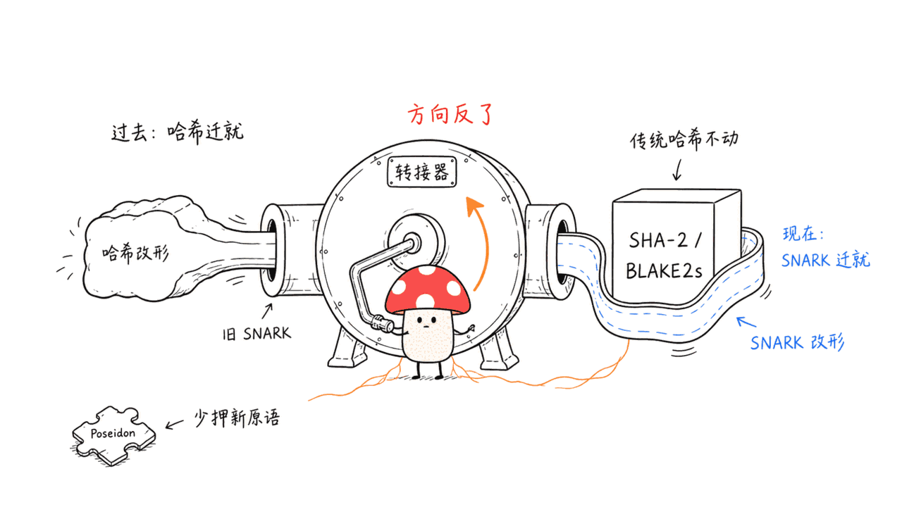
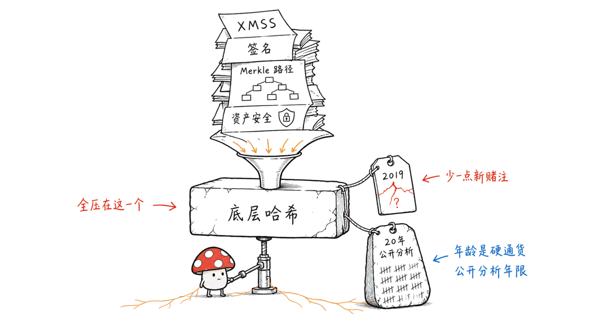
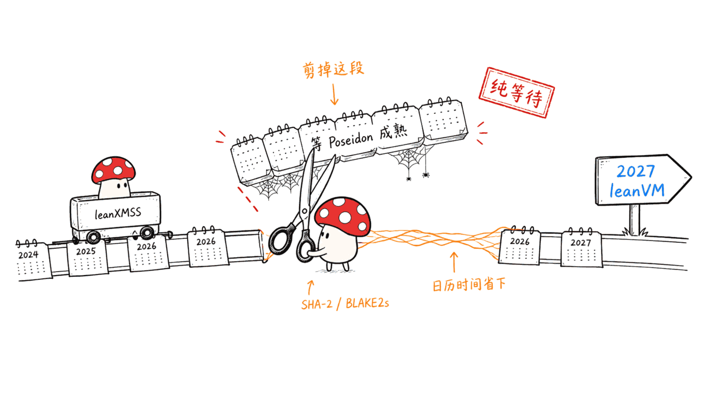
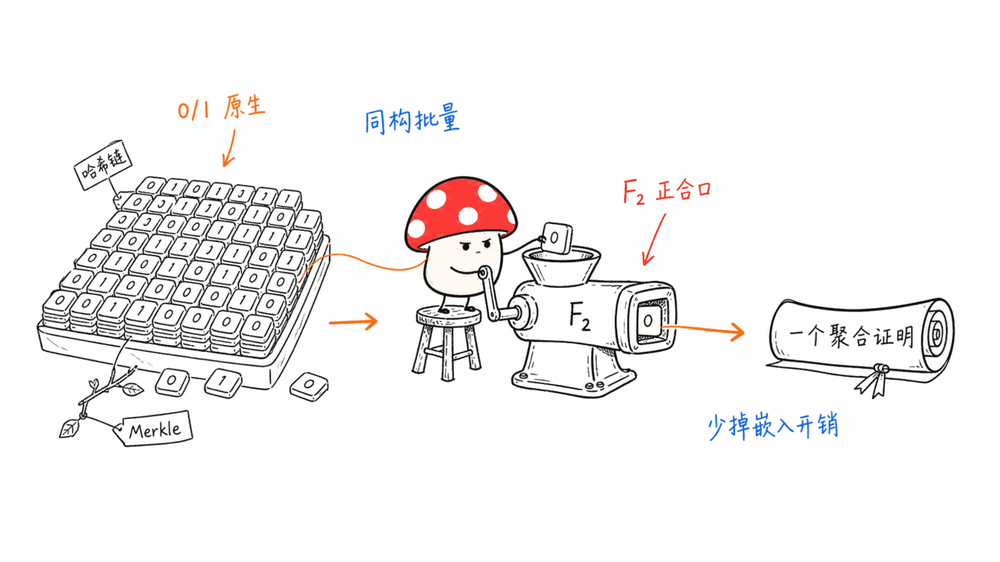
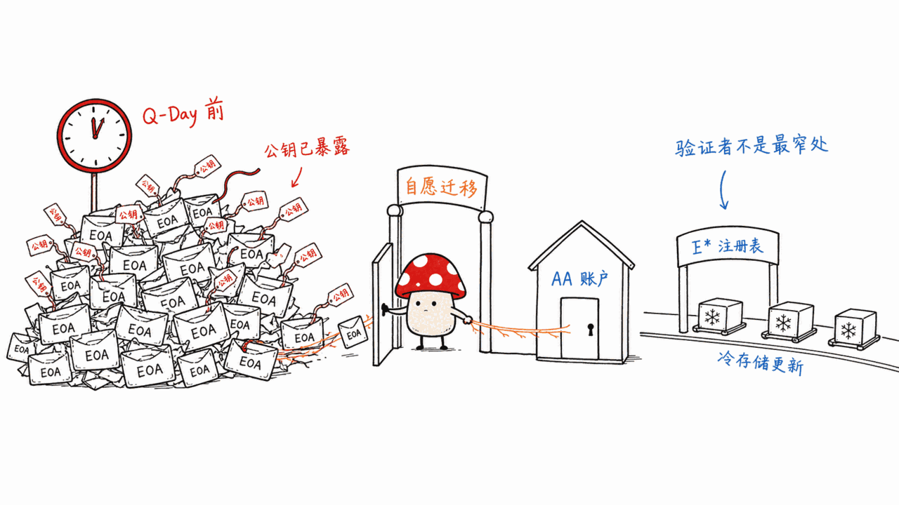

*by Mycelium Protocol*

---

原文：《八年投入急转弯，以太坊为何突然放弃 Poseidon？》
作者：ChandlerZ，Foresight News，2026-08-14
原文地址：https://foresightnews.pro/article/detail/99546

本文延伸参考的一手来源：
以太坊后量子资源中心 https://pq.ethereum.org/
共识层路线图 https://leanroadmap.org/
协议路线图 https://strawmap.org/
Flock 论文（Bünz, Rothblum, Wang，2026）https://eprint.iacr.org/2026/1329
Poseidon 密码分析计划 https://www.poseidon-initiative.info/

---

## 一句话读后感

**这条新闻真正的信息量，不是「以太坊换了个哈希函数」，而是「密码学工程的适配方向反转了」。**

八年前的假设是：证明系统很贵，所以要设计对证明系统友好的哈希（Poseidon）。2026 年的现实是：证明系统进步太快，反过来去适配传统哈希更划算。Justin Drake 在 2026 年 8 月 13 日的原话最精炼——**事后看，关键不是 SNARK 友好型哈希，而是哈希友好型 SNARK。**

一个方向反转，让一个八年、八位数美元的技术押注在一夜之间失去必要性。这听起来像失败，但我读完的第一反应是相反的：**这是以太坊后量子路线上运气最好的一件事，而且它买回来的东西是日历时间。**



下面分三部分：为什么这个转向值得叫好、它具体加速了什么、以及以太坊后量子路线到底由哪些组件构成。

---

## 一、为什么我认为该叫好：安全论证的「年龄」是硬通货

要理解这次转向的分量，得先看清一条被大多数报道略过的逻辑链。

**后量子签名的主流路线是「基于哈希的签名」（hash-based signatures）。** 原因很简单：Shor 算法能高效破解椭圆曲线离散对数和 RSA 大数分解，也就是 ECDSA、BLS、KZG 全部完蛋；但对哈希函数，量子计算机只有 Grover 算法，效果是把 2^n 的搜索降到 2^(n/2)——**把安全强度砍一半，把哈希输出加倍就补回来了。** 所以哈希是后量子时代最结实的地基。

以太坊共识层的 PQ 方案 leanXMSS 就是一个 XMSS 变体，本质是一棵一次性签名的 Merkle 树。

**关键在这里：一个基于哈希的签名方案，它的全部安全性坍缩到底层那个哈希函数上。** 没有别的假设可以分担风险。你选哪个哈希，就等于把整条链的抗量子安全押在那个哈希的抗碰撞/抗原像性质上。



于是问题变成：**你敢把数万亿美元的链上资产，押在一个 2019 年才发表的哈希函数上吗？**

Poseidon 并没有被攻破——这点必须说清楚，Drake 本人也强调了，以太坊没有发出任何迁移命令，也没有部署任何分叉。但 Poseidon 密码分析计划（Poseidon Cryptanalysis Initiative）的公开进展显示，截至 2026 年 7 月，针对**削减轮数**版本的攻击已经有实质结果：CICO 问题在 RF=6、RP=10 参数下已被攻破，zero-test 问题在 RF=6、RP=12 下已被攻破。

这是密码分析的正常节奏——削减轮数攻击不等于完整版本被破。但它恰恰说明了成熟度的差距在哪：

| | Poseidon | SHA-2 | BLAKE2/3 |
|---|---|---|---|
| 发表时间 | 2019 | 2001 | 2008（BLAKE 参加 SHA-3 竞赛） |
| 公开分析年限 | ~7 年 | ~25 年 | ~18 年 |
| 设计目标 | 最小化证明电路规模 | 通用 | 通用 |
| 数学结构 | 素域上的代数运算（S 盒 + MDS 矩阵） | 布尔运算（异或、移位、加法） | 布尔运算 |
| 标准化 | 无 | FIPS 180-4 | RFC 7693（BLAKE2） |
| 硬件指令 | 无 | SHA-NI、ARMv8 加密扩展 | 无（但极快） |

代数结构是双刃剑：它让电路便宜，也给密码分析提供了更多代数抓手。历史上代数哈希被推着改参数是常态——MiMC、GMiMC、Rescue 都有过被削减版本攻击后调整参数的经历。

**过去这是一个「性能 vs 成熟度」的权衡题。现在性能那一侧的理由没了，就只剩成熟度。所以这不是艰难的决定，是显而易见的决定。** EF 唯一值得称道的地方，是它没有为了保护八年沉没成本而拖延，而是干净地公开转向。

---

## 二、这次转向具体加速了什么：六条作用

这是本文的重点。「加速」这个词容易被说成正确的废话，我把它拆成六条可验证的具体作用。

### 作用一：从关键路径上删掉了一段纯等待

原方案的依赖关系是这样的：

```
leanXMSS 签名方案落地
   ↑ 依赖
底层哈希的安全性达到"可押注万亿美元"的置信度
   ↑ 依赖
Poseidon 密码分析计划完成足够多轮的公开分析
   ↑ 现状
第二阶段预计 2026 年 12 月结束，之后还需要多年独立复核
```

密码学界对一个新原语建立信任，靠的是**时间 × 攻击者数量**，这个量无法用钱买到、无法并行加速。EF 已经在这上面投了 100 万美元的 Poseidon Prize 加上 9 万美元的初期奖池——钱能买来关注度，买不来「这个函数在野外活了二十年没被打破」这个事实。

**切换到 SHA-2 / BLAKE2s，等于把这段等待整个删掉：这两个函数的分析年限已经预付了二十年。** 这是纯粹的日历时间节省，直接作用在 2027 年生产级 leanVM 这个硬目标上。



我的估计是这一条至少值一到两年——这也是标题里那个数字的来源，它是推断不是官方数字。

### 作用二：清零了「参数被推翻导致返工」的尾部风险

假设不转向。2028 年，某个密码学家发表了一篇针对完整轮数 Poseidon 的新攻击，需要把轮数从 RF=8/RP=56 提到更高。会发生什么？

- 所有已部署的 leanXMSS 密钥要重新生成（Merkle 树根变了）
- 所有已生成的证明电路要重写
- leanVM 的性能预算要重算（轮数上升 = 电路变大 = 证明变慢）
- 已经进入冷存储和 HSM 的验证者密钥要全部轮换

**这是一个低概率、高破坏力的尾部事件，而且它会在最糟糕的时间点发生——迁移刚做到一半的时候。** 切到成熟哈希不能说把这个风险归零，但把它压到了「SHA-2 被攻破」这个量级，那已经是整个数字文明共同承担的风险，不是以太坊单独承担的风险了。

**风险从「自己的选择带来的」变成「所有人共享的」，这在工程上是巨大的降级。**

### 作用三：让证明系统和签名方案的「形状」对上了

这一条是最技术性的，也是最有意思的。

传统哈希长期进不了 SNARK，根本原因是**计算语言不匹配**：SHA-2、BLAKE2s 大量使用异或、移位、位旋转这些布尔运算，而传统 SNARK 在一个大素域（比如 BN254 的标量域，256 位）上做算术。在大素域里模拟一个 1 比特的异或，要把每个比特拆成一个域元素再加约束，开销是几十上百倍——这就是所谓的「嵌入开销」（embedding overhead）。

**二进制域方案的做法是把底层数学换掉：直接在最小的素域 F₂（只有 0 和 1）及其扩域 F₂^128 上工作。** 位运算不再需要模拟，它本来就是这个域的原生操作。嵌入开销消失。

这条路径的里程碑：

- **Binius（2023）**——首次系统性地把二进制塔域用于 SNARK
- **Flock（2026 年 7 月，Benedikt Bünz、Ron Rothblum、William Wang，ePrint 2026/1329）**——专门优化「批量布尔计算」的证明。M4 Max 单核每秒证明 8.2 万次 BLAKE3 压缩、4.2 万次 SHA-256 压缩、3 万次 Keccak 置换，相对原生执行的开销小于 250 倍。十核吞吐超过 66 万次 BLAKE3 压缩/秒。证明 SHA-256 比此前最优的 Binius64 快 9 倍以上，比最快的椭圆曲线 SNARK 快 500 倍以上。
- **SNARK.fast**——用 AI 自动优化证明代码的开放研究项目，在 M3 Max 上达到每秒 180 万次 BLAKE3 压缩，相对起始基准提升 255%。

综合下来，**一台笔记本每秒能证明约 100 万次传统哈希调用。**

现在看关键的形状匹配：**hash-based signature 的聚合验证，恰恰就是「大批量、同构、布尔运算主导」的电路**——你要验证成千上万个验证者的 XMSS 签名，每个签名就是一堆哈希链和 Merkle 路径展开，全都是同一个电路的重复实例。

而 Flock 论文的定位是「证明同一个 R1CS 电路的批量实例（外加它们之间的输入输出关系）」，明确提到可以证明哈希链和 Merkle 路径开启，并且**原则上可扩展到完整的基于哈希的签名验证**。



**这不是巧合，这是需求和供给撞上了。** 证明系统这一侧的进展，正好长成了共识层签名聚合需要的那个形状。以太坊要做的事从「发明一个能塞进旧证明系统的哈希」，变成「用一个为哈希优化的新证明系统去证明标准哈希」——后者的每一块都是别人已经在做、且做得比你好的东西。

### 作用四：把整个机构侧的适配阻塞项一起解决了

这一条在技术讨论里几乎没人提，但在实际迁移里可能是最大的那块。

验证者密钥要进冷存储、要进 HSM、要过合规审计、要被托管服务商和机构质押平台支持。这些系统支持什么？**FIPS 认证的 SHA-2、有硬件指令加速的 SHA-256（Intel SHA-NI、ARMv8 加密扩展）、有 RFC 的 BLAKE2。**

如果 leanXMSS 的底层哈希是 Poseidon，那么每一个硬件钱包厂商、每一个 HSM 供应商、每一个托管方，都要为以太坊单独实现和认证一个非标准哈希。这个过程的时间尺度是**年**，而且完全不在 EF 的控制范围内。

**切到 SHA-2 之后，这整条外部依赖链直接消失。** 而 pq.ethereum.org 的威胁优先级排序里，「高价值运营密钥——交易所、跨链桥、托管」排在第二位，仅次于用户 EOA。这不是边缘问题。

### 作用五：形式化验证的成本大幅下降

EF 的 Protocol Snarkification 团队（Alex Hicks 领导）投了 **2000 万美元、三年周期**做 zkEVM 形式化验证，目标是确保「机制行为与数学定义完全一致」。共识层这边也有一条独立的形式化验证轨道，用 Lean 4 框架验证 FRI / STIR / WHIR 这些证明系统组件，目前进度约 40%。

形式化验证 SHA-2 电路和形式化验证 Poseidon 电路，工作量完全不是一个量级：**SHA-2 有大量既有的形式化规格、参考实现和验证工作可以复用**（它是被验证得最彻底的密码学原语之一），Poseidon 基本要从零开始，而且它的参数还可能变。

**在一个「形式化验证优先」的路线里，选一个已经被验证过无数遍的原语，等于白拿一大截进度。**

### 作用六：解除了 2027 年 leanVM 目标的性能焦虑

原本的逻辑是：PQ 签名比 BLS 大太多（leanXMSS 约 3000 字节 vs BLS 96 字节，约 31 倍），而且没有 BLS 那种原生聚合能力，所以必须靠 zkVM 把一整个 slot 的签名压缩成一个 SNARK 证明，目标压缩比约 250 倍。这个 zkVM 要在 2027 年达到生产级。

在传统哈希证明还很慢的年代，这个目标要成立，就必须用 Poseidon 来压电路规模——**性能压力逼着你选择不成熟的原语。**

现在二进制域 SNARK 把传统哈希的证明成本打下来了，性能压力解除，选择空间打开。leanroadmap.org 上的数据也印证了这一点：leanSig 的验证性能已达目标的 139%（比目标快 39%），leanMultisig 的聚合效率达到目标的 97%——**唯一还落后的是聚合体积，目前是初始目标的 313%~391%，优化仍在进行中。**

也就是说，签名和聚合的**速度**问题基本解决了，剩下的是**体积**优化。而体积优化恰恰最受益于证明系统本身的进步。

---

### 但也要说清楚：哪些没被加速，以及代价

保持诚实，三条：

**1. 这是「L1 不用」，不是「Poseidon 不安全」。** 媒体标题里的「放弃」「急转弯」容易让人误读成 Poseidon 出事了。它没有。Poseidon 在 L2 和应用层依然广泛部署，Poseidon Prize 的 100 万美元也依然有价值——把一个被广泛使用的原语分析清楚，这件事的价值独立于以太坊 L1 用不用它。

**2. 已经押注 Poseidon 的生态要各自决策。** Scroll、Polygon zkEVM、zkSync 等在状态树或证明系统里用了 Poseidon 的项目，现在面对一个不太舒服的局面：L1 走了另一条路，自己是跟还是不跟？跟，意味着状态树迁移这种伤筋动骨的工程；不跟，意味着长期维护一条和 L1 不同的密码学路径。Starknet 已经先行一步——它 6 月的路线图第一阶段就是**用 BLAKE2 替代 Pedersen 哈希，并引入 Falcon-512 共识签名**。

**3. 二进制域 SNARK 本身是新东西。** 有点讽刺：为了避免押注一个 2019 年的哈希，我们押注了一批 2023-2026 年的证明系统。区别在于——**证明系统出问题最多是「证明失效需要重新证明」，哈希出问题是「历史上所有签名一起失效」。** 前者可恢复，后者不可恢复。这个权衡是划算的，但不是没有代价。

---

## 三、以太坊后量子路线全图：组件、里程碑、时间表

上面反复提到 leanXMSS、leanVM、I*、M* 这些名字。这部分把整张图铺开。

### 3.1 威胁模型：到底什么会被打破

Vitalik 在 2026 年 2 月的路线图里明确了四个受威胁的密码学组件：

| 组件 | 用在哪一层 | 干什么用 | 量子威胁 |
|---|---|---|---|
| **ECDSA / secp256k1** | 执行层 | 用户账户（EOA）签名 | Shor 算法直接破解 |
| **BLS12-381** | 共识层 | 验证者投票签名与聚合 | Shor 算法直接破解 |
| **KZG 承诺** | 数据层 | blob 数据可用性 | 基于配对，Shor 算法破解 |
| **Groth16 等曲线 SNARK** | 应用 / L2 | 零知识证明 | 基于椭圆曲线，同样被破 |

反过来，**哈希函数和对称密码只被 Grover 算法削弱一半强度**，加倍输出长度即可补回。这就是为什么整条 PQ 路线都往「基于哈希」的方向收敛。

时间压力来自三个独立来源：

- **Google 2026 年 3 月的研究**估计，破解 256 位椭圆曲线密码大约需要 1200 个逻辑量子比特——当前硬件距此仍远，但这是一个具体的数字目标，不再是模糊的「未来某天」
- **NIST** 计划 2030 年弃用 ECDSA、2035 年完全禁止
- **Project Eleven 的《The Quantum Threat to Blockchains - 2026 Report》** 把 Q-Day（量子破译日）估在 **2030 至 2033 年**

以太坊把核心 L1 的 PQ 基础设施目标定在 **2029 年**，正好卡在这些估计的前面。

### 3.2 五颗北极星（strawmap.org）

以太坊 L1 的长期目标框架，PQ 是其中一颗：

1. **Fast L1** — 交易确认与链终局性在「秒」级
2. **Gigagas L1** — L1 达到 1 gigagas/秒（约 1 万 TPS），靠 zkEVM 与实时证明
3. **Teragas L2** — L2 达到 1 GB/秒（约 1000 万 TPS），靠数据可用性采样
4. **Post-Quantum L1** — **世纪级的密码学安全，靠基于哈希的方案**
5. **Private L1** — 隐私作为一等公民，靠 L1 屏蔽转账

节奏是「到 2029 年七次分叉，大致每六个月一次」，命名沿用星名序列：Altair、Bellatrix、Capella、Deneb、Electra、Fulu、**Glamsterdam、Hegotá**。strawmap 自己声明它是「加速主义的协调工具」，不是绑定承诺——最终方向由 All Core Devs 等开放治理流程决定。

### 3.3 核心组件逐个拆

**leanSig / leanXMSS —— 基于哈希的验证者签名**

XMSS 变体，Rust 实现（leanSig 库）。签名约 3000 字节，公钥是 52 字节的 Merkle 根（根用 8 个元素、随机化器用 5 个元素）。密钥生成在 10 核 MacBook M1 上完成，密钥寿命设计为 8 年。

要理解它的代价：**BLS 签名 96 字节且原生可聚合，leanXMSS 3000 字节且不可原生聚合。** 直接替换的话共识层带宽会爆炸。所以必须有下一个组件。

**leanVM / leanMultisig —— 最小 zkVM 做签名聚合**

用零知识证明把一整个 slot 的所有验证者签名压缩成**一个** SNARK 证明。目标压缩比约 **250 倍**。这是整条 PQ 共识路线的技术心脏——没有它，PQ 共识在带宽上根本不成立。

当前状态：聚合效率达到目标的 97%（M4 Max 优化），聚合体积是初始目标的 313%~391%，仍在优化。zkVM 选型上在探索 SP1、OpenVM、Binius 几条路线。

**leanSpec —— Python 可执行规范**

约 10 个客户端团队基于它开发。这是「先立标准、后动代码」策略的载体：规范本身是可执行的，客户端实现可以直接对照。

**3SF（3-slot finality）—— 终局性从分钟级到秒级**

把终局性从当前的约 15 分钟压缩到秒级。它不是 PQ 组件，但和 PQ 共识在同一次重构里推进——因为两者都要改共识层的签名与投票结构，一起改比分两次改便宜。早期 devnet 用的是简化版 3SF-mini，正在向 PQ 心跳机制演进。fork-choice 规则计划在 devnet-5 换成 Goldfish。

**账户抽象 + EIP-8141 —— 执行层的签名敏捷性**

这是用户侧的关键。以太坊**不打算做全网强制迁移**，而是通过账户抽象让每个账户自愿选择签名方案——EIP-8141 让钱包能够切换签名类型，包括后量子方案。目标是在 **Hegotá 分叉（2026 下半年）**考虑纳入。

配套的执行层里程碑还包括「向量数学预编译」，用于高效验证 PQ 签名。

**PQ 密钥注册表（Public Key Registry，里程碑 I*）—— 第一个具体迁移步骤**

2026 年 6 月 1 日提出，由 Thomas Coratger 主导，Justin Drake、Tom Wambsgans、Ladislaus、Thomas Thiery 参与。

机制：验证者通过一种新的共识层消息，提交 52 字节的 leanXMSS Merkle 根公钥加上一个持有证明（Proof of Possession）。每个区块最多接受 16 个注册，用 leanVM 聚合，**每个 slot 产出一个 SNARK 证明**。

设计意图很关键：这是一个「热身阶段」，**让验证者在不影响网络终局性的前提下，安全地更新冷存储基础设施**。真正的签名切换要到「若干个分叉之后」。

这个设计体现了整条路线的核心原则——**渐进迁移，不要 flag day**（不要某个时刻全网一起硬切）。

**P2P 网络层**

Gossipsub v2.0 规范（进度约 50%）、Practical Rateless Set Reconciliation、libp2p 的 C 与 Zig 实现。目标是支撑 4 秒出块。这一层是被 PQ 逼出来的——签名变大 31 倍，网络层必须先扛得住。

### 3.4 里程碑序列：I* → J* → L* → M*

pq.ethereum.org 上的三条并行路径：

**共识层：**
```
PQ 密钥注册表 (I*)  →  PQ 证明 + 实时共识层证明 (L*)  →  完全 PQ 共识
     进行中                      进行中                      研究阶段
```

**执行层：**
```
PQ 签名预编译 (J*)  →  PQ 交易  →  PQ 签名聚合 (M*)
     进行中             规划中          规划中
```

**数据层：**
```
leanVM  →  PQ blobs (M*)
           规划中（聚合角色仍在探索）
```

三条线并行推进，共用 leanVM 这个基础设施。

### 3.5 开发实况：devnet 与客户端

共识层的 PQ devnet 序列（leanroadmap.org）：

| devnet | 时间 | 状态 | 重点 |
|---|---|---|---|
| pq-devnet-0 | 2025-10 | ✅ 完成 | 框架建立、多客户端协调 |
| pq-devnet-1 | 2025-12 | ✅ 完成 | leanSig 集成与基线指标 |
| pq-devnet-2 | 2026-01 | ✅ 完成 | leanMultisig 聚合实现 |
| pq-devnet-3 | 2026-02 | ✅ 完成 | 聚合器角色分离 |
| pq-devnet-4 | 2026-03 | 🔄 进行中 | **递归 PQ 签名聚合** |
| pq-devnet-5 | 计划中 | ⏳ | 区块级聚合证明、Goldfish fork-choice |

**八个客户端团队，五种语言：** Ream、ethlambda、Peam、Lighthouse 分支（Rust）、Zeam（Zig）、Qlean-mini（C++）、Lantern（C）、gean（Go）。

这个语言多样性不是炫技——**客户端多样性是共识层抗单点故障的基本要求**，一个实现的 bug 不应该拖垮整条链。

八条活跃研究轨道及进度：Poseidon 密码分析（50%）、基于哈希的多签（70%）、zkVM 签名聚合（50%）、形式化验证（40%）、P2P 网络（30%）、出块者-证明者分离（20%）、更快终局性（50%）、退出队列灵活性。

注意第一条——**Poseidon 密码分析轨道仍在 50% 进度上继续。** 这也印证了「L1 不用 ≠ 停止研究」。

### 3.6 完整时间线

| 时间 | 事件 |
|---|---|
| 2025-10 | pq-devnet-0，PQ 开发网起步 |
| 2026-01 | EF 成立专职后量子安全团队；设立 100 万美元 Poseidon Prize |
| 2026-02 | Vitalik 发布四领域 PQ 路线图 |
| 2026-03 | pq.ethereum.org 上线；10 余客户端团队参与互操作开发网；Google 发布 1200 逻辑量子比特估计 |
| 2026-06-01 | PQ 公钥注册表提案发布 |
| 2026-07 | Flock 论文发表（ePrint 2026/1329） |
| **2026-08-13** | **Justin Drake 宣布 L1 放弃 Poseidon，转向 SHA-2 / BLAKE2s** |
| 2026 H2 | Hegotá 分叉考虑纳入 EIP-8141 |
| 2026-12 | Poseidon 密码分析计划第二阶段预计结束 |
| **2027** | **生产级 leanVM 部署** |
| **2028** | **共识层、数据层、执行层完成部署** |
| **2029** | **核心 L1 后量子基础设施完成** |
| 2029+ | 执行层账户完全迁移（自愿，通过账户抽象） |
| 2030-2033 | Q-Day 预估区间（Project Eleven） |

**目标日期比威胁窗口早了至少一年。** 这个余量看着不宽裕，但考虑到迁移本身要靠自愿采纳而非强制切换，早一年到位意味着用户有一年时间自己动手。

### 3.7 横向对比：其他链怎么走

| 链 | 签名方案 | 哈希 | 节奏判断 |
|---|---|---|---|
| **以太坊** | leanXMSS（基于哈希） | 转向 SHA-2 / BLAKE2s | 2029 核心完成，激进 |
| **Solana**（2026-04 路线图） | **Falcon**（格基） | — | 认为量子威胁仍需数年，当前无需立即迁移 |
| **Starknet**（2026-06 路线图） | **Falcon-512** | **BLAKE2 替代 Pedersen** | 三阶段：哈希与签名 → 合约迁移工具 → 以太坊外部依赖 |

一个值得注意的分歧：**以太坊选了基于哈希的签名，Solana 和 Starknet 都选了格基的 Falcon。**

权衡是清楚的——Falcon 签名小得多（666 字节量级 vs leanXMSS 的 3000 字节），但它的安全性依赖格问题的困难性，这是一个比「哈希抗原像」更强、更新的假设。以太坊选了体积更大但假设更弱的方案，然后用 zkVM 聚合去补体积——**这是典型的以太坊风格：宁可多做工程，也要少做假设。**

Starknet 的选择也很说明问题：**它同样在第一阶段就用 BLAKE2 替代了 Pedersen 哈希。** 也就是说，「回到经过长期验证的传统哈希」这个方向，不是以太坊一家的判断。

---

## 四、三个观察

### 观察一：能公开转向，本身是治理能力的体现

八年、八位数美元的投入，说不用就不用。这在任何有股东、有产品路线图承诺、有市场预期要管理的组织里都极难做到——沉没成本会变成政治成本，转向会被解读成认错。

EF 的处理方式值得记下来：**明确说 Poseidon 没有被攻破、明确说没有迁移命令、明确说这是因为外部条件变了，同时不停止对 Poseidon 的资助和分析。** 它把「我们不用了」和「它不好」这两件事切得很干净。

**能干净地承认「当初的假设变了」，是一个技术组织最稀缺的能力。**

### 观察二：真正的迁移瓶颈不在协议层，在用户侧

看 pq.ethereum.org 的威胁优先级排序：

1. **用户账户（EOA）**——价值最大，且公钥已经暴露
2. 高价值运营密钥——交易所、跨链桥、托管
3. 治理密钥——协议管理多签
4. 验证者密钥——影响共识而非直接资产

**注意：验证者密钥排在最后，用户账户排在最前。** 但本文前面梳理的所有工作——leanXMSS、leanVM、devnet、3SF——绝大部分是在解决第 4 项。

第 1 项的解法只有一个：**账户抽象 + EIP-8141，让用户自愿迁移。** 而「自愿」意味着协议层做完全部工作之后，真正的迁移才刚开始——要等钱包厂商支持、要等用户理解、要等交易所改造。

这里有一个尖锐的事实：**任何一个已经发过交易的 EOA，它的公钥已经永久暴露在链上了。** 量子计算机不需要等你再发一笔交易，它可以在 Q-Day 之后慢慢算。这意味着**迁移必须在 Q-Day 之前完成，而不是之后**——没有补救窗口。

而 2030-2033 的 Q-Day 估计，减去用户侧迁移需要的年数，倒推回来的截止日期比协议层的 2029 年更紧。**这是整条路线上最容易被低估的部分。**



### 观察三：这次转向真正的赢家是「密码学敏捷性」

pq.ethereum.org 把整套工作的基础定义为「密码学敏捷性」（cryptographic agility）——**在不破坏网络的前提下升级核心密码学原语的能力**，并明确列出「密码学灵活性优于单一承诺，避免过早锁定某个方案」这条设计原则。

这次转向恰好是这条原则的一次实弹测试：**外部条件变了，路线能不能改？** 答案是能，而且改得很快——从 Flock 论文发表（2026 年 7 月）到 L1 决策公布（2026 年 8 月 13 日），大约一个月。

对我们做数字公共物品的人来说，这一条最有借鉴价值：

**你在协议里锁定的每一个具体技术选型，都是一笔以未来灵活性支付的债务。** 真正该被写进协议的，不是「用哪个哈希」，而是「怎么换哈希」。以太坊八年前如果把 Poseidon 硬编码进共识规则，今天这次转向的代价会是一次社区分裂级别的硬分叉；因为它一直停留在「研究方向」而非「部署事实」，转向的代价就只是一篇公告。

**基础设施的价值不在于它选对了什么，而在于它保留了改选的能力。** 这也是 Mycelium Protocol 里我们反复强调「协议层是共识，不是管控」的原因——共识可以演进，管控只能被推翻。

---

## 结语

回到那句话：**关键不是 SNARK 友好型哈希，而是哈希友好型 SNARK。**

这不只是一句技术俏皮话。它描述的是一种工程哲学的胜利——**当你面对「改造 A 去适配 B」和「改造 B 去适配 A」两条路时，优先改造那个你能承受它出错的东西。**

哈希出错，历史上所有签名一起失效，不可恢复。证明系统出错，重新证明就行，可恢复。所以应该改造证明系统，不该改造哈希。这个道理八年前不成立，因为改造证明系统当时做不到；2026 年成立了，因为二进制域 SNARK 做到了。

以太坊做的事，是在条件成立的第一时间就转过来。

对于一条要承载数万亿美元、要活一个世纪的公共基础设施来说，**这种「随时准备推翻自己」的能力，比任何单一技术选型都值钱。**

---

> © 2026 Author: Mycelium Protocol. 本文采用 [CC BY 4.0](https://creativecommons.org/licenses/by/4.0/deed.zh) 授权——欢迎转载和引用，须注明作者姓名及原文链接，不得去除署名后以原创发布。

<!--EN-->

## TL;DR

**The real news isn't that Ethereum swapped a hash function. It's that the direction of adaptation reversed.**

Eight years ago the assumption was: proof systems are expensive, so design a hash that's friendly to proof systems (Poseidon). The 2026 reality is: proof systems improved so fast that adapting them to conventional hashes is the better deal. Justin Drake put it best on August 13, 2026 — **in hindsight the key was not SNARK-friendly hashes, but hash-friendly SNARKs.**

One reversal made an eight-year, eight-figure technical bet unnecessary overnight. That sounds like failure. My reading is the opposite: **this is the luckiest thing to happen to Ethereum's post-quantum roadmap, and what it bought is calendar time.**


Three parts below: why the pivot deserves applause, what specifically it accelerates, and what Ethereum's post-quantum roadmap actually consists of.

---

## I. Why applaud: the *age* of a security argument is hard currency

Here's the logic chain most coverage skipped.

**The mainstream post-quantum signature route is hash-based signatures.** Shor's algorithm efficiently breaks elliptic-curve discrete log and RSA factoring — so ECDSA, BLS, and KZG all fall. Against hash functions, quantum computers only have Grover's algorithm, which reduces a 2^n search to 2^(n/2) — **it halves the security level, and doubling the output length restores it.** Hashes are the sturdiest foundation available post-quantum.

Ethereum's consensus-layer PQ scheme, leanXMSS, is an XMSS variant — essentially a Merkle tree of one-time signatures.

**Here's the crux: a hash-based signature scheme collapses its entire security onto that one underlying hash function.** No other assumption shares the risk. Whichever hash you pick, you're betting the chain's quantum resistance on that hash's collision and preimage resistance.


Which becomes: **would you bet trillions of dollars of on-chain assets on a hash function published in 2019?**

Poseidon has *not* been broken — this must be stated clearly, and Drake stressed it himself: Ethereum has issued no migration order and deployed no fork. But the Poseidon Cryptanalysis Initiative's public progress shows that as of July 2026, attacks on **round-reduced** variants have real results: the CICO problem is broken at RF=6, RP=10, and the zero-test problem at RF=6, RP=12.

That's normal cryptanalytic cadence — round-reduced breaks don't mean the full version falls. But it illustrates exactly where the maturity gap sits:

| | Poseidon | SHA-2 | BLAKE2/3 |
|---|---|---|---|
| Published | 2019 | 2001 | 2008 (BLAKE in the SHA-3 competition) |
| Years of public analysis | ~7 | ~25 | ~18 |
| Design goal | Minimize proof circuit size | General purpose | General purpose |
| Math structure | Algebraic over prime fields (S-box + MDS matrix) | Boolean (XOR, shift, add) | Boolean |
| Standardization | None | FIPS 180-4 | RFC 7693 (BLAKE2) |
| Hardware instructions | None | SHA-NI, ARMv8 crypto extensions | None (but very fast) |

Algebraic structure is double-edged: it makes circuits cheap, and it hands cryptanalysts more algebraic handles. Historically, algebraic hashes getting pushed into parameter revisions is the norm — MiMC, GMiMC, and Rescue all went through it.

**This used to be a performance-vs-maturity tradeoff. Now the performance side of the argument is gone, leaving only maturity. So this isn't a hard decision — it's an obvious one.** What deserves credit is that the EF didn't stall to protect eight years of sunk cost; it pivoted cleanly and publicly.

---

## II. What specifically got accelerated: six effects

This is the heart of the piece. "Acceleration" is easy to state as a platitude, so here are six verifiable, concrete effects.

### Effect 1: A pure waiting period was removed from the critical path

The original dependency chain:

```
leanXMSS ships
   ↑ requires
underlying hash reaching "safe to bet trillions" confidence
   ↑ requires
Poseidon Cryptanalysis Initiative completing enough public analysis
   ↑ status
Phase 2 ends ~December 2026, then years more independent review
```

Cryptographic trust in a new primitive is built by **time × number of attackers** — a quantity you cannot buy or parallelize. The EF already put $1M into the Poseidon Prize plus a $90K initial pool. Money buys attention; it cannot buy the fact that "this function survived twenty years in the wild."

**Switching to SHA-2 / BLAKE2s deletes that wait entirely: those functions have twenty years of analysis prepaid.** That's pure calendar-time savings, applied directly to the hard 2027 production leanVM target.


My estimate is this alone is worth one to two years — that's where the headline number comes from. It's an inference, not an official figure.

### Effect 2: The "parameters get overturned" tail risk went to zero

Suppose no pivot. In 2028 a cryptographer publishes a new attack on full-round Poseidon requiring higher round counts. Then:

- Every deployed leanXMSS key must be regenerated (Merkle roots change)
- Every generated proof circuit must be rewritten
- leanVM's performance budget must be recomputed (more rounds = bigger circuit = slower proving)
- Every validator key already in cold storage and HSMs must be rotated

**That's a low-probability, high-damage tail event — and it would land at the worst possible moment, mid-migration.** Switching to a mature hash doesn't zero the risk, but it compresses it to "SHA-2 gets broken" — a risk shared by all of digital civilization, not carried by Ethereum alone.

**Moving a risk from "caused by my own choice" to "shared by everyone" is a massive engineering downgrade in severity.**

### Effect 3: The proof system and the signature scheme now have the same *shape*

The most technical point, and the most interesting.

Conventional hashes long failed to fit into SNARKs because of a **computational language mismatch**: SHA-2 and BLAKE2s lean on XOR, shifts, and rotations, while classic SNARKs do arithmetic over a large prime field (e.g. BN254's 256-bit scalar field). Simulating a 1-bit XOR inside a large prime field means decomposing each bit into a field element with constraints — tens to hundreds of times the overhead. That's the *embedding overhead*.

**Binary-field schemes swap out the underlying math: they work directly over the smallest prime field F₂ (just 0 and 1) and its extension F₂^128.** Bit operations need no simulation — they're native. The embedding overhead disappears.

Milestones on this path:

- **Binius (2023)** — first systematic use of binary tower fields for SNARKs
- **Flock (July 2026; Benedikt Bünz, Ron Rothblum, William Wang; ePrint 2026/1329)** — optimized specifically for proving batch Boolean computations. On a single M4 Max core: 82k BLAKE3 compressions, 42k SHA-256 compressions, and 30k Keccak permutations per second — under 250× overhead versus native execution. On ten cores, over 660k BLAKE3 compressions/sec. For SHA-256 it's over 9× faster than Binius64 (the prior state of the art) and over 500× faster than the fastest elliptic-curve SNARK.
- **SNARK.fast** — an open research project using AI to optimize proving code, reaching 1.8M BLAKE3 compressions/sec on an M3 Max, a 255% improvement over its starting benchmark.

Net result: **a laptop can prove roughly 1 million conventional hash calls per second.**

Now the shape match: **aggregate verification of hash-based signatures is exactly a large-batch, homogeneous, Boolean-dominated circuit** — verifying thousands of validators' XMSS signatures means unrolling hash chains and Merkle paths, all repeated instances of the same circuit.

And Flock is positioned precisely as proving batches of the same R1CS circuit (plus input/output relations among them), explicitly covering hash chains and Merkle path openings, and **in principle extendable to full hash-based signature verification.**


**That's not a coincidence — it's supply meeting demand.** Progress on the proving side grew into exactly the shape consensus-layer signature aggregation needs. Ethereum's task shifts from "invent a hash that fits old proof systems" to "use a hash-optimized new proof system on standard hashes" — and every piece of the latter is something others are already building, better.

### Effect 4: The entire institutional adaptation blocker dissolved

Rarely discussed in technical circles, possibly the biggest real-world blocker.

Validator keys go into cold storage, into HSMs, through compliance audits, and get supported by custodians and institutional staking platforms. What do those systems support? **FIPS-certified SHA-2, hardware-accelerated SHA-256 (Intel SHA-NI, ARMv8 crypto extensions), RFC-specified BLAKE2.**

If leanXMSS's underlying hash were Poseidon, every hardware wallet vendor, every HSM supplier, and every custodian would need to implement and certify a non-standard hash just for Ethereum. That process takes **years**, and none of it is under the EF's control.

**Switching to SHA-2 makes that entire external dependency chain vanish.** And on pq.ethereum.org's threat priority list, "high-value operational keys — exchanges, bridges, custody" ranks second, right after user EOAs. This is not a fringe concern.

### Effect 5: Formal verification got substantially cheaper

The EF's Protocol Snarkification team (led by Alex Hicks) has committed **$20M over three years** to zkEVM formal verification, aiming to ensure "mechanism behavior matches the mathematical definition exactly." The consensus side has its own formal verification track using a Lean 4 framework for FRI / STIR / WHIR components, currently ~40% complete.

Formally verifying a SHA-2 circuit versus a Poseidon circuit is not the same order of work: **SHA-2 has an enormous body of existing formal specs, reference implementations, and verification work to reuse** (it's among the most thoroughly verified cryptographic primitives in existence). Poseidon starts near zero — with parameters that might still change.

**In a roadmap that puts formal verification first, choosing an already-verified primitive is free progress.**

### Effect 6: The performance anxiety around the 2027 leanVM target lifted

The original logic: PQ signatures are far larger than BLS (leanXMSS ~3000 bytes vs BLS 96 bytes, ~31×) and lack BLS's native aggregation, so a zkVM must compress a whole slot's signatures into one SNARK proof, targeting ~250× compression — production-ready by 2027.

Back when proving conventional hashes was slow, hitting that target *required* Poseidon to shrink the circuit. **Performance pressure was forcing the choice of an immature primitive.**

Binary-field SNARKs removed that pressure, reopening the choice. leanroadmap.org's numbers confirm it: leanSig verification is at 139% of target (39% faster than goal), leanMultisig aggregation efficiency at 97% of target — **the only lagging metric is aggregate size, currently 313%–391% of the initial target, still being optimized.**

In short: the *speed* problem is essentially solved; what remains is *size*. And size optimization is exactly what benefits most from further proof-system progress.

---

### In fairness: what didn't get accelerated, and the costs

Three honest caveats:

**1. This is "L1 won't use it," not "Poseidon is unsafe."** Headlines using "abandons" and "sharp turn" invite the misreading that Poseidon broke. It didn't. Poseidon remains widely deployed at L2 and the application layer, and the $1M Poseidon Prize retains its value — analyzing a widely used primitive is worth doing regardless of whether Ethereum L1 uses it.

**2. Ecosystems already betting on Poseidon must each decide.** Scroll, Polygon zkEVM, zkSync and others using Poseidon in state trees or proof systems now face an uncomfortable position: L1 went another way — follow or not? Following means state-tree migration, which is major surgery. Not following means maintaining a cryptographic path divergent from L1 indefinitely. Starknet already moved: its June roadmap's phase one **replaces Pedersen with BLAKE2 and introduces Falcon-512 consensus signatures.**

**3. Binary-field SNARKs are themselves new.** Slightly ironic: to avoid betting on a 2019 hash, we're betting on 2023–2026 proof systems. The difference — **a broken proof system means "proofs must be redone"; a broken hash means "every historical signature fails at once."** The former is recoverable, the latter isn't. The trade is worth it, but it isn't free.

---

## III. The full post-quantum map: components, milestones, timeline

### 3.1 Threat model: what actually breaks

Vitalik's February 2026 roadmap named four vulnerable components:

| Component | Layer | Purpose | Quantum threat |
|---|---|---|---|
| **ECDSA / secp256k1** | Execution | User account (EOA) signatures | Broken by Shor |
| **BLS12-381** | Consensus | Validator vote signatures and aggregation | Broken by Shor |
| **KZG commitments** | Data | Blob data availability | Pairing-based, broken by Shor |
| **Groth16 and curve SNARKs** | Apps / L2 | Zero-knowledge proofs | Curve-based, broken |

By contrast, **hash functions and symmetric ciphers only lose half their strength to Grover** — doubling output length restores it. That's why the whole PQ roadmap converges on hash-based approaches.

Time pressure comes from three independent sources:

- **Google's March 2026 research** estimates breaking 256-bit elliptic curve cryptography needs roughly 1,200 logical qubits — far from current hardware, but now a concrete number rather than a vague "someday"
- **NIST** plans to deprecate ECDSA by 2030 and disallow it by 2035
- **Project Eleven's "The Quantum Threat to Blockchains – 2026 Report"** puts Q-Day at **2030–2033**

Ethereum targets **2029** for core L1 PQ infrastructure — just ahead of those estimates.

### 3.2 Five north stars (strawmap.org)

1. **Fast L1** — inclusion and finality in seconds
2. **Gigagas L1** — 1 gigagas/sec (~10K TPS) at L1 via zkEVMs and real-time proving
3. **Teragas L2** — 1 GB/sec (~10M TPS) at L2 via data availability sampling
4. **Post-Quantum L1** — **centuries-long cryptographic security via hash-based schemes**
5. **Private L1** — privacy as a first-class citizen via L1 shielded transfers

Cadence: "seven forks by 2029, roughly one every six months," named on the star scheme — Altair, Bellatrix, Capella, Deneb, Electra, Fulu, **Glamsterdam, Hegotá**. The strawmap describes itself as "an accelerationist coordination tool," not a binding commitment; direction is set through All Core Devs and open governance.

### 3.3 The components

**leanSig / leanXMSS — hash-based validator signatures**

An XMSS variant, Rust implementation (leanSig). Signatures ~3000 bytes; public key is a 52-byte Merkle root (8 elements for the root, 5 for the randomizer). Key generation runs on a 10-core MacBook M1, with an 8-year designed key lifetime.

The cost: **BLS is 96 bytes and natively aggregatable; leanXMSS is 3000 bytes and isn't.** A naive swap would blow up consensus bandwidth. Hence the next component.

**leanVM / leanMultisig — a minimal zkVM for signature aggregation**

Compresses an entire slot's validator signatures into **one** SNARK proof, targeting ~**250×** compression. This is the technical heart of the PQ consensus path — without it, PQ consensus simply doesn't fit in the bandwidth budget.

Status: aggregation efficiency at 97% of target (M4 Max optimized); aggregate size at 313%–391% of initial target, still being optimized. zkVM options under exploration include SP1, OpenVM, and Binius.

**leanSpec — executable Python specification**

Used by ~10 client teams. This is the vehicle for the "standard first, code second" strategy: the spec itself is executable, so implementations can be checked directly against it.

**3SF (3-slot finality) — finality from minutes to seconds**

Compresses finality from ~15 minutes to seconds. Not a PQ component, but pushed in the same restructuring — both change consensus signature and voting structures, and doing it once is cheaper than twice. Early devnets used a simplified 3SF-mini, evolving toward a PQ heartbeat. Fork-choice is slated to become Goldfish in devnet-5.

**Account abstraction + EIP-8141 — execution-layer signature agility**

The user-side key. Ethereum **does not plan a network-wide forced migration**. Instead, account abstraction lets each account choose its signature scheme voluntarily — EIP-8141 makes wallets able to switch signature types, including post-quantum ones. Targeted for consideration in the **Hegotá fork (H2 2026)**.

A companion execution-layer milestone is a **vector math precompile** for efficient PQ signature verification.

**PQ Public Key Registry (milestone I*) — the first concrete migration step**

Proposed June 1, 2026, led by Thomas Coratger with Justin Drake, Tom Wambsgans, Ladislaus, and Thomas Thiery.

Mechanism: validators submit a 52-byte leanXMSS Merkle root public key plus a Proof of Possession via a new consensus-layer message. Registrations are capped at 16 per block and aggregated with leanVM, **producing a single SNARK proof per slot.**

The intent matters: this is a "warmup phase" that **lets validators update cold-storage infrastructure safely without risking network finality.** The actual signature switchover comes "several forks later."

This embodies the roadmap's core principle: **incremental migration, no flag day.**

**P2P networking**

Gossipsub v2.0 (~50% progress), Practical Rateless Set Reconciliation, libp2p in C and Zig. Target: 4-second blocks. This layer is being forced by PQ — signatures grew 31×, so the network layer has to hold up first.

### 3.4 Milestone sequence: I* → J* → L* → M*

**Consensus layer:**
```
PQ key registry (I*)  →  PQ attestations + real-time CL proofs (L*)  →  full PQ consensus
     in progress                      in progress                          research
```

**Execution layer:**
```
PQ sig precompiles (J*)  →  PQ transactions  →  PQ sig aggregation (M*)
      in progress               planned              planned
```

**Data layer:**
```
leanVM  →  PQ blobs (M*)
           planned (aggregation role still being explored)
```

Three parallel tracks sharing leanVM as common infrastructure.

### 3.5 Development status: devnets and clients

| devnet | Date | Status | Focus |
|---|---|---|---|
| pq-devnet-0 | 2025-10 | ✅ | Framework, multi-client coordination |
| pq-devnet-1 | 2025-12 | ✅ | leanSig integration, baseline metrics |
| pq-devnet-2 | 2026-01 | ✅ | leanMultisig aggregation |
| pq-devnet-3 | 2026-02 | ✅ | Aggregator role separation |
| pq-devnet-4 | 2026-03 | 🔄 Active | **Recursive PQ signature aggregation** |
| pq-devnet-5 | Planned | ⏳ | Block-level aggregation proofs, Goldfish fork-choice |

**Eight client teams across five languages:** Ream, ethlambda, Peam, a Lighthouse fork (Rust), Zeam (Zig), Qlean-mini (C++), Lantern (C), gean (Go).

That language diversity isn't showing off — **client diversity is a baseline requirement for consensus-layer fault tolerance**; one implementation's bug shouldn't take down the chain.

Eight active research tracks with progress: Poseidon cryptanalysis (50%), hash-based multi-signatures (70%), zkVM signature aggregation (50%), formal verification (40%), P2P networking (30%), attester-proposer separation (20%), faster finality (50%), exit queue flexibility.

Note the first one — **Poseidon cryptanalysis continues at 50%.** Confirming that "L1 won't use it" ≠ "stop researching it."

### 3.6 Full timeline

| Date | Event |
|---|---|
| 2025-10 | pq-devnet-0 launches |
| 2026-01 | EF forms dedicated PQ security team; $1M Poseidon Prize announced |
| 2026-02 | Vitalik publishes the four-area PQ roadmap |
| 2026-03 | pq.ethereum.org launches; 10+ client teams in the interop devnet; Google publishes the 1,200 logical qubit estimate |
| 2026-06-01 | PQ public key registry proposal published |
| 2026-07 | Flock paper published (ePrint 2026/1329) |
| **2026-08-13** | **Justin Drake announces L1 drops Poseidon for SHA-2 / BLAKE2s** |
| 2026 H2 | Hegotá fork considers EIP-8141 |
| 2026-12 | Poseidon Cryptanalysis Initiative phase 2 expected to conclude |
| **2027** | **Production-grade leanVM deployment** |
| **2028** | **Consensus, data, and execution layers deployed** |
| **2029** | **Core L1 post-quantum infrastructure complete** |
| 2029+ | Execution-layer account migration (voluntary, via account abstraction) |
| 2030–2033 | Estimated Q-Day window (Project Eleven) |

**The target date leads the threat window by at least a year.** That margin looks thin, but since migration relies on voluntary adoption rather than a forced switch, arriving a year early means users get a year to act.

### 3.7 How other chains compare

| Chain | Signature scheme | Hash | Pace |
|---|---|---|---|
| **Ethereum** | leanXMSS (hash-based) | Pivoting to SHA-2 / BLAKE2s | Core done by 2029, aggressive |
| **Solana** (Apr 2026 roadmap) | **Falcon** (lattice) | — | Sees the threat as years out; no immediate migration needed |
| **Starknet** (Jun 2026 roadmap) | **Falcon-512** | **BLAKE2 replacing Pedersen** | Three phases: hash & signatures → contract migration tooling → Ethereum external dependencies |

A notable divergence: **Ethereum chose hash-based signatures; Solana and Starknet both chose lattice-based Falcon.**

The tradeoff is clear — Falcon signatures are far smaller (~666 bytes vs leanXMSS's ~3000), but its security rests on the hardness of lattice problems, a stronger and newer assumption than "hashes are preimage-resistant." Ethereum took the bulkier scheme with the weaker assumption, then used a zkVM to claw back the size. **That's characteristically Ethereum: do more engineering to make fewer assumptions.**

Starknet's choice is telling too: **it also replaces Pedersen with BLAKE2 in phase one.** The move back to long-analyzed conventional hashes isn't Ethereum's judgment alone.

---

## IV. Three observations

### Observation 1: The ability to pivot publicly is itself a governance capability

Eight years and eight figures, dropped. That's nearly impossible in any organization with shareholders, roadmap commitments, or market expectations to manage — sunk cost becomes political cost, and a pivot reads as an admission of error.

The EF's handling is worth recording: **explicitly stating Poseidon isn't broken, explicitly stating there's no migration order, explicitly attributing the change to shifted external conditions — while continuing to fund and analyze Poseidon.** It cleanly separated "we won't use it" from "it's bad."

**Cleanly admitting that an original assumption changed is among the scarcest capabilities a technical organization can have.**

### Observation 2: The real migration bottleneck isn't the protocol layer — it's users

pq.ethereum.org's threat priority list:

1. **User accounts (EOAs)** — highest value, public keys already exposed
2. High-value operational keys — exchanges, bridges, custody
3. Governance keys — protocol multisigs
4. Validator keys — affect consensus, not assets directly

**Validator keys rank last; user accounts rank first.** Yet nearly all the work surveyed above — leanXMSS, leanVM, devnets, 3SF — addresses item 4.

Item 1 has exactly one solution: **account abstraction plus EIP-8141, with users migrating voluntarily.** And "voluntary" means real migration only *begins* after the protocol layer finishes — waiting on wallet vendors, user comprehension, and exchange retooling.

There's a sharp fact here: **any EOA that has ever sent a transaction has its public key permanently exposed on-chain.** A quantum computer doesn't need you to transact again — it can work on it at leisure after Q-Day. Which means **migration must complete before Q-Day, not after.** There is no remediation window.

Subtract the years users need from a 2030–2033 Q-Day, and the effective deadline is tighter than the protocol layer's 2029. **This is the most underrated part of the whole roadmap.**


### Observation 3: The real winner is cryptographic agility

pq.ethereum.org defines the foundation of this work as **cryptographic agility** — the ability to upgrade core primitives without breaking the network — and lists "cryptographic flexibility over singular commitment; avoid locking in a scheme prematurely" as an explicit design principle.

This pivot was a live-fire test of that principle: **external conditions changed — can the roadmap change?** It could, and fast — roughly one month from the Flock paper (July 2026) to the L1 decision (August 13, 2026).

For those of us building digital public goods, this is the most transferable lesson:

**Every concrete technical choice you lock into a protocol is debt paid in future flexibility.** What belongs in a protocol isn't "which hash" but "how to change the hash." Had Ethereum hardcoded Poseidon into consensus rules eight years ago, this pivot would have cost a community-splitting hard fork. Because it stayed a *research direction* rather than a *deployed fact*, the pivot cost one announcement.

**Infrastructure's value lies not in what it chose correctly, but in preserving the ability to choose again.** That's exactly why Mycelium Protocol insists the protocol layer is consensus, not control — consensus can evolve; control can only be overthrown.

---

## Closing

Back to the line: **the key was not SNARK-friendly hashes, but hash-friendly SNARKs.**

That's more than a clever inversion. It describes an engineering philosophy: **when facing "adapt A to fit B" versus "adapt B to fit A," adapt the one whose failure you can survive.**

If the hash fails, every historical signature fails at once — unrecoverable. If the proof system fails, you re-prove — recoverable. So adapt the proof system, not the hash. That reasoning didn't hold eight years ago because adapting proof systems wasn't feasible. In 2026 it holds, because binary-field SNARKs made it feasible.

What Ethereum did was pivot the moment the condition became true.

For public infrastructure meant to carry trillions of dollars and last a century, **that willingness to overturn yourself on schedule is worth more than any single technical choice.**

---

> © 2026 Author: Mycelium Protocol. Licensed under [CC BY 4.0](https://creativecommons.org/licenses/by/4.0/) — free to share and adapt with attribution. You must credit the author and link to the original; removing attribution and republishing as original is not permitted.
