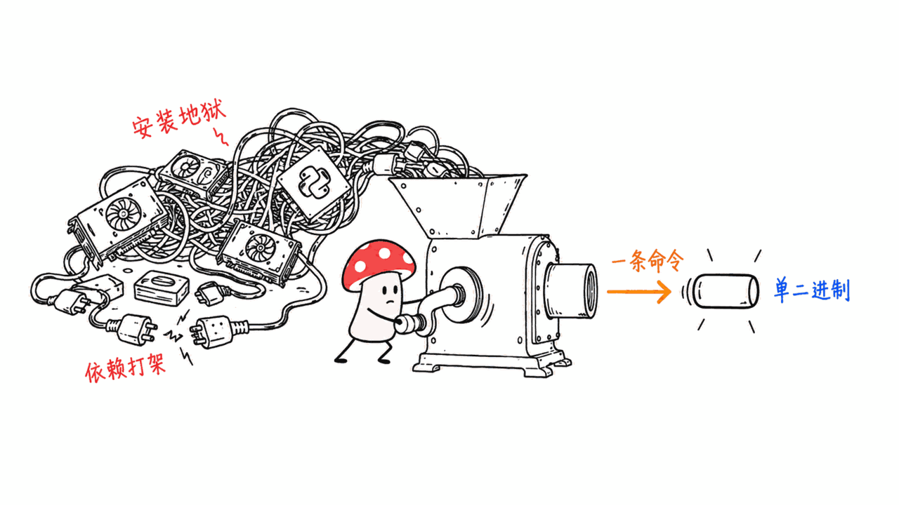
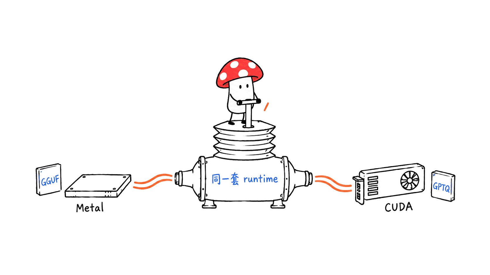
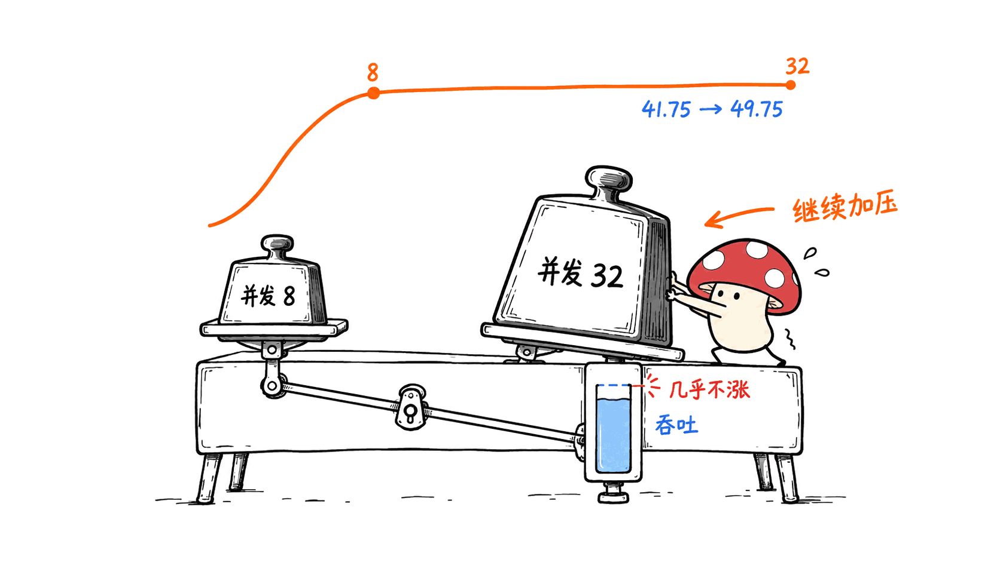
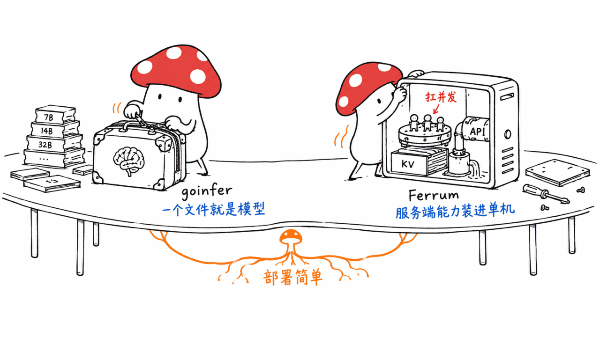

本地推理引擎最烦人的地方，往往不是推理本身，而是**装它**。

一个 Python 环境、一套 CUDA 工具链、几个版本互相打架的依赖，还没跑起第一个 token，一晚上过去了。

sizzlecar/ferrum-infer-rs（下称 Ferrum）给出的答案很直接：**一个 Rust 二进制，没有 Python 运行时，Apple Silicon 的 Metal 和 NVIDIA 的 CUDA 走同一套 runtime。**

GitHub：https://github.com/sizzlecar/ferrum-infer-rs
协议：MIT｜语言：Rust｜Stars：14｜最近提交：2026-09-09

这是一个只有 14 颗星的冷门项目，但它的 README 是我最近看到的最诚实的一份——性能表里每个数字都带着置信区间和测试条件。



## 它到底解决了什么问题？

Ferrum 的定位可以用一句话概括：**把 vLLM 那套服务端能力，装进 Ollama 那种安装体验里。**

拆开看是三件事：

**第一，安装路径只有一条命令。**

```bash
curl -fsSL https://ferrum.pandaailabs.com/install.sh | sh
```

安装脚本会校验发布包的 checksum，把 `~/.local/bin` 加进 PATH。macOS Apple Silicon 和 Linux x86_64 都走这一条；Windows x64（NVIDIA sm89 显卡）从 0.8.9 版本起支持，走 PowerShell 的 `irm ... | iex`。

装完先别急着下权重，可以先验证：

```bash
ferrum --version
ferrum --help
ferrum doctor
```

`ferrum doctor` 这个命令值得单独说——它会解析模型别名、打印接下来该跑的 `run` 和 `serve` 命令，**但不下载权重、不启动推理引擎**。对于一个动辄要拉几个 GB 的工具来说，"先告诉我你打算干什么，再让我决定要不要下"是很体贴的设计。



**第二，同一个 runtime 覆盖两种加速后端。**

Metal 和 CUDA 通常意味着两套代码路径、两套构建产物、两份维护成本。Ferrum 把它们收在一个 runtime 里，靠 feature flag 和预编译产物区分：

```bash
# macOS Apple Silicon Metal
brew install sizzlecar/ferrum/ferrum

# Linux x86_64 CUDA sm89
brew install sizzlecar/ferrum/ferrum-cuda
```

量化格式上是分工的：**Metal 上跑 GGUF，CUDA 上跑 GPTQ / safetensors**。

**第三，服务端能力不是玩具级别的。**

Ferrum 支持连续批处理（continuous batching）、分页 KV cache、前缀缓存（prefix cache）和带类型的准入控制（typed admission control）。API 层面提供 OpenAI 兼容的 Chat Completions 和**无状态 Responses API**，含流式、工具调用、结构化输出：

- 函数工具支持 `auto` / `none` / `required` / 指定函数名四种模式
- 结构化输出支持 `json_object` 和严格的 `json_schema`
- 多轮会话、前缀缓存、会话缓存
- 并发、内存、调度器都有带类型的控制项

这已经是一个正经推理服务该有的样子，不是"能出字就行"。

## 实测数字长什么样？

这部分是 Ferrum 最值得夸的地方。它的性能表不是"比 X 快 N 倍"这种没法验证的说法，而是**均值 ± 95% 置信区间的半宽，外加测试条件**。

前三行的测试条件：Metal 上 64 token 输入 / 128 token 输出，CUDA 上 256 / 128，三次重复取均值。`c` 是服务端活跃并发数。

| 模型 | M1 Max 32 GB Metal | RTX 4090 CUDA |
|---|---:|---:|
| Qwen3.5 4B | c=16 · 61.9 ± 0.1 tok/s | c=32 · 241.3 ± 0.6 tok/s |
| Qwen3.5 35B-A3B | c=4 · 26.1 ± 0.2 tok/s | c=16 · 174.1 ± 1.0 tok/s |
| Qwen3 30B-A3B | c=16 · 39.6 ± 1.2 tok/s | c=32 · 214.9 ± 2.7 tok/s |



这三行**跑了 100 请求 × 3 次重复，零错误**。

更大的模型也有数据。L40S 48GB 上的 Qwen3.8 27B 官方 block-FP8：ready 用时 80.91 秒，c=1 时 15.23 ± 0.19 tok/s，c=8 时 41.75 ± 1.26，c=32 时 49.75 ± 0.95。RTX 4090 上的 GPT-OSS 20B 官方 MXFP4：ready 23.65 秒，c=1 时 61.49 ± 4.19，c=32 时 77.23 ± 4.37。

注意 c=1 到 c=32 的曲线形状——**并发从 8 涨到 32，吞吐几乎不再增长**（41.75 → 49.75，77.16 → 77.23）。这条曲线比任何宣传语都有用：它告诉你在什么并发点上继续加压是白费力气。

## 一个人的机器上该怎么跑？

Apple Silicon 首次运行大约下载 **2.55 GiB**：

```bash
ferrum doctor qwen3.5:4b-q4_k_m
ferrum run qwen3.5:4b-q4_k_m --disable-thinking
```

Linux NVIDIA CUDA 首次运行大约 **8.7 GiB**：

```bash
ferrum doctor qwen3.5:4b
ferrum run qwen3.5:4b --disable-thinking
```

起服务，暴露成 OpenAI 兼容端点：

```bash
# macOS Metal
ferrum serve --model qwen3.5:4b-q4_k_m --served-model-name ferrum --disable-thinking --port 8000

curl http://localhost:8000/v1/chat/completions \
  -H "Content-Type: application/json" \
  -d '{"model":"ferrum","messages":[{"role":"user","content":"Reply with a short hello from Ferrum."}],"max_tokens":32}'
```

显存紧张的情况 README 也给了明确配方。6GB 的 RTX 4050 建议用 2B 模型 + 2048 上下文 + 单条活跃序列：

```powershell
ferrum run Qwen/Qwen3.5-2B --backend cuda --max-model-len 2048 --max-num-seqs 1 --max-tokens 512
```

`--disable-thinking` 是让首次响应短而直接；去掉它就保留模型模板默认的推理行为，单次请求还能用 `chat_template_kwargs.enable_thinking`、Chat 的 `reasoning_effort` 或 Responses 的 `reasoning.effort` 覆盖服务端默认值。

有一个设计细节值得注意：**Ferrum 不会静默地替你选模型。** `run` 必须给 MODEL，`serve` 必须给 `--model` 或者在 `ferrum.toml` 里显式写 `default_model`。这个"拒绝猜"的态度，和 `doctor` 命令是同一种性格。

## 和本站前面写过的 goinfer 是什么关系？

今天早些时候本站刚发过一篇 goinfer——纯 Go、无 cgo 的单二进制推理引擎。两个项目放在一起看，恰好构成一组对照。

**相同的部分**：都是"单二进制 + 无 Python"路线，都在解决同一个痛点（安装地狱），都提供 OpenAI 兼容接口。

**不同的部分**：

| 维度 | goinfer | Ferrum |
|---|---|---|
| 语言 | 纯 Go，无 cgo | Rust |
| 加速后端 | 靠 Go 自己实现，不依赖 llama.cpp | Metal / CUDA 双后端，走 native ops |
| 模型覆盖 | 27 个模型家族，四种序列混合架构 | 语言模型推理，Qwen3.5 4B / 35B-A3B、Qwen3 30B-A3B、Llama 3.1 8B 等 |
| 特色能力 | 把权重烤进可执行文件（一个文件就是一个模型） | 连续批处理、分页 KV cache、前缀缓存、准入控制 |
| 定位 | 极致的部署简单性 | 服务端能力向下兼容单机 |



一句话区分：**goinfer 更像"一个文件解决所有问题"，Ferrum 更像"vLLM 的服务端能力装进单机可及的壳里"。**

如果你的需求是把模型塞进一个可分发的文件，goinfer 更对路；如果你要在自己的机器上起一个能扛并发、有缓存策略的本地 API 服务，Ferrum 的架构更贴。

## 值得注意的边界

诚实地说清它不做什么，比列它做什么更有用：

- **只做语言模型推理。** README 明说 "Ferrum covers language-model inference only"，没有视觉、没有音频。
- **模型覆盖面不宽。** 明确列出的是 Qwen3.5 4B、Qwen3.5 35B-A3B、Qwen3 30B-A3B、Llama 3.1 8B dense。跟 goinfer 的 27 个家族不是一个量级。
- **Linux CUDA 的预编译产物只针对 sm89。** 源码编译 CUDA 还需要 Ferrum 配套的 native operator 集合，所以官方支持路径是"用预编译 tarball 或 Homebrew formula"，不是自己 build。
- **CLI 工具，没有 GUI，也不装成后台服务。** Windows 安装包里带了 CUDA 和 VC 运行时，但不装显卡驱动、不含模型。
- **14 颗星，1 个 fork。** 这是一个非常早期的项目。项目本身在 2025-08 创建，2026-09-09 还在提交，活跃度是有的，但生态几乎为零。

最后一条既是风险也是机会。按本站一贯的判断标准：**一个 14 星、MIT 协议、装起来一条命令、性能数字带置信区间的项目，比一个被搬运十轮的热门更值得花一个晚上验证。**

## 我准备怎么用它

我的实际打算是拿 M1 Max 那一行做基线复现：跑 `qwen3.5:4b-q4_k_m`，用同样的 64/128 输入输出配置和 c=16 并发，看能不能落在 61.9 ± 0.1 这个区间里。

如果能复现，那这份 README 的可信度就立住了，后面的大模型数字也可以直接拿来做选型参考；如果差得远，那差在哪（散热？后台负载？量化版本？）本身就是一篇可写的东西。

这也是本站看待所有"本地能跑"类项目的一贯方法：**先复现它自己给的那个数，再谈别的。**

---

> © 2026 Author: Mycelium Protocol. 本文采用 [CC BY 4.0](https://creativecommons.org/licenses/by/4.0/deed.zh) 授权——欢迎转载和引用，须注明作者姓名及原文链接，不得去除署名后以原创发布。

<!--EN-->

The most annoying part of a local inference engine is usually not the inference. It is **installing it**.

A Python environment, a CUDA toolchain, a handful of dependencies fighting over versions — and an evening is gone before the first token appears.

sizzlecar/ferrum-infer-rs (Ferrum from here on) answers this bluntly: **one Rust binary, no Python runtime, with Apple Silicon Metal and NVIDIA CUDA served by the same runtime.**

GitHub: https://github.com/sizzlecar/ferrum-infer-rs
License: MIT | Language: Rust | Stars: 14 | Last push: 2026-09-09

It is an obscure project with 14 stars, but its README is the most honest one I have read in a while — every number in the performance table carries a confidence interval and its test conditions.


## What problem does it actually solve?

Ferrum's positioning fits in one sentence: **put vLLM-grade serving capability inside an Ollama-grade install experience.**

Three things, unpacked:

**First, installation is one command.**

```bash
curl -fsSL https://ferrum.pandaailabs.com/install.sh | sh
```

The installer verifies release checksums and adds `~/.local/bin` to PATH. macOS Apple Silicon and Linux x86_64 both take this path; Windows x64 with an NVIDIA sm89 GPU is supported from 0.8.9 onward via PowerShell's `irm ... | iex`.

Once installed, verify before pulling weights:

```bash
ferrum --version
ferrum --help
ferrum doctor
```

`ferrum doctor` deserves a callout — it resolves the model alias and prints the `run` and `serve` commands you should use next, **without downloading weights or starting an inference engine**. For a tool that routinely pulls multiple gigabytes, "tell me what you intend to do before I decide whether to download" is a considerate design.


**Second, one runtime covers both acceleration backends.**

Metal and CUDA usually mean two code paths, two build artifacts, two maintenance burdens. Ferrum keeps them in one runtime, separated by feature flags and prebuilt artifacts:

```bash
# macOS Apple Silicon Metal
brew install sizzlecar/ferrum/ferrum

# Linux x86_64 CUDA sm89
brew install sizzlecar/ferrum/ferrum-cuda
```

Quantization formats are split by backend: **GGUF on Metal, GPTQ / safetensors on CUDA**.

**Third, the serving capability is not toy-grade.**

Ferrum supports continuous batching, a paged KV cache, prefix caching, and typed admission control. The API layer offers OpenAI-compatible Chat Completions and a **stateless Responses API**, with streaming, tool calls and structured output:

- Function tools in `auto` / `none` / `required` / named-function modes
- Structured output via `json_object` and strict `json_schema`
- Multi-turn sessions, prefix cache, session cache
- Typed controls for concurrency, memory and the scheduler

That is what a serious inference service looks like, not "it emits text, good enough."

## What do the measured numbers look like?

This is where Ferrum most deserves credit. Its performance table is not an unverifiable "N times faster than X" — it publishes **means with the 95% confidence-interval half-width, plus the test conditions**.

Conditions for the first three rows: 64-token input / 128-token output on Metal, 256 / 128 on CUDA, mean over three repeats. `c` is active server concurrency.

| Model | M1 Max 32 GB Metal | RTX 4090 CUDA |
|---|---:|---:|
| Qwen3.5 4B | c=16 · 61.9 ± 0.1 tok/s | c=32 · 241.3 ± 0.6 tok/s |
| Qwen3.5 35B-A3B | c=4 · 26.1 ± 0.2 tok/s | c=16 · 174.1 ± 1.0 tok/s |
| Qwen3 30B-A3B | c=16 · 39.6 ± 1.2 tok/s | c=32 · 214.9 ± 2.7 tok/s |


Those three rows completed **100 requests × 3 repeats with zero errors**.

Larger models have data too. Qwen3.8 27B official block-FP8 on an L40S 48GB: 80.91 s to ready, 15.23 ± 0.19 tok/s at c=1, 41.75 ± 1.26 at c=8, 49.75 ± 0.95 at c=32. GPT-OSS 20B official MXFP4 on an RTX 4090: 23.65 s to ready, 61.49 ± 4.19 at c=1, 77.23 ± 4.37 at c=32.

Look at the shape of the curve from c=1 to c=32 — **throughput barely grows past concurrency 8** (41.75 → 49.75, 77.16 → 77.23). That curve is more useful than any marketing line: it tells you the point beyond which adding load is wasted effort.

## How do you run it on one person's machine?

Apple Silicon downloads roughly **2.55 GiB** on first run:

```bash
ferrum doctor qwen3.5:4b-q4_k_m
ferrum run qwen3.5:4b-q4_k_m --disable-thinking
```

Linux NVIDIA CUDA downloads roughly **8.7 GiB**:

```bash
ferrum doctor qwen3.5:4b
ferrum run qwen3.5:4b --disable-thinking
```

Serve it as an OpenAI-compatible endpoint:

```bash
# macOS Metal
ferrum serve --model qwen3.5:4b-q4_k_m --served-model-name ferrum --disable-thinking --port 8000

curl http://localhost:8000/v1/chat/completions \
  -H "Content-Type: application/json" \
  -d '{"model":"ferrum","messages":[{"role":"user","content":"Reply with a short hello from Ferrum."}],"max_tokens":32}'
```

The README also gives an explicit recipe for tight VRAM. On a 6GB RTX 4050 it recommends a 2B model with a 2048-token context and a single active sequence:

```powershell
ferrum run Qwen/Qwen3.5-2B --backend cuda --max-model-len 2048 --max-num-seqs 1 --max-tokens 512
```

`--disable-thinking` keeps the first response short and direct; drop it to preserve the model template's default reasoning behavior, and a single request can still override the server default via `chat_template_kwargs.enable_thinking`, Chat's `reasoning_effort`, or Responses' `reasoning.effort`.

One design detail worth noting: **Ferrum never silently picks a model for you.** `run` requires MODEL; `serve` requires either `--model` or an intentional `default_model` in `ferrum.toml`. That refusal to guess is the same personality as the `doctor` command.

## How does it relate to goinfer, which this site covered earlier?

Earlier today this site covered goinfer — a pure-Go, cgo-free single-binary inference engine. Read together, the two projects form a neat contrast.

**What they share**: both take the "single binary, no Python" route, both attack the same pain (installation hell), both expose OpenAI-compatible APIs.

**Where they differ**:

| Dimension | goinfer | Ferrum |
|---|---|---|
| Language | Pure Go, no cgo | Rust |
| Acceleration | Implemented in Go, no llama.cpp dependency | Metal / CUDA dual backend via native ops |
| Model coverage | 27 model families, all four sequence-mixing architectures | Language-model inference: Qwen3.5 4B / 35B-A3B, Qwen3 30B-A3B, Llama 3.1 8B, etc. |
| Signature feature | Bakes weights into the executable (one file is the whole model) | Continuous batching, paged KV cache, prefix cache, admission control |
| Positioning | Maximum deployment simplicity | Server-grade capability scaled down to one machine |


In one line: **goinfer is "one file solves everything"; Ferrum is "vLLM's serving capability inside a shell an individual can actually run."**

If your need is to ship a model as one distributable file, goinfer fits better. If you want a local API service on your own machine that handles concurrency and has a caching strategy, Ferrum's architecture is closer.

## Boundaries worth noting

Being honest about what it does not do is more useful than listing what it does:

- **Language-model inference only.** The README states plainly that "Ferrum covers language-model inference only" — no vision, no audio.
- **Model coverage is narrow.** Explicitly listed: Qwen3.5 4B, Qwen3.5 35B-A3B, Qwen3 30B-A3B, Llama 3.1 8B dense. Not in the same league as goinfer's 27 families.
- **The prebuilt Linux CUDA asset targets sm89 only.** Building CUDA from source also requires Ferrum's matching native-operator set, so the supported path is the prebuilt tarball or the Homebrew formula, not your own build.
- **A CLI application — no GUI, no background service.** The Windows package bundles CUDA and VC runtimes but installs no GPU driver and contains no models.
- **14 stars, 1 fork.** This is a very early project. Created 2025-08, still committing on 2026-09-09, so activity is real — but the ecosystem is essentially zero.

That last point is both the risk and the opportunity. By this site's standing criterion: **a 14-star, MIT-licensed project that installs in one command and publishes throughput with confidence intervals is worth an evening of verification more than a hyped repo that has been reposted ten times over.**

## How I plan to use it

My concrete plan is to reproduce the M1 Max row as a baseline: run `qwen3.5:4b-q4_k_m` with the same 64/128 input/output shape at c=16, and see whether it lands inside 61.9 ± 0.1.

If it reproduces, this README earns its credibility and the larger-model numbers become usable for selection decisions. If it is far off, then *where* the gap comes from (thermals? background load? quantization variant?) is itself worth writing up.

This is the same method this site applies to every "runs locally" project: **reproduce the number it gave you first, then talk about everything else.**

---

> © 2026 Author: Mycelium Protocol. Licensed under [CC BY 4.0](https://creativecommons.org/licenses/by/4.0/) — free to share and adapt with attribution. You must credit the author and link to the original; removing attribution and republishing as original is not permitted.
