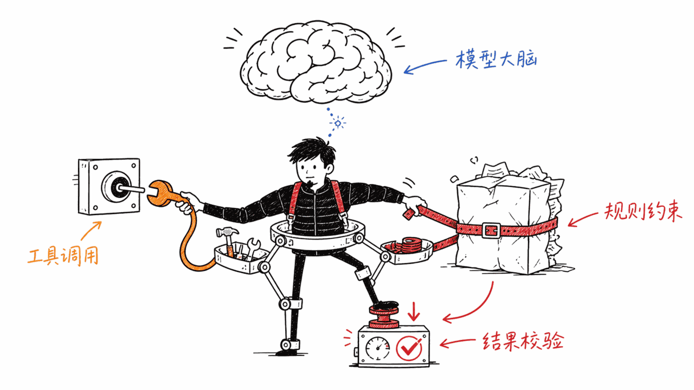
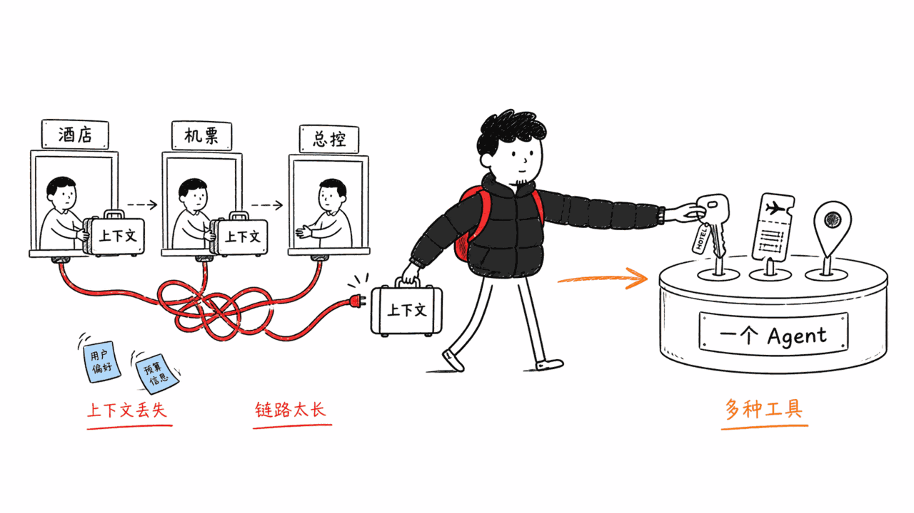
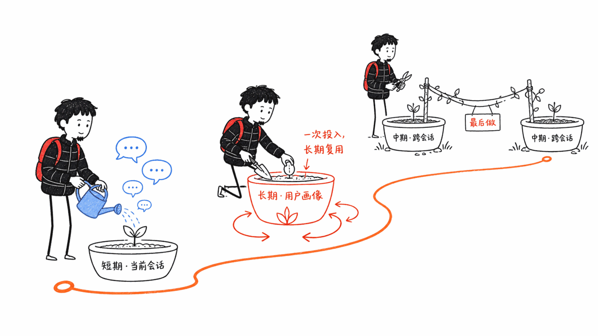
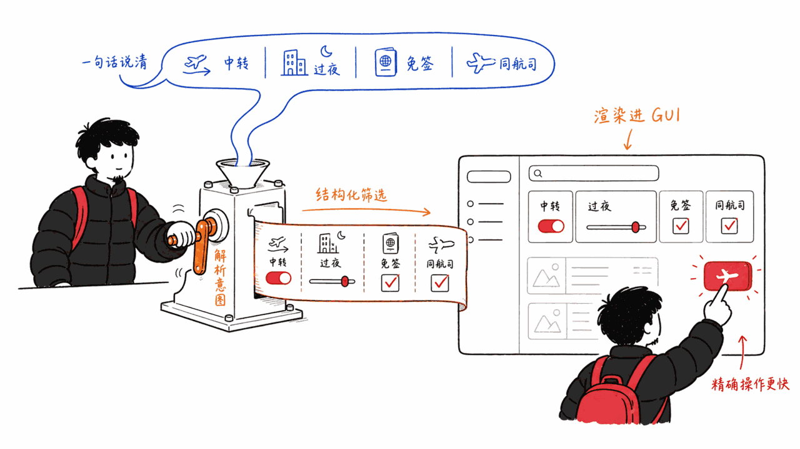

*by Mycelium Protocol*

---

原文：小红书博主"小盖"《做AI PM的朋友，可以看看这个产品的反思。》
原文链接：https://www.xiaohongshu.com/explore/6a82eb89000000003301a7dc
作者：小盖（小红书，2026-08-17 发布，北京）

**一句话概述**：作者跟飞猪团队交流后，复盘了飞猪从"问一问"（2025年4月，Multi-Agent 架构）升级到"飞猪帮帮"（2026年8月10日发布）这条 AI 化路径背后的产品思考，提出一个核心判断——**几乎所有成规模的 Agent 产品，架构最终都会收敛到"模型 + Harness + 记忆"这套结构**，并分享了飞猪在自研模型、Multi-Agent 精简、三层记忆分工、LUI 与 GUI 融合这几个具体问题上的取舍。

---

## 一、先核实：这篇笔记说的是真事

在展开分析之前，先做了一轮独立核查，确认笔记里的产品事实站得住：

- **飞猪帮帮确实在 2026 年 8 月 10 日发布**，把 AI 服务从"聊天问答"延伸到"预订+履约"环节——能处理退改签、值机选座、酒店升房、开具发票、预订接送机、填写入境卡等实际操作，嵌入在 App 首页、搜索栏、订单页等多个入口，而不是做成一个独立聊天框。
- **"问一问"确实是飞猪的上一代产品**，2025 年 4 月 17 日发布，官方描述用的就是"多 Agent 协同 + 自主决策"——这条信息独立印证了小盖笔记里"他们之前的思路更偏 Multi-Agent，现在结构精简了很多"这句话，不是自己的主观回忆。
- **"Agent = 模型 + Harness"确实是行业里已经成型的架构共识**，不是飞猪或者小盖发明的新词。这套框架在 Claude Code、Codex、Cursor 这类 Coding Agent 的架构分析里反复出现：模型负责理解和推理，Harness 负责工具注册、上下文管理、执行沙箱、结果校验、安全审批、多 Agent 编排这些"脏活累活"。飞猪把这套本来用来描述编程 Agent 的框架，原样套到旅行场景上——机票查询、酒店库存、开票系统换成了工具，其余结构完全一致。这个类比本身就是这篇笔记最有价值的洞察。

核实完事实，笔记里剩下的判断——为什么自研模型、为什么精简 Multi-Agent、记忆怎么分层、LUI 该不该取代 GUI——就是这篇读后感真正要展开的部分。

## 二、精读：小盖的四个核心判断

### 判断一：通用模型 API 接不住业务，逼出自研

小盖提到一个自己"完全没想到"的细节：飞猪没有停留在调用通用模型 API 上，而是**在开源模型基础上自己做了后训练**，搭了自有的训练环境和数据管线。原因有两条：

1. 通用模型不理解具体业务逻辑，只能靠堆规则去约束，规则堆多了推理效果会明显打折。
2. 数据安全没法保证——没人愿意把业务数据交给第三方通用模型，这对用户也是不负责任的。

更关键的一句是："训练环境必须是在线的、实时的"——因为旅行场景里价格和库存分钟级变化，同一个问题隔一分钟问答案可能就不一样，这跟静态语料训练完全是两回事。

还有一条容易被忽略但很重要的判断：**这类模型不追求智能上限，甚至不需要多轮推理**，因为用户等不起 50 秒的思考时间去买一张机票——这跟移动互联网时代"每慢一秒流失一批用户"是同一个逻辑，只是换了个载体。

### 判断二：模型是大脑，但真正的苦活都在 Harness

"模型是大脑，但光有大脑根本不够"——这句话把整篇笔记的架构判断浓缩到了一句话里。机票价格和库存不能靠模型记忆生成，必须调用真实系统，展示给用户前还要再校验一次，确保价格库存仍然有效。**数据校验、异常处理、兜底逻辑，全靠 Harness 来扛**，模型只负责理解和推理这一段。



小盖给出的推论是：哪怕是规模不大的垂类 Agent，模型层可以直接调用通用 API 凑合跑起来，**但 Harness 和记忆这两层，一定得自己做**。这条判断值得单独拎出来——它意味着"我要不要自己训练模型"是一个可以往后拖的决策，但"我有没有一个像样的 Harness"不是。

### 判断三：Multi-Agent 不是起点，是代价高昂的阶段性选择

这是笔记里最有反思价值的一段。飞猪早期（"问一问"）的思路是把功能拆得很细——酒店一个 Agent、机票一个 Agent，上层一个总 Agent 负责编排调度。**问题是 Agent 一多，上下文就得在不同 Agent 之间不停传递，容易信息丢失，调用链路变长，出了问题很难排查。**

现在（"飞猪帮帮"）结构精简了很多：随着模型能力进化，在 Harness 做好的前提下，**一个 Agent 可以同时负责几件事**——面对机票、酒店、门票这些库存性质和规则完全不同的品类，一个 Agent 灵活调用不同工具就能包办，不需要每个品类单独起一个 Agent。

这条判断和上一代产品的实际公开信息（问一问明确采用"多Agent协同"）能对上，可信度高。



### 判断四：三层记忆分工，LUI 驱动 GUI 而不是取代它

**记忆分三层**：长期记忆（用户画像和长期偏好）、中期记忆（跨会话续接，比如几天前聊过一次去日本的行程，下次接着聊 AI 还记得）、短期记忆（当前会话信息）。这套设计和 ChatGPT 的记忆逻辑类似。

**交互层的判断更有意思**：几年前流行的判断是"大模型出来后，LUI（自然语言交互）会慢慢取代 GUI"，小盖现在认为这个判断"过于乐观"。理由很扎实——成熟产品用户惯性巨大，而且 LUI 在很多场景其实低效。**需求已经明确、追求精确的时候，GUI 更好用**（打车就是典型例子：两个字+一次点击就能搞定的事，改成对话反而更慢）。**但碰到模糊需求、条件很多的时候，LUI 优势一下子就出来了**（"从迪拜中转、最好过夜航班、不需要过境签、两段尽量同一航司"——这种多条件筛选，GUI 里点半天，一句话就说清楚）。



飞猪帮帮的解法是**用 LUI 驱动 GUI**——自然语言解析用户意图，再去驱动界面完成筛选和搜索，而不是把 GUI 整个推翻重做。小盖的结论：GUI 目前仍然是主体，LUI 是给用户新增的一种表达方式，"直接一把梭哈纯 LUI，实在是为了 AI 而 AI"。



## 三、我的看法：认同的部分，和值得补一刀的部分

**认同**：这四个判断放在一起，其实讲的是同一件事——**AI 化不是把旧产品换一套交互皮肤，是把"模型能力"重新分配进一套工程架构里**，每一层该干什么、不该干什么，要分得清楚。这个态度本身，比任何一条具体判断都重要。

**想补充的地方**：

**第一，"自研模型"这条经验的适用范围被低估了。** 小盖用的语气是"这一点我完全没想到"——听起来像是一个通用建议。但自建训练环境+在线实时后训练管线，是飞猪这个体量的公司才有的选项：需要足够大的业务数据存量、专职算法团队、持续的算力投入。**对个人开发者和小团队，这条路基本走不通**，也不该走——第五节的落地建议里会给一条更现实的替代路径。

**第二，"Multi-Agent 精简为单 Agent"这条经验不是普适真理，是有前提的。** 小盖自己也说了前提——"随着模型能力进化，在做好 Harness 的前提下"。换句话说，这个结论成立的条件是模型足够强、Harness 足够扎实。如果这两个条件不满足，直接照搬"应该用单 Agent"会踩坑——本站前几天调研的 Hermes Agent、Maka 都保留了"派生隔离子 Agent 跑并行工作流"的能力，说明多 Agent 分解在**真正独立、可并行、互不依赖上下文**的任务上依然有价值。**该精简的是"不必要的拆分"，不是"多 Agent 这个模式本身"。**

**第三，"LUI 驱动 GUI"这个具体技术模式，值得单独起名字，不该被"融合"这个词糊过去。** 拆开看，它其实是一个很具体的工程模式：**自然语言解析用户意图 → 编译成结构化的筛选/查询状态 → 渲染成 GUI 呈现**。这跟"聊天框套壳在原来的 App 里"完全是两回事——后者只是加了个入口，前者是把 LUI 当成 GUI 状态的一个新的输入通道。这个区分对做产品设计的人来说很重要，值得抠字眼抠清楚。

## 四、一套可落地的 AI 应用架构建议

结合小盖的复盘、"Agent = Model + Harness"的行业框架，以及本站最近调研的几个开源 Agent 项目（Hermes Agent、Nerve、Dense-Mem、Maka、Agent Skills），给一套分阶段的架构和落地流程建议。

### 4.1 三层架构，谁先做、谁后做

```
┌─────────────────────────────────────┐
│  记忆层 Memory                        │  ← 最后做深，但从第一天就要留接口
│  短期(当前会话) → 长期(用户画像) → 中期(跨会话) │
├─────────────────────────────────────┤
│  Harness 层                          │  ← 优先级最高，没有捷径
│  工具注册 → 执行校验 → 异常兜底 → 编排调度      │
├─────────────────────────────────────┤
│  模型层 Model                         │  ← 能不自研就不自研，先用通用 API 验证
│  通用 API → (业务理解遇到天花板才)自有后训练      │
└─────────────────────────────────────┘
```

**模型层**：不要一上来就想着自研。先用通用模型 API 把工具调用链路和产品体验跑通，验证清楚"AI 化"这件事本身值不值得做。只有当通用模型在业务理解上遇到真正的天花板——规则堆到没法维护、或者数据安全成为硬约束——才启动自有模型这条路。这条路投入巨大，是"确认需要"之后才走的第二步，不是起点。

**Harness 层**：这层没有捷径，是产品真正的护城河。按优先级拆解，别想着一次做全：
1. 工具注册 + 执行引擎——先让 Agent 能可靠地调真实系统
2. 结果校验——展示给用户前必须核实一遍关键信息（价格、库存、状态）仍然有效，这条是飞猪帮帮案例里最容易被忽视但最要命的一环
3. 异常兜底——工具调用失败、数据不一致、超时，这些真实世界的脏活必须有明确的降级路径
4. 编排调度——只有当单 Agent 确实扛不住任务复杂度时才引入，不要默认起手

**记忆层**：三层记忆不用同时开工，建议顺序是**短期 → 长期 → 中期**。短期记忆（当前会话内的工具结果、用户此轮说过的话）是刚需，没有它 Agent 都不算能用。长期记忆（用户画像、偏好）一次投入、长期复用，性价比最高，第二优先。中期记忆（跨会话续接）工程复杂度最高——要处理会话边界判断、相关性检索、过期策略——放最后。

### 4.2 分阶段落地流程

**阶段 0 · 验证期（2-4 周）**：挑一个最窄的场景，通用模型 API + 最简 Harness（工具注册+基本校验），跑通端到端可用性。目标不是覆盖率，是验证"AI 化"这个方向本身对用户有没有价值。

**阶段 1 · 收敛期**：把"要不要拆多个 Agent"这个诱惑摁住。参照飞猪的教训，从单 Agent + 丰富工具集开始——机票查询、酒店查询、门票查询、Web Search 都挂在同一个 Agent 上，Harness 做扎实了，一个 Agent 能扛住的任务范围比想象中大得多。真正需要拆分的信号是：任务之间彼此独立、可以并行、互不依赖对方的上下文——这时候可以参考 Hermes Agent 或 Maka 的子 Agent 派生模式，为并行工作流单独起子 Agent，而不是为每个业务品类起一个 Agent。

**阶段 2 · 数据飞轮期**：当模型的业务理解瓶颈真正显现、或数据安全变成硬约束，才启动自有后训练。如果业务数据本身是易变的（价格、库存、状态随时间变化），训练和推理环境都必须是在线实时的，这条飞猪案例里的判断具有普适性。同时补齐长期和中期记忆——这时候业务数据积累得也足够多了，画像和跨会话检索才有东西可以练。

**阶段 3 · 交互融合期**：不要为了"AI 原生"把 GUI 全部推倒重做。参照"LUI 驱动 GUI"这个具体模式——自然语言解析意图，编译成结构化状态，喂给现有的 GUI 筛选/搜索逻辑。GUI 在需求已经明确的高频操作上依然是效率最优解，LUI 补的是"模糊需求、多条件"这一段体验空白，两者是互补关系，不是替代关系。

**阶段 4 · 评测与审计**：Agent 一旦进入预订、履约这类会产生真实交易后果的环节，"它说的话能不能信"就从产品体验问题变成合规问题。这里有两块本站最近调研过的能力可以直接借用：观测和 Rubric 化的评测体系（参考本站写过的美团 Agent 评测实践），以及"证据只增不删、关系要够格才能召回"的记忆治理思路（参考本站写过的 Dense-Mem）——后者对处理退改签、开票这类需要留痕审计的场景尤其有用。

### 4.3 个人/小团队的简化路径

上面这套架构的阶段 2（自研后训练）门槛很高，多数个人开发者和小团队走不到那一步，也不需要走到那一步。一条更现实的替代路径：

- **业务规则不进模型权重，进 Harness 的校验层和 Prompt 里的结构化约束**——用规则引擎+schema 校验去卡住模型的输出边界，而不是指望后训练把规则"内化"进模型。
- **数据安全靠架构隔离，不靠自研模型**——本站调研过的 Neo Chat（本地优先+加密跨设备同步）、Dense-Mem（自托管+证据留痕）都是"不训练自己的模型，但一样能保证数据不出手心"的思路，比自建训练管线现实得多。
- **技能扩展走开放标准，不重复造轮子**——用 Agent Skills 这类已经被 Hermes Agent、Nerve 等项目验证过的开放格式组织工具和流程，而不是自己发明一套技能系统。

**一句话总结**：飞猪帮帮这套架构值得学的不是"你也应该自研模型"，而是**"模型、Harness、记忆三层职责要分清楚，先把 Harness 做扎实，多 Agent 是要挣得的复杂度，不是默认起点"**——这条判断，无论团队大小都成立。

---

> © 2026 Author: Mycelium Protocol. 本文采用 [CC BY 4.0](https://creativecommons.org/licenses/by/4.0/deed.zh) 授权——欢迎转载和引用，须注明作者姓名及原文链接，不得去除署名后以原创发布。

<!--EN-->

## Reading Notes

Original post: Xiaohongshu blogger 小盖 (Xiaogai), "做AI PM的朋友，可以看看这个产品的反思" ("AI PMs, take a look at this product reflection")
Original link: https://www.xiaohongshu.com/explore/6a82eb89000000003301a7dc
Author: 小盖 (Xiaohongshu, posted 2026-08-17, Beijing)

**TL;DR**: After talking with the Fliggy (飞猪) team, the author reflects on the product thinking behind Fliggy's AI evolution from "问一问" (Ask, April 2025, a Multi-Agent architecture) to "飞猪帮帮" (Bangbang, launched August 10, 2026). His core claim: **nearly every agent product that reaches real scale converges on the same "Model + Harness + Memory" architecture** — and he shares concrete tradeoffs Fliggy made on self-fine-tuning models, simplifying Multi-Agent into a single agent, a three-tier memory split, and using natural language to drive the GUI rather than replace it.

---

## I. Fact-check first: the underlying product claims hold up

Before analyzing, I ran an independent check to confirm the note's product facts:

- **Fliggy Bangbang did launch on August 10, 2026**, extending AI service from "chat Q&A" into the booking-and-fulfillment stage — handling flight rebooking/cancellation, seat selection, hotel upgrades, invoicing, airport transfer booking, and entry-card filling, embedded across the app's homepage, search bar, and order pages rather than living in a standalone chat box.
- **"问一问" was indeed Fliggy's previous-generation product**, launched April 17, 2025, officially described using "multi-agent collaboration and autonomous decision-making" — this independently corroborates the note's claim that "their earlier thinking leaned more Multi-Agent, and the structure has been simplified a lot since." It's not just the author's recollection.
- **"Agent = Model + Harness" is an established architectural consensus in the industry**, not a term invented by Fliggy or the author. This framing shows up repeatedly in architecture breakdowns of coding agents like Claude Code, Codex, and Cursor: the model handles understanding and reasoning; the Harness handles tool registration, context management, execution sandboxing, result verification, safety approval, and multi-agent orchestration — the grunt work. Fliggy applied this exact framework, originally used to describe coding agents, unchanged to a travel scenario — flight queries, hotel inventory, and invoicing systems stand in for tools, but the structure is identical. That analogy itself is the most valuable insight in the note.

With the facts checked, what's left to unpack are the author's actual judgments — why self-fine-tune, why simplify Multi-Agent, how to split memory, whether LUI should replace GUI.

## II. Close reading: 小盖's four core judgments

### Judgment one: generic model APIs can't hold up business logic, forcing self-training

The author flags a detail he says he "never expected": Fliggy didn't stop at calling a generic model API — they **self-fine-tuned on top of open-source models**, building their own training environment and data pipeline. Two reasons:

1. Generic models don't understand business logic and can only be constrained by piling on rules, which visibly degrades reasoning quality as rules accumulate.
2. Data security can't be guaranteed — no one wants to hand business data to a third-party generic model, and that's irresponsible to users too.

A more critical line: "the training environment has to be online and real-time" — because travel prices and inventory change minute by minute, so asking the same question a minute apart can yield a different correct answer, which is a completely different problem from training on static corpora.

Another easily overlooked but important point: **these models don't need to chase peak intelligence, and don't even need many rounds of reasoning**, because users won't tolerate a 50-second wait to buy a flight ticket — the same logic as "every extra second of latency loses a batch of users" from the mobile-internet era, just applied to a new medium.

### Judgment two: the model is the brain, but the real grunt work lives in the Harness

"The model is the brain, but the brain alone is nowhere near enough" — this line compresses the whole note's architectural claim into one sentence. Flight prices and inventory can't be generated from the model's memory; the agent must call real systems, and verify again right before showing results to the user that price and inventory are still valid. **Data validation, exception handling, and fallback logic all rest on the Harness**; the model only handles understanding and reasoning.


The author's corollary: even a small-scale vertical agent can get away with calling a generic model API directly, **but the Harness and Memory layers must be self-built.** Worth pulling out on its own — it means "should I train my own model" is a decision you can defer, but "do I have a real Harness" is not.

### Judgment three: Multi-Agent isn't a starting point — it's an expensive phase-specific choice

The most reflective part of the note. Fliggy's earlier ("问一问") thinking split functionality very finely — a hotel agent, a flight agent, with a top-level orchestrator agent dispatching. **The problem: more agents means context has to keep getting passed between them, information gets lost easily, call chains get long, and debugging becomes very hard when something breaks.**

Now ("飞猪帮帮"), the structure is much leaner: as model capability improved, and given a solid Harness, **one agent can handle several things at once** — facing flights, hotels, and tickets, categories with completely different inventory characteristics and rules, a single agent can flexibly call different tools to cover all of it, without spinning up a dedicated agent per category.

This lines up with the previous product's actual public information (问一问 explicitly used "multi-agent collaboration"), which makes it credible rather than just anecdotal.


### Judgment four: a three-tier memory split, and LUI driving GUI rather than replacing it

**Memory splits into three tiers**: long-term (user profile and long-term preferences), mid-term (cross-session continuity — e.g., having discussed a Japan trip a few days ago, the AI still remembers next time), short-term (current conversation state). Similar in logic to ChatGPT's memory design.

**The interaction-layer judgment is the more interesting one**: the popular prediction a few years ago was "once large models arrive, LUI (natural language interaction) will gradually replace GUI." The author now considers that prediction "too optimistic." His reasoning holds up: mature products carry enormous user inertia, and LUI is genuinely inefficient in many scenarios. **When the need is already clear and precision matters, GUI wins** — calling a taxi is the textbook case: two characters typed plus one tap beats a full conversation. **But when the need is fuzzy or has many conditions, LUI's advantage shows up immediately** — "connecting through Dubai, preferably an overnight flight, no transit visa needed, both legs ideally the same airline" is painful to filter through in a GUI but trivial to state in one sentence.


Fliggy Bangbang's solution: **use LUI to drive the GUI** — parse the user's intent in natural language, then drive the interface to complete the filtering and search, rather than tearing down the GUI entirely. The author's conclusion: GUI is still the main body for now; LUI is a new expression channel added for users. "Going all-in on pure LUI is AI for AI's sake."


## III. My take: what I agree with, and where I'd add a cut

**Agree**: taken together, these four judgments are really making one point — **AI-ification isn't swapping an old product's interaction skin, it's redistributing "model capability" into an engineering architecture** where each layer's responsibilities are clearly separated. That posture matters more than any single judgment on its own.

**Where I'd add nuance:**

**First, the "self-fine-tune" lesson's applicability is understated.** The author's tone — "I never expected this" — reads like general advice. But building a self-owned training environment and an online real-time post-training pipeline is an option that exists only at Fliggy's scale: it requires a large enough store of business data, a dedicated algorithms team, and sustained compute investment. **For individual developers and small teams, this path is basically not viable** — and shouldn't be attempted. Section IV.3 below gives a more realistic alternative.

**Second, "simplifying Multi-Agent into a single agent" isn't a universal truth — it has preconditions.** The author states the precondition himself: "as model capability improves, given a solid Harness." In other words, the conclusion holds only when both the model is strong enough and the Harness is solid enough. Copy the "you should use one agent" takeaway without those conditions met, and you'll hit trouble — Hermes Agent and Maka, both covered on this blog recently, retain the ability to "spawn isolated subagents for parallel workstreams," which shows multi-agent decomposition still has value for tasks that are **genuinely independent, parallelizable, and don't share context.** **What should be trimmed is unnecessary splitting, not the multi-agent pattern itself.**

**Third, "LUI drives GUI" is a specific, nameable engineering pattern and shouldn't be blurred by the word "fusion."** Broken down, it's a concrete pipeline: **natural language parses user intent → compiles into structured filter/query state → renders into the GUI.** That's a completely different thing from "wrap a chat box around the existing app" — the latter just adds an entry point; the former treats LUI as a new input channel into GUI state. This distinction matters to anyone doing product design, and it's worth being precise about.

## IV. A buildable AI application architecture

Combining the author's retrospective, the industry-standard "Agent = Model + Harness" framing, and several open-source agent projects covered recently on this blog (Hermes Agent, Nerve, Dense-Mem, Maka, Agent Skills), here's a phased architecture and rollout recommendation.

### 4.1 Three layers, and what to build first

```
┌─────────────────────────────────────┐
│  Memory Layer                        │  ← build deep last, but leave the interface from day one
│  Short-term (session) → Long-term (profile) → Mid-term (cross-session) │
├─────────────────────────────────────┤
│  Harness Layer                       │  ← highest priority, no shortcuts
│  Tool registry → Execution + verification → Fallback → Orchestration │
├─────────────────────────────────────┤
│  Model Layer                         │  ← avoid self-training until proven necessary
│  Generic API → (only if business understanding hits a ceiling) self-fine-tuning │
└─────────────────────────────────────┘
```

**Model layer**: don't reach for self-training first. Use a generic model API to get the tool-calling chain and product experience working end to end, and validate whether "AI-ification" is even worth doing in this scenario. Only start down the self-fine-tuning path when the generic model hits a real ceiling on business understanding — rules piling up past the point of maintainability, or data security becoming a hard constraint. This is a heavy investment, a second step you take after confirming the need, not a starting point.

**Harness layer**: no shortcuts here — this is the real moat. Break it down by priority, don't try to build it all at once:
1. Tool registry + execution engine — get the agent reliably calling real systems first
2. Result verification — re-verify key information (price, inventory, status) is still valid right before showing it to the user; this is the most overlooked but most critical step in the Fliggy case
3. Fallback logic — tool failures, data inconsistency, timeouts are real-world grunt work that needs a clear degradation path
4. Orchestration — introduce only when a single agent genuinely can't handle the task complexity; don't reach for it by default

**Memory layer**: don't build all three tiers at once — the recommended order is **short-term → long-term → mid-term**. Short-term memory (tool results and what the user just said this turn) is table stakes — without it, the agent isn't usable at all. Long-term memory (user profile, preferences) is a one-time investment with long-lived reuse — the best return, second priority. Mid-term memory (cross-session continuity) has the highest engineering complexity — handling session-boundary detection, relevance retrieval, expiry policy — save it for last.

### 4.2 Phased rollout

**Phase 0 · Validation (2-4 weeks)**: pick the narrowest possible scenario, generic model API plus a minimal Harness (tool registry plus basic verification), get end-to-end usability working. The goal isn't coverage — it's validating whether "AI-ification" itself creates value for users in this direction.

**Phase 1 · Convergence**: resist the temptation to split into multiple agents. Following Fliggy's lesson, start with a single agent plus a rich toolset — flight query, hotel query, ticket query, web search all hang off the same agent. With a solid Harness, one agent can handle a far wider task range than you'd expect. The real signal that splitting is warranted: tasks are genuinely independent, parallelizable, and don't depend on each other's context — at that point, look at Hermes Agent's or Maka's subagent-spawning pattern for parallel workstreams, spinning up a subagent per workflow rather than per business category.

**Phase 2 · Data flywheel**: only start self-fine-tuning once the model's business-understanding ceiling genuinely shows up, or data security becomes a hard constraint. If your business data is itself volatile (price, inventory, status changing over time), both the training and inference environment need to be online and real-time — this specific lesson from the Fliggy case generalizes well. This is also when to complete long-term and mid-term memory — by now enough business data has accumulated that profiles and cross-session retrieval have something real to train on.

**Phase 3 · Interaction fusion**: don't tear down the GUI just to be "AI-native." Follow the specific "LUI drives GUI" pattern — parse intent in natural language, compile it into structured state, feed it into the existing GUI's filter/search logic. GUI remains the most efficient answer for high-frequency operations where the need is already clear; LUI fills the experience gap around fuzzy, multi-condition needs. The two are complementary, not competing.

**Phase 4 · Evaluation and audit**: once an agent starts touching booking and fulfillment — steps with real transactional consequences — "can what it says be trusted" stops being a UX question and becomes a compliance one. Two capabilities covered recently on this blog apply directly here: observation-plus-rubric evaluation systems (see this blog's coverage of Meituan's agent evaluation practice), and memory governance built on "evidence only accumulates, and a relationship must qualify before it's recallable" (see this blog's coverage of Dense-Mem) — the latter is especially useful for scenarios like cancellations and invoicing that need an auditable trail.

### 4.3 A simplified path for individuals and small teams

Phase 2 above (self-fine-tuning) has a high bar that most individual developers and small teams won't reach — and don't need to. A more realistic alternative:

- **Business rules go into the Harness's validation layer and structured prompt constraints, not into model weights** — use a rules engine plus schema validation to bound the model's output, rather than hoping post-training "internalizes" the rules.
- **Data security comes from architectural isolation, not from self-training a model** — Neo Chat (local-first with encrypted cross-device sync) and Dense-Mem (self-hosted with evidence provenance), both covered on this blog, show "don't train your own model, but still guarantee data never leaves your hands" is a workable approach, far more realistic than building your own training pipeline.
- **Extend capabilities through an open standard instead of reinventing one** — use a format like Agent Skills, already validated by projects like Hermes Agent and Nerve, to organize tools and workflows, rather than inventing a proprietary skill system.

**In one line**: the lesson worth taking from Fliggy Bangbang's architecture isn't "you should self-train a model too" — it's **"keep the responsibilities of Model, Harness, and Memory clearly separated, build the Harness solid first, and treat multi-agent as complexity you earn, not a default starting point."** That judgment holds regardless of team size.

---

> © 2026 Author: Mycelium Protocol. Licensed under [CC BY 4.0](https://creativecommons.org/licenses/by/4.0/) — free to share and adapt with attribution. You must credit the author and link to the original; removing attribution and republishing as original is not permitted.
