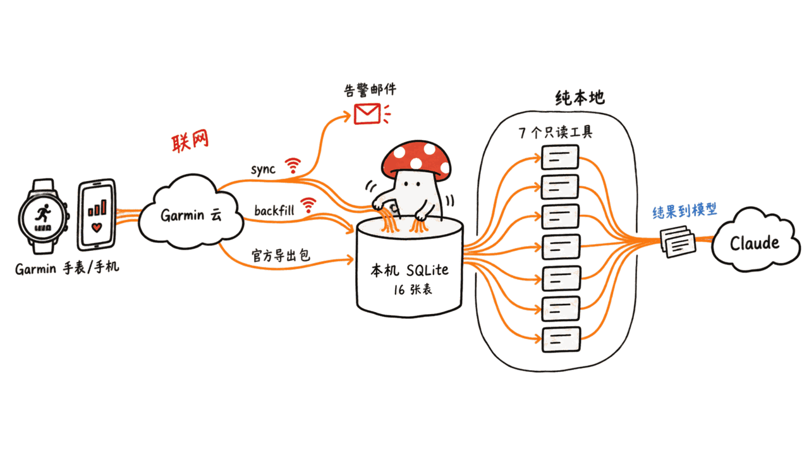
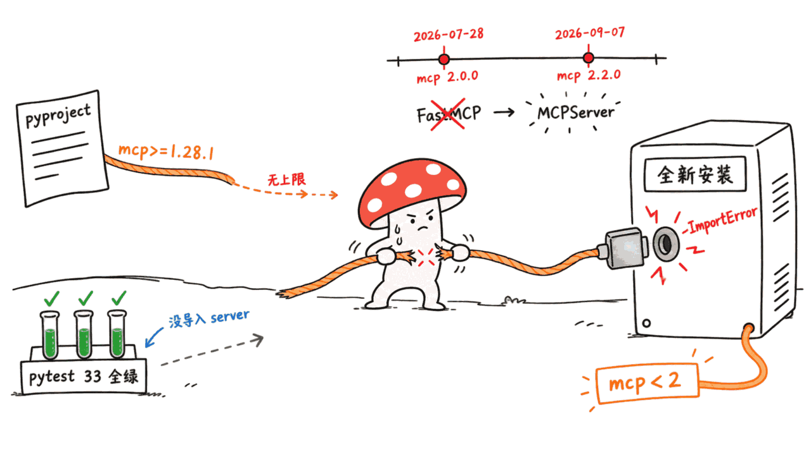
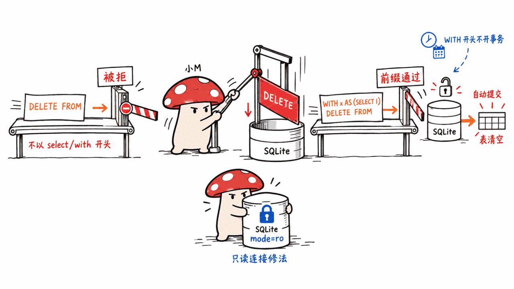
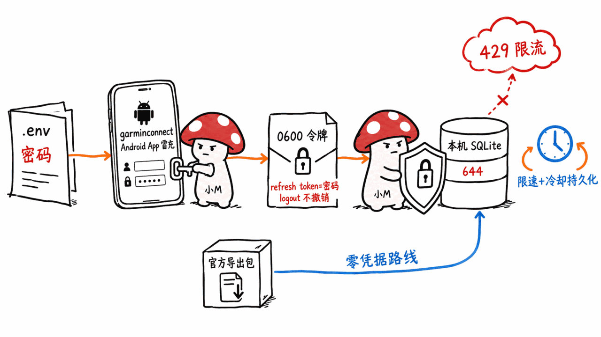

> 📌 开源仓库：the-mace/garmin-mcp-local
> GitHub：https://github.com/the-mace/garmin-mcp-local
> 协议：MIT ｜ 语言：Python ≥3.12 ｜ Stars：0 ｜ 创建：2026-07-14 ｜ 最近提交：2026-09-23（共 8 次提交，单一作者）

---

**BLUF**：garmin-mcp-local 把你的 Garmin Connect 数据（活动、睡眠、HRV、压力、身体电量、训练状态）拉一次、存进本机一个 SQLite 文件，之后 Claude 通过 MCP 查的都是这个文件，不再每次访问 Garmin。它的工程质量在 0 star 项目里少见：限速、退避、幂等、失败告警都有测试。但我们在 Mac 上实际跑了一遍，发现三件 README 没说的事：**（1）今天全新安装会解析到 mcp 2.2.0，`garmin-mcp-server` 直接 ImportError 起不来，得手动加 `mcp<2`；（2）号称只读的 `execute_sql` 只检查语句开头，`WITH x AS (SELECT 1) DELETE FROM activities` 能删数据，我们实测删成功了；（3）「数据全程在本机」只说对了服务器和数据库这一半——工具返回的睡眠、心率会作为对话内容交给你用的那个模型，Garmin 账号密码和长期令牌也都是明文放在磁盘上。** 另外，它唯一的 Garmin 依赖 garminconnect 是非官方库，靠模拟 Android App 登录；被限流（429）是真实存在的风险，永久封号我们没查到案例，但也不能保证。

这篇文章讲四件事：它到底把什么留在了本机、Garmin 凭据怎么存、依赖的非官方库有什么合规风险，以及在 Mac 上怎么部署才不踩坑。

## 它到底是什么？

一句话：**一个带同步引擎的本地缓存，外面套了 MCP 壳**。仓库含测试约 3,700 行 Python，`garmin_mcp/` 下分 `bulk_import`（解析 Garmin 官方导出包）、`sync`（实时 API 增量同步与回填）、`garmin_client`（登录与限速）、`db`（SQLite）、`mcp_server`、`monitoring`/`alerting`（失败告警）几块。

数据模型是 16 张表：

- 活动：`activities`、`activity_laps`、`activity_hr_zones`、`activity_power_zones`、`gear`、`activity_gear`
- 日常健康：`daily_health_metrics`（步数、心率、压力、身体电量、血氧、呼吸）、`daily_stress_periods`、`sleep`、`hrv_daily`、`body_composition`
- 训练指标：`training_status`（VO2max、负荷、耐力分）、`training_readiness`、`race_predictions`
- 同步状态：`sync_log`、`sync_cursor`

每张表用 Garmin 自己的 ID 或日期做唯一键，所有写入走同一个 `upsert()`，所以重复导入、重复同步不会产生重复行。

### 它暴露了哪些 MCP 工具？

`server.py` 里注册了 9 个工具，我们用 MCP 客户端实际列出并调用过：

| 工具 | 联网？ | 作用 |
|---|---|---|
| `list_activities` | 否 | 按日期、活动类型、运动大类查活动 |
| `get_activity_detail` | 否 | 单次活动的分圈、心率/功率区间、装备 |
| `get_daily_health_metrics` | 否 | 日期区间内的步数、心率、压力、身体电量等 |
| `get_sleep` | 否 | 每晚睡眠阶段与评分 |
| `get_training_trends` | 否 | 训练状态、准备度、VO2max、负荷、HRV、比赛预测 |
| `get_sync_status` | 否 | 同步日志与续跑游标 |
| `execute_sql` | 否 | 自由 SQL（声称只读） |
| `sync_now` | **是** | 增量同步 |
| `backfill_batch_now` | **是** | 往历史里回填一批 |

设计上的一个好点：查询类工具**从不自动触发同步**，联网只发生在你（或你的 agent）明确调用 `sync_now` / `backfill_batch_now`，或者 launchd 定时任务跑的时候。

## 数据是不是真的全程留在本机？

**拆开说，分四段：**

**服务器和数据库：是本机。** 我们把服务器起在 stdio 上，用 MCP 客户端调了 `get_sleep`、`get_training_trends` 等只读工具，然后用 `lsof -a -p <服务器进程> -i` 检查这个进程：没有任何网络套接字。代码里读类工具也只碰 SQLite，没有别的出网路径。

**同步：会联网，而且必须联网。** 数据的来源是 Garmin 云。`sync_now`、`backfill_batch_now` 和定时任务会带着你的凭据/令牌去访问 Garmin 的服务器。这不算「泄露」，但「本地」的准确含义是「本地缓存」，不是「从不联网」。

**告警邮件：可选出网。** 设了 `ALERT_EMAIL_TO` 后，失败时通过系统的 `mail` 命令发邮件，要求这台机器已经配好了 Postfix 转发。作者的设计是成功时不发任何东西，避免泄露「这台机器现在在线」。

**工具结果交给谁？** 这是「全本地」最容易被忽略的一段。MCP 工具返回的 JSON（你的睡眠分、静息心率、活动名称）是作为对话内容交给**你接入的那个模型**的。用 Claude Desktop 或 Claude Code，这些内容就会发到 Anthropic 的云端。项目保证的是「缓存在你机器上」，不保证「模型看不到」。想让健康数据完全不出机器，得把 MCP 客户端也换成本地模型。

## Garmin 登录凭据和令牌怎么存？

**账号密码**：写在仓库根目录的 `.env`（`GARMIN_EMAIL`、`GARMIN_PASSWORD`），明文。README 说密码「只在首次登录时需要，之后读令牌」，`.gitignore` 排除了 `.env`、`*.db`、令牌目录、`logs/` 和导出的 zip，防止误提交。但 `.env` 本身没有任何加密，也没有用 macOS 钥匙串。

**会话令牌**：由 garminconnect 库写到 `GARMIN_TOKEN_STORE`（默认仓库内 `./.garminconnect/`）下的 `garmin_tokens.json`，里面是 DI OAuth 的 access token 和 refresh token。库的 README 和代码写明：文件权限 0600、所在目录 0700、拒绝符号链接路径。库的 README 自己也提醒：refresh token「可以提供持久的账号访问」，要当密码对待，而且 `logout()` 只删本地文件，**不会**让 Garmin 侧作废令牌，泄露后得去 Garmin 账号安全设置里撤销。（这一段来自库的源码和文档；我们没有用真实 Garmin 账号登录，所以令牌文件的实际权限没有亲自验证。）

**数据库**：`data/garmin.db` 是普通 SQLite，没有加密。我们初始化出来的库文件权限是 `-rw-r--r--`（同机其他用户可读），目录 755。按默认 umask 走，你的健康数据就是这个权限。

**MFA**：账号开了两步验证时，必须在终端里手动跑一次 `garmin-mcp-sync`（或 backfill）输入验证码。MCP 服务器进程没有 TTY，代码里会明确抛错提示这一点，这是个处理得体面的细节。

## 它依赖的非官方库有什么风险？

`pyproject.toml` 只有三个依赖：`garminconnect>=0.3.6`、`mcp>=1.28.1`、`python-dotenv`。Garmin 相关的全部依赖是 cyberjunky 的 `python-garminconnect`（PyPI 版本 0.3.16，MIT，GitHub 3,044 star，2020 年创建，最近推送 2026-09-18）。

**它是怎么登录的**：我们读了已安装的库源码。它用的是 Garmin Connect **Android App 的登录流程**：请求头里写着 `GCM-Android-5.23`，令牌交换用的 client id 形如 `GARMIN_CONNECT_MOBILE_ANDROID_DI_2025Q2`，还依赖 `curl_cffi` 做浏览器/TLS 指纹伪装，并按「mobile、SSO widget、web portal」顺序逐个策略尝试。库 README 自己的措辞是「这是一个非官方客户端」。

**风险有多大？**

- 被限流：真实存在。库的 issue 里 2026 年 3 月起就有 `#332`「Garmin 是不是改了认证 API」、`#337`「登录时 429」、`#344`「用 SSO widget 绕过 429」、`#350`「仍被 Cloudflare 拦」；Garmin 开发者论坛上还有人报告「登录持续 429，账号被封 48 小时以上」（这是用户自述，我们没法核实原因）。二手报道称限流按账号计而不是按 IP，换网络没用。
- 永久封号：我们读到的 issue 和论坛帖里没有看到确认的永久封号案例，但我们的检索并不完整，不能据此保证安全。
- 服务条款：我们没有逐条核对 Garmin 的使用条款，所以不下「违规」或「合规」的结论。Garmin 有官方的 Connect Developer Program，但我们没能从其概览页确认个人用户能不能申请、收不收费。要用于工作账号或有合规要求，请先自己读条款。
- 接口会变：这是逆向接口，Garmin 改一次认证，库就得跟着追。`#369` 记录了 2026-06-01 前后令牌被拒的事件，库在 0.3.x 里改了几轮登录策略。

**项目自己做了哪些缓解**：所有 API 调用走同一个限速包装器：最小间隔默认 1.5 秒、遇到 429/403 指数退避加抖动并限制重试次数，**并且把冷却窗口写进 `sync_log`**，进程崩了之后新进程也会尊重冷却期，不会立刻再打。这是这个项目最值得抄的一点。

**回填要多久？** 引擎是「每个日期、每个类别一次调用」（`sync/engine.py`）。README 给的回填默认是 7 个健康类别。按 1.5 秒最小间隔算，一年历史至少约 64 分钟（7×365×1.5 秒，这是我们的估算，没算重试和多接口类别）。所以 README 建议先申请 Garmin 官方数据导出包，用 `garmin-mcp-import-export` 导入，再用 API 补空缺。

## 我们在 Mac 上实测了什么，跑通没有？

环境：macOS（Apple Silicon）、uv 建的 Python 3.12 虚拟环境。**没有用真实 Garmin 账号**（不想拿个人健康账号做实验），所以登录、同步、回填这条联网链路没有实测；本机部分全部实测。

| 项目 | 结果 |
|---|---|
| `pip install -e ".[dev]"` | 成功，解析到 garminconnect 0.3.16、**mcp 2.2.0** |
| `pytest` | **33 个全过**，1.38 秒 |
| 启动 `garmin-mcp-server`（mcp 2.2.0） | **失败**：`No module named 'mcp.server.fastmcp'` |
| 改装 `mcp<2`（得到 1.30.0）后启动 | 成功，能列出 9 个工具 |
| 只读工具查合成数据 | 正常返回 |
| 服务器进程的网络套接字 | 无 |
| `execute_sql` 发 `DELETE FROM activities` | 被拒 |
| `execute_sql` 发 `WITH x AS (SELECT 1) DELETE FROM activities` | **执行成功，表被清空** |
| `execute_sql` 发 `WITH x AS (SELECT 1) UPDATE ... SET total_steps=0` | **执行成功，数据被改** |
| `sync_now`（无凭据） | 报 `Username and password are required` |

### 为什么全新安装会启动失败？

依赖写的是 `mcp>=1.28.1`，没有上限，也没有锁文件。PyPI 上 mcp 2.0.0 发布于 2026-07-28，2.2.0 发布于 2026-09-07；2.x 把 `FastMCP` 改名成了 `MCPServer`，报错信息里自带迁移指南链接。项目 CI 只跑 `pytest`，而测试没有导入 MCP 服务器模块（我们 grep 了 tests 目录），所以 CI 全绿，服务器却起不来。**修法**：安装时加一个约束 `pip install -e ".[dev]" "mcp<2"`；长期看应该在 `pyproject.toml` 里加上限，或者迁移到 2.x 的 API。

### 「只读」的 execute_sql 为什么能删数据？

代码里只做了一件事：把查询去掉首尾空白、转小写后，检查是否以 `select`、`with`、`pragma table_info`、`explain` 开头。问题是 SQLite 允许 `WITH ... DELETE/UPDATE/INSERT`，这类语句以 `with` 开头，就通过了检查。数据库连接也不是只读模式（`sqlite3.connect(db_path)`，没有 `mode=ro`），而且 Python 的 sqlite3 只对以 INSERT/UPDATE/DELETE 开头的语句自动开事务，`WITH` 开头的直接自动提交，关闭连接时并不会回滚，所以我们用 sqlite3 命令行确认过：清空是真的落盘了。

影响要说清楚：这是个本地缓存，被删的数据可以重新导入或回填，损失是时间而不是永久丢失；但模型可以被提示注入或自己出错，`sync_log` 和 `sync_cursor` 被改会让续跑位置错乱。（`WITH x AS (SELECT 1) DROP TABLE` 被 SQLite 语法拒绝，我们试过。）**修法**很小：给查询类工具用 `sqlite3.connect("file:...?mode=ro", uri=True)` 打开只读连接，语句检查就变成第二道防线。我们没有改仓库，只在这里指出。

## 给 Mac 用户的部署建议

如果你想用：

1. **先装对版本**：`python3.12 -m venv .venv && source .venv/bin/activate && pip install -e ".[dev]" "mcp<2"`。
2. **先导入官方数据包**：Garmin Connect 里「账户设置 → 导出你的数据」，收到 zip 后跑 `garmin-mcp-import-export your-export.zip`。README 说明导出包里的 HRV 逐夜细节、体成分、原始 GPS 轨迹缺失，其中前两项可以用实时 API 补，GPS 轨迹按设计不进库。
3. **先在终端手动登录一次**，输入 MFA 验证码，让令牌落盘；不要一上来就让 MCP 里的 `sync_now` 去登录，那里没法输入验证码。
4. **收紧权限**：`chmod 600 .env`，`chmod 700 data`，`chmod 600 data/garmin.db`；开着 FileVault。别把仓库放进被 iCloud/网盘同步的目录，令牌和数据库会被一起同步。
5. **控制回填节奏**：用较小的 `--batch-days`，别在被限流后反复手动重试；`get_sync_status` 能看到冷却状态。
6. **定时任务**：README 附了三个 launchd 模板（06:00 同步、06:30 回填、08:00/20:00 看门狗）。README 自己承认，如果项目在 `~/Documents` 下，launchd 进程会被 macOS 隐私保护（TCC）拦住，得给 Python 解释器授权，过程「相当繁琐」。最省事的做法是把项目放在 `~/Dev` 之类的非保护目录。Mac 睡眠时错过定时任务，README 也说明这是看门狗要覆盖的情形。
7. **接入 Claude Desktop**：在 `claude_desktop_config.json` 的 `mcpServers` 里用虚拟环境里 `garmin-mcp-server` 的绝对路径，重启即可。
8. **心里有数**：你的健康数据会被喂给所用的模型；想避免，就别把这个服务器接到云端模型上。

如果你的需求是「只想让 AI 看看我最近睡得怎么样」，这个项目是目前我们见过最有工程规矩的一个；如果你不能接受账号被限流几天，或者不能接受明文密码放在磁盘上，不要用，改成只用官方导出包做一次性导入，然后**永远不把 Garmin 凭据交给它**（只用 `import-export`，不跑 sync）。这条路径不联网，也不需要登录，不过我们没有用真实导出包完整实测（导出包由 Garmin 邮件发送，我们手上没有）。

## 常见问题

### 它和直接用 garminconnect 库有什么区别？

garminconnect 是「每次问都去 Garmin 拉」的 API 封装。garmin-mcp-local 在它上面加了：本地 SQLite 缓存、官方导出包导入、可续跑的历史回填、限速与冷却持久化、失败告警。价值在于不用每次问模型都打一次 Garmin。

### 需要 Garmin 付费订阅或开发者账号吗？

不需要。它用你自己的 Garmin Connect 账号密码登录，走的是移动 App 同款登录流程，不是官方开发者 API。

### 数据会上传到作者的服务器吗？

我们读遍 `garmin_mcp/` 源码，没有发现发往作者服务器的代码；联网只有 garminconnect 库访问 Garmin 域名，以及可选的本地 `mail` 命令发告警邮件。这是对当前代码的判断，不构成对未来版本的保证。

### 0 star、单人维护的项目值得依赖吗？

作为**范本和参考实现**值得读，尤其是限速与冷却持久化那一块。作为长期依赖要谨慎：8 次提交、单一作者、逆向接口本身会变，而且我们已经发现全新安装即坏这样的维护问题。

## 局限与我们没能核实的

- 没有用真实 Garmin 账号登录，同步、回填、令牌落盘权限没有亲自实测。
- README 称「已对真实账号验证过导入器与实时同步的字段映射」，这是作者自述，我们无法独立核实。
- 没有核对 Garmin 使用条款；官方开发者计划的资格没有确认。
- 库被限流/封号的情况我们只读了公开 issue 与论坛帖，样本不完整。

## 一手源

GitHub 仓库：https://github.com/the-mace/garmin-mcp-local
仓库 README、pyproject.toml、garmin_mcp/mcp_server/server.py、garmin_mcp/garmin_client/、garmin_mcp/sync/engine.py（本机 clone 通读）
garminconnect（PyPI 0.3.16 源码与 README）：https://github.com/cyberjunky/python-garminconnect
mcp Python SDK 发布记录：https://pypi.org/project/mcp/
库 issue：https://github.com/cyberjunky/python-garminconnect/issues/337 、/issues/344 、/issues/369
Garmin 开发者论坛帖（用户自述 429 封 48 小时）：https://forums.garmin.com/developer/fit-sdk/f/discussion/435087/persistent-429-on-api-login-account-blocked-for-48-hours
Garmin Connect Developer Program：https://developer.garmin.com/gc-developer-program/overview/

> 本文为开源项目学习与技术分析，不构成使用建议；使用逆向接口访问自己的账号前，请自行阅读 Garmin 的服务条款。

---

> © 2026 Author: Mycelium Protocol. 本文采用 [CC BY 4.0](https://creativecommons.org/licenses/by/4.0/deed.zh) 授权——欢迎转载和引用，须注明作者姓名及原文链接，不得去除署名后以原创发布。

<!--EN-->

> 📌 Open-source repo: the-mace/garmin-mcp-local
> GitHub: https://github.com/the-mace/garmin-mcp-local
> License: MIT | Language: Python ≥3.12 | Stars: 0 | Created: 2026-07-14 | Last commit: 2026-09-23 (8 commits, single author)

---

**BLUF**: garmin-mcp-local pulls your Garmin Connect data (activities, sleep, HRV, stress, Body Battery, training status) once into a local SQLite file, and Claude then queries that file over MCP instead of hitting Garmin every time. Its engineering is unusually careful for a 0-star project: rate limiting, backoff, idempotency and failure alerts all have tests. But when we actually ran it on a Mac we found three things the README does not say: **(1) a fresh install today resolves to mcp 2.2.0 and `garmin-mcp-server` dies with an ImportError, so you must add `mcp<2` yourself; (2) the supposedly read-only `execute_sql` only checks the start of the statement, and `WITH x AS (SELECT 1) DELETE FROM activities` deleted data in our test; (3) "data never leaves your machine" is only half true — it covers the server and the database, but tool results (sleep scores, heart rate) are handed to whichever model you connect, and both your Garmin password and long-lived token sit on disk in plaintext.** Its only Garmin dependency, garminconnect, is an unofficial library that logs in by imitating the Android app; rate limiting (429) is a real risk, we found no confirmed permanent bans, but that is no guarantee.

This post covers four things: what actually stays on your machine, how Garmin credentials and tokens are stored, the compliance risk of the unofficial library underneath, and how to deploy it on a Mac without stepping on the mines.

## What is it, really?

In one line: **a local cache with a sync engine, wrapped in an MCP shell**. Including tests it is about 3,700 lines of Python, split into `bulk_import` (parses Garmin's official export archive), `sync` (live API incremental sync and backfill), `garmin_client` (login and rate limiting), `db` (SQLite), `mcp_server`, and `monitoring`/`alerting`.

The data model is 16 tables:

- Activities: `activities`, `activity_laps`, `activity_hr_zones`, `activity_power_zones`, `gear`, `activity_gear`
- Daily health: `daily_health_metrics` (steps, heart rate, stress, Body Battery, SpO2, respiration), `daily_stress_periods`, `sleep`, `hrv_daily`, `body_composition`
- Training metrics: `training_status` (VO2max, load, endurance score), `training_readiness`, `race_predictions`
- Sync state: `sync_log`, `sync_cursor`

Every table has a unique key from Garmin's own IDs or dates, and every write goes through one `upsert()`, so re-running an import or sync never duplicates rows.

### Which MCP tools does it expose?

`server.py` registers 9 tools; we listed and called them with a real MCP client:

| Tool | Network? | Purpose |
|---|---|---|
| `list_activities` | No | Activities by date, activity type, sport group |
| `get_activity_detail` | No | One activity's laps, HR/power zones, gear |
| `get_daily_health_metrics` | No | Steps, HR, stress, Body Battery etc. over a date range |
| `get_sleep` | No | Nightly sleep stages and score |
| `get_training_trends` | No | Training status, readiness, VO2max, load, HRV, race predictions |
| `get_sync_status` | No | Sync log and resume cursors |
| `execute_sql` | No | Ad hoc SQL (claimed read-only) |
| `sync_now` | **Yes** | Incremental sync |
| `backfill_batch_now` | **Yes** | Backfill one batch of history |

One good design choice: query tools **never trigger a sync**. Network access happens only when you (or your agent) explicitly call `sync_now` / `backfill_batch_now`, or when a launchd job runs.

## Does the data really stay on your machine?

**It depends on which of four segments you mean.**

**The server and the database: yes, local.** We ran the server over stdio, called read tools such as `get_sleep` and `get_training_trends` through an MCP client, then inspected the server process with `lsof -a -p <pid> -i`: no network sockets. In the code, read tools touch only SQLite.

**Syncing: it goes online, and has to.** The data originates in Garmin's cloud. `sync_now`, `backfill_batch_now` and the scheduled jobs contact Garmin with your credentials or token. That is not a leak, but "local" here means "local cache", not "never online".

**Alert email: optionally goes out.** If `ALERT_EMAIL_TO` is set, failures are sent through the system `mail` command, which requires Postfix relaying to already be configured. By design nothing is sent on success, so the machine's uptime is not leaked.

**Who receives the tool results?** This is the segment most easily overlooked. The JSON returned by MCP tools (your sleep score, resting heart rate, activity names) is handed to **whichever model you connected** as conversation content. With Claude Desktop or Claude Code, that goes to Anthropic's cloud. The project guarantees the cache lives on your machine; it does not guarantee the model cannot see it. To keep health data fully on-device you would need a local model as the MCP client too.

## How are Garmin credentials and tokens stored?

**Account password**: in `.env` at the repo root (`GARMIN_EMAIL`, `GARMIN_PASSWORD`), in plaintext. The README says the password is "only needed for the first login; after that the token is read", and `.gitignore` excludes `.env`, `*.db`, the token directory, `logs/` and export zips. But `.env` itself is not encrypted and does not use the macOS Keychain.

**Session token**: written by the garminconnect library to `garmin_tokens.json` under `GARMIN_TOKEN_STORE` (default `./.garminconnect/` inside the repo), holding the DI OAuth access and refresh tokens. The library's README and code state file mode 0600, directory mode 0700, and refusal of symlinked paths. The library's own README also warns that the refresh token "can provide persistent account access" and should be treated like a password, and that `logout()` only deletes the local file and does **not** revoke the token at Garmin; if it leaks you must revoke access in Garmin's account security settings. (This part is from the library's source and docs; we did not log in with a real Garmin account, so we did not verify the actual token-file permissions.)

**The database**: `data/garmin.db` is plain, unencrypted SQLite. The file we initialized came out as `-rw-r--r--` (readable by other local users) inside a 755 directory. With a default umask, that is the permission your health data gets.

**MFA**: if the account has two-step verification, you must run `garmin-mcp-sync` (or backfill) once in a terminal and type the code. The MCP server process has no TTY, and the code raises an explicit error explaining this, which is a nicely handled detail.

## What are the risks of the unofficial library underneath?

`pyproject.toml` has three dependencies: `garminconnect>=0.3.6`, `mcp>=1.28.1`, `python-dotenv`. Everything Garmin-related is cyberjunky's `python-garminconnect` (PyPI 0.3.16, MIT, 3,044 GitHub stars, created 2020, last push 2026-09-18).

**How it logs in**: we read the installed library source. It uses the **Garmin Connect Android app's login flow**: request headers say `GCM-Android-5.23`, the token exchange uses client IDs such as `GARMIN_CONNECT_MOBILE_ANDROID_DI_2025Q2`, and it relies on `curl_cffi` for browser/TLS impersonation, trying strategies in order: mobile, SSO widget, web portal. Its own README calls it "an unofficial client".

**How big is the risk?**

- Being rate-limited: real. Since March 2026 the library's issues include `#332` ("did Garmin change the auth API?"), `#337` (429 at login), `#344` (bypass 429 via the SSO widget) and `#350` (still blocked by Cloudflare); a Garmin developer forum thread reports "persistent 429 on API login, account blocked for 48+ hours" (a user's own account; we cannot verify the cause). Secondary reports say the limit is per account, not per IP, so changing network does not help.
- Permanent bans: none of the issues or forum posts we read showed a confirmed permanent ban, but our search was not exhaustive, so this is no guarantee.
- Terms of service: we did not check Garmin's terms clause by clause, so we make no "violation" or "compliant" claim. Garmin runs an official Connect Developer Program, but we could not confirm from its overview page whether individuals can apply or what it costs. If this is for a work account or a regulated setting, read the terms first.
- Interface churn: it is a reverse-engineered interface, so every Garmin auth change forces the library to chase it. `#369` records tokens being rejected around 2026-06-01, and the library has reworked login strategies several times in 0.3.x.

**What the project does to mitigate**: every API call goes through one rate-limited wrapper: a minimum interval (1.5 s by default), exponential backoff with jitter on 429/403, a retry cap, and the **cooldown window persisted into `sync_log`**, so even a crashed process's replacement respects the cooldown and does not immediately hit the API again. That is the most copy-worthy part of the project.

**How long does a backfill take?** The engine makes one call per date per category (`sync/engine.py`), and the README's default backfill covers 7 health categories. At the 1.5 s minimum interval, one year of history takes at least about 64 minutes (7 × 365 × 1.5 s; our own estimate, ignoring retries and categories with several calls). That is why the README recommends requesting Garmin's official data export first, importing it with `garmin-mcp-import-export`, and only then filling gaps through the API.

## What did we test on a Mac, and did it run?

Environment: macOS on Apple Silicon, a Python 3.12 virtualenv made with uv. **We did not use a real Garmin account** (we did not want to experiment with a personal health account), so the online chain of login, sync and backfill was not tested; everything local was.

| Item | Result |
|---|---|
| `pip install -e ".[dev]"` | Succeeds, resolves garminconnect 0.3.16 and **mcp 2.2.0** |
| `pytest` | **33 passed**, 1.38 s |
| Start `garmin-mcp-server` (mcp 2.2.0) | **Fails**: `No module named 'mcp.server.fastmcp'` |
| Start after installing `mcp<2` (gets 1.30.0) | Works, lists 9 tools |
| Read tools on synthetic data | Return correctly |
| Server process network sockets | None |
| `execute_sql` with `DELETE FROM activities` | Rejected |
| `execute_sql` with `WITH x AS (SELECT 1) DELETE FROM activities` | **Executed, table emptied** |
| `execute_sql` with `WITH x AS (SELECT 1) UPDATE ... SET total_steps=0` | **Executed, data changed** |
| `sync_now` with no credentials | `Username and password are required` |

### Why does a fresh install fail to start?

The dependency is `mcp>=1.28.1`, with no upper bound and no lockfile. mcp 2.0.0 was released on 2026-07-28 and 2.2.0 on 2026-09-07; 2.x renamed `FastMCP` to `MCPServer`, and the error message itself links the migration guide. The project's CI only runs `pytest`, and the tests do not import the MCP server module (we grepped the tests directory), so CI stays green while the server cannot start. **Fix**: install with a constraint, `pip install -e ".[dev]" "mcp<2"`; long term, add an upper bound in `pyproject.toml` or migrate to the 2.x API.

### Why can the "read-only" execute_sql delete data?

The code does one thing: it strips and lowercases the query and checks that it starts with `select`, `with`, `pragma table_info` or `explain`. But SQLite allows `WITH ... DELETE/UPDATE/INSERT`, and those start with `with`, so they pass. The connection is not read-only either (`sqlite3.connect(db_path)`, no `mode=ro`), and Python's sqlite3 only opens an implicit transaction for statements that start with INSERT/UPDATE/DELETE, so a `WITH`-prefixed one autocommits and closing the connection does not roll it back. We confirmed with the sqlite3 command line that the deletion really hit disk.

Be precise about impact: this is a local cache, so deleted data can be re-imported or backfilled, and the loss is time rather than permanent data. But a model can be prompt-injected or simply wrong, and tampering with `sync_log` or `sync_cursor` can corrupt the resume position. (`WITH x AS (SELECT 1) DROP TABLE` is rejected by SQLite's grammar; we tried.) **The fix is small**: open query tools with a read-only connection, `sqlite3.connect("file:...?mode=ro", uri=True)`, and the statement check becomes a second line of defense. We did not modify the repo; we only point it out here.

## Deployment advice for Mac users

If you want to use it:

1. **Install the right versions**: `python3.12 -m venv .venv && source .venv/bin/activate && pip install -e ".[dev]" "mcp<2"`.
2. **Import the official export first**: in Garmin Connect, "Account Settings → Export Your Data", then run `garmin-mcp-import-export your-export.zip` once you receive the zip. The README says the export lacks nightly HRV detail, body composition and raw GPS tracks; the first two can be filled by the live API, and GPS tracks are deliberately not stored.
3. **Log in once by hand in a terminal**, typing the MFA code, so the token is written to disk. Do not let `sync_now` inside MCP do the first login; it cannot take a code.
4. **Tighten permissions**: `chmod 600 .env`, `chmod 700 data`, `chmod 600 data/garmin.db`; keep FileVault on. Do not put the repo in a folder synced by iCloud or a cloud drive, or the token and database get synced with it.
5. **Pace the backfill**: use a small `--batch-days`, and do not retry by hand over and over after being rate-limited; `get_sync_status` shows the cooldown.
6. **Scheduling**: the README ships three launchd templates (06:00 sync, 06:30 backfill, 08:00/20:00 watchdog). It admits that if the project lives under `~/Documents`, macOS privacy protection (TCC) blocks the launchd process and you must grant access to the Python interpreter, a process it calls "genuinely fiddly". The simplest route is to keep the project in an unprotected directory such as `~/Dev`. Missed runs while the Mac sleeps are, per the README, exactly what the watchdog is for.
7. **Connect Claude Desktop**: in `claude_desktop_config.json` under `mcpServers`, use the absolute path of the virtualenv's `garmin-mcp-server`, then restart.
8. **Know where the data goes**: your health data is fed to the model you use; if you want to avoid that, do not attach this server to a cloud model.

If your need is "let the AI look at how I've been sleeping", this is the most disciplined project of its kind we have seen. If you cannot accept your account being throttled for days, or a plaintext password on disk, do not use it: instead, use only Garmin's official export for a one-off import and **never give it your Garmin credentials** (run `import-export` only, no sync). That path is offline and needs no login, although we did not test it end to end with a real export (Garmin emails it and we do not have one).

## FAQ

### How is it different from using garminconnect directly?

garminconnect is an API wrapper that fetches from Garmin every time you ask. garmin-mcp-local adds: a local SQLite cache, official-export import, resumable historical backfill, persistent rate limiting and cooldowns, and failure alerts. The value is not hitting Garmin on every model question.

### Do I need a paid Garmin subscription or a developer account?

No. It logs in with your own Garmin Connect email and password using the mobile app's login flow, not the official developer API.

### Does data get uploaded to the author's server?

We read through the `garmin_mcp/` source and found no code that sends data to the author's servers; network traffic is only garminconnect talking to Garmin domains, plus the optional local `mail` command for alerts. This is a judgment about the current code, not a guarantee for future versions.

### Is a 0-star, single-maintainer project worth depending on?

As a **reference implementation** yes, especially the rate-limit and persisted-cooldown part. As a long-term dependency, be careful: 8 commits, one author, a reverse-engineered interface that will change, and we already found a broken-on-fresh-install problem.

## Limits and what we could not verify

- We did not log in with a real Garmin account, so sync, backfill and the actual token-file permissions were not tested by us.
- The README says the importer and live-sync field mappings were "verified against a real account"; that is the author's claim and we cannot verify it independently.
- We did not check Garmin's terms of use or confirm eligibility for the official developer program.
- On throttling and bans we only read public issues and forum posts; the sample is incomplete.

## Primary sources

GitHub repo: https://github.com/the-mace/garmin-mcp-local
Repo README, pyproject.toml, garmin_mcp/mcp_server/server.py, garmin_mcp/garmin_client/, garmin_mcp/sync/engine.py (read in full from a local clone)
garminconnect (PyPI 0.3.16 source and README): https://github.com/cyberjunky/python-garminconnect
mcp Python SDK release history: https://pypi.org/project/mcp/
Library issues: https://github.com/cyberjunky/python-garminconnect/issues/337 , /issues/344 , /issues/369
Garmin developer forum thread (user-reported 429 lock for 48+ hours): https://forums.garmin.com/developer/fit-sdk/f/discussion/435087/persistent-429-on-api-login-account-blocked-for-48-hours
Garmin Connect Developer Program: https://developer.garmin.com/gc-developer-program/overview/

> This article is open-source study and technical analysis, not a usage recommendation; before using a reverse-engineered interface on your own account, read Garmin's terms of service yourself.

---

> © 2026 Author: Mycelium Protocol. Licensed under [CC BY 4.0](https://creativecommons.org/licenses/by/4.0/) — free to share and adapt with attribution. You must credit the author and link to the original; removing attribution and republishing as original is not permitted.
