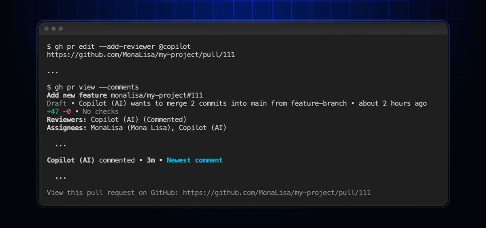

GitHub 在 2026 年 3 月发布的 CLI v2.88.0 版本中，新增了一个对重度终端用户极其友好的功能：**直接在命令行邀请 Copilot 为 Pull Request 进行代码审查**，全程无需跳转到浏览器。

> **使用条件：将 GitHub CLI（gh）升级到 v2.88.0 或更高版本即可；Free 用户每月 50 次深度请求（Code Review 消耗此额度），Business/Enterprise 版无限使用。**
>
> **隐私风险：Free 和个人版 Pro 默认收集与 Copilot 的交互数据（含代码片段）用于模型训练；付费组织拥有的私有仓库豁免，企业版合同明确承诺绝不用于训练——处理商业代码必须检查隐私设置或使用企业版账号。**
>
> **v2.88.0 同步优化审查者搜索：大型团队中改为按键实时搜索（原来一次性加载全部组织成员会导致终端卡顿），是千人以上规模团队的实用改进。**

## 核心能力

简单来说，这项功能允许开发者通过 `gh` 命令行工具，在创建或编辑 PR 时直接分配 `@copilot` 作为审查者。Copilot 会自动分析代码变更并给出审查意见，整个过程都在终端完成。

## 如何使用

前置条件只有一个：**将 GitHub CLI (`gh`) 升级到 v2.88.0 或更高版本**。

具体使用方式分两种场景：

**非交互式（一键执行）：**
- 创建新 PR 时：`gh pr create --reviewer copilot`
- 为已有 PR 添加审查：`gh pr edit --add-reviewer @copilot`

**交互式（菜单选择）：**
如果习惯输入 `gh pr create` 后跟随终端提示操作，在选择审查者的列表中，Copilot 会像真实同事一样出现在选项里，可直接勾选。

## 免费吗？

**严格来说，不是免费的。**

虽然 GitHub CLI 工具本身免费开源，但此功能需要你的 GitHub 账号拥有 Copilot 订阅（Free/Pro/Business/Enterprise 均可）。各版本额度如下：

| 版本 | 额度限制 |
|------|----------|
| Free | 每月 50 次深度请求（Code Review 消耗此额度） |
| Pro | 额度更高，具体取决于订阅等级 |
| Business/Enterprise | 无限使用 |

学生、教师及热门开源项目维护者可申请免费 Pro 权限。

## 隐私警告（必读）

使用 Copilot Code Review 前，请务必了解代码隐私风险：

**免费版 (Free) 和个人版 (Pro/Pro+)：**
GitHub 在 2026 年 4 月更新的隐私政策明确：**默认会收集**用户与 Copilot 的交互数据（包括参与 Code Review 的代码片段）用于训练改进 AI 模型。

**应对措施：**
前往 GitHub Settings -> Copilot -> Policies，**手动关闭** "Allow GitHub to use my code snippets for product improvements" 选项。

**企业版 (Business/Enterprise)：**
企业合同明确承诺：**绝对不会**将代码用于模型训练。如果你审查的是公司商业代码，强烈建议使用企业版账号。

**私有仓库补充规则：**
- 付费组织拥有的私有仓库：数据豁免，不用于训练
- 个人私有仓库：除非手动关闭训练选项，否则仍有被收集风险

## 能用其他 AI CLI 吗？

**无法直接调用。** 这是 GitHub CLI 的深度定制功能，底层直接继承 GitHub 身份认证并封装了专用接口。第三方 AI 命令行工具无法"借用"这条命令。

如果其他 CLI 支持 GitHub API 标准调用，理论上可通过发送 API Payload 曲线实现，但官方推荐且最稳定的途径仍是直接使用 `gh`。

## 额外优化：大型团队福音

除了 Copilot Review，v2.88.0 还优化了审查者搜索体验。以前分配审查者时会一次性加载组织内所有成员，对于千人大团队会导致终端卡顿。现在改为**按键输入实时搜索**，性能大幅提升。

## 总结

把 GitHub CLI 升级到 v2.88.0，以后提 PR 直接带上 `--reviewer copilot`，一键让 AI 帮你做 Code Review，再也不用来回切网页了。

**但记住：** 如果你处理的是商业代码或敏感项目，请先检查隐私设置，或确认使用的是企业版账号。
