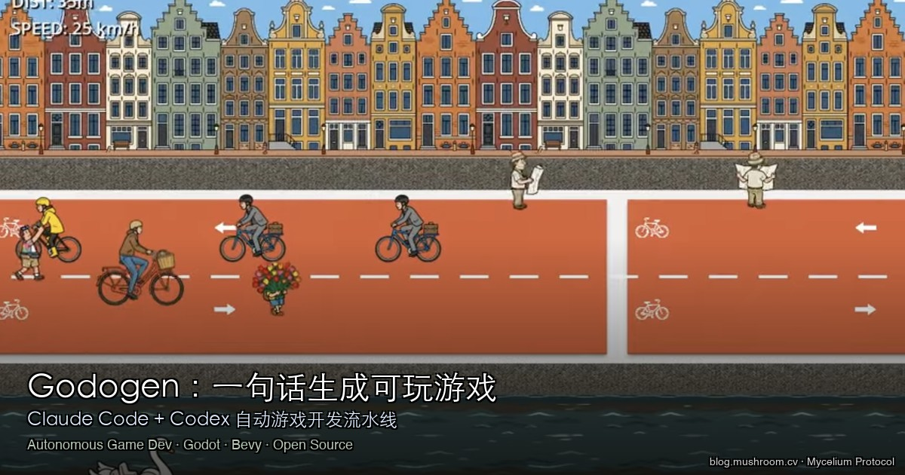

> **BLUF**：Godogen 不是游戏，而是**生成游戏的生成器**。你描述一个想法，它端到端地交付一个完整的 Godot 或 Bevy 项目——包括代码、素材、场景、自我修复。3200+ Star，2026 年 2 月上线，是目前最完整的 AI 自动游戏开发开源方案。

---

## 是什么？

**Godogen** 是一个基于 Claude Code 或 Codex 的自主游戏开发框架。核心逻辑：

> 你描述一个游戏想法 → Godogen 自动规划架构、生成素材、编写代码、运行引擎、截图检查、修复画面和逻辑问题 → 最终交付一个完整的 Godot / Bevy 游戏项目。

它不是普通代码生成，而是**完整的 AI 驱动游戏开发流水线**，像一个"自动游戏工作室"。

[](https://youtu.be/eUz19GROIpY)

*▶ [点击观看 Demo 视频](https://youtu.be/eUz19GROIpY) — 从一句描述到可运行游戏全流程*

**GitHub**：[htdt/godogen](https://github.com/htdt/godogen) · ⭐ 3,235 · Python · 2026-02 发布

---

## 核心能力拆解

### 双引擎支持

| 引擎 | 语言 | 特性 |
|---|---|---|
| **Godot 4** | C# / .NET 9 | 完整场景树、场景构建器、脚本、资源组织；支持 Android APK 导出 |
| **Bevy** | Rust | Code-first 场景、本地 Bevy 文档查询、确定性截图、最终证明包 |

选择 C# 而非 GDScript 的原因：[docs/gdscript-vs-csharp.md](https://github.com/htdt/godogen/blob/master/docs/gdscript-vs-csharp.md)

### 多模型素材生成

| 素材类型 | 使用模型 |
|---|---|
| 精确参考图、角色图 | Gemini（Google AI Studio） |
| 纹理、简单物体 | xAI Grok |
| 图像转 3D 模型 | Tripo3D |
| 动画精灵（循环检测） | Grok Video Generation |

### 截图驱动的自我修复

这是 Godogen 最关键的设计决策：**Agent 通过截图判断进度，而不是看代码能否编译**。

> "可见缺陷（穿模、比例错误、动作卡顿、素材缺失）驱动下一轮迭代，而不是被合理化掉。"

这意味着它能修复代码正确但视觉错误的问题——这是普通代码生成工具做不到的。

### 发布架构

```
godogen repo（本 repo）
    ↓ publish.sh
game repo（全新仓库，含 CLAUDE.md / AGENTS.md + skills）
    ↓ Claude Code 或 Codex 在 game repo 内运行
实际游戏
```

Godogen 本身不跑游戏，它生成一个"游戏生成仓库"，Agent 在那个仓库里工作。

---

## 快速开始

### 1. 环境准备

```bash
# Godot 项目需要
# - Godot 4（.NET 版本）加入 PATH
# - Python 3 + pip

# API Keys（按需配置）
export GOOGLE_API_KEY=...   # Gemini 图像生成
export XAI_API_KEY=...      # Grok 图像/视频生成
export TRIPO3D_API_KEY=...  # 3D 模型生成
```

系统依赖：`vulkan-tools`、`xvfb`、`ffmpeg`、`imagemagick`（详见 [setup.md](https://github.com/htdt/godogen/blob/master/setup.md)）

支持平台：Ubuntu、Debian、macOS

### 2. 发布游戏仓库

```bash
# 选择引擎 + Agent 类型
./publish.sh --engine godot --agent claude --out ~/my-game
./publish.sh --engine godot --agent codex  --out ~/my-game
./publish.sh --engine bevy  --agent claude --out ~/my-game
./publish.sh --engine bevy  --agent codex  --out ~/my-game

# 覆盖已有目录
./publish.sh --engine godot --agent claude --out ~/my-game --force
```

### 3. 让 Agent 生成游戏

进入 game repo，用 Claude Code 或 Codex 描述你的游戏想法：

```
# 在 ~/my-game 目录下
claude   # 启动 Claude Code
> 帮我做一个自上而下视角的太空射击游戏，玩家控制飞船，有3种敌人，可以收集能量道具
```

Agent 接管后自动完成：规划 → 编码 → 资源生成 → 运行 → 截图检查 → 修复 → 完成。

### 4. 服务器运行（长时间任务）

```bash
# 使用 tmux 保持会话
tmux new -s godogen
./publish.sh --engine godot --agent claude --out ~/my-game

# 安装 tg-push，自动将最终视频推送到 Telegram
# https://github.com/htdt/tg-push
```

---

## 对独立开发者和小团队的价值

Godogen 最适合这几类场景：

1. **快速验证游戏 idea**：不用搭环境、不用写 boilerplate，直接描述看效果
2. **原型加速**：有了 Godot/Bevy 基础的开发者，用 Godogen 跑出第一版原型，再手动精修
3. **学习游戏开发**：观察 Agent 如何组织场景树、管理资源、结构化代码，是非常好的学习素材
4. **小团队 MVP**：2-3 人团队可以并行跑多个 game repo 探索不同方向

**局限性**：
- 完整生成可能需要数小时（推荐 GPU 服务器加速）
- 复杂游戏逻辑仍需人工精修
- 依赖多个付费 API（Gemini、Grok、Tripo3D）

---

## 与同类工具对比

| 工具 | 方式 | 引擎 | 自我修复 | 开源 |
|---|---|---|---|---|
| **Godogen** | Agent 驱动全流程 | Godot + Bevy | ✅ 截图驱动 | ✅ |
| Unity AI Muse | 辅助生成 | Unity | ❌ | ❌ |
| GitHub Copilot | 代码补全 | 通用 | ❌ | ❌ |
| GameGen 系列 | 视频/图像生成游戏 | — | ❌ | 部分 |

Godogen 是目前**唯一**将"截图驱动自修复"引入开源游戏自动开发流水线的项目。

---

**源码**：[github.com/htdt/godogen](https://github.com/htdt/godogen)  
**Demo 视频**：[youtu.be/eUz19GROIpY](https://youtu.be/eUz19GROIpY)  
**作者**：[@alex_erm](https://x.com/alex_erm)

---

> © 2026 Author: Mycelium Protocol. 本文采用 [CC BY 4.0](https://creativecommons.org/licenses/by/4.0/deed.zh) 授权——欢迎转载和引用，须注明作者姓名及原文链接，不得去除署名后以原创发布。

<!--EN-->

> **BLUF**: Godogen is not a game — it's a generator that generates games. Describe an idea, and it delivers a complete Godot or Bevy project end-to-end: code, assets, scenes, and self-repair. 3,200+ stars, launched February 2026, and the most complete open-source autonomous game development solution available.

---

## What Is It?

**Godogen** is an autonomous game development framework powered by Claude Code or Codex:

> You describe a game idea → Godogen plans the architecture, generates assets, writes code, runs the engine, checks screenshots, fixes visual and logic problems → delivers a complete Godot / Bevy game project.

It is not a code generator. It is a **full AI-driven game development pipeline** — an autonomous game studio.

[](https://youtu.be/eUz19GROIpY)

*▶ [Watch the demo](https://youtu.be/eUz19GROIpY) — from one sentence to a running game*

**GitHub**: [htdt/godogen](https://github.com/htdt/godogen) · ⭐ 3,235 · Python · Released Feb 2026

---

## Core Capabilities

### Dual-Engine Support

| Engine | Language | Features |
|---|---|---|
| **Godot 4** | C# / .NET 9 | Full scene trees, scene builders, scripts, asset organization; Android APK export |
| **Bevy** | Rust | Code-first scenes, local Bevy docs lookup, deterministic captures, proof bundles |

### Multi-Model Asset Generation

| Asset Type | Model Used |
|---|---|
| Reference images, characters | Gemini (Google AI Studio) |
| Textures, simple objects | xAI Grok |
| Image-to-3D models | Tripo3D |
| Animated sprites (loop detection) | Grok Video Generation |

### Screenshot-Grounded Self-Repair

The most critical design decision in Godogen: **the agent judges progress from captured screenshots, not from whether the code compiles**.

> "Visible defects — clipping, wrong scale, frozen motion, missing assets — drive the next iteration instead of being rationalized away."

This means it can fix problems that are code-correct but visually wrong — something ordinary code generators cannot do.

### Publish Architecture

```
godogen repo (this repo)
    ↓ publish.sh
game repo (fresh repo with CLAUDE.md / AGENTS.md + skills)
    ↓ Claude Code or Codex runs inside the game repo
Actual game
```

---

## Quick Start

### 1. Prerequisites

```bash
# API keys
export GOOGLE_API_KEY=...   # Gemini image generation
export XAI_API_KEY=...      # Grok image/video generation
export TRIPO3D_API_KEY=...  # 3D model generation
```

System deps: `vulkan-tools`, `xvfb`, `ffmpeg`, `imagemagick` — see [setup.md](https://github.com/htdt/godogen/blob/master/setup.md)

Tested on: Ubuntu, Debian, macOS

### 2. Publish a Game Repo

```bash
./publish.sh --engine godot --agent claude --out ~/my-game
./publish.sh --engine godot --agent codex  --out ~/my-game
./publish.sh --engine bevy  --agent claude --out ~/my-game
./publish.sh --engine bevy  --agent codex  --out ~/my-game
```

### 3. Run the Agent

```bash
cd ~/my-game
claude
> Make a top-down space shooter with 3 enemy types and power-up pickups
```

The agent handles: planning → coding → asset generation → engine run → screenshot check → repair → done.

### 4. Long Runs on a Server

```bash
tmux new -s godogen   # keep session alive over SSH
# Install tg-push to auto-send the final proof video to Telegram
```

---

## Value for Indie Devs and Small Teams

Godogen is best suited for:

1. **Rapid idea validation**: describe and see without environment setup or boilerplate
2. **Prototype acceleration**: get a first-pass Godot/Bevy project, then hand-polish
3. **Learning game dev**: observe how the agent organizes scene trees, manages resources, structures code
4. **Small-team MVP**: run multiple game repos in parallel to explore directions

**Limitations**: full generation can take hours (GPU server recommended); complex game logic still needs human refinement; depends on multiple paid APIs.

---

## Comparison With Similar Tools

| Tool | Approach | Engine | Self-Repair | Open Source |
|---|---|---|---|---|
| **Godogen** | Full-pipeline agent | Godot + Bevy | ✅ Screenshot-driven | ✅ |
| Unity AI Muse | Assisted generation | Unity | ❌ | ❌ |
| GitHub Copilot | Code completion | Universal | ❌ | ❌ |
| GameGen series | Video/image game gen | — | ❌ | Partial |

Godogen is currently the **only** open-source project that integrates screenshot-driven self-repair into an autonomous game development pipeline.

---

**Source**: [github.com/htdt/godogen](https://github.com/htdt/godogen)  
**Demo**: [youtu.be/eUz19GROIpY](https://youtu.be/eUz19GROIpY)  
**Author**: [@alex_erm](https://x.com/alex_erm)

---

> © 2026 Author: Mycelium Protocol. Licensed under [CC BY 4.0](https://creativecommons.org/licenses/by/4.0/) — free to share and adapt with attribution. You must credit the author and link to the original; removing attribution and republishing as original is not permitted.
