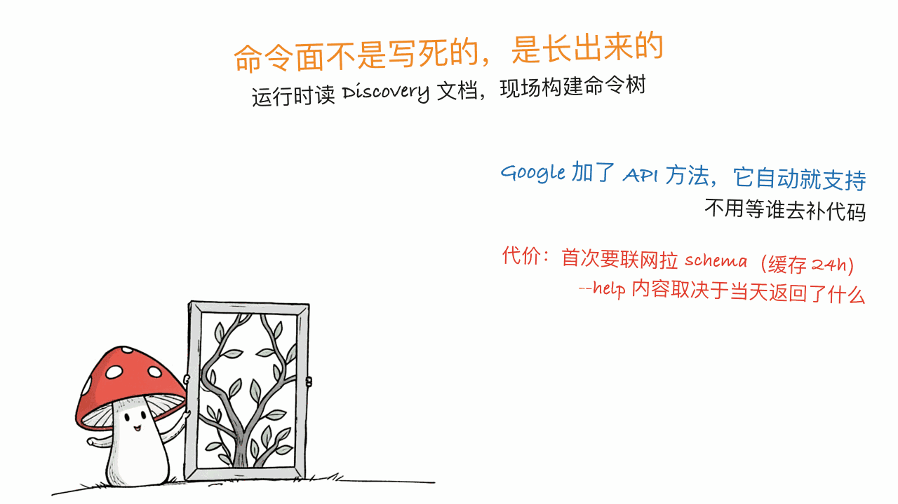

*by Mycelium Protocol*

---

项目地址：https://github.com/googleworkspace/cli
npm：https://www.npmjs.com/package/@googleworkspace/cli
Skills 索引：https://github.com/googleworkspace/cli/blob/main/docs/skills.md
Google Discovery Service：https://developers.google.com/discovery

---

## 一句话结论

**`gws` 把整个 Google Workspace（Drive、Gmail、Calendar、Sheets、Docs、Chat、Admin……）收进一个命令行工具，而它最值得看的地方是——它根本没有一份静态的命令列表。**

命令面是**运行时长出来的**：读 Google 自己的 Discovery Service，拿返回的文档现场构建命令树。Google 那边加了新的 API 方法，`gws` 自动就支持了，不用等谁去补代码。3 万 stars，Rust 写的。

两件必须先说清楚的事：

1. **它不是官方支持的 Google 产品。** 虽然挂在 `googleworkspace` 组织下，README 顶部就写着 "This is **not** an officially supported Google product."
2. **它还在活跃开发中**，作者写明 v1.0 之前会有破坏性变更。

## 那个工程做法：两阶段解析

这是全篇最值得抄走的东西。传统 CLI 的做法是把所有子命令硬编码进去，API 一变就得跟着改。`gws` 的流程是这样：

1. 只读 `argv[1]` 识别出你要用哪个服务（比如 `drive`）
2. 拉这个服务的 **Discovery Document**（缓存 24 小时）
3. 用文档里的 resources 和 methods **动态构建 `clap::Command` 树**
4. **重新解析**剩下的参数
5. 认证、构建 HTTP 请求、执行

关键在第 1 步和第 4 步之间那个"先只看一个词、拿到 schema、再回头完整解析"的动作。它把"这个 CLI 支持哪些命令"这件事，从**编译期**推迟到了**运行时**。

代价也清楚：第一次跑某个服务要联网拉 schema（之后缓存 24 小时），而且你的 `--help` 内容取决于 Google 当天返回了什么。

**这个模式可以迁移。** 任何一个"有大量 REST API + 有机器可读的 API 描述（OpenAPI / Discovery / gRPC reflection）"的系统，都可以照这个思路做 CLI：不再维护一份永远滞后的命令列表，而是让描述文档成为唯一事实来源。对内部平台工具尤其合适。



## 100 多个 SKILL.md

仓库里带了 **100+ 个 Agent Skills**——每个支持的 API 一个，外加常见工作流的高层助手，再加 50 个针对 Gmail、Drive、Docs、Calendar、Sheets 的精选 recipe。

```bash
# 一次装全部
npx skills add https://github.com/googleworkspace/cli

# 或者只挑要用的
npx skills add https://github.com/googleworkspace/cli/tree/main/skills/gws-drive
npx skills add https://github.com/googleworkspace/cli/tree/main/skills/gws-gmail
```

还给 Gemini CLI 做了 extension，认证一次即可继承凭证：

```bash
gws auth setup
gemini extensions install https://github.com/googleworkspace/cli
```

OpenClaw 用户可以直接 symlink 过去（跟仓库保持同步）：

```bash
ln -s $(pwd)/skills/gws-* ~/.openclaw/skills/
```

`gws-shared` 这个 skill 里带了 `install` 块，PATH 上没有 `gws` 时 OpenClaw 会自动用 npm 装上。

**"一个 API 一个 SKILL.md" 这个粒度选择值得注意。** 本站前不久写 ELI5 时说过，skill 的长度应该取决于模型不知道什么。Workspace 的 API 恰好是模型不太可能精确记住的东西（参数名、必填项、分页语义），所以这个粒度是合理的——不是灌水。

## 装和用

推荐从 GitHub Releases 下预编译二进制，也可以：

```bash
npm install -g @googleworkspace/cli          # npm 只是帮你下对应平台的二进制
brew install googleworkspace-cli             # macOS / Linux
cargo install --git https://github.com/googleworkspace/cli --locked
nix run github:googleworkspace/cli
```

前提条件三样：Node.js 18+（走 npm 路径时）、**一个 Google Cloud 项目**（OAuth 凭证要用）、一个有 Workspace 权限的 Google 账号。

```bash
gws auth setup     # 引导你配 Google Cloud 项目
gws auth login     # 之后的 OAuth 登录
gws drive files list --params '{"pageSize": 5}'
```

面向人的部分：每个资源都有 `--help`、`--dry-run` 预览请求、自动分页。面向 agent 的部分：**所有输出都是结构化 JSON**——成功、错误、下载元数据，全部如此。

分页控制得比较细：

| 参数 | 作用 | 默认 |
|---|---|---|
| `--page-all` | 自动翻页，每页输出一行 JSON（NDJSON） | 关 |
| `--page-limit <N>` | 最多取几页 | 10 |
| `--page-delay <MS>` | 翻页间隔 | 100 ms |

`--page-delay` 默认 100ms 这个细节说明作者考虑过配额和限流——自动分页最容易踩的就是这个坑。

## 本站的立场：这是好工具，但方向和我们相反

前面说的都是它做得好的地方。接下来是本站必须讲的那一半。

**`gws` 让 agent 能操作你的 Workspace，但你的数据一份都没有离开 Google。** 邮件、文档、日历、表格，全部还在那边；这个 CLI 只是给了 agent 一把更趁手的钥匙去开同一把锁。


这跟本站一贯关心的方向是相反的：

| | gws 这条路 | 本站关心的那条路 |
|---|---|---|
| 数据在哪 | Google 的服务器 | 你自己的机器 |
| 断网还能用吗 | 不能 | 能 |
| 平台改规则怎么办 | 跟着改 | 不受影响 |
| agent 能力来源 | 平台开放 API | 本地模型 + 本地文件 |

所以本站的判断是：**如果你的组织已经深度绑定 Workspace，`gws` 是个明显的效率提升，值得装。** 但如果你正在做技术选型、还有得选，那么"把 agent 接到平台 API 上"和"把数据拿回本地"是两条会越走越远的路——前者的每一次效率提升，都在加深绑定。

这不是说 `gws` 有什么不对。它诚实、开源、工程做得漂亮。只是**工具的方向性值得被明确说出来**，而不是混在功能清单里一笔带过。

## 一点判断

三条带走的：

1. **动态命令面这个工程做法值得抄。** 让机器可读的 API 描述成为唯一事实来源，CLI 自己长出来——这跟 Google 无关，任何有大量 API 的系统都能用。
2. **"一个 API 一个 skill" 是合理粒度。** API 的参数细节正是模型记不准的东西，这种 skill 不是灌水。
3. **注意它不是官方产品。** 挂在 `googleworkspace` 组织下容易让人误以为有官方支持保证，README 自己否认了，而且 v1.0 前会有破坏性变更。生产环境用之前想清楚。

至于要不要用——看你在哪条路上。这一点，工具本身不会替你回答。

---

> © 2026 Author: Mycelium Protocol. 本文采用 [CC BY 4.0](https://creativecommons.org/licenses/by/4.0/deed.zh) 授权——欢迎转载和引用，须注明作者姓名及原文链接，不得去除署名后以原创发布。

<!--EN-->

*by Mycelium Protocol*

---

Repository: https://github.com/googleworkspace/cli
npm: https://www.npmjs.com/package/@googleworkspace/cli
Skills index: https://github.com/googleworkspace/cli/blob/main/docs/skills.md
Google Discovery Service: https://developers.google.com/discovery

---

## TL;DR

**`gws` puts all of Google Workspace — Drive, Gmail, Calendar, Sheets, Docs, Chat, Admin — behind one command-line tool, and the most interesting thing about it is that it has no static list of commands at all.**

The command surface **grows at runtime**: it reads Google's own Discovery Service and builds its command tree from the returned document on the spot. When Google adds an API method, `gws` supports it without waiting for anyone to write code. 30k stars, written in Rust.

Two things to state up front:

1. **It is not an officially supported Google product.** Despite living under the `googleworkspace` org, the README says so in its second line.
2. **It's under active development**, with breaking changes expected before v1.0.

## The engineering move: two-phase parsing

This is the part worth taking away. Conventional CLIs hardcode every subcommand and have to be updated whenever the API moves. `gws` does this instead:

1. Read only `argv[1]` to identify the service (e.g. `drive`)
2. Fetch that service's **Discovery Document** (cached 24 h)
3. Build a **`clap::Command` tree dynamically** from the document's resources and methods
4. **Re-parse** the remaining arguments
5. Authenticate, build the HTTP request, execute

The trick lives between steps 1 and 4: look at one word, fetch the schema, then go back and parse properly. It defers "which commands does this CLI support" from **compile time** to **run time**.

The costs are equally clear: the first invocation of a service needs network access to fetch the schema (cached 24 hours after), and your `--help` reflects whatever Google returned today.

**The pattern transfers.** Any system with a large REST surface *and* a machine-readable description (OpenAPI / Discovery / gRPC reflection) can build a CLI this way: stop maintaining a command list that's permanently behind, and let the description document be the single source of truth. Especially apt for internal platform tooling.


## 100+ SKILL.md files

The repo ships **100+ Agent Skills** — one per supported API, plus higher-level helpers for common workflows, plus 50 curated recipes for Gmail, Drive, Docs, Calendar, and Sheets.

```bash
# install them all
npx skills add https://github.com/googleworkspace/cli

# or take only what you need
npx skills add https://github.com/googleworkspace/cli/tree/main/skills/gws-drive
npx skills add https://github.com/googleworkspace/cli/tree/main/skills/gws-gmail
```

There's a Gemini CLI extension too, inheriting credentials after a single auth:

```bash
gws auth setup
gemini extensions install https://github.com/googleworkspace/cli
```

OpenClaw users can symlink and stay in sync with the repo:

```bash
ln -s $(pwd)/skills/gws-* ~/.openclaw/skills/
```

The `gws-shared` skill carries an `install` block, so OpenClaw auto-installs the CLI via npm when `gws` isn't on PATH.

**The "one SKILL.md per API" granularity is worth noting.** As we argued in the ELI5 post, a skill's length should track what the model doesn't know. Workspace API details — parameter names, required fields, pagination semantics — are exactly what a model won't recall precisely, so this granularity is justified rather than padding.

## Installing and using it

Prebuilt binaries from GitHub Releases are the recommended path; alternatives:

```bash
npm install -g @googleworkspace/cli          # npm just fetches the right binary
brew install googleworkspace-cli             # macOS / Linux
cargo install --git https://github.com/googleworkspace/cli --locked
nix run github:googleworkspace/cli
```

Three prerequisites: Node.js 18+ (for the npm path), **a Google Cloud project** (for OAuth credentials), and a Google account with Workspace access.

```bash
gws auth setup     # walks you through Google Cloud project config
gws auth login     # subsequent OAuth login
gws drive files list --params '{"pageSize": 5}'
```

For humans: `--help` on every resource, `--dry-run` to preview requests, auto-pagination. For agents: **every output is structured JSON** — successes, errors, download metadata, all of it.

Pagination is controlled at a useful granularity:

| Flag | Effect | Default |
|---|---|---|
| `--page-all` | Auto-paginate, one JSON line per page (NDJSON) | off |
| `--page-limit <N>` | Max pages to fetch | 10 |
| `--page-delay <MS>` | Delay between pages | 100 ms |

That 100 ms default delay signals the author thought about quotas and rate limits — the classic trap of auto-pagination.

## Our position: a good tool pointing the other way

Everything above is what it does well. Here's the half this blog has to say out loud.

**`gws` lets an agent operate your Workspace, but not one byte of your data leaves Google.** Mail, documents, calendars, sheets — all still over there; this CLI just hands the agent a better-fitting key to the same lock.


That runs opposite to the direction this blog cares about:

| | The gws path | The path we cover |
|---|---|---|
| Where the data lives | Google's servers | your own machine |
| Works offline? | no | yes |
| Platform changes the rules | you follow | unaffected |
| Where agent capability comes from | the platform's open APIs | local models + local files |

So our judgment: **if your organization is already deeply committed to Workspace, `gws` is an obvious efficiency win and worth installing.** But if you're making a technology choice and still have options, "wire the agent into the platform's APIs" and "bring the data back to your own machine" are two paths that diverge further over time — and every efficiency gain on the first one deepens the lock-in.

None of which says `gws` is doing anything wrong. It's honest, open source, and nicely engineered. It's that **a tool's directionality deserves to be said out loud** rather than folded quietly into a feature list.

## A closing judgment

Three things to take away:

1. **The dynamic command surface is worth copying.** Let a machine-readable API description be the single source of truth and have the CLI grow itself — nothing about that is Google-specific; any API-heavy system can use it.
2. **"One skill per API" is the right granularity.** API parameter detail is precisely what models get wrong, so these skills aren't padding.
3. **Note that it isn't an official product.** Living under the `googleworkspace` org invites the assumption of official support; the README denies it, and breaking changes are expected before v1.0. Think it through before production use.

As for whether to adopt it — that depends which path you're on, and the tool won't answer that one for you.

---

> © 2026 Author: Mycelium Protocol. Licensed under [CC BY 4.0](https://creativecommons.org/licenses/by/4.0/) — free to share and adapt with attribution. You must credit the author and link to the original; removing attribution and republishing as original is not permitted.
