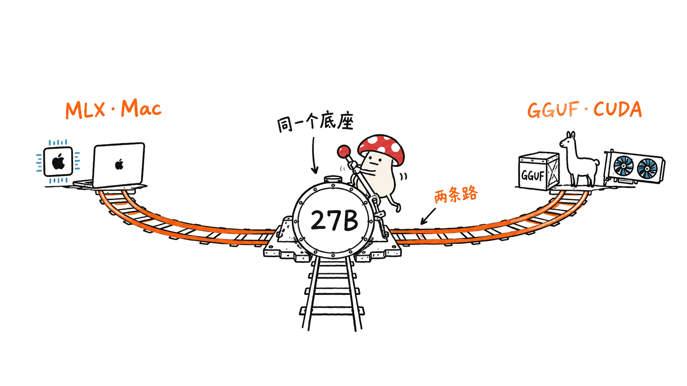
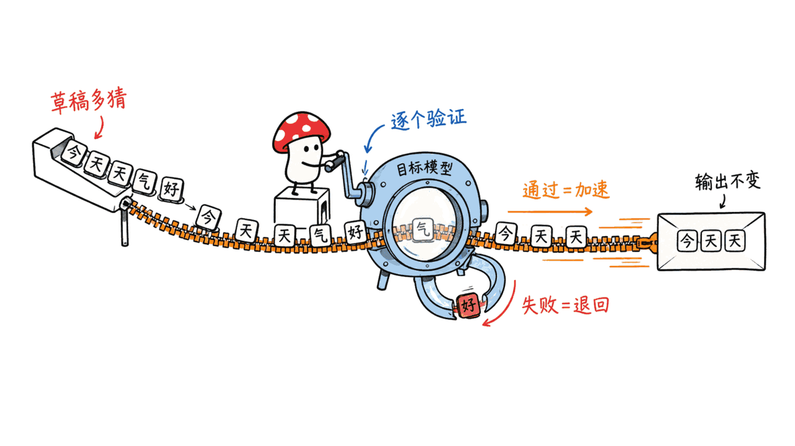
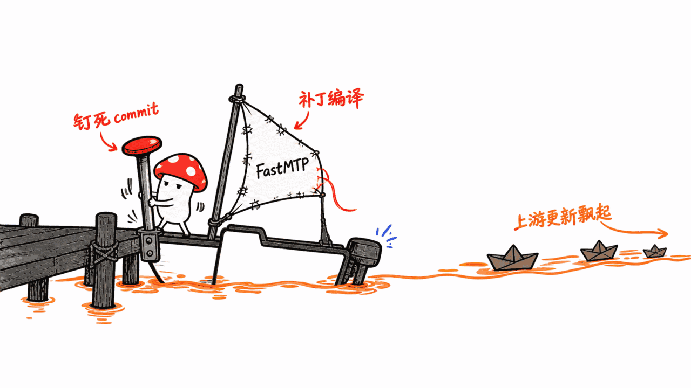
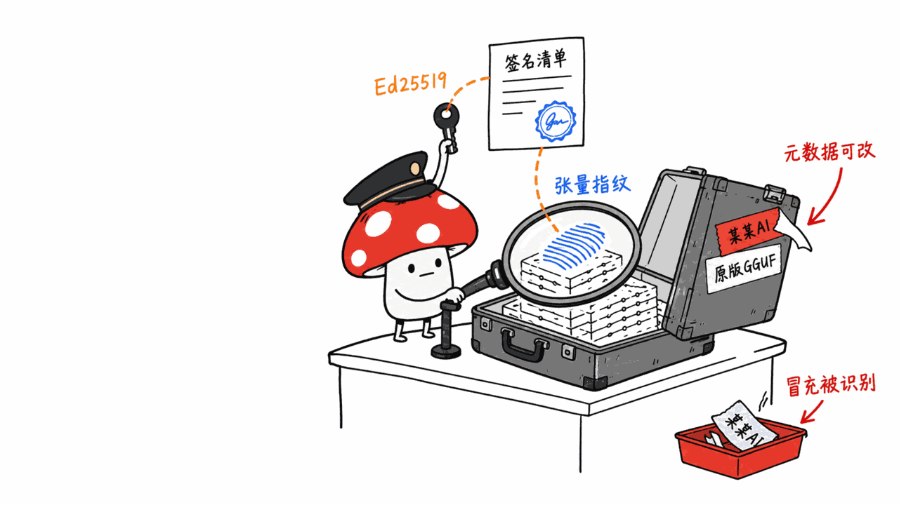

8 月 20 日本站写过 Qwen3.8-27B 的一个消融对齐版本，走的是 **MLX 路线**——Apple Silicon、2/4/6/8-bit、给 Mac 用户。

今天这个是**同一个基础模型的另一条路**：GGUF、llama.cpp 生态、CUDA 显卡，而且带了一件 MLX 那边没有的东西——**投机解码加速旁车**。

两篇讲的不是同一个仓库，也不是同一类读者。先把这句放前面，免得当成重复。

HuggingFace：https://huggingface.co/HauhauCS/Qwen3.8-27B-Uncensored-HauhauCS-Aggressive-MTP-GGUF
基础模型：https://huggingface.co/Qwen/Qwen3.8-27B
协议：Apache-2.0（继承自 Qwen）｜❤ 1048｜下载 1,715,824｜发布：2026-08-17



## 先看模型本身长什么样

Qwen3.8-27B 的架构在本站上一篇已经拆过，这里只复述关键规格：

- 27B 稠密语言模型 + 视觉编码器
- **64 层，其中 48 层 Gated DeltaNet（线性注意力）+ 16 层门控注意力**
- 隐藏维度 5120，FFN 17408，词表 248320（padded）
- 原生嵌入 MTP / NextN 头保留
- **原生上下文 262,144 token**，按框架配置最高可扩到 1,000,000
- 原生支持文本、图像、视频理解（视觉走独立的 BF16 projector）

发布方给的量化档位和体积（BPW 是含嵌入 MTP 张量的编码平均位宽）：

| 文件 | 量化 | BPW | 体积 |
|---|---|---:|---:|
| Q8_K_P | Q8_K_P | 9.21 | 31.46 GB |
| Q6_K_P | Q6_K_P | 7.59 | 25.92 GB |
| Q5_K_P | Q5_K_P | 5.92 | 20.22 GB |
| Q4_K_P | Q4_K_P | 5.25 | 17.92 GB |
| IQ4_XS | IQ4_XS | 4.60 | 15.71 GB |
| Q3_K_P | Q3_K_P | 3.93 | 13.44 GB |
| IQ3_M | IQ3_M | 3.74 | 12.79 GB |
| IQ3_XS | IQ3_XS | 3.56 | 12.18 GB |
| Q2_K_P | Q2_K_P | 3.12 | 10.68 GB |
| IQ2_M | IQ2_M | 3.02 | 10.32 GB |
| 视觉 projector | BF16 | — | 931 MB |
| FastMTP 旁车 | — | — | 903 MB |

想跑图像或视频输入才需要下 projector，只跑文本就不用。

## K_P 是什么量化？

这是这个发布方自造的一档：**K_P 里的 P 是 "Perfect"。**

它的做法是——按模型做针对性分析，**选择性地在最要紧的地方保住精度**，每个模型都有自己的量化剖面。效果按发布方的说法是：

> 一个 K_P 量化，实际上把质量往上抬了一到两个量化档，代价只是比基准量化多大约 5–15% 的体积。

而且**文件仍然是标准 GGUF**，llama.cpp、LM Studio 和其他 GGUF 前端都能直接用，不需要特殊构建或插件。唯一的小麻烦是 LM Studio 的量化列可能把它显示成 `?`——纯显示问题，模型正常加载运行。

对照表里也给了每档 K_P 对标的常规量化：Q8_K_P 对 Q8_0（9.21 vs 8.50 BPW）、Q6_K_P 对 Q6_K（7.59 vs 6.60）、Q4_K_P 对 Q4_K_M（5.25 vs 4.88）。**多出来的那 0.4–0.7 BPW，就是"选择性保质"的成本。**

这里有一处必须说清楚的地方：**K_P 的构造和选择方法论是这个发布方独有的，没有公开。** 权重继承 Qwen 的 Apache-2.0，但"怎么决定哪里保精度"这套东西是黑盒。按本站"开源开放"的原则，这是一个明确的减分项——**你能自由使用产物，但你无法复现、审计或改进这个过程。**



## FastMTP：投机解码的旁车

这是整个发布最有技术含量的部分。

先说 MTP（Multi-Token Prediction / NextN）是什么：模型带一个额外的头，一次预测多个 token 作为"草稿"，再由完整的目标模型逐个验证。**验证通过就白赚速度，验证失败就退回正常解码——输出结果不变。**

这个发布提供了两条加速路径：

- **嵌入式 MTP**：任何一个目标 GGUF 单独使用，在当前上游 llama.cpp 里加 `--spec-type draft-mtp` 就能开。**这条是开箱即用的。**
- **HauhauCS FastMTP**：把同一个目标模型配上那个 903MB 的 `FastMTP-32K.gguf` 旁车，**再加一个 llama.cpp 运行时补丁**。

加速比是分层报的（都在 Q8_K_P 上测）：

| 对比 | 文档生成 | 推理生成 | 条件 |
|---|---:|---:|---|
| 嵌入式 MTP vs 关闭 MTP | **2.23x**（+123.4%） | **1.60x**（+59.6%） | depth 2 |
| FastMTP vs 嵌入式 MTP | **+35.2%** | **+21.1%** | depth 3 vs depth 2 |
| FastMTP vs 嵌入式 MTP（同 depth） | +11.1% | +18.2% | 都是 depth 3 |
| FastMTP vs 关闭 MTP | **3.02x**（+202.0%） | **1.93x**（+93.3%） | Q8_K_P 服务态 |

模型卡有一句很重要的话：**"未改变的完整目标模型验证每一个草稿 token，所以 FastMTP 只加速生成，不替换目标模型，也不改变它的答案。"** 而且基准表下注明：**每一个 FastMTP 结果都复现了对应嵌入式 MTP 输出的哈希值。**

这条比加速比本身更值得记——**投机解码是无损的，这是它和"用小模型凑合"的根本区别。**

按量化档拆开的完整数据（RTX PRO 6000 Blackwell 96GB，depth 3，9.8K token 未缓存文档任务）：

| 量化 | PP tok/s | 文档 TG | 推理 TG | vs 关闭 MTP（文档/推理） |
|---|---:|---:|---:|---:|
| Q2_K_P | 3351.29 | 213.95 | 145.09 | 2.27x / 1.48x |
| Q3_K_P | 3317.16 | 216.15 | 137.99 | 2.54x / 1.56x |
| Q4_K_P | 3204.98 | 187.26 | 123.52 | 2.67x / 1.71x |
| Q6_K_P | 3081.90 | 156.57 | 103.51 | 2.95x / 1.91x |
| Q8_K_P | 3285.86 | 138.18 | 90.07 | 3.02x / 1.93x |
| IQ4_XS | 3445.30 | 211.09 | 135.77 | 2.68x / 1.66x |

注意一条规律：**量化越高（模型越大），FastMTP 的相对增益越大**（Q2 的 2.27x → Q8 的 3.02x）。这符合投机解码的原理——目标模型越慢，草稿省下的时间占比就越高。

还有一条"全窗口闸门"测试值得单独拎出来：**190,000 个未缓存的提示 token + 64 个生成 token，跑出 1613.81 PP tok/s 和 131.81 TG tok/s，草稿接受率 92.0%，在配置的最大原生上下文内没有截断。**

92% 的接受率是个相当高的数字。



## 代价：你得自己打补丁编译 llama.cpp

FastMTP 不是装个包就能用。完整流程：

```bash
git clone https://github.com/ggerganov/llama.cpp
cd llama.cpp
git checkout 4df29be4f4c3673f428170fda944a5b19f743bb8

curl -L -o HauhauCS-FastMTP-llama.cpp.patch \
  https://huggingface.co/HauhauCS/Qwen3.8-27B-Uncensored-HauhauCS-Aggressive-MTP-GGUF/resolve/main/HauhauCS-FastMTP-llama.cpp.patch
git apply --check HauhauCS-FastMTP-llama.cpp.patch
git apply HauhauCS-FastMTP-llama.cpp.patch

cmake -S . -B build -DGGML_CUDA=ON -DCMAKE_BUILD_TYPE=Release
cmake --build build --config Release -j"$(nproc)"
```

ROCm/HIP 把 `-DGGML_CUDA=ON` 换成 `-DGGML_HIP=ON`，Vulkan 换成 `-DGGML_VULKAN=ON`，纯 CPU 就省掉后端标志。

**注意那个 `git checkout` 的固定 commit。** 这意味着你的构建**钉死在上游的某个历史点上**——上游后续的修复和优化你都拿不到，除非发布方更新补丁。这是一个真实的长期维护成本，不是一次性代价。

模型卡还贴心地给了一个常见错误的解释：如果草稿加载报 `expected 5120, 248320, got 5120, 32768`，说明**旁车文件是对的，但你跑的可执行文件没打补丁**——要从这个 checkout 里启动新构建的 `./build/bin/llama-server`。

服务命令的关键参数：

```bash
./build/bin/llama-server \
  --model Qwen3.8-27B-Uncensored-HauhauCS-Aggressive-Q4_K_P.gguf \
  --spec-draft-model Qwen3.8-27B-Uncensored-HauhauCS-Aggressive-FastMTP-32K.gguf \
  --spec-draft-ngl all \
  --spec-type draft-mtp \
  --spec-draft-n-max 3 \
  --spec-draft-p-min 0 \
  --ctx-size 204800 \
  --flash-attn on --no-mmap \
  --jinja --reasoning on --reasoning-effort xhigh \
  --temp 1.0 --top-k 20 --top-p 0.95 --min-p 0
```

采样参数直接沿用 Qwen 官方模型卡的推荐：**思考模式** temperature 1.0 / top_p 0.95 / top_k 20 / min_p 0 / presence_penalty 0 / repetition_penalty 1.0；**指令（非思考）模式** temperature 0.7 / top_p 0.80 / top_k 20 / presence_penalty 1.5，并设 `enable_thinking=false`。

Qwen3.8 支持 `xhigh` / `medium` / `low` 三档推理强度，默认开启思考并保留推理内容。要关掉思考：

```bash
--chat-template-kwargs '{"enable_thinking":false}'
```

或者按请求走 OpenAI 兼容 API 传 `chat_template_kwargs`。多轮 agent 场景要保留上一轮推理上下文，传 `{"preserve_thinking": true}`。

模型卡有一条部署建议很实在：**上下文长度和 KV 精度对显存的消耗很大；如果你的任务不需要最大原生上下文，先降上下文，再降模型质量。** 低量化档保持默认 F16 K/V，除非显存实在紧张。



## 值得注意的一件事：它做了发布签名

这是我在社区量化发布里很少见到的：**每个 GGUF 都被一份签过名的 HauhauCS 发布清单覆盖。**

- 精确的 SHA-256 用来识别改名后的逐字节镜像
- **规范张量指纹**用来在只改元数据的重写之后仍能识别 HauhauCS 的张量
- FastMTP 旁车的文件 SHA-256、张量指纹、公钥 DER 指纹都在模型卡里明文列出

验证方式是 Ed25519：

```bash
openssl pkeyutl -verify -rawin -pubin \
  -inkey HauhauCS-FastMTP-Ed25519-PUBLIC.pem \
  -in HauhauCS-RELEASE-MANIFEST.json \
  -sigfile HauhauCS-RELEASE-MANIFEST.json.sig
```

**为什么这件事重要？** 因为模型权重是二进制黑盒，被人改一改再重新上传，肉眼完全看不出来。GGUF 生态里"某某某的量化版"满天飞，绝大多数没有任何来源证明。

"规范张量指纹"那条设计尤其到位——它对付的是**只改元数据的重打包**：有人拿走你的权重、改个名字改点元数据、当自己的发出去，SHA-256 会变，但张量本身没变，指纹还能认出来。

按本站的价值观，这条应该被更多发布方抄走。**开源模型的供应链安全，目前几乎是一片空白。**

## 关于 "Uncensored / Aggressive"

模型卡对这个变体的定位写得很直接：**"0/465 Refusals"**，Aggressive 变体的行为是"直接给答案，不做拒绝行为，面对困难提示时前言最少"。它明说**没有改变数据集或预期能力**，保留了 Qwen3.8-27B 的文本、推理、agent、图像和视频能力，只是叠加了 Aggressive 消融剖面。

模型卡自己也给了使用建议：**对可靠性要求高、特别是长上下文 agent 场景，如果有 Balanced 版本，那通常是更安全的默认选择。**

本站在 8 月那篇里已经讨论过消融对齐（abliteration）的技术原理和研究用途，这里不重复。要提醒的只有一条：**这类变体的定位是 AI 安全研究、拒绝机制研究和 red-teaming，不是"解锁一个更好用的模型"。** 拿掉拒绝行为的同时，也拿掉了模型对自己不确定内容的保留。

## 最重要的一条限制：那些数字是在什么机器上跑的

必须把这条放在结尾强调，因为它决定了上面所有数字对你有没有意义。

**全部基准都跑在一块 RTX PRO 6000 Blackwell 96 GB 上**，隔离通道、204800 配置上下文、全量 CUDA offload、`--no-mmap`、官方推理采样器。另有一组 RTX 6000 Ada 的嵌入式 MTP 参考数据（Q3_K_P 112.76 TG tok/s，开 FastMTP 后 138.37 文档 TG，比钉住的 Unsloth Q3 对照快 23.5%）。

**这两块卡都不是个人可及的硬件。** 96GB 显存意味着模型、KV cache、草稿旁车可以全部塞进去还有富余——而在一块 24GB 的消费卡上，你要先解决"放不放得下"，再谈"快不快"。

所以对个人用户，这份模型卡的正确读法是：

1. **量化档位和体积表是可以直接用的** —— IQ2_M 10.32 GB、Q3_K_P 13.44 GB、IQ4_XS 15.71 GB，这些数字跟卡无关
2. **加速比的方向性是可信的**（越大的量化档增益越大，投机解码无损），**但绝对数字不可迁移**
3. **先降上下文再降质量**这条建议，在小显存上比在 96GB 上更适用
4. **想省事就用嵌入式 MTP**（`--spec-type draft-mtp`，上游 llama.cpp 直接支持），FastMTP 那额外的 11–35% 未必值得你去钉住一个上游 commit

我自己的验证路径会是：先在能跑的档位上（IQ4_XS 或 Q3_K_P）用**上游未打补丁的 llama.cpp 开嵌入式 MTP**，测一个基线；只有当这个基线本身可用、而且我确实卡在生成速度上时，才去考虑打补丁上 FastMTP。

**先把不需要额外代价的那一半收益拿到手，再决定要不要为剩下那一半付维护成本。**

---

> © 2026 Author: Mycelium Protocol. 本文采用 [CC BY 4.0](https://creativecommons.org/licenses/by/4.0/deed.zh) 授权——欢迎转载和引用，须注明作者姓名及原文链接，不得去除署名后以原创发布。

<!--EN-->

On August 20 this site covered an abliterated build of Qwen3.8-27B that took the **MLX route** — Apple Silicon, 2/4/6/8-bit, for Mac users.

Today's is **the same base model down a different road**: GGUF, the llama.cpp ecosystem, CUDA GPUs — and it brings something the MLX side did not have: **a speculative-decoding acceleration sidecar.**

Different repository, different audience. Stating that up front so this does not read as a repeat.

HuggingFace: https://huggingface.co/HauhauCS/Qwen3.8-27B-Uncensored-HauhauCS-Aggressive-MTP-GGUF
Base model: https://huggingface.co/Qwen/Qwen3.8-27B
License: Apache-2.0 (inherited from Qwen) | ❤ 1048 | Downloads 1,715,824 | Released 2026-08-17


## What the model itself looks like

This site dissected the Qwen3.8-27B architecture in the earlier piece, so only the key specs here:

- 27B dense language model with a vision encoder
- **64 layers: 48 Gated DeltaNet (linear attention) plus 16 gated-attention layers**
- Hidden size 5,120, FFN size 17,408, padded vocabulary 248,320
- Native embedded MTP / NextN head preserved
- **262,144-token native context**, extensible to 1,000,000 with framework-specific configuration
- Native text, image and video understanding (vision via a separate BF16 projector)

The publisher's quant lineup and sizes (BPW is the encoded tensor-payload average including embedded MTP tensors):

| File | Quant | BPW | Size |
|---|---|---:|---:|
| Q8_K_P | Q8_K_P | 9.21 | 31.46 GB |
| Q6_K_P | Q6_K_P | 7.59 | 25.92 GB |
| Q5_K_P | Q5_K_P | 5.92 | 20.22 GB |
| Q4_K_P | Q4_K_P | 5.25 | 17.92 GB |
| IQ4_XS | IQ4_XS | 4.60 | 15.71 GB |
| Q3_K_P | Q3_K_P | 3.93 | 13.44 GB |
| IQ3_M | IQ3_M | 3.74 | 12.79 GB |
| IQ3_XS | IQ3_XS | 3.56 | 12.18 GB |
| Q2_K_P | Q2_K_P | 3.12 | 10.68 GB |
| IQ2_M | IQ2_M | 3.02 | 10.32 GB |
| Vision projector | BF16 | — | 931 MB |
| FastMTP sidecar | — | — | 903 MB |

The projector is only needed for image or video input; text-only runs skip it.

## What kind of quantization is K_P?

This is a tier the publisher invented: **the P in K_P stands for "Perfect."**

The method: model-specific analysis that **selectively preserves precision where it matters most**, with every model getting its own quantization profile. The claimed effect:

> A K_P quant effectively bumps quality up by one or two quant levels at only around 5–15% more size than the base quant.

And **the files remain standard GGUFs** — llama.cpp, LM Studio and other GGUF frontends load them with no special build or plugin. The one wrinkle is that LM Studio's quant column may show `?` — a display issue only; the model loads and runs normally.

The comparison table also names each K_P's baseline: Q8_K_P against Q8_0 (9.21 vs 8.50 BPW), Q6_K_P against Q6_K (7.59 vs 6.60), Q4_K_P against Q4_K_M (5.25 vs 4.88). **That extra 0.4–0.7 BPW is the price of selective preservation.**

One thing must be stated plainly here: **the construction and selection methodology for K_P is exclusive to this publisher's releases and is not published.** The weights inherit Qwen's Apache-2.0, but "how we decide where to preserve precision" is a black box. By this site's open-source principle that is a clear demerit — **you can use the artifact freely, but you cannot reproduce, audit or improve the process.**


## FastMTP: a speculative-decoding sidecar

This is the most technically substantial part of the release.

First, what MTP (Multi-Token Prediction / NextN) is: the model carries an extra head that predicts several tokens at once as a "draft," which the full target model then verifies one by one. **Accepted drafts are free speed; rejected ones fall back to normal decoding — the output is unchanged.**

The release offers two acceleration paths:

- **Embedded MTP**: use any target GGUF on its own with `--spec-type draft-mtp` in a current upstream llama.cpp build. **This one works out of the box.**
- **HauhauCS FastMTP**: pair that same target with the 903MB `FastMTP-32K.gguf` sidecar **plus a llama.cpp runtime patch**.

The speedups are reported as a ladder (all on Q8_K_P):

| Comparison | Document TG | Reasoning TG | Scope |
|---|---:|---:|---|
| Embedded MTP vs MTP off | **2.23x** (+123.4%) | **1.60x** (+59.6%) | depth 2 |
| FastMTP vs embedded MTP | **+35.2%** | **+21.1%** | depth 3 vs depth 2 |
| FastMTP vs embedded MTP (same depth) | +11.1% | +18.2% | both depth 3 |
| FastMTP vs MTP off | **3.02x** (+202.0%) | **1.93x** (+93.3%) | Q8_K_P service |

One sentence in the model card matters more than the ratios: **"The unchanged full target verifies every drafted token, so FastMTP accelerates generation without replacing the target model or changing its answers."** And beneath the benchmark table: **every FastMTP result reproduced the corresponding embedded-MTP output hashes.**

Remember that over the speedup figures — **speculative decoding is lossless, and that is what fundamentally separates it from "just use a smaller model."**

The full per-quant data (RTX PRO 6000 Blackwell 96GB, depth 3, uncached 9.8K-token document fixture):

| Quant | PP tok/s | Document TG | Reasoning TG | vs MTP off (Doc/Reason) |
|---|---:|---:|---:|---:|
| Q2_K_P | 3351.29 | 213.95 | 145.09 | 2.27x / 1.48x |
| Q3_K_P | 3317.16 | 216.15 | 137.99 | 2.54x / 1.56x |
| Q4_K_P | 3204.98 | 187.26 | 123.52 | 2.67x / 1.71x |
| Q6_K_P | 3081.90 | 156.57 | 103.51 | 2.95x / 1.91x |
| Q8_K_P | 3285.86 | 138.18 | 90.07 | 3.02x / 1.93x |
| IQ4_XS | 3445.30 | 211.09 | 135.77 | 2.68x / 1.66x |

Note the pattern: **the higher the quant (the larger the model), the greater FastMTP's relative gain** (2.27x at Q2 rising to 3.02x at Q8). That follows from how speculative decoding works — the slower the target model, the larger the fraction of time the draft saves.

One more result deserves its own line, the full-window gate: **190,000 uncached prompt tokens plus 64 generated tokens completed at 1613.81 PP tok/s and 131.81 TG tok/s, with 92.0% draft acceptance and no truncation inside the configured maximum native context.**

92% acceptance is a notably high number.


## The cost: you must patch and build llama.cpp yourself

FastMTP is not a package install. The full procedure:

```bash
git clone https://github.com/ggerganov/llama.cpp
cd llama.cpp
git checkout 4df29be4f4c3673f428170fda944a5b19f743bb8

curl -L -o HauhauCS-FastMTP-llama.cpp.patch \
  https://huggingface.co/HauhauCS/Qwen3.8-27B-Uncensored-HauhauCS-Aggressive-MTP-GGUF/resolve/main/HauhauCS-FastMTP-llama.cpp.patch
git apply --check HauhauCS-FastMTP-llama.cpp.patch
git apply HauhauCS-FastMTP-llama.cpp.patch

cmake -S . -B build -DGGML_CUDA=ON -DCMAKE_BUILD_TYPE=Release
cmake --build build --config Release -j"$(nproc)"
```

For ROCm/HIP swap `-DGGML_CUDA=ON` for `-DGGML_HIP=ON`, Vulkan for `-DGGML_VULKAN=ON`, and omit the backend flag entirely for CPU-only.

**Note that pinned `git checkout` commit.** It means your build is **frozen at a point in upstream history** — later upstream fixes and optimizations are unavailable to you unless the publisher updates the patch. That is a real ongoing maintenance cost, not a one-time price.

The model card helpfully explains one common error: if draft loading reports `expected 5120, 248320, got 5120, 32768`, **the sidecar file is correct but the executable is unpatched** — launch the freshly built `./build/bin/llama-server` from that checkout.

The key serving parameters:

```bash
./build/bin/llama-server \
  --model Qwen3.8-27B-Uncensored-HauhauCS-Aggressive-Q4_K_P.gguf \
  --spec-draft-model Qwen3.8-27B-Uncensored-HauhauCS-Aggressive-FastMTP-32K.gguf \
  --spec-draft-ngl all \
  --spec-type draft-mtp \
  --spec-draft-n-max 3 \
  --spec-draft-p-min 0 \
  --ctx-size 204800 \
  --flash-attn on --no-mmap \
  --jinja --reasoning on --reasoning-effort xhigh \
  --temp 1.0 --top-k 20 --top-p 0.95 --min-p 0
```

Sampling follows Qwen's official model card directly: **thinking mode** at temperature 1.0 / top_p 0.95 / top_k 20 / min_p 0 / presence_penalty 0 / repetition_penalty 1.0; **instruct (non-thinking) mode** at temperature 0.7 / top_p 0.80 / top_k 20 / presence_penalty 1.5 with `enable_thinking=false`.

Qwen3.8 supports `xhigh` / `medium` / `low` reasoning effort, with thinking and preserved reasoning enabled by default. To turn thinking off:

```bash
--chat-template-kwargs '{"enable_thinking":false}'
```

Or pass `chat_template_kwargs` per request through the OpenAI-compatible API. For multi-turn agents that need prior reasoning context, pass `{"preserve_thinking": true}`.

One deployment note in the card is genuinely practical: **context length and KV precision cost a lot of VRAM; if your workload does not need maximum native context, reduce context before reducing model quality.** Keep default F16 K/V on the lower tiers unless memory pressure forces otherwise.


## Something worth noting: it signs its releases

This is rare in community quantization releases: **every GGUF is covered by a signed HauhauCS release manifest.**

- Exact SHA-256 values identify byte-for-byte mirrors after renaming
- **Canonical tensor fingerprints** continue to identify HauhauCS tensors after metadata-only rewriting
- The FastMTP sidecar's file SHA-256, canonical tensor fingerprint, and the public-key DER fingerprint are all printed in the model card

Verification is Ed25519:

```bash
openssl pkeyutl -verify -rawin -pubin \
  -inkey HauhauCS-FastMTP-Ed25519-PUBLIC.pem \
  -in HauhauCS-RELEASE-MANIFEST.json \
  -sigfile HauhauCS-RELEASE-MANIFEST.json.sig
```

**Why does this matter?** Because model weights are a binary black box; someone can modify and re-upload them with no visible difference whatsoever. The GGUF ecosystem is full of "so-and-so's quantization" with no provenance of any kind.

The canonical-tensor-fingerprint idea is especially well aimed — it defends against **metadata-only repackaging**: someone takes your weights, renames them, tweaks the metadata and ships them as their own. The SHA-256 changes, but the tensors do not, and the fingerprint still identifies them.

By this site's values, more publishers should copy this. **Supply-chain security for open models is currently close to a blank page.**

## On "Uncensored / Aggressive"

The card states this variant's position directly: **"0/465 Refusals"**, with the Aggressive variant behaving as "direct answers, no refusal behavior, and minimal preamble on hard prompts." It explicitly notes **no changes to datasets or intended capabilities**, preserving Qwen3.8-27B's text, reasoning, agentic, image and video capabilities with the Aggressive uncensoring profile applied on top.

The card gives its own usage guidance too: **for reliability-critical work, especially long-context agentic work, a Balanced release is normally the safer default when one is available.**

This site discussed the mechanics and research uses of abliteration in the August piece, so no repeat here. Only one reminder: **variants like this are positioned for AI safety research, refusal-mechanism study and red-teaming, not as "an unlocked, better model."** Removing refusal behavior also removes the model's reticence about things it is unsure of.

## The most important limitation: what machine those numbers ran on

This belongs at the end and in bold, because it determines whether any figure above means anything to you.

**Every benchmark ran on a single RTX PRO 6000 Blackwell 96 GB**, one isolated lane, 204800 configured context, full CUDA offload, `--no-mmap`, the official reasoning sampler. There is a second set of embedded-MTP reference numbers on an RTX 6000 Ada (Q3_K_P at 112.76 TG tok/s; with FastMTP, 138.37 document TG, 23.5% faster than the pinned Unsloth Q3 control).

**Neither card is hardware an individual can reach.** 96GB of VRAM means the model, KV cache and draft sidecar all fit with room to spare — whereas on a 24GB consumer card you must first solve "does it fit" before discussing "is it fast."

So for an individual, the correct way to read this card is:

1. **The quant lineup and size table transfers directly** — IQ2_M at 10.32 GB, Q3_K_P at 13.44 GB, IQ4_XS at 15.71 GB are card-independent facts
2. **The direction of the speedups is credible** (bigger quants gain more; speculative decoding is lossless), **but the absolute numbers do not transfer**
3. **"Reduce context before reducing quality"** applies more on a small card than on a 96GB one
4. **If you want the easy path, use embedded MTP** (`--spec-type draft-mtp`, supported by upstream llama.cpp directly); FastMTP's extra 11–35% may not be worth pinning yourself to an upstream commit

My own verification path would be: on a quant I can actually run (IQ4_XS or Q3_K_P), enable **embedded MTP on unpatched upstream llama.cpp** and establish a baseline; only if that baseline is usable *and* generation speed is genuinely my bottleneck would I consider patching for FastMTP.

**Take the half of the gain that costs nothing extra first, then decide whether the other half is worth the maintenance bill.**

---

> © 2026 Author: Mycelium Protocol. Licensed under [CC BY 4.0](https://creativecommons.org/licenses/by/4.0/) — free to share and adapt with attribution. You must credit the author and link to the original; removing attribution and republishing as original is not permitted.
