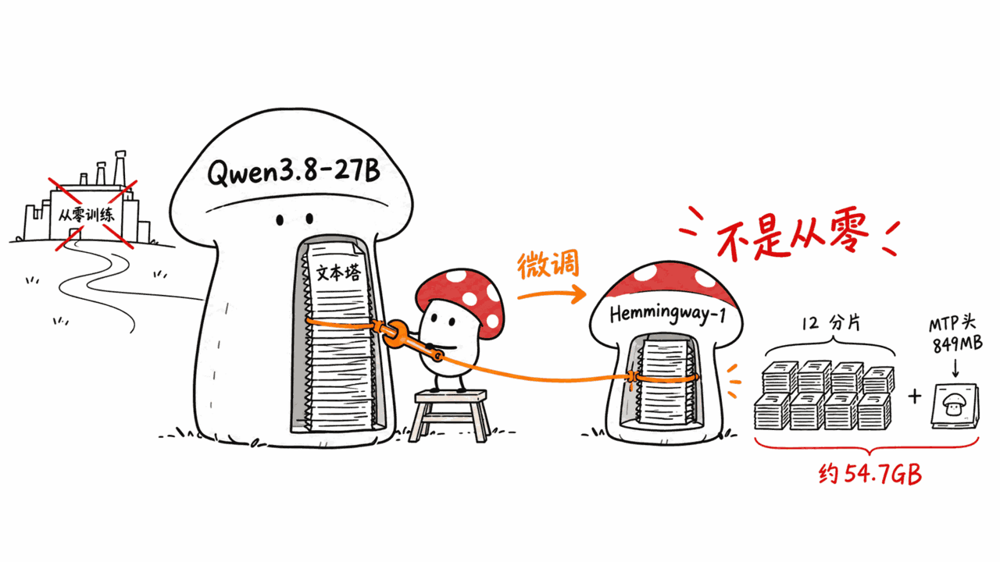
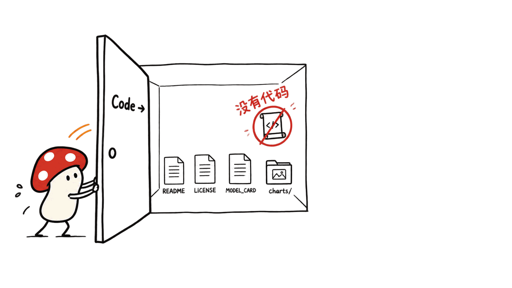
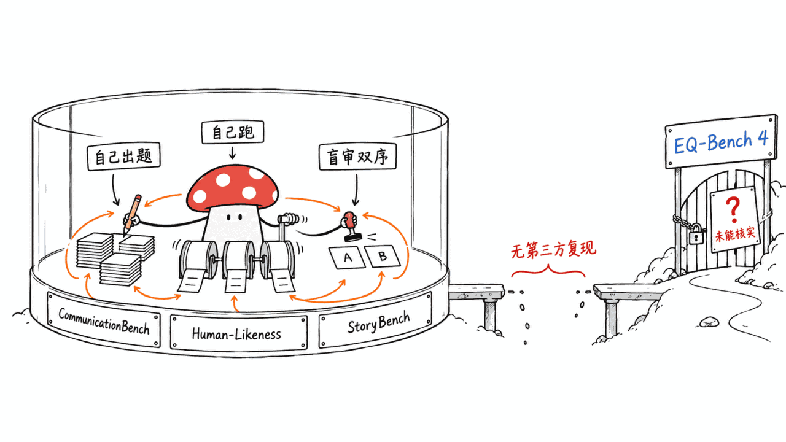
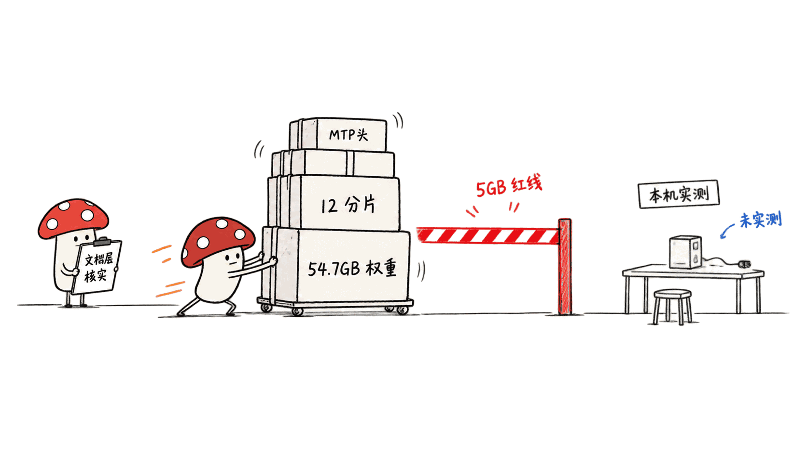

**BLUF**：Hemmingway-1 是初创公司 Altworld 发布的 **27B 参数**文本模型，模型卡明写是 **Qwen3.8-27B** 的微调（`base_model:finetune:Qwen/Qwen3.8-27B`），不是从零训练。权重 12 个 safetensors 分片加一个 MTP 头，总计约 **54.7GB**，超过我们本机（Apple Silicon Mac mini）不下载 5GB 以上权重的红线，所以这篇文章**没有做本地推理实测**，只做文档层核实。模型卡里三项拿来打广告的榜单——CommunicationBench、Human-Likeness、StoryBench——README 自己承认是「我们建的、我们跑的」，没有第三方复现；唯一一个公开的外部榜单 EQ-Bench 4，我们没能在 eqbench.com 首页找到 Hemmingway-1 的名字，未能独立核实。它的 GitHub「Code →」入口点开后只有三份文档和一个图表目录，**没有任何训练或推理代码**。结论：不是空气项目——权重、官网、Mac/Android 客户端、Product Hunt 页面都是真的——但「打赢 GPT-6 Astra 五十分」这类说法目前只能算它自己的一面之词。

> 📌 一手资料
> 模型卡：https://huggingface.co/Altworld/Hemmingway-1
> HF API：https://huggingface.co/api/models/Altworld/Hemmingway-1
> GitHub：https://github.com/lukeckprobierts/Hemmingway-1
> 基座模型：https://huggingface.co/Qwen/Qwen3.8-27B
> 官网：https://hemmingway.io

---

## 为什么 Mycelium Protocol 要看这个模型？

我们平时拆的模型大多是「能不能在本地跑起来」，这次不一样：Hemmingway-1 的权重体积（约 54.7GB）直接超出了本机 Mac mini 不下载 5GB 以上文件的规则，没法做实测。但它的营销打法很值得拆一遍——一个两天前才创建的模型仓库，配上专门的官网、Mac/Android 客户端、GitHub 仓库和 Product Hunt 页面，README 里贴满了「打赢 GPT-6 Astra 五十分」「二十六分领先次席」这类具体数字。这类「自建榜单 + 精美图表 + 一键部署命令」的组合，正是我们这个栏目要教读者怎么拆的典型样本：哪些数字是可以核实的一手事实，哪些只是营销话术。

说明：本文所有数字都来自一手资料（HuggingFace API、官方 README、GitHub API、许可证文件），标了「据模型卡」「未能核实」的除外。**我们没有在本机加载或推理这个模型**——bf16 全套权重约 54.7GB，远超我们本机验证的体积上限，所以文中不含任何速度或生成质量的实测结果。

## Hemmingway-1 到底是什么模型？

HuggingFace 模型 API 和官方 README 给出的基本事实：

- **参数量**：safetensors 元数据统计为 **26,895,998,464** 个参数（BF16 存储约 27.32B），和 README 表格里写的「27B」一致
- **基座模型**：HF 标签写明 `base_model:finetune:Qwen/Qwen3.8-27B`——是对 **Qwen/Qwen3.8-27B** 的微调，不是从零训练；README 正文对这一点没有回避，直接写「Built on」表格
- **架构**：`architectures: Qwen3_5ForCausalLM`，`model_type: qwen3_5_text`——基座 Qwen3.8-27B 本身的 pipeline 标签是 `image-text-to-text`（一个多模态模型，709 万下载、1.6 万赞，是真实存在且被广泛使用的模型），Hemmingway-1 只保留并微调了它的**文本塔**
- **License**：Apache-2.0，和基座一致；GitHub 仓库里的 LICENSE 文件是标准 Apache 2.0 全文（11,386 字节），不是占位符
- **权重构成**：12 个 `model-000XX-of-00012.safetensors` 分片 + 一个 849MB 的 `model-mtp.safetensors`（多 token 预测头，继承自 Qwen3.8 系列架构）+ tokenizer，siblings 列表汇总体积约 **54.7GB**
- **上下文窗口**：README 表格写 262,144 tokens，命令行示例里 `vllm serve` 也用了同样的 `--max-model-len`
- **热度**（HF API，2026-09-22 抓取）：下载 **2,745**，赞 **457**；仓库 `lastModified` 是抓取当天，说明模型卡本身还在被编辑
- **年龄**：HF 仓库 `createdAt` 是 **2026-09-20**，也就是说这篇文章发布时，这个模型公开还不到 48 小时

参数量、基座、license 这三项核心事实都能在 HF API 里直接核对，没有夸大。真正需要拆的是它的营销话术和能力证明方式。

## 模型名字暗示的「写作定位」准不准？

**准**，而且模型卡对此非常明确，没有含糊其辞。README 开篇就是「The AI that writes like a person」，标签里带 `creative-writing`，官方给的示例任务是「给房东写一条报修消息」——不是写小说，是**日常应用文**：邮件、短信、给同事的便条、「一直拖着没写的那条消息」。

模型卡自己也划了边界：它在「hostile storytelling」（对抗性故事情节）和「长篇故事段落」上**不如专门的故事模型**，原话是「故事模型在这些方面更强，这很公平」。换句话说，Hemmingway-1 瞄准的不是通用写作或长篇虚构创作，而是「把一个日常沟通意图变成一段能直接发出去的文字」，这和它在测试里强调的「不绕弯子、不给你三个选项加一段说明」是同一个卖点。这个定位判断有模型卡原文支撑，不是我们的臆测。

## GitHub「Code →」链接点开之后是什么？

模型卡顶部有五个链接：Weights、Try it、Mac and Android apps、**Code**、Product Hunt。我们把每一个都核实了一遍，Code 链接是最值得说的一个。

`lukeckprobierts/Hemmingway-1` 这个仓库：

- **创建时间** 2026-09-20，和 HF 模型仓库同一天，`pushed_at` 是抓取当天
- **仓库体积** 678KB（GitHub API 的 `size` 字段，单位 KB）
- **文件列表**：`README.md`、`LICENSE`、`MODEL_CARD.md`，外加一个 `charts/` 目录放模型卡里引用的那几张图表 PNG
- **star 数** 24，fork 数 1，全部来自这两天

也就是说，这个仓库**没有任何训练脚本、推理代码、评测代码**——README 里给的 `vllm serve` 命令和 `transformers` 调用示例，靠的是 `vllm` 和 `transformers` 这两个第三方库本身的通用能力去加载权重，不需要仓库里有任何专属代码。挂着「Code →」的入口，实际内容是三份 Markdown 加几张图。这不代表模型是假的（权重是真实存在的 54.7GB safetensors 文件），但如果你是冲着「看看他们训练/推理代码怎么写」点进去的，会扑空。

## 三项自曝 Benchmark，方法论披露得怎么样？

模型卡用三张图表撑起了大部分卖点：

- **CommunicationBench**：80 道真实写作请求，逐题让两个模型的回答匹配对战，顺序打乱防止评委认出来；声称打赢 Fable 5.1，比 GPT-6 Astra 高 50 分，Kimi K3、GLM-5.3、Grok 4.6、DeepSeek V4 Pro 全部排在后面
- **Human-Likeness**：同样的匹配对战，只问「这两条里哪条像人写的」；声称领先第二名 26 分
- **StoryBench**：故事写作评测，声称和 Kimi K3 持平，明显超过 Qwen3.8-Max 和 DeepSeek V4 Pro，比它自己的基座高 504 分

README 里有一段「小字说明」值得逐字引用：「CommunicationBench、Human-Likeness 和 StoryBench 是我们自己的基准。我们建的，我们跑的，我们把这一点摆在最前面说清楚。每场对战都是盲审，双方顺序都跑过一遍，评委是一个和被评模型都不同的独立模型。」——这个披露本身是诚实的，方法论（盲审、双序、独立评委）也不是敷衍了事。但**没有任何第三方复现或原始对战记录公开**：具体是哪个模型当评委、80 道请求的题目集、每场对战的原始输出，模型卡里都没有链接。换句话说，「怎么测的」说清楚了，但「测的过程」没法让外部核验。

唯一一个不是自建的榜单是 **EQ-Bench 4**——模型卡特意注明「这不是我们的榜单」，声称排在第三，仅次于两个 Opus 版本，领先 GPT-5.5。我们尝试在 eqbench.com 首页核实这个排名，**没能在返回的 HTML 里找到「Hemmingway-1」这个字符串**；该站排行榜数据大概率是前端异步加载的，我们没有进一步用浏览器渲染核实，所以这条**未能独立核实**，不代表它是假的，只代表我们没查到。

## 本机能验证吗？

不能，这是这篇文章最大的局限。

Hemmingway-1 的权重是 12 个 safetensors 分片加一个 MTP 头，siblings 列表汇总的真实体积约 **54.7GB**——这是 HF API 返回的字节数总和，不是估算。对照我们本机（Apple Silicon Mac mini）的规则「不下载 5GB 以上的东西」，这个数字超出了十倍，所以：

- 我们**没有**下载、加载或运行过这个模型的任何一份权重
- README 里贴出的所有对话示例、榜单分数，我们**都没有复现**
- 「它是不是真的写得像人」这个问题，本文**给不出实测答案**，只能核实到「模型卡说了什么、这些话有没有一手依据」这一层

如果你有 48GB 以上统一内存的机器或对应显存的显卡，理论上可以照 README 给的 `vllm serve Altworld/Hemmingway-1 --max-model-len 262144` 命令直接起服务，自己验证。我们目前没有这个条件，如实说明，不硬凑一个「大概会怎样」的结论。

## 两天内 2745 次下载、457 个赞，说明什么？

HF 上「赞」和「下载」是两个不同动作：点赞几乎零成本，下载至少要触发一次 54.7GB 的传输。Hemmingway-1 创建于 2026-09-20，我们 09-22 抓取时是 2,745 次下载、457 个赞——likes 相当于 downloads 的六分之一左右，对一个两天大的仓库来说不算异常悬殊，但结合它同时上线了官网、Mac/Android 客户端、GitHub 仓库和 Product Hunt 页面来看，这更像一次**协同产品发布**（coordinated launch），而不是「模型先火了，团队后面才搭配套设施」。这不构成负面判断——很多正经产品都这么发布——但读者应该知道，热度数字本身也是这场发布营销的一部分，不是独立于宣传之外的「群众自发验证」。

## 和同类写作模型怎么比？

| 项目 | Hemmingway-1 | 说明 |
|---|---|---|
| 参数量 | 27B（safetensors 元数据 26.9B） | 与 README 一致 |
| 基座 | Qwen3.8-27B 文本塔微调 | 非从零训练，HF 标签明确标注 |
| License | Apache-2.0 | 与基座一致，含商用权限 |
| 权重体积 | 约 54.7GB | 12 分片 + MTP 头 |
| 上下文 | 262,144 tokens | README 表格给出 |
| 核心榜单 | CommunicationBench / Human-Likeness / StoryBench | 均为自建自跑，无第三方复现 |
| 外部榜单 | EQ-Bench 4（自称第三） | 未能在 eqbench.com 独立核实 |
| GitHub 仓库内容 | README + LICENSE + MODEL_CARD + 图表 | 无训练/推理代码 |
| 本机可验证性 | 否（本文未实测） | 权重超出 5GB 本地验证上限 |

## 常见问题

**Q：Hemmingway-1 是从零训练的模型吗？**
A：不是。HF 标签明确写着 `base_model:finetune:Qwen/Qwen3.8-27B`，是对 Qwen3.8-27B 文本塔的微调，模型卡自己也没有掩饰这一点。

**Q：它宣称打赢 GPT-6 Astra、Opus 等模型，这个说法可信吗？**
A：这个结论来自模型卡自建的 CommunicationBench 和 Human-Likeness 两个榜单，README 自己承认「我们建的、我们跑的」，没有公开原始对战数据或第三方复现。盲审、双序、独立评委这些方法论细节写得比较清楚，但目前只能算一面之词，不构成独立验证。

**Q：GitHub 上的「Code」链接能看到训练代码吗？**
A：不能。`lukeckprobierts/Hemmingway-1` 仓库只有 README、LICENSE、MODEL_CARD 三份文档和一个图表目录，没有任何训练或推理脚本，跑模型靠的是 `vllm` 和 `transformers` 这两个通用库。

**Q：这是一个骗子项目/刷星项目吗？**
A：证据不支持这个判断。权重是真实存在的 54.7GB safetensors 文件，基座 Qwen3.8-27B 是有 709 万下载的主流模型，官网、Mac/Android 客户端、Product Hunt 页面都能正常访问，License 文件是标准 Apache-2.0 全文。它更准确的定位是：一次营销包装得很完整的产品发布，核心能力证明主要靠自建榜单，用词和数字需要读者自己打折扣看待。

**Q：能在 16GB 或 24GB 的 Mac 上跑吗？**
A：我们没有测试。权重总计约 54.7GB，超出这类机器的统一内存容量，除非等社区出量化版本（目前 HF 上未见）。

## 一手资料

- 模型卡：https://huggingface.co/Altworld/Hemmingway-1
- HF 模型 API：https://huggingface.co/api/models/Altworld/Hemmingway-1
- GitHub 仓库：https://github.com/lukeckprobierts/Hemmingway-1
- GitHub 仓库 API（star/size/创建时间）：https://api.github.com/repos/lukeckprobierts/Hemmingway-1
- 基座模型 Qwen3.8-27B：https://huggingface.co/Qwen/Qwen3.8-27B
- 官网：https://hemmingway.io
- Product Hunt 页面：https://www.producthunt.com/products/hemmingway-ai
- EQ-Bench 官网（未能核实到 Hemmingway-1 排名）：https://eqbench.com/

---

> © 2026 Author: Mycelium Protocol. 本文采用 [CC BY 4.0](https://creativecommons.org/licenses/by/4.0/deed.zh) 授权——欢迎转载和引用，须注明作者姓名及原文链接，不得去除署名后以原创发布。

<!--EN-->

**BLUF**: Hemmingway-1 is a **27B-parameter** text model released by startup Altworld. The model card states plainly that it's a fine-tune of **Qwen3.8-27B** (`base_model:finetune:Qwen/Qwen3.8-27B`), not a from-scratch build. The weights — 12 safetensors shards plus an MTP head — total roughly **54.7GB**, which exceeds our local machine's rule against downloading anything over 5GB, so **this article contains no local inference test**, only documentation-level verification. The model card's three headline benchmarks — CommunicationBench, Human-Likeness, and StoryBench — are, by the README's own admission, "built by us, run by us," with no third-party reproduction available. The one external public benchmark it cites, EQ-Bench 4, could not be independently confirmed: we couldn't find "Hemmingway-1" anywhere in eqbench.com's homepage HTML. Its GitHub "Code →" link opens onto three documentation files and a chart folder — **no training or inference code at all**. Bottom line: this isn't vaporware — the weights, website, Mac/Android apps and Product Hunt page are all real — but claims like "beats GPT-6 Astra by fifty points" are, for now, the company's own word.

> 📌 Primary sources
> Model card: https://huggingface.co/Altworld/Hemmingway-1
> HF API: https://huggingface.co/api/models/Altworld/Hemmingway-1
> GitHub: https://github.com/lukeckprobierts/Hemmingway-1
> Base model: https://huggingface.co/Qwen/Qwen3.8-27B
> Website: https://hemmingway.io

---

## Why Is Mycelium Protocol Looking at This Model?

Most of the models we tear down here are about whether we can run them locally. This one's different: Hemmingway-1's weights (about 54.7GB) blow straight past our local rule of not downloading anything over 5GB, so there's no hands-on test to run. What's worth dissecting instead is the launch playbook — a model repo created two days before this post, paired with a dedicated website, Mac/Android apps, a GitHub repo, and a Product Hunt page, with a README full of specific-sounding numbers like "beats GPT-6 Astra by fifty points" and "twenty-six points clear of the next model." This combination of self-run benchmarks, polished charts, and a one-line deploy command is exactly the pattern this column exists to take apart: which numbers are verifiable primary facts, and which are just marketing copy.

A note on method: every number here comes from a primary source (the HuggingFace API, the official README, the GitHub API, the license file) unless marked "per the model card" or "could not verify." **We did not download, load, or run this model locally.** The full bf16 weight set is about 54.7GB, well past our local verification ceiling, so this post contains no measured speed or generation-quality results.

## What Exactly Is Hemmingway-1?

Basic facts from the HuggingFace model API and the official README:

- **Parameters**: safetensors metadata counts **26,895,998,464** parameters (about 27.32B stored in BF16), matching the "27B" the README's spec table gives.
- **Base model**: the HF tags say `base_model:finetune:Qwen/Qwen3.8-27B` — this is a fine-tune of **Qwen/Qwen3.8-27B**, not trained from scratch. The README doesn't hide this; it's right there in a "Built on" table.
- **Architecture**: `architectures: Qwen3_5ForCausalLM`, `model_type: qwen3_5_text`. The base model, Qwen3.8-27B, is itself tagged `image-text-to-text` — a real, widely used multimodal model with 7.09 million downloads and 16,027 likes. Hemmingway-1 keeps and fine-tunes only its **text tower**.
- **License**: Apache-2.0, matching the base. The LICENSE file in the GitHub repo is the standard Apache 2.0 full text (11,386 bytes), not a placeholder.
- **Weight composition**: 12 `model-000XX-of-00012.safetensors` shards plus an 849MB `model-mtp.safetensors` (a multi-token-prediction head inherited from the Qwen3.8 architecture family), plus tokenizer files. The siblings listing sums to about **54.7GB**.
- **Context window**: the README's spec table lists 262,144 tokens, and the `vllm serve` example command uses the same `--max-model-len`.
- **Traction** (HF API, fetched 2026-09-22): **2,745** downloads, **457** likes. The repo's `lastModified` timestamp is the day of our fetch, meaning the model card itself was still being edited.
- **Age**: the HF repo's `createdAt` is **2026-09-20** — meaning at the time of this article, the model has been public for under 48 hours.

The three core facts — parameter count, base model, and license — all check out directly against the HF API, with no exaggeration. What actually needs unpacking is the marketing copy and how it proves its capabilities.

## Does the Name's "Writing" Framing Hold Up?

**Yes**, and the model card is explicit about it, with no hedging. The README opens with "The AI that writes like a person," carries a `creative-writing` tag, and its example task is drafting a message to your landlord about a broken boiler — not fiction, but **everyday applied writing**: emails, texts, an awkward note to a colleague, "the thing you have been putting off."

The card also draws its own boundary: it says it loses to dedicated story models on "hostile storytelling" and "long story turns," adding that "the story models are better at those, and that is fair." In other words, Hemmingway-1 isn't positioned as a general-purpose or long-form fiction writer — it's aimed at turning an everyday communication intent into a piece of text you can send as-is, which lines up with its stated selling point of not burying the message in commentary and options. This positioning claim has direct support in the model card's own text; it isn't our speculation.

## What's Actually Behind the GitHub "Code →" Link?

The model card's top links are: Weights, Try it, Mac and Android apps, **Code**, and Product Hunt. We checked all five; the Code link is the one most worth flagging.

The `lukeckprobierts/Hemmingway-1` repository:

- **Created** 2026-09-20, the same day as the HF model repo; `pushed_at` is the day we fetched it.
- **Repo size**: 678KB (the GitHub API's `size` field, in KB).
- **File list**: `README.md`, `LICENSE`, `MODEL_CARD.md`, plus a `charts/` folder holding the chart PNGs referenced in the model card.
- **Stars**: 24, forks: 1, all accumulated in the past two days.

In short, this repository **contains no training script, no inference code, no evaluation code**. The `vllm serve` command and `transformers` call shown in the README work because those are general-purpose capabilities of third-party libraries — nothing in the repo itself needs to exist for them to run. The "Code →" entry point resolves to three Markdown files and a handful of images. That doesn't mean the model is fake — the weights are a real, existing 54.7GB set of safetensors files — but if you clicked expecting to see how training or inference was actually implemented, you'll come up empty.

## How Well-Disclosed Are the Three Self-Run Benchmarks?

Three charts carry most of the model card's pitch:

- **CommunicationBench**: 80 real writing requests, each judged head-to-head against another model's answer with order shuffled so the judge can't recognize which is which. Claims wins over Fable 5.1, a 50-point margin over GPT-6 Astra, and places Kimi K3, GLM-5.3, Grok 4.6, and DeepSeek V4 Pro all behind it.
- **Human-Likeness**: the same head-to-head format, asking only "which of these was written by a person." Claims a 26-point lead over the runner-up.
- **StoryBench**: a story-writing evaluation. Claims parity with Kimi K3, a clear lead over Qwen3.8-Max and DeepSeek V4 Pro, and 504 points above its own base model.

One passage in the README's fine print is worth quoting directly: "CommunicationBench, Human-Likeness and StoryBench are our own benchmarks. We built them, we ran them, and we are saying that up front. Every matchup was blind and run in both orders so position could not sway the result, and the judge was a different model from the ones being judged." That disclosure is honest, and the methodology (blind judging, both orders, an independent judge) isn't hand-waved. But **no third-party reproduction or raw matchup transcripts are published**: which model served as judge, the actual set of 80 prompts, and the raw outputs from each matchup are all absent from the model card. The "how it was tested" is spelled out; the "what actually happened during testing" is not independently checkable.

The one benchmark that isn't self-built is **EQ-Bench 4** — the model card explicitly notes "this is not ours" and claims third place, behind two Opus versions and ahead of GPT-5.5. We tried to verify this ranking on eqbench.com and **could not find the string "Hemmingway-1" anywhere in the homepage HTML returned**. That site's leaderboard is likely loaded asynchronously by the frontend, and we did not go further to render it with a browser, so this claim is **unverified** on our end — that doesn't mean it's false, only that we couldn't confirm it.

## Can We Verify Any of This Locally?

No, and that's this article's biggest limitation.

Hemmingway-1's weights — 12 safetensors shards plus an MTP head — sum to a real **54.7GB**, per the HF API's byte counts, not an estimate. Against our local rule of not downloading anything over 5GB, that's roughly ten times over the line. As a result:

- We did **not** download, load, or run any of this model's weights.
- We have **not** reproduced any of the conversation examples or benchmark scores shown in the README.
- We cannot answer "does it actually write like a person" from experience — this post only verifies what the model card says and whether those statements have primary-source backing.

If you have a machine with 48GB or more of unified memory, or equivalent VRAM, you could in principle run the README's `vllm serve Altworld/Hemmingway-1 --max-model-len 262144` command and verify it yourself. We don't currently have that hardware, and we're saying so plainly rather than guessing at what the results would probably look like.

## What Does 2,745 Downloads and 457 Likes in Two Days Tell Us?

On HF, "likes" and "downloads" are different actions: a like costs almost nothing, while a download triggers at least one transfer of 54.7GB. Hemmingway-1 was created 2026-09-20, and at our 09-22 fetch it had 2,745 downloads and 457 likes — likes running at roughly one-sixth of downloads isn't an unusual ratio for a two-day-old repo on its own. But combined with a simultaneous website, Mac/Android apps, GitHub repo, and Product Hunt page, this reads more like a **coordinated launch** than "the model went viral organically and the surrounding infrastructure caught up afterward." That's not itself a negative judgment — plenty of legitimate products launch this way — but readers should know the traction numbers are part of the same launch campaign, not an independent signal separate from the marketing.

## How Does It Compare With Similar Writing Models?

| Item | Hemmingway-1 | Note |
|---|---|---|
| Parameters | 27B (safetensors metadata 26.9B) | Matches the README |
| Base | Qwen3.8-27B, text-tower fine-tune | Not trained from scratch; explicit in HF tags |
| License | Apache-2.0 | Matches base; permits commercial use |
| Weight size | ~54.7GB | 12 shards + MTP head |
| Context | 262,144 tokens | Per README spec table |
| Core benchmarks | CommunicationBench / Human-Likeness / StoryBench | All self-built and self-run, no third-party reproduction |
| External benchmark | EQ-Bench 4 (claimed 3rd place) | Could not independently confirm on eqbench.com |
| GitHub repo contents | README + LICENSE + MODEL_CARD + charts | No training/inference code |
| Locally verifiable | No (not tested in this article) | Weights exceed our 5GB local verification ceiling |

## FAQ

**Q: Was Hemmingway-1 trained from scratch?**
A: No. The HF tags explicitly state `base_model:finetune:Qwen/Qwen3.8-27B` — it's a fine-tune of Qwen3.8-27B's text tower, and the model card itself doesn't obscure this.

**Q: Is its claim of beating GPT-6 Astra, Opus, and others credible?**
A: That conclusion comes from the model card's own CommunicationBench and Human-Likeness benchmarks, which the README admits it "built" and "ran" itself, with no published raw matchup data or third-party reproduction. The disclosed methodology (blind judging, both orders, independent judge) is reasonably thorough, but for now this is one party's own claim, not independently verified.

**Q: Does the GitHub "Code" link show training code?**
A: No. The `lukeckprobierts/Hemmingway-1` repo contains only README, LICENSE, and MODEL_CARD documents plus a chart folder — no training or inference scripts. Running the model relies on the general-purpose `vllm` and `transformers` libraries.

**Q: Is this a scam or a star-farming project?**
A: The evidence doesn't support that conclusion. The weights are a real, existing 54.7GB set of safetensors files, the base model Qwen3.8-27B is a mainstream model with 7.09 million downloads, and the website, Mac/Android apps, and Product Hunt page are all reachable. The license file is standard Apache-2.0 text. A more accurate description: a well-produced product launch whose core capability claims rest mainly on self-built benchmarks, so its language and numbers deserve a discount from readers.

**Q: Can it run on a 16GB or 24GB Mac?**
A: We haven't tested this. The weights total about 54.7GB, beyond what those machines' unified memory can hold, unless a community quantization shows up (none exists on HF as of this writing).

## Primary Sources

- Model card: https://huggingface.co/Altworld/Hemmingway-1
- HF model API: https://huggingface.co/api/models/Altworld/Hemmingway-1
- GitHub repository: https://github.com/lukeckprobierts/Hemmingway-1
- GitHub repository API (stars/size/creation date): https://api.github.com/repos/lukeckprobierts/Hemmingway-1
- Base model Qwen3.8-27B: https://huggingface.co/Qwen/Qwen3.8-27B
- Website: https://hemmingway.io
- Product Hunt page: https://www.producthunt.com/products/hemmingway-ai
- EQ-Bench website (could not confirm Hemmingway-1's ranking): https://eqbench.com/

---

> © 2026 Author: Mycelium Protocol. Licensed under [CC BY 4.0](https://creativecommons.org/licenses/by/4.0/) — free to share and adapt with attribution. You must credit the author and link to the original; removing attribution and republishing as original is not permitted.
