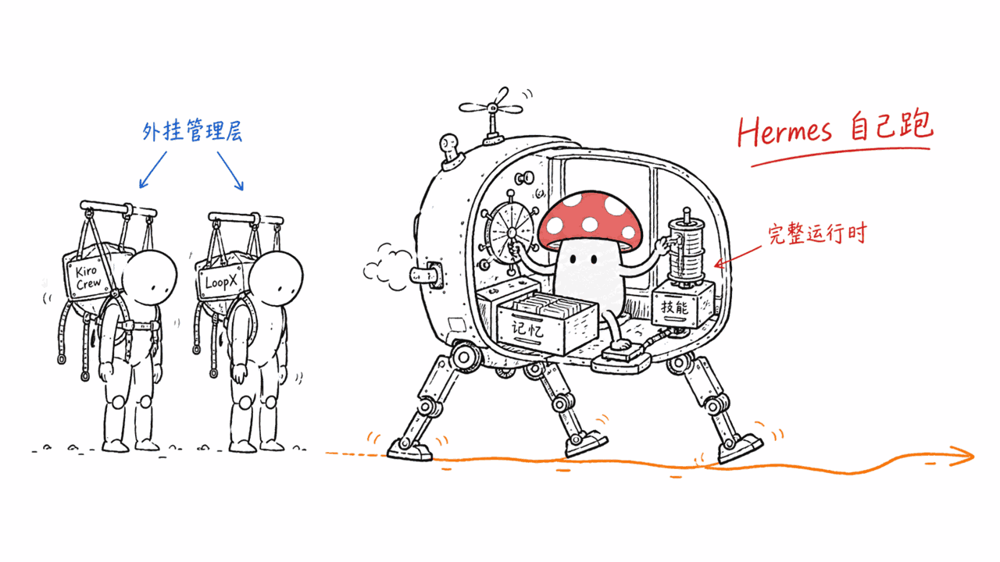
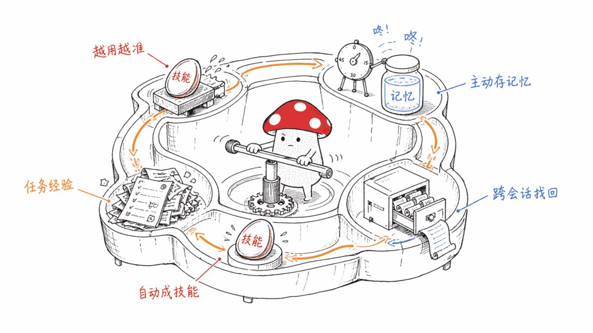
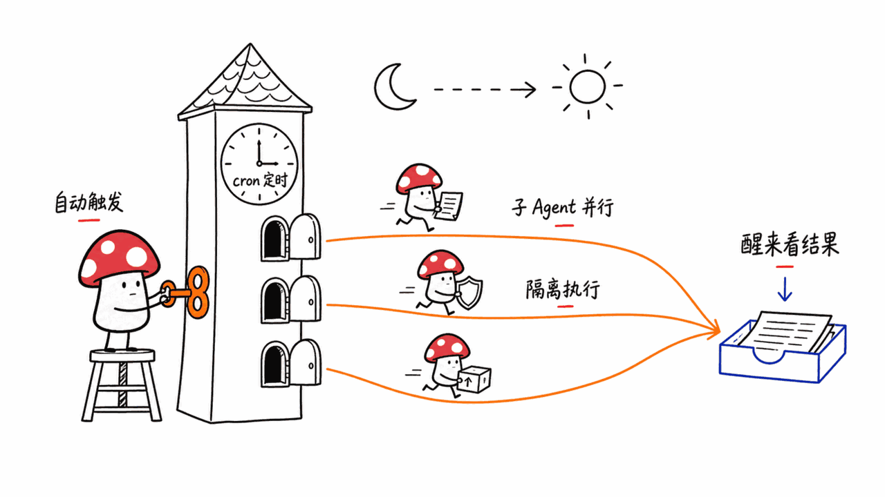
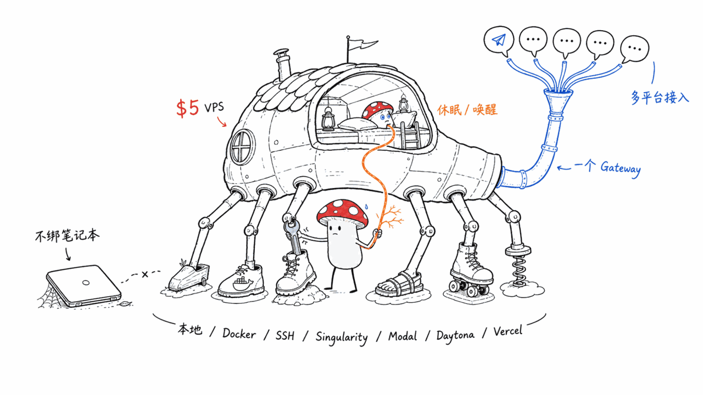

*by Mycelium Protocol*

---

项目地址：https://github.com/NousResearch/hermes-agent
文档：https://hermes-agent.nousresearch.com/docs/
授权：MIT

线索来源：小红书博主"小天fotos"的两条笔记——《多Agent无人值守跑了4天，怎么编排的？》《我的贾维斯开源了，语音交互，多Agent编排》。两条笔记指向的其实是同一个底层项目：一个是拿它做的语音助手二次开发，一个是在讨论它的定时编排能力。回查一手源，就是 Nous Research 做的 Hermes Agent。

---

## 一句话结论

**Hermes Agent 不是挂在别的 Agent 上的一层壳，它自己就是一整个 Agent 运行时**——自己的模型路由、自己的记忆系统、自己的技能系统、自己的 cron 调度、自己的跨平台网关、自己的子 Agent 委派、自己的执行后端。MIT 协议，Python 写的，由 Nous Research（做 Hermes 系列开源模型的那家）维护，仓库星标 23.1 万，昨天（8 月 17 日）还在推送提交。

它的核心卖点用官方原话说是"the only agent with a built-in learning loop"——闭环学习：从任务经验里自动生成技能，技能在使用中自我改进，周期性提醒自己该往长期记忆里存点什么，还能检索自己过去的对话。

---

## 先说清楚：它和本站已经写过的 Kiro Crew、LoopX 不是一回事

这点很重要，不然容易看混。本站之前写过两篇长任务 Agent 相关的文章：

- **Kiro Crew**——是挂在 Kiro（AWS 的 Agentic IDE）之上的**持续工作层**，本质是给已有的编码 Agent 加一个常驻 Gateway 进程，管跨会话记忆、定时任务、审批、多 Agent 协同。
- **LoopX**——是给 Codex / Claude Code / Cursor 这些**已有 Agent 运行时**插的一个**状态内核**，管目标、门控、待办、证据日志，自己不跑任务，只管别人跑任务时别跑偏。

这两个的共同点是：它们都不是 Agent 本体，是**贴在**某个已有 Agent 之上的管理层。

**Hermes Agent 不一样，它就是 Agent 本体。** 你不需要先有一个 Claude Code 或者 Cursor，Hermes 自己就能对话、调工具、跑任务、记记忆。它更像是 Claude Code、OpenClaw 这类完整 Agent 产品的同类项，而不是它们的插件。仓库里甚至直接内置了 `hermes claw migrate`——从 OpenClaw 一键迁移过来的命令，摆明了就是在抢同一个位置。

## 闭环学习：这是它最想让你记住的一件事

官方文档把这套机制叫"closed learning loop"，拆开看是四件事：

1. **任务经验 → 自动生成技能**。复杂任务做完之后，Agent 会自己把这次的做法沉淀成一个可复用的 skill，不需要你手写。
2. **技能在使用中自我改进**。不是生成一次就定型，用得越多，这个 skill 本身会被打磨得更准。
3. **周期性提醒自己存记忆**。Agent 会主动"nudge"自己，判断当前对话里有没有值得长期记住的东西，而不是等你显式说"记住这个"。
4. **跨会话检索**。用 FTS5 全文搜索 + LLM 摘要，能翻自己过去的对话记录，配合 Honcho 项目的"dialectic user modeling"（一种持续建模用户是谁的方法）跨会话理解你是谁。

这套设计还兼容 `agentskills.io` 这个开放标准——巧的是，今天要写的清单里还有一个专门做这个标准的项目 `agentskills/agentskills`，两者算是同一个生态位的呼应。

## "无人值守跑了4天"到底是怎么做到的

回到那条小红书线索本身。Hermes 能无人值守长时间运行，靠的是两个机制叠加：

**内置 cron 调度器**。用自然语言写定时任务——"每天早上发日报""每晚备份""每周做审计"——不需要写 crontab 语法，任务结果可以投递到任何接入的平台（Telegram、Discord 等）。

**子 Agent 委派与并行**。可以派生出隔离的子 Agent 去跑并行的工作流，还能写 Python 脚本通过 RPC 调用工具，把多步流程压缩成"零上下文消耗"的一次调用——意思是编排逻辑本身不占主 Agent 的对话上下文。

这两个机制合起来，就是"睡觉的时候它在后台干活，第二天你在 Telegram 上看结果"这套体验的底层实现。

## 跑在哪：从 5 美元 VPS 到 Serverless 休眠

Hermes 支持 **7 种终端执行后端**：本地、Docker、SSH、Singularity、Modal、Daytona、Vercel Sandbox。其中 Daytona 和 Modal 提供 serverless 持久化——空闲时环境休眠，有请求再唤醒，两次会话之间几乎不产生费用。官方原话是"Run it on a $5 VPS or a GPU cluster"。

它不绑定你的笔记本。你可以在云端 VPS 上跑着它，人在 Telegram 里continue对话——这也是为什么小红书那条"贾维斯"笔记的作者能做出"语音交互 + 多Agent编排"的语音助手：Hermes 自带语音备忘录转写，加一层语音交互壳就是一个贾维斯。

## 模型不锁死，网关不挑平台

**模型层**：用 `hermes model` 随时切换，支持 Nous Portal（官方托管，一份订阅打包模型 + 网页搜索 Firecrawl + 图像生成 FAL + 语音合成 OpenAI + 云端浏览器 Browser Use）、OpenRouter、OpenAI，或者自己的 endpoint，不锁供应商。

**接入层**：一个 Gateway 进程同时接 Telegram、Discord、Slack、WhatsApp、Signal 和本地 CLI，跨平台的对话连续性是打通的——你在 CLI 里聊到一半，可以切到 Telegram 接着聊，上下文不丢。

安装是一行 curl（Linux/macOS/WSL2/Termux）或者 PowerShell 一行命令（原生 Windows，不需要 WSL，安装器会自带一个隔离的 portable Git Bash，不碰你系统已有的 Git）。

## Google Trends 的印证

这条线索不只是小红书一家在说。查这周全球范围内和"AI agent"相关的关联搜索词，"hermes agent""hermes ai""hermes ai agent""hermes" 四个变体同时出现在关联词列表里，搜索量档位（35）和"claude agent"（45）、"ai agent platform"（41）在同一量级——说明这不是小红书局部的信息茧房，是真实的全球关注度上升。

## 谁该看这个

**适合**：想要一个开箱即用的完整 Agent、不想自己拼装记忆系统和调度系统的人；需要 Agent 常驻云端 + 多平台随时接入的场景；已经在用 OpenClaw、想看看迁移路径的人。

**不适合 / 需要注意**：它是一个完整产品而不是一个可以嵌进你现有系统的库，如果你已经有一套编排逻辑（比如已经在用 LoopX 管的长任务流），引入 Hermes 意味着换轨而不是叠加；Windows 上有 antivirus 把它的 `uv.exe` 误报成恶意软件的已知问题，官方给了具体的白名单和签名校验步骤，不是小事，装之前建议看一眼文档里的说明。

---

> © 2026 Author: Mycelium Protocol. 本文采用 [CC BY 4.0](https://creativecommons.org/licenses/by/4.0/deed.zh) 授权——欢迎转载和引用，须注明作者姓名及原文链接，不得去除署名后以原创发布。

<!--EN-->

## TL;DR

**Hermes Agent isn't a shell bolted onto another agent — it is a complete agent runtime in its own right**: its own model routing, its own memory system, its own skill system, its own cron scheduler, its own cross-platform gateway, its own subagent delegation, its own execution backends. MIT licensed, written in Python, maintained by Nous Research (the team behind the Hermes family of open models). 231K stars, still pushing commits as of yesterday (August 17).

Its core pitch, in the project's own words, is being "the only agent with a built-in learning loop" — a closed loop: skills are created automatically from task experience, skills improve themselves during use, the agent periodically nudges itself to persist long-term memory, and it can search its own past conversations.

---

## First, a clarification: it's not the same category as Kiro Crew or LoopX, which this blog already covered

This blog previously covered two long-running-agent projects:

- **Kiro Crew** — a **persistent work layer** on top of Kiro (AWS's agentic IDE): a standing Gateway process bolted onto an existing coding agent, handling cross-session memory, scheduled jobs, approvals, and multi-agent coordination.
- **LoopX** — a **state kernel** plugged into existing agent runtimes like Codex, Claude Code, or Cursor: goals, gates, todos, evidence logs. It doesn't run tasks itself; it just keeps another agent's long tasks on track.

Both are management layers **attached to** an existing agent — neither is the agent itself.

**Hermes Agent is different — it is the agent.** You don't need a Claude Code or Cursor underneath it; Hermes itself converses, calls tools, runs tasks, and remembers things. It's a peer of complete agent products like Claude Code or OpenClaw, not a plugin for them. The repo even ships `hermes claw migrate` — a one-command path to migrate off OpenClaw, making the positioning explicit.

## The closed learning loop: the one thing it most wants you to remember

The docs call this the "closed learning loop," and it breaks into four parts:

1. **Task experience → automatic skill creation.** After a complex task, the agent distills what it just did into a reusable skill on its own — you don't write it by hand.
2. **Skills self-improve during use.** A skill isn't fixed at creation; the more it's used, the more it gets refined.
3. **Periodic self-nudges to persist memory.** The agent proactively judges whether the current conversation holds something worth remembering long-term, rather than waiting for you to say "remember this."
4. **Cross-session recall.** FTS5 full-text search plus LLM summarization lets it dig through its own past conversations, paired with the Honcho project's "dialectic user modeling" — a method for continuously modeling who you are across sessions.

This design is also compatible with the `agentskills.io` open standard — coincidentally, today's list also includes a project built specifically around that standard, `agentskills/agentskills`. The two occupy the same ecological niche.

## How "unattended for 4 days" actually works

Back to the original Xiaohongshu lead. Hermes runs unattended for extended periods through two stacked mechanisms:

**A built-in cron scheduler.** Write scheduled tasks in natural language — "send a daily report every morning," "back up every night," "run a weekly audit" — no crontab syntax required, with results deliverable to any connected platform (Telegram, Discord, etc.).

**Subagent delegation and parallelism.** It can spawn isolated subagents for parallel workstreams, and write Python scripts that call tools via RPC, collapsing multi-step pipelines into "zero-context-cost" calls — meaning the orchestration logic itself doesn't eat into the main agent's conversation context.

Together, these two mechanisms are the underlying implementation of "it works in the background while you sleep, and you see the results on Telegram the next day."

## Where it runs: from a $5 VPS to serverless hibernation

Hermes supports **seven terminal execution backends**: local, Docker, SSH, Singularity, Modal, Daytona, and Vercel Sandbox. Daytona and Modal offer serverless persistence — the environment hibernates when idle and wakes on demand, costing almost nothing between sessions. The project's own line: "Run it on a $5 VPS or a GPU cluster."

It isn't tied to your laptop. You can run it on a cloud VPS and keep talking to it from Telegram — which is exactly how the author of that "Jarvis" Xiaohongshu post built a voice-interactive multi-agent assistant: Hermes ships with voice memo transcription built in, so adding a voice-interaction shell on top gets you a Jarvis.

## Model-agnostic, platform-agnostic

**Model layer**: switch anytime with `hermes model` — supports Nous Portal (officially hosted, one subscription bundling models plus web search via Firecrawl, image generation via FAL, TTS via OpenAI, and a cloud browser via Browser Use), OpenRouter, OpenAI, or your own endpoint. No provider lock-in.

**Access layer**: a single Gateway process reaches Telegram, Discord, Slack, WhatsApp, Signal, and local CLI simultaneously, with cross-platform conversation continuity — start a conversation in the CLI, switch to Telegram, and the context carries over.

Installation is one curl command (Linux/macOS/WSL2/Termux) or one PowerShell line (native Windows, no WSL required — the installer bundles an isolated portable Git Bash that doesn't touch any system Git you already have).

## Corroborated by Google Trends

This isn't just a Xiaohongshu-local phenomenon. Checking this week's worldwide related searches for "AI agent," four variants — "hermes agent," "hermes ai," "hermes ai agent," and "hermes" — all appear in the related-queries list, at a search-volume tier (35) comparable to "claude agent" (45) and "ai agent platform" (41). That's a real global attention bump, not an information bubble local to one platform.

## Who should look at this

**Good fit**: anyone who wants a complete, ready-to-use agent without assembling their own memory and scheduling stack; scenarios needing an agent that stays resident in the cloud and reachable from multiple platforms; anyone already on OpenClaw curious about a migration path.

**Not a fit / worth noting**: it's a complete product, not a library you drop into an existing system — if you already have orchestration logic (say, long tasks already managed by LoopX), adopting Hermes means switching tracks, not stacking on top. There's a known issue where some Windows antivirus software false-flags its `uv.exe`; the project provides specific whitelisting and signature-verification steps, and it's worth reading before installing, not something to skip.

---

> © 2026 Author: Mycelium Protocol. Licensed under [CC BY 4.0](https://creativecommons.org/licenses/by/4.0/) — free to share and adapt with attribution. You must credit the author and link to the original; removing attribution and republishing as original is not permitted.
