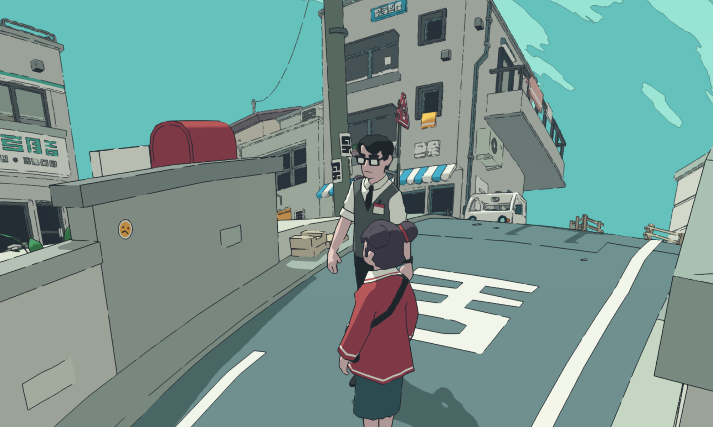

看到一款网页游戏做得很顺滑，第一反应是：**它用了什么？**

[messenger.abeto.co](https://messenger.abeto.co) 是一款运行在浏览器里的卡通风格 3D 多人游戏——日系街道、卡通描边、景深虚化、多人实时同步，全部跑在一个网页里，不需要下载任何客户端。

我对它做了完整的逆向分析，下面把技术栈、渲染原理、开发路线全部拆开讲清楚。

---

## 游戏截图



卡通风格的亚洲街道场景，角色有描边轮廓，天空用扁平色块处理，光影只有几个色阶——这是典型的 **Toon Shading（卡通渲染）** 风格，用 Three.js 的 `MeshToonMaterial` 配合自定义 `gradientMap` 实现。

---

## 完整技术栈拆解

### 核心渲染层

| 技术 | 版本 | 作用 |
|------|------|------|
| **Three.js** | r180 | WebGL 3D 渲染引擎 |
| **postprocessing**（pmndrs） | latest | 高性能后处理管线 |
| **three-mesh-bvh** | latest | BVH 加速碰撞/射线检测 |

主包约 **1.9MB**（Gzip 后 ~500KB），全部用 Vite 打包、Cloudflare Pages CDN 分发。

### UI 框架 & 构建

```
Svelte 5（Runes 模式）  →  UI 层，响应式状态管理
Vite                   →  构建、Code Splitting、Hash 命名
```

Svelte 5 的 runtime 只有 16KB，轻量且适合和 Three.js 并列使用。

### 3D 资产管线

```
GLTFLoader + DRACOLoader  →  压缩 .glb 模型（体积减 60-80%）
KTX2Loader                →  GPU 直接解码纹理（.ktx2/.basis）
```

所有 3D 模型走 Draco 压缩，纹理用 KTX2/Basis 格式，这是资产体积最小、加载最快的组合。

### 后处理效果——画面丝滑的关键

游戏画面的"电影感"来自 [pmndrs/postprocessing](https://github.com/pmndrs/postprocessing)，不是 Three.js 自带的 EffectComposer（后者性能差很多）：

```js
import {
  EffectComposer,
  BloomEffect,         // 发光辉光
  DepthOfFieldEffect,  // 景深虚化
  SMAAEffect,          // 高质量抗锯齿
  ToneMappingEffect,
} from 'postprocessing';

const composer = new EffectComposer(renderer);
composer.addPass(new RenderPass(scene, camera));
composer.addPass(new EffectPass(camera,
  new BloomEffect({ intensity: 0.4, luminanceThreshold: 0.6 }),
  new DepthOfFieldEffect(camera, { focusDistance: 0.02, bokehScale: 3 }),
  new SMAAEffect(),
));
```

pmndrs/postprocessing 的核心优势：**多个 Effect 合并成一个 Pass**，大幅减少 GPU 切换开销。

额外还用了：
- **TAA**（时序抗锯齿）— 静止画面继续累积样本，越静越清晰
- **SAO**（环境遮蔽）— 角落变暗，增加立体感
- **CSM**（级联阴影贴图）— 大场景高质量阴影

---

## 卡通渲染实现

这是游戏最有特色的部分。Three.js 内置 `MeshToonMaterial`，配合 5 级灰度渐变贴图就能实现：

```js
// 生成 5 级色阶贴图（关键！）
const format = renderer.capabilities.isWebGL2
  ? THREE.RedFormat
  : THREE.LuminanceFormat;

const colors = new Uint8Array([51, 102, 153, 204, 255]); // 5级
const gradientMap = new THREE.DataTexture(colors, 5, 1, format);
gradientMap.needsUpdate = true;

const material = new THREE.MeshToonMaterial({
  color: 0xcc3333,       // 卡通红色
  gradientMap,           // 限定色阶数量
});
```

角色描边用 BackSide 双 Pass 技巧：

```js
// Pass 1：法线方向膨胀的黑色背面
const outlineMat = new THREE.MeshBasicMaterial({
  color: 0x000000,
  side: THREE.BackSide,
});
const outline = new THREE.Mesh(geometry, outlineMat);
outline.scale.setScalar(1.02); // 膨胀 2%
scene.add(outline);

// Pass 2：正常渲染正面
scene.add(new THREE.Mesh(geometry, toonMaterial));
```

---

## 渲染性能优化

### InstancedMesh：场景里同类物体必须用

```js
// 100 栋楼 = 1 次 DrawCall
const matrix = new THREE.Matrix4();
const mesh = new THREE.InstancedMesh(buildingGeo, buildingMat, 100);

for (let i = 0; i < 100; i++) {
  matrix.setPosition(x, y, z);
  mesh.setMatrixAt(i, matrix);
}
scene.add(mesh);
```

### BVH 加速碰撞检测

```js
import { MeshBVH, acceleratedRaycast } from 'three-mesh-bvh';

THREE.Mesh.prototype.raycast = acceleratedRaycast;
geometry.boundsTree = new MeshBVH(geometry); // 一次性预计算

// 后续 raycast 速度提升 50-100 倍
raycaster.intersectObject(mesh);
```

### LOD（远近精度切换）

```js
const lod = new THREE.LOD();
lod.addLevel(highDetailMesh, 0);   // 0-20m 高精度
lod.addLevel(midDetailMesh, 20);   // 20-50m 中精度
lod.addLevel(lowDetailMesh, 50);   // 50m+ 低精度
scene.add(lod);
```

---

## 多人联机架构

WebSocket 服务器部署在 `wss://multiplayer-server-76608060529.us-central1.run.app`（Google Cloud Run）。架构是标准的**服务端权威模式**：

```
客户端预测输入（本地立刻响应）
    ↓
发送输入事件给服务器
    ↓
服务器广播权威状态给所有客户端
    ↓
客户端用插值修正误差（不闪）
```

客户端插值是顺滑感的关键，用 Three.js 内置的 `damp` 函数而不是直接 set：

```js
import { damp } from 'three/src/math/MathUtils';

// 每帧调用，平滑追踪目标位置
mesh.position.x = damp(mesh.position.x, targetX, 8, delta);
mesh.position.z = damp(mesh.position.z, targetZ, 8, delta);
mesh.rotation.y = damp(mesh.rotation.y, targetRot, 6, delta);
```

---

## 物理与碰撞

游戏没有引入 Rapier/Cannon 等独立物理引擎，而是用 **three-mesh-bvh 做自定义碰撞**——这对于这类不需要复杂刚体模拟的游戏是正确选择，省去了 WASM 引擎的加载开销。

渲染循环和物理更新解耦，固定步长保证确定性：

```js
const FIXED_DT = 1 / 60;
let accumulator = 0;

function gameLoop(dt) {
  accumulator += dt;
  while (accumulator >= FIXED_DT) {
    updatePhysics(FIXED_DT);   // 60Hz 固定步长
    accumulator -= FIXED_DT;
  }
  const alpha = accumulator / FIXED_DT;
  render(alpha); // 插值比例传给渲染
}
```

---

## 3D 空间音效

用 Three.js 内置的 `PositionalAudio` + Web Audio API：

```js
const listener = new THREE.AudioListener();
camera.add(listener);

const sound = new THREE.PositionalAudio(listener);
sound.setBuffer(audioBuffer);
sound.setRefDistance(5);     // 5 单位内最响
sound.setRolloffFactor(2);   // 衰减速度
mesh.add(sound); // 绑定到 3D 物体，跟随移动
```

---

## 资产压缩工具链

```bash
# 模型压缩（必须做，体积减 60-80%）
npx gltf-pipeline -i model.glb -o model.draco.glb \
  --draco.compressionLevel=7

# 纹理压缩（GPU 直接解码，省显存）
npx ktx2 create --encode etc1s \
  --clevel 4 texture.png texture.ktx2

# 批量压缩所有模型
for f in assets/models/*.glb; do
  npx gltf-pipeline -i "$f" -o "${f%.glb}.draco.glb" \
    --draco.compressionLevel=7
done
```

---

## 完整技术选型总结

```
渲染引擎     Three.js r180
后处理       pmndrs/postprocessing（不要用 Three 自带的）
碰撞加速     three-mesh-bvh
UI 框架      Svelte 5（轻量，与 Three.js 配合好）
构建工具     Vite
模型格式     GLTF + Draco 压缩
纹理格式     KTX2 / Basis
联机协议     WebSocket（ws npm 包）
前端部署     Cloudflare Pages（免费 CDN）
WS 服务器    Google Cloud Run（按需扩缩，免费层够用）
```

---

## 开发路线建议

如果你从零开始做这样的游戏，推荐按以下顺序：

1. **先跑通 Three.js 基础场景**（相机、灯光、一个 GLTF 模型）
2. **加 MeshToonMaterial**，调出卡通风格
3. **加 postprocessing**，调 Bloom + SMAA
4. **加角色控制**（键盘输入 + BVH 碰撞）
5. **加 WebSocket 服务器**（Node.js + ws，本地先跑通）
6. **资产压缩**（Draco + KTX2，最后做）
7. **部署**：Vite build → Cloudflare Pages，WS → Cloud Run

每一步都是独立可验证的，不要一次性堆所有功能。

---

## 为什么"顺滑"：5 个决定性因素

做出这类游戏的人很多，但真正顺滑的很少。核心差距在以下 5 点：

### ① 后处理用 pmndrs/postprocessing，不要用 Three.js 原生

Three.js 自带的 `EffectComposer` 每个效果独立一个 Pass，每 Pass 都要读写 framebuffer，GPU 开销翻倍。pmndrs/postprocessing 把所有效果合并成一个 Pass：

```js
import { EffectComposer, BloomEffect, SMAAEffect, DepthOfFieldEffect } from 'postprocessing';

// 一个 EffectPass = 一次 GPU draw，不论叠了几个效果
composer.addPass(new EffectPass(camera,
  new BloomEffect({ intensity: 0.4, luminanceThreshold: 0.6 }),
  new DepthOfFieldEffect(camera, { focusDistance: 0.02, bokehScale: 3 }),
  new SMAAEffect(),
));
```

这一个选择就能让帧率提升 20-40%。

### ② 资产压缩是帧率和加载速度的保障

模型和纹理不压缩，首屏加载就会卡住，手机显存也撑不住：

```bash
# 模型 Draco 压缩（体积减 60-80%，CPU 解压几乎无感知）
npx gltf-pipeline -i scene.glb -o scene.draco.glb --draco.compressionLevel=7

# 纹理 KTX2 压缩（GPU 直接解码，省显存 4-8 倍）
npx ktx2 create --encode etc1s --clevel 4 albedo.png albedo.ktx2
```

messenger.abeto.co 的主包 1.9MB Gzip 后只有 ~500KB，模型和纹理分包异步加载，所以首屏 3 秒内就能进游戏。

### ③ InstancedMesh 把 DrawCall 压到最低

场景里每个独立 Mesh 都是一次 DrawCall，100 栋楼 = 100 次。换成 InstancedMesh：

```js
// 100 栋楼 → 1 次 DrawCall，GPU 利用率提升 10 倍
const mesh = new THREE.InstancedMesh(buildingGeo, buildingMat, 100);
const matrix = new THREE.Matrix4();
for (let i = 0; i < 100; i++) {
  matrix.setPosition(posX[i], 0, posZ[i]);
  mesh.setMatrixAt(i, matrix);
}
mesh.instanceMatrix.needsUpdate = true;
scene.add(mesh);
```

### ④ 联机用服务端权威 + 客户端插值，绝对不要直接 set position

网络延迟无法消除，但可以让它"看不见"。messenger.abeto.co 的 WebSocket 服务器（`wss://multiplayer-server-76608060529.us-central1.run.app`，Google Cloud Run）用的是标准服务端权威模式：

```
客户端按键 → 立即本地预测移动（不等服务器）
         → 同时发送输入给服务器
服务器   → 计算权威状态 → 广播给所有客户端
客户端   → 收到权威状态 → 用 damp 平滑插值到正确位置
```

插值代码——必须用 `damp`，不能用 `position.copy()`：

```js
import { damp } from 'three/src/math/MathUtils';

// 每帧调用：smoothing=8 表示 ~1/8 秒追上目标
mesh.position.x = damp(mesh.position.x, serverX, 8, delta);
mesh.position.z = damp(mesh.position.z, serverZ, 8, delta);
mesh.rotation.y = damp(mesh.rotation.y, serverRot, 6, delta);
```

直接 `position.copy(serverState)` 会在每次网络包到达时"跳帧"，即使 60fps 也看起来很卡。

### ⑤ 渲染循环和物理更新分离，固定步长

变帧率下做物理会出现穿墙、抖动等问题。正确做法是固定物理步长，渲染插值：

```js
const FIXED_DT = 1 / 60; // 物理 60Hz
let accumulator = 0;

function tick(now) {
  const dt = Math.min((now - lastTime) / 1000, 0.05); // 最大 50ms 防爆
  lastTime = now;
  accumulator += dt;

  while (accumulator >= FIXED_DT) {
    updatePhysics(FIXED_DT); // 确定性物理
    accumulator -= FIXED_DT;
  }

  const alpha = accumulator / FIXED_DT; // 渲染插值比例
  render(alpha);
  requestAnimationFrame(tick);
}
```

这样物理在 60Hz 固定运行，渲染在 144Hz 显示器上也不会出现抖动。

---

## 最小可行技术栈

如果你要从零开始复刻这类游戏，这是最精简的起步组合：

```
Three.js r180              核心渲染
pmndrs/postprocessing      后处理（Bloom + SMAA 起步）
three-mesh-bvh             碰撞检测（不需要物理引擎）
Svelte 5 或 vanilla JS     UI 层
Vite                       构建工具
ws（npm）                  WebSocket 服务器
Cloudflare Pages           前端部署（免费）
Google Cloud Run           WS 服务器（免费层每月 200 万请求）
```

3D 素材格式：GLTF + Draco 压缩 + KTX2 纹理。

---

这类游戏的核心不在于引擎，而在于**后处理管线的调教 + 资产管线的工程化**。引擎本身（Three.js）只是工具，真正拉开差距的是这 5 个细节的执行质量。

<!--EN-->

## How to Develop a WebGL Game: Reverse-Engineering messenger.abeto.co

A complete guide to building a smooth, cartoon-style 3D multiplayer web game by reverse-engineering the tech stack of [messenger.abeto.co](https://messenger.abeto.co) — Three.js r180, postprocessing, Svelte 5, WebSocket, and Google Cloud Run.

### Tech Stack Summary

| Layer | Technology |
|-------|-----------|
| 3D Renderer | Three.js r180 |
| Post-processing | pmndrs/postprocessing |
| Collision | three-mesh-bvh |
| UI Framework | Svelte 5 |
| Build Tool | Vite |
| Multiplayer | WebSocket → Google Cloud Run |
| CDN | Cloudflare Pages |

The key insight: the smooth cinematic feel comes from **pmndrs/postprocessing** (Bloom + Depth of Field + SMAA + TAA combined in a single GPU pass), not from the renderer itself. Combined with **MeshToonMaterial** + gradient maps for cel-shading and **InstancedMesh** for scene objects, you get a production-quality WebGL game that loads in under 3 seconds.
