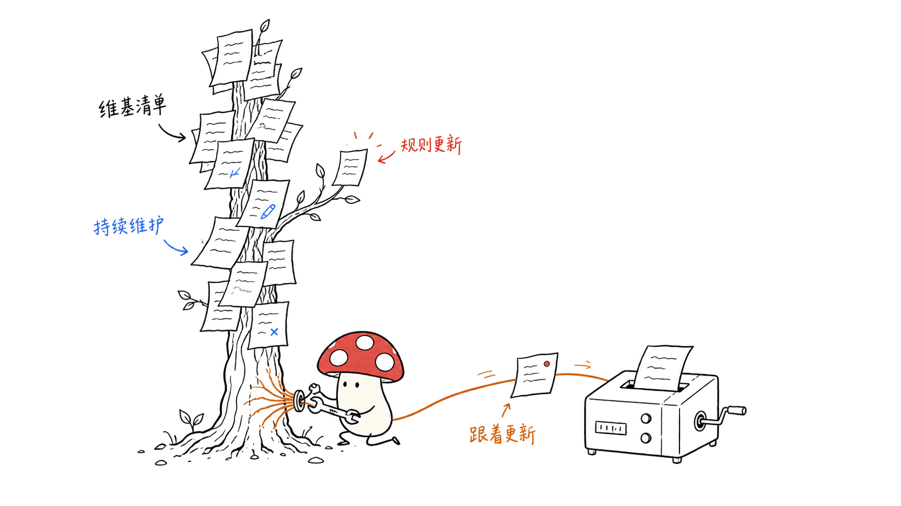
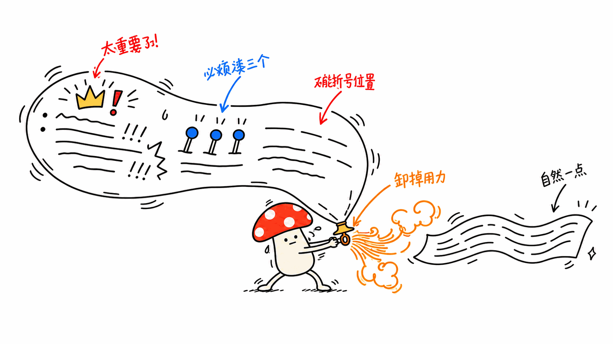

*by Mycelium Protocol*

---

项目地址：https://github.com/blader/humanizer
方法依据：维基百科 WikiProject AI Cleanup《Signs of AI writing》 https://en.wikipedia.org/wiki/Wikipedia:Signs_of_AI_writing
授权：MIT

---

## 一句话结论

**Humanizer 不是一个 App，是一份纯 Markdown 写的 Skill 文件**（`SKILL.md`），装进任何支持 Skill 的 Agent 就能用——Claude Code、Claude Desktop 等。它做的事很单一：**把读起来像 AI 生成的文字，改写得不像，但保留原作者的事实、含义和语气。** MIT 协议，36120 star，是今天写的几个项目里星标最高的一个。

## 不是拍脑袋定义"AI 味"，是抄维基百科的作业

这个项目最聪明的地方，不是它自己发明了一套"怎样才算 AI 味"的标准，而是**直接用维基百科 WikiProject AI Cleanup 维护的《Signs of AI writing》清单**——这是一群志愿者专门盯着维基百科词条里的 AI 生成痕迹、持续更新的一份权威参考。项目引用了这份文档的核心论点：

> "大语言模型用统计算法猜下一个词该是什么。结果趋向于适用最广泛情况的、统计上最可能的那个答案。"

站在一份被持续维护、有社区共识的清单上做事，比自己拍一套规则要靠谱得多——这份清单会随着 AI 写作特征的演变而更新，Humanizer 也就跟着更新，不需要自己重新总结。



## 35 种模式，几个最典型的

清单分三类：内容层面（虚假重要性、堆砌形容词式的浅层分析、销售话术）、语言语法层面（"不是X而是Y"句式、被动语态、名称反复变换）、风格层面（破折号泛滥、加粗小标题、表情符号、标题用 Title Case）。挑几个最一眼能认出来的：

| 模式 | 改前 | 改后 |
|---|---|---|
| 夸大重要性 | "marking a pivotal moment in the evolution of..." | "was established in 1989 as part of a wider decentralization" |
| 浅层 -ing 分析 | "symbolizing... reflecting... showcasing..." | 只保留原文能支撑的内容 |
| 强行三件套 | "innovation, inspiration, and insights" | 该几个词就几个词，不硬凑三个 |
| 破折号泛滥 | "institutions—not the people—yet this continues—" | 改用句号、逗号、冒号或括号 |
| 加粗小标题列表 | "**Performance:** Performance improved" | 列表不产生信息量时直接改成散文 |
| 制造假的深刻 | "At its core, what matters is..." | 直接说重点，不绕这层壳 |
| 强行制造金句碎片 | "It had no preference. No prior. No nostalgia." | 用自然的句长和具体的陈述 |

看这几个例子会发现一个共同点：**AI 写作特征往往不是"写错了"，是"写得太用力"**——每句话都想显得重要、每个列举都想凑够三个、每个转折都想加个破折号强调。Humanizer 干的事是把这层"用力过猛"卸掉。



## 流程：先改，再查，再定稿

三步走：先起草一版改写；检查这版改写里**还有没有残留的 AI 写作模式**，同时检查**有没有在改写过程中悄悄篡改了原意**；确认没问题再定稿。

**明确不做的事**：不发明事实、姓名、日期、引语、引用。任何改写里新增的细节，必须来自原文或者作者本人提供的信息——这条边界写得很硬，避免"为了让文字更自然"反而编造内容。


## 语气匹配：给个样本，照着你的调调改

如果你想让改写结果贴近自己的写作习惯，可以先粘贴 2-3 段自己的文字当样本，Humanizer 会匹配这段样本的节奏、用词、标点习惯和"故意的怪癖"，再去改写目标文本——不是套用一个通用的"人类文风模板"，是学你自己的。


## 三种安装方式

```bash
# Skills CLI，全局安装
npx skills add blader/humanizer --global

# Claude Code 插件市场
/plugin marketplace add blader/humanizer
/plugin install humanizer@humanizer

# 手动：把 SKILL.md 扔进任意 Agent 的技能目录
git clone https://github.com/blader/humanizer.git /path/to/your/skills/humanizer
```

## 谁该看这个

**适合**：日常大量用 AI 辅助写作、但不希望文字读起来一股统一的"AI 腔"的人；需要把内部文档、公开博客、社交文案过一道"去味"处理的场景。

**不适合 / 需要注意**：它改的是文风，不是事实核查工具——原文如果本身有错误，Humanizer 不会帮你纠正，它明确的边界就是"不改变事实，只改怎么说"。

---

> © 2026 Author: Mycelium Protocol. 本文采用 [CC BY 4.0](https://creativecommons.org/licenses/by/4.0/deed.zh) 授权——欢迎转载和引用，须注明作者姓名及原文链接，不得去除署名后以原创发布。

<!--EN-->

## TL;DR

**Humanizer isn't an app — it's a skill written in plain Markdown** (`SKILL.md`) that installs into any skill-compatible agent: Claude Code, Claude Desktop, and others. What it does is narrow and specific: **rewrite text that sounds AI-generated so it doesn't, while keeping the original writer's facts, meaning, and voice.** MIT licensed, 36,120 stars — the highest star count of anything covered today.

## Not inventing "AI-ness" from scratch — borrowing Wikipedia's homework

The cleverest part of this project isn't that it invented its own definition of "sounds like AI." It's that it **directly uses the "Signs of AI writing" catalog maintained by Wikipedia's WikiProject AI Cleanup** — a group of volunteers who continuously track AI-generation traces in Wikipedia articles and keep an authoritative, living reference updated. The project quotes the document's core argument:

> "LLMs use statistical algorithms to guess what should come next. The result tends toward the most statistically likely result that applies to the widest variety of cases."

Building on a continuously maintained list with community consensus is far more reliable than inventing your own rulebook — the list evolves as AI writing tells evolve, and Humanizer evolves with it without having to re-derive its own taxonomy.


## 35 patterns, a few of the most recognizable

The catalog splits into three categories: content-level (inflated importance, shallow -ing analysis stacked as adjectives, sales language), language/grammar-level ("not X but Y" constructions, passive voice, shifting names), and style-level (dash overuse, bold mini-headings, emoji, Title Case headings). A few of the most instantly recognizable:

| Pattern | Before | After |
|---|---|---|
| Inflated importance | "marking a pivotal moment in the evolution of..." | "was established in 1989 as part of a wider decentralization" |
| Shallow -ing analysis | "symbolizing... reflecting... showcasing..." | Keep only what the source supports |
| Forced groups of three | "innovation, inspiration, and insights" | Use the number of items the meaning actually needs |
| Dash overuse | "institutions—not the people—yet this continues—" | Switch to periods, commas, colons, or parentheses |
| Bold mini-heading lists | "**Performance:** Performance improved" | Use prose when a list adds no value |
| Manufacturing false depth | "At its core, what matters is..." | State the point directly, skip the framing |
| Forced punchline fragments | "It had no preference. No prior. No nostalgia." | Use natural sentence lengths and specific claims |

The common thread across these examples: **AI writing tells usually aren't "wrong" — they're "trying too hard."** Every sentence reaches to sound important, every list strains to hit exactly three items, every transition wants a dash for emphasis. What Humanizer does is take that strain out.


## The process: rewrite, check, finalize

Three steps: draft a rewrite; check that draft for **remaining AI writing patterns** and, separately, for **any claims that quietly changed meaning during the rewrite**; finalize only once both checks pass.

**Explicitly out of scope**: it does not invent facts, names, dates, quotes, or citations. Any detail added during rewriting must come from the source text or from the writer directly — a hard boundary meant to prevent "making the prose sound more natural" from sliding into fabrication.


## Voice matching: give it a sample, it follows your cadence

If you want the rewrite to match your own writing habits, paste 2-3 paragraphs of your own writing as a sample first. Humanizer matches that sample's rhythm, word choice, punctuation habits, and deliberate quirks before rewriting the target text — not a generic "human writing template," but learning from you specifically.


## Three ways to install

```bash
# Skills CLI, global install
npx skills add blader/humanizer --global

# Claude Code plugin marketplace
/plugin marketplace add blader/humanizer
/plugin install humanizer@humanizer

# Manual: drop SKILL.md into any agent's skills folder
git clone https://github.com/blader/humanizer.git /path/to/your/skills/humanizer
```

## Who should look at this

**Good fit**: anyone who writes a lot with AI assistance day-to-day but doesn't want everything to read with the same flattened "AI voice"; scenarios needing a pass over internal docs, public blog posts, or social copy to strip that tell.

**Not a fit / worth noting**: it changes prose style, not a fact-checker — if the source text has errors, Humanizer won't correct them. Its explicit boundary is "change how it's said, not what's true."

---

> © 2026 Author: Mycelium Protocol. Licensed under [CC BY 4.0](https://creativecommons.org/licenses/by/4.0/) — free to share and adapt with attribution. You must credit the author and link to the original; removing attribution and republishing as original is not permitted.
