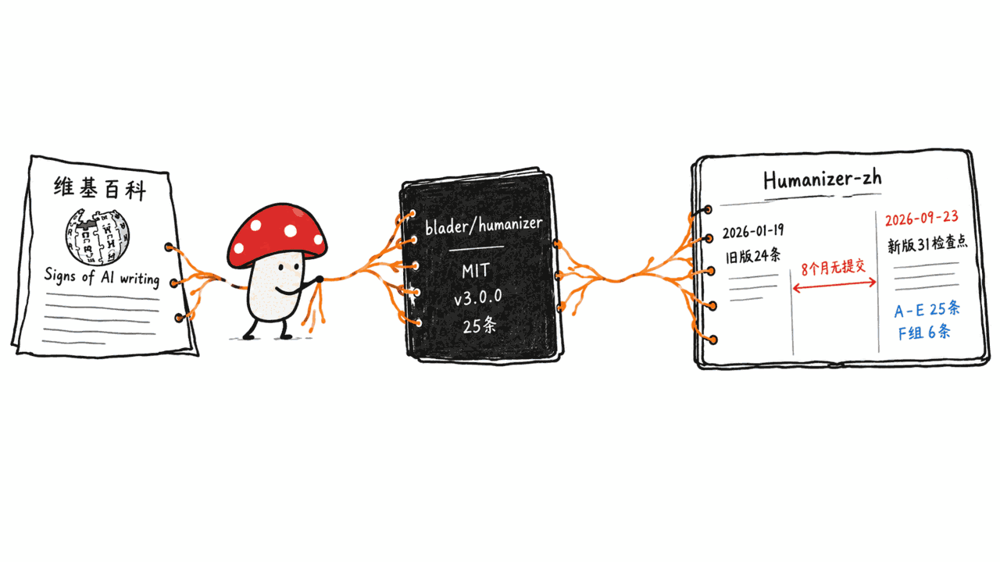
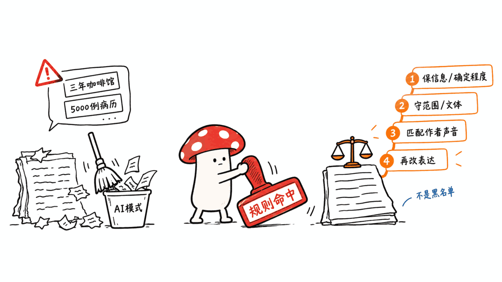
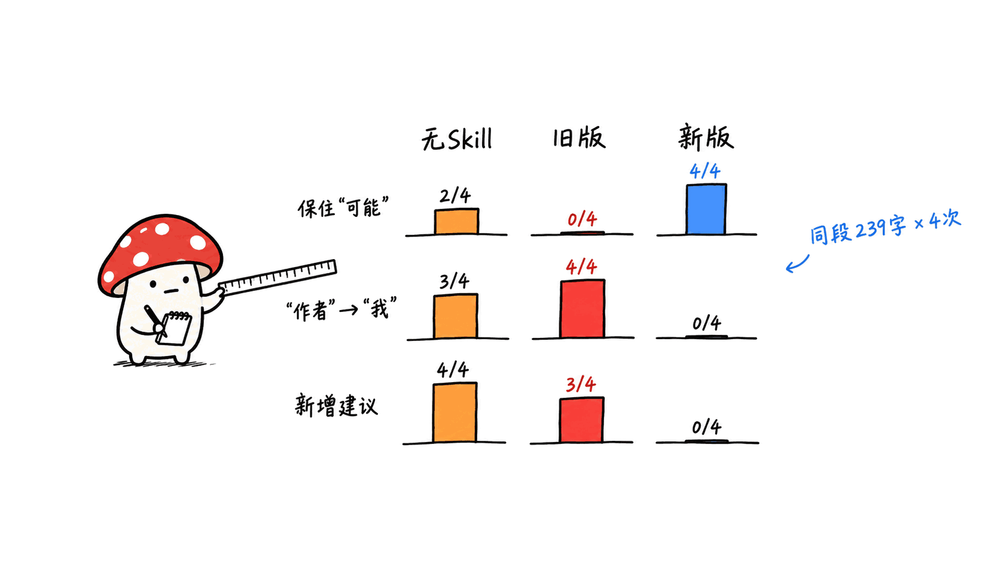
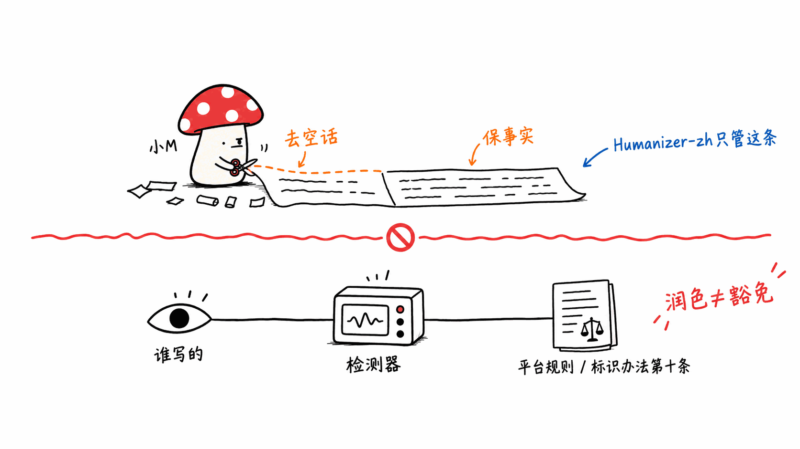

**BLUF**：Humanizer-zh 是一份纯 Markdown 的 Claude Code Skill，把英文项目 blader/humanizer 的「去除 AI 写作痕迹」规则移植到中文。今天（2026-09-23，UTC 02:24）它刚被整体重写：此前 8 个多月没有任何维护者提交，旧版 24 条规则里有几条是从英文硬搬的，示例还会替作者「编」事实；新版改成 31 个检查点，并把「不增加事实、不把可能改成确定」放到规则之首。我用同一段 239 字的测试文字，在本机分别跑了「无 Skill」「旧版」「新版」各 4 次：新版 4/4 保住了「可能」和第三人称「作者」，旧版 0/4 保住「可能」、4/4 把「作者」改成了「我」。但它的效果有明确边界：n 很小、只测了一段文字，新版还会保留原文的三项并列；它也**不保证**通过任何 AI 检测器（README 自己就这么写），而用它润色 AI 稿并不改变你在平台上的 AI 内容标识义务。

> 📌 一手资料
> 仓库：https://github.com/op7418/Humanizer-zh
> 上游：https://github.com/blader/humanizer
> 上游 v3.0.0 SKILL.md：https://github.com/blader/humanizer/blob/v3.0.0/SKILL.md
> 方法依据：https://en.wikipedia.org/wiki/Wikipedia:Signs_of_AI_writing
> 《人工智能生成合成内容标识办法》：https://www.cac.gov.cn/2025-03/14/c_1743654684782215.htm

---

## 它是什么，从哪来的？

先把身份说清楚，因为这个项目的名字容易让人以为是原创工具。

- **仓库**：op7418/Humanizer-zh，维护者署名 歸藏（op7418）。2026-01-19 创建，截至今天 **18,101 star、1,181 fork**，许可证 MIT，仓库本体只有约 27KB。
- **上游**：blader/humanizer，作者 Siqi Chen，MIT，2026-01-18 创建（比中文版早一天），目前 **51,587 star、4,129 fork**，最新版本 v3.0.0（2026-09-06）。中文版首个提交信息就写明「翻译自 https://github.com/blader/humanizer」。
- **再往上**：上游的规则来自维基百科 WikiProject AI Cleanup 的《Signs of AI writing》清单；README 还致谢了 hardikpandya/stop-slop（简洁表达检查的参考）。
- **形态**：不是程序，是一份 `SKILL.md`（约 20.5KB、408 行）。frontmatter 声明的工具是 Read、Write、Edit、AskUserQuestion——也就是说它**能直接改你的文件**，这点后面装的时候要留意。

注意它跟本站 8 月那篇 Humanizer 调研写的不是同一个东西：那篇讲的是英文上游（当时还是 v2.x、35 种模式）。这篇只讲中文移植版，和它今天发生的变化。



## 提交记录里藏着什么？

我把仓库提交列表拉全了，总共 **7 个提交**：

- 2026-01-19 当天 UTC 04:23 到 07:45，3 个多小时里 6 个提交（初始化、加实用工具部分、修 frontmatter、加 npx 安装说明等）；
- 然后是**空白**，一直到 2026-09-23 UTC 02:24 的最新提交「fix: preserve meaning and author voice in Chinese rewrites」——一次改动重写了 SKILL、README，新增 CHANGELOG 和 tests。

同期社区并没有停：仓库现在挂着 **16 个 open issue 和 14 个 open PR**，最老的 open PR 是 2026-02 提的。其中 PR #39（2026-09-19，对齐上游 v3.0.0，新增 26–31 条中文专属规则）正是今天新版的「结构基础」，但 CHANGELOG 明确写「没有直接合并这些 PR」。为什么今天才动，仓库没有解释；从时间点看，我推测和 9 月的 PR #39 以及 issue #37 的批评有关，**这是推测，不是一手事实**。

有一个和署名相关的观察，我只陈述不下结论：Humanizer-zh 的 LICENSE 文件是标准 MIT，版权行只写「Copyright (c) 2026 歸藏」；而上游 LICENSE 的版权行是「Copyright (c) 2025 Siqi Chen」。MIT 要求在「副本或其实质部分」中保留版权声明和许可声明。README 里对上游的署名很清楚（链接、致谢、SKILL 的 source 字段都有），但 LICENSE 文件本身没有带上游的版权行。这不构成法律意见，只是如果你打算二次分发或再改造，最好去核对一下。

## 旧版到底有什么问题？

旧版（2026-01 的 484 行 SKILL.md）是这样一个东西：24 条规则，几乎逐条翻译自英文版，附带一个 5 条「核心规则」、一个 50 分制的「质量评分」。问题主要有三类，都能在社区 issue 和文件本身得到印证：

**1. 示例会替作者编事实。** issue #37（用户 LIghtJUNction，自己注明是让 GPT 调用这个技能生成的，观点不代表其本人）指出，几个「改写后」的示例为了显得具体，加进了原文没有的信息。我回到旧版 README 逐条核对，确实都在：咖啡馆被写成「在杭州市中心开了三年，以手冲咖啡和老建筑改造的空间出名」；学术摘要被补上「肺癌早期筛查」「2019-2023 年间 5000 例病历数据」；软件更新被补成「批处理、键盘快捷键和离线模式」加「测试用户反馈积极」。规则要求「保留含义」，示例却在示范相反的事——而模型是会照着示例学的。

**2. 英文规则硬搬到中文。** 「以 -ing 结尾的肤浅分析」「标题中的标题大写」在中文里没有对应物，旧版自己在注里写了「此模式在中文中不太适用」，却仍占一个编号。「弯引号」一条的前后示例完全一样，还容易把模型往英文直引号上带——issue #11 就是有人发现润色后中文标点全变成了英文标点。

**3. 「灵魂」指令容易过拟合。** 旧版要求「注入灵魂」，用户 zhutoubei 在 #37 下面的评论很直白：一路「不要什么、不要什么」，会把模型禁锢住，结果是补充不实信息、或者把本来没问题的词也改掉，读起来枯燥；他更倾向于直接给一篇风格好的同类文章让 AI 模仿。这是一条用户经验，不是实验结论。

## 新版改了什么？

新版是彻底重写，不是补丁。对照 CHANGELOG 和 SKILL.md：

| 项目 | 旧版（2026-01） | 新版（2026-09-23） |
|---|---|---|
| 规则数量 | 24 条，多为英文翻译 | 31 个检查点：A–E 共 25 条对齐上游 v3.0.0，外加 F 组 6 条中文专属 |
| F 组内容 | 无 | 层叠的「的」、「进行＋动词」、被字句堆叠、四字词排比、「随着……的发展」开头、套话收尾 |
| 最高优先级 | 「识别并去除 AI 模式」 | 1. 保留信息和确定程度；2. 遵守编辑范围和文体；3. 匹配作者声音；4. 才是处理具体表达问题 |
| 模式命中 | 作为要去掉的清单 | 明确「不是词语黑名单」；三项列表、破折号、四字格、连接词按作用判断，可以保留 |
| 示例 | 会新增事实 | 每条带「改写前/改写后/保留」三栏，改写只许使用「改写前」已有的信息 |
| 输出 | 草稿 + 命中清单 + 50 分自评分 | 默认只交最终稿，取消自评分；「没有问题的段落可以原样保留」 |
| 文件模式 | 无 | 代码、命令、路径、URL、YAML、标题和锚点保持原样 |
| 测试 | 无 | 18 个短文本案例、1 个 Markdown 结构样例、只读检查脚本 |
| 免责 | 无 | README 首段：「不是独立的检测程序……不保证通过任何 AI 检测器」 |

31 个检查点按 A–F 分类：A 铺垫代替陈述（假对比、戏剧性碎片、伪深度、起跑式铺垫、无对象的辩护）；B 公式化节奏（强凑三段式、重复开头、万能破折号、限定堆叠、生造复合词、被动缺主语）；C 拔高与借权威（空泛高频词、意义拔高、模糊关联、句尾拔高、宣传语、权威背书、复杂系动词）；D 公式化排版（无效粗体、装饰性标题、引号标点）；E 聊天与草稿残留（客服腔、重复免责、首句复读标题、谈论上一稿）；F 中文补充。

有一点值得单独说：这套改动等于**维护者公开承认旧版的方向有问题**。「把文章改得像人写的」和「不改变作者说的内容」是两个会互相冲突的目标；新版明确选了后者。



## 实测：同一段文字，跑旧版、新版和无 Skill 各 4 次

**先说清楚实验条件**，因为这决定了结论能推多远。

- **输入**：我自己写的一段 239 字的合成文字，故意埋了几样东西：开头「随着……不断发展」套话、「不仅仅是……更是……」假对比、结尾「让我们拭目以待」；同时有需要保留的硬信息——「M4 Mac mini、16GB、约 7B 参数、4-bit、约每秒 20 个 token」，一个自我限定「（作者仅在一台机器上测过一次）」，一个不确定的归因「据部分社区用户反馈，13B 模型**可能**会出现内存不足，但具体原因**尚未确认**」，以及一个三项并列「稳定可靠、易于部署、性价比高」。这些数字是测试输入，不是我的评测结论。
- **三个条件**：① 无 Skill，仅系统提示「你是中文文字编辑」；② 旧版 SKILL.md（提交 91f3d39，2026-01-19）；③ 新版 SKILL.md（提交 f4518a8，2026-09-23）。指令统一为「请润色下面这段文字，去掉AI味。只输出最终稿。」
- **执行方式**：Claude Code 2.1.280 的 `claude -p --model sonnet`，把 SKILL.md 全文作为 system prompt、关闭所有工具，各跑 4 次，默认采样、不固定种子。这和真实安装后由 Claude Code 按触发词加载 Skill 不完全是一回事，但喂给模型的规则文本相同。
- **评分**：用简单的字符串检查做初筛，再逐条人工读输出核对。

结果如下（每格是 4 次里出现的次数）：

| 检查项 | 无 Skill | 旧版 | 新版 |
|---|---|---|---|
| 保住全部硬数字（16GB / 7B / 4-bit / 20） | 4/4 | 4/4 | 4/4 |
| 保住「可能」（13B 只是可能内存不足） | 2/4 | **0/4** | 4/4 |
| 「尚未确认」没被改成更强的「没人确认」 | 4/4 | 2/4 | 4/4 |
| 保住「只测过一次、一台机器」的自我限定 | 4/4 | 4/4 | 4/4 |
| 第三人称「作者」被改成第一人称「我」 | 3/4 | **4/4** | 0/4 |
| 新增原文没有的建议或结论 | 4/4 | 3/4 | 0/4 |
| 保留原文的「性价比高」三项并列 | 0/4 | 0/4 | 4/4 |
| 平均长度（原文 239 字） | 179 | 167 | 147 |

具体看几个例子（都是这次实测输出的原话）：

- 旧版一次输出「13B 模型有社区用户反馈会出现内存不足，具体原因还没确认，**我自己也没试过**。」——「我自己也没试过」是原文里根本没有的第一人称经历。另一次把「可能会出现内存不足」直接写成「会出现内存不足」。
- 无 Skill 一次输出「13B 模型就不好说了」，另一次在结尾加「换成更大的模型之前，最好先自己测一遍」，都是原文没有的判断和建议。
- 新版 4 次的输出几乎是同一个骨架：删掉开头套话和结尾祝愿，保留「M4 Mac mini 搭载 16GB 统一内存，可以运行约 7B 参数的 4-bit 量化模型，速度约为每秒 20 个 token（作者仅在一台机器上测过一次）」，「可能……尚未确认」原样保留。

所以，**新版在它最想解决的问题上确实有效**：不新增事实、不强化确定程度、不改人称。这跟新版把这一条排在规则第一位是对得上的。

**局限也要如实说**：

1. **n 极小。** 一段文字，每个条件 4 次，一个模型（Sonnet），一个日期。这个差距（0/4 对 4/4）够说明「旧版在这个输入上确实漂」，不够说明稳定通过率。
2. **新版没有把文字改得更「像人」，它主要是在删。** 新版输出里「稳定、部署简单、性价比高」的三项并列 4/4 保留，这是它按规则「三项按作用判断」的结果，但也意味着结果里仍然残留一种规整的节奏。我没有跑任何 AI 检测器，所以**不知道**新版输出的「AI 率」是升是降。
3. **「读起来更自然」我没有量化。** 无 Skill 和旧版的输出读起来更像一篇博客——因为它们一边改一边加了口语和判断，代价是失真。新版读起来更像一份被剪掉废话的说明书。用哪种，取决于你的文体，而不是哪个「更好」。
4. **对照条件不完全公平。** 无 Skill 组用的是一句短提示，如果换成「保留事实和语气，不要新增内容」这样的提示，无 Skill 也许会做得不错。我没有测这个组。
5. **官方自带的测试我只验证了脚本。** 仓库的 18 个案例（tests/fixtures/cases.json）我确认了数量，结构检查脚本 `check_structure.py` 我在一份原样副本上跑通（passed: true），但这只证明脚本能跑，不证明 Skill 在 Markdown 文件上不破坏结构。官方 tests/README.md 自己也写了：单次运行不代表稳定通过率，没固定采样参数，没跨模型测试。



## 「去 AI 味」工具在检测和合规上的边界在哪里？

这部分不是教程。目的是把几件容易被混在一起的事分开。

**1. 项目自己怎么定位。** README 首段和 SKILL 的 description 都写明：这是一份由 Agent 读取执行的编辑指导，「不是独立的检测程序，不能证明文章由谁撰写，也不保证通过任何 AI 检测器」；模式清单是「编辑问题清单，不是作者身份检测标准」。测试说明里也写了：字数下降、模型自评分都不能证明效果。这个定位，比旧版「去除 AI 生成痕迹」的宣传要克制得多。

**2. 检测器和「AI 味清单」本身都不是证据。** 上游依据的维基百科页面明确写：这些特征「只是问题的潜在迹象，而不是问题本身」；自动检测工具「有不可忽视的错误率」，并且可能被文本修改影响；页面还引用研究说人类分辨 LLM 文本的能力「不比随机好」，并指出 LLM 是在包括维基百科在内的人类文字上训练的，很多特征人类作者也会有。页面还提醒，只处理表面问题「可能只会让检测更难」——这句话直接点出了这类工具最容易被滥用的方向。（以上是我用 WebFetch 读取该页面后的转述，引号内为其英文原句的中译。）

社区里也有相关的反例，但只是轶事：issue #12 的用户说润色后的文本在腾讯朱雀 AI 检测里仍是 100% AI；下面有人回复说自己一篇纯 Opus 生成的博文，在同一个检测器里却是 100% Human。**两条都是单个用户的自述，我没有复现，也没有跑任何检测器。**能确定的只有：检测器结果不稳定，没有一个可以拿来当真值。

**3. 合规义务不因润色而改变。** 我核对了国家网信办官网的《人工智能生成合成内容标识办法》（网信办、工信部、公安部、广电总局联合发布，2025-09-01 起施行）。第十条：用户使用网络信息内容传播服务发布生成合成内容的，「应当主动声明并使用服务提供者提供的标识功能进行标识」；任何组织和个人「不得恶意删除、篡改、伪造、隐匿」办法规定的标识，「不得为他人实施上述恶意行为提供工具或者服务」。

这条怎么看：

- 润色文字本身，并不等于删除标识——办法管的是显式标识和文件元数据里的隐式标识，文字润色不触碰这些；
- 但反过来，**把 AI 生成的稿子润色后当成纯人工原创、在要求声明的平台上不声明，责任仍在发布者**，润色不会让声明义务消失；
- 「AI 辅助润色的人类原稿」算不算「生成合成内容」、需不需要声明，办法没有给出一刀切的答案，各平台（公众号、小红书、抖音等）另有自己的声明入口和规则，我没有逐一核实，请以平台当前规则为准；
- 学校、期刊、出版方常有比平台更严的 AI 使用披露要求，这也是另一套规则。

以上是事实梳理，不是法律意见。

**4. 用途决定性质。** 用它给自己写的稿子清掉套话、对照检查有没有把话说过头，是编辑；用它把一份 AI 全文「洗」到不被发现，是另一回事，也是这个项目新版 README 刻意在划开的界线。工具本身没有边界，边界在你怎么用、在哪儿发。



## Mac 与 Claude Code 用户怎么装、怎么用？

**推荐做法**（macOS 终端，Claude Code 个人 Skill 目录）：

```bash
git clone https://github.com/op7418/Humanizer-zh.git ~/.claude/skills/humanizer-zh
git -C ~/.claude/skills/humanizer-zh log --oneline -1   # 确认是 f4518a8 或更新
```

- **一定要确认是 2026-09-23 之后的版本。** 今天之前克隆的，还是 24 条旧版，会有上面说的补事实、改人称问题；已经装过的请 `git pull`。网上很多教程和视频讲的还是旧版。
- **想固定版本**，在克隆目录里 `git checkout f4518a8`，避免它再被整体重写。
- **npx 方式**：README 首推 `npx skills add https://github.com/op7418/Humanizer-zh.git`。我确认 npm 上有 `skills` 这个包（1.7.0，仓库 vercel-labs/skills），但**没有实际运行**，因为它会写你的全局目录。想图省事可以用，装完自己看一眼落在哪。
- **项目级安装**：想只在某个仓库里用，把目录克隆到该项目的 `.claude/skills/humanizer-zh`。
- **真正必需的只有 SKILL.md。** 其余（README、tests）可以不装。
- README 说装好后输入 `/humanizer-zh` 激活。**这一步我没有在交互式 Claude Code 里验证**，请以你本机为准。

**用法建议**（都来自它自己的设计和我的实测）：

1. **给它原文和「不改动范围」。** 说明文体，比如「保留技术评论的语气」；只想看建议时明确说「给出建议，不修改文件」，因为它的 allowed-tools 里有 Write 和 Edit。
2. **改文件前先 git commit，或只让它改副本。** 这样你能 `git diff` 看它到底改了什么。
3. **给一段你自己的文字做作者样本。** SKILL 规定会借鉴句长和用词，但不搬样本里的经历。
4. **用完做一次人工核对。** 拿原文和改写并排，专查四类：数字、「可能/据称/超过/仅/计划」这类限定词、人称和归因、有没有多出原文没有的建议。这也是新版 SKILL「交付前核对」那一节要求模型做的事，你替它再做一遍。
5. **Markdown 文件可以跑结构检查脚本。** `python3 tests/check_structure.py 原文.md 改后.md`，它只核对 YAML、代码块、标题、链接目标、表格、步骤和显式 ID 是否原样；我在原样副本上跑通了，但它不检查语义。
6. **别指望它给出「AI 率下降」。** 想降低套话，它有用；想拿「过检测」的结论，它不提供，官方也没承诺。

## 常见问题

**Humanizer-zh 是原创吗？**
不是。它是 blader/humanizer 的中文移植与本地化，规则来源是维基百科的《Signs of AI writing》。今天的新版在 A–E 25 条上对齐上游 v3.0.0，并新增 6 条中文专属检查点；README 和 SKILL 里都注明了来源。

**它是不是等于「降 AI 率」工具？**
不是，而且项目自己明确否认。README 写的是它不是检测程序，不能证明文章作者，也不保证通过检测器。检测器本身的准确性也存在争议。

**新版比旧版好在哪？**
在我这次的小样本实测里，最大的差别是保真：新版 4/4 保住「可能」和第三人称，旧版是 0/4 保住「可能」、4/4 改成「我」。代价是新版更保守，改动幅度更小。

**规则到底是 31 条还是 25 条，本站以前那篇怎么写的是 35 条？**
上游在 v3.0.0 里整理成 25 条（A–E 五组）；Humanizer-zh 新版是 25 加 6 共 31 个检查点；本站 8 月那篇写的是当时上游 v2.x 时期的 35 条。版本不同，数字不同，不矛盾。

**用它润色 AI 稿，还需要在平台声明吗？**
按《人工智能生成合成内容标识办法》第十条，用户发布生成合成内容时应主动声明并使用平台的标识功能。AI 稿经润色后是否仍算，取决于内容和平台规则，我没有逐平台核实；别把润色当成豁免。

**中文写作用它，最大的坑是什么？**
两个。一是装到旧版；二是被它「删得干净」的表象骗过，忘了核对限定词和人称。新版把这些写进了规则，但它仍是一个由模型执行的编辑指导，输出必须人工核对。

**我能拿它做商用吗？**
仓库许可证是 MIT，允许商用，需保留版权和许可声明。issue #7 里有人反映有人在扣子技能商店卖这个 Skill，销售额约 1 万；那是别人的转售，与本项目无关，也不代表任何背书。

## 一手源

- Humanizer-zh 仓库：https://github.com/op7418/Humanizer-zh
- 新版提交（2026-09-23）：https://github.com/op7418/Humanizer-zh/commit/f4518a8
- 更新记录：https://github.com/op7418/Humanizer-zh/blob/main/CHANGELOG.md
- 测试说明：https://github.com/op7418/Humanizer-zh/blob/main/tests/README.md
- 旧版 SKILL（91f3d39）：https://github.com/op7418/Humanizer-zh/blob/91f3d394db8419c20d67ebe22a96cf8fee0a404b/SKILL.md
- issue #37（旧版示例造事实）：https://github.com/op7418/Humanizer-zh/issues/37
- issue #12（检测器争议）：https://github.com/op7418/Humanizer-zh/issues/12
- issue #11（标点问题）：https://github.com/op7418/Humanizer-zh/issues/11
- PR #39（对齐上游 v3.0.0）：https://github.com/op7418/Humanizer-zh/pull/39
- 上游 blader/humanizer：https://github.com/blader/humanizer
- 维基百科 Signs of AI writing：https://en.wikipedia.org/wiki/Wikipedia:Signs_of_AI_writing
- 《人工智能生成合成内容标识办法》：https://www.cac.gov.cn/2025-03/14/c_1743654684782215.htm

**开源仅供学习声明**：本文内容基于开源项目公开资料与本机小样本测试，仅供学习交流；使用请自行核对许可证与平台规则，对 AI 生成内容的声明责任由发布者自行承担。

---

> © 2026 Author: Mycelium Protocol. 本文采用 [CC BY 4.0](https://creativecommons.org/licenses/by/4.0/deed.zh) 授权——欢迎转载和引用，须注明作者姓名及原文链接，不得去除署名后以原创发布。

<!--EN-->

**BLUF**: Humanizer-zh is a plain-Markdown Claude Code Skill that ports blader/humanizer's "remove signs of AI writing" rules to Chinese. It was rewritten wholesale today (2026-09-23, 02:24 UTC), after more than eight months without a maintainer commit. The old 24 rules included several translated straight from English, and its examples invented facts for the author. The new version has 31 checkpoints and puts "don't add facts, don't turn 'possibly' into 'definitely'" first. I ran one 239-character test paragraph locally under three conditions, four runs each (no skill, old skill, new skill): the new version kept the hedge "possibly" and the third-person "the author" in 4/4 runs, while the old version kept the hedge in 0/4 runs and changed "the author" to "I" in 4/4. The limits are real, though: n is tiny, it is one paragraph, and the new version keeps the original's list of three. It does **not** promise to pass any AI detector (the README says so itself), and polishing AI text does not change your AI-label obligations on a platform.

> 📌 Primary sources
> Repo: https://github.com/op7418/Humanizer-zh
> Upstream: https://github.com/blader/humanizer
> Upstream v3.0.0 SKILL.md: https://github.com/blader/humanizer/blob/v3.0.0/SKILL.md
> Basis: https://en.wikipedia.org/wiki/Wikipedia:Signs_of_AI_writing
> Measures for Labeling AI-Generated Synthetic Content (Chinese): https://www.cac.gov.cn/2025-03/14/c_1743654684782215.htm

---

## What is it, and where does it come from?

The name makes it sound like an original tool, so let's fix its identity first.

- **Repo**: op7418/Humanizer-zh, maintained under the name 歸藏 (op7418). Created 2026-01-19; as of today **18,101 stars and 1,181 forks**, MIT license, about 27KB in total.
- **Upstream**: blader/humanizer by Siqi Chen, MIT, created 2026-01-18 (one day earlier), now **51,587 stars and 4,129 forks**, latest release v3.0.0 (2026-09-06). The Chinese repo's first commit message says "translated from https://github.com/blader/humanizer".
- **Further up**: the rules come from the Wikipedia WikiProject AI Cleanup catalog "Signs of AI writing"; the README also credits hardikpandya/stop-slop for concise-writing checks.
- **Form**: not a program but a `SKILL.md` (about 20.5KB, 408 lines). Its frontmatter allows Read, Write, Edit and AskUserQuestion, meaning it **can edit your files directly**, which matters when you install it.

This is not the same subject as our August Humanizer write-up: that one covered the English upstream (then v2.x, 35 patterns). This piece covers the Chinese port and what changed today.


## What does the commit history show?

I pulled the full commit list. There are **7 commits**:

- On 2026-01-19, six commits between 04:23 and 07:45 UTC (initial commit, practical-tools section, frontmatter fix, npx install note, and so on);
- then **nothing**, until the latest commit on 2026-09-23 at 02:24 UTC, "fix: preserve meaning and author voice in Chinese rewrites". That one change rewrote SKILL and README and added a CHANGELOG and tests.

The community did not stop in the meantime: the repo now has **16 open issues and 14 open PRs**, the oldest open PR from February 2026. PR #39 (2026-09-19, aligning with upstream v3.0.0 and adding Chinese-specific rules 26-31) is the structural basis of today's version, but the CHANGELOG says explicitly that those PRs were not merged directly. The repo doesn't say why it moved today; from the timing I suspect PR #39 and the criticism in issue #37 played a part, but **that is inference, not a primary-source fact**.

One attribution observation, stated without a verdict: Humanizer-zh's LICENSE is standard MIT with the line "Copyright (c) 2026 歸藏" only, while upstream's LICENSE reads "Copyright (c) 2025 Siqi Chen". MIT requires the copyright and permission notices to be included in "all copies or substantial portions". The README credits upstream clearly (links, acknowledgements, the SKILL source field), but the LICENSE file itself doesn't carry upstream's notice. This is not legal advice; if you redistribute or build on it, check for yourself.

## What was wrong with the old version?

The old version (a 484-line SKILL.md from January 2026) had 24 rules, nearly all translated from the English original, plus five "core rules" and a 50-point "quality score". Its problems fall into three groups, all visible in the issues and the files themselves:

**1. Examples invented facts for the author.** Issue #37 (by LIghtJUNction, who notes it was written by GPT calling the skill and does not represent the person's own view) says several "after" examples added information absent from the original. I checked the old README line by line and they are there: a café became "open for three years in central Hangzhou, known for pour-over coffee and a converted old building"; an academic abstract gained "early lung cancer screening" and "5,000 patient records from 2019-2023"; a software update gained "batch processing, keyboard shortcuts and offline mode" plus "positive feedback from test users". The rules say "preserve meaning", yet the examples demonstrate the opposite, and models learn from examples.

**2. English rules pasted into Chinese.** "Shallow -ing analysis" and "title-case headings" have no Chinese counterpart; the old file itself notes "this pattern doesn't apply well to Chinese" but still gives each a number. The "curly quotes" rule has identical before and after examples and can push a model toward straight English quotes; issue #11 is a user who found all Chinese punctuation turned into English punctuation after polishing.

**3. The "inject soul" instruction invites overfitting.** In the #37 thread, user zhutoubei put it bluntly: a long run of "don't do X, don't do Y" boxes the model in, leading it to add untrue information or to change words that were fine, so the result reads dry; they'd rather hand the AI a well-written article in the same style to imitate. That's one user's experience, not an experimental finding.

## What changed in the new version?

It is a full rewrite, not a patch. Comparing the CHANGELOG and SKILL.md:

| Item | Old (2026-01) | New (2026-09-23) |
|---|---|---|
| Rules | 24, mostly translated from English | 31 checkpoints: A-E (25) aligned to upstream v3.0.0, plus 6 Chinese-specific in group F |
| Group F | none | stacked "的", "进行 + verb", passive-voice piles, four-character parallelism, "随着……的发展" openers, boilerplate endings |
| Top priority | "identify and remove AI patterns" | 1. Keep information and degree of certainty; 2. respect scope and genre; 3. match the author's voice; 4. only then fix specific expression problems |
| Pattern hits | a list to strip out | explicitly "not a word blacklist"; lists of three, dashes, four-character phrases and connectives are judged by function and may stay |
| Examples | could add facts | each rule has before / after / keep; the rewrite may only use information in the "before" |
| Output | draft + hit list + 50-point self-score | final text only by default, no self-score; "a paragraph with no problem may stay untouched" |
| File mode | none | code, commands, paths, URLs, YAML, headings and anchors stay as-is |
| Tests | none | 18 short cases, one Markdown structure fixture, a read-only check script |
| Disclaimer | none | README opening: "not a standalone detector ... no guarantee of passing any AI detector" |

The 31 checkpoints: A staging instead of stating (false contrast, dramatic fragments, pseudo-depth, run-up openers, arguing with no one); B formulaic rhythm (forced triads, repeated openings, dash as connector, stacked qualifiers, coined compounds, passive/missing subject); C inflation and borrowed authority (empty high-frequency words, inflated significance, vague association, trailing inflation, sales language, borrowed authority, complex copulas); D formulaic formatting (decorative bold, decorative headings, quotes and punctuation); E chat and draft leftovers (customer-service tone, repeated disclaimers, heading echoed in the first sentence, talking about the previous draft); F Chinese additions.

One point deserves its own line: this change amounts to **the maintainer publicly conceding that the old direction was flawed**. "Make it read as human" and "don't change what the author said" are goals that conflict; the new version picks the second.


## Hands-on: the same paragraph, run under old, new and no skill, four times each

**First, the conditions**, since they set how far the conclusion can go.

- **Input**: a 239-character synthetic paragraph I wrote (in Chinese), deliberately seeded with a "随着……不断发展" boilerplate opener, a "not merely... but..." false contrast, and a "let's wait and see" ending; plus hard information to preserve: "M4 Mac mini, 16GB, about 7B parameters, 4-bit, about 20 tokens per second", a self-limiting note "(the author measured on one machine, once)", an uncertain attribution "according to some community users, a 13B model **may** run out of memory, but the cause is **not yet confirmed**", and a list of three "stable and reliable, easy to deploy, good value". These numbers are test input, not my benchmark findings.
- **Three conditions**: (1) no skill, only the system prompt "You are a Chinese text editor"; (2) old SKILL.md (commit 91f3d39, 2026-01-19); (3) new SKILL.md (commit f4518a8, 2026-09-23). Same instruction each time: "Polish the text below and remove the AI flavor. Output only the final text."
- **How it ran**: `claude -p --model sonnet` on Claude Code 2.1.280, with the full SKILL.md as the system prompt and all tools disabled; four runs per condition, default sampling, no fixed seed. This is not identical to a real install where Claude Code loads the skill on a trigger, but the rule text the model sees is the same.
- **Scoring**: a simple string check for a first pass, then I read each output to verify.

Results (counts out of 4 runs):

| Check | No skill | Old | New |
|---|---|---|---|
| All hard numbers kept (16GB / 7B / 4-bit / 20) | 4/4 | 4/4 | 4/4 |
| "May" kept (13B only possibly runs out of memory) | 2/4 | **0/4** | 4/4 |
| "Not yet confirmed" not hardened into "nobody has confirmed" | 4/4 | 2/4 | 4/4 |
| One-machine, one-test caveat kept | 4/4 | 4/4 | 4/4 |
| Third-person "the author" turned into first-person "I" | 3/4 | **4/4** | 0/4 |
| Advice or conclusions added that the input lacks | 4/4 | 3/4 | 0/4 |
| Original "good value" list of three kept | 0/4 | 0/4 | 4/4 |
| Average length (original 239 characters) | 179 | 167 | 147 |

Some examples from these runs (translated from the Chinese output):

- One old-version output said, "Some community users report 13B runs out of memory, the cause isn't confirmed yet, **and I haven't tried it myself**." "I haven't tried it myself" is a first-person experience absent from the input. Another run turned "may run out of memory" into a flat "runs out of memory".
- The no-skill baseline once wrote "the 13B model is hard to call", and another time ended with "before moving to bigger models, it's best to test it yourself": judgments and advice that were never in the input.
- The four new-version outputs share almost the same skeleton: drop the opening boilerplate and closing well-wishes, keep "M4 Mac mini with 16GB unified memory can run a roughly 7B-parameter 4-bit quantized model at about 20 tokens per second (the author measured once, on one machine)", and keep "may... not yet confirmed" intact.

So **on the problem it was rewritten to fix, the new version does work**: it doesn't add facts, doesn't strengthen certainty, doesn't switch person. That matches the fact that the rule sits at the top of its priority list.

**The limits, stated plainly:**

1. **Tiny n.** One paragraph, four runs per condition, one model (Sonnet), one date. The 0/4 versus 4/4 gap is enough to say the old version drifted on this input; it is not enough to state a stable pass rate.
2. **The new version mostly deletes; it doesn't make the text sound more human.** The list of three "stable, easy to deploy, good value" survived in 4/4 new-version outputs. That follows from the "judge lists of three by function" rule, but it also means a regular rhythm is still there. I ran no AI detector, so I **don't know** whether the new output's "AI score" goes up or down.
3. **"Reads more natural" is unquantified.** The no-skill and old outputs read more like a blog post, because they added colloquial phrasing and judgments as they edited, at the cost of fidelity. The new version reads more like a manual with the padding cut. Which you want depends on your genre, not on which is "better".
4. **The comparison isn't fully fair.** The no-skill group got a one-line prompt; with "keep the facts and voice, don't add anything" it might do fine. I did not test that group.
5. **I only verified the official tests' scaffolding.** I confirmed the 18 cases in tests/fixtures/cases.json exist, and ran the structure checker `check_structure.py` on an unchanged copy (passed: true), which proves the script runs, not that the Skill preserves Markdown structure. The official tests/README.md itself says a single run isn't a stable pass rate, sampling wasn't fixed, and no cross-model testing was done.


## Where are the boundaries on detection and compliance?

This section is not a how-to. Its purpose is to separate several things that tend to get blended.

**1. How the project positions itself.** The README's first paragraph and the SKILL description both say it is editing guidance executed by an agent, "not a standalone detector, cannot prove who wrote an article, and does not guarantee passing any AI detector"; the pattern list is "an editing checklist, not a standard for authorship detection". The test notes add that fewer characters or a model's self-score prove nothing. That is far more restrained than the old "remove AI-generated traces" pitch.

**2. Neither detectors nor "AI flavor" lists are evidence.** The Wikipedia page the upstream relies on states these signs are "only potential signs of a problem, not the problem itself"; automated detectors have "non-trivial error rates" and can be affected by text modifications; it cites research that human ability to tell LLM text apart is "no better than random chance", notes that LLMs are trained on human writing (Wikipedia included) so many signs also occur in human text, and warns that fixing only surface issues "could just make detection harder", a line that points straight at the way tools like this are most easily misused. (This is from my WebFetch read of the page.)

The community has counter-examples, but only anecdotes: in issue #12 a user says polished text still scored 100% AI in Tencent's Zhuque detector; a reply says a blog post generated purely by Opus scored 100% Human in the same detector. **Both are single-user accounts; I did not reproduce them and did not run any detector.** All that can be said is that detector results are unstable and none is a ground truth.

**3. Compliance duties don't change because you polished.** I checked the "Measures for Labeling AI-Generated Synthetic Content" on the Cyberspace Administration of China site (issued jointly by the CAC, MIIT, the Ministry of Public Security and the NRTA; in force since 2025-09-01). Article 10: a user who publishes generated or synthesized content on an information-dissemination service "should proactively declare it and use the labeling function provided by the service provider"; no organization or individual may "maliciously delete, tamper with, forge or conceal" the labels the Measures prescribe, or "provide tools or services for others to do so". (English renderings are my translation of the Chinese text.)

How to read that:

- Polishing text is not, in itself, deleting a label. The Measures cover explicit labels and implicit labels in file metadata, which text polishing doesn't touch;
- but conversely, **polishing an AI-generated draft and posting it as purely human-written on a platform that requires declaration leaves the responsibility with the publisher**; polishing does not make the declaration duty disappear;
- whether a human draft with AI-assisted polishing counts as "generated or synthesized content", and needs a declaration, is not answered one-size-fits-all by the Measures; platforms (WeChat Official Accounts, Xiaohongshu, Douyin and others) have their own declaration entries and rules, which I did not check one by one, so follow the platform's current rules;
- schools, journals and publishers often have stricter AI-use disclosure rules than platforms; that is another rulebook again.

This is a summary of facts, not legal advice.

**4. Use decides what it is.** Using it to strip filler from your own draft and to check you haven't overstated is editing; using it to "wash" an AI full-text so it isn't spotted is something else, and it is exactly the line the new README goes out of its way to draw. The tool has no boundary of its own; the boundary is in how you use it and where you publish.


## How should Mac and Claude Code users install and use it?

**Recommended path** (macOS terminal, Claude Code personal skills directory):

```bash
git clone https://github.com/op7418/Humanizer-zh.git ~/.claude/skills/humanizer-zh
git -C ~/.claude/skills/humanizer-zh log --oneline -1   # confirm f4518a8 or newer
```

- **Make sure you have the version from 2026-09-23 or later.** Anything cloned before today is the 24-rule old version, with the fact-adding and person-switching issues above; if you already installed it, `git pull`. Many tutorials and videos online still describe the old one.
- **To pin a version**, `git checkout f4518a8` in the clone, in case it is rewritten again.
- **The npx route**: the README's first choice is `npx skills add https://github.com/op7418/Humanizer-zh.git`. I confirmed an npm package `skills` exists (1.7.0, repo vercel-labs/skills) but **did not run it**, because it writes to your global directories. Use it if you want convenience, then check where it landed.
- **Project-level install**: to use it in one repo only, clone into that project's `.claude/skills/humanizer-zh`.
- **Only SKILL.md is actually needed.** README and tests can stay out.
- The README says to type `/humanizer-zh` to activate after installing. **I did not verify that step in an interactive Claude Code session**; go by what your machine does.

**Usage suggestions** (from its own design plus my test):

1. **Give it the original and the scope.** State the genre, e.g. "keep the technical-commentary tone"; when you only want advice, say "give suggestions, don't modify the file", since its allowed-tools include Write and Edit.
2. **Commit before editing a file, or let it edit a copy.** Then you can `git diff` what it actually changed.
3. **Supply a sample of your own writing.** The SKILL says it borrows sentence length and word choice but doesn't import experiences from the sample.
4. **Do a manual check afterward.** Put the original and the rewrite side by side and look for four things: numbers; hedge words like "may / reportedly / more than / only / planned"; person and attribution; and any advice not in the original. This is what the new SKILL's "pre-delivery checks" ask the model to do; do it again yourself.
5. **For Markdown files, run the structure checker.** `python3 tests/check_structure.py original.md edited.md` checks that YAML, code blocks, headings, link targets, tables, steps and explicit IDs are unchanged; I ran it on an unchanged copy and it passed, but it doesn't check meaning.
6. **Don't expect it to lower an "AI rate".** It helps cut filler; a "passes detection" verdict is something it does not offer and the project does not promise.

## FAQ

**Is Humanizer-zh original work?**
No. It is a Chinese port and localization of blader/humanizer, whose rules come from Wikipedia's "Signs of AI writing". Today's version aligns 25 rules (A-E) with upstream v3.0.0 and adds 6 Chinese-specific checkpoints; the README and SKILL both name the sources.

**Is it an "AI-rate reducer"?**
No, and the project says so itself: the README states it is not a detection program, cannot prove authorship, and gives no guarantee of passing detectors. The accuracy of the detectors themselves is also contested.

**What's better about the new version?**
In my small-sample test the biggest difference is fidelity: the new version kept "may" and the third person in 4/4 runs; the old version kept "may" in 0/4 and turned the third person into "I" in 4/4. The price is that the new version is more conservative and changes less.

**Is it 31 rules or 25 — and our earlier article said 35?**
Upstream consolidated to 25 (five groups A-E) in v3.0.0; Humanizer-zh's new version is 25 plus 6, so 31 checkpoints; our August article described the upstream's v2.x-era 35 patterns. Different versions, different counts, no contradiction.

**If I polish an AI draft with it, do I still declare it on platforms?**
Under Article 10 of the Labeling Measures, users publishing generated or synthesized content should proactively declare it and use the platform's labeling function. Whether a polished AI draft still counts depends on the content and the platform's rules, which I did not check platform by platform; don't treat polishing as an exemption.

**What's the biggest trap for Chinese writing?**
Two. One is installing the old version; the other is being fooled by how clean the output looks and forgetting to check hedges and person. The new version writes both into the rules, but it is still editing guidance run by a model, and the output needs a human check.

**Can I use it commercially?**
The repo is MIT, which allows commercial use with the copyright and license notice retained. Issue #7 reports someone selling this skill on the Coze skill store at roughly 10,000 in sales; that is someone else's resale, unrelated to the project and not an endorsement.

## Primary Sources

- Humanizer-zh repo: https://github.com/op7418/Humanizer-zh
- New-version commit (2026-09-23): https://github.com/op7418/Humanizer-zh/commit/f4518a8
- Changelog: https://github.com/op7418/Humanizer-zh/blob/main/CHANGELOG.md
- Test notes: https://github.com/op7418/Humanizer-zh/blob/main/tests/README.md
- Old SKILL (91f3d39): https://github.com/op7418/Humanizer-zh/blob/91f3d394db8419c20d67ebe22a96cf8fee0a404b/SKILL.md
- Issue #37 (old examples invent facts): https://github.com/op7418/Humanizer-zh/issues/37
- Issue #12 (detector dispute): https://github.com/op7418/Humanizer-zh/issues/12
- Issue #11 (punctuation): https://github.com/op7418/Humanizer-zh/issues/11
- PR #39 (sync to upstream v3.0.0): https://github.com/op7418/Humanizer-zh/pull/39
- Upstream blader/humanizer: https://github.com/blader/humanizer
- Wikipedia, Signs of AI writing: https://en.wikipedia.org/wiki/Wikipedia:Signs_of_AI_writing
- Measures for Labeling AI-Generated Synthetic Content: https://www.cac.gov.cn/2025-03/14/c_1743654684782215.htm

**Open-source disclaimer**: this article draws on the open-source project's public materials and a small local test, for learning and discussion only; check licenses and platform rules yourself, and the duty to declare AI-generated content rests with the publisher.

---

> © 2026 Author: Mycelium Protocol. Licensed under [CC BY 4.0](https://creativecommons.org/licenses/by/4.0/) — free to share and adapt with attribution. You must credit the author and link to the original; removing attribution and republishing as original is not permitted.
