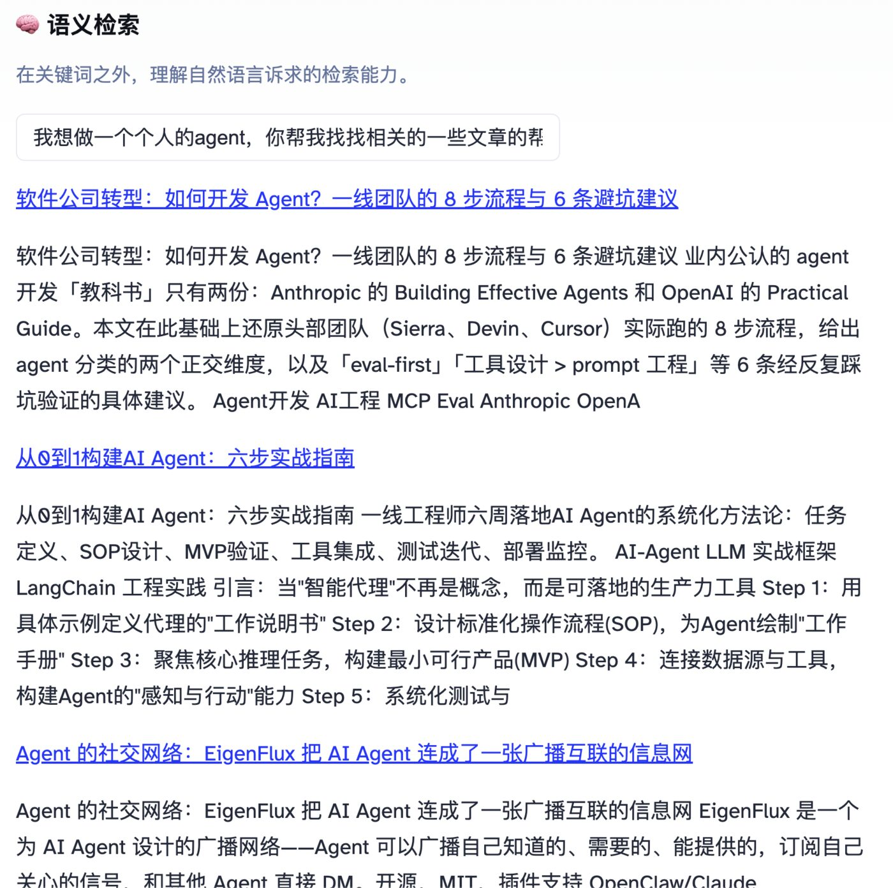
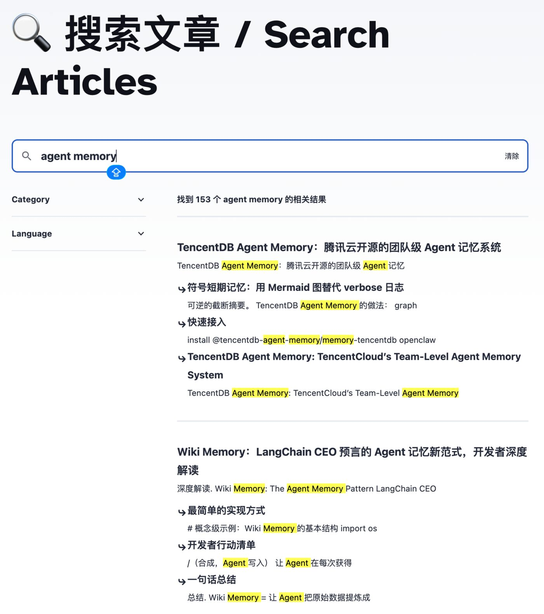

**结论先行**：blog.mushroom.cv 现在的 `/search` 页面跑的是一套关键词+语义的混合检索——Pagefind 做零成本的构建时静态索引，Cloudflare Workers AI 的 `bge-m3` 模型做 embedding，Cloudflare Vectorize 做向量检索，两路结果用 RRF（Reciprocal Rank Fusion）在浏览器里融合排序。全程没有自建服务器、没有数据库，几百篇中英双语文章的全量 embedding 一次性成本可以忽略不计，日常查询的账单量级是几十美元封顶而不是无底洞。这篇文章记录完整的决策链、真实踩过的坑，以及你如何把同一套代码克隆到自己的博客上。

## 为什么要做搜索

博客积累到几百篇中英双语文章之后，靠分类/标签浏览已经找不到东西了——读者知道自己想解决什么问题，但不知道这个问题对应哪个分类标签、更不知道具体是哪篇文章。目标很朴素：输入一段自然语言诉求，返回相关文章。

约束也很朴素：这是个人博客，不是企业产品。做成在线服务，索引能自动更新，依托现有的 Cloudflare 账号，技术选型追求成熟、简单、轻量——不为了炫技上一套四层微服务。

## 第一步：不要一上来就冲向量数据库

很多"给博客加搜索"的教程会直接从 embedding 模型讲起。我们没有这么做，先上了一个**零成本的关键词基线**：

Pagefind（pagefind.app）是一个构建时生成静态索引的搜索库——Astro 跑完 `pnpm build`，Pagefind 再扫一遍生成的 HTML，把标题、正文、标签都建进一份静态索引文件里，运行时不需要任何后端、任何数据库、任何在线 API 调用，纯浏览器本地检索。免费到没有"额度"这个概念。



这一步做完，先人工整理了 24 条评测查询——覆盖技术名词、自然语言问题、宽泛探索、中文、英文、跨语言、"博客里确实没有答案"的负样本各若干条，人工跑一遍记录 Recall@5 基线。**这份基线数据不是为了证明关键词搜索够用，而是为了给下一步的决策提供对照组**——没有基线，"值不值得上向量检索"就只能靠感觉判断。

## 上向量之前，先问"值不值"

这是整个过程里我认为最值得记录的一步：**在写任何一行 Vectorize 代码之前，先用同一批评测查询跑一次离线实验，拿真实数据回答"向量检索到底能不能带来看得见的提升"，而不是默认"向量检索显然更先进，理所当然该做"**。

离线实验用同一批 24 条查询，对全部 464 篇文章的标题+摘要+标签跑 Workers AI 的 `@cf/baai/bge-m3` embedding（1024 维），做纯向量余弦相似度检索，逐条跟关键词基线结果对比。结果是真实的胜负参半：

- **向量检索大幅领先**的案例：查询"脑仿真 大脑连接组"，关键词检索 0 结果；向量检索第一位直接命中对应文章（相似度 0.526）。查询"递归自我改进 RSI"，关键词检索只找到 1 条弱相关，向量检索 5/5 强相关；更有意思的是，中文查询"递归自我改进 RSI"和英文查询"recursive self improvement"在向量检索下 top5 结果几乎完全一致，而关键词检索下两者的结果集合几乎不重叠（1 条 vs 9 条）——同一个诉求，因为用词不同，关键词检索给出了两份几乎不重合的答案，向量检索没有这个问题。
- **向量检索退步**的案例：查询"WebGPU"，关键词检索部分相关（3/5），向量检索反而 0/5，飘向了"GPU/硬件"这个更泛的概念；查询"terminal AI coding tool"，向量检索混入了几个主题相邻但并不精确的假阳性结果，关键词检索反而更准。
- **两者都会被带偏**的负样本：查询"菜谱 家常菜做法"，关键词检索正确返回无结果；向量检索给出了一篇讲"菜谱数据向量化技术分析"的文章——主题沾边（都有"菜谱"两个字的语义邻域），但完全答不了用户"我想学做菜"的真实诉求。这类"沾边但没用"的假阳性，是纯向量检索最容易踩的坑，也是后面决定"两路信号都弱时不返回结果"这条规则的直接依据。

这份报告还有一个值得说的细节：第一版相关性判断由我一个人完成，写完之后专门让 Codex 用独立视角、只看"查询+结果标题"重新挑战了其中几组判断——结果真的抓到了两处我把"主题沾边"判得比实际支持的更宽松（把"AI 视频生成工具"当成了"AI 视频编辑工具"）。**离线评测这一步不只是测模型，也是在测自己的判断有没有确认偏误**——你会更倾向于认定"这个结论证明了我想做的事情是对的"，找一个独立视角来挑战自己的判断，比多测几条查询更重要。

基于这份数据的裁定：**两个都要，不是二选一**。关键词检索精确、可解释、零成本；向量检索能补上"同一件事、不同措辞"造成的检索鸿沟，但会引入主题相邻但意图不匹配的假阳性。裁定细节：关键词+向量并行检索，用 RRF 融合排序，按文章 ID 聚合去重，**两路信号都弱时不返回结果**——这条规则就是专门用来应对上面"菜谱""育儿"这类负样本的。

## 语义检索怎么落地的

裁定之后是真正写代码的部分。技术栈：

| 层 | 用什么 |
|---|---|
| 关键词检索 | Pagefind（构建时静态索引，浏览器本地跑） |
| Embedding | Cloudflare Workers AI，模型 `@cf/baai/bge-m3`，1024 维，中英双语 |
| 向量存储/检索 | Cloudflare Vectorize（余弦相似度） |
| 查询端点 | Cloudflare Pages Functions（`/api/search`） |
| 融合排序 | 浏览器端 JS，RRF 公式 |



流程是这样的：文章发布后，一次性索引脚本把每篇文章的标题+摘要+标签喂给 `bge-m3` 生成 embedding，写入 Vectorize 索引（当前线上索引跑的是**文章级** embedding，911 条向量，中文 467 条/英文 434 条——段落级切分策略已经实现并有完整测试，但接入正式索引构建流程是后续的增量索引任务，目前还没有接进去，这是老实交代的一个已知缺口）。用户搜索时，`/api/search` 把 query 同样跑一遍 `bge-m3` embedding，去 Vectorize 查 top 20 个候选，按文章 ID 聚合去重（每篇只留分数最高的一条），用一个刻意设得宽松的相似度阈值（0.4）过滤掉明显不相关的尾部。同时，浏览器里的 Pagefind 原生 JS API 独立跑一遍关键词检索——这一步只能在浏览器端做，因为 Pagefind 是纯前端库，Cloudflare Worker 环境里调不了。两路排名结果用 RRF 公式融合：

```
score(article) = Σ 1 / (60 + rank_i)
```

对每篇文章，把它在关键词结果里的排名和在向量结果里的排名分别代入这个公式求和，取分最高的排序展示——这是信息检索里一个很朴素但效果稳定的融合方法，不需要训练任何排序模型。

这一步踩到的坑，记两个真实的、值得别人参考的：

**Cloudflare Vectorize v2 的向量 ID 有 64 字节硬上限**。最初的方案是拼接 `article_id:language:content_hash` 作为向量 ID，直到真正写入时才发现某些长 slug 的文章拼出 71 字节，直接被 API 拒绝（400）。文档里完全没有提前预判到这一点，是靠真实调用暴露出来的。解决办法：对完整逻辑 key 取 SHA-256 哈希、截取前 48 位十六进制字符作为向量 ID，长度恒定，仍然保持"内容寻址、可幂等更新"的性质，原始的 `article_id`/`language`/`content_hash` 完整保留在 metadata 里供排查。

**双语分隔符检测被正文里的字面提及误伤**。这个博客的双语文章约定用独占一行的 `<!--EN-->` 分隔中英文版本，索引脚本最初用子串匹配判断"这篇文章有没有这个分隔符"——结果库里有两篇文章在正文里用反引号引用了这个分隔符字面量来说明博客的双语约定本身，子串匹配被这两次"提及"误伤，导致这两篇文章的中英文内容被切错位置、大段中文被错误标成英文向量。这个 bug 存在于已经合并、已经跑过一次真实 upsert 的代码里——发现后单独开了一个 PR 热修复，把检测规则从"子串匹配"改成"要求分隔符独占一行"（正则 `^<!--EN-->[ \t]*$`），并且精确算出这两篇文章原来产出的错误向量 ID，用 `delete_by_ids` 清理，避免留下孤儿向量。

## 上线之后：要不要一道密码墙

`/api/search` 涉及计费的 AI 调用，上线前的判断是"怕被刷"，于是加了一道密码+签名 Cookie 的登录门禁——单一共享密码方案（用户明确否决了 Cloudflare Access 这类更重的方案），登录后 60 天免重复登录。

上线之后回头复核这道门禁的真实必要性，结论发生了反转。用 7 种真实威胁模型逐一实测现有的按 IP 限速能不能挡住滥用：单一来源按顺序请求，限速确实生效；但只要**换着 IP 打**（模拟 3000 个不同来源各打一次），3000/3000 请求全部放行，0 次触发限速；并发请求因为限速计数器的"读-改-写"不是原子操作，也会被绕过；再考虑 Cloudflare 全球有多个 PoP（边缘节点），限速计数器互相看不见，实际生效倍数还会打折扣。**结论是：真正把滥用流量压到接近零的是密码墙本身，不是这道按 IP 的限速**——限速只挡得住"单一来源、顺序、不换 IP"这种最偷懒的滥用方式。

那么问题变成：语义检索本身的真实计费成本到底有多高？重新按官方定价核算：Workers AI 每天 10,000 neurons 免费额度（Free/Paid 套餐都有，Paid 的区别只是能超额付费而不是有更多免费额度），Vectorize 每月 5000 万 queried dimensions 免费额度。按这个量级测算，即使遭遇百万级请求的滥用洪水，账单量级是几十美元封顶，不是"会破产"级别的风险——跟一直公开、从未设防的 Pagefind 关键词搜索相比，语义检索的边际成本原来被高估了。

于是做出的最终决定：**去掉 `/api/search` 的登录门禁，跟一直公开的 Pagefind 关键词搜索对齐**，现在任何人都可以直接用语义检索，不需要密码。原来那套密码+签名 Cookie 系统没有扔掉，改为专门给"搜索使用统计"查看页和未来可能做的 AI 对话功能把关——对话是生成式 LLM 调用，单次成本比一次 embedding+向量检索高得多，这个必须继续要密码。这是一个具体的原则：**限速防的是"失控的量"，密码墙防的是"值不值得为它设防"这个成本量级判断本身**，两者不是同一件事，混着用会导致过度设防或设防不足。

## 普通人如何复刻这套技术栈

代码全部开源，MIT 协议，仓库地址是纯文本方便你直接复制：github.com/MushroomDAO/blog

复刻这套语义检索需要以下几步。

**第一步：克隆仓库，安装依赖。**

```bash
git clone https://github.com/MushroomDAO/blog.git
cd blog
pnpm install    # 需要 Node >= 22.12.0
```

**第二步：准备 Cloudflare 账号资源。**

去 Cloudflare Dashboard 确认以下能力已开通（个人账号免费额度已经够用，不需要升级付费套餐）：
- Workers AI（默认已开通，用来跑 `@cf/baai/bge-m3` embedding）
- Vectorize（建一个向量索引，1024 维、余弦相似度）
- KV（存限速计数器和查询缓存）
- Analytics Engine（如果想要搜索使用统计功能，这个数据集首次写入时自动创建，不需要提前手动建）

创建 Vectorize 索引：

```bash
npx wrangler vectorize create blog-search-v1 --dimensions=1024 --metric=cosine
```

铸造一个 API token，权限至少包含 Workers AI:Edit 和 Vectorize:Edit（不要复用一个权限过宽的全局 token，出问题时的影响范围会小很多）。

**第三步：跑一次性全量索引脚本，把你自己的文章内容嵌入进 Vectorize。**

```bash
export CLOUDFLARE_ACCOUNT_ID=你的账号ID
export CLOUDFLARE_REGISTRAR_TOKEN=你刚铸造的token
python3 semantic-search/scripts/build-vectorize-index.py   # 默认 dry-run，先看看会产出什么
python3 semantic-search/scripts/build-vectorize-index.py --create-index --upsert   # 真正建索引+写入
```

这个脚本默认是 dry-run，只有显式加 `--create-index`/`--upsert` 才会真正调用 Cloudflare 账号建资源——这是刻意设计的，避免脚本无人值守时直接动了线上资源。脚本内置向量缓存（gitignored），如果中途失败重跑，已经算好的 embedding 不需要重新花 Workers AI 额度重算。

**第四步：把绑定写进 `wrangler.toml`。**

```toml
pages_build_output_dir = "./dist"

[[kv_namespaces]]
binding = "BLOG_SEARCH_KV"
id = "你的 KV namespace id"

[ai]
binding = "AI"

[[vectorize]]
binding = "VECTORIZE_INDEX"
index_name = "blog-search-v1"

[[analytics_engine_datasets]]
binding = "SEARCH_ANALYTICS"
dataset = "blog_search_events"
```

**第五步：构建、部署、验证。**

```bash
pnpm build      # Astro 构建静态站点，同时跑 Pagefind 生成关键词索引
npx wrangler pages deploy dist --project-name=你的项目名
curl -s -X POST https://你的域名/api/search -H "content-type: application/json" -d '{"query":"测试查询"}'
```

如果返回结构化的 JSON 结果列表，说明 embedding→Vectorize→查询这条链路跑通了。

## 现在还差什么

老实交代几个还没做完的部分，不是为了显得谦虚，是因为这类文章最怕报喜不报忧：

- **增量索引还没接上**——现在的索引脚本是一次性全量跑的，文章发布/编辑之后不会自动更新到 Vectorize 里，需要手动重跑。正式的解决方案是发布流程末尾接一个 hook，这个任务目前状态是"就绪待做"，不是"已完成"。
- **段落级切分策略已经实现并测试通过，但还没接入正式索引**——现在线上是文章级 embedding（每篇一条向量，只覆盖标题+摘要+标签），更细粒度的段落级检索代码已经写好、测过，但还没真正跑进生产索引。
- **没有 reranker**，也没有"用小模型生成一句话匹配理由"——这两个都是可选增强，目前判断不值得为个人博客体量引入这一层复杂度。

## 写在最后

这整个过程最想留下的一条经验，不是"Cloudflare Vectorize 怎么用"这种可以查文档解决的问题，而是**先用真实数据决定要不要做，再决定怎么做**——离线实验的 24 条查询、真实的胜负参半的对比表格，比"向量检索显然更先进"这种直觉判断更值得作为决策依据。密码墙加了又拆的过程也是同一个道理：安全决策不是"越严格越好"，而是要先搞清楚"这道防线到底在防什么、防住了多少",再决定值不值得为它付出复杂度和用户体验的代价。

这套代码是 Mycelium Protocol 生态下的数字公共物品实践之一——开源、免费、无许可，欢迎直接克隆去改造成你自己的博客搜索。

---

> © 2026 Author: Mycelium Protocol. 本文采用 [CC BY 4.0](https://creativecommons.org/licenses/by/4.0/deed.zh) 授权——欢迎转载和引用，须注明作者姓名及原文链接，不得去除署名后以原创发布。

<!--EN-->

**TL;DR**: `blog.mushroom.cv/search` now runs hybrid keyword + semantic search — Pagefind for a zero-cost, build-time static index, Cloudflare Workers AI's `bge-m3` model for embeddings, Cloudflare Vectorize for vector retrieval, and client-side RRF (Reciprocal Rank Fusion) to merge both ranked lists. No servers, no database. The one-time embedding cost for a few hundred bilingual articles is negligible, and even under an abuse flood the realistic bill caps out in the tens of dollars, not runaway. This post documents the full decision chain, the real bugs hit along the way, and how to clone the same stack onto your own blog.

## Why bother with search

Once a blog accumulates a few hundred bilingual articles, browsing by category/tag stops working — readers know what problem they're trying to solve, but have no idea which tag maps to it, let alone which specific article. The goal was simple: type a natural-language need, get back relevant articles.

The constraints were equally simple: this is a personal blog, not an enterprise product. It had to run as an online service with a self-updating index, built on the existing Cloudflare account, favoring mature, simple, lightweight choices over an over-engineered stack.

## Step one: don't reach for a vector database first

Many "add search to your blog" tutorials start with an embedding model. We didn't. First came a **zero-cost keyword baseline**:

Pagefind (pagefind.app) builds a static search index at build time — after `pnpm build` runs, Pagefind scans the generated HTML and indexes titles, body text, and tags into a static index file. At runtime there's no backend, no database, no API call — pure client-side search in the browser. Free, with no concept of a quota to worry about.


With that in place, we hand-curated 24 evaluation queries — a mix of technical terms, natural-language questions, broad exploratory queries, Chinese, English, cross-language, and deliberate "the blog genuinely has no answer" negative samples — and manually ran the search page once to record a Recall@5 baseline. **That baseline wasn't meant to prove keyword search was good enough — it was the control group for the next decision.** Without a baseline, "is vector search worth it" is just a vibe check.

## Before adding vectors, ask "is it worth it"

This is the step I think is most worth writing down: **before a single line of Vectorize code was written, we ran an offline experiment against the same evaluation queries to answer, with real data, whether vector search delivers a visible improvement — rather than defaulting to "vector search is obviously more advanced, so of course we should do it."**

The offline experiment ran the same 24 queries against `bge-m3` embeddings (1024 dimensions) generated from the title+description+tags of all 464 articles, doing pure cosine-similarity retrieval, and compared each result line-by-line against the keyword baseline. The outcome was genuinely mixed:

- **Vector search won decisively** on some queries. A Chinese query for "brain simulation, connectome" returned zero keyword results, but vector search hit the exact matching article at rank 1 (similarity 0.526). A query for "recursive self-improvement" (in Chinese) found only 1 weak keyword match versus 5/5 strong vector matches — more interestingly, the Chinese query and its English equivalent, "recursive self improvement," produced nearly identical top-5 vector results, while their keyword results barely overlapped (1 result vs. 9). Same underlying need, phrased differently, and keyword search gave two nearly disjoint answers — vector search didn't have that problem.
- **Vector search regressed** on others. A query for "WebGPU" got 3/5 partial matches from keyword search but 0/5 from vector search, which drifted toward the broader concept of "GPU/hardware." A query for "terminal AI coding tool" pulled in several thematically-adjacent-but-imprecise false positives under vector search, while keyword search stayed more accurate.
- **Both got misled** by the same negative samples. A query for "recipes, home cooking" correctly returned nothing under keyword search; vector search surfaced an article about *vectorizing recipe data* — topically adjacent (both live in the semantic neighborhood of "recipe"), but useless for someone who actually wants to cook. This "adjacent-but-useless" false-positive pattern is exactly what pure vector search is most prone to, and it's the direct evidence behind the later rule: "return nothing when both signals are weak."

One more detail worth naming: the first pass of relevance judgments was made by one person (me), and after writing it up, I specifically had Codex re-challenge a handful of those judgments from an independent angle, seeing only "query + result title." It caught two places where I'd judged "topically adjacent" more generously than the evidence actually supported (treating an "AI video generation tool" as an "AI video editing tool"). **The offline evaluation step wasn't just testing the model — it was testing my own judgment for confirmation bias.** You're inclined to read results as confirming that the thing you wanted to build was the right call; getting an independent perspective to challenge your own judgment matters more than running a few extra queries.

The decision, grounded in this data: **do both, not either/or.** Keyword search is precise, explainable, and free; vector search closes the gap caused by "same intent, different wording," at the cost of introducing topically-adjacent-but-off-target false positives. Ruling: run keyword and vector retrieval in parallel, merge with RRF, deduplicate by article ID, and **return nothing when both signals are weak** — a rule built specifically to handle the "recipes"/"parenting" negative-sample pattern above.

## How semantic search actually shipped

After the ruling came the real implementation. The stack:

| Layer | What |
|---|---|
| Keyword retrieval | Pagefind (build-time static index, runs client-side) |
| Embedding | Cloudflare Workers AI, model `@cf/baai/bge-m3`, 1024 dimensions, bilingual |
| Vector storage/retrieval | Cloudflare Vectorize (cosine similarity) |
| Query endpoint | Cloudflare Pages Functions (`/api/search`) |
| Fusion ranking | Client-side JS, RRF formula |


The flow: after publishing, a one-time indexing script feeds each article's title+description+tags to `bge-m3` and writes the resulting embeddings into a Vectorize index (the live index today is **article-level** embedding — 911 vectors, 467 Chinese / 434 English; paragraph-level chunking is implemented and fully tested but hasn't been wired into the production indexing pipeline yet — a known gap worth naming honestly). When a user searches, `/api/search` embeds the query with the same `bge-m3` model, queries Vectorize for the top 20 candidates, deduplicates by article ID (keeping only the highest-scoring chunk per article), and filters out the clearly-irrelevant tail with a deliberately loose similarity threshold (0.4). Meanwhile, Pagefind's native JS API runs an independent keyword search in the browser — this has to happen client-side, since Pagefind is a pure front-end library that a Cloudflare Worker environment can't call. The two ranked lists are merged with RRF:

```
score(article) = Σ 1 / (60 + rank_i)
```

For each article, sum this over its rank in the keyword results and its rank in the vector results, then sort by the combined score — a simple but reliably effective fusion method from information retrieval that requires training no ranking model at all.

Two real bugs from this stage are worth passing on:

**Cloudflare Vectorize v2 enforces a hard 64-byte limit on vector IDs.** The original plan concatenated `article_id:language:content_hash` as the vector ID, and it wasn't until the actual write attempt that a long-slug article produced a 71-byte ID and got rejected outright (HTTP 400). Nothing in the docs predicted this ahead of time — it only surfaced through a real API call. The fix: SHA-256 hash the full logical key and take the first 48 hex characters as the vector ID — fixed length, still content-addressed and idempotent, with the original `article_id`/`language`/`content_hash` preserved in full in the metadata for debugging.

**The bilingual separator check got fooled by literal mentions in the body text.** This blog's convention for bilingual articles is a `<!--EN-->` marker on its own line separating the Chinese and English versions. The indexing script originally checked for this with a plain substring match — and two articles in the corpus happened to reference that exact marker string, in backticks, while explaining the blog's bilingual convention to readers. The substring match got fooled by those literal mentions, splitting the two articles at the wrong point and mislabeling large chunks of Chinese content as English vectors. This bug shipped in code that was already merged and had already run a real upsert. Once found, it got a dedicated hotfix PR — the check moved from "contains this substring" to "this exact marker occupies its own line" (regex `^<!--EN-->[ \t]*$`) — and the specific wrong vector IDs those two articles had produced were recomputed and cleaned up with `delete_by_ids`, so no orphaned vectors were left behind.

## After shipping: was a password wall the right call

`/api/search` involves billed AI calls, so the pre-launch judgment was "worried about abuse," and a password + signed-cookie login gate went up — a single shared password (the user explicitly ruled out something heavier like Cloudflare Access), staying logged in for 60 days.

Re-auditing that gate's actual necessity after shipping flipped the conclusion. Testing the existing IP-based rate limit against 7 real threat models: sequential requests from one source did trigger the limit as expected, but simply **rotating IPs** (simulating 3,000 different source addresses, one request each) let all 3,000 through with zero rate-limit hits. Concurrent requests bypassed it too, because the limiter's read-modify-write on the counter isn't atomic. Factor in that Cloudflare runs multiple PoPs (edge nodes) globally, and the rate-limit counters can't see each other across them, further diluting the effective limit. **The conclusion: what was actually suppressing abuse traffic to near zero was the password wall itself, not the IP rate limit** — the rate limit only stops the laziest abuse pattern: single source, sequential, no IP rotation.

Which raised the real question: what does semantic search actually cost to run, at scale? Re-checking official pricing: Workers AI gives 10,000 free neurons per day (both Free and Paid tiers get this; Paid just means you can pay for overage rather than getting more free quota), and Vectorize gives 50 million free queried dimensions per month. At that scale, even a million-request abuse flood caps out in the tens of dollars — not a "this will bankrupt us" risk. Compared to Pagefind's keyword search, which has been public and undefended the whole time, semantic search's marginal cost turned out to have been overestimated.

The final call: **remove the login gate from `/api/search`, bringing it in line with the already-public Pagefind keyword search.** Anyone can now use semantic search without a password. The password + signed-cookie system wasn't discarded — it now exclusively gates the search-usage-stats viewing page and any future AI chat feature, since generative LLM calls cost meaningfully more per request than a single embedding + vector query, and that one still needs a password. The underlying principle: **rate limiting defends against "the volume spiraling out of control"; a password wall defends against a cost-magnitude judgment about whether something is even worth defending in the first place** — they're not the same thing, and conflating them leads to either over- or under-defending.

## How to replicate this on your own blog

The code is fully open source under MIT. Repo, as plain text so you can copy it directly: github.com/MushroomDAO/blog

**Step 1: clone and install.**

```bash
git clone https://github.com/MushroomDAO/blog.git
cd blog
pnpm install    # requires Node >= 22.12.0
```

**Step 2: prepare Cloudflare account resources.**

Confirm the following are enabled in the Cloudflare dashboard (the personal free tier is enough — no need to upgrade to a paid plan):
- Workers AI (enabled by default; runs `@cf/baai/bge-m3` embeddings)
- Vectorize (create one vector index — 1024 dimensions, cosine metric)
- KV (stores rate-limit counters and query cache)
- Analytics Engine (only if you want search-usage stats — this dataset auto-creates on first write, no manual setup needed)

Create the Vectorize index:

```bash
npx wrangler vectorize create blog-search-v1 --dimensions=1024 --metric=cosine
```

Mint an API token scoped to at least Workers AI:Edit and Vectorize:Edit — don't reuse an overly broad global token; a narrower one limits the blast radius if it ever leaks.

**Step 3: run the one-time indexing script to embed your own content into Vectorize.**

```bash
export CLOUDFLARE_ACCOUNT_ID=your-account-id
export CLOUDFLARE_REGISTRAR_TOKEN=the-token-you-just-minted
python3 semantic-search/scripts/build-vectorize-index.py   # dry-run by default — see what it would do
python3 semantic-search/scripts/build-vectorize-index.py --create-index --upsert   # actually create + write
```

The script defaults to a dry-run — it only touches your Cloudflare account when you explicitly pass `--create-index`/`--upsert`. This is deliberate, so the script never mutates live resources unattended. It also caches computed embeddings (gitignored), so a failed run can be retried without re-spending Workers AI quota on already-embedded content.

**Step 4: wire the bindings into `wrangler.toml`.**

```toml
pages_build_output_dir = "./dist"

[[kv_namespaces]]
binding = "BLOG_SEARCH_KV"
id = "your-KV-namespace-id"

[ai]
binding = "AI"

[[vectorize]]
binding = "VECTORIZE_INDEX"
index_name = "blog-search-v1"

[[analytics_engine_datasets]]
binding = "SEARCH_ANALYTICS"
dataset = "blog_search_events"
```

**Step 5: build, deploy, verify.**

```bash
pnpm build      # Astro builds the static site and runs Pagefind's keyword indexing
npx wrangler pages deploy dist --project-name=your-project-name
curl -s -X POST https://your-domain/api/search -H "content-type: application/json" -d '{"query":"test query"}'
```

If that returns a structured JSON list of results, the embedding → Vectorize → query pipeline is wired up correctly.

## What's still missing

Worth naming honestly what isn't done yet — posts like this are most useful when they don't only report the wins:

- **Incremental indexing isn't wired up.** The indexing script runs as a one-time full pass; publishing or editing an article doesn't automatically update Vectorize — that still requires a manual re-run. The proper fix is a hook at the end of the publish pipeline; that task is currently "ready to start," not "done."
- **Paragraph-level chunking is implemented and tested, but not yet wired into production indexing.** The live index today is article-level only (one vector per article, covering title+description+tags); the more fine-grained paragraph-level retrieval code exists and passes its tests, but hasn't actually run against the production index yet.
- **No reranker**, and no "small model generates a one-line match explanation" step either — both are optional enhancements that, for a personal-blog-scale corpus, don't currently seem worth the added complexity.

## Closing

The one lesson from this whole process I most want to leave behind isn't "how to use Cloudflare Vectorize" — that's a documentation problem. It's **deciding whether to do something with real data before deciding how to do it.** Twenty-four offline evaluation queries and a genuinely mixed comparison table are worth more as a decision basis than the intuition that "vector search is obviously more advanced." The password-wall-added-then-removed story follows the same logic: security decisions aren't "stricter is always better" — they require first understanding exactly what a given defense actually stops, and how much, before deciding whether it's worth the complexity and UX cost.

This code is one piece of the digital-public-goods practice under the Mycelium Protocol ecosystem — open source, free, unlicensed. Clone it and adapt it into your own blog's search.

---

> © 2026 Author: Mycelium Protocol. Licensed under [CC BY 4.0](https://creativecommons.org/licenses/by/4.0/) — free to share and adapt with attribution. You must credit the author and link to the original; removing attribution and republishing as original is not permitted.
