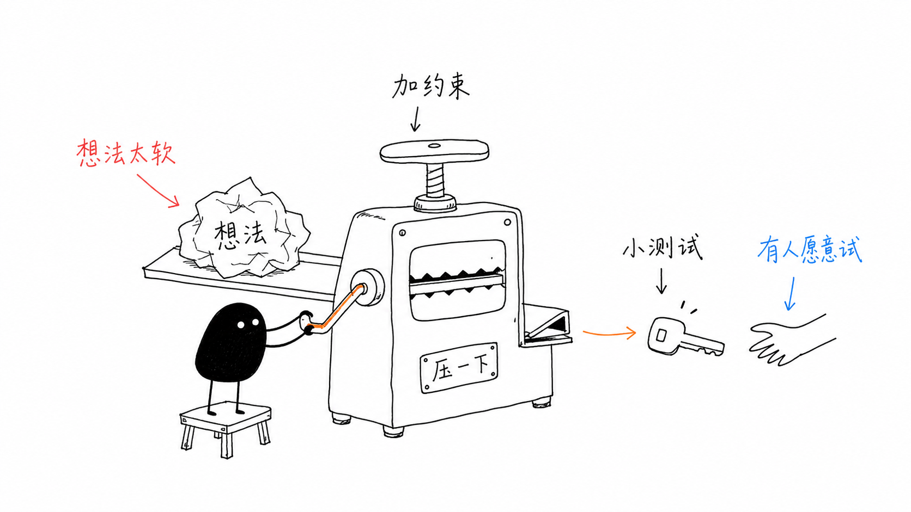
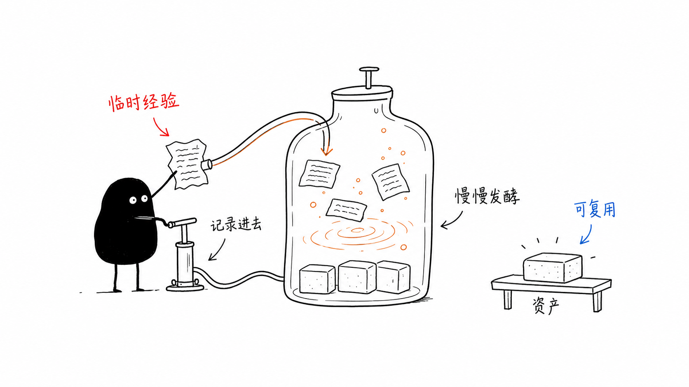
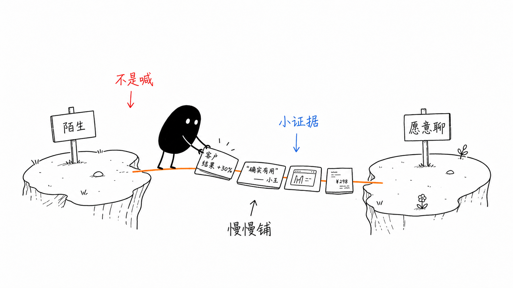
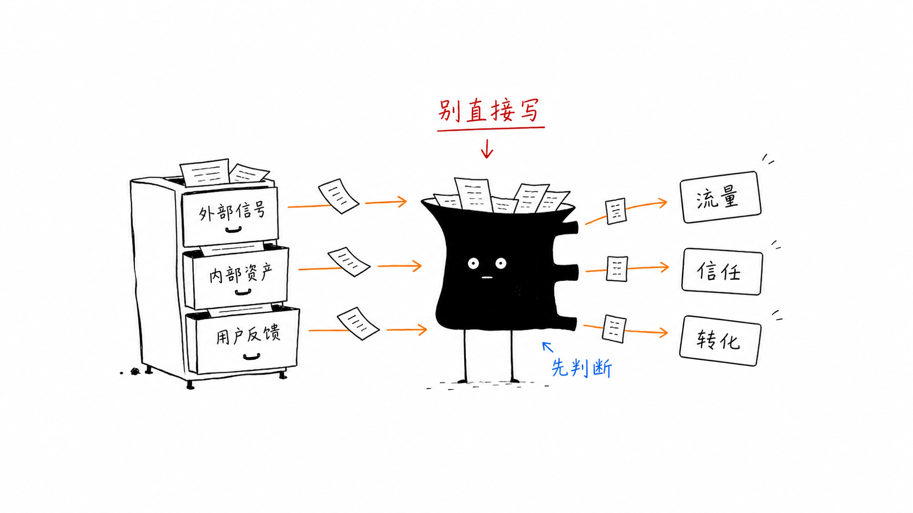

> 2026-06-22 · 工具观察 · 入门实测

**BLUF**：[ian-xiaohei-illustrations](https://github.com/helloianneo/ian-xiaohei-illustrations) 是一个开源的 Agent Skill（MIT 协议），可以直接装进 **Codex** 或 **Claude Code**。它解决一个很具体的痛点：**你写完一篇文章，想配几张有传播力的手绘图，但不会画、也懒得跟设计师来回沟通。** 把文章丢给它，它会自动找出文章里值得画的「认知锚点」，生成一组 16:9、纯白底、黑色手绘线稿的配图，主角是一只叫「**小黑**」的黑色小怪物。这篇文章从普通人的角度讲清楚：它是什么、怎么装、怎么用，并**重点讲它最值得折腾的扩展玩法——把小黑换成你自己的形象**。

---

## 一、它到底是什么？

先说清楚一件事：它不是一个网站，也不是一个 App。它是一个 **Skill（技能包）**——本质上是一组写给 AI 看的「说明书」，告诉 AI「按这套风格、这套规矩去画图」。

你把这个 Skill 装进 Codex 或 Claude Code 之后，就可以用一句话让 AI 帮你配图：

> Use $ian-xiaohei-illustrations 把下面这篇文章生成 4 张小黑配图。

AI 会读完你的文章，挑出几个「适合用图解释的地方」，然后调用内置的生图能力，一张一张画出来。

它和那种「随便配张装饰图」的工具最大的区别在于定位——作者 Ian 在仓库里写得很直白：

> 「让 AI 不只是『配一张图』，而是把文章里的一个关键认知动作画出来。」

也就是说，它画的不是好看的壁纸，而是**把你文章里那个抽象的判断、流程、对比，翻译成一张能看懂的画**。

---

## 二、主角「小黑」是谁

这套配图体系有一个固定的视觉主角，叫**小黑**。它的设定非常简单，但正是这种简单让它好认、好复用：

- **外形**：黑色实心的小怪物、白色圆点眼睛、细腿、表情空空的。身体可以变成圆柱、黑豆、黑盒、漏斗、影子、洞口……随场景变形。
- **性格**：很认真，但做的事有点荒诞。像一个低调的「系统操作员」，冷幽默，不卖萌。
- **职责**：小黑**必须参与画面的核心动作**——搬素材、拉线、卡在断点里、变成筛选漏斗、切「素材鱼」、牵承接路径、举牌看坑……

仓库里有一条很关键的判断标准，能帮你理解整个工具的设计哲学：

> 「如果去掉小黑，图的核心隐喻还能完全成立，说明小黑太装饰了——要重写，让小黑成为动作主体。」

换句话说，小黑不是贴纸，是「干活的人」。下面这张就是典型：小黑站在小凳子上，把一团「太软的想法」塞进一台「想法压机」，加点约束，压出一把能用的「小测试」钥匙——一张图讲清楚「想法要先被验证」这件事。



---

## 三、它能产出什么

输入是你的文章（正文、链接、Markdown、Notion 页面都行），输出是 **1 到 8 张** 16:9 手绘配图。它支持四种用法：

| 用法 | 你说什么 | 它给你什么 |
|------|---------|-----------|
| **只做规划** | 「先别生图，分析哪里值得配图」 | 一份 shot list（每张图放哪段、主题、核心意思、小黑做什么） |
| **正文配图** | 「生成 4 张配图」 | 直接画出成品图 |
| **单个观点** | 「为这句话画一张图」 | 单张图 |
| **改图** | 「去掉左上角标题 / 让小黑更主动」 | 在原图上局部编辑 |

它不会平均配图——它只挑「认知锚点」：核心判断、输入输出闭环、前后对比、常见坑、承接路径这类**真正值得画的地方**。短文配 1-3 张，长文也建议不超过 9 张，避免把正文变成画册。

---

## 四、视觉风格（为什么看起来「干净又怪」）

这套风格有一份明确的「风格 DNA」，普通人理解几条规矩就够了：

- **纯白背景**：不要米色、纹理、渐变、阴影。就是一张白纸。
- **黑色手绘线稿**：细线、轻微抖动，不是机械矢量图。
- **大量留白**：主体只占画面 40%–60%，至少留 35% 空白。
- **少量中文手写批注**：最多 5–8 处，每处 2–8 个字。
- **三种语义色**（很克制地用）：

| 颜色 | 含义 |
|------|------|
| **黑** | 主体、角色、结构、主要文字 |
| **红** | 重点、问题、警告、关键结果 |
| **橙** | 主流程、路径、箭头、从 A 到 B 的移动 |
| **蓝** | 补充说明、脑内状态、AI/系统提示（不是每张都用） |

下面这张「内容发酵」就是典型的橙色走流程：小黑用打气筒把临时经验「记录进去」，在大罐子里慢慢发酵，最后变成可复用的「资产」。



---

## 五、怎么安装（两分钟）

它官方是给 **Codex** 写的，安装就是「克隆 + 复制到 skills 目录」：

```bash
git clone https://github.com/helloianneo/ian-xiaohei-illustrations.git
cp -R ./ian-xiaohei-illustrations "${CODEX_HOME:-$HOME/.codex}/skills/"
```

如果你用的是 **Claude Code**，原理一样——把 `ian-xiaohei-illustrations/` 这个子目录（里面有 `SKILL.md`）放进你的 skills 目录即可（个人技能放 `~/.claude/skills/`，项目技能放项目里的 `.claude/skills/`）。Skill 的本质就是一个带 `SKILL.md` 的文件夹，跨工具是通用的。

装完之后，确认 `SKILL.md` 在位，就能用了。

---

## 六、怎么用（复制即用的 5 条 prompt）

仓库里贴心地准备了可以直接复制的 prompt，下面挑最常用的几条：

**① 只做规划，先不生图**

```text
Use $ian-xiaohei-illustrations 先不要生图。
请分析下面这篇文章哪里值得配图，输出 5 张左右的 shot list。
每张写清楚：放在哪段后、主题、核心意思、结构类型、小黑做什么、建议标注词。

<粘贴文章>
```

**② 直接给文章配图**

```text
Use $ian-xiaohei-illustrations 把下面这篇文章生成 4 张小黑配图。
要求：16:9 横版、纯白背景、黑色手绘线稿、少量红橙蓝中文手写批注。
每张只讲一个核心结构，不要做 PPT 信息图，不要可爱卡通。

<粘贴文章>
```

**③ 给一句观点配单图**

```text
Use $ian-xiaohei-illustrations 为这个观点生成一张 16:9 配图：
「信任不是喊出来的，而是一块证据一块证据铺过去。」
画面要怪诞但清爽，小黑必须承担核心动作，中文标注最多 5 个。
```

**④ 改图（去掉左上角标题）**

```text
Use $ian-xiaohei-illustrations 帮我编辑这张图。
去掉左上角的标题和下划线，其他保持不变，不要新增任何文字或物件。
```

提醒一句：用法 ③ 的那张「信任」prompt，实际画出来就是下面这张「信任桥」——小黑站在两块悬崖之间，一块块小证据铺成一座桥，从「陌生」通到「愿意聊」。这就是「核心动作可视化」的样子。



---

## 七、8 种构图模式 + 原创隐喻三步法

它不是乱画，背后有 8 种可选的「结构类型」，你也可以指定用哪种：

| 结构类型 | 适合表达 |
|---------|---------|
| **Workflow 流程** | 输入→处理→输出、AI 工作流、自动化链路 |
| **系统局部** | 信息来源、过滤器、数据库、agent 局部 |
| **前后对比** | 混乱/有序、手动/自动、焦虑/稳定 |
| **角色状态** | 用户痛点、卡住到跑起来、信息焦虑 |
| **概念隐喻** | 内容工厂、脑内黑盒、自动日报 |
| **方法分层** | 方法论框架、能力栈、系统层级 |
| **地图路线** | 从想法到上线、用户路径、学习路线 |
| **小漫画分镜** | 失败到成功、使用前后变化 |

最值得学的是它的「**原创隐喻三步法**」，这其实是一套谁都能用的「把抽象变具体」的思路：

1. **把抽象概念换成一个物理动作**：卡住、漏掉、变重、分拣、沉淀、发酵、折叠、拆包……
2. **把系统结构换成一个低科技物件**：坏机器、纸箱、抽屉、水管、井、梯子、秤、压面机……
3. **让小黑承担这个动作**：不是站旁边看，而是真的卡在机器里、拉错线、守门、称重。

比如「按目的分拣内容」，它就画成一个抽屉柜：外部信号、内部资产、用户反馈分别从三个抽屉抽出来，喂进黑乎乎的小黑（它正在「先判断」），再分流成流量、信任、转化——一个 `别直接写` 的红色批注点出全图的核心提醒。



再看几张，感受一下同一套风格能覆盖多少种结构：


---

## 八、重点：把「小黑」换成你自己的形象

这是这个工具**最值得折腾、官方文档却没明说**的地方，也是我最想跟你聊的部分。

### 为什么它天生就能「换形象」

你只要拆开这个 Skill 看一眼，就会发现它的结构其实是**模块化**的：

```
ian-xiaohei-illustrations/
├── SKILL.md                      # 总入口：定位 + 工作流
└── references/
    ├── style-dna.md              # 风格 DNA（白底、手绘、配色）
    ├── xiaohei-ip.md             # ← 角色定义（小黑长什么样、性格、动作库）
    ├── composition-patterns.md   # 8 种构图模式 + 隐喻方法
    ├── prompt-template.md        # 生图提示词模板
    └── qa-checklist.md           # 生成后检查清单
```

注意 `xiaohei-ip.md` 这个文件——**整个「主角是谁」的设定，被单独拆成了一个文件**。而生图模板 `prompt-template.md` 里，角色是作为一个**可替换的变量块**写进去的：

```text
Recurring IP character required:
小黑, a small solid-black creature with white dot eyes, tiny thin legs,
blank serious expression... 小黑 must perform the core conceptual action.
```

这意味着：**「风格」和「主角」是解耦的**。白底手绘、留白、红橙蓝语义色、8 种构图——这些是「风格引擎」；而小黑只是恰好坐在驾驶座上的那个角色。你完全可以把它换成别人。

> ⚠️ 说明：官方 README 默认「固定使用小黑 IP」，强调的是**风格一致性**，并没有提供一个「自定义形象」的开关。所以下面讲的是基于它的结构做**扩展/改造**，不是它内置的功能——但因为结构本来就解耦，改造起来非常自然。

### 三个层次的「换形象」

**层次一：一次性替换（最轻量，不改文件）**

直接在你的 prompt 里，把「角色」那段描述换成你自己的形象。比如你想用一只白色小猫：

```text
Use $ian-xiaohei-illustrations 用这套白底手绘风格画图，但主角换成：
「小白，一只白色圆脸小猫，黑点眼睛，短手短脚，表情呆萌但认真。」
小白必须承担画面的核心动作，其余风格（纯白底、手绘线、红橙蓝批注、大量留白）全部保持。
```

风格引擎照常工作，主角已经是你的了。适合「我就试一次」的场景。

**层次二：Fork 一份，造你专属的配图系统（推荐）**

如果你想长期用，更体面的做法是把仓库 fork 下来，改一个文件：

1. 把 `references/xiaohei-ip.md` 整个重写成**你自己的角色设定**——外形、性格、动作库、禁忌。可以是你的品牌吉祥物、你的头像卡通化、或者干脆设计一个新角色「小白 / 小红 / 你公司的 Logo 拟人」。
2. `style-dna.md`、`composition-patterns.md`、`prompt-template.md` 基本不用动（风格和构图方法是通用的）。
3. 在 `SKILL.md` 和 `prompt-template.md` 里把出现「小黑」的地方替换成你的角色名。

改完你就拥有了一个**和你品牌绑定的专属配图 Skill**——同样的「认知动作可视化」能力，但每张图的主角都是你的 IP。这正是这类 Skill 的精髓：**它不是一个画图工具，而是一套「IP + 风格」的模板，IP 是可以换的。**

**层次三：调整「scale」——比例、配色、语言、张数**

除了换角色，还有几个维度可以缩放，适配不同平台：

- **画面比例**：默认 16:9（适合公众号正文、博客头图）。你可以在 prompt 里要求 **1:1**（知识卡片/头像）、**3:4 / 4:5**（小红书、可保存的方法卡）、**9:16**（竖屏故事帧）、**5:2**（封面横幅）。
- **配色语义**：默认黑/红/橙/蓝。你可以改成自己品牌的主色，只要在 `style-dna.md` 里重新定义「每种颜色代表什么」。
- **风格底色**：默认纯白。真要做差异化，甚至可以放弃纯白、换成你品牌的浅色底（但会牺牲一部分「干净」的辨识度，慎改）。
- **语言**：默认中文手写批注。换成英文/日文批注也行，把模板里的语言要求改掉即可。
- **张数**：从「单张」到「8 张一组」自由控制。

> 一个现成的参照系：另一个很火的同类 Skill [juju-content-illustrations](https://github.com/dososo/juju-content-illustrations)（主角是白色比熊「卷卷」）用的就是几乎一模一样的方法论——固定 IP + 白底手绘 + 语义配色 + 多比例。**两者最大的区别就是主角不同。** 这恰好证明了「换形象」是这类工具最自然的扩展方向：方法论是公共的，IP 是你的。

下面这张「承接路径」展示了「地图路线」结构 + 横向构图，很适合做宽幅头图——你也可以把里面的小黑换成你自己的角色：


---

## 九、适合谁用 / 有什么局限

**适合**：写公众号 / 博客 / 小红书 / Notion 文档的个人创作者、一人公司、做方法论和教程的人——尤其是「有内容、没设计资源」的人。

**局限**（官方明说的，别踩坑）：

- 它出的是**位图（PNG）**，不能出 SVG、不能出可编辑矢量、不能出 PPTX。
- 不适合做精致商业插画、扁平 UI、复杂架构图。
- 图上中文要**少**，字多了 AI 容易画错字——生成后记得**人工复检错别字**。
- 它的好坏很依赖你给的文章质量：内容里有清晰的「认知锚点」，它才画得出有信息量的图。

---

## 结语

ian-xiaohei-illustrations 表面上是「一个画小黑的工具」，但它真正有价值的地方是那套**「把抽象认知翻译成物理动作」的方法论**，以及**「风格与 IP 解耦」的结构设计**。

对普通创作者来说，最实用的路径很清晰：**先用默认的小黑跑通流程，体会它怎么把你的文章变成画；用顺手了，就 fork 一份、改掉那一个角色文件，让每张配图的主角变成你自己的形象。** 从「借用别人的小黑」到「拥有你自己的 IP 配图系统」，中间只隔着一个文件的距离。

---

> 📌 项目地址（请直接复制访问）：
> GitHub —— https://github.com/helloianneo/ian-xiaohei-illustrations
> 同类参照：https://github.com/dososo/juju-content-illustrations

---

> © 2026 Author: Mycelium Protocol. 本文采用 [CC BY 4.0](https://creativecommons.org/licenses/by/4.0/deed.zh) 授权——欢迎转载和引用，须注明作者姓名及原文链接，不得去除署名后以原创发布。

<!--EN-->

> 2026-06-22 · Tool Notes · Hands-on Beginner Guide

**BLUF**: [ian-xiaohei-illustrations](https://github.com/helloianneo/ian-xiaohei-illustrations) is an open-source Agent Skill (MIT) that installs directly into **Codex** or **Claude Code**. It solves a very concrete pain: *you've finished an article, you want a few shareable hand-drawn illustrations, but you can't draw and don't want to go back and forth with a designer.* Hand it your article and it finds the "cognitive anchors" worth illustrating, then generates a set of 16:9, pure-white, black-line hand-drawn images — starring a small black creature named **Xiaohei**. This guide covers what it is, how to install and use it, and most importantly **its most worthwhile extension: swapping Xiaohei for your own character.**

---

## 1. What it actually is

It's not a website or an app — it's a **Skill**: a set of "instructions for the AI" telling it to draw in this style and by these rules. Once installed into Codex or Claude Code, you trigger it in one sentence:

> Use $ian-xiaohei-illustrations to generate 4 Xiaohei illustrations for the article below.

The AI reads your article, picks a few spots worth explaining visually, and draws them one by one. Unlike "slap a decorative image on it" tools, the author Ian is explicit: *"Let AI not just 'add an image,' but draw out one key cognitive action from the article."* It doesn't make wallpaper — it **translates an abstract judgment, flow, or contrast into a picture you can read.**


---

## 2. Who is Xiaohei

A fixed visual lead, deliberately simple so it's recognizable and reusable:

- **Look**: a solid-black little creature, white-dot eyes, thin legs, blank expression. Its body morphs into cylinders, beans, boxes, funnels, shadows, holes as the scene needs.
- **Personality**: dead serious about absurd tasks — a low-key "system operator," deadpan, never cute.
- **Job**: Xiaohei **must perform the core action** of the scene. The repo's key test: *"If removing Xiaohei leaves the metaphor fully intact, Xiaohei is just decoration — rewrite it."* Xiaohei is the worker, not a sticker.


---

## 3. What it produces

Input: your article (text, link, Markdown, Notion). Output: **1 to 8** 16:9 hand-drawn illustrations. Four modes: **planning only** (a shot list), **full illustration** (finished images), **single concept** (one image), and **editing** (e.g. remove the top-left title). It doesn't illustrate evenly — it targets cognitive anchors only: core judgments, input/output loops, before/after contrasts, common pitfalls, handoff paths.

---

## 4. Visual style

- Pure white background — no texture, gradient, or shadow.
- Black hand-drawn lines, slightly wobbly, not mechanical vectors.
- Lots of white space (subject occupies only 40–60%).
- Few short Chinese handwritten labels (5–8 max).
- Semantic colors, used sparingly: **black** = subject/structure/text, **red** = key problems/warnings/results, **orange** = main flow/paths/arrows, **blue** = secondary notes/system state.


---

## 5. Install (two minutes)

Built for **Codex** — clone and copy into the skills directory:

```bash
git clone https://github.com/helloianneo/ian-xiaohei-illustrations.git
cp -R ./ian-xiaohei-illustrations "${CODEX_HOME:-$HOME/.codex}/skills/"
```

For **Claude Code**, same idea: drop the `ian-xiaohei-illustrations/` subfolder (the one containing `SKILL.md`) into your skills dir (`~/.claude/skills/` for personal, `.claude/skills/` for project). A Skill is just a folder with a `SKILL.md` — it's portable across tools.

---

## 6. How to use (copy-paste prompts)

**Planning only:** `Use $ian-xiaohei-illustrations — don't draw yet, analyze where the article below deserves illustrations and output a ~5-image shot list.`

**Full illustration:** `Use $ian-xiaohei-illustrations to generate 4 Xiaohei illustrations: 16:9, white background, black hand-drawn lines, sparse red/orange/blue labels. One core structure per image, no PPT infographic, no cute cartoon.`

**Single concept:** `Use $ian-xiaohei-illustrations to make one 16:9 image for: "Trust isn't shouted — it's paved one piece of evidence at a time." Xiaohei must drive the core action.`

**Edit:** `Use $ian-xiaohei-illustrations to edit this image — remove the top-left title and underline, keep everything else, add nothing.`

---

## 7. Eight composition patterns + the three-step metaphor method

Eight selectable structure types: **Workflow**, **system fragment**, **before/after**, **character state**, **concept metaphor**, **layered method**, **map/route**, **mini-comic panels**. The most learnable part is its **three-step original-metaphor method** — a general "make the abstract concrete" recipe:

1. Turn an abstract concept into a **physical action** (stuck, leaking, fermenting, sorting…).
2. Turn the system structure into a **low-tech object** (broken machine, drawers, pipes, a well, a scale, a noodle press…).
3. Make Xiaohei **perform** that action — not watch from the side.


---

## 8. The key part: swap Xiaohei for your own character

This is the most worthwhile thing to tinker with — and the official docs don't spell it out.

### Why it's built to swap

Open the Skill and you'll see it's **modular**:

```
ian-xiaohei-illustrations/
├── SKILL.md
└── references/
    ├── style-dna.md              # style engine (white bg, hand-drawn, colors)
    ├── xiaohei-ip.md             # ← the character definition, isolated in one file
    ├── composition-patterns.md   # 8 patterns + metaphor method
    ├── prompt-template.md         # image prompt template
    └── qa-checklist.md
```

The entire "who's the lead" spec lives in **one isolated file** (`xiaohei-ip.md`), and in the prompt template the character is written as a **replaceable variable block**. So **style and character are decoupled**: the white-background hand-drawn look, the semantic colors, the 8 patterns — that's the *style engine*; Xiaohei just happens to sit in the driver's seat. You can swap who sits there.

> ⚠️ Note: the official README defaults to "always use the Xiaohei IP" for **style consistency** — there's no built-in "custom character" switch. What follows is an **extension** built on its structure, not a shipped feature — but because the structure is already decoupled, it's a natural modification.

### Three levels of swapping

**Level 1 — one-off (no file changes):** in your prompt, replace the character block. *"Use $ian-xiaohei-illustrations with this white hand-drawn style, but the lead is: Xiaobai, a round-faced white cat, black dot eyes, short limbs, deadpan-cute but serious. Xiaobai must drive the core action; keep all other style rules."*

**Level 2 — fork it, build your own illustration system (recommended):** fork the repo and rewrite **one file**, `references/xiaohei-ip.md`, into *your* character (your brand mascot, your cartoonized avatar, a new figure). Leave `style-dna.md` / `composition-patterns.md` / `prompt-template.md` mostly untouched, and replace "Xiaohei" with your character's name throughout. Now you own a **brand-bound illustration Skill** — same cognitive-action visualization, but every image stars your IP. That's the essence of these skills: **not a drawing tool, but an "IP + style" template where the IP is swappable.**

**Level 3 — adjust the scale:** beyond the character, several dimensions scale to fit platforms — **aspect ratio** (default 16:9; ask for 1:1 cards, 3:4 / 4:5 for Xiaohongshu, 9:16 for stories, 5:2 for banners), **color semantics** (redefine in `style-dna.md`), **base color** (drop pure white for a brand tint, carefully), **language** (English/Japanese labels), and **image count** (1 to 8).

> A ready reference: another popular sibling skill, [juju-content-illustrations](https://github.com/dososo/juju-content-illustrations) (lead: a white bichon "Juju"), uses nearly the same methodology — fixed IP + white hand-drawn style + semantic colors + multiple ratios. **The only real difference is the lead character.** That proves swapping the character is the natural extension: the methodology is public, the IP is yours.


---

## 9. Who it's for / limitations

**For**: individual creators, one-person companies, and methodology/tutorial writers on WeChat / blogs / Xiaohongshu / Notion — especially "content-rich, design-poor" people.

**Limits** (stated by the author): it outputs **bitmaps (PNG)** — no SVG, no editable vectors, no PPTX; not for polished commercial illustration, flat UI, or complex architecture diagrams; keep on-image Chinese **short** (AI mangles long text — proofread afterward); and quality depends on your article having clear cognitive anchors.

---

## Closing

On the surface it's "a tool that draws Xiaohei." Its real value is the **methodology** (translate abstract cognition into physical action) and the **decoupled style-vs-IP architecture**. The practical path: run the default Xiaohei first to feel how it turns articles into pictures; once comfortable, fork it and change that one character file so every illustration stars *your* figure. From "borrowing someone's Xiaohei" to "owning your own IP illustration system" is exactly one file apart.

> Repo: https://github.com/helloianneo/ian-xiaohei-illustrations (MIT, by Ian / @ianneo_ai)

---

> 📌 Project (copy to visit):
> GitHub — https://github.com/helloianneo/ian-xiaohei-illustrations
> Sibling reference — https://github.com/dososo/juju-content-illustrations

---

> © 2026 Author: Mycelium Protocol. Licensed under [CC BY 4.0](https://creativecommons.org/licenses/by/4.0/) — free to share and adapt with attribution. You must credit the author and link to the original; removing attribution and republishing as original is not permitted.
