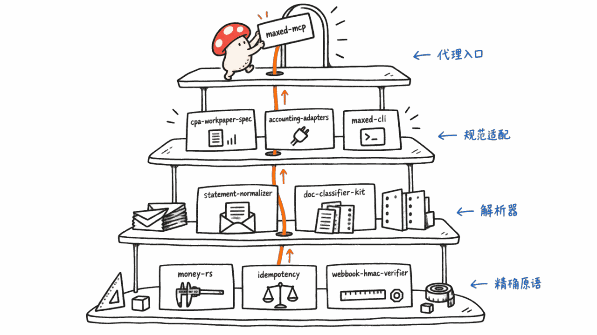

**BLUF**：2026 年 9 月 16 日，柏林公司 **Integral** 宣布完成 **1800 万欧元 A 轮融资**，由 Mosaic Ventures 和 Reid Hoffman 联合领投，Cherry Ventures、General Catalyst、Puzzle Ventures 跟投，成立不到两年累计融资**超过 3000 万欧元**。它做的不是又一个记账软件，而是**AI 代理跑对账和记账、持牌会计师审核例外并签字担责**的会计、税务、薪酬服务；报道称目前**超过 50% 客户的账目由代理端到端处理**，月度对账周期从「几周」缩短到「几小时」。同一份行业简报还提到一个开源项目 **Maxed OSS**，我们逐仓库核实过：这是一个真实维护的组织，17 个仓库、Apache-2.0/MIT 双证，把「金额计算、对账解析、文档分类、签名校验」这些确定性活做成 MCP 工具，供 AI 代理调用——它本身也是一家商业公司（Maxed）反向验证了 Integral 模式的策略：**把大家都要重复造的轮子开源，把「判断 + 责任」这一层留给自己卖钱**。

## 一手源

Integral 融资报道：
EU-Startups，2026-09-16：https://www.eu-startups.com/2026/09/berlin-based-integral-raises-e18-million-to-deliver-ai-run-accounting-tax-and-payroll-services-to-smes/
FinTech Global，2026-09-16：https://fintech.global/2026/09/16/integral-raises-e18m-series-a-led-by-mosaic-hoffman/

Maxed OSS 开源组织：
GitHub Organization：https://github.com/Maxed-OSS
核心仓库：https://github.com/Maxed-OSS/maxed-mcp 、 https://github.com/Maxed-OSS/accounting-adapters 、 https://github.com/Maxed-OSS/money-rs


## Integral 到底在卖什么？

两篇报道的措辞几乎一致，我们逐条核对过：

- **融资**：1800 万欧元 A 轮，Mosaic Ventures 与 Reid Hoffman 联合领投（co-led），Cherry Ventures、General Catalyst、Puzzle Ventures 作为既有投资人跟投
- **累计融资**：「成立不到两年内累计融资超过 3000 万欧元」（founded less than two years ago）
- **成立与创始人**：2024 年由 Lukas Zörner 和 Anil Can Baykal 创立，总部柏林
- **业务**：面向中小企业的 AI 原生记账、税务、薪酬平台。EU-Startups 的原话是「licensed professionals remain in full control, reviewing and signing every filing」——持牌专业人士对每一份申报保留完整控制权，逐一审核并签字
- **落地结构**：FinTech Global 特别提到一个细节——**Integral Tax** 是一家依附于平台运行的持牌专业服务公司（"an affiliated licensed professional services firm that runs entirely on the platform"），也就是说法律责任主体和 AI 平台是分开但绑定的两个实体
- **已披露的运营数字**：「超过 50% 客户的账目现在由代理端到端准备」（EU-Startups）；「月度对账平均周期从几周缩短到几小时」；「专业人员人均能服务的客户数已经翻倍」

这里没有一个数字是我们编的，也没有替换成更好看的说法——「超过 50%」「翻倍」「几周到几小时」都是两家媒体的直接转述，具体统计口径（是全部客户还是特定服务线、翻倍的基准期是多久）两篇报道都没有交代，算是这条新闻本身的局限。

### AI 原生专业服务和传统 SaaS 的分界线在哪？

传统记账软件卖的是工具，员工自己操作，出了错员工自己担责；Integral 卖的是**结果**——你把银行流水和发票丢过去，AI 把可重复的部分做完，专业人士只处理有歧义、有风险的那一小撮，最后交付一份可以拿去申报的账。客户买的不是「一个更好用的记账界面」，而是「账不用我自己盯」。这也是为什么两篇报道都强调「持牌」「法律责任」——真正值钱、真正需要融资去买的，不是 AI 本身，而是**愿意为 AI 的输出签字担责的专业人力网络**，这恰恰是纯软件公司买不到、也复制不了的护城河。


## Maxed OSS：日报里提到的开源项目是真的吗？

行业简报里提了一句「一个有用的架构参考是 Maxed OSS」，附了一个 GitHub Organization 链接。这类引用最容易翻车的地方是：组织页面可能是空壳、可能只有一个 fork、可能早就没人维护。我们没有直接采信，而是用 `gh api orgs/Maxed-OSS/repos` 把 18 个仓库全部拉出来看了一遍。

结论：**这是一个真实、活跃维护的组织**，不是空壳。关键事实：

- 组织创建于 **2026-06-22**，最近一次更新在 2026-09-11（`maxed-ui` 仓库），持续有提交，不是发布后就废弃的快闪仓库
- 组织简介：「The AI-Native Open-Source Operating System for CPA Firms」，主页 https://maxed.life ，说明 Maxed 本身是一家商业公司，这些仓库是它对外开源的"公共基础设施"层
- **17 个有实质内容的仓库**（另有 1 个 `.github` 组织说明仓库），全部带 CI 徽章、测试和 README，许可证是 Apache-2.0 或 MIT，没有一个是纯搬运

它们大致分四层，和行业简报里「deliberately puts arithmetic, parsing, validation, idempotency and signatures into deterministic tools」这句描述对得上：

1. **代理入口**：`maxed-mcp` 是一个 MCP 服务器，把整套确定性工具封装成 AI 代理可调用的接口——银行流水解析、文档分类、workpaper 校验、精确金额计算、Webhook 签名验证，每个工具返回统一的 JSON 结构，缺依赖时明确报错而不是瞎编答案。README 原话是「Agents are good at judgement and bad at arithmetic, parsing, and signature checks」——这句话和 Integral 的产品分工逻辑几乎是同一件事的两种说法
2. **规范与适配器**：`cpa-workpaper-spec`（CPA 业务的开放 JSON Schema/OpenAPI 词汇表）、`accounting-adapters`（对 QuickBooks、Xero、Bill.com、TaxDome、Plaid、FreshBooks、Wave 七家系统统一读取接口，带 `diff_invoices` 这样的跨系统对账函数和零凭证的 `FakeTransport` 沙盒测试）、`maxed-cli`
3. **解析器**：`statement-normalizer`（CSV/OFX/QFX/MT940/CAMT.053/QIF 银行对账单解析）、`ofx-normalizer`（Go 写的单文件二进制）、`doc-classifier-kit`（W-2/1099/发票/银行对账单/收据的分类评测框架）
4. **精确原语**：`money-rs`（Rust，整数分位存储避免浮点误差，Banker's Rounding，largest-remainder 分摊算法）、`webhook-hmac-verifier`（Go，常数时间 HMAC 校验）、`idempotency`（Elixir，幂等键存储，防止同一笔转账重复入账）

我们额外核实了 `money-rs` 和 `idempotency` 的 README 全文：前者确实用整数最小货币单位存储金额、`0.1 + 0.2` 不会有浮点误差，三方分摊用最大余数法保证总和不丢分；后者确实是给支付/转账类操作做「同一个幂等键重复提交只生效一次」的存储层，都不是空泛的营销文案，代码接口和用法示例是可以直接跑的。

星标很低（大多数仓库 0-4 星），这点要如实说——这不是一个刷了星的项目，热度目前很小，但**真实性和完成度经得起查**，这和很多「组织页面挂个名字、仓库里只有一个 LICENSE 文件」的空壳项目完全不是一回事。



## 开源确定性工具、卖判断和责任，是同一套打法

有意思的地方在于：Maxed OSS 背后的商业公司 Maxed，用的策略和它所描述的 Integral 模式是**同一个逻辑的另一种表达**。Maxed 组织简介写得很直白：

> 「Maxed 是一个商业化的 AI 原生会计平台。我们把行业共用的商品化构建模块开源出来……我们保留的是真正属于我们自己的、更高层的自动化能力。」（原文：Maxed is a commercial, AI-native accounting platform. We open-source the commodity building blocks our industry shares... What we keep is the higher-level automation that is actually ours to keep.）

换句话说：

```text
金额怎么算、对账单怎么解析、签名怎么验证
  → 谁做都一样,大家一起用,开源出去换生态和信任

具体客户的异常怎么判断、服务质量怎么保证、
最后谁为这份账签字担责
  → 这是护城河,留在公司内部收费
```

这和 Integral「AI 干活、持牌人担责」的分工是同一条判断：**确定性、可验证的机械劳动可以彻底自动化甚至开源；不确定性判断加法律责任才是值钱的、需要专业人力网络的部分**。两家公司一个是应用层（对客户收费的会计服务），一个是基础设施层（对开发者开源的工具库），但拆解开来指向同一个结论。

需要说明的是：以上这一段结论是我们对比两组一手事实后的**独立判断**，Maxed OSS 的 README 和 Integral 的融资报道彼此并不引用对方，两者之间没有公开的合作或投资关系，我们没有找到任何证据表明它们有业务往来——这里只是把两个各自独立、各自可查证的案例放在一起看，指出它们共享同一种架构逻辑。


## 中小企业该怎么理解这件事?

如果你在经营一个 5-50 人规模的公司，Integral 这类产品对你的实际意义可能不是「要不要换一个记账软件」，而是：**下一次你要买 AI 相关服务时，先问清楚"谁在为最终结果负责"**。一个纯 AI SaaS 工具出错，责任通常落在你自己头上；一个像 Integral 这样绑定持牌专业人士审核+签字的服务，出错时至少有明确的责任主体。这个差异在会计、税务、法务这类有法律后果的领域尤其重要，值得在选型时单独问一句「异常情况是谁来处理、谁来担责」。

对开发者和技术团队来说，Maxed OSS 提供的是另一种价值：如果你也在做垂直领域的 AI 代理产品，**不需要自己重新发明金额计算、对账单解析、幂等重试这些轮子**——这些确定性问题已经有测试完整、许可证宽松的开源实现,把精力留给真正需要判断力的那一层。

## 常见问题

**Q：Integral 的「AI 端到端处理」是不是意味着不再需要会计师？**
A：不是。两篇报道都明确写「持牌专业人士对每一份申报保留完整控制权」,处理的是「超过 50% 客户」的账目,而且报道没有说这部分账目完全没有人工介入——更准确的理解是 AI 承担了可重复的执行工作,人仍然是最终审核和法律责任人。

**Q：Maxed OSS 里的工具能直接拿来给中小企业用吗？**
A：可以试用,但要注意分工：`accounting-adapters`、`statement-normalizer` 这类是**开发者向**的库和 CLI,不是面向企业主的成品应用,需要自己接入或找开发者搭建;`maxed-mcp` 是给 AI 代理调用的接口层,同样需要工程能力去部署和接线。

**Q：报道里提到的「professional-service-control-plane」是不是也有开源实现？**
A：没有。这是我们参考的那份行业简报作者自己提出的产品构想（YAML 示例、节点结构都是作者原创的设计思路）,不是任何已经存在的开源项目,我们没有找到与之对应的仓库或产品,读者不要把它当成真实存在的东西。

**Q：Maxed OSS 项目star数很低,是不是说明它不重要？**
A：star 数确实很低（多数仓库个位数）,这如实反映了它目前的关注度不高,但我们核实过的几个核心仓库代码、测试、文档都是完整且可运行的,不属于空壳或刷量项目——热度和真实性是两回事,这里我们只对后者下结论。

---

> © 2026 Author: Mycelium Protocol. 本文采用 [CC BY 4.0](https://creativecommons.org/licenses/by/4.0/deed.zh) 授权——欢迎转载和引用，须注明作者姓名及原文链接，不得去除署名后以原创发布。

<!--EN-->

**BLUF**: On September 16, 2026, Berlin-based **Integral** announced an **€18 million Series A**, co-led by Mosaic Ventures and Reid Hoffman with participation from Cherry Ventures, General Catalyst and Puzzle Ventures, taking total funding to **more than €30 million** in under two years since its 2024 founding. It isn't another accounting app — it's an accounting, tax and payroll service where **AI agents run reconciliation and bookkeeping while licensed professionals review exceptions and sign off with legal responsibility**. Reporting says **agents now prepare the books end-to-end for more than 50% of clients**, and monthly turnaround has dropped from weeks to hours. The same industry brief that flagged this story also cited an open-source project, **Maxed OSS** — we verified it repo by repo: a genuinely maintained organization, 17 repos, Apache-2.0/MIT licensed, turning money math, statement parsing, document classification and signature verification into MCP tools an AI agent can call. It also happens to be backed by a commercial company (Maxed) that is running the mirror image of Integral's strategy: **open-source the parts everyone has to rebuild, keep the "judgement plus liability" layer as the paid product.**

## Primary Sources

Integral funding coverage:
EU-Startups, 2026-09-16: https://www.eu-startups.com/2026/09/berlin-based-integral-raises-e18-million-to-deliver-ai-run-accounting-tax-and-payroll-services-to-smes/
FinTech Global, 2026-09-16: https://fintech.global/2026/09/16/integral-raises-e18m-series-a-led-by-mosaic-hoffman/

Maxed OSS organization:
GitHub Organization: https://github.com/Maxed-OSS
Core repos: https://github.com/Maxed-OSS/maxed-mcp , https://github.com/Maxed-OSS/accounting-adapters , https://github.com/Maxed-OSS/money-rs


## What Exactly Is Integral Selling?

The two reports use almost identical language, and we cross-checked them line by line:

- **Round**: an €18 million Series A, co-led by Mosaic Ventures and Reid Hoffman, with existing investors Cherry Ventures, General Catalyst and Puzzle Ventures participating
- **Total raised**: "more than €30 million since its founding less than two years ago"
- **Founding**: founded in 2024 by Lukas Zörner and Anil Can Baykal, headquartered in Berlin
- **Business**: an AI-native accounting, tax and payroll platform for SMEs. EU-Startups' exact phrasing: "licensed professionals remain in full control, reviewing and signing every filing."
- **Structure**: FinTech Global adds a specific detail — **Integral Tax** is "an affiliated licensed professional services firm that runs entirely on the platform," meaning the legally liable entity and the AI platform are two separate but bound entities.
- **Disclosed operating numbers**: "for more than 50% of clients, agents now prepare the books end-to-end" (EU-Startups); the average monthly accounting turnaround has fallen "from weeks to hours"; professionals "have already doubled the number of clients each of them can serve."

None of these numbers are ours, and we haven't dressed them up — "more than 50%," "doubled," "weeks to hours" are direct paraphrases from the two outlets. Neither article specifies the exact measurement basis (all clients or a specific service line, the baseline period for "doubled"), which is a real limitation of this news itself.

### Where's the Line Between an AI-Native Professional Service and Traditional SaaS?

Traditional accounting software sells a tool; the employee operates it and owns the mistakes. Integral sells an **outcome** — you hand over bank statements and invoices, AI does the repeatable work, and a professional only handles the small ambiguous or risky slice before delivering a filing-ready set of books. The customer isn't buying "a nicer accounting interface"; they're buying "not having to watch the books myself." That's also why both reports emphasize "licensed" and "legal responsibility" — what's genuinely valuable, and what actually needs the capital raise, isn't the AI itself. It's the **network of professionals willing to sign their name to the AI's output** — a moat a pure software company can't buy or replicate.


## Is the Open-Source Project Named in the Brief Real?

The industry brief we sourced this topic from mentions, in one line, "a useful architectural reference is Maxed OSS," linking to a GitHub Organization page. This is exactly the kind of citation that most easily falls apart — the org page could be an empty shell, a single fork, or an abandoned repo nobody maintains. Rather than take it at face value, we pulled all 18 repos with `gh api orgs/Maxed-OSS/repos` and went through them.

Verdict: **this is a real, actively maintained organization**, not a shell. Key facts:

- The org was created on **2026-06-22**, with the most recent update on 2026-09-11 (the `maxed-ui` repo) — ongoing commits, not a flash-in-the-pan repo abandoned after launch
- Org bio: "The AI-Native Open-Source Operating System for CPA Firms," homepage https://maxed.life — meaning Maxed is itself a commercial company, and these repos are the "public infrastructure" layer it open-sources
- **17 substantive repos** (plus one `.github` org-profile repo), all with CI badges, tests and READMEs, licensed Apache-2.0 or MIT — none is a bare re-upload

They roughly form four layers, matching the brief's claim that the project "deliberately puts arithmetic, parsing, validation, idempotency and signatures into deterministic tools":

1. **Agentic front door**: `maxed-mcp`, an MCP server wrapping the whole suite of deterministic tools into interfaces an AI agent can call — bank-statement parsing, document classification, workpaper validation, exact money math, webhook signature verification. Each tool returns a uniform JSON shape and fails explicitly when a dependency is missing rather than inventing an answer. The README states plainly: "Agents are good at judgement and bad at arithmetic, parsing, and signature checks" — almost a restatement, in different words, of Integral's own division of labor.
2. **Specs and adapters**: `cpa-workpaper-spec` (open JSON Schema/OpenAPI vocabulary for CPA engagements), `accounting-adapters` (a unified read interface over QuickBooks, Xero, Bill.com, TaxDome, Plaid, FreshBooks and Wave, with a cross-provider `diff_invoices` function and a zero-credential `FakeTransport` sandbox), and `maxed-cli`.
3. **Parsers**: `statement-normalizer` (CSV/OFX/QFX/MT940/CAMT.053/QIF bank statement parsing), `ofx-normalizer` (a single static Go binary), and `doc-classifier-kit` (a classification eval harness for W-2/1099/invoice/bank-statement/receipt).
4. **Exact primitives**: `money-rs` (Rust, integer minor-unit storage to avoid floating-point drift, banker's rounding, largest-remainder allocation), `webhook-hmac-verifier` (Go, constant-time HMAC verification), and `idempotency` (Elixir, an idempotency-key store that prevents the same transfer from posting twice).

We additionally read the full READMEs of `money-rs` and `idempotency`: the former genuinely stores amounts as integer minor units so `0.1 + 0.2` never drifts, and uses the largest-remainder method so a three-way split still adds up to the original total; the latter genuinely provides a storage layer that guarantees a retried payment or transfer with the same idempotency key applies exactly once. Neither is vague marketing copy — the interfaces and usage examples are runnable as written.

Star counts are low (0-4 for most repos), and it's worth saying plainly — this is not a starred-up vanity project. Its current visibility is small, but **its authenticity and completeness hold up under scrutiny**, which is a very different thing from an organization page with a name and a repo containing only a LICENSE file.


## Open-Sourcing Deterministic Tools, Selling Judgement and Liability, Is the Same Playbook

The interesting part: Maxed, the commercial company behind Maxed OSS, is running a strategy that's **the mirror image of the same logic Integral applies**. The org's own bio states it directly:

> "Maxed is a commercial, AI-native accounting platform. We open-source the commodity building blocks our industry shares... What we keep is the higher-level automation that is actually ours to keep."

In other words:

```text
How to compute an amount, parse a statement, verify a signature
  → the same for everyone, open it up for ecosystem and trust

How to judge a specific client's exception, guarantee service
quality, and ultimately sign for a set of books
  → that's the moat, kept in-house and monetized
```

This is the same judgement call as Integral's "AI does the work, a licensed person owns the responsibility" split: **deterministic, verifiable mechanical labor can be fully automated, even open-sourced; uncertain judgement plus legal liability is what's actually valuable and needs a professional human network.** One is an application-layer company (an accounting service billed to customers), the other an infrastructure-layer one (a tool library open-sourced to developers), but pulling them apart points to the same conclusion.

To be clear: the paragraph above is **our own independent judgement** from comparing two separately verifiable sets of facts. Maxed OSS's README and Integral's funding coverage don't cite each other, there's no disclosed partnership or investment relationship between them, and we found no evidence the two companies do business together — we're simply placing two independently verifiable cases side by side and pointing out they share the same architectural logic.


## What Should an SME Take Away From This?

If you run a 5-to-50-person company, the practical takeaway from Integral isn't "should I switch accounting software." It's: **next time you evaluate an AI-adjacent service, ask up front who is accountable for the final result.** When a pure AI SaaS tool gets something wrong, the responsibility usually lands back on you. A service like Integral, which binds licensed professionals into review-and-sign, at least gives you a clear accountable party when something does go wrong. That distinction matters especially in accounting, tax and legal work, where mistakes have legal consequences — worth a specific question during vendor evaluation: who handles exceptions, and who is liable for them?

For developers and technical teams, Maxed OSS offers a different kind of value: if you're building a vertical AI agent product, **you don't need to reinvent money math, statement parsing, or idempotent retries from scratch** — these deterministic problems already have well-tested, permissively licensed open-source implementations, freeing your effort for the layer that actually needs judgement.

## FAQ

**Q: Does Integral's "end-to-end AI processing" mean accountants are no longer needed?**
A: No. Both reports explicitly state that "licensed professionals remain in full control, reviewing and signing every filing," and the end-to-end figure applies to "more than 50% of clients" — the coverage doesn't say this portion has zero human involvement. The more accurate read is that AI handles the repeatable execution, while a human remains the final reviewer and the legally liable party.

**Q: Can I directly use the Maxed OSS tools for my small business?**
A: You can try them, but mind the division of labor: `accounting-adapters` and `statement-normalizer` are **developer-facing** libraries and CLIs, not finished applications for a business owner — they need integration or a developer to wire up. `maxed-mcp` is an interface layer meant for AI agents to call, and similarly needs engineering work to deploy and connect.

**Q: Is there an open-source implementation of the "professional-service-control-plane" mentioned in the brief we sourced this from?**
A: No. That is a product concept proposed by the author of the industry brief we drew this topic from — the YAML example and node structure are that author's own original design idea, not an existing open-source project. We found no corresponding repository or product, and readers should not treat it as something that already exists.

**Q: Maxed OSS's star counts are very low — does that mean it doesn't matter?**
A: The star counts are indeed low (single digits for most repos), which accurately reflects that visibility is currently limited. But the core repos we verified have complete, runnable code, tests and documentation — this is not a shell or an inflated-metrics project. Popularity and authenticity are two different questions, and here we're only drawing a conclusion about the latter.

---

> © 2026 Author: Mycelium Protocol. Licensed under [CC BY 4.0](https://creativecommons.org/licenses/by/4.0/) — free to share and adapt with attribution. You must credit the author and link to the original; removing attribution and republishing as original is not permitted.
