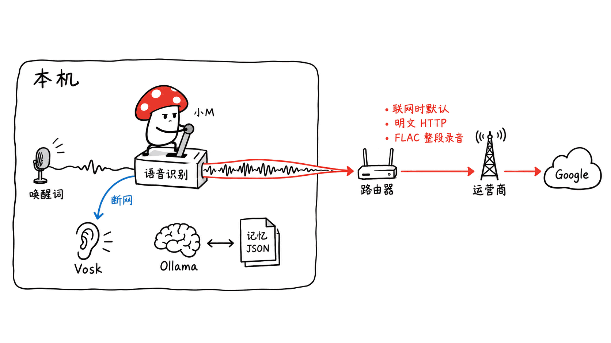
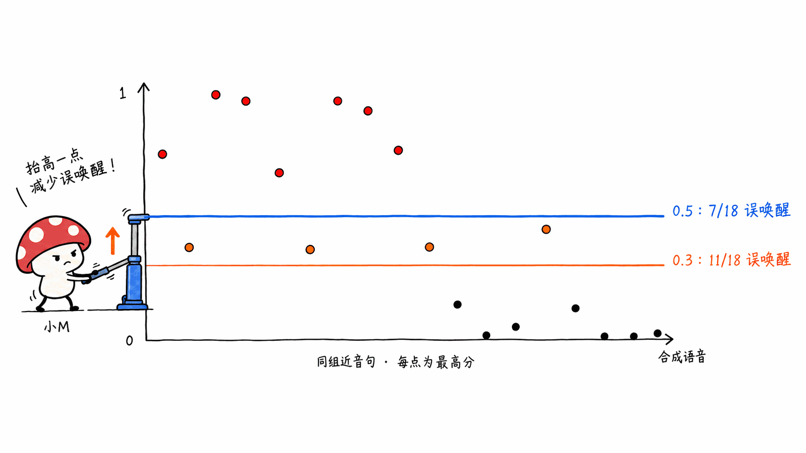

> 📌 开源仓库：Shaan-alpha/jarvis-py
> GitHub：https://github.com/Shaan-alpha/jarvis-py
> 协议：MIT（代码）｜ 语言：Python ｜ Stars：6 ｜ 创建：2026-01-06 ｜ 最近提交：2026-09-04（共 179 次提交，最新版本 v3.5.2）

---

**BLUF**：jarvis-py 是一个面向 Windows 的 Python 桌面语音助手：说「hey jarvis」唤醒，语音转文字，先走关键词路由，再走本地 Ollama（默认 phi3，约 2.2GB）做工具调用或闲聊，回答按句子流式朗读，还带对话记忆和 PDF 检索。代码写得干净，我们在 Mac mini 上跑它的 269 个单元测试，全部通过。但仓库简介里的「Offline AI voice assistant」不准确：**只要能连上 8.8.8.8，你说的每一句话默认都会以 FLAC 格式经明文 HTTP 发到 Google 的免费语音接口**，断网才退回本地的 Vosk。我们用合成语音实测还发现三处问题：**唤醒阈值被调到 0.3，比 openWakeWord 官方建议的 0.5 还低，18 条近音干扰句里有 11 条会误唤醒**；**文档 RAG 的相似度门槛是 0.6，我们问了 6 个文档里明确有答案的问题，一个都没注入进提示词**；**离线 Vosk 把「ten minutes」输出成单词，而提醒解析器只认阿拉伯数字，所以离线时「十分钟后提醒我」直接失效**。它适合拿来读、学三层路由的设计，不适合原样当成隐私优先的日常助手用。中文完全不支持。

这篇文章讲四件事：它的架构和依赖哪些模型、隐私边界到底在哪、我们在 Mac 上实测到的问题，以及怎么改才算真离线。

## 它到底是什么？

jarvis-py 是开发者 Shaan Satsangi 的个人项目，2026 年 1 月第一次上传，5 到 6 月密集迭代，打了 18 个版本标签。仓库的 README、PLAN、CHANGELOG、架构文档、一份 16KB 的自查审计报告，以及 `docs/superpowers/` 下的 18 份设计稿和实施计划都很完整。179 次提交里有 123 次带 `Co-Authored-By: Claude Opus 4.8`，这是一个大量借助 AI 编程助手、但流程很规范的单人作品。

非测试 Python 代码约 5700 行，测试 2346 行。模块划分：

| 模块 | 做什么 |
|---|---|
| `core/speech/` | 唤醒词（openWakeWord）、录音与 STT（在线 Google / 离线 Vosk）、TTS 队列（pyttsx3） |
| `core/router/intent_router.py` | 关键词快速路由，把常见命令直接映射为工具调用，不调模型 |
| `core/agent/` | `@tool` 装饰器注册表、16 个内置工具、插件加载器、LLM 工具选择器 |
| `core/ai/ollama_engine.py` | 拼装提示词（用户画像 + 记忆 + 文档），流式调用 Ollama |
| `core/memory/` | fastembed 嵌入、对话记忆、PDF 向量索引（FAISS）、用户画像 |
| `core/tasks/` | 语音提醒，`threading.Timer` 触发，重启后恢复 |
| `core/hud/` + `hud/` | 可选桌面悬浮窗（pywebview + 本地 WebSocket） |

内置 16 个工具：打开/关闭应用、音量加减/静音、系统状态、网页搜索、打开 YouTube/Google、读写剪贴板、在沙箱工作区里列出/读取/写入/搜索文件；另有一个示例插件 `roll_dice`。

### 依赖哪些模型？许可证是什么？

| 组件 | 默认模型 | 在哪跑 | 模型许可证 |
|---|---|---|---|
| 唤醒词 | openWakeWord `hey_jarvis_v0.1` | 本地 ONNX | **CC BY-NC-SA 4.0（非商用）** |
| 在线 STT | Google 旧版语音接口（Chromium 公共 key） | **Google 服务器** | 非公开 API |
| 离线 STT | Vosk `small-en-us-0.15`（压缩包 40MB） | 本地 | Apache 2.0 |
| 大模型 | Ollama `phi3`（3.8B，约 2.2GB） | 本地 | MIT |
| 嵌入 | all-MiniLM-L6-v2（fastembed ONNX 版，缓存 87MB） | 本地 | Apache 2.0 |
| TTS | pyttsx3 调系统语音（SAPI5 / NSSpeech / espeak） | 本地 | 系统自带 |

仓库本身是 MIT，但**唤醒词模型不是**。openWakeWord 的 README 写明所有预训练模型都采用 CC BY-NC-SA 4.0，因为训练数据里有许可不明确的数据集。jarvis-py 的 PyInstaller 打包脚本会把 `models/` 目录连同唤醒词模型一起打进 exe。自己用没问题，拿去做商业产品就要换模型或自己训练唤醒词。

## 一句话进来，经过哪几步？

README 把路由设计总结成一句话：「cheapest tier that can answer wins」，最便宜的一层能处理就不往下走。一句话识别出来以后，依次经过：

1. **画像抓取**：正则匹配「my name is …」「i like …」之类的句子，写进 `user_profile.json`；
2. **提醒解析**：匹配「remind me in N minutes to …」，命中就设定时器，直接返回；
3. **关键词路由**：子串匹配常见命令（打开记事本、调音量、系统状态、读剪贴板、「search for …」），命中就直接执行工具，**不调用任何模型**；
4. **动词门控的 LLM 工具选择**：只有句子里出现 open/close/play/mute 等动作动词，或者短句里含有工具名里的词，才让 phi3 输出一个 `{"tool": ..., "args": ...}` JSON（`num_predict=80`、`temperature=0`），校验参数后执行；
5. **LLM 闲聊兜底**：以上都没命中，就把用户画像、最相近的一条历史对话、相似度过门槛的文档片段拼进提示词，流式生成，按句子送进 TTS 队列。

这个分层是整个仓库最值得学的地方。桌面语音助手最常用的命令只有十来个，把它们放在确定性的快速路径上，零延迟、零模型调用；只有措辞模糊时才花一次模型推理，而且用动作动词做门控，「讲讲递归」这种问题不会先绕一趟工具选择。插件也是同一个注册表：在 `plugins/` 里放一个带 `@tool` 装饰器的 `.py`，关键词路由和 LLM 工具选择器都能看到它。

打断回答只能靠按钮、`Esc` 或者输入新问题。README 说得很坦白：没有回声消除，麦克风会听到 Jarvis 自己的声音，所以不支持用说话打断。

### 快速路径的代价：子串匹配会误触发

关键词路由用的是「子串包含」，我们把几句普通问句喂给仓库自己的 `resolve_keyword_tool`：

| 输入 | 实际路由 |
|---|---|
| what's my commute time today | **静音**（commute 里含 mute） |
| can you explain what mute swans eat | **静音** |
| how do i lower the volume on my headphones | **把系统音量调低**（本意是提问） |
| tell me why the system status page at work is red | **报告 CPU 和电量** |
| google maps is down, what should i do | **打开浏览器搜索**「maps is down, what should i do」 |

代码注释里其实承认了 commute 的问题（「acceptable for a single-user setup」）。对只会说固定命令的用户这不算大事，但它说明快速路径是用精确度换延迟，词表越长，误触发越多。

## 隐私边界：哪些数据会离开你的机器？

README 画完架构图后写了一句「Everything above runs on your machine」，而同一张图里就画着 Google 在线识别。实际的数据去向是这样的：

| 环节 | 数据去哪 |
|---|---|
| 唤醒词检测 | 本地 |
| **语音转文字（能连上 8.8.8.8:53 时）** | **整段录音以 FLAC 发给 `http://www.google.com/speech-api/v2/recognize`，语言 en-IN** |
| 语音转文字（断网时） | 本地 Vosk |
| 工具选择、闲聊生成 | 本地 Ollama（`localhost:11434`） |
| 对话记忆、用户画像、提醒 | 本地明文 JSON，没有加密、没有删除界面、不限大小 |
| 首次运行 | 从 GitHub 下载唤醒词模型、从 Hugging Face 下载嵌入模型；Vosk 模型缺失时从 alphacephei.com 自动下载 |
| 网页搜索、打开 YouTube | 用户主动触发，打开系统浏览器 |

在线识别用的是 SpeechRecognition 库的 `recognize_google`。我们读了这个库 3.16.1 版的源码：它的默认端点是 **`http://`，不是 `https://`**，用的是库里内置的一把 Chromium 公共 API key。我们把一段 2.2 秒的合成语音（「Search the web for Python tutorials」，macOS `say` 生成，不含任何个人信息）转成 48KB 的 FLAC，按库的请求格式直接 POST 到这个明文地址：返回 HTTP 200，转写结果「search the web for Python tutorial」，置信度 0.80，没有任何跳转到 HTTPS。换句话说，**在 jarvis-py 的主要目标平台 Windows 上，只要联网，你对它说的每一句话都会以明文经过你的路由器、运营商和 Google。**

这不是 jarvis-py 独有的问题，很多教程式 Python 语音助手都这么写。但一个在简介里写「Offline」、在 PLAN 里写「Free / local / zero-money」的项目，默认走的却是在线识别，而且还是明文传输，这一点应该在 README 最显眼的位置写清楚。

在 Mac 上还有个反差：SpeechRecognition 自带的 `flac-mac` 是 x86_64 二进制。我们这台 Apple Silicon 没装 Rosetta，调用直接报「Bad CPU type in executable」。jarvis-py 捕获这个异常后退回 Vosk，于是**在 Apple Silicon 上，在线识别会悄悄失效，结果反而是全本地运行**。装了 Rosetta 或 Homebrew 的 `flac` 之后，就会和 Windows 一样把录音发出去。

还有两个本地攻击面：

- **HUD 的 WebSocket**（`127.0.0.1:8765`）没有任何令牌校验。审计之后加了 Origin 检查，挡住了 `http(s)://` 网页，但本机其他进程或非 http 来源都能连上并发送 `text_query`，进而触发工具。`open_app` 的参数会原样交给 `cmd /c start`，代码注释写着「not sanitized」。
- **插件目录会自动执行**：打包版会加载 `%APPDATA%\JarvisAI\plugins\` 下所有 `.py`，没有签名，也没有确认提示。

对单人本地使用，这两点风险可以接受，但你要知道它们存在。

## 实测：在 Mac mini 上能跑到哪一步？

**环境**：Mac mini（Apple M4，16GB），macOS 26.6.2，Python 3.12 venv，仓库 commit `c8efdf1`。按规则我们没有安装全局依赖，所以没有装 PortAudio（PyAudio 用了一个空桩），也没有装 Ollama，**所有需要大模型的环节（工具选择准确率、回答质量、首 token 延迟）都没有实测**。音频全部用 macOS `say` 合成，不是真人对着麦克风说话。

**安装**：`pip install -r requirements.txt` 在 Apple Silicon 上直接失败，因为锁定的 `vosk==0.3.45` 没有 macOS 版 wheel。PyPI 上 Vosk 最后一个带 macOS universal2 wheel 的版本是 0.3.44，改成它就能装。去掉 PyAudio 后 venv 占 374MB。

**测试套件**：用空桩 PyAudio 跑 `pytest`，**269 个用例全部通过，用时 43.65 秒**；flake8 的致命错误检查为 0。测试覆盖路由、注册表、记忆、文件沙箱、HUD 消息分发等纯逻辑，不碰麦克风和模型。

### 唤醒词：阈值 0.3 太松了

openWakeWord 的 README 说内置模型「trained to work well with a default threshold of 0.5」。jarvis-py 的 `WAKE_THRESHOLD` 先从 0.4 调到 0.6，后来又因为「它听不见我」降到 **0.3**，而且只要 **1 帧**超过阈值就触发，也没有启用 openWakeWord 自带的 Silero VAD。

我们用仓库同款模型（`hey_jarvis_v0.1.onnx`），在 Samantha、Daniel、Karen 三种系统语音下各合成 7 句话，前后补 1 秒静音，逐帧（80 毫秒）打分：

| 句子 | 三种语音的最高分 | 阈值 0.3 下触发 |
|---|---|---|
| Hey Jarvis | 0.999 / 0.995 / 0.998 | 3/3（正确） |
| Hey Travis | 0.742 / 0.344 / 0.993 | **3/3** |
| Hey, Charles | 0.967 / 0.656 / 0.345 | **3/3** |
| Hey jar of beans | 0.976 / 0.938 / 0.762 | **3/3** |
| Hey service | 0.368 / 0.121 / 0.002 | 1/3 |
| They starve us | 0.040 / 0.473 / 0.114 | 1/3 |
| Harvest time | 0.000 / 0.000 / 0.000 | 0/3 |

18 条近音干扰句里，**阈值 0.3 时有 11 条误唤醒，换成官方建议的 0.5 也还有 7 条**。正确的「Hey Jarvis」3 条全中。推理很快，每帧约 1.2 毫秒。

这组测试要打折扣看：干扰句是我们故意挑的近音词；合成语音很干净；openWakeWord 这个模型本身就是用合成语音训练的，对合成语音可能偏敏感。它不能说明日常误唤醒率，只能说明**阈值 0.3 加单帧触发，基本没有给近音词留余量**。另外，README 说唤醒模型「~1 MB」，但 openWakeWord 首次运行会一起下载特征提取模型、VAD 和 TFLite 版本，实际是 7 个文件、约 9MB。

### 离线识别：Vosk small 能用，但会拖垮提醒功能

Vosk `small-en-us-0.15` 加载只要 0.15 秒，1 到 3 秒的音频转写耗时 236 到 517 毫秒：

| 音频 | Vosk 输出 | 后果 |
|---|---|---|
| Open notepad | 「the notepad」 | 关键词路由和动词门控都没命中，掉进闲聊 |
| Remind me in ten minutes to call mom | 「remind me and ten minutes to call mom」 | 提醒没设上 |
| Search the web for Python tutorials | 「search the web for python tutorials」 | 正确 |
| What is the weather like today | 「what is the weather like today」 | 正确 |
| 打开记事本，把音量调大一点（中文） | 「heidi she been buying young the all are he didn't」 | 胡言乱语进了大模型 |

提醒这里的问题不在识别错误。**就算 Vosk 听对了，它输出的也是单词「ten」**，而 `parse_reminder` 的数量只认 `\d+|a|an|half an`。我们验证了：「remind me in ten minutes to call mom」解析结果是 None，「remind me in 10 minutes …」才能成功。Google 在线识别通常返回阿拉伯数字，所以作者在联网环境下测不出这个问题，**断网时只有「a minute」「an hour」「half an hour」这几种说法能设提醒**。

### 记忆和文档检索：门槛把真问题也挡在外面了

**对话记忆**：每次闲聊的一问一答都追加进 `semantic_memory.json`，检索时用 numpy 算余弦相似度，只取 **最相近的 1 条**，门槛 0.55。我们存了 2 条英文记忆，「which code editor do I like」命中「what is my favorite editor」（0.567），「remind me when the dentist is」命中牙医那条（0.681），「what's the capital of France」全部低于 0.11，不注入。英文场景下表现合理，单次编码约 4.6 毫秒。

**文档 RAG**：PDF 按 **500 个字符硬切、不重叠**，用 FAISS 内积检索前 3 条，相似度要 **≥0.6** 才注入提示词。0.6 是从 0.45 调上来的，CHANGELOG 解释说：问一句「how are you」，简历里的某个片段能拿到 0.45 左右，小模型就会围绕它胡编。

我们用仓库的 `build_index` / `search_documents`，索引了一份 766 字符的英文团队手册（切成 500 + 266 两块），然后问了 6 个手册里明确有答案的问题：

| 问题 | 最高分 | 排第一的块对不对 | 注入了吗 |
|---|---|---|---|
| how far in advance should I book flights | 0.548 | 对 | 否 |
| where is the office printer | 0.459 | 对 | 否 |
| what is the backup server called | 0.407 | 对 | 否 |
| when are expense reports due | 0.319 | 答案被切在两块中间 | 否 |
| when does the wifi password change | 0.284 | 对 | 否 |
| who covers on call on weekends | 0.227 | 对 | 否 |
| what is the capital of France（无关） | 0.026 | — | 否 |

**检索排序 6 次里对了 5 次，但因为门槛是 0.6，一条都没进提示词。**「简历泄露」的问题现在已经被闲聊门控挡住了：少于 3 个词或属于问候语的句子根本不触发检索。所以 0.6 这个门槛是在修一个已经有别的补丁盖住的问题，代价是文档问答基本失效。我们只测了一份文档，结论的外推范围有限，但方向很清楚：这个门槛该跟着嵌入模型和切块方式重新标定，而不是凭一次事故拍板。

**画像抓取**也有副作用：「do you think i like pizza」会把 `likes` 写成 pizza；「my name is not important」会把名字改成「not important」，之后每次开机问候都会用它。

### 中文：从第一步就不支持

- 语音输入：在线识别写死 `en-in`，我们把中文合成语音发给同一个接口，返回空结果；离线 Vosk 只有英文模型；
- `clean_query` 用正则 `[^a-zA-Z0-9\s]` 删掉所有非 ASCII 字符，「打开记事本」清洗后是空字符串；
- HUD 里手打中文能进大模型，但 `_should_retrieve` 按空格数词，中文整句只算 1 个词，所以记忆和文档检索永远不会触发；
- 嵌入模型 all-MiniLM-L6-v2 基本只懂英文，phi3 的中文也偏弱。

想用中文，得同时换 STT、清洗函数、嵌入模型和大模型，这相当于重写一半。

## 和同类本地语音助手比，它处在什么位置？

| 项目 | STT | 大模型 | 平台 | 规模与许可 |
|---|---|---|---|---|
| **jarvis-py** | **联网默认 Google（明文 HTTP），断网 Vosk small** | Ollama phi3 | Windows 优先，系统工具仅 Windows | 6 star，MIT（唤醒模型 NC） |
| isair/jarvis | 本地 Whisper（默认 medium，多语言） | Ollama gemma4:e2b 或任意 OpenAI 兼容服务 | macOS 优先 | 1,746 star；README 称 100% 本地、存盘前自动脱敏，支持 MCP；GitHub 未识别出标准许可证 |
| huggingface/speech-to-speech | 可换（Whisper 等） | 可换 | 跨平台，服务化管道 | 13,166 star，Apache-2.0 |
| OpenVoiceOS | 插件化，可全本地 | 插件化 | Linux 设备为主 | ovos-core 287 star，Apache-2.0，完整平台 |

本站写过 huggingface/speech-to-speech 的上手文章：https://blog.mushroom.cv/blog/huggingface-speech-to-speech-voice-agent-vad-stt-llm-tts-local/

横向看，jarvis-py 的独特之处不是能力，而是**可读性**：5700 行 Python，每个设计决策都在 CHANGELOG 和 specs 里写了理由，包括哪些是踩坑后回退的（比如 TTS 引擎复用让第二句以后全部静音，又改回每句新建引擎）。想做一个桌面语音助手、又不想一上来就啃 OVOS 那样的平台，它是个好教材。真要日常用，同样依赖 Ollama 的 isair/jarvis 在隐私和多语言上起点高得多（以上是它 README 的说法，我们没有实测）。

## 怎么改成真离线？

按影响从大到小，这几处改动都很小：

1. **关掉在线识别**。在 `core/speech/engine.py` 的 `command()` 里，把 `online = is_online()` 改成 `online = False`，所有语音只走 Vosk。想要更高的准确率，可以换 Vosk 的大号英文模型，或者把 `recognize_offline` 换成本地 Whisper（faster-whisper / whisper.cpp）。这是一行改动，我们没有在完整运行的程序里验证。
2. **收紧唤醒**。`config/settings.py` 里 `WAKE_THRESHOLD` 至少回到 0.5，`WAKE_CONSECUTIVE` 设为 2；再给 `Model(...)` 加上 `vad_threshold=0.5`，打开 openWakeWord 自带的 VAD。
3. **重新标定文档门槛**。先用自己的文档跑一遍分数分布再定值。我们这份手册里，真问题的最高分落在 0.23 到 0.55，无关问题低于 0.03；在已有闲聊门控的前提下，0.4 附近可能更合适。这只是参考值，没有配合大模型测过回答质量。
4. **让提醒认识数字单词**。在 `parse_reminder` 前把 one 到 sixty 这类单词转成数字，离线提醒就能用了。
5. **给 HUD WebSocket 加令牌**。启动时生成随机令牌，通过 URL fragment 传给 HUD 页面，连接时校验。审计报告里其实已经提过这个方案。

Mac 用户额外要做：把 `vosk` 钉在 0.3.44，`brew install portaudio`。打开/关闭应用、系统状态等工具依赖 `os.startfile` 和 `taskkill`，在 Mac 上用不了，要自己重写。

## 适合谁，不适合谁？

**适合**：想弄懂桌面语音助手每个环节怎么接起来的开发者；想借鉴「关键词快速路径 → 动词门控工具调用 → 闲聊兜底」这种分层路由的人；Windows 用户、英文场景、能接受联网时走 Google 识别。

**不适合**：把「离线」当硬性要求却不打算改代码的人；中文用户；需要可靠文档问答的场景；要做商业产品的人（唤醒模型是 CC BY-NC-SA）；想找一个有社区维护的成熟项目（6 star、0 fork、单人开发，最近一次代码改动是 6 月 20 日，之后只有文档提交）。

Mycelium Protocol 的看法：**「本地优先」和「离线」是两件事。** 一个项目把在线识别当作「增强」，自己也许觉得没问题，但用户看到的是简介里的「Offline」。判断一个语音助手隐私不隐私，别看简介，去找它 STT 那一行代码连的是哪个地址。

## 常见问题

**Q：jarvis-py 能完全离线运行吗？**
A：能，但默认不是。它每 5 秒缓存一次对 8.8.8.8:53 的连通检测，能连上就把录音发给 Google 在线识别，连不上才用本地 Vosk。要真离线，需要把 `command()` 里的 `online` 强制设为 False。大模型、嵌入、唤醒词本来就在本地。

**Q：发给 Google 的录音是加密的吗？**
A：不是。SpeechRecognition 3.16.1 的 `recognize_google` 默认端点是 `http://www.google.com/speech-api/v2/recognize`，我们实测明文 POST 返回 200 并正常转写，没有跳转到 HTTPS。

**Q：它用什么大模型？需要什么硬件？**
A：默认 Ollama 的 phi3（3.8B，下载约 2.2GB），可以在 `config/settings.py` 改 `MODEL_NAME`。仓库带了一个 `model_bakeoff.py`，用来对比 phi3、phi3.5、llama3.2:3b、qwen2.5:1.5b 的工具选择准确率和延迟，但作者还没公布结果，我们也没有 Ollama 环境来跑。

**Q：Mac 能用吗？**
A：核心的语音、记忆、大模型链路是跨平台的，但 `requirements.txt` 在 Apple Silicon 上装不上（vosk 0.3.45 没有 macOS wheel，要改成 0.3.44），系统控制类工具只支持 Windows。我们在 Mac 上跑通了 269 个单元测试，以及唤醒词、Vosk、嵌入这几个模块，没有跑完整的语音循环。

**Q：唤醒词可以商用吗？**
A：代码是 MIT，但 openWakeWord 的预训练模型（包括 hey_jarvis）是 CC BY-NC-SA 4.0，非商用。商业场景要自己训练唤醒词，或者换成许可更宽松的方案。

**Q：支持中文吗？**
A：不支持。在线识别写死英语，离线只有英文模型，输入清洗会删掉所有非 ASCII 字符，检索门控也按空格数词。

## 一手源

- GitHub 仓库：https://github.com/Shaan-alpha/jarvis-py
- 仓库自查审计报告：https://github.com/Shaan-alpha/jarvis-py/blob/main/docs/AUDIT-2026-06-17.md
- openWakeWord（阈值建议、VAD、模型许可证）：https://github.com/dscripka/openWakeWord
- hey_jarvis 模型说明：https://github.com/dscripka/openWakeWord/blob/main/docs/models/hey_jarvis.md
- SpeechRecognition 3.16.1 Google 识别器源码：https://github.com/Uberi/speech_recognition/blob/3.16.1/speech_recognition/recognizers/google.py
- Vosk 模型列表：https://alphacephei.com/vosk/models
- Ollama phi3：https://ollama.com/library/phi3
- isair/jarvis：https://github.com/isair/jarvis

---

> © 2026 Author: Mycelium Protocol. 本文采用 [CC BY 4.0](https://creativecommons.org/licenses/by/4.0/deed.zh) 授权——欢迎转载和引用，须注明作者姓名及原文链接，不得去除署名后以原创发布。

<!--EN-->

> 📌 Repository: Shaan-alpha/jarvis-py
> GitHub: https://github.com/Shaan-alpha/jarvis-py
> License: MIT (code) | Language: Python | Stars: 6 | Created: 2026-01-06 | Last commit: 2026-09-04 (179 commits, latest release v3.5.2)

---

**BLUF**: jarvis-py is a Windows-first Python desktop voice assistant. You say "hey jarvis", it transcribes your speech, tries a keyword router first, then falls back to local Ollama (phi3 by default, about 2.2 GB) for tool calls or chat, and reads the answer aloud sentence by sentence. It also has conversation memory and PDF retrieval. The code is clean: all 269 unit tests passed on our Mac mini. But the repository's tagline, "Offline AI voice assistant", is not accurate. **Whenever the machine can reach 8.8.8.8, every sentence you speak goes to Google's free speech endpoint as FLAC over plain HTTP by default**; only when offline does it fall back to local Vosk. Our tests with synthetic speech found three more problems. **The wake threshold is 0.3, below openWakeWord's recommended 0.5, and 11 of 18 sound-alike phrases triggered it.** **The document RAG threshold is 0.6, and none of 6 questions with clear answers in the document got injected into the prompt.** **Offline Vosk outputs "ten minutes" as a word, but the reminder parser only accepts digits, so "remind me in ten minutes" fails offline.** It is worth reading for its three-tier routing design. It is not ready to use as-is as a privacy-first daily assistant. Chinese is not supported at all.

This post covers four things: the architecture and which models it depends on, where the privacy boundary actually is, what we found testing it on a Mac, and what to change to make it truly offline.

## What is it, exactly?

jarvis-py is a personal project by developer Shaan Satsangi. It was first uploaded in January 2026, iterated heavily in May and June, and has 18 version tags. The documentation is thorough: README, PLAN, CHANGELOG, an architecture doc, a 16 KB self-audit, and 18 design specs and implementation plans under `docs/superpowers/`. 123 of the 179 commits carry `Co-Authored-By: Claude Opus 4.8`. This is a single-developer project built heavily with an AI coding assistant, with a disciplined process.

There are about 5,700 lines of non-test Python and 2,346 lines of tests. The modules:

| Module | What it does |
|---|---|
| `core/speech/` | Wake word (openWakeWord), recording and STT (online Google / offline Vosk), TTS queue (pyttsx3) |
| `core/router/intent_router.py` | Keyword fast path that maps common commands straight to tool calls, with no model call |
| `core/agent/` | `@tool` decorator registry, 16 built-in tools, plugin loader, LLM tool selector |
| `core/ai/ollama_engine.py` | Builds the prompt (user profile + memory + documents) and streams from Ollama |
| `core/memory/` | fastembed embeddings, conversation memory, PDF vector index (FAISS), user profile |
| `core/tasks/` | Voice reminders, fired by `threading.Timer`, restored after restart |
| `core/hud/` + `hud/` | Optional desktop overlay (pywebview + local WebSocket) |

The 16 built-in tools: open/close apps, volume up/down/mute, system status, web search, open YouTube/Google, read/write clipboard, and list/read/write/search files inside a sandboxed workspace. There is also an example plugin, `roll_dice`.

### Which models does it depend on, and under what licenses?

| Component | Default model | Where it runs | Model license |
|---|---|---|---|
| Wake word | openWakeWord `hey_jarvis_v0.1` | Local ONNX | **CC BY-NC-SA 4.0 (non-commercial)** |
| Online STT | Google's legacy speech endpoint (Chromium public key) | **Google's servers** | Unofficial API |
| Offline STT | Vosk `small-en-us-0.15` (40 MB zip) | Local | Apache 2.0 |
| LLM | Ollama `phi3` (3.8B, ~2.2 GB) | Local | MIT |
| Embeddings | all-MiniLM-L6-v2 (fastembed ONNX build, 87 MB cache) | Local | Apache 2.0 |
| TTS | pyttsx3 over system voices (SAPI5 / NSSpeech / espeak) | Local | Ships with the OS |

The repository is MIT, but **the wake-word model is not**. openWakeWord's README states that all of its pre-trained models are CC BY-NC-SA 4.0, because the training data includes datasets with unclear licensing. jarvis-py's PyInstaller spec bundles the `models/` directory, wake-word model included, into the exe. That is fine for personal use. For a commercial product, you need a different model or your own trained wake word.

## What happens to one spoken sentence?

The README sums up the routing design in one line: "cheapest tier that can answer wins." Once a sentence is transcribed, it goes through these steps in order:

1. **Profile capture**: regexes match phrases like "my name is …" or "i like …" and write them to `user_profile.json`.
2. **Reminder parsing**: matches "remind me in N minutes to …"; on a hit it sets a timer and returns.
3. **Keyword routing**: substring matches for common commands (open notepad, change the volume, system status, read the clipboard, "search for …"). A hit runs the tool directly, **with no model call**.
4. **Verb-gated LLM tool selection**: only if the sentence contains an action verb (open, close, play, mute, …) or a short sentence shares a word with a tool name does phi3 get asked for a `{"tool": ..., "args": ...}` JSON object (`num_predict=80`, `temperature=0`). The arguments are validated, then the tool runs.
5. **LLM chat fallback**: if nothing matched, the user profile, the single most similar past exchange, and any document chunks above the similarity threshold go into the prompt. The answer streams out and is queued for TTS sentence by sentence.

This layering is the best thing in the repository. A desktop voice assistant's everyday commands number about a dozen. Putting them on a deterministic fast path costs no latency and no model call. The model only runs when the phrasing is fuzzy, and the action-verb gate means a question like "explain recursion" doesn't take a detour through tool selection first. Plugins share the same registry: drop a `.py` file with a `@tool` decorator into `plugins/` and both the keyword router and the LLM tool selector see it.

You can only interrupt an answer with a button, `Esc`, or by typing a new question. The README is candid about this: there is no echo cancellation, the microphone hears Jarvis's own voice, so interrupting by speaking isn't supported.

### The cost of the fast path: substring matching misfires

The keyword router uses substring containment. We fed a few ordinary questions to the repository's own `resolve_keyword_tool`:

| Input | Actual route |
|---|---|
| what's my commute time today | **Mute** ("commute" contains "mute") |
| can you explain what mute swans eat | **Mute** |
| how do i lower the volume on my headphones | **Lowers the system volume** (it was a question) |
| tell me why the system status page at work is red | **Reports CPU and battery** |
| google maps is down, what should i do | **Opens a browser search** for "maps is down, what should i do" |

A code comment acknowledges the commute case ("acceptable for a single-user setup"). For a user who sticks to fixed commands it's minor, but it shows the fast path trades precision for latency, and the longer the phrase list gets, the more it misfires.

## Privacy boundary: which data leaves your machine?

Right after its architecture diagram, the README says "Everything above runs on your machine", yet the same diagram shows online Google recognition. Here is where data actually goes:

| Step | Where the data goes |
|---|---|
| Wake-word detection | Local |
| **Speech-to-text (when 8.8.8.8:53 is reachable)** | **The whole recording goes as FLAC to `http://www.google.com/speech-api/v2/recognize`, language en-IN** |
| Speech-to-text (offline) | Local Vosk |
| Tool selection, chat generation | Local Ollama (`localhost:11434`) |
| Conversation memory, user profile, reminders | Local plaintext JSON: no encryption, no deletion UI, no size cap |
| First run | Wake-word models from GitHub, embedding model from Hugging Face; the Vosk model auto-downloads from alphacephei.com if missing |
| Web search, open YouTube | User-initiated; opens the system browser |

Online recognition uses the SpeechRecognition library's `recognize_google`. We read version 3.16.1 of that library: its default endpoint is **`http://`, not `https://`**, with a Chromium public API key hard-coded in the library. We converted a 2.2-second synthetic clip ("Search the web for Python tutorials", generated with macOS `say`, no personal data) to a 48 KB FLAC and POSTed it to that plaintext URL in the library's request format. It returned HTTP 200 with the transcript "search the web for Python tutorial" at 0.80 confidence, and no redirect to HTTPS. In other words, **on Windows, jarvis-py's main target platform, everything you say to it while online travels in cleartext through your router, your ISP, and on to Google.**

This isn't unique to jarvis-py; plenty of tutorial-style Python voice assistants do the same. But a project whose tagline says "Offline" and whose PLAN says "Free / local / zero-money" should say prominently in its README that online recognition is the default, and that it is unencrypted.

There's a twist on the Mac. SpeechRecognition's bundled `flac-mac` is an x86_64 binary. Our Apple Silicon machine has no Rosetta, and the call failed with "Bad CPU type in executable". jarvis-py catches the exception and falls back to Vosk, so **on Apple Silicon, online recognition quietly fails and the assistant ends up fully local**. Install Rosetta or Homebrew's `flac`, and it sends your recordings out just as it does on Windows.

Two local attack surfaces are also worth knowing about:

- **The HUD WebSocket** (`127.0.0.1:8765`) has no token check. After the audit it gained an Origin check that blocks `http(s)://` web pages, but any other local process or non-http origin can connect and send a `text_query`, which can reach the tools. `open_app` passes its argument straight to `cmd /c start`, and a code comment says it is "not sanitized".
- **The plugin directory auto-executes**: the packaged build loads every `.py` under `%APPDATA%\JarvisAI\plugins\`, with no signing and no confirmation prompt.

For single-user local use these risks are acceptable, but you should know they exist.

## Hands-on: how far does it get on a Mac mini?

**Environment**: Mac mini (Apple M4, 16 GB), macOS 26.6.2, Python 3.12 venv, repository at commit `c8efdf1`. Per our rules we installed no global dependencies, so there is no PortAudio (PyAudio was replaced with an empty stub) and no Ollama. **Nothing that needs the LLM (tool-selection accuracy, answer quality, time to first token) was tested.** All audio was synthesized with macOS `say`, not a person speaking into a microphone.

**Installation**: `pip install -r requirements.txt` fails outright on Apple Silicon, because the pinned `vosk==0.3.45` has no macOS wheel. The last Vosk release on PyPI with a macOS universal2 wheel is 0.3.44; switching to it works. Without PyAudio, the venv takes 374 MB.

**Test suite**: with the PyAudio stub, `pytest` ran **269 cases, all passing, in 43.65 seconds**, and flake8's fatal-error check reports 0. The tests cover pure logic (routing, registry, memory, file sandbox, HUD message dispatch) and never touch the microphone or the models.

### Wake word: a 0.3 threshold is too loose

openWakeWord's README says the bundled models were "trained to work well with a default threshold of 0.5". jarvis-py's `WAKE_THRESHOLD` went from 0.4 up to 0.6, then down to **0.3** after "it can't hear me" reports, and it fires on a **single** frame above threshold. It also does not enable openWakeWord's built-in Silero VAD.

Using the same model (`hey_jarvis_v0.1.onnx`), we synthesized 7 phrases in each of three system voices (Samantha, Daniel, Karen), padded each with 1 second of silence, and scored every 80 ms frame:

| Phrase | Max score across the three voices | Fires at 0.3 |
|---|---|---|
| Hey Jarvis | 0.999 / 0.995 / 0.998 | 3/3 (correct) |
| Hey Travis | 0.742 / 0.344 / 0.993 | **3/3** |
| Hey, Charles | 0.967 / 0.656 / 0.345 | **3/3** |
| Hey jar of beans | 0.976 / 0.938 / 0.762 | **3/3** |
| Hey service | 0.368 / 0.121 / 0.002 | 1/3 |
| They starve us | 0.040 / 0.473 / 0.114 | 1/3 |
| Harvest time | 0.000 / 0.000 / 0.000 | 0/3 |

Of the 18 sound-alike clips, **11 triggered a false wake at 0.3, and 7 still did at the recommended 0.5**. All 3 real "Hey Jarvis" clips fired. Inference is fast, about 1.2 ms per frame.

Take this with a grain of salt. We picked the sound-alikes on purpose; synthetic speech is very clean; and this openWakeWord model was itself trained on synthetic speech, so it may be extra sensitive to it. This doesn't measure the everyday false-wake rate. It shows that **a 0.3 threshold with single-frame triggering leaves almost no margin for sound-alike words**. Also, the README describes the wake model as "~1 MB", but on first run openWakeWord also downloads the feature extractors, the VAD, and TFLite variants: 7 files, about 9 MB in total.

### Offline recognition: Vosk small works, but breaks reminders

Vosk `small-en-us-0.15` loads in 0.15 seconds and transcribes 1-3 second clips in 236-517 ms:

| Audio | Vosk output | Consequence |
|---|---|---|
| Open notepad | "the notepad" | Missed by both the keyword router and the verb gate; falls through to chat |
| Remind me in ten minutes to call mom | "remind me and ten minutes to call mom" | No reminder set |
| Search the web for Python tutorials | "search the web for python tutorials" | Correct |
| What is the weather like today | "what is the weather like today" | Correct |
| 打开记事本，把音量调大一点 (Chinese: "open notepad, turn the volume up a bit") | "heidi she been buying young the all are he didn't" | Gibberish sent to the LLM |

The reminder problem isn't just the misrecognition. **Even when Vosk hears correctly, it outputs the word "ten"**, and `parse_reminder` only accepts `\d+|a|an|half an` as the amount. We confirmed that "remind me in ten minutes to call mom" parses to None, while "remind me in 10 minutes …" works. Google's online recognizer usually returns digits, so the author wouldn't see this while online. **Offline, only "a minute", "an hour" and "half an hour" can set a reminder.**

### Memory and document retrieval: the threshold blocks real questions too

**Conversation memory**: every chat exchange is appended to `semantic_memory.json`. Retrieval computes cosine similarity with numpy and takes **only the single closest entry**, with a 0.55 threshold. We stored two English memories. "which code editor do I like" matched "what is my favorite editor" (0.567), "remind me when the dentist is" matched the dentist entry (0.681), and "what's the capital of France" scored below 0.11 against everything, so nothing was injected. For English this behaves sensibly, at about 4.6 ms per encoding.

**Document RAG**: PDFs are cut into **fixed 500-character chunks with no overlap**, FAISS inner-product search returns the top 3, and a chunk must score **≥0.6** to be injected into the prompt. The 0.6 was raised from 0.45. The CHANGELOG explains why: for "how are you", a chunk of a résumé scored about 0.45, and the small model would confabulate around it.

Using the repository's own `build_index` / `search_documents`, we indexed a 766-character English team handbook (split into chunks of 500 and 266 characters) and asked 6 questions the handbook clearly answers:

| Question | Top score | Top-ranked chunk correct? | Injected? |
|---|---|---|---|
| how far in advance should I book flights | 0.548 | Yes | No |
| where is the office printer | 0.459 | Yes | No |
| what is the backup server called | 0.407 | Yes | No |
| when are expense reports due | 0.319 | Answer split across the two chunks | No |
| when does the wifi password change | 0.284 | Yes | No |
| who covers on call on weekends | 0.227 | Yes | No |
| what is the capital of France (unrelated) | 0.026 | — | No |

**Retrieval ranked the right chunk first 5 times out of 6, but with a 0.6 threshold nothing reached the prompt.** The résumé leak is now blocked by the chitchat gate anyway: sentences under 3 words, or greetings, never trigger retrieval at all. So the 0.6 threshold fixes a problem that another patch already covers, at the cost of making document Q&A mostly useless. We tested only one document, so don't generalize too far, but the direction is clear: the threshold should be calibrated against the embedding model and the chunking, not set from a single incident.

**Profile capture** has side effects too. "do you think i like pizza" writes `likes = pizza`. "my name is not important" renames you to "not important", and every startup greeting will use it.

### Chinese: unsupported from the first step

- Voice input: online recognition is hard-coded to `en-in`; we sent a Chinese synthetic clip to the same endpoint and got an empty result. Offline Vosk has only the English model.
- `clean_query` deletes every non-ASCII character with the regex `[^a-zA-Z0-9\s]`, so "打开记事本" ("open notepad") becomes an empty string.
- Chinese typed into the HUD does reach the LLM, but `_should_retrieve` counts words by spaces, a whole Chinese sentence counts as one word, and memory and document retrieval never fire.
- The all-MiniLM-L6-v2 embedding model is essentially English-only, and phi3 is weak in Chinese.

Supporting Chinese means replacing the STT, the cleanup function, the embedding model and the LLM together, which amounts to rewriting half the project.

## Where does it sit among local voice assistants?

| Project | STT | LLM | Platform | Scale and license |
|---|---|---|---|---|
| **jarvis-py** | **Google by default when online (plain HTTP), Vosk small offline** | Ollama phi3 | Windows-first; system tools Windows-only | 6 stars, MIT (wake model NC) |
| isair/jarvis | Local Whisper (medium, multilingual, by default) | Ollama gemma4:e2b or any OpenAI-compatible server | macOS-first | 1,746 stars; README claims 100% local, automatic redaction before saving to disk, MCP support; GitHub detects no standard license |
| huggingface/speech-to-speech | Swappable (Whisper and others) | Swappable | Cross-platform service pipeline | 13,166 stars, Apache-2.0 |
| OpenVoiceOS | Plugin-based, can be fully local | Plugin-based | Mainly Linux devices | ovos-core 287 stars, Apache-2.0, full platform |

We've written a hands-on guide to huggingface/speech-to-speech: https://blog.mushroom.cv/blog/huggingface-speech-to-speech-voice-agent-vad-stt-llm-tts-local/

Compared with these, what sets jarvis-py apart isn't capability but **readability**. It's 5,700 lines of Python, and every design decision has its reasoning written down in the CHANGELOG and specs, including the ones that were reverted after going wrong (for example, reusing the TTS engine made every sentence after the first silent, so it went back to a fresh engine per sentence). If you want to build a desktop voice assistant without starting on a platform the size of OVOS, it's good study material. For daily use, isair/jarvis also runs on Ollama and starts from a much better position on privacy and languages (per its README; we did not test it).

## How do you make it truly offline?

In order of impact, these are all small changes:

1. **Turn off online recognition.** In `command()` in `core/speech/engine.py`, change `online = is_online()` to `online = False` so all speech goes through Vosk. For better accuracy, use Vosk's larger English model, or replace `recognize_offline` with local Whisper (faster-whisper / whisper.cpp). It's a one-line change, and we did not verify it in the full running program.
2. **Tighten the wake word.** In `config/settings.py`, set `WAKE_THRESHOLD` back to at least 0.5 and `WAKE_CONSECUTIVE` to 2, and pass `vad_threshold=0.5` to `Model(...)` to enable openWakeWord's built-in VAD.
3. **Recalibrate the document threshold.** Look at the score distribution on your own documents before picking a value. In our handbook, real questions topped out between 0.23 and 0.55 and the unrelated one scored under 0.03. Given the existing chitchat gate, something around 0.4 may fit better. That's a reference point only; we didn't test answer quality with an LLM.
4. **Teach reminders number words.** Convert words like one through sixty to digits before `parse_reminder`, and offline reminders work.
5. **Add a token to the HUD WebSocket.** Generate a random token at startup, pass it to the HUD page in the URL fragment, and check it on connect. The repository's own audit already proposed this.

Mac users also need to pin `vosk` to 0.3.44 and `brew install portaudio`. The open/close-app and system-status tools rely on `os.startfile` and `taskkill`, so they don't work on a Mac and would need rewriting.

## Who is it for, and who should skip it?

**Good fit**: developers who want to see how each piece of a desktop voice assistant connects; anyone who wants to borrow the layered routing (keyword fast path, then verb-gated tool calls, then chat fallback); Windows users working in English who accept Google recognition while online.

**Poor fit**: anyone who needs "offline" as a hard requirement and doesn't plan to change code; Chinese speakers; use cases that need reliable document Q&A; commercial products (the wake model is CC BY-NC-SA); anyone looking for a mature, community-maintained project (6 stars, 0 forks, one developer; the last code change was June 20, with only documentation commits since).

Mycelium Protocol's view: **"local-first" and "offline" are not the same thing.** A project may consider online recognition an "enhancement", but users see "Offline" in the tagline. To judge whether a voice assistant is private, skip the tagline and find the line of STT code that says which address your voice is sent to.

## FAQ

**Q: Can jarvis-py run fully offline?**
A: Yes, but not by default. It checks connectivity to 8.8.8.8:53 (cached for 5 seconds). If reachable, recordings go to Google's online recognizer; only when unreachable does it use local Vosk. To be truly offline, force `online` to False in `command()`. The LLM, embeddings and wake word are already local.

**Q: Is the audio sent to Google encrypted?**
A: No. The default endpoint of `recognize_google` in SpeechRecognition 3.16.1 is `http://www.google.com/speech-api/v2/recognize`. Our plaintext POST returned 200 with a normal transcript and no redirect to HTTPS.

**Q: Which LLM does it use, and what hardware does it need?**
A: Ollama's phi3 by default (3.8B, about a 2.2 GB download); change `MODEL_NAME` in `config/settings.py` to switch. The repository includes `model_bakeoff.py` to compare tool-selection accuracy and latency across phi3, phi3.5, llama3.2:3b and qwen2.5:1.5b, but the author hasn't published results, and we had no Ollama setup to run it.

**Q: Does it work on a Mac?**
A: The voice, memory and LLM core is cross-platform, but `requirements.txt` fails to install on Apple Silicon (vosk 0.3.45 has no macOS wheel; use 0.3.44), and the system-control tools are Windows-only. On a Mac we ran all 269 unit tests plus the wake-word, Vosk and embedding modules, but not the full voice loop.

**Q: Can the wake word be used commercially?**
A: The code is MIT, but openWakeWord's pre-trained models (hey_jarvis included) are CC BY-NC-SA 4.0, which is non-commercial. For commercial use, train your own wake word or use something with a more permissive license.

**Q: Does it support Chinese?**
A: No. Online recognition is hard-coded to English, the only offline model is English, input cleanup strips every non-ASCII character, and the retrieval gate counts words by spaces.

## Primary sources

- GitHub repository: https://github.com/Shaan-alpha/jarvis-py
- The repository's self-audit: https://github.com/Shaan-alpha/jarvis-py/blob/main/docs/AUDIT-2026-06-17.md
- openWakeWord (threshold guidance, VAD, model license): https://github.com/dscripka/openWakeWord
- hey_jarvis model description: https://github.com/dscripka/openWakeWord/blob/main/docs/models/hey_jarvis.md
- SpeechRecognition 3.16.1 Google recognizer source: https://github.com/Uberi/speech_recognition/blob/3.16.1/speech_recognition/recognizers/google.py
- Vosk model list: https://alphacephei.com/vosk/models
- Ollama phi3: https://ollama.com/library/phi3
- isair/jarvis: https://github.com/isair/jarvis

---

> © 2026 Author: Mycelium Protocol. Licensed under [CC BY 4.0](https://creativecommons.org/licenses/by/4.0/) — free to share and adapt with attribution. You must credit the author and link to the original; removing attribution and republishing as original is not permitted.
