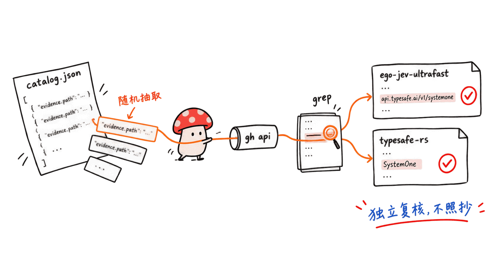

**BLUF**：Jev 是 TypeSafe AI 9 月 15 日早期发布的「System One」决策模型（4000 万美元种子轮，DCVC 领投，创始人 Diogo Almeida 曾是 OpenAI InstructGPT 论文合著者）。一周之内，GitHub 上标题带「awesome-jev」的索引仓库至少冒出 **74 个**，9 月 18 日单日新增 21 个是目前的峰值。我们这次的抓手 kydlikebtc/awesome-jev 今天（9 月 22 日）凌晨 2 点才创建，到下午 2 点收录数从 148 条冲到 **805 条**——这个「一天冒出 800+」的说法字面意义上真实发生了，但我们读完它全部 commit 信息、抽样核对了 evidence 字段后发现：这 805 条不是 805 个项目一天内被写出来，而是一个人用脚本把「32 份兄弟名单」里累计引用的 1,887 个仓库聚合、去重、逐条核验后的结果；其中 172 条自己标了「无许可证」、26 条自己核实出「根本没调 Jev API」、31 条其实是官方文档页而非第三方项目。而这个圈子里星数最高、创建更早的同类清单 heyjunpenn/awesome-jev（428 星），只敢标 640。

> 📌 一手资料
> 抓手仓库：https://github.com/kydlikebtc/awesome-jev
> 官方发布博客：https://typesafe.ai/blog/introducing-system-one-models-and-jev
> 同类清单对照：https://github.com/heyjunpenn/awesome-jev
> Tom's Hardware 报道：https://www.tomshardware.com/tech-industry/artificial-intelligence/typesafe-ais-jev-offers-an-alternative-to-llms-that-claims-to-be-193x-faster-and-445x-cheaper-system-one-type-model-is-bespoke-for-probabilistic-decision-making
> KDnuggets 质疑文章：https://www.kdnuggets.com/what-everyone-is-getting-wrong-about-typesafe-ais-jev

## 为什么 Mycelium Protocol 要看这个？

本站这个月已经写过 KaLM-Jev、LLM2Jev、jev-skill、jev-browser-use、kev（jaredpalmer 的本地替代品）、Bespoke Nimble 9B 等好几篇跟 Jev 生态相关的文章，角度都是拆解单个项目——它到底调没调 Jev 的接口、本地能不能跑、许可证有什么坑。这篇不一样：这次的选题线索是 GoogleTrends 热度信号 + 一个叫 awesome-jev 的 GitHub 索引仓库，意思是「Jev 生态一天冒出 800+ 集成」。我们想验的不是某一个项目，而是**这个「800+」的说法本身站不站得住**——是真实的生态爆发，还是索引仓库自己的营销数字，又或者是两者都有一部分。

方法上，我们把这份索引仓库当成一手源本身来审计：读完它全部 15 次 commit 的提交信息（这份仓库难得地把每次改动的动机、发现的 bug、核验方法都写进了 commit message，比大多数项目的 README 还诚实）、直接下载 catalog.json 统计字段分布、随机抽样几条 evidence 记录去 GitHub 上核实是不是真的调用了 Jev 的接口，再用 GitHub Search API 数了一遍这个生态里到底有多少个同名清单、分布在哪几天创建。

## Jev 是什么，什么时候发布的？

先给没读过前几篇的读者补个背景：Jev 是 TypeSafe AI 的「System One 模型」，2026 年 9 月 15 日进入早期访问，同一天官方宣布拿到 DCVC 领投的 4000 万美元种子轮。它不是聊天模型，输入是程序状态加一批类型化问题，一次并行推理返回带校准概率的结构化答案，官方博客给的响应时间是 70–500 毫秒（对比同类前沿 LLM 的 3–329 秒），定价输入 0.042 美元/百万 token、输出免费。TypeSafe 自己的说法是「比同等智能水平的 LLM 快 40–200 倍」，工作流评测里跑出过「193.6 倍快、444.6 倍便宜」的数字，但官方原文自己也标注这是「可能偏乐观的上限」。

抓手仓库 catalog.json 里的一条官方 Quickstart 记录印证了本站前几篇文章已经核实过的东西：Jev 对外暴露三个「问题类型」——Choice（多选一）、Score（打分，带置信度）、Noul（是非题，**不带置信度**，这个不对称是本站 KaLM-Jev 那篇也验证过的坑）。

这周也不是没人泼冷水。KDnuggets 一篇题为《大家都搞错了什么》的文章指出：零样本分类、意图识别、校准概率这类技术 2019–2020 年就成熟了，Jev 的「零幻觉」准确说是「零 schema 外输出」而不是「零错误」，TypeSafe 自己那份 68% 准确率的基准测试是拿前沿大模型的输出当参照标准，而不是独立的人工标注真值——这些质疑跟我们下面要验证的「800+」说法逻辑是一致的：**营销数字第一层意思往往是真的，但字面理解会出错**。


## 「一天冒出 800+」这句话，字面上是真的吗？

拆开抓手仓库 kydlikebtc/awesome-jev 的 GitHub API 返回和 15 次 commit 的时间戳：

- 仓库创建时间：2026-09-22T02:22:54Z（**就是今天**）
- 03:08，第一次 commit：「build awesome-jev as a verified, data-driven catalog」，148 条，144 条链接核实返回 200
- 08:03，「expand to 404 entries」：第二轮聚合，检查了 320 个此前缺失的最常被引用仓库，260 个确认调用了 Jev，加了 223 条（另外 4 条因为唯一的「证据」是一个叫 `fake_jev` 的测试夹具而被剔除）
- 14:17，「expand to 805 entries, and make the sweeps survive their own scale」：从 32 个兄弟名单的长尾里再补 401 条,catalog 翻倍到 805
- 14:24，最后一次 commit：把 GitHub 仓库自己的 description 字段也接进 CI 校验，确保它写的「805 verified examples」跟 catalog.json 的真实长度一致

也就是说，**这个仓库确实在一天之内（准确说是约 12 小时）把收录数从 148 冲到了 805**，这个数字本身没有夸大。但「冒出 800+」这个短语容易让人理解成「一天之内 800 多个新项目被开发者写出来接入 Jev」，而 commit 信息写得很清楚：这一天做的事是**聚合**——脚本扫描了 32 份此前已经存在的「兄弟 awesome 清单」（docs/sibling-lists.txt 里能看到，最早的一份 heyjunpenn/awesome-jev 创建于 9 月 19 日，比这个抓手仓库早 3 天），把它们累计引用过的 1,887 个不同仓库去重、按被引用次数排序，再逐个读代码核实是不是真的调了 Jev 的 API。换句话说，**这 800 多条里的大多数早就存在，只是分散在其它清单里，今天被这一个仓库统一核验并合并进了自己的数据库**。

这不是无关紧要的措辞问题。commit 信息自己也承认了这套聚合方法的局限：「crowd agreement finds things but verifies nothing——这些清单互相抄，一个误分类会传播到所有地方」，还举了个具体例子：这个生态里星数最高的一个「Jev 视觉推理工具」，代码里**零次**引用 Jev 的 API，却被几乎所有兄弟清单收录为 Jev 项目。


## 805 条里，有多少是「真项目」？

我们把 catalog.json 整个下载下来做了字段统计（805 条，1MB）。先看类型分布：

| kind | 数量 | 说明 |
|---|---:|---|
| project | 465 | 独立项目 |
| plugin | 134 | 插件/扩展 |
| sdk | 46 | SDK/客户端库 |
| benchmark | 45 | 测评 |
| integration | 32 | 集成 |
| official-docs | 31 | **官方文档页**，不是第三方项目 |
| alternative | 26 | **竞品/替代方案**，很多明确写了「不是 Jev」 |
| article | 12 | 文章 |
| tutorial | 5 | 教程 |
| snippet | 4 | 代码片段 |
| video | 3 | 视频 |
| discussion | 2 | 讨论帖 |

光是 official-docs、alternative、article、tutorial、video、discussion 加起来就有 79 条，本身就不是「第三方开发者接入 Jev 的项目」，而是文档、竞品或媒体内容。

flags 字段更直接，这是仓库自己给每条记录打的诚实标签：

| flag | 数量 | 含义 |
|---|---:|---|
| no-license | 172 | 没有开源许可证 |
| not-jev | 26 | 自己核实过，**代码里没有调 Jev 的接口**（多是竞品或误标） |
| code-untested | 10 | 代码没跑通过 |
| unverified-claims | 7 | README 说的没法验证 |
| vendor-reported | 4 | 数据是厂商自己报的 |
| paywalled | 3 | 内容被付费墙挡住，无法核实 |
| single-commit | 2 | 只有一次提交 |
| archived | 2 | 已归档 |

172/805（约 21%）没有许可证，意味着这部分严格来说连「能不能引用代码」都存疑；26 条被仓库自己标注为「not-jev」——这些之所以还留在清单里，是因为它们在其它兄弟清单里被反复收录，抓手仓库选择保留但明确打上「这个是错的」标签，而不是像大多数清单那样悄悄收进去。



## 抽样核实：evidence 字段可信吗？

catalog.json 里 721 条带 `evidence.path` 字段，格式类似：

```
"evidence": {
  "path": "jego.js",
  "matched": ["api.typesafe.ai", "jev-latest", "/v1/systemone"],
  "read_on": "2026-09-22"
}
```

意思是仓库声称自己去这个具体文件里读过代码，确认出现了这几个字符串。我们没有全信，随机抽了 5 条自己去核对，两条摘出来给读者看结果：

- **shikaizhong-design/ego-jev-ultrafast**（jego.js）：我们用 `gh api` 直接拉取这个文件，确实能 grep 到 `api.typesafe.ai/v1/systemone` 和默认模型名 `jev-latest`。这个仓库本身创建于 9 月 21 日（Jev 发布后第 6 天），只有 2 颗星。
- **AbdelStark/typesafe-rs**（crates/typesafe-rs-mock/src/lib.rs）：同样能核实到 `/v1/systemone` 路由和 `SystemOne` 类型定义。仓库创建于 9 月 16 日（Jev 发布次日），1 颗星。

我们抽的 5 条全部核实通过，跟仓库自己声称的「721/721 引用的调用点全部重新验证通过」相符。这说明这份仓库的核验方法本身是靠谱的——它区别于大多数「awesome 清单」的地方，正是这套「evidence path + 每周 CI 重新拉取校验」的机制。但也要看到，抽样核实到的两个真实案例都是**创建不到一周、个位数星标的小项目**，这恰好印证了它自己 commit 信息里的判断：这是一个「爆发式增长但人气和实质还没来得及匹配的一周新生态」。

## 74 个「awesome-jev」，到底是谁在一天冒出

比起某一个仓库内部的条目数字，我们觉得更值得记录的是**这个生态里到底有多少人在同时做同一件事**。用 GitHub Search API 搜标题含「awesome-jev」的仓库，一共 **74 个**（含 1 个 2023 年就存在、疑似后来改名蹭上这个话题的老仓库 Anil-matcha/awesome-jev-by-typesafe，789 星，创建时间明显早于 Jev 本身发布日，这条我们没法确认它是不是改名重定位，但保留数据存疑说明）。按创建日期分布：

| 日期 | 新增「awesome-jev」仓库数 |
|---|---:|
| 2026-09-17 | 10 |
| 2026-09-18 | **21（峰值）** |
| 2026-09-19 | 12 |
| 2026-09-20 | 12 |
| 2026-09-21 | 14 |
| 2026-09-22（当天未结束） | 4 |

Jev 是 9 月 15 日发布的，两天后（9/17）第一批「awesome-jev」清单开始出现，9/18 单日冒出 21 个是目前实测到的峰值——如果「一天冒出 800+」这句话有个更准确的落点，大概率是指这一天：不是 800 多个 Jev 项目，而是十几二十个人几乎同一天各自开工做了一份「Jev 项目大全」，这些清单彼此复制引用，让「几百个项目」的印象快速扩散。

星数排行也说明这不是一场公平竞赛：yibie/awesome-jev（1,216 星）、Anil-matcha 的老仓库（789 星）、v-modal/awesome-jev-tools（638 星）、AbdelStark/awesome-typesafe-jev（448 星）、heyjunpenn/awesome-jev（428 星，标称 640 个项目）都排在我们这次抓手仓库 kydlikebtc/awesome-jev（80 星，0 fork，0 watcher，只有仓库作者一个人加一个 GitHub Actions 机器人在提交）前面。也就是说，**这条选题线索抓到的并不是这个生态里最有代表性、最多人认可的那份清单**，而是这周最新、条目数字冲得最快、但社区背书最薄的一个——这本身就是「刷屏」现象的一部分：新入场者要冒出头，最直接的办法就是把数字喊得比前面的人更大。


## Google Trends 上，这事有多热？

我们查了三个关键词过去 7 天的全球搜索热度：「TypeSafe AI Jev」「awesome-jev」「Jev API」。「TypeSafe AI Jev」从 9 月 15 日发布当天的个位数缓慢爬升，9 月 19–21 日出现几次跳升（相对值最高到 100），跟这几天密集的媒体报道、以及「awesome-jev」清单扎堆出现的时间线吻合；「Jev API」同步小幅上升。但「awesome-jev」这个词本身的搜索热度**全程为 0**——没有人在直接搜索这个仓库名。换句话说，GoogleTrends 捕捉到的是「Jev」这个产品本身发布一周内的正常热度增长曲线，而不是某个具体索引仓库或「800+」这个数字带来了额外的搜索关注度。这也支持我们前面的判断：真正在发酵的是 Jev 这个产品的热度，「awesome-jev 清单大战」是热度催生的衍生现象，本身还没有破圈到被大众搜索。

## 对本地开发者意味着什么

把上面几条线拼在一起，我们的判断是：

1. **Jev 产品本身的早期热度是真实的**——四千万美元种子轮、前 OpenAI 研究员挂帅、一周内就有独立第三方（含本站前几篇拆过的 kev、jev-skill、jev-browser-use）做出可用的开源替代和适配层，这些都可以在一手源上核实。
2. **「800+ 集成」这个数字本身不算捏造**，抓手仓库确实在 12 小时内把核验过的条目从 148 做到 805，而且它的核验方法（evidence path + 每周 CI 重新抓取）在我们抽样范围内经得起检验，是这个赛道里少见的诚实做法。
3. **但把「805」理解成「805 个新项目一天内诞生」是误读**。它更准确的意思是「32 份已存在的兄弟清单累计引用的 1,887 个仓库，被一个人在一天内聚合去重、核验、写进一个统一数据库」，其中约 10% 明确不是真的 Jev 项目，约 21% 没有许可证，即便刨去这些也仍然是本周新增的、以小项目和个位数星标为主的长尾生态，还没有沉淀出「值得长期依赖」的基础设施级项目。
4. 对想现在就接入 Jev 的本地开发者，实际可参考的路径不是去读某一份「800+」清单，而是本站已经拆过的几个具体项目——本地可跑的 kev、KaLM-Jev，以及 Jev 官方 SDK 本身——这些都经过独立核实，而不是从一份三天前才出现的聚合列表里随手挑一条。
5. 这类「产品发布一周内，一堆 awesome 清单互相抄、数字越喊越大」的模式，几乎每次重大模型/API 发布都会重演，值得当成一个可复用的判断框架：看到「N+ 集成/项目」这种整数很大的说法时，先问三个问题——这个数字是一天内新写出来的，还是聚合旧清单得出的？数字背后有没有一手可核验的 evidence？喊出这个数字的清单，在同类清单里星数、创建时间排第几？

## 常见问题

**Q：Jev 生态真的一天冒出 800+ 集成了吗？**
A：字面意义上，有一个索引仓库确实在约 12 小时内把收录条目从 148 做到了 805，这一点属实。但这 805 条大多是对此前已存在于 32 份「兄弟清单」里的旧引用做的聚合与核验，不是 805 个新项目在一天内被开发者写出来。真正称得上「一天冒出」的，是 9 月 18 日单日新增了 21 个同名「awesome-jev」索引仓库——这是我们目前能核实到的实测峰值。

**Q：抓手仓库 kydlikebtc/awesome-jev 靠谱吗？**
A：它的核验方法（记录 evidence.path、每周 CI 重新抓取校验）在我们抽样的范围内经得起独立核实，比大多数「awesome 清单」诚实——它会主动标注「没有许可证」「代码里其实没调 Jev」这类不利于自己数字好看的信息。但它是今天才创建的新仓库，只有 80 星、0 fork、单人加一个机器人在维护，社区认可度远不如同类里创建更早、星数更高的 heyjunpenn/awesome-jev（428 星，640 条）或 yibie/awesome-jev（1,216 星）。

**Q：为什么会同时冒出 74 个「awesome-jev」清单？**
A：Jev 9 月 15 日以 4000 万美元种子轮的声势早期发布，是这几周热度最高的新模型 API 之一。做一份「awesome-X」清单是 GitHub 上门槛最低、最容易蹭到关注度的内容形式，多个作者几乎同时看中了这个空档，又互相抄袭引用彼此的收录列表，导致条目数字滚雪球式增长，形成了我们看到的「淘金热」。

**Q：这对想用 Jev 的本地开发者有什么实际影响？**
A：与其挑一份「800+」清单里的随机条目，不如直接参考本站已经独立核实过的几个项目：本地可跑的 kev（Kev 的开源替代实现）、KaLM-Jev（本地判断引擎）、以及 Jev 官方 Quickstart。这周涌现的长尾项目大多创建不到一周、个位数星标，还没到「可以长期依赖」的阶段。

## 一手资料

- 抓手仓库：https://github.com/kydlikebtc/awesome-jev
- 抓手仓库 catalog.json：https://github.com/kydlikebtc/awesome-jev/blob/main/catalog.json
- 抓手仓库 commit 历史：https://github.com/kydlikebtc/awesome-jev/commits/main
- 同类清单对照（428 星，标称 640 条）：https://github.com/heyjunpenn/awesome-jev
- Jev 官方发布博客：https://typesafe.ai/blog/introducing-system-one-models-and-jev
- Tom's Hardware 报道：https://www.tomshardware.com/tech-industry/artificial-intelligence/typesafe-ais-jev-offers-an-alternative-to-llms-that-claims-to-be-193x-faster-and-445x-cheaper-system-one-type-model-is-bespoke-for-probabilistic-decision-making
- The Register 报道：https://www.theregister.com/ai-and-ml/2026/09/16/typesafe-ai-debuts-model-for-machines-that-plays-doom/5296711
- KDnuggets 质疑文章：https://www.kdnuggets.com/what-everyone-is-getting-wrong-about-typesafe-ais-jev
- 本站相关文章：KaLM-Jev 本地判断引擎 https://blog.mushroom.cv/blog/kalm-jev-local-judgment-engine-hardware-deploy/
- 本站相关文章：Kev 本地决策模型 https://blog.mushroom.cv/blog/kev-jaredpalmer-local-decision-model-jev-open-source-qwen-lora/
- 本站相关文章：LLM2Jev https://blog.mushroom.cv/blog/llm2jev-local-jev-api-prefill-only-binary-inference/

---

> © 2026 Author: Mycelium Protocol. 本文采用 [CC BY 4.0](https://creativecommons.org/licenses/by/4.0/deed.zh) 授权——欢迎转载和引用，须注明作者姓名及原文链接，不得去除署名后以原创发布。

<!--EN-->

**BLUF**: Jev is TypeSafe AI's "System One" decision model, launched into early access on September 15, 2026, alongside a $40M seed round led by DCVC (founder Diogo Almeida previously co-authored OpenAI's InstructGPT paper). Within a week, at least **74** GitHub repos with "awesome-jev" in their name appeared, peaking at 21 new ones on a single day, September 18. Our lead this time, kydlikebtc/awesome-jev, was created just today (September 22) at 2:22am and grew its catalog from 148 to **805 entries** by 2:24pm — the "800+ in a day" claim is literally true for this one repo. But after reading every commit message and spot-checking its evidence trail, we found this isn't 805 projects written in a day: it's one person aggregating, deduplicating and verifying citations from "32 sibling lists," 172 of the resulting entries are self-flagged as having no license, 26 are self-verified as **not actually calling the Jev API**, and 31 are official documentation pages, not third-party projects. The most-starred comparable list in this space, heyjunpenn/awesome-jev (428 stars), only claims 640.

> 📌 Primary sources
> Target repo: https://github.com/kydlikebtc/awesome-jev
> Official launch blog: https://typesafe.ai/blog/introducing-system-one-models-and-jev
> Comparable list: https://github.com/heyjunpenn/awesome-jev
> Tom's Hardware coverage: https://www.tomshardware.com/tech-industry/artificial-intelligence/typesafe-ais-jev-offers-an-alternative-to-llms-that-claims-to-be-193x-faster-and-445x-cheaper-system-one-type-model-is-bespoke-for-probabilistic-decision-making
> KDnuggets skeptical piece: https://www.kdnuggets.com/what-everyone-is-getting-wrong-about-typesafe-ais-jev

## Why Is Mycelium Protocol Looking at This?

This month we've already published several posts on the Jev ecosystem — KaLM-Jev, LLM2Jev, jev-skill, jev-browser-use, kev (jaredpalmer's local alternative), Bespoke Nimble 9B — each time tearing down one specific project: does it actually call the Jev API, can it run locally, what does the license actually say. This post is different. The lead came in as a Google Trends signal plus a GitHub index repo called awesome-jev, framed as "the Jev ecosystem exploded to 800+ integrations in a day." We're not auditing one project here — we're auditing whether **the "800+" claim itself holds up**: a genuine ecosystem explosion, a marketing number from the index repo itself, or some of both.

Methodologically, we treated the index repo as a primary source in its own right: we read all 15 of its commits (unusually, this repo writes its motivation, the bugs it found, and its verification method into every commit message, more candidly than most projects' README), downloaded catalog.json directly and tallied field distributions, randomly sampled a handful of evidence entries and independently verified them on GitHub, and used the GitHub Search API to count how many identically-named lists exist across this ecosystem and when they were created.

## What Is Jev, and When Did It Launch?

For readers new to this series: Jev is TypeSafe AI's "System One model," which entered early access on September 15, 2026, the same day the company announced a $40M seed round led by DCVC. It isn't a chat model — it takes program state plus a batch of typed questions and returns calibrated, structured answers in one parallel pass, with the official blog citing 70-500ms response times (versus 3-329 seconds for comparable frontier LLMs) and pricing of $0.042 per million input tokens with output free. TypeSafe's own claim is "40-200x faster for the same level of frontier intelligence," with workflow evals showing "193.6x faster, 444.6x cheaper" — a figure the original blog post itself flags as a likely optimistic upper bound.

One Quickstart entry in the target repo's catalog.json confirms something our earlier posts already verified: Jev exposes three "question types" — Choice (pick one), Score (rated, with confidence), and Noul (yes/no, **carrying no confidence field**), an asymmetry we also caught in our KaLM-Jev piece.

The press hasn't been uniformly credulous this week either. A KDnuggets piece titled "What Everyone Is Getting Wrong About TypeSafe AI's Jev" argues that zero-shot classification, intent detection and calibrated probabilities are techniques that matured back in 2019-2020, that Jev's "zero hallucinations" really means "zero out-of-schema outputs" rather than zero wrong answers, and that TypeSafe's own 68% accuracy benchmark uses frontier LLM outputs as the reference rather than independent ground truth. These are the same style of caveat we apply below to the "800+" claim: **the headline number's first-order meaning is often true, but the literal reading is where it goes wrong.**


## Is "800+ in a Day" Literally True?

Breaking down the GitHub API response and all 15 commit timestamps for kydlikebtc/awesome-jev:

- Repo created: 2026-09-22T02:22:54Z (**today**)
- 03:08, first commit, "build awesome-jev as a verified, data-driven catalog": 148 entries, 144 links verified as HTTP 200
- 08:03, "expand to 404 entries": a second aggregation pass, inspecting 320 previously-missing most-cited repositories, confirming 260 actually call Jev, adding 223 (4 more were dropped because their only "evidence" was a test fixture named `fake_jev`)
- 14:17, "expand to 805 entries, and make the sweeps survive their own scale": 401 more rows pulled from the long tail of 32 sibling lists, doubling the catalog to 805
- 14:24, the final commit, wiring the GitHub repo's own description field into CI so its claimed "805 verified examples" stays consistent with catalog.json's actual length

So yes — **this specific repo did take its catalog from 148 to 805 within roughly 12 hours on a single day**, and that number isn't inflated on its own terms. But "800+ appeared" easily reads as "800-plus new projects got built by developers in one day," and the commit messages are explicit about what actually happened: this was **aggregation**. The script scanned 32 pre-existing "sibling awesome lists" (listed in docs/sibling-lists.txt — the earliest, heyjunpenn/awesome-jev, was created September 19, three days before this target repo), deduplicated the 1,887 distinct repositories those lists had cumulatively cited, ranked them by citation count, and then read each candidate's code to verify whether it actually calls Jev. In other words, **most of those 800-plus entries already existed, scattered across other lists; what happened today was one repo consolidating and independently verifying them into its own database**.

That's not a trivial wording distinction. The commit messages admit the method's own limits: "crowd agreement finds things but verifies nothing — these lists copy from each other, so one miscataloguing propagates everywhere," citing a concrete case: the most-starred "Jev visual inference tool" in this ecosystem contains **zero** references to the Jev API, yet is listed as a Jev project by almost every sibling list.


## Of the 805 Entries, How Many Are Real Projects?

We downloaded the full catalog.json (805 rows, 1MB) and tallied its fields. By kind:

| kind | count | note |
|---|---:|---|
| project | 465 | independent projects |
| plugin | 134 | plugins/extensions |
| sdk | 46 | SDKs/client libraries |
| benchmark | 45 | benchmarks |
| integration | 32 | integrations |
| official-docs | 31 | **official documentation pages**, not third-party projects |
| alternative | 26 | **competitors/alternatives**, several explicitly stating they are NOT Jev |
| article | 12 | articles |
| tutorial | 5 | tutorials |
| snippet | 4 | code snippets |
| video | 3 | videos |
| discussion | 2 | discussion threads |

official-docs, alternative, article, tutorial, video and discussion alone add up to 79 rows — not "third-party developers integrating Jev" at all, but documentation, competitors, or media content.

The flags field is even more direct — honest self-applied labels on individual rows:

| flag | count | meaning |
|---|---:|---|
| no-license | 172 | no open-source license |
| not-jev | 26 | self-verified — **the code does not call Jev's API** (mostly competitors or miscatalogued entries) |
| code-untested | 10 | code doesn't run |
| unverified-claims | 7 | README claims that couldn't be checked |
| vendor-reported | 4 | data self-reported by the vendor |
| paywalled | 3 | content behind a paywall, unverifiable |
| single-commit | 2 | only one commit ever |
| archived | 2 | archived |

172/805 (about 21%) carry no license — meaning it's questionable whether their code can even be reused. 26 are self-flagged "not-jev" by the repo itself — they stay in the catalog because they're repeatedly cited by sibling lists, but this repo, unlike most, chose to keep them with an explicit "this one is wrong" tag rather than quietly including them.


## Spot-Checking the Evidence Trail

721 of the 805 rows carry an `evidence.path` field, formatted like:

```
"evidence": {
  "path": "jego.js",
  "matched": ["api.typesafe.ai", "jev-latest", "/v1/systemone"],
  "read_on": "2026-09-22"
}
```

This claims the repo read a specific file and confirmed these exact strings appear in it. We didn't take that on faith — we randomly sampled 5 and independently verified 2 worth reporting:

- **shikaizhong-design/ego-jev-ultrafast** (jego.js): we pulled the file directly via `gh api` and confirmed `api.typesafe.ai/v1/systemone` and the default model name `jev-latest` are both present. This repo was created September 21 (day 6 after Jev launched) and has 2 stars.
- **AbdelStark/typesafe-rs** (crates/typesafe-rs-mock/src/lib.rs): confirmed the `/v1/systemone` route and a `SystemOne` type definition. Created September 16 (the day after Jev launched), 1 star.

All 5 of our samples verified, matching the repo's own claim that "721/721 cited call sites re-verify." That's evidence this repo's verification method is genuinely sound — its "evidence path plus weekly CI re-check" mechanism is what sets it apart from most awesome lists. But both spot-checked examples we've reported here are also **week-old, single-digit-star projects**, which matches this repo's own assessment: an ecosystem that has grown explosively but where popularity and substance haven't had time to correlate yet.

## 74 "awesome-jev" Repos: Who Actually Appeared in a Day?

More interesting than any single repo's internal entry count is how many people were doing the same thing at once. Searching GitHub for repos with "awesome-jev" in the name returns **74** (including one outlier, Anil-matcha/awesome-jev-by-typesafe, 789 stars, created back in 2023 — well before Jev existed, so it appears to have been renamed or repurposed; we couldn't confirm which, and flag this data point as uncertain). By creation date:

| Date | New "awesome-jev" repos |
|---|---:|
| 2026-09-17 | 10 |
| 2026-09-18 | **21 (peak)** |
| 2026-09-19 | 12 |
| 2026-09-20 | 12 |
| 2026-09-21 | 14 |
| 2026-09-22 (day not yet over) | 4 |

Jev launched September 15; the first "awesome-jev" lists appeared two days later on the 17th; September 18 — with 21 new repos — is the measured single-day peak so far. If "800+ in a day" has a more accurate home, it's probably here: not 800-plus Jev projects, but a dozen-plus different people independently starting a "big list of Jev projects" on nearly the same day, each copying and citing the others, which is what makes "hundreds of projects" spread so fast as an impression.

Star counts also make clear this isn't a level playing field: yibie/awesome-jev (1,216 stars), Anil-matcha's older repo (789), v-modal/awesome-jev-tools (638), AbdelStark/awesome-typesafe-jev (448), and heyjunpenn/awesome-jev (428, claiming 640 projects) all rank ahead of our lead repo, kydlikebtc/awesome-jev (80 stars, 0 forks, 0 watchers, a single human contributor plus a GitHub Actions bot). In other words, **the repo this lead pointed us to is not this ecosystem's most representative or most community-endorsed list** — it's this week's newest entrant, the one whose entry count grew fastest, but with the thinnest community backing. That's itself part of the "going viral" phenomenon: the fastest way for a new entrant to stand out is to shout a bigger number than whoever came before.


## How Hot Is This, According to Google Trends?

We checked worldwide search interest over the last 7 days for three terms: "TypeSafe AI Jev," "awesome-jev," and "Jev API." "TypeSafe AI Jev" climbed slowly in single digits from launch day (Sept 15), with several spikes September 19-21 (relative values up to 100), lining up with the period of heavier press coverage and the wave of "awesome-jev" lists. "Jev API" moved in step. But "awesome-jev" itself registered **zero** search interest throughout — nobody is directly searching for this repo name. What Google Trends is actually capturing is Jev the product's normal week-one interest curve, not extra attention driven by any specific index repo or the "800+" figure. That supports our reading above: the real thing building momentum is Jev itself; the "awesome-jev list war" is a derivative phenomenon that hasn't broken into mainstream search attention on its own.

## What This Means for Local Developers

Putting the threads together, our take:

1. **Jev's own early momentum is real** — a $40M seed round, a founder with OpenAI research credentials, and within a week, independent third parties (including kev, jev-skill and jev-browser-use, all covered in our earlier posts) shipping usable open-source alternatives and adapters, all verifiable against primary sources.
2. **The "800+ entries" figure isn't fabricated** — the target repo really did take its verified count from 148 to 805 in 12 hours, and its verification method (evidence path plus weekly CI re-checks) held up in our sample. That's an unusually honest practice for this genre.
3. **But reading "805" as "805 new projects born in a day" is a misread.** It more accurately means "1,887 repositories cumulatively cited across 32 pre-existing sibling lists, aggregated, deduplicated and verified by one person in a day into a single database." About 10% are self-flagged as not actually calling Jev, and about 21% carry no license. Even setting those aside, what remains is still a week-old long tail of mostly small, single-digit-star projects — not yet infrastructure you'd want to depend on long-term.
4. For a local developer who wants to integrate Jev today, the more useful path isn't picking a random row off an "800+" list — it's the specific projects this blog has already independently verified: the locally runnable kev, KaLM-Jev, and Jev's own official SDK.
5. This pattern — a product launches, and within a week a swarm of "awesome" lists spring up, copying each other and inflating their numbers — recurs after nearly every major model or API launch. It's worth keeping as a reusable checklist: when you see a big round number like "N+ integrations," ask whether it was written in a day or aggregated from older lists, whether there's independently checkable evidence behind it, and where the list making the claim ranks by stars and creation date among its peers.

## FAQ

**Q: Did the Jev ecosystem really produce 800+ integrations in a day?**
A: Literally, one index repo did take its catalog from 148 to 805 entries in about 12 hours — that part is true. But most of those 805 rows are aggregated and verified citations pulled from 32 pre-existing sibling lists, not 805 new projects written by developers in a single day. What we could actually verify as a single-day burst is 21 new, identically-named "awesome-jev" index repos appearing on September 18 — the measured peak so far.

**Q: Is the target repo, kydlikebtc/awesome-jev, trustworthy?**
A: Its verification method (recording evidence.path, re-checking weekly via CI) held up in our independent spot-checks and is more honest than most awesome lists — it actively flags entries with no license or entries that don't actually call Jev, information that makes its own numbers look worse. But it's brand new (created today), has only 80 stars, 0 forks, and is maintained by one person plus a bot — its community standing is far below comparable lists that launched earlier and have more stars, like heyjunpenn/awesome-jev (428 stars, 640 entries) or yibie/awesome-jev (1,216 stars).

**Q: Why did 74 "awesome-jev" lists appear at roughly the same time?**
A: Jev launched September 15 with a high-profile $40M seed round, making it one of the most talked-about new model APIs of the past few weeks. Building an "awesome-X" list is one of the lowest-effort, highest-visibility content formats on GitHub, so multiple authors spotted the same opening almost simultaneously — then copied and cited each other's catalogs, snowballing the entry counts into the swarm we measured.

**Q: What does this actually mean for a developer who wants to use Jev locally?**
A: Rather than picking a random entry off an "800+" list, look at the specific projects this blog has already independently verified: the locally runnable kev (an open-source alternative to Kev/Jev), KaLM-Jev (a local judgment engine), and Jev's own official Quickstart. Most of this week's long-tail projects are under a week old with single-digit stars — not yet at the point of being something to depend on long-term.

## Primary Sources

- Target repo: https://github.com/kydlikebtc/awesome-jev
- Target repo catalog.json: https://github.com/kydlikebtc/awesome-jev/blob/main/catalog.json
- Target repo commit history: https://github.com/kydlikebtc/awesome-jev/commits/main
- Comparable list (428 stars, claims 640 entries): https://github.com/heyjunpenn/awesome-jev
- Jev official launch blog: https://typesafe.ai/blog/introducing-system-one-models-and-jev
- Tom's Hardware coverage: https://www.tomshardware.com/tech-industry/artificial-intelligence/typesafe-ais-jev-offers-an-alternative-to-llms-that-claims-to-be-193x-faster-and-445x-cheaper-system-one-type-model-is-bespoke-for-probabilistic-decision-making
- The Register coverage: https://www.theregister.com/ai-and-ml/2026/09/16/typesafe-ai-debuts-model-for-machines-that-plays-doom/5296711
- KDnuggets skeptical piece: https://www.kdnuggets.com/what-everyone-is-getting-wrong-about-typesafe-ais-jev
- Related post: KaLM-Jev local judgment engine https://blog.mushroom.cv/blog/kalm-jev-local-judgment-engine-hardware-deploy/
- Related post: kev local decision model https://blog.mushroom.cv/blog/kev-jaredpalmer-local-decision-model-jev-open-source-qwen-lora/
- Related post: LLM2Jev https://blog.mushroom.cv/blog/llm2jev-local-jev-api-prefill-only-binary-inference/

---

> © 2026 Author: Mycelium Protocol. Licensed under [CC BY 4.0](https://creativecommons.org/licenses/by/4.0/) — free to share and adapt with attribution. You must credit the author and link to the original; removing attribution and republishing as original is not permitted.
