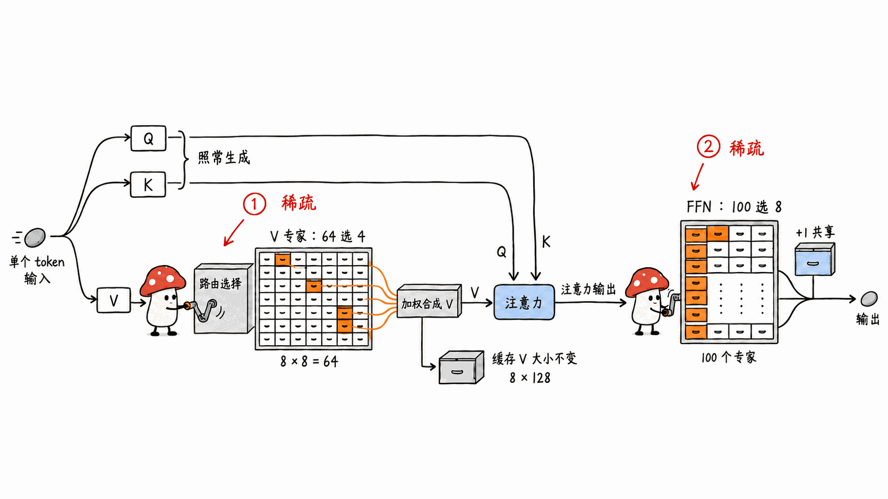
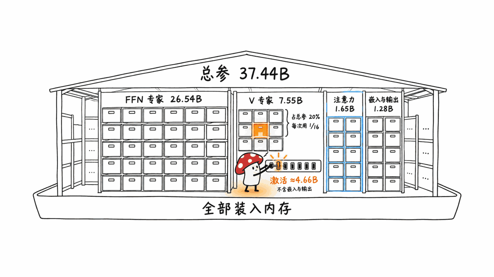
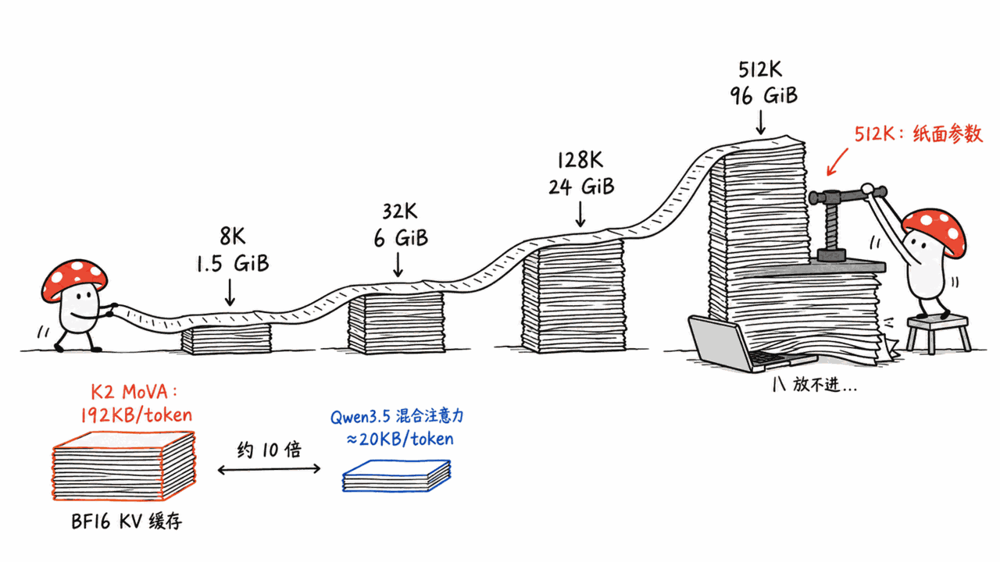
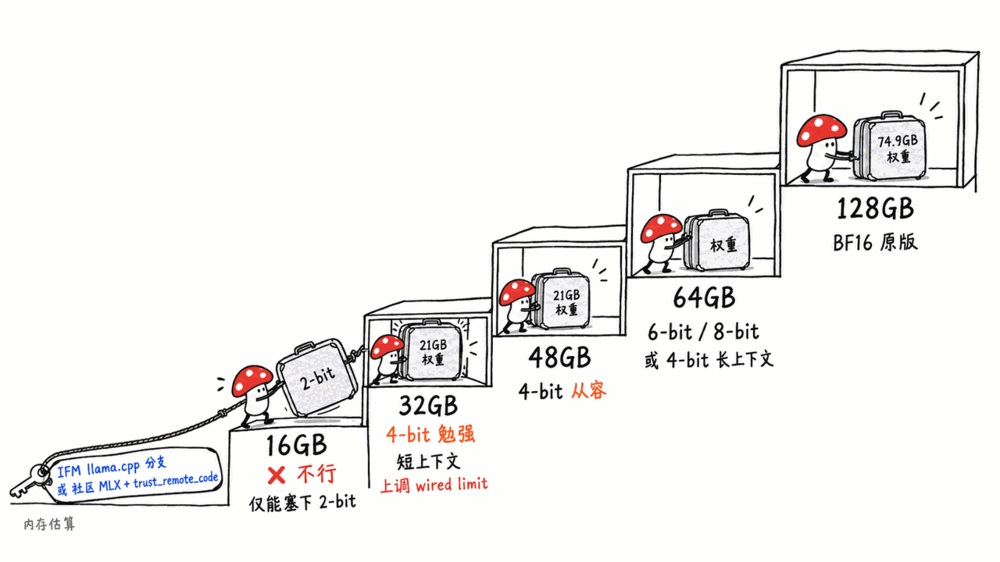

> 📌 模型：IFM/K2-Horizon-MoVA-36B-A4B（Apache-2.0，HF 仓库 2026-09-01 创建，9 月 7 日最后更新）
> HuggingFace：https://huggingface.co/IFM/K2-Horizon-MoVA-36B-A4B
> 官方 GGUF（仅 BF16）：https://huggingface.co/IFM/K2-Horizon-MoVA-36B-A4B-GGUF
> 截至 9 月 11 日：HF 点赞 278，近 30 天下载 5,192，同名衍生仓库约 30 个（GGUF / MLX / FP8 / NVFP4 / GPTQ / EAGLE3）

---

**BLUF**：K2-Horizon-MoVA-36B-A4B 是 MBZUAI 旗下基础模型研究院（Institute of Foundation Models，IFM）发布的 K2 Horizon 家族里唯一的「稀疏」成员。它有两层稀疏：FFN 是常规 MoE（100 个专家选 8 个，外加 1 个共享专家），注意力里的 **V 投影也换成了 64 选 4 的「Value 专家」**，这就是名字里的 MoVA（Mixture-of-Values Attention）。我们用 HTTP Range 只读了 48 个权重分片的文件头，逐张量统计：总参 **37.44B**，每 token 实际参与计算的约 **4.66B**（不含词嵌入和输出层）。许可证是 Apache-2.0，纯文本，官方自报 Terminal-Bench 2.1 为 58.6、tau3-Banking 为 26.8，这两项都高于它表里列出的 Qwen3.6-35B-A3B、Nemotron 3 Ultra 等对手，但 GPQA、HLE、长上下文这几项并不领先。本地用户要先知道两个坑：一是 **KV 缓存很重**，每 token 192KB（BF16），是 Qwen3.5-35B-A3B 这类混合注意力模型的约 10 倍，「512K 上下文」在 Mac 上基本只能看不能用；二是 **生态还没进主线**，llama.cpp 上游不认这个架构，mlx-lm 主线也没有，只能用 IFM 的 llama.cpp 分支或社区 MLX 转换。按文件体积推算，**16GB 别想，32GB 能勉强跑 4-bit、上下文要压短，64GB 才宽裕**。

> 声明：本文作者手上是 16GB M4 Mac mini，跑不动这个模型，也没有下载权重。下文**没有任何实测速度或实测内存**。数字要么来自模型卡、config、权重文件头、HF / GitHub API，要么是按这些公开信息推算，推算的地方都会标明。

---

## IFM 是谁？和 K2、LLM360 什么关系？

IFM 的全称是 Institute of Foundation Models，隶属阿联酋的穆罕默德·本·扎耶德人工智能大学（MBZUAI）。HF 上的 IFM 组织页标注成员 98 人、模型 38 个、数据集 17 个。

这个组织的来历可以从仓库上看出来：访问 `huggingface.co/LLM360/K2` 会被 307 重定向到 `huggingface.co/IFM/K2`。也就是说，**IFM 在 HF 上的组织就是原来的 LLM360 改名而来**。LLM360 是 MBZUAI 从 2023 年开始做的「全透明」开源模型项目，Amber（7B）、Crystal、K2（65B，2024 年 4 月）、K2-Think（2025 年 9 月）、K2-V2（2025 年 12 月）都挂在这里。所以 K2 Horizon 不是突然冒出来的新团队，而是这条「权重、数据、训练代码一起放」路线的第四代左右。

K2 Horizon 这一代一次放了六个尺寸（MarkTechPost 和 MBZUAI 新闻稿的说法，HF 仓库可以对上）：

| 模型 | 类型 | HF 点赞（9/11） |
|---|---|---:|
| K2-Horizon-0.9B | 稠密 | 60 |
| K2-Horizon-3.7B | 稠密 | 26 |
| K2-Horizon-7B（另有 7B-Uno） | 稠密 | 112 |
| K2-Horizon-32B | 稠密 | 26 |
| **K2-Horizon-MoVA-36B-A4B** | **MoE + MoVA** | **278** |
| K2-Horizon-375B-A23B | MoE | 73 |

36B-A4B 是整个家族里最受关注的一个，点赞数是旗舰 375B 的近 4 倍。原因不难猜：它是唯一一个「总参大、激活小、单机能装下」的尺寸，正好落在本地部署最关心的区间。

## MoVA 到底改了什么？

模型卡对 MoVA 只有一句话：「a Mixture-of-Experts model with Mixture-of-Values attention (MoVA) that stores 36B parameters and runs 4B per token」。原理没展开，所以我们直接读了仓库里的 `modeling_k2_horizon.py`（1,115 行）和 `config.json`。

标准的注意力层里，每个 token 的隐状态会经过三个线性投影，得到 Q、K、V。MoVA 保留 Q 和 K 不变，**把 V 投影换成一组专家**：

- 每层有 **64 个 Value 专家**，每个都是一个 2560→1024 的线性层（等于一套完整的 8 个 KV 头 × 128 维的 V 投影）
- 一个路由器（`v_router`）给每个 token 打分，用 sigmoid 评分选出 **4 个**专家，对 4 个专家的输出做 SiLU 激活后按权重相加，得到这个 token 的 V
- 路由有一个细节：偏置只参与「选谁」，不参与「加权多少」，代码注释说这是为了和他们内部训练框架 XLLM 的数值行为完全一致。这和 DeepSeek-V3 那种「无辅助损失的负载均衡偏置」思路相似（`router_aux_loss_coef` 只有 0.001）
- 注意力输出后面还有一个 softplus 门控（`attention_gate_func: softplus`），也就是近一年常见的「gated attention」

FFN 这一侧是常规 MoE：100 个路由专家选 8 个，外加 1 个共享专家，专家中间维度 768。48 层里前 3 层是稠密层（普通注意力 + 6144 维 MLP），后 45 层同时启用 MoVA 和 MoE。

我们的理解是：**MoVA 是在注意力里再开一条「扩容量」的轴**。FFN 的 MoE 已经被证明是便宜地堆知识容量的办法，MoVA 把同样的思路用到 V 上，让不同 token 可以用不同的「值空间」。Moor Insights 的分析文章转述 IFM 的说法，称它的效果「接近稠密 32B，但激活参数少得多」。

但有一点要说清楚：**MoVA 不省 KV 缓存**。代码里被缓存的是专家混合之后的 V，形状仍然是 8 个 KV 头 × 128 维，和普通 GQA 一样大。它省的是计算，不是显存。

## 37.44B 总参里，每个 token 真正在用多少？

模型卡说「36B 总参、4B 激活」，没有给明细。和写 Nex-N2.5-mini 那篇时一样，我们用 HTTP Range 请求把 48 个 safetensors 分片的文件头读下来（每个只读几十 KB，不下载权重），逐张量统计。共 16,998 个张量，全部是 BF16：

| 组成 | 参数量 | 每 token 用多少 |
|---|---:|---|
| FFN 路由专家（45 层 × 100 个） | 26.54B | 8/100 → 约 2.12B |
| **MoVA Value 专家（45 层 × 64 个）** | **7.55B** | **4/64 → 约 0.47B** |
| 注意力 Q/K/O/门控 + 路由器 + 稠密层 V | 1.65B | 全部 |
| 共享专家 | 0.27B | 全部 |
| 前 3 层稠密 MLP | 0.15B | 全部 |
| 输出层 lm_head | 0.64B | 全部 |
| 词嵌入 embed_tokens | 0.64B | 查表，不算矩阵乘 |
| **合计** | **37.44B**（与 HF API 的 37,444,792,020 一致） | |

所以每个 token 的激活参数：**不算词嵌入和输出层约 4.66B，算上输出层约 5.31B**（推算）。名字里的「A4B」是按前一种口径往下取整的。作为对照，同档的 Qwen3.5/3.6-35B-A3B 激活约 3B，Nex-N2.5-mini 我们算过是 2.95B。K2 MoVA 每个 token 的计算量比它们多大约一半。

两个值得注意的地方：

1. **Value 专家占了总参的 20%**（7.55B / 37.44B）。这部分参数每次只用 1/16，但全都得装进内存。对本地用户来说，MoVA 的「额外容量」是按内存付费的。
2. **词表有 250,624 个 token，输入输出嵌入没有共享**，光这两块就是 1.28B。仓库的 `migration_manifest.json` 里内部检查点路径包含 `jais250k` 字样，Jais 是 MBZUAI 之前做的阿拉伯语—英语模型。我们据此推测它沿用了 Jais 系列的 25 万词表（这是按文件路径推断，官方没说明）。

顺带一提，这份 manifest 还暴露了内部集群的检查点路径，路径名里带着 `mid5_decay_50B`、`bsz20M`、`seq512k`、`lr4e-5` 这类训练超参的缩写，看起来是「第 5 个中训练阶段、50B token 退火、20M token 批大小、512K 序列长度」。这些都是从命名推断的，不是官方数据，但和模型卡「中训练阶段起原生 524,288 上下文」的说法一致。

## 自报分数说明了什么？

模型卡只有一张表，下面照录。**K2 这一列是 IFM 自报的**；模型卡注明对手的分数「来自 Artificial Analysis」，但没说 K2 自己的分数是谁跑的。我们没有找到 Artificial Analysis 对这个 36B 模型的独立收录（该机构公开给过的是旗舰 375B 的智能指数 47）。

| 基准 | K2 MoVA 36B-A4B | Nemotron 3 Ultra（550B-A55B） | Qwen3.6-35B-A3B | Muse Glimmer-30B（稠密） | Gemma 4 31B-it（稠密） |
|---|---:|---:|---:|---:|---:|
| tau3-Banking（Agent 工具调用） | **26.8** | 14.2 | 9.3 | 23.5 | 14.8 |
| Terminal-Bench 2.1 | **58.6** | 53.9 | 44.9 | 51.7 | 43.4 |
| SciCode | 38.9 | 39.9 | 35.8 | **43.6** | 43.4 |
| HLE（无工具） | 25.2 | **28.4** | 22.2 | 22.0 | 23.6 |
| GPQA Diamond | 80.8 | **86.7** | 84.1 | 83.5 | 85.7 |
| AA-LCR（长上下文推理） | 66.3 | 71.0 | 66.7 | **80.0** | 68.3 |
| AA-Omniscience 准确率 | 18.8 | 22.6 | 18.8 | **27.0** | 20.0 |
| AA-Omniscience 不幻觉率 | 69.2 | 70.3 | 49.5 | 18.1 | 15.0 |

（表中还有 Nemotron 3 Super 和 G9v3-39A5B 两列，这里略去。）

我们的独立判断：

- **亮点集中在 Agent 两项**。Terminal-Bench 2.1 的 58.6 和 tau3-Banking 的 26.8 确实高于表里所有对手，包括 15 倍体量的 Nemotron 3 Ultra。模型卡「超过 15 倍体量的 MoE」这句话，成立的范围就是这两项。
- **知识和推理类不领先**。GPQA 80.8 比 Qwen3.6-35B-A3B 的 84.1 低，AA-LCR 66.3 和 Qwen3.6 基本持平，事实准确率 18.8 和 Qwen3.6 打平。「512K 原生上下文」没有转化成长上下文推理的领先。
- **对手的选择有取舍**。IFM 自家 K2-Horizon-32B 的模型卡里列了 **Qwen3.8-27B**（稠密），分数是 tau3-Banking 48.0、Terminal-Bench 2.1 79.8、GPQA 90.5、HLE 33.9，每一项都明显高于 MoVA 36B。但 MoVA 这张卡的对照组里没有它。「超过约 30B 的稠密模型」这句话，要看你拿哪个 30B 来比。
- **绝对分数要看清楚**。tau3-Banking 26.8 意味着银行场景的工具调用任务大约四分之三没做成。它比同档好，但离「放心交给它办事」还远。
- **所有分数都是 `reasoning_effort="high"` 下跑的**，模型卡建议每次请求都开 high。高推理强度意味着更长的思考链，本地跑时 token 数和耗时都会上去。

社区也有第三方对比：量化作者 hermitdave 用自己的 BenchLocal 工具，在 4-bit（oQ4e）下拿它和 Qwen3.6-35B-A3B 比了 8 类自定义任务，K2 赢了 7 类，工具调用 93 比 63。但同一份报告说 Qwen 的单流生成速度约为 K2 的 1.8 倍（48.1 对 88.4 tok/s），首 token 延迟 6.3 秒对 2.4 秒。报告**没有披露测试硬件**，README 和报告网页上 K2 的速度数字还对不上。我们把它当作「方向性参考」，不当结论。

## 本地跑：KV 缓存为什么是真正的门槛？

很多人看到「4B 激活」就以为它很轻。权重这边确实可以量化压下来，但 **KV 缓存是这个模型在本地最容易被忽略的成本**。

按 config 推算：48 层全部是标准注意力（没有滑动窗口，也没有线性注意力），每层缓存 8 个 KV 头 × 128 维的 K 和 V，BF16 下每个 token 占：

48 层 × 2（K 和 V）× 1024 × 2 字节 = **196,608 字节 ≈ 192KB**

| 上下文 | KV 缓存（BF16） | KV 缓存（8-bit） |
|---:|---:|---:|
| 8K | 1.5 GiB | 0.75 GiB |
| 32K | 6 GiB | 3 GiB |
| 128K | 24 GiB | 12 GiB |
| 512K | 96 GiB | 48 GiB |

对照一下：Qwen3.5-35B-A3B 这一代 40 层里只有 10 层是完整注意力，另外 30 层是线性注意力，我们在 Nex-N2.5-mini 那篇里算过每 token 只要约 20KB。**K2 MoVA 的 KV 缓存大约是它的 10 倍。**

这意味着：官方 vLLM 示例把 `--max-model-len` 设成 131072，用的是两张 H200；在 Mac 上，「512K 原生上下文」基本只能是纸面参数。实际能用的上下文，16K 到 32K 比较现实。

## 16GB、32GB、64GB 的 Mac 分别能不能跑？

先看量化体积（HF API 文件列表，十进制 GB）：

| 格式 | 仓库 | 体积 |
|---|---|---:|
| BF16 原版 | IFM/K2-Horizon-MoVA-36B-A4B | 74.89 |
| BF16 GGUF（官方唯一一档） | IFM/K2-Horizon-MoVA-36B-A4B-GGUF | 74.92 |
| GGUF Q8_0 | NANI-Nithin/…-GGUF | 39.83 |
| GGUF Q6_K | 同上 | 30.77 |
| GGUF Q4_K_M | 同上 | 22.37 |
| GGUF IQ4_XS | 同上 | 20.13 |
| GGUF Q3_K_M | 同上 | 17.66 |
| GGUF IQ2_M | 同上 | 12.46 |
| MLX 8-bit | hermitdave/…-MLX-8bit | 39.81 |
| MLX 6-bit | DreamFoundries/…-MLX-6bit | 30.47 |
| MLX oQ4e（混合精度 4-bit） | mlx-community/…-oQ4e | 22.05 |
| MLX 4-bit | abenzerps/…-MLX-4bit | 21.07 |

**所需统一内存 ≈ 权重 + KV 缓存 + 推理框架缓冲 + 系统和其他应用余量**。macOS 默认只让 GPU 用物理内存的一部分，社区常用的经验值是 65% 到 75%，可以用 `sudo sysctl iogpu.wired_limit_mb=<MB>` 临时上调，重启后失效。

按这个口径推算：

- **16GB：别想**。能塞进去的只有 IQ2 以下（10–12GB），加上 KV 缓存和系统就满了，而且 2-bit 对这种专家很多的模型伤害很大。想在 16GB 上试 K2 Horizon，去试同家族的 7B 或 3.7B。
- **32GB：勉强能跑 4-bit**。MLX 4-bit 21.07GB + 16K 上下文的 KV 缓存 3GB，约 24GB，已经超过 32GB 机器 GPU 的默认可用额度，得上调 wired limit 并关掉其他大应用。更稳的是 Q3_K_M（17.66GB）或 IQ3，代价是质量再降一档。上下文建议压在 8K–16K。
- **48GB：4-bit 从容**。4-bit 权重 + 32K 上下文约 28GB，还有余量。
- **64GB：宽裕**。可以选 6-bit（约 30.5GB）配 32K 上下文，也可以 4-bit 配 64K–128K（128K 的 BF16 KV 就要 24GiB，推理框架如果支持 KV 量化会好很多）。8-bit（39.8GB）配 16K 上下文也放得下。
- **128GB：能跑 BF16 原版**（74.9GB），但上下文依然受 KV 缓存限制。

速度方面，解码时每个 token 大约要读 4.66B 参数对应的权重，4-bit 下约 2.6GB（推算）。它比 3B 激活的 Qwen3.6 慢是结构决定的，何况 Qwen 还有 MTP 投机解码，K2 没有。

## 生态：llama.cpp、MLX、Ollama 能直接用吗？

这是目前最大的实际障碍，结论是**都还没进主线**：

- **llama.cpp**：官方 GGUF 仓库写明需要「包含 K2 Horizon 架构支持的 llama.cpp」，上游 PR「进行中」，现在要用 IFM 自己的分支（GitHub MBZUAI-IFM/llama.cpp 的 `model/K2Horizon` 分支，8 月 29 日到 9 月 1 日的 5 个提交加入了转换、计算图和聊天模板）。上游 ggml-org/llama.cpp 的 issue #28361 里，用户用主线加载 K2 Horizon GGUF 报错「unknown model architecture: 'k2-horizon'」，截至我们查看时仍是 open。所有社区 GGUF 量化都要用这个分支加载。分支在 Apple Silicon 的 Metal 后端上跑得如何，我们**未能核实**。
- **官方 GGUF 只有 BF16 一档**（74.92GB），想要 Q4 只能用社区量化，或者自己用分支转换。
- **MLX**：mlx-lm 主线的 `mlx_lm/models/` 目录里没有 k2_horizon；一个给 K2 Horizon 加工具调用解析的 PR（#1841）已关闭且未合并。社区 MLX 仓库的做法是在 config 里写 `model_file`，随仓库附带一份自定义架构文件，mlx-lm 加载时必须开 `trust_remote_code`，也就是**会执行仓库里的 Python 代码**。我们读了 abenzerps 版的这份文件（269 行），只导入了 mlx 和 mlx_lm 的模块，没有看到联网或执行系统命令的代码。换别家的仓库之前，建议同样先读一遍。
- **oMLX**：hermitdave 的量化卡片说需要 oMLX v0.6.4 以上加 K2 Horizon 支持补丁（PR #3441），否则报「Model type k2_horizon not supported」。
- **Ollama**：MarkTechPost 的报道说「day-zero 支持 vLLM、SGLang 和 Ollama」，但我们 9 月 11 日在 ollama.com 搜 k2-horizon，没有官方库条目，`/library/k2-horizon` 返回 404。
- **vLLM / SGLang**：这两个是官方主推，模型卡给了完整启动参数，SGLang 配方在 2×H200 上验证过，需要 `--trust-remote-code` 和专用的 `k2_horizon` 推理解析器、工具调用解析器。这是数据中心路线，不是本地路线。

## 「完全开放」兑现了多少？

K2 系列一贯的卖点是「不止放权重」。这一次：

- **权重**：Apache-2.0，不设 gated，可商用。这一点没有保留条款，比很多「开放权重」许可证干净。
- **训练数据**：模型卡元数据里挂着 `IFM/K2-Horizon-Pretrain-Data` 和 `IFM/K2-Horizon-Midtrain-Data` 两个数据集，但我们请求这两个地址都返回 401，也就是**还没公开**。已经公开的是 IFM/TxT360-v2（CC-BY-4.0，9 月 3 日更新）以及几个推理、代码、SFT 数据集。
- **中间检查点和训练代码**：模型卡原文是「will be released」，也就是还没放。MarkTechPost 的报道说预训练语料、中间检查点和训练代码已经随模型发布，这和模型卡的说法不一致。我们在 GitHub 上也没搜到公开的 xLLM 训练代码仓库，**以模型卡为准**。
- **训练规模**：MarkTechPost 和 Moor Insights 都转述，每个模型预训练约 20 万亿 token，其中约 17% 是带显式推理的解题轨迹，约 10 万亿 token 是合成数据。这个数字模型卡里没有，我们无法独立核实。

所以更准确的说法是：**权重和许可证已经完全开放，数据和代码是「承诺开放、部分兑现」**。以 LLM360 过去的记录（Amber、K2-65B 都放了数据和中间检查点）看，兑现的可能性不低，但现在还不能按「全开放」来用它做可复现研究。

## 谁该试，谁不必？

我们的判断：

- **想在本地跑 Agent / 终端任务、手上有 48GB 以上的 Mac**：值得试 4-bit MLX 版。它在自报的 Terminal-Bench 2.1 和 tau3-Banking 上是同档最好的，许可证也最干净。但要接受比 Qwen3.6 慢、首 token 延迟高、要用社区实现这三件事。
- **32GB 的 Mac**：能跑，但上下文要压短、系统要腾空。如果你的任务要长上下文，Qwen3.5 这一代混合注意力的 35B-A3B 系模型 KV 更省；要看图，多模态的 Qwen3.6-35B-A3B 更合适。
- **16GB 的 Mac**：别碰 36B，试同家族 7B。
- **做研究的**：MoVA 本身是个值得关注的结构创新。等 IFM 放出中间检查点和训练代码后，这可能是第一个能完整复现「注意力内专家化」训练过程的开放模型。
- **需要中文能力的**：模型卡语言只标了英文，我们没有找到中文评测，不建议直接拿来做中文生产任务。

## 常见问题

**Q：K2-Horizon-MoVA-36B-A4B 和 Kimi K2 有关系吗？**
A：没有。Kimi K2 是月之暗面的模型。这里的 K2 是 MBZUAI 旗下 IFM（原 LLM360）的模型系列名，2024 年的第一个 K2 是 65B 稠密模型。

**Q：MoVA 能省显存吗？**
A：不能。它把 V 投影换成 64 选 4 的专家，省的是每 token 的计算量。被缓存的 V 仍是专家混合后的结果，KV 缓存大小和普通 GQA 一样，每 token 192KB（BF16）。反而 7.55B 的 Value 专家参数要全部常驻内存。

**Q：它支持图片或语音吗？**
A：不支持。这是纯文本模型，HF 的 pipeline 标签是 text-generation，语言只标了英文。

**Q：能商用吗？**
A：能。权重是 Apache-2.0，不设 gated，没有收入门槛或终止条款。

**Q：16GB 的 Mac 能跑吗？**
A：实际上不能。4-bit 版约 21–22GB，3-bit 约 16–18GB，只有 2-bit 以下才塞得进，质量损失很大。建议试同家族的 7B。

**Q：Ollama 能直接拉吗？**
A：截至 9 月 11 日，ollama.com 上没有 k2-horizon 官方条目。本地用法目前是 IFM 的 llama.cpp 分支加社区 GGUF，或社区 MLX 转换加 `trust_remote_code`。

## 一手资料

- 模型页：https://huggingface.co/IFM/K2-Horizon-MoVA-36B-A4B
- HF API（参数量、下载、创建时间）：https://huggingface.co/api/models/IFM/K2-Horizon-MoVA-36B-A4B
- config.json：https://huggingface.co/IFM/K2-Horizon-MoVA-36B-A4B/blob/main/config.json
- 架构代码：https://huggingface.co/IFM/K2-Horizon-MoVA-36B-A4B/blob/main/modeling_k2_horizon.py
- 迁移清单：https://huggingface.co/IFM/K2-Horizon-MoVA-36B-A4B/blob/main/migration_manifest.json
- 官方 GGUF：https://huggingface.co/IFM/K2-Horizon-MoVA-36B-A4B-GGUF
- 同家族 32B 模型卡（含 Qwen3.8-27B 对照）：https://huggingface.co/IFM/K2-Horizon-32B
- IFM 的 llama.cpp 分支：https://github.com/MBZUAI-IFM/llama.cpp/tree/model/K2Horizon
- llama.cpp 上游 issue #28361：https://github.com/ggml-org/llama.cpp/issues/28361
- 社区 GGUF 全档量化：https://huggingface.co/NANI-Nithin/K2-Horizon-MoVA-36B-A4B-GGUF
- 社区 MLX 4-bit：https://huggingface.co/abenzerps/K2-Horizon-MoVA-36B-A4B-MLX-4bit
- 社区 MLX oQ4e（含 BenchLocal 对比）：https://huggingface.co/mlx-community/K2-Horizon-MoVA-36B-A4B-oQ4e
- TxT360-v2 数据集：https://huggingface.co/datasets/IFM/TxT360-v2
- 官方博客（引用地址）：https://ifm.ai/blog/k2/
- MBZUAI 新闻稿：https://mbzuai.ac.ae/news/mbzuais-institute-of-foundation-models-launches-k2-horizon-the-worlds-largest-fully-open-ai-models-in-history/
- MarkTechPost 报道：https://www.marktechpost.com/2026/09/06/ifm-releases-k2-horizon-six-apache-2-0-models-from-0-9b-to-375b/
- Moor Insights 分析：https://moorinsightsstrategy.com/mbzuai-ifm-launches-6-k2-horizon-frontier-models-doubles-down-on-openness-analyst-insight/
- 本站同类参考（Nex-N2.5-mini 内存推算）：https://blog.mushroom.cv/blog/nex-n2-5-mini-agentic-moe-mac-local-memory-guide/

---

> © 2026 Author: Mycelium Protocol. 本文采用 [CC BY 4.0](https://creativecommons.org/licenses/by/4.0/deed.zh) 授权——欢迎转载和引用，须注明作者姓名及原文链接，不得去除署名后以原创发布。

<!--EN-->

> 📌 Model: IFM/K2-Horizon-MoVA-36B-A4B (Apache-2.0; HF repo created 2026-09-01, last updated Sept 7)
> HuggingFace: https://huggingface.co/IFM/K2-Horizon-MoVA-36B-A4B
> Official GGUF (BF16 only): https://huggingface.co/IFM/K2-Horizon-MoVA-36B-A4B-GGUF
> As of Sept 11: 278 likes on HF, 5,192 downloads in the last 30 days, and about 30 derivative repos under the same name (GGUF / MLX / FP8 / NVFP4 / GPTQ / EAGLE3)

---

**BLUF**: K2-Horizon-MoVA-36B-A4B is the only sparse member of the K2 Horizon family from MBZUAI's Institute of Foundation Models (IFM). It is sparse in two places. The FFN is a regular MoE (8 of 100 experts, plus 1 shared expert), and in attention **the V projection is also replaced by "value experts," top-4 of 64**. That's the MoVA (Mixture-of-Values Attention) in the name. We read only the headers of all 48 weight shards over HTTP Range and counted every tensor: **37.44B** total parameters and about **4.66B** active per token (excluding the embedding and output layers). The license is Apache-2.0 and the model is text-only. IFM self-reports 58.6 on Terminal-Bench 2.1 and 26.8 on tau3-Banking, both ahead of every rival in its table, including Qwen3.6-35B-A3B and Nemotron 3 Ultra. It does not lead on GPQA, HLE or long-context reasoning. Local users should know about two catches. First, **the KV cache is heavy**: 192KB per token in BF16, about 10x a hybrid-attention model like Qwen3.5-35B-A3B, so on a Mac the "512K context" is mostly on paper. Second, **the ecosystem isn't upstream yet**: mainline llama.cpp doesn't recognize the architecture and mainline mlx-lm doesn't have it, so you need IFM's llama.cpp fork or a community MLX conversion. By our file-size estimates, **16GB is out, 32GB can barely run 4-bit with a short context, and 64GB is comfortable**.

> Disclaimer: the author has a 16GB M4 Mac mini, which can't run this model, and we did not download the weights. There are **no measured speeds or measured memory figures** below. Every number comes from the model card, config, weight-file headers or the HF / GitHub APIs, or is estimated from that public information, and estimates are labeled.

---

## Who Is IFM, and How Does It Relate to K2 and LLM360?

IFM stands for Institute of Foundation Models, part of Mohamed bin Zayed University of Artificial Intelligence (MBZUAI) in the UAE. Its HF organization lists 98 members, 38 models and 17 datasets.

The repos show where the organization came from. Requesting `huggingface.co/LLM360/K2` returns a 307 redirect to `huggingface.co/IFM/K2`. In other words, **IFM's HF organization is the renamed LLM360**. LLM360 is MBZUAI's "fully transparent" open-model project, started in 2023. Amber (7B), Crystal, K2 (65B, April 2024), K2-Think (September 2025) and K2-V2 (December 2025) all live there. So K2 Horizon isn't from a brand-new team. It's roughly the fourth generation of a line that releases weights, data and training code together.

K2 Horizon ships six sizes at once (per MarkTechPost and MBZUAI's press release, and the HF repos match):

| Model | Type | HF likes (9/11) |
|---|---|---:|
| K2-Horizon-0.9B | dense | 60 |
| K2-Horizon-3.7B | dense | 26 |
| K2-Horizon-7B (plus 7B-Uno) | dense | 112 |
| K2-Horizon-32B | dense | 26 |
| **K2-Horizon-MoVA-36B-A4B** | **MoE + MoVA** | **278** |
| K2-Horizon-375B-A23B | MoE | 73 |

The 36B-A4B gets the most attention in the family, with nearly 4x the likes of the 375B flagship. The reason is easy to guess: it's the only size with large total parameters, small active parameters, and a footprint that fits on one machine, which is exactly the range local deployment cares about.

## What Does MoVA Actually Change?

The model card gives MoVA a single sentence: "a Mixture-of-Experts model with Mixture-of-Values attention (MoVA) that stores 36B parameters and runs 4B per token." It doesn't explain the mechanism, so we read the repo's `modeling_k2_horizon.py` (1,115 lines) and `config.json` directly.

In a standard attention layer, each token's hidden state goes through three linear projections to produce Q, K and V. MoVA keeps Q and K as they are and **replaces the V projection with a set of experts**:

- Each layer has **64 value experts**, each a 2560→1024 linear layer (a full V projection for 8 KV heads × 128 dims).
- A router (`v_router`) scores each token with a sigmoid and picks **4** experts. Their outputs go through SiLU and are summed with routing weights to produce that token's V.
- One routing detail: the bias affects only which experts are selected, not how they're weighted. A code comment says this matches the numerics of IFM's internal training framework, XLLM. It resembles DeepSeek-V3's auxiliary-loss-free load-balancing bias (`router_aux_loss_coef` is only 0.001).
- The attention output also passes through a softplus gate (`attention_gate_func: softplus`), the "gated attention" pattern that has become common over the past year.

The FFN side is a regular MoE: 8 of 100 routed experts plus 1 shared expert, with an expert intermediate size of 768. Of the 48 layers, the first 3 are dense (standard attention + a 6144-wide MLP), and the remaining 45 use both MoVA and MoE.

Our reading: **MoVA opens a second axis for adding capacity, inside attention**. MoE in the FFN is already a proven, cheap way to add knowledge capacity. MoVA applies the same idea to V, so different tokens can use different "value spaces." Moor Insights, relaying IFM, says it delivers "performance close to the dense 32B model, but with many fewer active parameters."

One thing needs to be clear, though: **MoVA doesn't shrink the KV cache**. In the code, what gets cached is the V after the experts are mixed, still shaped 8 KV heads × 128 dims, the same as regular GQA. MoVA saves compute, not memory.

## Of 37.44B Parameters, How Many Does Each Token Actually Use?

The model card says "36B total, 4B active" with no breakdown. As in our Nex-N2.5-mini post, we used HTTP Range requests to read the headers of all 48 safetensors shards (a few dozen KB each, no weights downloaded) and counted every tensor. There are 16,998 tensors, all BF16:

| Component | Parameters | Used per token |
|---|---:|---|
| FFN routed experts (45 layers × 100) | 26.54B | 8/100 → ~2.12B |
| **MoVA value experts (45 layers × 64)** | **7.55B** | **4/64 → ~0.47B** |
| Attention Q/K/O/gate + routers + dense-layer V | 1.65B | all |
| Shared experts | 0.27B | all |
| Dense MLPs in the first 3 layers | 0.15B | all |
| Output layer lm_head | 0.64B | all |
| Embedding embed_tokens | 0.64B | lookup, no matmul |
| **Total** | **37.44B** (matches HF API's 37,444,792,020) | |

So active parameters per token come to **about 4.66B excluding embedding and output layers, or about 5.31B including the output layer** (estimated). The "A4B" in the name rounds the first figure down. For comparison, Qwen3.5/3.6-35B-A3B in the same class activates about 3B, and we counted 2.95B for Nex-N2.5-mini. K2 MoVA does roughly 50% more compute per token than they do.

Two things stand out:

1. **Value experts are 20% of all parameters** (7.55B / 37.44B). Only 1/16 of them are used at a time, but all of them have to sit in memory. For local users, MoVA's "extra capacity" is paid for in RAM.
2. **The vocabulary is 250,624 tokens, and input and output embeddings are untied**, so those two blocks alone are 1.28B. The internal checkpoint path in the repo's `migration_manifest.json` contains the string `jais250k`. Jais is MBZUAI's earlier Arabic-English model, so we infer K2 Horizon reuses the Jais-family 250K vocabulary. That's an inference from a file path; IFM hasn't said so.

As an aside, the manifest also exposes internal cluster checkpoint paths. The path name carries abbreviated training hyperparameters like `mid5_decay_50B`, `bsz20M`, `seq512k` and `lr4e-5`, which look like "midtraining stage 5, 50B-token decay, 20M-token batch, 512K sequence length." Those are inferred from naming, not official figures, but they're consistent with the model card's "native 524,288-token context from the midtraining stages onward."

## What Do the Self-Reported Scores Tell Us?

The model card has a single table, reproduced below. **The K2 column is self-reported by IFM.** The card says rival scores are "from Artificial Analysis" but doesn't say who ran K2's own numbers. We found no independent Artificial Analysis listing for this 36B model (the figure AA has published is an Intelligence Index of 47 for the 375B flagship).

| Benchmark | K2 MoVA 36B-A4B | Nemotron 3 Ultra (550B-A55B) | Qwen3.6-35B-A3B | Muse Glimmer-30B (dense) | Gemma 4 31B-it (dense) |
|---|---:|---:|---:|---:|---:|
| tau3-Banking (agentic tool use) | **26.8** | 14.2 | 9.3 | 23.5 | 14.8 |
| Terminal-Bench 2.1 | **58.6** | 53.9 | 44.9 | 51.7 | 43.4 |
| SciCode | 38.9 | 39.9 | 35.8 | **43.6** | 43.4 |
| HLE (no tools) | 25.2 | **28.4** | 22.2 | 22.0 | 23.6 |
| GPQA Diamond | 80.8 | **86.7** | 84.1 | 83.5 | 85.7 |
| AA-LCR (long-context reasoning) | 66.3 | 71.0 | 66.7 | **80.0** | 68.3 |
| AA-Omniscience accuracy | 18.8 | 22.6 | 18.8 | **27.0** | 20.0 |
| AA-Omniscience non-hallucination | 69.2 | 70.3 | 49.5 | 18.1 | 15.0 |

(The table also has Nemotron 3 Super and G9v3-39A5B columns, omitted here.)

Our own take:

- **The wins are concentrated in the two agent benchmarks.** 58.6 on Terminal-Bench 2.1 and 26.8 on tau3-Banking do beat every rival in the table, including Nemotron 3 Ultra at 15x the size. The card's "outscores MoE models up to 15× its size" holds for these two rows.
- **It doesn't lead on knowledge or reasoning.** GPQA at 80.8 is below Qwen3.6-35B-A3B's 84.1. AA-LCR at 66.3 is essentially tied with Qwen3.6, and factual accuracy at 18.8 is an exact tie. The "native 512K context" doesn't translate into a long-context reasoning lead.
- **The choice of rivals is selective.** IFM's own K2-Horizon-32B model card lists **Qwen3.8-27B** (dense) at 48.0 on tau3-Banking, 79.8 on Terminal-Bench 2.1, 90.5 on GPQA and 33.9 on HLE, clearly above MoVA 36B on every one. The MoVA card leaves it out. Whether it "outscores ~30B dense models" depends on which 30B you pick.
- **Read the absolute numbers.** 26.8 on tau3-Banking means roughly three quarters of the banking tool-use tasks failed. It's better than its class, but a long way from "hand it the errands and walk away."
- **Every score was run with `reasoning_effort="high"`**, and the card recommends high on every request. High effort means longer thinking traces, which drives up token counts and wall time when running locally.

There's also a community comparison. Quantizer hermitdave used his own BenchLocal tool to pit it against Qwen3.6-35B-A3B at 4-bit (oQ4e) across 8 custom task categories. K2 won 7, including tool calling at 93 to 63. The same report says Qwen decodes about 1.8x faster single-stream (88.4 vs 48.1 tok/s) with a 2.4-second time-to-first-token against K2's 6.3 seconds. The report **doesn't disclose the test hardware**, and K2's speed figures differ between the README and the report page. We treat it as directional, not conclusive.

## Running Locally: Why the KV Cache Is the Real Barrier

Plenty of people see "4B active" and assume the model is light. Weights can be quantized down, but **the KV cache is this model's most overlooked local cost**.

Estimated from the config: all 48 layers use standard attention (no sliding window, no linear attention), and each layer caches K and V for 8 KV heads × 128 dims. In BF16, each token costs:

48 layers × 2 (K and V) × 1024 × 2 bytes = **196,608 bytes ≈ 192KB**

| Context | KV cache (BF16) | KV cache (8-bit) |
|---:|---:|---:|
| 8K | 1.5 GiB | 0.75 GiB |
| 32K | 6 GiB | 3 GiB |
| 128K | 24 GiB | 12 GiB |
| 512K | 96 GiB | 48 GiB |

For comparison, the Qwen3.5-35B-A3B generation uses full attention in only 10 of 40 layers, with linear attention in the other 30. In our Nex-N2.5-mini post we worked out about 20KB per token. **K2 MoVA's KV cache is roughly 10x that.**

In practice, the official vLLM example sets `--max-model-len` to 131072 on two H200s. On a Mac, the "native 512K context" is basically a spec-sheet number, and 16K to 32K is the realistic usable range.

## Can 16GB, 32GB or 64GB Macs Run It?

Quantized sizes first (from HF API file listings, decimal GB):

| Format | Repo | Size |
|---|---|---:|
| BF16 original | IFM/K2-Horizon-MoVA-36B-A4B | 74.89 |
| BF16 GGUF (the only official tier) | IFM/K2-Horizon-MoVA-36B-A4B-GGUF | 74.92 |
| GGUF Q8_0 | NANI-Nithin/…-GGUF | 39.83 |
| GGUF Q6_K | same | 30.77 |
| GGUF Q4_K_M | same | 22.37 |
| GGUF IQ4_XS | same | 20.13 |
| GGUF Q3_K_M | same | 17.66 |
| GGUF IQ2_M | same | 12.46 |
| MLX 8-bit | hermitdave/…-MLX-8bit | 39.81 |
| MLX 6-bit | DreamFoundries/…-MLX-6bit | 30.47 |
| MLX oQ4e (mixed-precision 4-bit) | mlx-community/…-oQ4e | 22.05 |
| MLX 4-bit | abenzerps/…-MLX-4bit | 21.07 |

**Unified memory needed ≈ weights + KV cache + runtime buffers + headroom for the OS and other apps.** By default macOS lets the GPU use only part of physical memory; the common community rule of thumb is 65% to 75%. You can raise it temporarily with `sudo sysctl iogpu.wired_limit_mb=<MB>`, which resets on reboot.

Estimated on that basis:

- **16GB: forget it.** Only IQ2 and below (10–12GB) squeeze in, and the KV cache plus the OS fill the rest. 2-bit also does a lot of damage to a model with this many experts. To try K2 Horizon on 16GB, use the family's 7B or 3.7B.
- **32GB: 4-bit, barely.** MLX 4-bit at 21.07GB plus 3GB of KV cache for a 16K context is about 24GB, already over a 32GB machine's default GPU allowance. You'll need to raise the wired limit and close other big apps. Q3_K_M (17.66GB) or IQ3 is safer, at another notch of quality loss. Keep context to 8K–16K.
- **48GB: 4-bit with room.** 4-bit weights plus a 32K context is about 28GB, with headroom left.
- **64GB: comfortable.** Run 6-bit (~30.5GB) with a 32K context, or 4-bit with 64K–128K (128K of BF16 KV alone is 24GiB, so a runtime with KV quantization helps a lot). 8-bit (39.8GB) with a 16K context also fits.
- **128GB: can run the BF16 original** (74.9GB), though context is still limited by the KV cache.

On speed: decoding reads weights for about 4.66B parameters per token, roughly 2.6GB at 4-bit (estimated). Being slower than the 3B-active Qwen3.6 is structural, and Qwen also has MTP speculative decoding, which K2 lacks.

## Ecosystem: Do llama.cpp, MLX and Ollama Work Out of the Box?

This is the biggest practical obstacle right now. **None of them have it upstream**:

- **llama.cpp**: the official GGUF repo says you need "a version of llama.cpp containing K2 Horizon architecture support," that the upstream PR is "in progress," and that for now you use IFM's own fork (the `model/K2Horizon` branch of MBZUAI-IFM/llama.cpp on GitHub, where 5 commits from Aug 29 to Sept 1 add conversion, the compute graph and the chat template). In upstream ggml-org/llama.cpp issue #28361, a user loading a K2 Horizon GGUF on mainline gets "unknown model architecture: 'k2-horizon'," and the issue was still open when we checked. Every community GGUF quantization needs the fork. We **could not verify** how well the fork runs on Apple Silicon's Metal backend.
- **The official GGUF comes only in BF16** (74.92GB). For Q4 you need a community quantization, or you convert it yourself with the fork.
- **MLX**: mainline mlx-lm has no k2_horizon under `mlx_lm/models/`, and a PR adding K2 Horizon tool-call parsing (#1841) was closed without merging. Community MLX repos work around this by setting `model_file` in the config and shipping a custom architecture file with the repo. mlx-lm then requires `trust_remote_code`, meaning **it executes Python code from the repo**. We read abenzerps's file (269 lines). It imports only mlx and mlx_lm modules, and we saw no network access or shell execution. Read the file yourself before using someone else's repo.
- **oMLX**: hermitdave's quant cards say you need oMLX v0.6.4+ plus a K2 Horizon support patch (PR #3441); otherwise it fails with "Model type k2_horizon not supported."
- **Ollama**: MarkTechPost reported "day-zero support covers vLLM, SGLang and Ollama," but when we searched ollama.com for k2-horizon on Sept 11 there was no official library entry, and `/library/k2-horizon` returned 404.
- **vLLM / SGLang**: these are the officially recommended paths. The model card gives full launch commands, the SGLang recipe is validated on 2×H200, and both need `--trust-remote-code` plus dedicated `k2_horizon` reasoning and tool-call parsers. That's the datacenter route, not the local one.

## How Much of "Fully Open" Has Been Delivered?

The K2 line's selling point has always been "more than weights." This time:

- **Weights**: Apache-2.0, not gated, commercial use allowed. No strings attached, which is cleaner than many "open-weight" licenses.
- **Training data**: the model card metadata lists two datasets, `IFM/K2-Horizon-Pretrain-Data` and `IFM/K2-Horizon-Midtrain-Data`, but both return 401 for us, meaning **they aren't public yet**. What is public is IFM/TxT360-v2 (CC-BY-4.0, updated Sept 3) and several reasoning, code and SFT datasets.
- **Intermediate checkpoints and training code**: the model card says they "will be released," so they aren't out yet. MarkTechPost reported that the pretraining corpus, intermediate checkpoints and training code shipped with the models, which contradicts the model card. We also couldn't find a public xLLM training-code repo on GitHub. **Go by the model card.**
- **Training scale**: MarkTechPost and Moor Insights both relay that each model was pretrained on about 20 trillion tokens, around 17% of which are problem-solving trajectories with explicit reasoning, and about 10 trillion of which are synthetic. The model card doesn't give these numbers, and we can't verify them independently.

So the accurate summary is: **weights and license are fully open; data and code are "promised, partly delivered."** Given LLM360's track record (Amber and K2-65B both shipped data and intermediate checkpoints), delivery seems likely, but you can't yet treat it as fully open for reproducible research.

## Who Should Try It, and Who Can Skip It?

Our take:

- **You want local agent / terminal tasks and have a Mac with 48GB+**: the 4-bit MLX build is worth a try. On self-reported Terminal-Bench 2.1 and tau3-Banking it's the best in its class, and it has the cleanest license. Expect it to be slower than Qwen3.6, to have a longer time-to-first-token, and to depend on a community implementation.
- **32GB Mac**: it runs, but keep context short and free up the system. If your tasks need long context, the hybrid-attention 35B-A3B models of the Qwen3.5 generation use far less KV memory; if you need images, the multimodal Qwen3.6-35B-A3B fits better.
- **16GB Mac**: skip the 36B and try the family's 7B.
- **Researchers**: MoVA is a structural idea worth watching. Once IFM releases the intermediate checkpoints and training code, this could be the first open model that lets you fully reproduce training for "experts inside attention."
- **You need Chinese**: the model card lists only English, and we found no Chinese evaluations. We don't recommend it for Chinese production work as-is.

## FAQ

**Q: Is K2-Horizon-MoVA-36B-A4B related to Kimi K2?**
A: No. Kimi K2 is Moonshot AI's model. This K2 is the model-series name used by MBZUAI's IFM (formerly LLM360); its first K2 in 2024 was a 65B dense model.

**Q: Does MoVA save memory?**
A: No. It replaces the V projection with top-4-of-64 experts, which cuts per-token compute. The cached V is still the post-mix result, so the KV cache is the same size as regular GQA: 192KB per token in BF16. On top of that, the 7.55B of value-expert parameters all have to stay resident.

**Q: Does it handle images or audio?**
A: No. It's text-only, the HF pipeline tag is text-generation, and the only language listed is English.

**Q: Can I use it commercially?**
A: Yes. The weights are Apache-2.0 and not gated, with no revenue threshold or termination clause.

**Q: Will it run on a 16GB Mac?**
A: Not in practice. 4-bit builds are about 21–22GB and 3-bit about 16–18GB. Only 2-bit and below fit, with heavy quality loss. Try the family's 7B instead.

**Q: Can I just pull it with Ollama?**
A: As of Sept 11 there's no official k2-horizon entry on ollama.com. Local use today means IFM's llama.cpp fork with a community GGUF, or a community MLX conversion with `trust_remote_code`.

## Primary Sources

- Model page: https://huggingface.co/IFM/K2-Horizon-MoVA-36B-A4B
- HF API (params, downloads, creation date): https://huggingface.co/api/models/IFM/K2-Horizon-MoVA-36B-A4B
- config.json: https://huggingface.co/IFM/K2-Horizon-MoVA-36B-A4B/blob/main/config.json
- Architecture code: https://huggingface.co/IFM/K2-Horizon-MoVA-36B-A4B/blob/main/modeling_k2_horizon.py
- Migration manifest: https://huggingface.co/IFM/K2-Horizon-MoVA-36B-A4B/blob/main/migration_manifest.json
- Official GGUF: https://huggingface.co/IFM/K2-Horizon-MoVA-36B-A4B-GGUF
- Sibling 32B model card (with the Qwen3.8-27B comparison): https://huggingface.co/IFM/K2-Horizon-32B
- IFM's llama.cpp fork: https://github.com/MBZUAI-IFM/llama.cpp/tree/model/K2Horizon
- Upstream llama.cpp issue #28361: https://github.com/ggml-org/llama.cpp/issues/28361
- Community GGUF, all quant tiers: https://huggingface.co/NANI-Nithin/K2-Horizon-MoVA-36B-A4B-GGUF
- Community MLX 4-bit: https://huggingface.co/abenzerps/K2-Horizon-MoVA-36B-A4B-MLX-4bit
- Community MLX oQ4e (with the BenchLocal comparison): https://huggingface.co/mlx-community/K2-Horizon-MoVA-36B-A4B-oQ4e
- TxT360-v2 dataset: https://huggingface.co/datasets/IFM/TxT360-v2
- Official blog (citation URL): https://ifm.ai/blog/k2/
- MBZUAI press release: https://mbzuai.ac.ae/news/mbzuais-institute-of-foundation-models-launches-k2-horizon-the-worlds-largest-fully-open-ai-models-in-history/
- MarkTechPost coverage: https://www.marktechpost.com/2026/09/06/ifm-releases-k2-horizon-six-apache-2-0-models-from-0-9b-to-375b/
- Moor Insights analysis: https://moorinsightsstrategy.com/mbzuai-ifm-launches-6-k2-horizon-frontier-models-doubles-down-on-openness-analyst-insight/
- Related on this blog (Nex-N2.5-mini memory estimates): https://blog.mushroom.cv/blog/nex-n2-5-mini-agentic-moe-mac-local-memory-guide/

---

> © 2026 Author: Mycelium Protocol. Licensed under [CC BY 4.0](https://creativecommons.org/licenses/by/4.0/) — free to share and adapt with attribution. You must credit the author and link to the original; removing attribution and republishing as original is not permitted.
