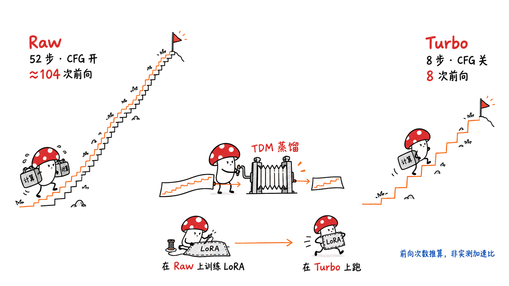
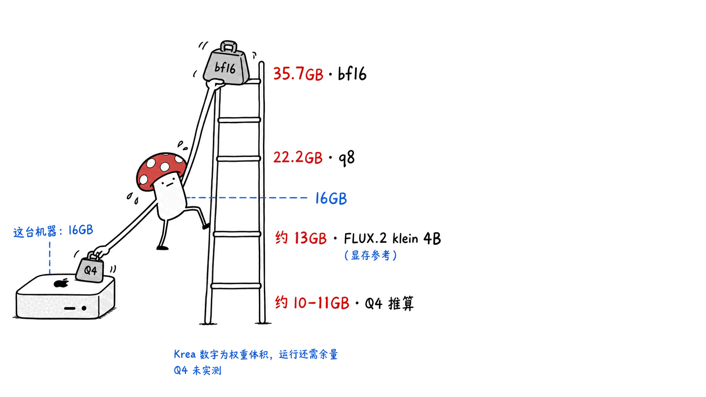
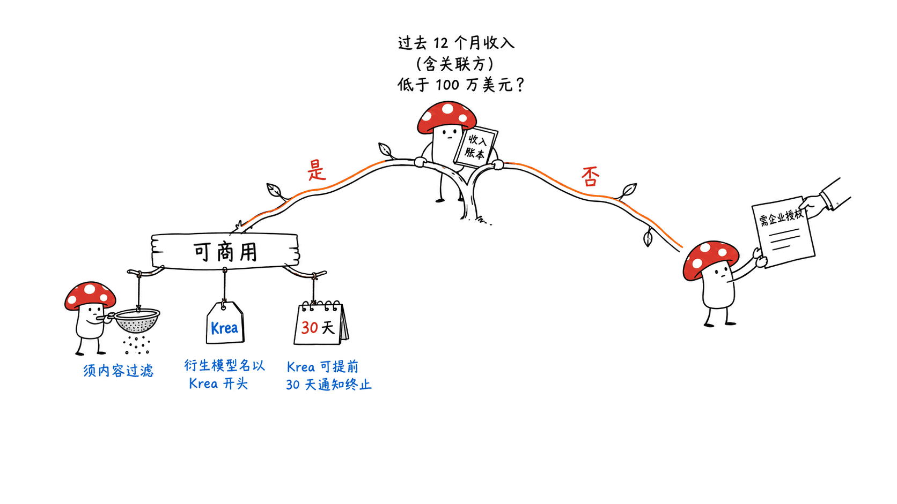
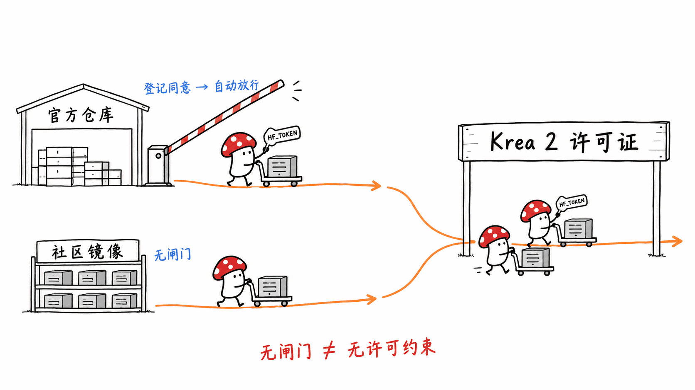
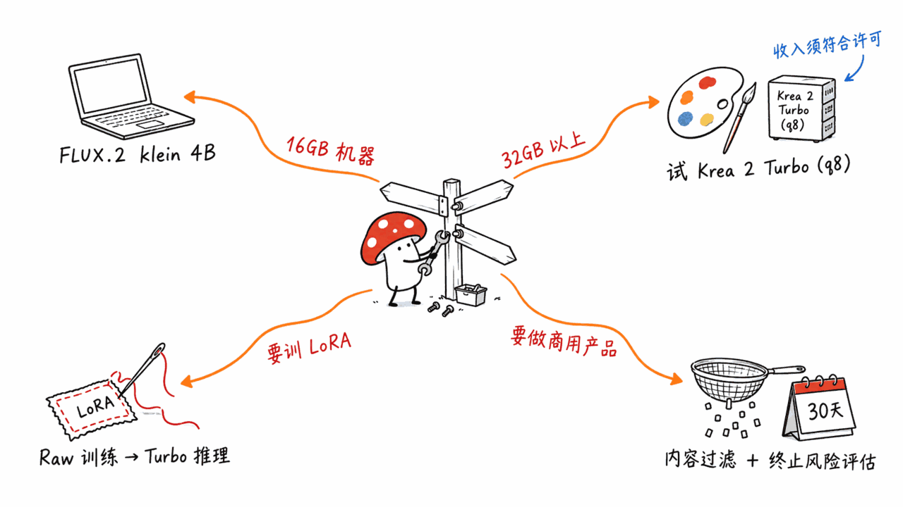

**BLUF**：Krea 2 Turbo 是 Krea 从零训练的 **12.8B 参数**文生图扩散 Transformer，用 TDM 蒸馏成 **8 步出图、关闭 CFG**，官方说支持 1K 到 2K 分辨率。它的定位很清楚：画面审美和风格跨度，而不是「最小最快」。对个人开发者来说，要先过三道关：**硬件**（官方 bf16 全套权重约 35.7GB，16GB 的 Mac 只能指望社区量化版）；**许可证**（年收入低于 100 万美元才能免费商用，还要求部署方做内容过滤，Krea 可提前 30 天通知终止授权）；**gated**（官方仓库要登记姓名、邮箱、公司并勾选同意协议，属于自动放行）。如果你要的是 Apache-2.0、零条件商用、16GB 机器能跑，FLUX.2 klein 4B 仍然是更省心的默认选项；如果要的是风格表现力，并且收入在门槛以下，Krea 2 Turbo 值得认真试。

> 📌 一手资料
> 模型（Turbo）：https://huggingface.co/krea/Krea-2-Turbo
> 模型（Raw 基座）：https://huggingface.co/krea/Krea-2-Raw
> 官方推理代码：https://github.com/krea-ai/krea-2
> 技术报告：https://www.krea.ai/blog/krea-2-technical-report
> 许可证全文（PDF）：https://cdn.jsdelivr.net/gh/krea-ai/krea-2@db3984fbc6e13b34c0064990fc2d95ac64d00058/assets/hf_samples/LICENSE.pdf

---

## 为什么 Mycelium Protocol 要看这个模型？

本站每篇文章的封面图，都是在本机用 FLUX.2 klein 4B（MLX，Apple Silicon）生成的，不走云端。我们在《在 Mac 上训练一个「专属角色」：用本地 FLUX + LoRA 让 AI 每次都画出同一个人》里写过这条流水线：https://blog.mushroom.cv/blog/train-character-lora-local-flux-mac/

所以看到一个新的开放权重文生图模型，我们关心的不是它在排行榜上排第几，而是三个更实际的问题：**我的机器装得下吗？我拿它出的图能商用吗？下载和使用要过什么手续？**下面按这个顺序拆 Krea 2 Turbo。

说明：本文所有数字都来自一手资料（HuggingFace API、官方 README、许可证、技术报告），标了「推算」的除外。**我们没有在本机实测 Krea 2**（本机是 16GB 的 Mac mini，装不下官方全精度权重），文中没有任何速度或出图质量的实测数字。

## Krea 2 Turbo 到底是什么？

HuggingFace 模型 API 和官方 README 给出的基本事实：

- **参数量**：safetensors 元数据统计为 12,820,073,036 个参数（其中 BF16 约 12.50B，F32 约 0.32B）；模型卡写的是「Diffusion Transformer with 12 billion parameters」
- **从零训练**：官方 GitHub README 原话是「an image model trained from scratch」，不是在 FLUX 或 SD 上微调
- **两个检查点**：Raw 是没有蒸馏的基座，Turbo 是在 Raw 上继续后训练和蒸馏的版本（HF 标签 `base_model:finetune:krea/Krea-2-Raw`）
- **发布日期**：模型卡写 2026 年 6 月 22 日；HF 仓库创建于 6 月 18 日，最后更新于 7 月 24 日
- **热度**（HF API，2026-09-11 抓取）：Turbo 下载 70,893、1,144 likes；Raw 下载 73,584、675 likes
- **架构组件**（官方推理代码）：单流 MMDiT，隐藏维度 6144、28 层；文本编码器是 **Qwen3-VL-4B-Instruct**，取 12 个中间层的隐状态做特征聚合；VAE 是 **Qwen-Image 的 VAE**（f8，16 个 latent 通道）
- **协议**：推理代码 Apache-2.0，**模型权重另走 Krea 2 Community License**，两者不是一回事

技术报告里还有几处值得记的训练细节：预训练数据按 256px → 512px → 1024px 三段逐步放大；**预训练数据里完全不用 AI 生成的图**，理由是哪怕一小部分合成图也会把模型的输出分布带偏；文本编码器在 T5Gemma、Qwen2.5-VL、Qwen3-VL、umT5 之间做过对比，最后选了 Qwen3-VL，因为 VLM 能同时接受文本和图像输入，多语言泛化也更好。

## 「Turbo」是怎么变快的？

名字里的 Turbo 确实是少步数蒸馏，这一点有一手资料支撑：

- 官方 README：Turbo 是「an 8-step distilled checkpoint」，推荐 `--steps 8 --cfg 0.0 --mu 1.15`，分辨率 1K 到 2K
- Raw 的推荐设置是 `--steps 52 --cfg 3.5`，官方说 Raw 训练到 1K 分辨率
- 技术报告：RL 阶段之后加了一个可选的蒸馏阶段，**同时做 guidance 蒸馏和 timestep 蒸馏**。候选方法有 DMD、DMD2、Decoupled DMD、piFlow、APT，最后选了 **TDM（Trajectory Distribution Matching）**，理由是超参少、好调、不需要数据，并且支持灵活的多步蒸馏

换成人话：Raw 每张图要跑 52 步，每一步还要因为 CFG 算两遍（有条件一遍、无条件一遍）；Turbo 只跑 8 步，CFG 关掉后每步只算一遍。按官方推荐参数，**每张图的主干网络前向次数从大约 104 次降到 8 次**（这是按参数推算的，不是实测加速比）。

官方的使用建议是「在 Raw 上训 LoRA，在 Turbo 上跑推理」，并且说在 Raw 上训出来的 LoRA 可以直接用在 Turbo 上。这和我们用 FLUX 训角色 LoRA 的思路是一致的：训练用没蒸馏过的基座，出图用蒸馏过的快版本。

## 本地跑 Krea 2 Turbo 要多大内存？

先看官方文件的真实体积（HF tree API 返回的字节数）：

| 组件 | 精度 | 文件体积 |
|---|---|---:|
| Transformer 主干（3 个分片） | BF16 为主 | 26.28 GB |
| 文本编码器 Qwen3-VL-4B | BF16 | 8.88 GB |
| VAE | — | 0.51 GB |
| **diffusers 格式合计** | | **约 35.7 GB** |

另外，仓库根目录还有一个给官方推理代码用的单文件 `turbo.safetensors`。整个仓库的 usedStorage 是 62.5GB，所以别直接 `git clone` 整个仓库，按需下载就行。

社区量化版的真实体积（同样取自 HF API）：

| 版本 | 内容 | 体积 |
|---|---|---:|
| vantagewithai/Krea-2-Turbo-GGUF Q8_0 | 只有主干 | 13.71 GB |
| 同上 Q6_K | 只有主干 | 10.58 GB |
| 同上 Q4_K_M | 只有主干 | 7.49 GB |
| 同上 Q2_K | 只有主干 | 4.89 GB |
| mflux-community/krea-2-turbo-mflux-q8（MLX） | 主干 + 文本编码器 + VAE | 约 22.2 GB（主干约 13.6GB、文本编码器约 8.0GB、VAE 0.51GB） |

**按这些文件推算**的内存下限（只算权重常驻，不算激活值和系统占用，所以实际需要更多）：

- **官方 bf16 全套**：约 36GB。48GB 统一内存的 Mac 或 48GB 显存的卡比较从容，32GB 显存需要把文本编码器卸载到 CPU
- **mflux q8 全套**：约 22GB。16GB 的 Mac 装不下，24GB 很紧，32GB 起才算宽裕
- **Q4 GGUF 主干 + 量化后的文本编码器 + VAE**：主干 7.49GB，加上 VAE 0.51GB，再加一个 4-bit 左右的 Qwen3-VL-4B（按 4B × 约 0.55 字节/参数推算约 2.2–2.5GB），合计约 10–11GB。**16GB 机器理论上摸得到边，但余量很小**，而且得先有支持 Krea 2 的 GGUF 加载链路（比如 ComfyUI + GGUF 节点）

作为参照，BFL 官方说 FLUX.2 klein 4B「fits in ~13GB VRAM」，klein 9B 约 29GB。也就是说，Krea 2 Turbo 全精度的内存门槛比 klein 9B 还高，Q4 以后才回到 klein 4B 那一档。

## 许可证：能不能商用？

这是本文最关键的一节。以下内容来自 Krea 2 Community License Agreement v.1（2026-06-22）原文，我们按条款转述，**不构成法律意见**：

- **§2.1 授权**：有限、非独占、全球、不可转让、不可再许可、**可撤销**、免版税地使用、复制、分发、制作衍生模型和生成输出
- **§2.3 收入门槛**：只有在你（**连同所有受共同控制的关联实体**）过去 12 个月的全公司年收入**低于 100 万美元**时才能商用，而且收入按所有来源合并计算。一旦达到或超过门槛，要**立即停止商用**并联系 Krea 买企业授权（opensource@krea.ai）
- **§1 「商用」的定义很宽**：任何与商业活动有关的使用，包括「直接或间接」产生收入。所以带广告或付费订阅的内容站拿它出图，大概率也算商用
- **§3.1 分发要求**：如果分发模型或衍生模型，**模型名必须以「Krea」开头**（例如「Krea 2 [你的模型名]」），附上协议文本，并在 Notice 文件里保留指定的署名声明
- **§4.2 内容过滤是硬性要求**：部署方必须实施「合理且适当」的内容过滤，协议举的例子有 Falconsai/nsfw_image_detection、NudeNet、CompVis safety checker、Hive、Azure AI Content Safety 或人工审核
- **§4.1(c)**：不得绕过或移除安全机制、内容溯源或水印机制
- **§5.3 输出归属**：生成的图归你所有，Krea 不主张所有权
- **§9 终止**：违约立即自动终止；**Krea 可以任何理由提前 30 天通知终止授权**；如果你就该模型起诉 Krea 或任何人，授权自动终止；终止后必须删除所有副本

对个人开发者的实际含义：

1. **个人和早期小团队**（年收入低于 100 万美元）可以免费商用，这个门槛对大多数独立开发者够用
2. **如果你挂靠在一家收入超过 100 万美元的公司名下**，哪怕你的项目本身没收入，按「关联实体合并计算」也可能超过门槛，要仔细读条款
3. **§9.2 的 30 天终止条款**意味着它不是「永久可用」的开源许可，不适合做长期绑定的基础设施依赖。Apache-2.0 没有这种条款
4. HF 上已经出现一些以绕过过滤为卖点的社区衍生版本。按 §4.1(c) 和 §4.2，使用这类版本很可能直接违约，而违约即自动终止授权

对照一下：FLUX.2 klein 4B 是 **Apache-2.0**，没有收入门槛，也没有终止条款；FLUX.2 klein 9B 和 FLUX.2 dev 用的是 **FLUX Non-Commercial License**，商用要另外买授权。所以在「可以商用」这件事上，Krea 2 Turbo 介于两者之间：比 klein 9B 宽松，比 klein 4B 条件多。

## gated 对使用有什么影响？

- 官方两个仓库在 HF API 里都是 `gated: "auto"`：要登录 HF，填写**姓名、邮箱、公司**，勾选同意协议，提交后**自动放行**，不需要人工审批
- 模型卡 README 可以直接读，但权重和 config 需要带 token 才能下载（我们请求 `transformer/config.json` 返回 401）
- 所以自动化脚本、CI、新机器初始化时都要配 `HF_TOKEN`，这个账号本身得先点过同意
- 值得注意：**社区转存版本不是 gated 的**（HF API 显示 Comfy-Org/Krea-2 和 mflux-community/krea-2-turbo-mflux-q8 的 `gated` 都是 false）。但协议开头写明，下载、使用或分发 Krea 模型「或任何衍生物」就视为接受协议，所以绕开 gate 并不等于绕开许可证

## 生态：diffusers、ComfyUI、MLX 都有了吗？

- **diffusers**：官方 README 要求从源码安装 diffusers 才能用 `Krea2Pipeline`；diffusers 主分支目前确实有 `src/diffusers/pipelines/krea2/pipeline_krea2.py`。它是否已经进入某个正式发布版本，我们**未能核实**
- **ComfyUI**：官方 README 把 ComfyUI 列为推理平台；Comfy-Org/Krea-2 这个 ComfyUI 格式的仓库下载量 5,642,119，是所有 Krea 2 相关仓库里最高的
- **SGLang**：官方 README 给了 `sglang generate` 的用法和 cookbook
- **GGUF**：vantagewithai/Krea-2-Turbo-GGUF（Q2_K 到 Q8_0）、molbal/krea2-gguf、gguf-org/krea-2-gguf 等
- **MLX / Apple Silicon**：mflux-community/krea-2-turbo-mflux-q8 是 mflux 格式的 q8 转换（2026-07-13）。mflux 主线是否官方支持 Krea 2、需要哪个版本，我们**未能核实**
- **训练**：官方推荐 diffusers、Ostris AI Toolkit、kohya musubi-tuner 和 fal；ostris 还发布了 Turbo 的 training adapter 和 style reference 适配器

## 和同级开放模型怎么比？

| 模型 | 参数（主干） | 推荐步数 | 许可证 | gated | 官方给的显存 |
|---|---:|---:|---|---|---|
| Krea 2 Turbo | 12.8B | 8（CFG 0） | Krea 2 Community（年收入 < 100 万美元可商用） | 自动放行 | 未给出；bf16 全套文件约 35.7GB |
| Krea 2 Raw | 12.8B | 52（CFG 3.5） | 同上 | 自动放行 | 未给出 |
| FLUX.2 klein 4B | 4B | 4 | Apache-2.0 | 否 | 约 13GB |
| FLUX.2 klein 9B | 9B | 4 | FLUX Non-Commercial | 自动放行 | 约 29GB |
| FLUX.2 dev | 32.2B（HF 元数据） | 未核实 | FLUX Non-Commercial | 自动放行 | 未核实 |

出处：Krea 数据来自 HF API 和官方 README；FLUX.2 klein 数据来自 BFL 的 HF 模型卡；FLUX.2 dev 的参数量来自 HF safetensors 元数据。

关于质量排名，两份官方资料的说法不一致：GitHub README 说 Krea 2 是 Artificial Analysis 文生图榜上「独立实验室里的第 1 名」；技术报告说它「进入总榜前 10，在独立实验室中排第 2」。我们没有独立核实这个榜单，建议以 Artificial Analysis 的实时榜单为准。关于 FLUX 系列的更多背景，可以看本站的《FLUX.3 深度解析》：https://blog.mushroom.cv/blog/flux3-black-forest-labs-multimodal-video-audio-action-local-deployment-guide/

## 个人开发者该怎么选？

我们的独立判断：

- **16GB Mac、要零条件商用、要稳定**：继续用 FLUX.2 klein 4B。它是 Apache-2.0、4 步出图、官方给的显存门槛约 13GB，我们的 banner 流水线每天都在用
- **32GB 以上内存、做风格化或插画、年收入在门槛以下**：Krea 2 Turbo 值得试。它从零训练，预训练不用合成图，官方示例覆盖半色调、低多边形、印象派、赛璐璐、80 年代喷枪等大量风格，这正是它和「写实优先」路线的差别
- **要训练自己的风格 LoRA**：Krea 的「在 Raw 上训、在 Turbo 上跑」是一套完整方案，但 Raw 全精度同样是 12.8B，训练的门槛比推理更高
- **要做成产品给别人用**：先做两件事，一是按 §4.2 接好内容过滤，二是评估 §9.2 的 30 天终止条款对业务连续性的影响

硬件怎么配，可以参考本站的《继续等Mac Studio还是投入AMD怀抱Or云GPU？》：https://blog.mushroom.cv/blog/mac-studio-vs-amd-vs-cloud-gpu-local-ai/

## 常见问题

**Q：Krea 2 Turbo 是开源的吗？**
A：代码是 Apache-2.0 开源，权重是「开放权重」，走 Krea 2 Community License。这个许可证有收入门槛、内容过滤义务、衍生模型命名要求，而且 Krea 可以提前 30 天通知终止授权，不属于 OSI 定义的开源许可证。

**Q：个人博主拿它出封面图，算商用吗？**
A：按 §1 的定义，只要与商业活动「直接或间接」相关就算商用，带广告或付费的站点大概率算。但只要你（连同关联实体）过去 12 个月的年收入低于 100 万美元，协议允许免费商用。

**Q：16GB 的 Mac 能跑吗？**
A：官方 bf16 全套约 35.7GB，mflux q8 全套约 22.2GB，都装不下。只有 Q4 GGUF 主干（7.49GB）配合量化的文本编码器，按文件体积推算合计约 10–11GB，理论上能摸到边，但我们没有实测。

**Q：Turbo 和 Raw 该下哪个？**
A：出图用 Turbo（8 步，CFG 0，1K–2K）；训练 LoRA 或做后训练研究用 Raw（52 步，CFG 3.5，1K）。官方建议在 Raw 上训出的 LoRA 直接用在 Turbo 上。

**Q：gated 需要等人工审批吗？**
A：不用。两个官方仓库都是 `gated: auto`，填写姓名、邮箱、公司并同意协议后自动放行。之后用 HF token 下载。

## 一手资料

- Krea 2 Turbo 模型页：https://huggingface.co/krea/Krea-2-Turbo
- Krea 2 Raw 模型页：https://huggingface.co/krea/Krea-2-Raw
- HF API（参数量、gated、下载数）：https://huggingface.co/api/models/krea/Krea-2-Turbo
- 官方推理代码：https://github.com/krea-ai/krea-2
- 技术报告：https://www.krea.ai/blog/krea-2-technical-report
- 许可证全文：https://cdn.jsdelivr.net/gh/krea-ai/krea-2@db3984fbc6e13b34c0064990fc2d95ac64d00058/assets/hf_samples/LICENSE.pdf
- 许可说明页：https://www.krea.ai/krea-2-licensing
- 可接受使用政策：https://www.krea.ai/krea-2-use-policy
- 社区 GGUF：https://huggingface.co/vantagewithai/Krea-2-Turbo-GGUF
- 社区 MLX（mflux q8）：https://huggingface.co/mflux-community/krea-2-turbo-mflux-q8
- ComfyUI 格式：https://huggingface.co/Comfy-Org/Krea-2
- FLUX.2 klein 4B 模型卡：https://huggingface.co/black-forest-labs/FLUX.2-klein-4B
- FLUX.2 klein 9B 模型卡：https://huggingface.co/black-forest-labs/FLUX.2-klein-9B

---

> © 2026 Author: Mycelium Protocol. 本文采用 [CC BY 4.0](https://creativecommons.org/licenses/by/4.0/deed.zh) 授权——欢迎转载和引用，须注明作者姓名及原文链接，不得去除署名后以原创发布。

<!--EN-->

**BLUF**: Krea 2 Turbo is a **12.8B-parameter** text-to-image diffusion transformer that Krea trained from scratch, then distilled with TDM to **8 steps with CFG off**, at 1K to 2K resolution according to Krea. Its pitch is aesthetic range and style breadth, not "smallest and fastest." A solo developer has to clear three gates. **Hardware**: the official bf16 set is about 35.7GB, so a 16GB Mac depends on community quantizations. **License**: free commercial use only below $1M in annual revenue, deployers must run content filtering, and Krea can terminate the license on 30 days' notice. **Gating**: the official repos ask for your name, email and company plus a license checkbox, and approve you automatically. If you need Apache-2.0, unconditional commercial use and something that runs on 16GB, FLUX.2 klein 4B is still the lower-friction default. If you want stylistic range and you're under the revenue threshold, Krea 2 Turbo is worth a serious try.

> 📌 Primary sources
> Model (Turbo): https://huggingface.co/krea/Krea-2-Turbo
> Model (Raw base): https://huggingface.co/krea/Krea-2-Raw
> Official inference code: https://github.com/krea-ai/krea-2
> Technical report: https://www.krea.ai/blog/krea-2-technical-report
> Full license (PDF): https://cdn.jsdelivr.net/gh/krea-ai/krea-2@db3984fbc6e13b34c0064990fc2d95ac64d00058/assets/hf_samples/LICENSE.pdf

---

## Why Is Mycelium Protocol Looking at This Model?

We generate every cover image on this blog locally with FLUX.2 klein 4B (MLX, Apple Silicon), with no cloud step. We described that pipeline in "Training a Custom Character on a Mac: Using Local FLUX + LoRA So the AI Draws the Same Person Every Time": https://blog.mushroom.cv/blog/train-character-lora-local-flux-mac/

So when a new open-weight image model shows up, its leaderboard rank matters less to us than three practical questions: **Will it fit on my machine? Can I use its outputs commercially? What paperwork stands between me and the weights?** This post takes them in that order.

A note on method: every number here comes from a primary source (HuggingFace API, the official README, the license, the technical report) unless it's marked as an estimate. **We have not run Krea 2 locally.** Our machine is a 16GB Mac mini, which can't hold the full-precision weights, so this post contains no measured speed or quality numbers.

## What Exactly Is Krea 2 Turbo?

Basic facts from the HuggingFace model API and the official README:

- **Parameters**: the safetensors metadata counts 12,820,073,036 parameters (about 12.50B in BF16 and 0.32B in F32). The model card says "Diffusion Transformer with 12 billion parameters."
- **Trained from scratch**: the official GitHub README says "an image model trained from scratch." It isn't a fine-tune of FLUX or SD.
- **Two checkpoints**: Raw is the undistilled base. Turbo is Raw with further post-training and distillation (HF tag `base_model:finetune:krea/Krea-2-Raw`).
- **Release date**: the model card says June 22, 2026. The HF repo was created June 18 and last updated July 24.
- **Traction** (HF API, fetched 2026-09-11): Turbo has 70,893 downloads and 1,144 likes; Raw has 73,584 downloads and 675 likes.
- **Components** (official inference code): a single-stream MMDiT with hidden size 6144 and 28 layers. The text encoder is **Qwen3-VL-4B-Instruct**, with hidden states aggregated from 12 intermediate layers. The VAE is **Qwen-Image's VAE** (f8, 16 latent channels).
- **Licensing**: the inference code is Apache-2.0, but **the weights are under the Krea 2 Community License**. The two are separate.

A few training details from the technical report stand out. Pretraining moves through 256px, 512px and 1024px stages. **No AI-generated images are used in pretraining**, because Krea found that even a small share of synthetic images skews the output distribution. For the text encoder, Krea compared T5Gemma, Qwen2.5-VL, Qwen3-VL and umT5, and chose Qwen3-VL because a VLM accepts both text and image input and generalizes better across languages.

## How Does "Turbo" Get Faster?

Turbo is indeed a few-step distillation, and the primary sources back that up:

- Official README: Turbo is "an 8-step distilled checkpoint." The recommended settings are `--steps 8 --cfg 0.0 --mu 1.15`, at 1K to 2K resolution.
- Raw's recommended settings are `--steps 52 --cfg 3.5`, and Krea says Raw was trained up to 1K resolution.
- Technical report: after the RL stage there's an optional distillation stage that runs **guidance distillation and timestep distillation at the same time**. Krea considered DMD, DMD2, Decoupled DMD, piFlow and APT, and picked **TDM (Trajectory Distribution Matching)** because it has few hyperparameters, is easy to tune, needs no data, and supports flexible multistep distillation.

In plain terms: Raw runs 52 steps per image, and CFG doubles each step (one conditional pass and one unconditional pass). Turbo runs 8 steps, and with CFG off each step is a single pass. At the recommended settings, **that's roughly 104 backbone forward passes down to 8**. We derived that from the parameters; it isn't a measured speedup.

Krea recommends training LoRAs on Raw and running them on Turbo, and says LoRAs trained on Raw carry over to Turbo directly. That matches how we train character LoRAs on FLUX: train on the undistilled base, generate with the distilled fast version.

## How Much Memory Does Running Krea 2 Turbo Locally Take?

These are the official file sizes (byte counts from the HF tree API):

| Component | Precision | Size |
|---|---|---:|
| Transformer backbone (3 shards) | mostly BF16 | 26.28 GB |
| Text encoder Qwen3-VL-4B | BF16 | 8.88 GB |
| VAE | — | 0.51 GB |
| **diffusers-format total** | | **~35.7 GB** |

The repo root also holds a single-file `turbo.safetensors` for the official code. The whole repo uses 62.5GB, so download only the files you need instead of cloning it.

Actual sizes of community quantizations (also from the HF API):

| Release | Contents | Size |
|---|---|---:|
| vantagewithai/Krea-2-Turbo-GGUF Q8_0 | backbone only | 13.71 GB |
| same, Q6_K | backbone only | 10.58 GB |
| same, Q4_K_M | backbone only | 7.49 GB |
| same, Q2_K | backbone only | 4.89 GB |
| mflux-community/krea-2-turbo-mflux-q8 (MLX) | backbone + text encoder + VAE | ~22.2 GB (backbone ~13.6GB, text encoder ~8.0GB, VAE 0.51GB) |

**Estimated** memory floors from those files. These count resident weights only, not activations or OS overhead, so real usage will be higher:

- **Official bf16 set**: about 36GB. Comfortable on a 48GB unified-memory Mac or a 48GB card. On 32GB of VRAM you'd need to offload the text encoder to CPU.
- **mflux q8 set**: about 22GB. Won't fit on a 16GB Mac, is tight on 24GB, and gets comfortable from 32GB up.
- **Q4 GGUF backbone + quantized text encoder + VAE**: 7.49GB for the backbone plus 0.51GB for the VAE, plus a roughly 4-bit Qwen3-VL-4B (about 2.2–2.5GB, estimated as 4B × ~0.55 bytes/param), comes to about 10–11GB. **A 16GB machine is theoretically at the edge, with very little headroom**, and you'd also need a GGUF loading path that supports Krea 2, such as ComfyUI with GGUF nodes.

For reference, BFL says FLUX.2 klein 4B "fits in ~13GB VRAM" and klein 9B needs about 29GB. So Krea 2 Turbo at full precision needs more memory than klein 9B, and only drops to klein 4B's tier once it's quantized to Q4.

## The License: Can You Use It Commercially?

This is the most important section. What follows paraphrases the Krea 2 Community License Agreement v.1 (2026-06-22) clause by clause. **It isn't legal advice.**

- **§2.1 Grant**: a limited, non-exclusive, worldwide, non-transferable, non-sublicensable, **revocable**, royalty-free license to use, reproduce, distribute, create derivatives of, and generate outputs from the model.
- **§2.3 Revenue threshold**: commercial use is allowed only if you, **together with all affiliated entities under common control**, have trailing-twelve-month company-wide revenue **below $1,000,000 USD**, counting revenue from all sources. Once you reach or exceed that, you must **immediately stop commercial use** and contact Krea for an enterprise license (opensource@krea.ai).
- **§1 "Commercial Use" is defined broadly**: any use in connection with business or commercial activity, including generating revenue "directly or indirectly." A content site with ads or paid subscriptions probably counts.
- **§3.1 Distribution**: if you distribute the model or a derivative, **the model name must start with "Krea"** (e.g., "Krea 2 [Your Model Name]"). You must also include the agreement and keep the specified attribution text in a Notice file.
- **§4.2 Content filtering is mandatory**: deployers must implement "reasonable and appropriate" content filters. The license's examples include Falconsai/nsfw_image_detection, NudeNet, the CompVis safety checker, Hive, Azure AI Content Safety, and human review.
- **§4.1(c)**: you may not circumvent or remove safety, content-provenance or watermarking mechanisms.
- **§5.3 Outputs**: you own your outputs, and Krea claims no ownership of them.
- **§9 Termination**: the license ends automatically on any breach. **Krea can terminate for any reason on 30 days' notice.** Suing Krea or anyone else over the model terminates your license. After termination you must delete all copies.

What this means in practice for a solo developer:

1. **Individuals and early small teams** under $1M in revenue can use it commercially for free. That threshold covers most indie developers.
2. **If you work under a company that earns more than $1M**, the affiliated-entity aggregation can push you over the threshold even if your project earns nothing. Read that clause carefully.
3. **The §9.2 30-day termination clause** means this isn't a "use it forever" open license, and it's a poor fit for long-term infrastructure you'll depend on. Apache-2.0 has no such clause.
4. Some community derivatives on HF advertise that they bypass the filters. Under §4.1(c) and §4.2, using one is likely a breach, and a breach terminates the license automatically.

For comparison: FLUX.2 klein 4B is **Apache-2.0**, with no revenue threshold and no termination clause. FLUX.2 klein 9B and FLUX.2 dev use the **FLUX Non-Commercial License**, so commercial use requires a separate license. On commercial use, Krea 2 Turbo sits between them: more permissive than klein 9B, with more conditions than klein 4B.

## How Does Gating Affect You?

- Both official repos show `gated: "auto"` in the HF API. You log in, fill in **name, email and company**, tick the agreement box, and get **approved automatically**, with no human review.
- The model-card README is publicly readable, but weights and config files need an authenticated token. Our request for `transformer/config.json` returned 401.
- Automation scripts, CI and fresh-machine bootstraps all need an `HF_TOKEN` from an account that has already accepted the gate.
- Notably, **community re-uploads are not gated**: the HF API reports `gated: false` for Comfy-Org/Krea-2 and mflux-community/krea-2-turbo-mflux-q8. But the license says that downloading, using or distributing the Krea model "or any derivative thereof" means you accept the agreement. Skipping the gate doesn't mean skipping the license.

## Ecosystem: Are diffusers, ComfyUI and MLX Ready?

- **diffusers**: the official README says to install diffusers from source for `Krea2Pipeline`, and diffusers main does contain `src/diffusers/pipelines/krea2/pipeline_krea2.py`. We **could not verify** whether it has shipped in a tagged release.
- **ComfyUI**: the official README lists ComfyUI as an inference platform. The ComfyUI-format repo Comfy-Org/Krea-2 has 5,642,119 downloads, the most of any Krea 2 repo.
- **SGLang**: the official README gives `sglang generate` usage and a cookbook.
- **GGUF**: vantagewithai/Krea-2-Turbo-GGUF (Q2_K to Q8_0), molbal/krea2-gguf, gguf-org/krea-2-gguf and others.
- **MLX / Apple Silicon**: mflux-community/krea-2-turbo-mflux-q8 is a q8 conversion in mflux format (2026-07-13). We **could not verify** whether mainline mflux officially supports Krea 2, or which version it would need.
- **Training**: Krea recommends diffusers, Ostris AI Toolkit, kohya musubi-tuner and fal. Ostris has also published a Turbo training adapter and a style-reference adapter.

## How Does It Compare With Other Open Models in Its Class?

| Model | Params (backbone) | Rec. steps | License | Gated | Official VRAM figure |
|---|---:|---:|---|---|---|
| Krea 2 Turbo | 12.8B | 8 (CFG 0) | Krea 2 Community (commercial below $1M revenue) | auto | none given; bf16 set ~35.7GB on disk |
| Krea 2 Raw | 12.8B | 52 (CFG 3.5) | same | auto | none given |
| FLUX.2 klein 4B | 4B | 4 | Apache-2.0 | no | ~13GB |
| FLUX.2 klein 9B | 9B | 4 | FLUX Non-Commercial | auto | ~29GB |
| FLUX.2 dev | 32.2B (HF metadata) | unverified | FLUX Non-Commercial | auto | unverified |

Sources: Krea figures come from the HF API and the official README. FLUX.2 klein figures come from BFL's HF model cards. The FLUX.2 dev parameter count comes from HF safetensors metadata.

The two official documents disagree on quality ranking. The GitHub README calls Krea 2 "the #1 text-to-image model from an independent lab on Artificial Analysis." The technical report says it's "among the top 10" overall and "2nd place among models from independent labs." We haven't verified the leaderboard ourselves, so check Artificial Analysis's live rankings. For more on the FLUX family, see our "FLUX.3 Deep Dive": https://blog.mushroom.cv/blog/flux3-black-forest-labs-multimodal-video-audio-action-local-deployment-guide/

## Which Should a Solo Developer Pick?

Our own take:

- **16GB Mac, unconditional commercial use, stability first**: stay on FLUX.2 klein 4B. It's Apache-2.0, generates in 4 steps, and BFL puts its VRAM need at about 13GB. Our banner pipeline runs it every day.
- **32GB+ of memory, stylized or illustration work, revenue under the threshold**: Krea 2 Turbo is worth trying. It was trained from scratch with no synthetic images in pretraining, and the official samples span halftone, low-poly, impressionist, cel animation, 1980s airbrush and many other styles. That's the difference from photorealism-first models.
- **Training your own style LoRA**: Krea's "train on Raw, run on Turbo" workflow is complete, but Raw is also 12.8B at full precision, so training needs more hardware than inference.
- **Shipping it in a product for others**: first wire up content filtering per §4.2, then assess what the §9.2 30-day termination clause means for your business continuity.

For hardware planning, see our "Keep Waiting for the Mac Studio, Switch to AMD, or Just Rent Cloud GPUs?": https://blog.mushroom.cv/blog/mac-studio-vs-amd-vs-cloud-gpu-local-ai/

## FAQ

**Q: Is Krea 2 Turbo open source?**
A: The code is Apache-2.0 open source. The weights are "open-weight" under the Krea 2 Community License, which has a revenue threshold, content-filtering duties, derivative-naming rules, and a 30-day termination-for-convenience clause. It isn't an OSI-approved open-source license.

**Q: Does a solo blogger generating cover images count as commercial use?**
A: Under §1, anything "directly or indirectly" tied to commercial activity counts, so a site with ads or paid tiers probably qualifies. As long as you and your affiliates earned less than $1M over the trailing twelve months, the license allows free commercial use.

**Q: Will it run on a 16GB Mac?**
A: The official bf16 set (~35.7GB) and the mflux q8 set (~22.2GB) won't fit. Only a Q4 GGUF backbone (7.49GB) paired with a quantized text encoder, about 10–11GB in total by our file-size estimate, might reach the edge. We haven't tested it.

**Q: Turbo or Raw?**
A: Use Turbo to generate images (8 steps, CFG 0, 1K–2K). Use Raw for LoRA training or post-training research (52 steps, CFG 3.5, 1K). Krea says LoRAs trained on Raw work directly on Turbo.

**Q: Does the gate require manual approval?**
A: No. Both official repos are `gated: auto`: fill in name, email and company, accept the license, and you're approved. Then download with your HF token.

## Primary Sources

- Krea 2 Turbo model page: https://huggingface.co/krea/Krea-2-Turbo
- Krea 2 Raw model page: https://huggingface.co/krea/Krea-2-Raw
- HF API (params, gating, downloads): https://huggingface.co/api/models/krea/Krea-2-Turbo
- Official inference code: https://github.com/krea-ai/krea-2
- Technical report: https://www.krea.ai/blog/krea-2-technical-report
- Full license: https://cdn.jsdelivr.net/gh/krea-ai/krea-2@db3984fbc6e13b34c0064990fc2d95ac64d00058/assets/hf_samples/LICENSE.pdf
- Licensing page: https://www.krea.ai/krea-2-licensing
- Acceptable Use Policy: https://www.krea.ai/krea-2-use-policy
- Community GGUF: https://huggingface.co/vantagewithai/Krea-2-Turbo-GGUF
- Community MLX (mflux q8): https://huggingface.co/mflux-community/krea-2-turbo-mflux-q8
- ComfyUI format: https://huggingface.co/Comfy-Org/Krea-2
- FLUX.2 klein 4B model card: https://huggingface.co/black-forest-labs/FLUX.2-klein-4B
- FLUX.2 klein 9B model card: https://huggingface.co/black-forest-labs/FLUX.2-klein-9B

---

> © 2026 Author: Mycelium Protocol. Licensed under [CC BY 4.0](https://creativecommons.org/licenses/by/4.0/) — free to share and adapt with attribution. You must credit the author and link to the original; removing attribution and republishing as original is not permitted.
