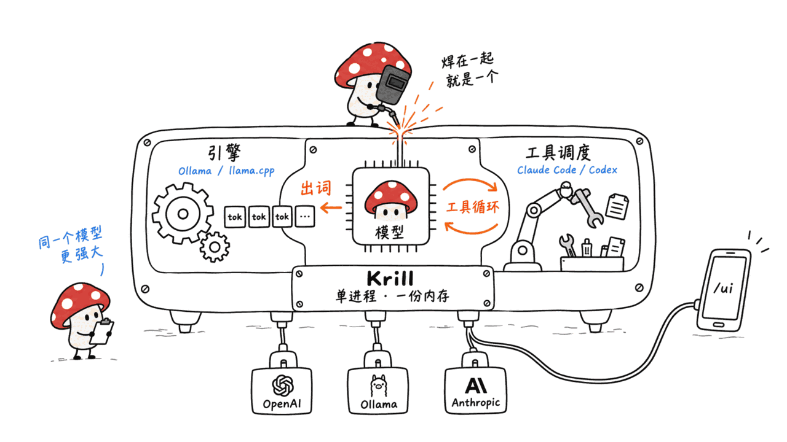
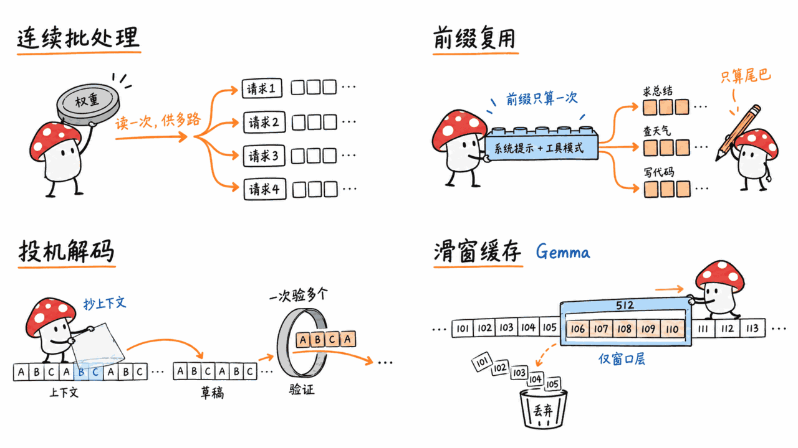
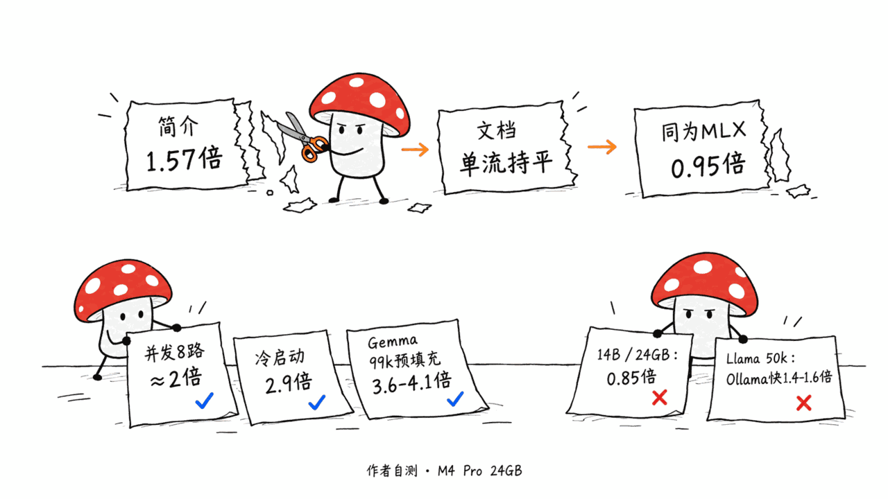
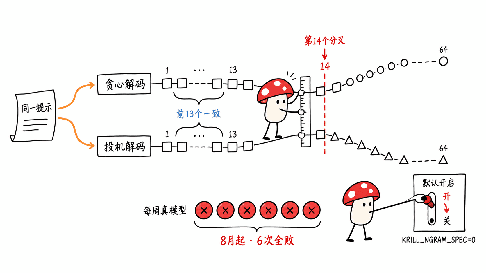

> 📌 开源仓库：srvsngh99/Krill
> GitHub：https://github.com/srvsngh99/Krill
> 协议：MIT ｜ 语言：Swift（另有 Python 基准脚本）｜ Stars：4 ｜ Forks：0 ｜ 创建：2026-05-03 ｜ 最新版本：v0.23.0（2026-08-28）｜ 共 372 次提交、31 个发行版，单人维护

---

**BLUF**：Krill 是一个纯 Swift + MLX 写的 Mac 本地大模型运行时，卖点是「引擎和 Agent 在同一个二进制里」：同一个进程既负责出 token，又跑一个带 bash、文件编辑、网页搜索和权限控制的编程 Agent，同时对外提供 OpenAI、Ollama、Anthropic 三套兼容接口。它的 GitHub 简介写着「比 Ollama 快 1.57 倍、省 58% 内存」，但作者自己的基准文档说得更老实：**单流解码和 Ollama 的 MLX 引擎基本持平（0.95 倍）**，1.5 倍那类数字部分来自 GGUF 与 MLX 的格式差异；真正站得住的优势是**并发吞吐约 2 倍、冷启动 2.9 倍、Gemma 系列长上下文不爆内存**。我们在 Mac mini（M4，16GB）上跑了 v0.23.0 发行版，服务端、三套接口和安全默认值都如文档所述；但它**默认开启的 n-gram 投机解码，在项目自己的每周真模型测试里已经连续 6 周不一致**。结论：值得关注的架构思路，4 个 star、单人维护、代码量近 7 万行，适合愿意踩坑的 Mac 用户，不适合替换你已经在用的 Ollama 或 LM Studio 做生产服务。

## 它到底是什么？

本地大模型的工具链通常分成两半：

- **引擎**：Ollama、llama.cpp、LM Studio，负责把模型跑起来、对外提供 API，但自己不会「做事」；
- **Harness（驾驭层）**：Claude Code、Codex、OpenCode，负责调工具、改文件，但模型是借别人的。

Krill 的主张是把两半焊在一起。README 原话是「Krill is both, in one binary」：同一个原生 Swift + MLX 引擎，既服务 token，也直接对着已经在内存里的模型跑 Agent 循环，中间没有第二个进程，也没有 Python 桥。



它提供四种用法：

| 模式 | 命令 | 你得到什么 |
|---|---|---|
| 聊天 | `krill run <model>` | 全屏 TUI，默认进 Agent 模式，`/chat` 切回纯聊天；支持图片、音频、本地语音 |
| 服务 | `krill serve` | 在 57455 端口同时提供 OpenAI、Ollama、Anthropic 三套 API |
| Agent | `krill code <task>` | 编程 Agent：bash、编辑、glob/grep、网页搜索、深度研究 |
| 手机 / 网页 | `krill ui` | 内置在二进制里的网页 Agent 界面，手机浏览器能用，改文件前弹「允许 / 拒绝」卡片 |

反过来也行：`krill launch claude`（或 codex、opencode 等）会先起 Krill 服务，再把外部 Agent 指向它。所以 Krill 既可以是「别人的 Agent 用的模型」，也可以是「自己模型上的 Agent」。

模型方面，README 称内置 37 个聊天 / 多模态模型的一词别名，外加约 19 个嵌入和重排模型。我们在本机 `krill catalog` 数到 64 个内置别名，覆盖 Llama、Qwen（含 MoE）、Gemma 2/4、Mistral、Phi、GLM-4、DeepSeek、OLMoE 等。**只吃 MLX 格式（safetensors），不支持 GGUF**；其他 Hugging Face 权重要先用 `krill quantize` 转。

## 和 Ollama、Rapid-MLX 这类工具有什么不同？

本站之前写过 Rapid-MLX（https://blog.mushroom.cv/blog/rapid-mlx-apple-silicon-local-ai-inference/）和 WWDC26 上苹果讲的本地 Agent 方案（https://blog.mushroom.cv/blog/wwdc26-mlx-local-agentic-ai-mac-engineering-guide/）。放在一起看：

| 项目 | 语言 / 后端 | 自带 Agent | 格式 | 成熟度（2026-09-11） |
|---|---|---|---|---|
| Ollama | Go + llama.cpp，部分架构有 MLX 后端 | 无（靠外部 harness） | GGUF 为主 | 18 万 star |
| Rapid-MLX | Python + MLX | 无 | MLX | 3.7k star |
| SwiftLM（SharpAI） | Swift + MLX | 无，有 iOS app | MLX | 762 star |
| **Krill** | **Swift + MLX，模型架构自己实现** | **有，同进程** | **仅 MLX** | **4 star、0 fork** |

一个值得注意的工程选择：Krill 只依赖 Apple 的 mlx-swift 底层库，**没有用官方的 mlx-swift-lm**，Llama、Qwen、Gemma 4、DeepSeek 等架构都是自己写的（`Sources/KrillCore/` 下几十个模型文件）。好处是可以针对自家的批处理和缓存做深度改动；代价是每个新模型都要自己移植，而下文你会看到，移植出错是这个项目历史上最常见的 bug 来源。

## 核心机制：它靠什么变快？



README 和 `docs/BENCHMARKS.md` 里提到的几件东西，才是理解 Krill 的关键：

1. **连续批处理（continuous batcher）**：多个请求同时解码时，一次读权重服务多行。单流解码受内存带宽限制，谁都快不了多少；但并发时，Ollama 按槽位串行，Krill 能把吞吐往上叠。
2. **共享前缀 KV 复用**：Agent 和 RAG 请求的系统提示词、工具 schema、检索文档往往一样，只有末尾问题不同。Krill 会找出和最近请求的最长公共前缀，恢复那段 KV，只预填充不同的尾巴。缓存分内存层和磁盘层，磁盘层默认上限 2GB，放在 `~/.krill/cache/`。
3. **n-gram 投机解码（prompt lookup）**：从上下文里找重复片段当草稿，一次验证多个 token。对代码、结构化输出这类重复多的内容有效。`krill run` 和 `krill serve` **默认开启**。
4. **滑动窗口 KV（RotatingKVCache）**：Gemma 4 大部分层只看 512 token 的窗口，Krill 只给这些层留窗口大小的缓存，全局注意力层才随上下文增长。这就是它在 Gemma 长上下文上省内存的原因。
5. **受约束的工具名采样**：见下一节。

### 工具名为什么要在采样时约束？

这是 Krill 里我们认为最有意思、也最能迁移到别处的设计，写在 `docs/TOOL_NAME_RESOLUTION.md`。

问题很具体：一个在 Claude Code 数据上微调过的本地模型，会想调用 `Read`，但 Krill 提供的工具叫 `read_file`。能力对上了，名字对不上，Agent 第一次调工具就死。

Krill 的解法分三层：

- **第 0 层，让错名字采不出来**：一个「触发式」语法自动机，平时不干预（模型可以自由写正文），看到模型家族的工具调用标记（比如 `<tool_call>`、`[TOOL_CALLS]`）之后，只在 `name` 字段的那几个字符上把采样限制在「当前提供的工具名前缀」里。大写的 `R` 根本没有概率质量，所以 `Read` 生成不出来。名字写完就解除约束，参数照常自由生成。
- **第 1 层，确定性规范化**：大小写、分隔符、命名空间前缀，外加一张很小的封闭别名表（`Read → read_file`）。
- **第 2 层，约束重选**：还解析不了，就让模型在一个只有合法工具名的枚举里重选一次。

文档里的原则是「猜错比不猜更糟」：调错工具可能删文件，报「未知工具」只是多一轮。这套思路和 llama.cpp 的 lazy grammar、XGrammar 的结构化标签是一路的，但把它专门用在「跨 harness 的工具名漂移」上，我们还是第一次在一个开源项目里看到写得这么清楚的。局限也写明了：没有明确调用标记的格式（`read_file(path="x")` 这种 pythonic 写法、Llama 的裸 JSON）拿不到第 0 层保护。

## 「比 Ollama 快 1.57 倍」到底打几折？



Krill 的 GitHub 简介至今写着「1.57x faster than Ollama, 58% less memory」。这个数字来自项目第一天（2026-05-03）的一次提交，提交信息就叫「achieve 1.57x Ollama decode」。但项目后来的文档自己往回收了：

- **README**：「Single-stream decode is at parity……Krill makes no raw-decode-speed claim」，1.57 倍被改写成 Gemma-4-E2B 上的「端到端时间」，首 token 约快 5 倍。
- **BENCHMARKS.md 的 MLX 对 MLX 对照**（M4 Pro 24GB，Ollama 的 `gemma4:e2b-mlx`）：单流解码 Krill 109.1 tok/s 对 Ollama 114.9 tok/s，**Krill 是 0.95 倍，略慢**。文档原话：GGUF 表里的 1.5 倍「partly a GGUF-vs-MLX artifact」，不应当读成 MLX 单流胜利。

作者自测数据里站得住的部分：

| 维度 | Krill | Ollama | 比值 | 条件 |
|---|---|---|---|---|
| 单流解码 | 109.1 tok/s | 114.9 tok/s | 0.95x | Gemma-4-E2B，MLX 对 MLX |
| 冷启动总时间 | 1080 ms | 3124 ms | 2.9x | 同上 |
| 并发聚合吞吐 N=8 | 219 tok/s | 110 tok/s | 1.99x | 同上 |
| 重复上下文预填充 | 180 ms | 193 ms | 持平 | Qwen2.5-14B，约 1300 token 共享上下文 |
| 约 99k 上下文预填充 | 746 s | 2701-3057 s | 3.6-4.1x | Gemma-4-12B，Ollama 已大量交换内存 |
| 单流解码（14B） | 19.6 tok/s | 23.1 tok/s | 0.85x | Qwen2.5-14B，24GB 机器内存吃紧 |
| 约 50k 上下文解码 | 17.8-20.6 tok/s | 28.8 tok/s | Ollama 领先 1.4-1.6x | Llama-3.2-3B，全注意力模型 |

读法：

1. **所有数字都是作者在一台 M4 Pro 24GB 上自测的**，没有第三方复现。文档自己也说绝对值会随温度和负载漂移，只有比值有意义。
2. **单流聊天场景，你感觉不到快**。它的优势在「多个请求一起来」和「上下文很长」这两种场景，而后者主要是 Gemma 系列，因为滑动窗口 KV 只对有滑窗层的模型有用。换成全注意力的 Llama，30k 以后反而是 Ollama 的 llama.cpp flash-attention 更快。
3. **14B 在 24GB 机器上并发 Agent 负载会塌**：文档写 Krill 约 4.7 tok/s 对 Ollama 约 11 tok/s，N=4 比 N=1 还慢，作者归因于内存压力。16GB 的 Mac 更要小心模型尺寸。
4. 「58% 内存」在 README 里对应的是「约 3GB 对约 8.8GB 峰值」，按这两个数算其实是省 66%；简介和正文的数字对不齐，说明简介没跟着文档更新。

我们欣赏的是：这个项目的基准文档把输的格子也写出来了，包括 0.85 倍、0.95 倍、Ollama 在长上下文全注意力模型上领先。这比很多「比 X 快 N 倍」的 README 诚实。问题只在于首页那一行简介还停留在第一天。

## 项目自己的测试在报什么警？

读 CI 记录时我们发现一件 README 没提的事。

Krill 有一个每周定时跑的 `live-model-tests` 工作流，会下载真模型（qwen2.5-0.5b）跑一组一致性测试。其中 `NgramLiveParityTests` 检查的是：**贪心解码下，开 n-gram 投机解码和不开，输出应当一致**。测试代码的注释写得很明白，如果中途分叉，说明缓存回滚、位置或草稿对齐有结构性错误。

这个工作流 2026-08-02 才上线，之后在 08-03、08-10、08-17、08-24、08-31、09-07 **一共跑了 6 次，6 次全部失败**，这个测试的失败信息每次都一样：64 个 token 里只有前 13 个一致（`LCP=13, ref=64, ngram=64`）。前 3 次还同时挂了另一个测试 `PrefixCachePartialReuseLiveTests`（检查前缀复用是否逐位一致），后 3 次那个测试过了，n-gram 这个一直没过。而正常提交触发的 `swift-tests` 是绿的，因为那组不跑真模型。



这不一定意味着你的输出是错的：投机解码在半精度下偶尔会因为数值舍入翻转一个近似平局的 token，产生「同样合理但不同」的续写。但测试作者自己把阈值定成「必须前缀一致」，而且这个功能是**默认开启**的。在作者修复或解释之前，我们建议对输出可复现性敏感的场景（评测、结构化抽取、回归测试）先关掉它：

```bash
KRILL_NGRAM_SPEC=0 krill serve --model qwen2.5-3b
# 或在 ~/.krill/config.toml 里写 ngram_spec = false
```

回头看项目历史，这类问题不是第一次：`docs/BENCHMARK_ISSUES.md` 记录过 Gemma-4-E2B 超过约 1024 token 就输出空内容（漏实现了滑动窗口掩码），前缀缓存早期只有「完全相同的提示词」才命中，`REVIEW_OBSERVATIONS.md` 里还记着早期版本前缀缓存存的是空 KV、图像预处理返回全零张量。好消息是这些都被公开记录并修掉了；坏消息是它说明自己实现每个模型架构的代价，就是这种「只在长提示或真模型上才暴露」的正确性问题。

## Agent 部分安全吗？

Krill 的权限模型比我们预想的保守，这点要表扬：

| 模式 | 行为 |
|---|---|
| `plan` | 只读，只能看文件、提方案。**未配置或配置写错时默认落到这里** |
| `adaptive` | 从只读开始，Agent 可以自己申请切到「自动改文件、命令仍需确认」 |
| `ask` | 每次改文件、跑命令都要确认。**网页 / 手机端新建会话默认这个** |
| `accept-edits` | 改文件自动，命令要确认 |
| `accept-all` / `auto` | 全部放行 |

源码里 `PermissionMode.configuredDefault` 的注释是「never failing open」，配置非法就回落到只读。

但有几个边界要清楚：

- **bash 没有沙箱**。进了 `auto` 模式，命令就是以你的用户身份在本机跑。CLI 自己也会打印这句提醒。
- **网页抓取的「不可信」标记只是提示词**。`web_fetch` 和 `web_search` 会给内容加上「UNTRUSTED external text」的说明，并做了 SSRF 防护（不许跳到内网地址），但防提示注入靠的是模型听话。`auto` 模式 + 网页搜索 + 无沙箱 bash，是一个风险组合。
- **`krill ui` 绑定 0.0.0.0，走明文 HTTP**。它会生成 API key，手机链接里的 key 放在 URL 片段（`#k=`）里，不会随请求发出。但之后每次请求的 bearer key 和代码内容在「同一 Wi-Fi」路径上都是明文传输。文档推荐走 Tailscale，这是对的；在咖啡馆 Wi-Fi 上就别用局域网链接了。
- **我们实测了一条安全默认值**：不带 key 执行 `krill serve --host 0.0.0.0`，程序直接拒绝启动，提示「refusing unauthenticated non-loopback bind」。
- **Codex 桥每轮都发完整对话**。`--provider codex` 每个 Agent 回合都起一个新的 `codex exec --ephemeral`，把整段对话再发一遍，README 自己说明没有跨回合缓存，长任务的用量会一路涨；是否符合你账户的使用条款，README 让用户自己判断。
- **MCP 和 Skills 还没做**。`docs/MCP_AND_SKILLS_PLAN.md` 状态是「Proposed」（2026-08-02）。现在的工具集是写死的，想接外部 MCP 服务得等。

## 我们在本机跑到了哪一步？

**环境**：Mac mini（Apple M4，16GB），macOS 26.6.2；Krill v0.23.0 官方发行包（`krill-0.23.0-arm64-apple-macos.tar.gz`，12.3MB 压缩包，解开后是 46.6MB 的 `krill` 二进制加 3.2MB 的 `mlx.metallib`）；源码对照 commit `a20ac1a`。

实测结果：

- **不用装任何东西就能跑**：解压后直接执行，`krill version` 正确识别出 Apple M4、Darwin 25.6.0，没有 Python、没有 Homebrew 依赖。
- **无模型启动服务**：`krill serve` 以「API-only」模式启动，`/v1/models`（OpenAI 形状）、`/api/tags`（Ollama 形状）都返回合法的空列表，`/ui` 返回 43KB 的内置网页界面。`/api/version` 同时报出 `krill_version: 0.23.0` 和一个 `version: 0.12.0`，后者是为了让只认 Ollama 的客户端能握手。
- **安全默认值有效**：见上一节，无 key 的非回环绑定被拒绝。
- **模型目录不认 `HOME`**：我们想把模型放进临时目录，设了 `HOME=...`，但 Krill 用的是 `FileManager.homeDirectoryForCurrentUser`，照样写进真实的 `~/.krill`。想换位置目前只能软链接。
- **没跑成推理**：我们测试时本机到 Hugging Face 的下载速度只有 30-130KB/s，`krill pull qwen2.5-0.5b`（约 280MB）的前两次下载尝试都以「network connection was lost」中断，我们没有等第三次。所以**本文没有任何我们自测的 tok/s 数字**，性能部分全部来自作者文档。Krill 的下载器有 3 次重试，但不支持 `HF_ENDPOINT` 这类镜像变量，网络受限的用户要自己想办法。

## 适合谁，不适合谁？

**适合**：

- 想在 Mac 上用一个二进制同时拿到「本地模型服务 + 编程 Agent + 手机遥控」的个人开发者；
- 需要让本地模型同时服务多个请求（多个 Agent 并行、批量抽取）的人，这是它最确定的优势；
- 常跑 Gemma 4 长上下文的人；
- 想读一份把「工具名漂移」「前缀 KV 复用」讲清楚的工程文档的人。它的 `docs/` 目录比代码更值得看。

**不适合**：

- 只做单人聊天的用户，单流速度和 Ollama 没有区别，Ollama 的生态大得多；
- 手里全是 GGUF 模型的人；
- 需要输出严格可复现的场景，至少先关掉 n-gram 投机解码；
- 需要 MCP 生态的人；
- 要托付给团队或生产环境的人：4 star、0 fork、单人维护，发行版累计下载 132 次，每 3-4 天一个版本，README 自己也写着「Early release」「pin a version」。

我们的整体判断：**Krill 押的方向是对的**。本地 Agent 真正的瓶颈不是单流 tok/s，而是长系统提示反复预填充、多个子任务并发、小模型把工具名叫错，Krill 正好在这三处下了功夫，而且把输掉的基准也写了出来。但它把「推理引擎」和「每个模型架构的实现」都揽在自己手里，一个人维护近 7 万行 Swift，正确性回归是结构性风险。现在拿它当第二引擎试用、读它的设计文档，都很值；拿它换掉 Ollama，先等那个每周失败的测试变绿。

## 常见问题

**Q：Krill 真的比 Ollama 快吗？**
A：看场景。按作者自测，单流解码和 Ollama 的 MLX 引擎持平（0.95 倍）；并发 8 路时聚合吞吐约 2 倍，冷启动约 2.9 倍，Gemma-4-12B 在约 99k 上下文时预填充快 3.6-4.1 倍。全注意力模型（如 Llama-3.2-3B）在 30k 以上上下文反而是 Ollama 快 1.2-1.6 倍。所有数字没有第三方复现。

**Q：能直接替换 Ollama 吗？**
A：接口层面基本可以：它实现了 `/api/chat`、`/api/generate`、`/api/tags`，用 `krill serve --port 11434` 就能占用 Ollama 的默认端口。但它只吃 MLX 格式，Ollama 里下载的 GGUF 模型用不了，要重新从 Hugging Face 拉 MLX 版本。

**Q：`krill code` 会不会乱删我的文件？**
A：默认不会。未配置时默认是只读的 `plan` 模式，网页端新会话默认 `ask`。只有你显式选 `auto` / `accept-all`，bash 和文件编辑才会无确认执行，而且 bash 没有沙箱。

**Q：16GB 的 Mac 能用吗？**
A：能跑小模型。作者的数据是在 24GB 机器上，14B 模型并发时就因为内存压力性能塌陷；16GB 机器建议停在 3B-8B 的 4-bit 模型。

**Q：需要 Python 吗？**
A：运行不需要，发行版是一个自包含的二进制加 Metal 着色器库。从源码构建需要 macOS 14+、Swift 6.2+ 和 Metal Toolchain；仓库里的 Python 只用于基准脚本。

## 一手源

- GitHub 仓库：https://github.com/srvsngh99/Krill
- 基准文档：https://github.com/srvsngh99/Krill/blob/main/docs/BENCHMARKS.md
- 工具名约束设计：https://github.com/srvsngh99/Krill/blob/main/docs/TOOL_NAME_RESOLUTION.md
- 已知基准问题：https://github.com/srvsngh99/Krill/blob/main/docs/BENCHMARK_ISSUES.md
- 每周真模型测试（live-model-tests）：https://github.com/srvsngh99/Krill/actions/workflows/live-model-tests.yml
- MCP / Skills 计划（Proposed）：https://github.com/srvsngh99/Krill/blob/main/docs/MCP_AND_SKILLS_PLAN.md
- v0.23.0 发行版：https://github.com/srvsngh99/Krill/releases/tag/v0.23.0

---

> © 2026 Author: Mycelium Protocol. 本文采用 [CC BY 4.0](https://creativecommons.org/licenses/by/4.0/deed.zh) 授权——欢迎转载和引用，须注明作者姓名及原文链接，不得去除署名后以原创发布。

<!--EN-->

> 📌 Repository: srvsngh99/Krill
> GitHub: https://github.com/srvsngh99/Krill
> License: MIT | Language: Swift (plus Python benchmark scripts) | Stars: 4 | Forks: 0 | Created: 2026-05-03 | Latest release: v0.23.0 (2026-08-28) | 372 commits, 31 releases, one maintainer

---

**BLUF**: Krill is a pure Swift + MLX local LLM runtime for the Mac whose pitch is "engine and agent in one binary": the same process serves tokens and runs a coding agent with bash, file edits, web search and permission controls, while exposing OpenAI-, Ollama- and Anthropic-compatible APIs. Its GitHub description says "1.57x faster than Ollama, 58% less memory," but the author's own benchmark document is more candid: **single-stream decode is at parity with Ollama's MLX engine (0.95x)**, and figures like 1.5x come partly from comparing GGUF with MLX. The advantages that hold up are **about 2x aggregate throughput under concurrency, 2.9x faster cold start, and long-context Gemma runs that don't blow up memory**. We ran the v0.23.0 release on a Mac mini (M4, 16 GB): the server, the three API surfaces and the security defaults behave as documented. But **the n-gram speculative decoding it enables by default has failed the project's own weekly real-model parity test six weeks in a row**. Verdict: a sound architectural idea, but with 4 stars, one maintainer and nearly 70,000 lines of code it suits Mac users who don't mind rough edges, not people looking to replace Ollama or LM Studio for production serving.

## What exactly is it?

Local LLM tooling usually comes in two halves:

- an **engine** (Ollama, llama.cpp, LM Studio) that runs the model and exposes an API but can't *do* anything by itself, and
- a **harness** (Claude Code, Codex, OpenCode) that calls tools and edits files but borrows someone else's model.

Krill welds the two together. In the README's words, "Krill is both, in one binary": the same native Swift + MLX engine serves tokens and runs an agent loop against the model already in RAM, with no second process and no Python bridge.


It offers four modes:

| Mode | Command | What you get |
|---|---|---|
| Chat | `krill run <model>` | Full-screen TUI that opens in agent mode (`/chat` for plain chat); images, audio, on-device voice |
| Serve | `krill serve` | OpenAI, Ollama and Anthropic APIs together on port 57455 |
| Agent | `krill code <task>` | Coding agent: bash, edits, glob/grep, web search, deep research |
| Phone / web | `krill ui` | A web agent UI built into the binary; works from a phone browser, with Allow / Deny cards before any change |

It also works the other way round: `krill launch claude` (or codex, opencode and others) starts a Krill server and points the external agent at it. Krill can be the model for someone else's agent, or the agent running on its own model.

On models, the README claims 37 chat and multimodal models with one-word aliases, plus about 19 embedding and reranker models. Running `krill catalog` locally, we counted 64 built-in aliases spanning Llama, Qwen (including MoE), Gemma 2/4, Mistral, Phi, GLM-4, DeepSeek, OLMoE and more. **It only takes MLX-format checkpoints (safetensors). GGUF is not supported**; other Hugging Face weights have to be converted with `krill quantize` first.

## How is it different from Ollama or Rapid-MLX?

This blog has covered Rapid-MLX (https://blog.mushroom.cv/blog/rapid-mlx-apple-silicon-local-ai-inference/) and the local-agent approach Apple presented at WWDC26 (https://blog.mushroom.cv/blog/wwdc26-mlx-local-agentic-ai-mac-engineering-guide/). Side by side:

| Project | Language / backend | Built-in agent | Format | Maturity (2026-09-11) |
|---|---|---|---|---|
| Ollama | Go + llama.cpp, MLX backend for some architectures | No (uses external harnesses) | Mostly GGUF | 180k stars |
| Rapid-MLX | Python + MLX | No | MLX | 3.7k stars |
| SwiftLM (SharpAI) | Swift + MLX | No; has an iOS app | MLX | 762 stars |
| **Krill** | **Swift + MLX, its own model implementations** | **Yes, same process** | **MLX only** | **4 stars, 0 forks** |

One engineering choice stands out. Krill depends only on Apple's low-level mlx-swift library and **does not use the official mlx-swift-lm**. Llama, Qwen, Gemma 4, DeepSeek and the rest are implemented in-house (dozens of model files under `Sources/KrillCore/`). That lets it rework batching and caching deeply. The cost is that every new model has to be ported by hand, and, as you'll see below, porting mistakes have been the most common source of bugs in this project's history.

## Core mechanisms: where does the speed come from?


These are the pieces in the README and `docs/BENCHMARKS.md` that actually explain Krill:

1. **Continuous batcher**: when several requests decode at once, one weight read serves many rows. Single-stream decode is bound by memory bandwidth, so nobody gets much faster there. Under concurrency, though, Ollama serializes per slot while Krill stacks throughput.
2. **Shared-prefix KV reuse**: agent and RAG requests often share the same system prompt, tool schemas and retrieved documents, with only the final question changing. Krill finds the longest common prefix with a recent request, restores that KV, and prefills only the differing tail. The cache has an in-memory tier and a disk tier; the disk tier defaults to a 2 GB cap under `~/.krill/cache/`.
3. **n-gram speculative decoding (prompt lookup)**: repeated spans from the context serve as drafts, and several tokens are verified at once. It pays off on code and structured output. It is **on by default** in both `krill run` and `krill serve`.
4. **Sliding-window KV (RotatingKVCache)**: most Gemma 4 layers only attend to a 512-token window, so Krill keeps just a window's worth of cache for those layers and lets only the global-attention layers grow. That is why it saves memory on long-context Gemma.
5. **Constrained tool-name sampling**: see the next section.

### Why constrain tool names at sampling time?

This is the design in Krill we find most interesting and most reusable elsewhere. It is documented in `docs/TOOL_NAME_RESOLUTION.md`.

The problem is concrete. A local model fine-tuned on Claude Code data wants to call `Read`, but Krill's tool is named `read_file`. The capability matches, the spelling doesn't, and the agent dies on its first tool call.

Krill's fix has three layers:

- **Layer 0, make the wrong name unsampleable**: a trigger-activated grammar automaton stays idle during prose, so the model can write freely. Once it sees the model family's tool-call marker (such as `<tool_call>` or `[TOOL_CALLS]`), it constrains only the characters of the `name` field to prefixes of the tools actually offered. A capital `R` gets no probability mass, so `Read` can never be generated. After the name closes, the constraint disarms and arguments decode freely.
- **Layer 1, deterministic normalization**: casing, separators, namespace prefixes, plus a small closed alias table (`Read → read_file`).
- **Layer 2, constrained re-pick**: if the name still doesn't resolve, the model picks again from an enum of valid tool names.

The document's principle is "a wrong guess is worse than no guess": dispatching the wrong tool can delete a file, while "unknown tool" costs one more turn. The approach belongs to the same family as llama.cpp's lazy grammars and XGrammar's structural tags, but this is the first open-source project we've seen that applies it specifically to tool names drifting across harnesses and explains it this clearly. The limits are stated too: formats without an explicit call marker (pythonic `read_file(path="x")`, Llama's bare JSON) don't get layer-0 protection.

## How much of "1.57x faster than Ollama" holds up?


Krill's GitHub description still reads "1.57x faster than Ollama, 58% less memory." The figure dates from the project's first day (2026-05-03), in a commit titled "achieve 1.57x Ollama decode." The project's later documentation walks it back:

- **README**: "Single-stream decode is at parity... Krill makes no raw-decode-speed claim." The 1.57x is recast as end-to-end wall time on Gemma-4-E2B, with time to first token about 5x faster.
- **BENCHMARKS.md, MLX vs MLX** (M4 Pro 24 GB, against Ollama's `gemma4:e2b-mlx`): single-stream decode is 109.1 tok/s for Krill versus 114.9 tok/s for Ollama, **0.95x, slightly slower**. In the document's words, the 1.5x in the GGUF table is "partly a GGUF-vs-MLX artifact" and should not be read as a single-stream MLX win.

What holds up in the author's own measurements:

| Axis | Krill | Ollama | Ratio | Conditions |
|---|---|---|---|---|
| Single-stream decode | 109.1 tok/s | 114.9 tok/s | 0.95x | Gemma-4-E2B, MLX vs MLX |
| Cold total time | 1080 ms | 3124 ms | 2.9x | Same |
| Aggregate throughput, N=8 | 219 tok/s | 110 tok/s | 1.99x | Same |
| Repeated-context prefill | 180 ms | 193 ms | Parity | Qwen2.5-14B, ~1,300-token shared context |
| Prefill at ~99k context | 746 s | 2,701-3,057 s | 3.6-4.1x | Gemma-4-12B; Ollama deep in swap |
| Single-stream decode (14B) | 19.6 tok/s | 23.1 tok/s | 0.85x | Qwen2.5-14B, 24 GB box under memory pressure |
| Decode at ~50k context | 17.8-20.6 tok/s | 28.8 tok/s | Ollama ahead 1.4-1.6x | Llama-3.2-3B, full attention |

How to read it:

1. **Every number was self-measured by the author on one M4 Pro 24 GB machine.** Nobody else has reproduced them. The document itself says absolute values drift with thermal state and load, and only ratios are meaningful.
2. **In single-user chat, you won't feel a speedup.** Its advantages show up when many requests arrive together and when context is long, and the long-context win is mainly Gemma, because sliding-window KV only helps models with sliding-window layers. With full-attention Llama, Ollama's llama.cpp flash attention is faster past 30k.
3. **A 14B model under concurrent agent load collapses on a 24 GB machine**: the document reports about 4.7 tok/s for Krill versus about 11 for Ollama, with N=4 slower than N=1, which the author attributes to memory pressure. On a 16 GB Mac, be even more careful with model size.
4. "58% less memory" corresponds in the README to "~3 GB vs ~8.8 GB peak," which works out to 66% less. The description and the README don't agree, which suggests the description was never updated.

We respect that the benchmark document includes the cells Krill loses: 0.85x, 0.95x, Ollama ahead on long-context full-attention models. That is more honest than most "N times faster than X" READMEs. The problem is just that the one-line description on the front page is still stuck on day one.

## What are the project's own tests flagging?

Reading the CI history, we found something the README doesn't mention.

Krill has a weekly scheduled `live-model-tests` workflow that downloads a real model (qwen2.5-0.5b) and runs a set of parity tests. One of them, `NgramLiveParityTests`, checks that **under greedy decoding, output with and without n-gram speculative decoding should match**. The test's comments say plainly that a mid-stream divergence indicates a structural bug in cache rollback, positions or draft alignment.

The workflow only went live on 2026-08-02. It has run six times since, on 08-03, 08-10, 08-17, 08-24, 08-31 and 09-07, and **all six runs failed**, with this test failing every time on the same message: only the first 13 of 64 tokens match (`LCP=13, ref=64, ngram=64`). The first three runs also failed a second test, `PrefixCachePartialReuseLiveTests` (which checks that prefix reuse is bit-exact); that one has passed in the last three runs, while the n-gram test never has. Meanwhile the `swift-tests` workflow triggered by normal commits is green, because it doesn't run a real model.


This doesn't necessarily mean your output is wrong. In half precision, speculative decoding can occasionally flip a near-tie token through rounding and produce a different but equally valid continuation. But the test's author set the bar at "must match as a prefix," and the feature is **on by default**. Until the author fixes or explains it, we recommend turning it off wherever reproducibility matters (evaluations, structured extraction, regression tests):

```bash
KRILL_NGRAM_SPEC=0 krill serve --model qwen2.5-3b
# or set ngram_spec = false in ~/.krill/config.toml
```

Looking back through the project's history, this kind of problem isn't new. `docs/BENCHMARK_ISSUES.md` records Gemma-4-E2B producing empty output past roughly 1,024 tokens (the sliding-window mask was missing), and the prefix cache originally hitting only on byte-identical prompts. `REVIEW_OBSERVATIONS.md` notes that an early prefix cache stored empty KV and that image preprocessing returned all-zero tensors. The good news is that all of these were documented publicly and fixed. The bad news is that they show the cost of implementing every architecture in-house: correctness problems that only surface on long prompts or real models.

## Is the agent safe?

Krill's permission model is more conservative than we expected, which deserves credit:

| Mode | Behavior |
|---|---|
| `plan` | Read-only: inspect files, propose a plan. **The default when unset or misconfigured** |
| `adaptive` | Starts read-only; the agent can request a switch to "edits auto-apply, commands still ask" |
| `ask` | Confirm every file edit and command. **The default for new web/phone sessions** |
| `accept-edits` | Edits auto-apply, commands ask |
| `accept-all` / `auto` | Everything runs |

In the source, the comment on `PermissionMode.configuredDefault` reads "never failing open": an invalid configuration falls back to read-only.

There are boundaries to keep in mind, though:

- **bash has no sandbox.** In `auto` mode, commands run on your machine as your user. The CLI prints this warning itself.
- **The "untrusted" label on web content is just prompt text.** `web_fetch` and `web_search` wrap content with an "UNTRUSTED external text" notice and include SSRF protection (no redirects to private addresses), but the defense against prompt injection relies on the model following instructions. `auto` mode plus web search plus unsandboxed bash is a risky combination.
- **`krill ui` binds to 0.0.0.0 over plain HTTP.** It generates an API key, and the phone link carries the key in the URL fragment (`#k=`), which is never sent over the network. After that, though, every request's bearer key and code travel unencrypted over the "same Wi-Fi" path. The docs recommend Tailscale, and they're right; on café Wi-Fi, skip the LAN link.
- **We tested one safety default**: running `krill serve --host 0.0.0.0` without a key makes the program refuse to start with "refusing unauthenticated non-loopback bind."
- **The Codex bridge resends the whole conversation every turn.** `--provider codex` starts a fresh `codex exec --ephemeral` for each agent turn and sends the full transcript. The README says there is no cross-turn caching, so usage grows over long runs, and it leaves it to users to check whether this fits their account's terms.
- **MCP and Skills aren't implemented.** `docs/MCP_AND_SKILLS_PLAN.md` is marked "Proposed" (2026-08-02). The toolset is currently hard-coded; connecting external MCP servers will have to wait.

## How far did we get on our own machine?

**Environment**: Mac mini (Apple M4, 16 GB), macOS 26.6.2; Krill v0.23.0 official release (`krill-0.23.0-arm64-apple-macos.tar.gz`, a 12.3 MB archive that unpacks to a 46.6 MB `krill` binary plus a 3.2 MB `mlx.metallib`); source checked against commit `a20ac1a`.

Results:

- **Runs with nothing installed**: unpack and execute. `krill version` correctly reports Apple M4 and Darwin 25.6.0, with no Python and no Homebrew dependency.
- **Server without a model**: `krill serve` starts in "API-only" mode. `/v1/models` (OpenAI shape) and `/api/tags` (Ollama shape) both return valid empty lists, and `/ui` serves a 43 KB built-in web UI. `/api/version` reports both `krill_version: 0.23.0` and a `version: 0.12.0`, the latter so that Ollama-only clients can complete their handshake.
- **The security default works**: as described above, an unauthenticated non-loopback bind is refused.
- **The model directory ignores `HOME`**: we tried to keep models in a temporary directory by setting `HOME=...`, but Krill uses `FileManager.homeDirectoryForCurrentUser` and still wrote to the real `~/.krill`. For now, a symlink is the only way to relocate it.
- **We didn't get to run inference**: during our test, downloads from Hugging Face reached only 30-130 KB/s on this machine, and the first two attempts of `krill pull qwen2.5-0.5b` (about 280 MB) were both cut off with "network connection was lost"; we didn't wait for the third. So **this article contains no tok/s numbers of our own**; everything on performance comes from the author's documents. Krill's downloader retries three times but doesn't honor mirror variables such as `HF_ENDPOINT`, so users on restricted networks need their own workaround.

## Who is it for, and who should skip it?

**Good fit**:

- solo developers who want "local model server + coding agent + phone remote" from a single binary on a Mac;
- anyone who needs a local model to serve several requests at once (parallel agents, batch extraction), which is its most certain advantage;
- people who run long-context Gemma 4 regularly;
- anyone who wants to read engineering documents that clearly explain tool-name drift and prefix-KV reuse. Its `docs/` directory is more worth reading than the code.

**Poor fit**:

- single-user chat, where single-stream speed is no different from Ollama and Ollama's ecosystem is far bigger;
- people whose models are all GGUF;
- anything that needs strictly reproducible output, at least until you disable n-gram speculative decoding;
- anyone who needs the MCP ecosystem;
- teams or production deployments: 4 stars, 0 forks, one maintainer, 132 total release downloads, a new version every three or four days, and a README that itself says "Early release" and "pin a version."

Our overall view: **Krill is betting in the right direction.** The real bottlenecks for local agents aren't single-stream tok/s. They are re-prefilling long system prompts, running many subtasks concurrently, and small models calling tools by the wrong name. Krill has put work into exactly those three, and it publishes the benchmarks it loses. But it owns both the inference engine and every model implementation, with one person maintaining nearly 70,000 lines of Swift, and correctness regressions are a structural risk. Trying it as a second engine, or reading its design docs, is well worth the time. Before replacing Ollama with it, wait for that weekly failing test to turn green.

## FAQ

**Q: Is Krill really faster than Ollama?**
A: It depends on the workload. By the author's measurements, single-stream decode is at parity with Ollama's MLX engine (0.95x). With 8 concurrent streams, aggregate throughput is about 2x, cold start about 2.9x, and Gemma-4-12B prefill at ~99k context 3.6-4.1x faster. For full-attention models (such as Llama-3.2-3B) past 30k context, Ollama is 1.2-1.6x faster. None of these numbers have been reproduced by a third party.

**Q: Can it replace Ollama directly?**
A: At the API level, mostly: it implements `/api/chat`, `/api/generate` and `/api/tags`, and `krill serve --port 11434` takes Ollama's default port. But it only runs MLX-format models, so GGUF models you pulled with Ollama won't work; you have to fetch MLX versions from Hugging Face.

**Q: Will `krill code` delete my files?**
A: Not by default. When unconfigured it starts in read-only `plan` mode, and new web sessions default to `ask`. Only if you explicitly pick `auto` / `accept-all` do bash and file edits run without confirmation, and bash has no sandbox.

**Q: Does it work on a 16 GB Mac?**
A: For small models, yes. The author's data comes from a 24 GB machine where a 14B model already collapsed under concurrency because of memory pressure. On 16 GB, stay with 3B-8B 4-bit models.

**Q: Does it need Python?**
A: Not to run. The release is a self-contained binary plus a Metal shader library. Building from source needs macOS 14+, Swift 6.2+ and the Metal Toolchain; the Python in the repository is only for benchmark scripts.

## Primary sources

- GitHub repository: https://github.com/srvsngh99/Krill
- Benchmark document: https://github.com/srvsngh99/Krill/blob/main/docs/BENCHMARKS.md
- Tool-name constraint design: https://github.com/srvsngh99/Krill/blob/main/docs/TOOL_NAME_RESOLUTION.md
- Known benchmark issues: https://github.com/srvsngh99/Krill/blob/main/docs/BENCHMARK_ISSUES.md
- Weekly real-model tests (live-model-tests): https://github.com/srvsngh99/Krill/actions/workflows/live-model-tests.yml
- MCP / Skills plan (Proposed): https://github.com/srvsngh99/Krill/blob/main/docs/MCP_AND_SKILLS_PLAN.md
- v0.23.0 release: https://github.com/srvsngh99/Krill/releases/tag/v0.23.0

---

> © 2026 Author: Mycelium Protocol. Licensed under [CC BY 4.0](https://creativecommons.org/licenses/by/4.0/) — free to share and adapt with attribution. You must credit the author and link to the original; removing attribution and republishing as original is not permitted.
